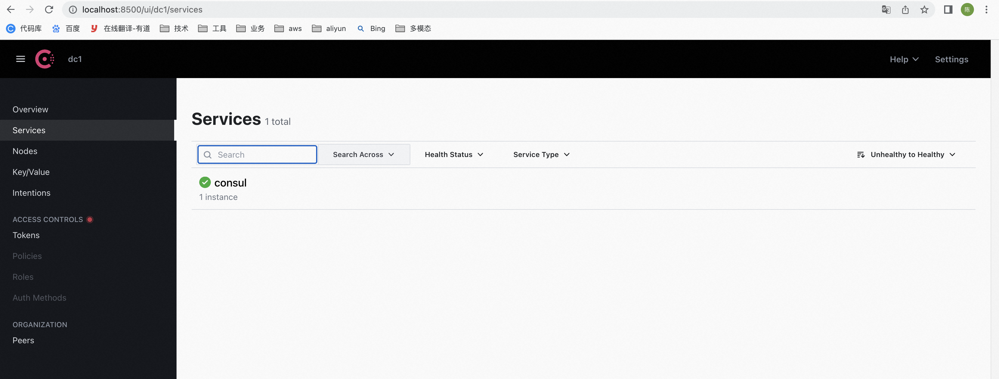

**笔记来源：**[**尚硅谷SpringCloud框架开发教程(SpringCloudAlibaba微服务分布式架构丨Spring Cloud)**](https://www.bilibili.com/video/BV18E411x7eT/?spm_id_from=333.337.search-card.all.click&vd_source=e8046ccbdc793e09a75eb61fe8e84a30)

# 1 Consul简介
[Consul官网](https://developer.hashicorp.com/consul/docs/intro)

**Consul是什么？**

Consul 是一套开源的分布式服务发现和配置管理系统，由 HashiCorp 公司<font style="color:#0000ff;">用 Go 语言开发。

提供了微服务系统中的服务治理、配置中心、控制总线等功能。这些功能中的每一个都可以根据需要单独使用，也可以一起使用以构建全方位的服务网格，总之Consul提供了一种完整的服务网格解决方案。

它具有很多优点。包括： 基于 raft 协议，比较简洁； 支持健康检查, 同时支持 HTTP 和 DNS 协议 支持跨数据中心的 WAN 集群 提供图形界面 跨平台，支持 Linux、Mac、Windows


Consul的功能：

+ 服务发现：提供HTTP和DNS两种发现方式。
+ 健康监测：支持多种方式，HTTP、TCP、Docker、Shell脚本定制化监控
+ KV存储：Key、Value的存储方式
+ 多数据中心：Consul支持多数据中心
+ 可视化Web界面


下载地址：[Consul下载地址](https://developer.hashicorp.com/consul/downloads)

中文文档：[Consul中文文档](https://www.springcloud.cc/spring-cloud-consul.html)

# 2 安装Consul
下载地址：[Consul下载地址](https://developer.hashicorp.com/consul/downloads)

本次采用的是mac安装

1. 下载安装包

   

2. 启动服务：使用开发者模式启动

   ```shell
    /Users/admin/Desktop/consul agent -dev
   ```

   

3. 访问：[http://localhost:8500](http://localhost:8500)

   

# 3 服务提供者
创建步骤

1. 新建Module
    1. 新建Module

       

    2. 填写Module名称


       

    3. 点击完成

2. 改POM

    ```xml
    <?xml version="1.0" encoding="UTF-8"?>
    <project xmlns="http://maven.apache.org/POM/4.0.0"
             xmlns:xsi="http://www.w3.org/2001/XMLSchema-instance"
             xsi:schemaLocation="http://maven.apache.org/POM/4.0.0 http://maven.apache.org/xsd/maven-4.0.0.xsd">
        <parent>
            <artifactId>cloud2020</artifactId>
            <groupId>com.atguigu.springcloud</groupId>
            <version>1.0-SNAPSHOT</version>
        </parent>
        <modelVersion>4.0.0</modelVersion>

        <artifactId>cloud-providerconsul-payment8006</artifactId>

        <properties>
            <maven.compiler.source>8</maven.compiler.source>
            <maven.compiler.target>8</maven.compiler.target>
        </properties>

        <dependencies>
            <!-- 引入自己定义的api通用包，可以使用Payment支付Entity -->
            <dependency>
                <groupId>com.atguigu.springcloud</groupId>
                <artifactId>cloud-api-commons</artifactId>
                <version>${project.version}</version>
            </dependency>
            <!--SpringCloud consul-server -->
            <dependency>
                <groupId>org.springframework.cloud</groupId>
                <artifactId>spring-cloud-starter-consul-discovery</artifactId>
            </dependency>
            <!-- SpringBoot整合Web组件 -->
            <dependency>
                <groupId>org.springframework.boot</groupId>
                <artifactId>spring-boot-starter-web</artifactId>
            </dependency>
            <dependency>
                <groupId>org.springframework.boot</groupId>
                <artifactId>spring-boot-starter-actuator</artifactId>
            </dependency>
            <!--日常通用jar包配置-->
            <dependency>
                <groupId>org.springframework.boot</groupId>
                <artifactId>spring-boot-devtools</artifactId>
                <scope>runtime</scope>
                <optional>true</optional>
            </dependency>
            <dependency>
                <groupId>org.projectlombok</groupId>
                <artifactId>lombok</artifactId>
                <optional>true</optional>
            </dependency>
            <dependency>
                <groupId>org.springframework.boot</groupId>
                <artifactId>spring-boot-starter-test</artifactId>
                <scope>test</scope>
            </dependency>
            <dependency>
                <groupId>cn.hutool</groupId>
                <artifactId>hutool-all</artifactId>
                <version>RELEASE</version>
                <scope>test</scope>
            </dependency>
            <dependency>
                <groupId>cn.hutool</groupId>
                <artifactId>hutool-all</artifactId>
                <version>RELEASE</version>
                <scope>test</scope>
            </dependency>
        </dependencies>
    </project>
    ```


3. 改YML

   ```yaml
   ###consul服务端口号
   server:
     port: 8006

   spring:
     application:
       name: consul-provider-payment
     ####consul注册中心地址
     cloud:
       consul:
         host: localhost
         port: 8500
         discovery:
           #hostname: 127.0.0.1
           service-name: ${spring.application.name}
   ```


4. 主启动

   ```java
   package com.atguigu.springcloud;

   import org.springframework.boot.SpringApplication;
   import org.springframework.boot.autoconfigure.SpringBootApplication;
   import org.springframework.cloud.client.discovery.EnableDiscoveryClient;

   /**
    * @auther zzyy
    * @create 2020-02-19 16:05
    */
   @SpringBootApplication
   @EnableDiscoveryClient
   public class PaymentMain8006
   {
       public static void main(String[] args) {
               SpringApplication.run(PaymentMain8006.class, args);
       }
   }
   ```


5. 业务类Controller

   ```java
   package com.atguigu.springcloud.controller;

   import lombok.extern.slf4j.Slf4j;
   import org.springframework.beans.factory.annotation.Value;
   import org.springframework.web.bind.annotation.RequestMapping;
   import org.springframework.web.bind.annotation.RestController;

   import java.util.UUID;

   /**
    * @auther zzyy
    * @create 2020-02-19 16:06
    */
   @RestController
   @Slf4j
   public class PaymentController
   {
       @Value("${server.port}")
       private String serverPort;

       @RequestMapping(value = "/payment/consul")
       public String paymentConsul()
       {
           return "springcloud with consul: "+serverPort+"\t   "+ UUID.randomUUID().toString();
       }
   }
   ```


6. 验证测试

   

# 4 服务消费者
创建步骤

1. 新建Module
    1. 创建Module

       

    2. 填写Module名称


       

    3. 点击完成

2. 改POM

    ```xml
    <?xml version="1.0" encoding="UTF-8"?>
    <project xmlns="http://maven.apache.org/POM/4.0.0"
             xmlns:xsi="http://www.w3.org/2001/XMLSchema-instance"
             xsi:schemaLocation="http://maven.apache.org/POM/4.0.0 http://maven.apache.org/xsd/maven-4.0.0.xsd">
        <parent>
            <artifactId>cloud2020</artifactId>
            <groupId>com.atguigu.springcloud</groupId>
            <version>1.0-SNAPSHOT</version>
        </parent>
        <modelVersion>4.0.0</modelVersion>

        <artifactId>cloud-consumerconsul-order80</artifactId>

        <properties>
            <maven.compiler.source>8</maven.compiler.source>
            <maven.compiler.target>8</maven.compiler.target>
        </properties>
        <dependencies>
            <!--SpringCloud consul-server -->
            <dependency>
                <groupId>org.springframework.cloud</groupId>
                <artifactId>spring-cloud-starter-consul-discovery</artifactId>
            </dependency>
            <!-- SpringBoot整合Web组件 -->
            <dependency>
                <groupId>org.springframework.boot</groupId>
                <artifactId>spring-boot-starter-web</artifactId>
            </dependency>
            <dependency>
                <groupId>org.springframework.boot</groupId>
                <artifactId>spring-boot-starter-actuator</artifactId>
            </dependency>
            <!--日常通用jar包配置-->
            <dependency>
                <groupId>org.springframework.boot</groupId>
                <artifactId>spring-boot-devtools</artifactId>
                <scope>runtime</scope>
                <optional>true</optional>
            </dependency>
            <dependency>
                <groupId>org.projectlombok</groupId>
                <artifactId>lombok</artifactId>
                <optional>true</optional>
            </dependency>
            <dependency>
                <groupId>org.springframework.boot</groupId>
                <artifactId>spring-boot-starter-test</artifactId>
                <scope>test</scope>
            </dependency>
        </dependencies>
    </project>
    ```


3. YML

   ```yaml
   ###consul服务端口号
   server:
     port: 80

   spring:
     application:
       name: cloud-consumer-order
     ####consul注册中心地址
     cloud:
       consul:
         host: localhost
         port: 8500
         discovery:
           #hostname: 127.0.0.1
           service-name: ${spring.application.name}
   ```


4. 主启动

   ```java
   package com.atguigu.springcloud;

   import org.springframework.boot.SpringApplication;
   import org.springframework.boot.autoconfigure.SpringBootApplication;
   import org.springframework.cloud.client.discovery.EnableDiscoveryClient;

   /**
    * @auther zzyy
    * @create 2020-02-19 16:22
    */
   @SpringBootApplication
   @EnableDiscoveryClient //该注解用于向使用consul或者zookeeper作为注册中心时注册服务
   public class OrderConsulMain80
   {
       public static void main(String[] args) {
               SpringApplication.run(OrderConsulMain80.class, args);
       }
   }
   ```


5. 配置Bean

   ```java
   package com.atguigu.springcloud.config;

   import org.springframework.cloud.client.loadbalancer.LoadBalanced;
   import org.springframework.context.annotation.Bean;
   import org.springframework.context.annotation.Configuration;
   import org.springframework.web.client.RestTemplate;

   /**
    * @auther zzyy
    * @create 2020-02-19 15:20
    */
   @Configuration
   public class ApplicationContextConfig
   {
       @Bean
       @LoadBalanced
       public RestTemplate getRestTemplate()
       {
           return new RestTemplate();
       }
   }
   ```


6. Cotroller

   ```java
   package com.atguigu.springcloud.controller;

   import lombok.extern.slf4j.Slf4j;
   import org.springframework.web.bind.annotation.GetMapping;
   import org.springframework.web.bind.annotation.RestController;
   import org.springframework.web.client.RestTemplate;

   import javax.annotation.Resource;

   /**
    * @auther zzyy
    * @create 2020-02-19 16:24
    */
   @RestController
   @Slf4j
   public class OrderConsulController
   {
       public static final String INVOKE_URL = "http://consul-provider-payment";

       @Resource
       private RestTemplate restTemplate;

       @GetMapping(value = "/consumer/payment/consul")
       public String paymentInfo()
       {
           String result = restTemplate.getForObject(INVOKE_URL+"/payment/consul",String.class);
           return result;
       }
   }
   ```


7. 验证测试

     

   

# 5 三个注册中心的比较
