**笔记来源：**[**尚硅谷SpringCloud框架开发教程(SpringCloudAlibaba微服务分布式架构丨Spring Cloud)**](https://www.bilibili.com/video/BV18E411x7eT/?spm_id_from=333.337.search-card.all.click&vd_source=e8046ccbdc793e09a75eb61fe8e84a30)

# 1 概述
Ribbon是什么？Spring Cloud Ribbon是基于Netflix Ribbon实现的一套客户端负载均衡的工具。

简单的说，Ribbon 是 Netflix 发布的开源项目，主要功能是提供客户端的软件负载均衡算法和服务调用。Ribbon客户端组件提供一系列完善的配置项如连接超时，重试等。简单的说，就是在配置文件中列出Load Balancer（简称LB）后面所有的机器，Ribbon 会自动的帮助你基于某种规则（如简单轮询，随机连接等）去连接这些机器。我们很容易使用Ribbon实现自定义的负载均衡算法。

Ribbon代码库：[Github地址](https://github.com/Netflix/ribbon/wiki/Getting-Started)

Ribbon目前也进入了维护模式：

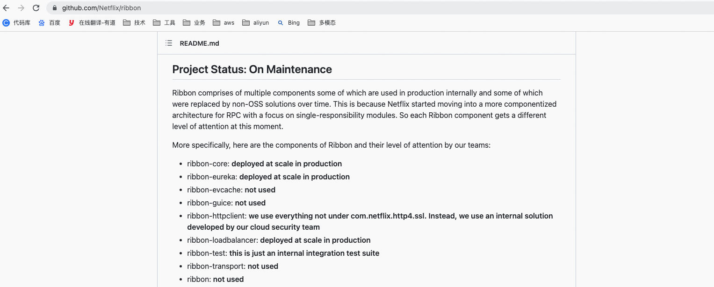

Ribbon的主要功能：

LB负载均衡(Load Balance)是什么？简单的说就是将用户的请求平摊的分配到多个服务上，从而达到系统的HA（高可用）。常见的负载均衡有软件Nginx，LVS，硬件 F5等。

Ribbon本地负载均衡客户端 与 Nginx服务端负载均衡区别：

- Nginx是服务器负载均衡，客户端所有请求都会交给nginx，然后由nginx实现转发请求。即负载均衡是由服务端实现的。
- Ribbon本地负载均衡，在调用微服务接口时候，会在注册中心上获取注册信息服务列表之后缓存到JVM本地，从而在本地实现RPC远程服务调用技术。

LB（负载均衡）

+ 集中式LB：即在服务的消费方和提供方之间使用独立的LB设施(可以是硬件，如F5, 也可以是软件，如nginx), 由该设施负责把访问请求通过某种策略转发至服务的提供方；
+ 进程内LB：将LB逻辑集成到消费方，消费方从服务注册中心获知有哪些地址可用，然后自己再从这些地址中选择出一个合适的服务器。Ribbon就属于进程内LB，它只是一个类库，集成于消费方进程，消费方通过它来获取到服务提供方的地址。

**一句话：Ribbon配合RestTemplate可实现负载均衡调用**

# 2 Ribbon负载均衡演示
架构说明：

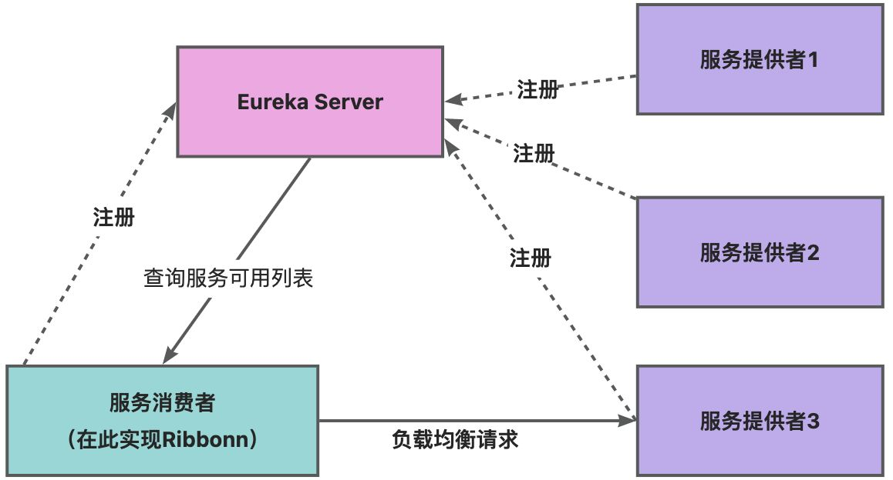

Ribbon在工作时分成两步：

- 第一步先选择 EurekaServer ,它优先选择在同一个区域内负载较少的server.
- 第二步再根据用户指定的策略，在从server取到的服务注册列表中选择一个地址。

其中Ribbon提供了多种策略：比如轮询、随机和根据响应时间加权。

总结：Ribbon其实就是一个软负载均衡的客户端组件，他可以和其他所需请求的客户端结合使用，和eureka结合只是其中的一个实例。

POM说明：

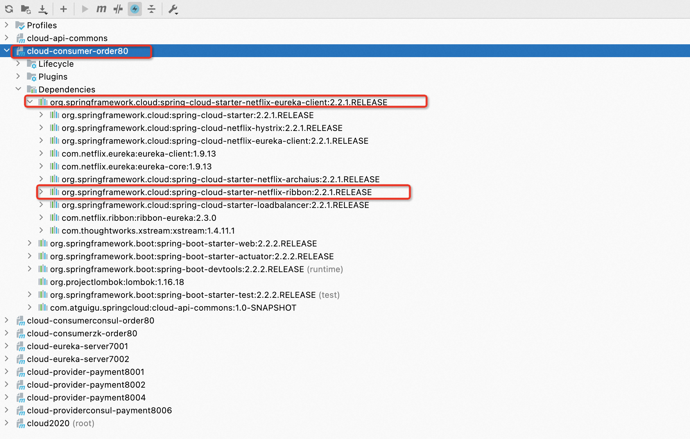

在消费者端，引入了Eureka客户端的依赖包之后，已经自动的为我们引入了Ribbon的依赖包。

还可以这样看：

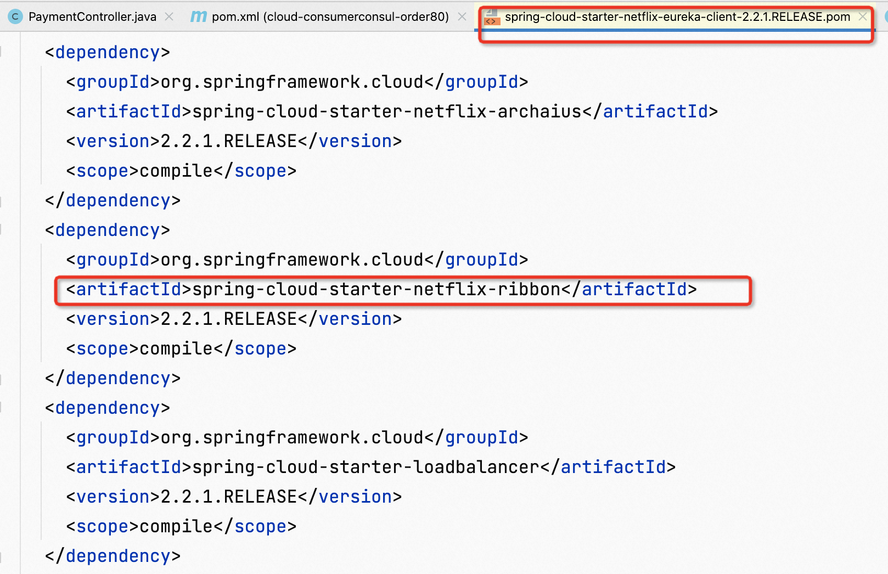

再次说说RestTemplate的使用

官网：[RestTemplate官网](https://docs.spring.io/spring-framework/docs/5.2.2.RELEASE/javadoc-api/org/springframework/web/client/RestTemplate.html)

核心方法：

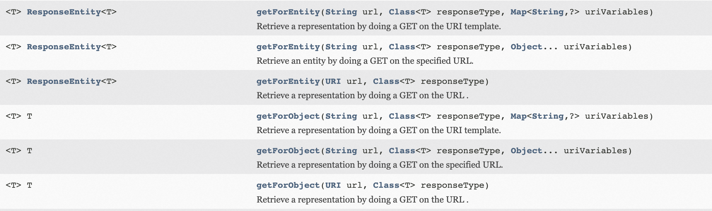

getForObject 方法 getForEntity方法区别：

+ getForObject：返回对象为响应体中数据转化成的对象，基本上可以理解为Json

  ```java
  @GetMapping("/consumer/payment/get/{id}")
  public CommonResult<Payment> getPayment(@PathVariable("id") Long id)
  {
      return restTemplate.getForObject(PAYMENT_URL+"/payment/get/"+id,CommonResult.class);
  }
  ```


+ getForEntity：返回对象为ResponseEntity对象，包含了响应中的一些重要信息，比如响应头、响应状态码、响应体等

  ```java
  @GetMapping("/consumer/payment/getForEntity/{id}")
  public CommonResult<Payment> getPayment2(@PathVariable("id") Long id)
  {
      ResponseEntity<CommonResult> entity = restTemplate.getForEntity(PAYMENT_URL+"/payment/get/"+id,CommonResult.class);

      if(entity.getStatusCode().is2xxSuccessful()){
          return entity.getBody();
      }else{
          return new CommonResult<>(444,"操作失败");
      }
  }
  ```

  ​

# 3 核心组建IRule
IRule：根据特定算法中从服务列表中选取一个要访问的服务

类图如下：

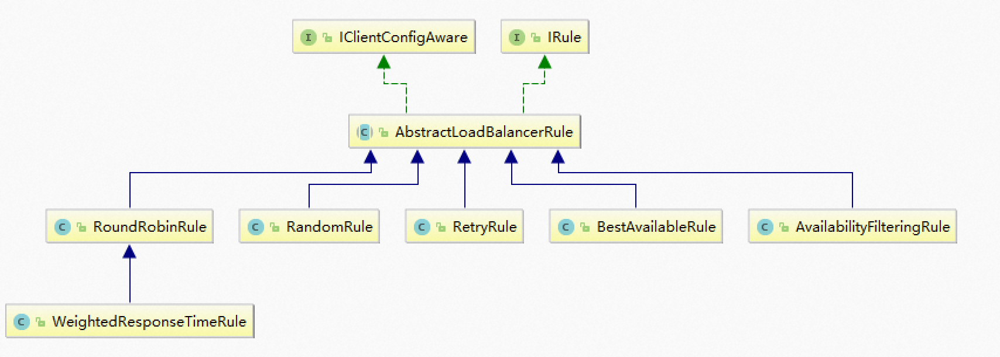

+ `com.netflix.loadbalancer.RoundRobinRule` ：轮询
+ `com.netflix.loadbalancer.RandomRule` ：随机
+ `com.netflix.loadbalancer.RetryRule` ：先按照RoundRobinRule的策略获取服务，如果获取服务失败则在指定时间内会进行重试，获取可用的服务
+ `WeightedResponseTimeRule` ：对RoundRobinRule的扩展，响应速度越快的实例选择权重越大，越容易被选择
+ `BestAvailableRule` ：会先过滤掉由于多次访问故障而处于断路器跳闸状态的服务，然后选择一个并发量最小的服务
+ `AvailabilityFilteringRule` ：先过滤掉故障实例，再选择并发较小的实例
+ `ZoneAvoidanceRule` ：默认规则,复合判断server所在区域的性能和server的可用性选择服务器


**如何替换指定算法，需要注意以下细节：**

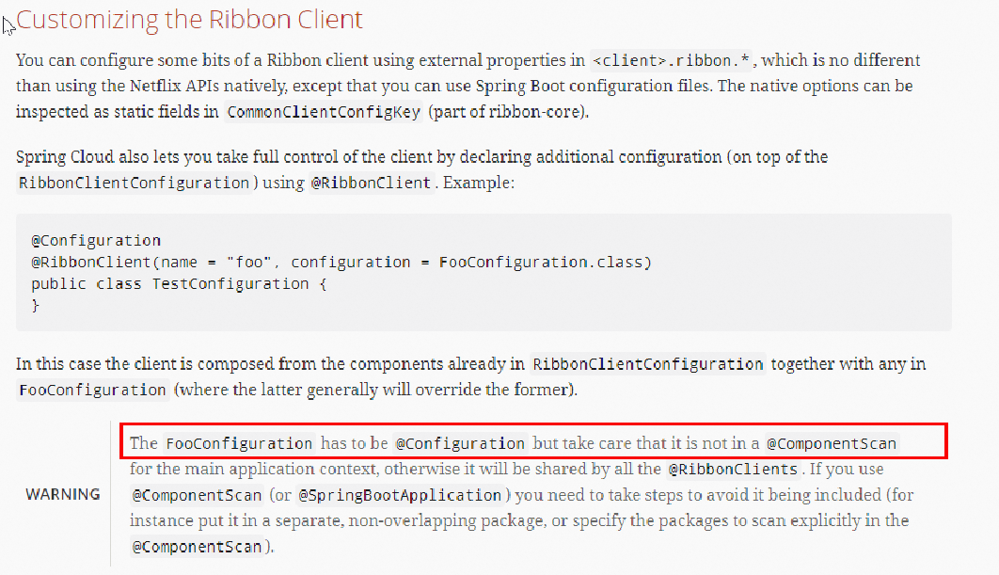

官方文档明确给出了警告：

这个自定义配置类不能放在`@ComponentScan`所扫描的当前包下以及子包下，

否则我们自定义的这个配置类就会被所有的Ribbon客户端所共享，达不到特殊化定制的目的了。

特殊化定制步骤：

1. 新建package：`com.atguigu.myrule`  

   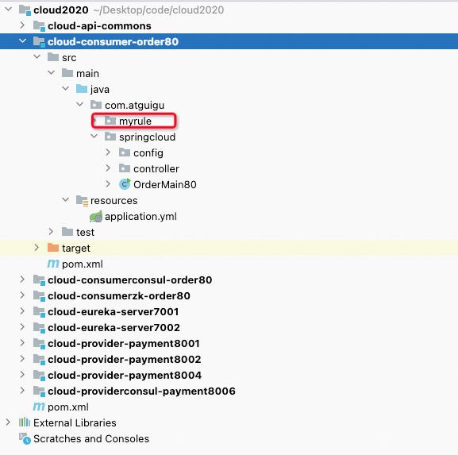  

2. 上面包下新建MySelfRule规则类

   ```java
   package com.atguigu.myrule;

   import com.netflix.loadbalancer.IRule;
   import com.netflix.loadbalancer.RandomRule;
   import org.springframework.context.annotation.Bean;

   public class MySelfRule {
       @Bean
       public IRule myRule()
       {
           return new RandomRule();//定义为随机
       }
   }
   ```


3. 主启动类添加`@RibbonClient` 

   ```java
   package com.atguigu.springcloud;

   import com.atguigu.myrule.MySelfRule;
   import org.springframework.boot.SpringApplication;
   import org.springframework.boot.autoconfigure.SpringBootApplication;
   import org.springframework.cloud.netflix.eureka.EnableEurekaClient;
   import org.springframework.cloud.netflix.ribbon.RibbonClient;

   @SpringBootApplication
   @EnableEurekaClient
   @RibbonClient(name = "CLOUD-PAYMENT-SERVICE",configuration= MySelfRule.class)
   public class OrderMain80 {
       public static void main(String[] args) {
           SpringApplication.run(OrderMain80.class);
       }
   }
   ```


4. 测试：分别先启动7001，7002，8001，8002，80服务，看是否达到随机的效果

# 4 Ribbon负载均衡算法
轮训负载均衡算法原理：

>负载均衡算法：rest接口第几次请求数 % 服务器集群总数量 = 实际调用服务器位置下标  ，每次服务重启动后rest接口计数从1开始。
>
>```java
>List instances = discoveryClient.getInstances("CLOUD-PAYMENT-SERVICE");
>```
>
>如：   
>
>List [0] instances = 127.0.0.1:8002
>
>List [1] instances = 127.0.0.1:8001
>
>8001+ 8002 组合成为集群，它们共计2台机器，集群总数为2， 按照轮询算法原理：
>
>当总请求数为1时： 1 % 2 =1 对应下标位置为1 ，则获得服务地址为127.0.0.1:8001
>
>当总请求数位2时： 2 % 2 =0 对应下标位置为0 ，则获得服务地址为127.0.0.1:8002
>
>当总请求数位3时： 3 % 2 =1 对应下标位置为1 ，则获得服务地址为127.0.0.1:8001
>
>当总请求数位4时： 4 % 2 =0 对应下标位置为0 ，则获得服务地址为127.0.0.1:8002
>
>如此类推......

源码如下

```java
/*
 *
 * Copyright 2013 Netflix, Inc.
 *
 * Licensed under the Apache License, Version 2.0 (the "License");
 * you may not use this file except in compliance with the License.
 * You may obtain a copy of the License at
 *
 * http://www.apache.org/licenses/LICENSE-2.0
 *
 * Unless required by applicable law or agreed to in writing, software
 * distributed under the License is distributed on an "AS IS" BASIS,
 * WITHOUT WARRANTIES OR CONDITIONS OF ANY KIND, either express or implied.
 * See the License for the specific language governing permissions and
 * limitations under the License.
 *
 */
package com.netflix.loadbalancer;

import com.netflix.client.config.IClientConfig;
import org.slf4j.Logger;
import org.slf4j.LoggerFactory;

import java.util.List;
import java.util.concurrent.atomic.AtomicInteger;

/**
 * The most well known and basic load balancing strategy, i.e. Round Robin Rule.
 *
 * @author stonse
 * @author Nikos Michalakis <nikos@netflix.com>
 *
 */
public class RoundRobinRule extends AbstractLoadBalancerRule {

    private AtomicInteger nextServerCyclicCounter;  //第几次请求接口，开始是0
    private static final boolean AVAILABLE_ONLY_SERVERS = true;
    private static final boolean ALL_SERVERS = false;

    private static Logger log = LoggerFactory.getLogger(RoundRobinRule.class);

    public RoundRobinRule() {
        nextServerCyclicCounter = new AtomicInteger(0);
    }

    public RoundRobinRule(ILoadBalancer lb) {
        this();
        setLoadBalancer(lb);
    }

    public Server choose(ILoadBalancer lb, Object key) {
        if (lb == null) {
            log.warn("no load balancer");
            return null;
        }

        Server server = null;
        int count = 0;
        while (server == null && count++ < 10) {
            List<Server> reachableServers = lb.getReachableServers();
            List<Server> allServers = lb.getAllServers();
            int upCount = reachableServers.size();
            int serverCount = allServers.size();

            if ((upCount == 0) || (serverCount == 0)) {
                log.warn("No up servers available from load balancer: " + lb);
                return null;
            }

            int nextServerIndex = incrementAndGetModulo(serverCount);
            server = allServers.get(nextServerIndex);

            if (server == null) {
                /* Transient. */
                Thread.yield();
                continue;
            }

            if (server.isAlive() && (server.isReadyToServe())) {
                return (server);
            }

            // Next.
            server = null;
        }

        if (count >= 10) {
            log.warn("No available alive servers after 10 tries from load balancer: "
                    + lb);
        }
        return server;
    }

    /**
     * Inspired by the implementation of {@link AtomicInteger#incrementAndGet()}.
     *
     * @param modulo The modulo to bound the value of the counter.
     * @return The next value.
     */
    private int incrementAndGetModulo(int modulo) {
        for (;;) {
            int current = nextServerCyclicCounter.get();
            int next = (current + 1) % modulo;      //用第几次请求 和 集群中服务的数量做取模运算
            if (nextServerCyclicCounter.compareAndSet(current, next))  
                return next;
        }
    }

    @Override
    public Server choose(Object key) {
        return choose(getLoadBalancer(), key);
    }

    @Override
    public void initWithNiwsConfig(IClientConfig clientConfig) {
    }
}

```

我们自己实现一个负载均衡器试试，步骤如下：

1. 7001/7002启动

2. 8001/8002微服务改造如下：

   ```java
   @GetMapping(value = "/payment/lb")
   public String getPaymentLB(){
       return port;
   }
   ```


3. 消费者微服务改造如下：

   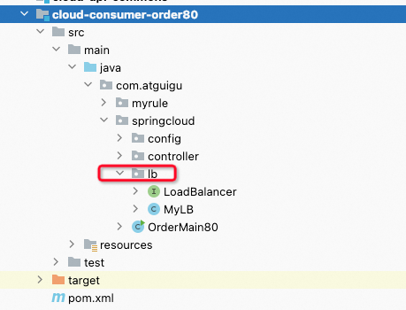    

   1. ApplicationContextBean去掉 @LoadBalanced  注解

      ```java
      package com.atguigu.springcloud.config;

      import org.springframework.cloud.client.loadbalancer.LoadBalanced;
      import org.springframework.context.annotation.Bean;
      import org.springframework.context.annotation.Configuration;
      import org.springframework.web.client.RestTemplate;

      @Configuration
      public class ApplicationContextConfig {

          @Bean
          //@LoadBalanced
          public RestTemplate getRestTemplate(){
              return new RestTemplate();
          }
      }
      ```

   2. LoadBalancer接口

      ```java
      package com.atguigu.springcloud.lb;

      import org.springframework.cloud.client.ServiceInstance;

      import java.util.List;

      public interface LoadBalancer {
          ServiceInstance instances(List<ServiceInstance> serviceInstances);
      }
      ```

   3. MyLB  

      ```java
      package com.atguigu.springcloud.lb;

      import org.springframework.cloud.client.ServiceInstance;
      import org.springframework.stereotype.Component;

      import java.util.List;
      import java.util.concurrent.atomic.AtomicInteger;

      /**
       * @auther zzyy
       * @create 2020-02-19 20:33
       */
      @Component
      public class MyLB implements LoadBalancer{

          private AtomicInteger atomicInteger = new AtomicInteger(0);

          public final int getAndIncrement()
          {
              int current;
              int next;

              do {
                  current = this.atomicInteger.get();
                  next = current >= 2147483647 ? 0 : current + 1;
              }while(!this.atomicInteger.compareAndSet(current,next));
              System.out.println("*****第几次访问，次数next: "+next);
              return next;
          }

          //负载均衡算法：rest接口第几次请求数 % 服务器集群总数量 = 实际调用服务器位置下标  ，每次服务重启动后rest接口计数从1开始。
          @Override
          public ServiceInstance instances(List<ServiceInstance> serviceInstances)
          {
              int index = getAndIncrement() % serviceInstances.size();

              return serviceInstances.get(index);
          }

      }
      ```

   4. OrderController类

      ```java
      @Resource
      private LoadBalancer loadBalancer;

      @Resource
      private DiscoveryClient discoveryClient;

      @GetMapping(value = "/consumer/payment/lb")
      public String getPaymentLB(){
              List<ServiceInstance> instances = discoveryClient.getInstances("CLOUD-PAYMENT-SERVICE");

              if(instances == null || instances.size() <= 0)
              {
                  return null;
              }

              ServiceInstance serviceInstance = loadBalancer.instances(instances);
              URI uri = serviceInstance.getUri();

              return restTemplate.getForObject(uri+"/payment/lb",String.class);

      }
      ```


4. 测试

   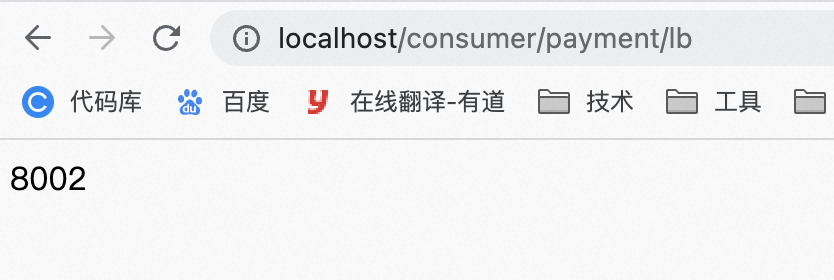

   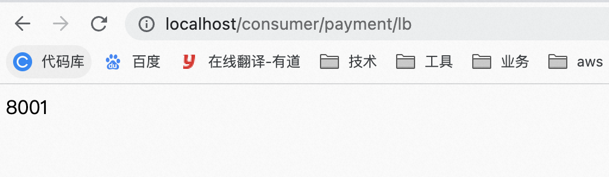

