**笔记来源：**[**尚硅谷SpringCloud框架开发教程(SpringCloudAlibaba微服务分布式架构丨Spring Cloud)**](https://www.bilibili.com/video/BV18E411x7eT/?spm_id_from=333.337.search-card.all.click&vd_source=e8046ccbdc793e09a75eb61fe8e84a30)

# 1 概述
前言：分布式系统面临的问题

复杂分布式体系结构中的应用程序有数十个依赖关系，每个依赖关系在某些时候将不可避免地失败。

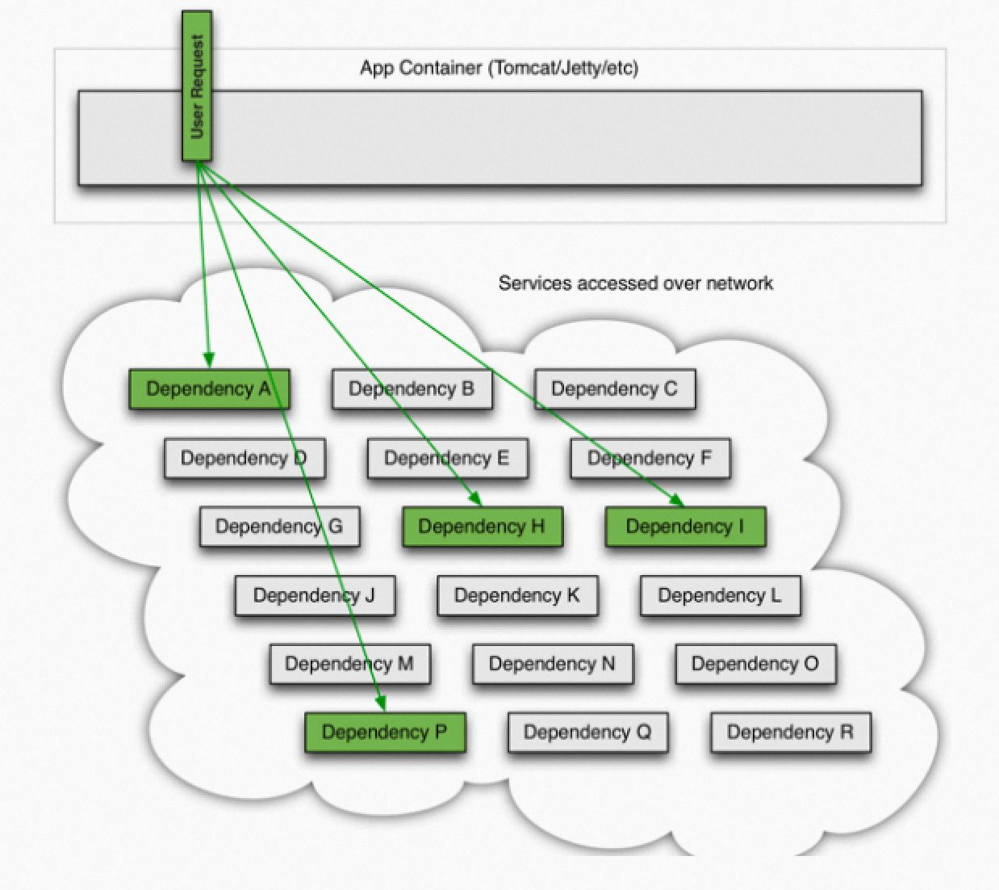


上图中的请求需要调用A，P，H，I 四个服务，如果一切顺利则没有什么问题，关键是如果A服务超时会出现什么情况呢？服务雪崩

多个微服务之间调用的时候，假设微服务A调用微服务B和微服务C，微服务B和微服务C又调用其它的微服务，这就是所谓的“扇出”。如果扇出的链路上某个微服务的调用响应时间过长或者不可用，对微服务A的调用就会占用越来越多的系统资源，进而引起系统崩溃，所谓的“雪崩效应”.

对于高流量的应用来说，单一的后端依赖可能会导致所有服务器上的所有资源都在几秒钟内饱和。比失败更糟糕的是，这些应用程序还可能导致服务之间的延迟增加，备份队列，线程和其他系统资源紧张，导致整个系统发生更多的级联故障。这些都表示需要对故障和延迟进行隔离和管理，以便单个依赖关系的失败，不能取消整个应用程序或系统。

所以，通常当你发现一个模块下的某个实例失败后，这时候这个模块依然还会接收流量，然后这个有问题的模块还调用了其他的模块，这样就会发生级联故障，或者叫雪崩。

**Hystrix的概念：**  Hystrix是一个用于处理分布式系统的延迟和容错的开源库，在分布式系统里，许多依赖不可避免的会调用失败，比如超时、异常等，Hystrix能够保证在一个依赖出问题的情况下，不会导致整体服务失败，避免级联故障，以提高分布式系统的弹性。

“断路器” 本身是一种开关装置，当某个服务单元发生故障之后，通过断路器的故障监控（类似熔断保险丝），向调用方返回一个符合预期的、可处理的备选响应（FallBack），而不是长时间的等待或者抛出调用方无法处理的异常，这样就保证了服务调用方的线程不会被长时间、不必要地占用，从而避免了故障在分布式系统中的蔓延，乃至雪崩。

**Hystrix的功能：**

+ 服务降级
+ 服务熔断
+ 接近实时的监控
+ 服务限流
+ 服务隔离
+ ...等等


官网：[Hystrix官网地址](https://github.com/Netflix/Hystrix/wiki/How-To-Use)

Hystrix官宣，停更进维

+ 被动修复bugs
+ 不再接受合并请求
+ 不再发布新版本


# 2 Hystrix重要概念
+ **服务降级：**  服务器忙，请稍后再试，不让客户端等待并立刻返回一个友好提示，fallback
    - 哪些情况会出发降级？
        * 程序运行异常
        * 超时
        * 服务熔断触发服务降级
        * 线程池/信号量打满也会导致服务降级
+ **服务熔断**：类比保险丝达到最大服务访问后，直接拒绝访问，拉闸限电，然后调用服务降级的方法并返回友好提示
    - 就是保险丝，服务的降级->进而熔断->恢复调用链路
+ **服务限流**：秒杀高并发等操作，严禁一窝蜂的过来拥挤，大家排队，一秒钟N个，有序进行

# 3 Hystrix案例
## 3.1 构建案例
构建步骤：

1. 创建新Module
    1. 新建Module

       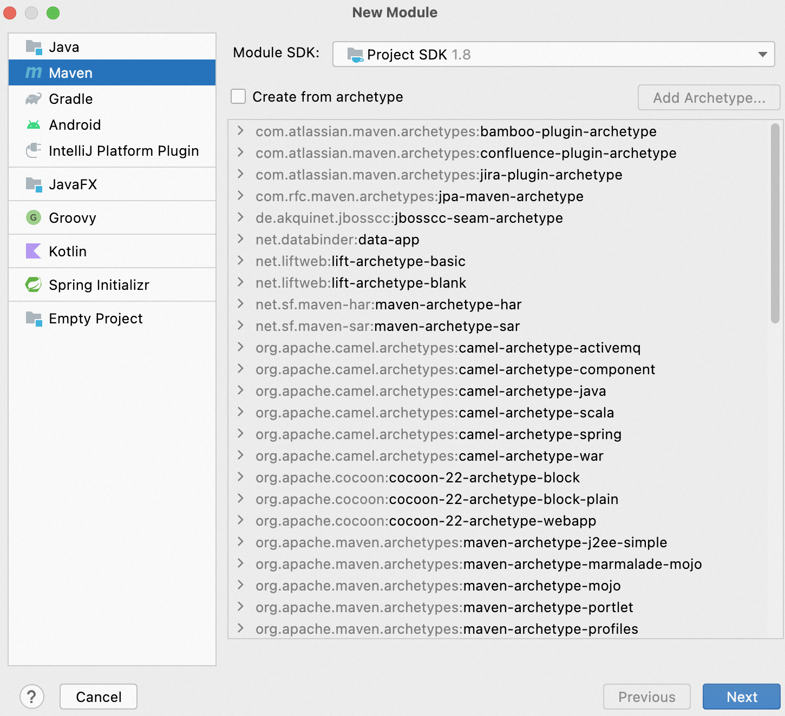

    2. 填写Module名称


       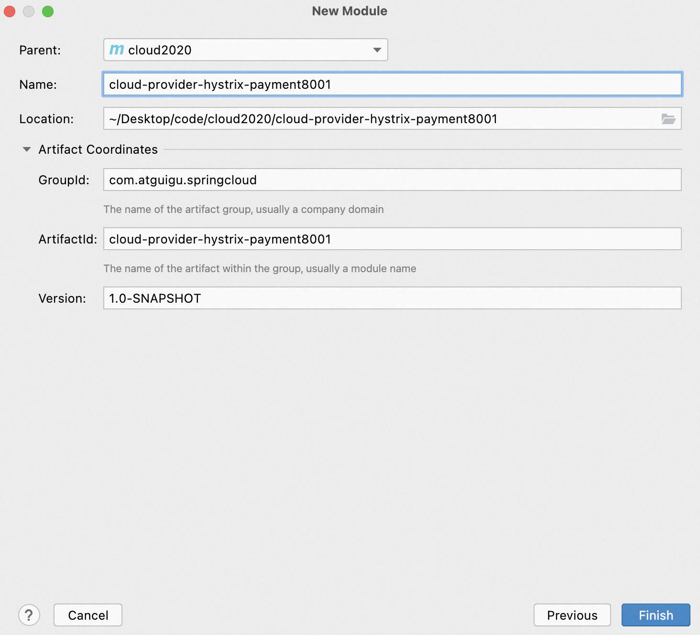

    3. 点击完成

2. POM

    ```xml
    <?xml version="1.0" encoding="UTF-8"?>
    <project xmlns="http://maven.apache.org/POM/4.0.0"
             xmlns:xsi="http://www.w3.org/2001/XMLSchema-instance"
             xsi:schemaLocation="http://maven.apache.org/POM/4.0.0 http://maven.apache.org/xsd/maven-4.0.0.xsd">
        <parent>
            <artifactId>cloud2020</artifactId>
            <groupId>com.atguigu.springcloud</groupId>
            <version>1.0-SNAPSHOT</version>
        </parent>
        <modelVersion>4.0.0</modelVersion>

        <artifactId>cloud-provider-hystrix-payment8001</artifactId>

        <properties>
            <maven.compiler.source>8</maven.compiler.source>
            <maven.compiler.target>8</maven.compiler.target>
        </properties>
        <dependencies>
            <!--hystrix-->
            <dependency>
                <groupId>org.springframework.cloud</groupId>
                <artifactId>spring-cloud-starter-netflix-hystrix</artifactId>
            </dependency>
            <!--eureka client-->
            <dependency>
                <groupId>org.springframework.cloud</groupId>
                <artifactId>spring-cloud-starter-netflix-eureka-client</artifactId>
            </dependency>
            <!--web-->
            <dependency>
                <groupId>org.springframework.boot</groupId>
                <artifactId>spring-boot-starter-web</artifactId>
            </dependency>
            <dependency>
                <groupId>org.springframework.boot</groupId>
                <artifactId>spring-boot-starter-actuator</artifactId>
            </dependency>
            <dependency><!-- 引入自己定义的api通用包，可以使用Payment支付Entity -->
                <groupId>com.atguigu.springcloud</groupId>
                <artifactId>cloud-api-commons</artifactId>
                <version>${project.version}</version>
            </dependency>
            <dependency>
                <groupId>org.springframework.boot</groupId>
                <artifactId>spring-boot-devtools</artifactId>
                <scope>runtime</scope>
                <optional>true</optional>
            </dependency>
            <dependency>
                <groupId>org.projectlombok</groupId>
                <artifactId>lombok</artifactId>
                <optional>true</optional>
            </dependency>
            <dependency>
                <groupId>org.springframework.boot</groupId>
                <artifactId>spring-boot-starter-test</artifactId>
                <scope>test</scope>
            </dependency>
        </dependencies>
    </project>
    ```


3. YML

   ```yaml
   server:
     port: 8001

   spring:
     application:
       name: cloud-provider-hystrix-payment

   eureka:
     client:
       register-with-eureka: true
       fetch-registry: true
       service-url:
         #defaultZone: http://eureka7001.com:7001/eureka,http://eureka7002.com:7002/eureka
         defaultZone: http://eureka7001.com:7001/eureka
   ```


4. 主启动

   ```java
   package com.atguigu.springcloud;

   import com.netflix.hystrix.contrib.metrics.eventstream.HystrixMetricsStreamServlet;
   import org.springframework.boot.SpringApplication;
   import org.springframework.boot.autoconfigure.SpringBootApplication;
   import org.springframework.boot.web.servlet.ServletRegistrationBean;
   import org.springframework.cloud.client.circuitbreaker.EnableCircuitBreaker;
   import org.springframework.cloud.netflix.eureka.EnableEurekaClient;
   import org.springframework.context.annotation.Bean;

   /**
    * @auther zzyy
    * @create 2020-02-20 11:10
    */
   @SpringBootApplication
   @EnableEurekaClient
   public class PaymentHystrixMain8001
   {
       public static void main(String[] args) {
               SpringApplication.run(PaymentHystrixMain8001.class, args);
       }
       
   }
   ```


5. 业务类

   ```java
   package com.atguigu.springcloud.controller;

   import com.atguigu.springcloud.service.PaymentService;
   import lombok.extern.slf4j.Slf4j;
   import org.springframework.beans.factory.annotation.Value;
   import org.springframework.web.bind.annotation.GetMapping;
   import org.springframework.web.bind.annotation.PathVariable;
   import org.springframework.web.bind.annotation.RestController;

   import javax.annotation.Resource;

   /**
    * @auther zzyy
    * @create 2020-02-20 11:15
    */
   @RestController
   @Slf4j
   public class PaymentController
   {
       @Resource
       private PaymentService paymentService;

       @Value("${server.port}")
       private String serverPort;

       @GetMapping("/payment/hystrix/ok/{id}")
       public String paymentInfo_OK(@PathVariable("id") Integer id)
       {
           String result = paymentService.paymentInfo_OK(id);
           log.info("*****result: "+result);
           return result;
       }

       @GetMapping("/payment/hystrix/timeout/{id}")
       public String paymentInfo_TimeOut(@PathVariable("id") Integer id)
       {
           String result = paymentService.paymentInfo_TimeOut(id);
           log.info("*****result: "+result);
           return result;
       }

   }
   ```

   ```java
   package com.atguigu.springcloud.service;

   import cn.hutool.core.util.IdUtil;
   import com.netflix.hystrix.contrib.javanica.annotation.HystrixCommand;
   import com.netflix.hystrix.contrib.javanica.annotation.HystrixProperty;
   import org.springframework.stereotype.Service;
   import org.springframework.web.bind.annotation.PathVariable;

   import java.util.UUID;
   import java.util.concurrent.TimeUnit;

   /**
    * @auther zzyy
    * @create 2020-02-20 11:11
    */
   @Service
   public class PaymentService
   {
       /**
        * 正常访问，肯定OK
        * @param id
        * @return
        */
       public String paymentInfo_OK(Integer id)
       {
           return "线程池:  "+Thread.currentThread().getName()+"  paymentInfo_OK,id:  "+id+"\t"+"O(∩_∩)O哈哈~";
       }

       public String paymentInfo_TimeOut(Integer id)
       {
           //int age = 10/0;
           try { TimeUnit.MILLISECONDS.sleep(3000); } catch (InterruptedException e) { e.printStackTrace(); }
           return "线程池:  "+Thread.currentThread().getName()+" id:  "+id+"\t"+"O(∩_∩)O哈哈~"+"  耗时(秒): ";
       }

   }
   ```


6. 正常测试
    1. 访问[http://localhost:8001/payment/hystrix/ok/31](http://localhost:8001/payment/hystrix/ok/31)，瞬间返回

       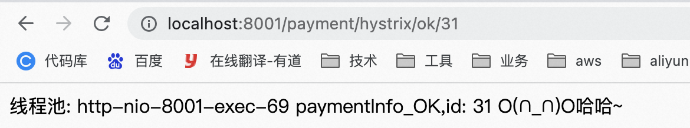


    2. 访问[http://localhost:8001/payment/hystrix/timeout/31](http://localhost:8001/payment/hystrix/timeout/31)，等待3s后返回，转圈


       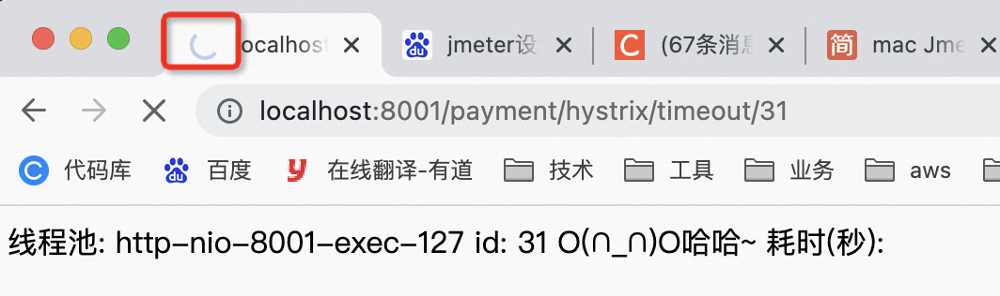

## 3.2 高并发测试
### 3.2.1 安装Jemter
下载地址： [Jmeter下载地址](https://jmeter.apache.org/download_jmeter.cgi)

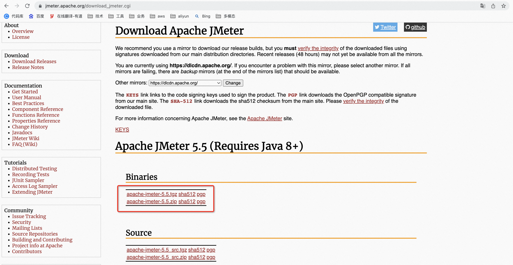

安装步骤：

1. 下载安装包
2. 解压安装包
3. 进入到bin目录下，双击执行jemter程序

   

4. 设置语言

   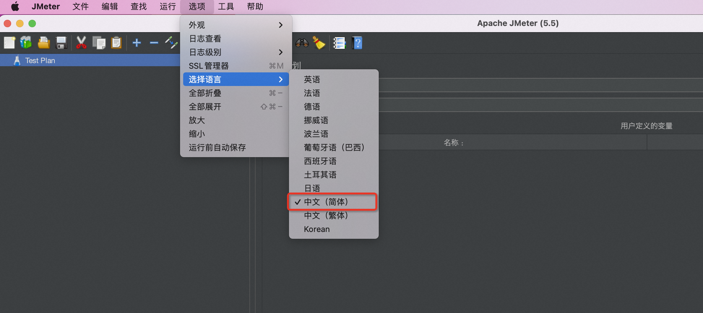

接下来Jemter就安装好了，就可以正常使用了。

### 3.2.2 Jemter开始压测
压测步骤：

1. 创建线程组

   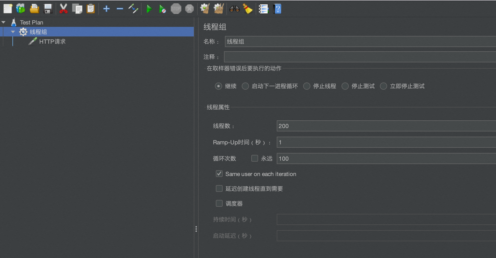

2. 创建Http请求，点击开始

   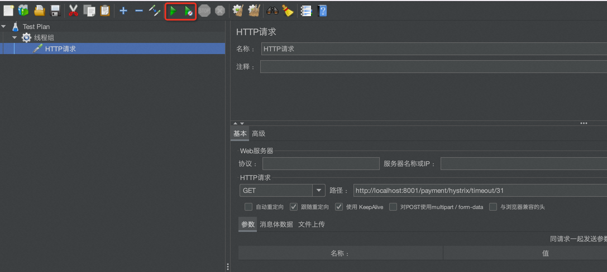

3. 我们再次访问那个之前秒回的链接：[http://localhost:8001/payment/hystrix/ok/31](http://localhost:8001/payment/hystrix/ok/31)

   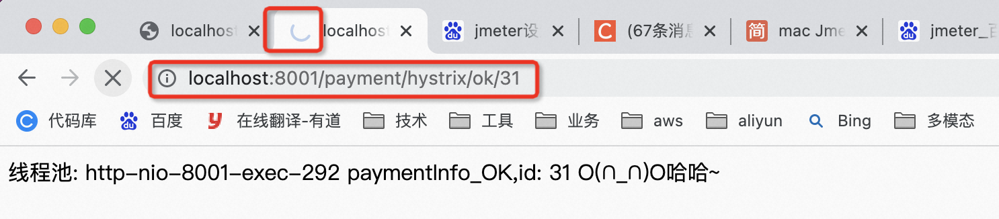

我们发现也开始转圈了，这是什么原因呢？**tomcat的默认的工作线程数被打满 了，没有多余的线程来分解压力和处理。**

结论：上面还是服务提供者8001自己测试，假如此时外部的消费者80也来访问，那消费者只能干等，最终导致消费端80不满意，服务端8001直接被拖死

看热闹不嫌弃事大，80端口消费者新建加入

### 3.2.3 构建80端口号服务
构建步骤：

1. 创建Module
    1. 创建Module

       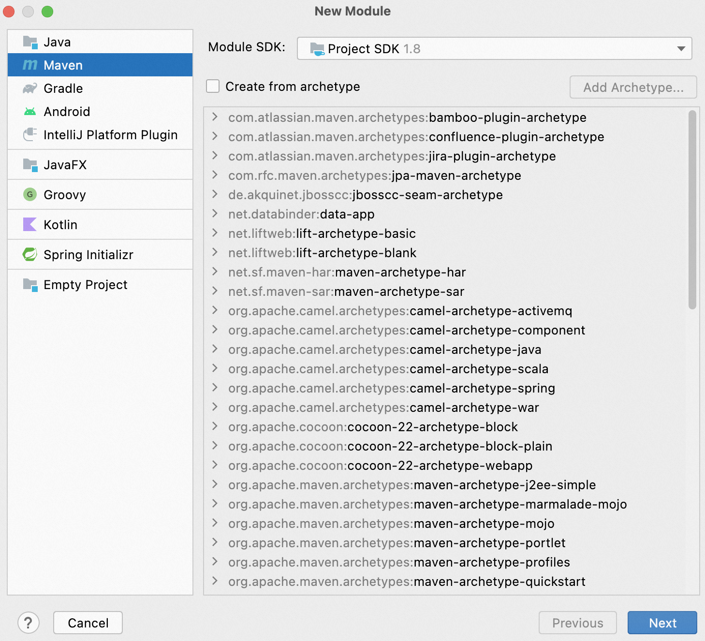


    2. 填写Module名称


       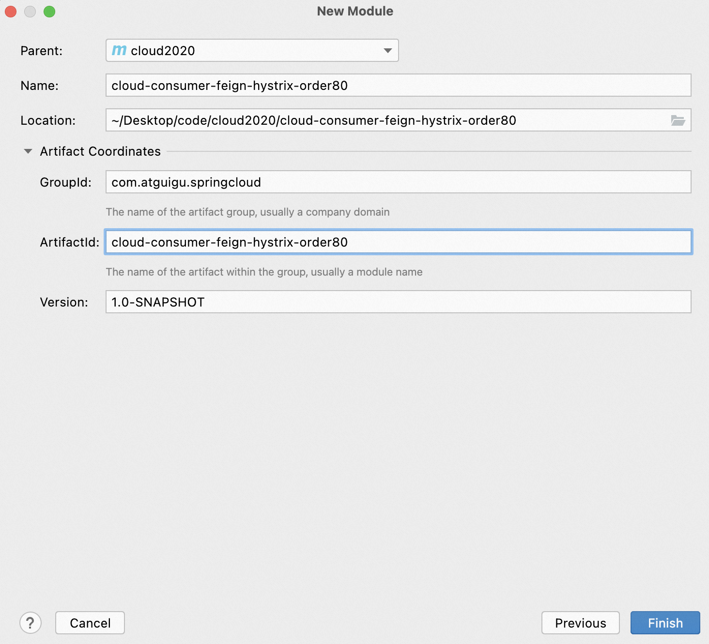


    3. 点击完成

2. POM

    ```xml
    <?xml version="1.0" encoding="UTF-8"?>
    <project xmlns="http://maven.apache.org/POM/4.0.0"
             xmlns:xsi="http://www.w3.org/2001/XMLSchema-instance"
             xsi:schemaLocation="http://maven.apache.org/POM/4.0.0 http://maven.apache.org/xsd/maven-4.0.0.xsd">
        <parent>
            <artifactId>cloud2020</artifactId>
            <groupId>com.atguigu.springcloud</groupId>
            <version>1.0-SNAPSHOT</version>
        </parent>
        <modelVersion>4.0.0</modelVersion>

        <artifactId>cloud-consumer-feign-hystrix-order80</artifactId>

        <properties>
            <maven.compiler.source>8</maven.compiler.source>
            <maven.compiler.target>8</maven.compiler.target>
        </properties>

        <dependencies>
            <!--openfeign-->
            <dependency>
                <groupId>org.springframework.cloud</groupId>
                <artifactId>spring-cloud-starter-openfeign</artifactId>
            </dependency>
            <!--hystrix-->
            <dependency>
                <groupId>org.springframework.cloud</groupId>
                <artifactId>spring-cloud-starter-netflix-hystrix</artifactId>
            </dependency>
            <!--eureka client-->
            <dependency>
                <groupId>org.springframework.cloud</groupId>
                <artifactId>spring-cloud-starter-netflix-eureka-client</artifactId>
            </dependency>
            <!-- 引入自己定义的api通用包，可以使用Payment支付Entity -->
            <dependency>
                <groupId>com.atguigu.springcloud</groupId>
                <artifactId>cloud-api-commons</artifactId>
                <version>${project.version}</version>
            </dependency>
            <!--web-->
            <dependency>
                <groupId>org.springframework.boot</groupId>
                <artifactId>spring-boot-starter-web</artifactId>
            </dependency>
            <dependency>
                <groupId>org.springframework.boot</groupId>
                <artifactId>spring-boot-starter-actuator</artifactId>
            </dependency>
            <!--一般基础通用配置-->
            <dependency>
                <groupId>org.springframework.boot</groupId>
                <artifactId>spring-boot-devtools</artifactId>
                <scope>runtime</scope>
                <optional>true</optional>
            </dependency>
            <dependency>
                <groupId>org.projectlombok</groupId>
                <artifactId>lombok</artifactId>
                <optional>true</optional>
            </dependency>
            <dependency>
                <groupId>org.springframework.boot</groupId>
                <artifactId>spring-boot-starter-test</artifactId>
                <scope>test</scope>
            </dependency>
        </dependencies>

    </project>
    ```


3. YML

   ```yaml
   server:
     port: 80

   eureka:
     client:
       register-with-eureka: true
       service-url:
         defaultZone: http://eureka7001.com:7001/eureka/
   ```


4. 主启动

   ```java
   package com.atguigu.springcloud;

   import org.springframework.boot.SpringApplication;
   import org.springframework.boot.autoconfigure.SpringBootApplication;
   import org.springframework.cloud.netflix.hystrix.EnableHystrix;
   import org.springframework.cloud.openfeign.EnableFeignClients;

   /**
    * @auther zzyy
    * @create 2020-02-04 16:32
    */
   @SpringBootApplication
   @EnableFeignClients
   public class OrderHystrixMain80
   {
       public static void main(String[] args)
       {
           SpringApplication.run(OrderHystrixMain80.class,args);
       }
   }

   ```


5. 业务类

   ```java
   package com.atguigu.springcloud.controller;

   import com.atguigu.springcloud.service.PaymentHystrixService;
   import lombok.extern.slf4j.Slf4j;
   import org.springframework.web.bind.annotation.GetMapping;
   import org.springframework.web.bind.annotation.PathVariable;
   import org.springframework.web.bind.annotation.RestController;

   import javax.annotation.Resource;

   /**
    * @auther zzyy
    * @create 2020-02-20 11:57
    */
   @RestController
   @Slf4j
   public class OrderHystirxController
   {
       @Resource
       private PaymentHystrixService paymentHystrixService;

       @GetMapping("/consumer/payment/hystrix/ok/{id}")
       public String paymentInfo_OK(@PathVariable("id") Integer id)
       {
           String result = paymentHystrixService.paymentInfo_OK(id);
           return result;
       }

       @GetMapping("/consumer/payment/hystrix/timeout/{id}")
       public String paymentInfo_TimeOut(@PathVariable("id") Integer id)
       {
           String result = paymentHystrixService.paymentInfo_TimeOut(id);
           return result;
       }
   }
   ```


   ```java


   package com.atguigu.springcloud.service;

   import org.springframework.cloud.openfeign.FeignClient;
   import org.springframework.stereotype.Component;
   import org.springframework.web.bind.annotation.GetMapping;
   import org.springframework.web.bind.annotation.PathVariable;

   /**
    * @auther zzyy
    * @create 2020-02-04 16:34
    */
   @Component
   @FeignClient(value = "CLOUD-PROVIDER-HYSTRIX-PAYMENT")
   public interface PaymentHystrixService
   {
       @GetMapping("/payment/hystrix/ok/{id}")
       String paymentInfo_OK(@PathVariable("id") Integer id);

       @GetMapping("/payment/hystrix/timeout/{id}")
       String paymentInfo_TimeOut(@PathVariable("id") Integer id);
   }

   ```


6. 正常测试：[http://localhost/consumer/payment/hystrix/ok/31](http://localhost/consumer/payment/hystrix/ok/31)，会瞬间秒回

   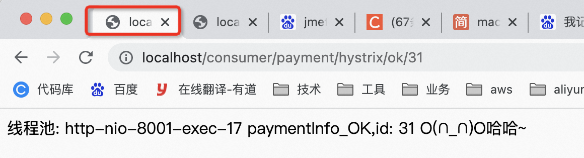

7. 高并发测试：2W个线程压8001

   消费端80微服务再去访问正常的Ok微服务8001地址，会转圈几秒后再返回

   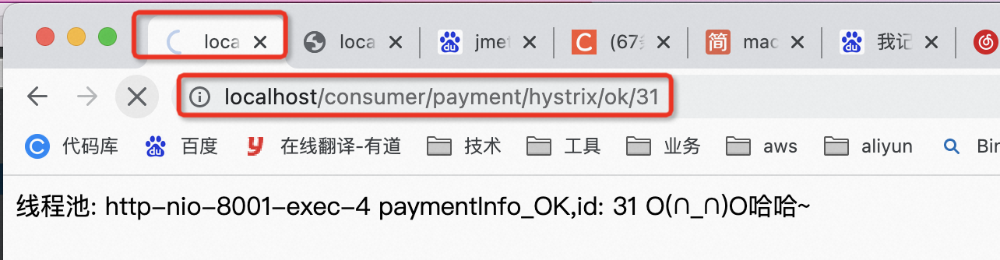


**故障现象和导致原因：**

+ 8001同一层次的其它接口服务被困死，因为tomcat线程池里面的工作线程已经被挤占完毕
+ 80此时调用8001，客户端访问响应缓慢，转圈圈

**上述结论**：正因为有上述故障或不佳表现，才有我们的降级/容错/限流等技术诞生


**如何解决和解决的要求：**

+ 超时导致服务器变慢(转圈)。解决方案：超时不再等待
+ 出错(宕机或程序运行出错)。解决方案：出错要有兜底
+ 具体措施：
    - 对方服务(8001)超时了，调用者(80)不能一直卡死等待，必须有服务降级
    - 对方服务(8001)down机了，调用者(80)不能一直卡死等待，必须有服务降级
    - 对方服务(8001)OK，调用者(80)自己出故障或有自我要求（自己的等待时间小于服务提供者），自己处理降级

## 3.3 服务降级
降级配置：**@HystrixCommand**

### 3.3.1 服务提供者8001端口Fallback
8001先从自身找问题：设置自身调用超时时间的峰值，峰值内可以正常运行，超过了需要有兜底的方法处理，作服务降级fallback

配置步骤：

1. 业务类里：`@HystrixCommand` 报异常后如何处理：一旦调用服务方法失败并抛出了错误信息后，会自动调用`@HystrixCommand`标注好的fallbackMethod调用类中的指定方法

   在`PaymentService`类中修改如下：

   ```java
   @HystrixCommand(fallbackMethod = "paymentInfo_TimeOutHandler",commandProperties = {
           @HystrixProperty(name="execution.isolation.thread.timeoutInMilliseconds",value="3000")
   })
   public String paymentInfo_TimeOut(Integer id)
   {
       int age = 10/0;
       try { TimeUnit.MILLISECONDS.sleep(3000); } catch (InterruptedException e) { e.printStackTrace(); }
       return "线程池:  "+Thread.currentThread().getName()+" id:  "+id+"\t"+"O(∩_∩)O哈哈~"+"  耗时(秒): ";
   }

   public String paymentInfo_TimeOutHandler(Integer id){
       return "/(ㄒoㄒ)/调用支付接口超时或异常：\t"+ "\t当前线程池名字" + Thread.currentThread().getName();
   }
   ```


2. 主启动类里：添加新注解`@EnableCircuitBreaker`

   ```java
   package com.atguigu.springcloud;

   import com.netflix.hystrix.contrib.metrics.eventstream.HystrixMetricsStreamServlet;
   import org.springframework.boot.SpringApplication;
   import org.springframework.boot.autoconfigure.SpringBootApplication;
   import org.springframework.boot.web.servlet.ServletRegistrationBean;
   import org.springframework.cloud.client.circuitbreaker.EnableCircuitBreaker;
   import org.springframework.cloud.netflix.eureka.EnableEurekaClient;
   import org.springframework.context.annotation.Bean;

   /**
    * @auther zzyy
    * @create 2020-02-20 11:10
    */
   @SpringBootApplication
   @EnableEurekaClient
   @EnableCircuitBreaker
   public class PaymentHystrixMain8001
   {
       public static void main(String[] args) {
               SpringApplication.run(PaymentHystrixMain8001.class, args);
       }

   }
   ```


3. 测试

   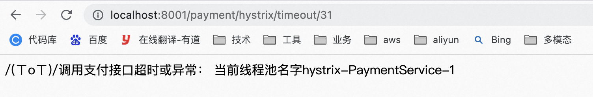

### 3.3.2 服务消费者80端口Fallback
80订单微服务，也可以更好的保护自己，自己也依样画葫芦**进行客户端降级保护**

**前言：我们先来看看8001服务提供者是可以访问成功的**

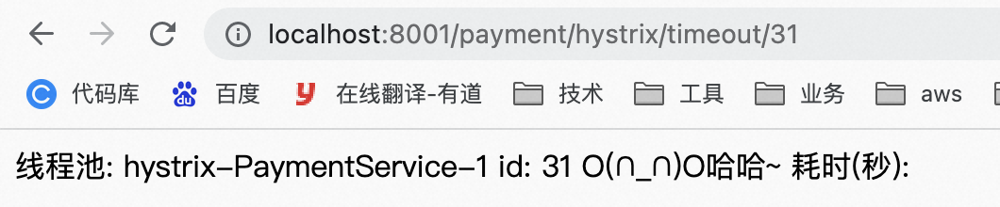

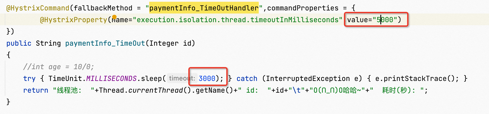

降级步骤：

1. YML

   ```yaml
   feign:
     hystrix:
       enabled: true
   ```


2. 主启动，添加`@EnableHystrix`注解

   ```java
   package com.atguigu.springcloud;

   import org.springframework.boot.SpringApplication;
   import org.springframework.boot.autoconfigure.SpringBootApplication;
   import org.springframework.cloud.netflix.hystrix.EnableHystrix;
   import org.springframework.cloud.openfeign.EnableFeignClients;

   /**
    * @auther zzyy
    * @create 2020-02-04 16:32
    */
   @SpringBootApplication
   @EnableFeignClients
   @EnableHystrix
   public class OrderHystrixMain80
   {
       public static void main(String[] args)
       {
           SpringApplication.run(OrderHystrixMain80.class,args);
       }
   }
   ```


3. 业务类：在controller里面

   ```java
   @GetMapping("/consumer/payment/hystrix/timeout/{id}")
   @HystrixCommand(fallbackMethod = "paymentTimeOutFallbackMethod",commandProperties = {
               @HystrixProperty(name="execution.isolation.thread.timeoutInMilliseconds",value="1500")
   })
   public String paymentInfo_TimeOut(@PathVariable("id") Integer id)
   {
       String result = paymentHystrixService.paymentInfo_TimeOut(id);
       return result;
   }

   public String paymentTimeOutFallbackMethod(@PathVariable("id") Integer id)
   {
       return "我是消费者80,对方支付系统繁忙请10秒钟后再试或者自己运行出错请检查自己,o(╥﹏╥)o";
   }
   ```


4. 测试：[http://localhost/consumer/payment/hystrix/timeout/31](http://localhost/consumer/payment/hystrix/timeout/31)

   

因为在消费端我们配置的超时时间是1.5s，在提供端我们让业务sleep了3s，所以会走服务降级的方法。

上面的配置已经可以成功实现了服务降级的功能，但是我们也发现了有这么两个问题：

1. 每个业务方法对应一个兜底的方法，代码膨胀
2. 降级方法和业务方法强耦合


针对于这两个问题，我们在下面继续优化。

**解决每个业务方法对应一个兜底的方法，造成代码膨胀问题：**

思路：利用 `@DefaultProperties(defaultFallback = "")`

- 1：1 每个方法配置一个服务降级方法，技术上可以，实际上造成代码膨胀。
- 1：N 除了个别重要核心业务有专属，其它普通的可以通过`@DefaultProperties(defaultFallback = "")` 统一跳转到统一处理结果页面

通用的和独享的各自分开，避免了代码膨胀，合理减少了代码量。

controller里面配置：

```java
package com.atguigu.springcloud.controller;

import com.atguigu.springcloud.service.PaymentHystrixService;
import com.netflix.hystrix.contrib.javanica.annotation.DefaultProperties;
import com.netflix.hystrix.contrib.javanica.annotation.HystrixCommand;
import com.netflix.hystrix.contrib.javanica.annotation.HystrixProperty;
import lombok.extern.slf4j.Slf4j;
import org.springframework.web.bind.annotation.GetMapping;
import org.springframework.web.bind.annotation.PathVariable;
import org.springframework.web.bind.annotation.RestController;

import javax.annotation.Resource;

@RestController
@Slf4j
@DefaultProperties(defaultFallback = "payment_Global_FallbackMethod")
public class OrderHystirxController
{
    @Resource
    private PaymentHystrixService paymentHystrixService;

    @GetMapping("/consumer/payment/hystrix/ok/{id}")
    public String paymentInfo_OK(@PathVariable("id") Integer id)
    {
        String result = paymentHystrixService.paymentInfo_OK(id);
        return result;
    }

    @GetMapping("/consumer/payment/hystrix/timeout/{id}")
//    @HystrixCommand(fallbackMethod = "paymentTimeOutFallbackMethod",commandProperties = {
//            @HystrixProperty(name="execution.isolation.thread.timeoutInMilliseconds",value="1500")
//    })
    @HystrixCommand //加了@DefaultProperties属性注解，并且没有写具体方法名字，就用统一全局的
    public String paymentInfo_TimeOut(@PathVariable("id") Integer id)
    {
        String result = paymentHystrixService.paymentInfo_TimeOut(id);
        return result;
    }

//    public String paymentTimeOutFallbackMethod(@PathVariable("id") Integer id)
//    {
//        return "我是消费者80,对方支付系统繁忙请10秒钟后再试或者自己运行出错请检查自己,o(╥﹏╥)o";
//    }
    public String payment_Global_FallbackMethod()
    {
        return "Global异常处理信息，请稍后再试，/(ㄒoㄒ)/~~";
    }
}
```

测试结果：

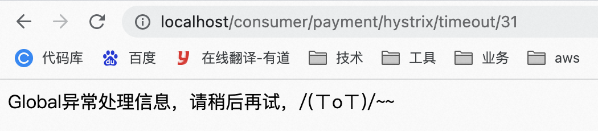

**解决降级方法和业务方法强耦合问题：**

解决思路：本次案例服务降级处理是在客户端80实现完成的，与服务端8001没有关系，只需要为Feign客户端定义的接口添加一个服务降级处理的实现类即可实现解耦

先看看我们之前实现的方式：

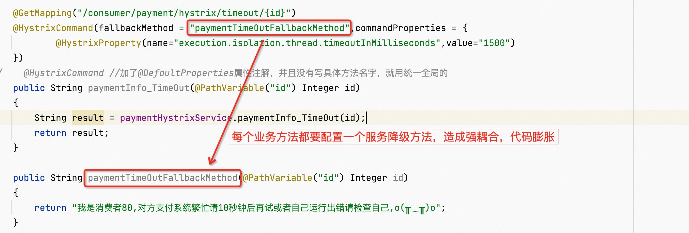

操作步骤

1. 根据cloud-consumer-feign-hystrix-order80已经有的PaymentHystrixService接口，重新新建一个类(PaymentFallbackService)实现该接口，统一为接口里面的方法进行异常处理

   ```java
   package com.atguigu.springcloud.service;
 
   import org.springframework.stereotype.Component;

   @Component
   public class PaymentFallbackService implements PaymentHystrixService
   {
       @Override
       public String paymentInfo_OK(Integer id)
       {
           return "-----PaymentFallbackService fall back-paymentInfo_OK ,o(╥﹏╥)o";
       }
    
       @Override
       public String paymentInfo_TimeOut(Integer id)
       {
           return "-----PaymentFallbackService fall back-paymentInfo_TimeOut ,o(╥﹏╥)o";
       }
   }
   ```


2. YML

   ```yaml
   feign:
     hystrix:
       enabled: true
   ```


3. PaymentHystrixService接口中

   ```java

   package com.atguigu.springcloud.service;

   import org.springframework.cloud.openfeign.FeignClient;
   import org.springframework.stereotype.Component;
   import org.springframework.web.bind.annotation.GetMapping;
   import org.springframework.web.bind.annotation.PathVariable;

   @Component
   @FeignClient(value = "CLOUD-PROVIDER-HYSTRIX-PAYMENT" ,fallback = PaymentFallbackService.class)
   public interface PaymentHystrixService
   {
       @GetMapping("/payment/hystrix/ok/{id}")
       public String paymentInfo_OK(@PathVariable("id") Integer id);
    
       @GetMapping("/payment/hystrix/timeout/{id}")
       public String paymentInfo_TimeOut(@PathVariable("id") Integer id);
   }

   ```


4. 测试：[http://localhost/consumer/payment/hystrix/timeout/31](http://localhost/consumer/payment/hystrix/timeout/31)

   

关掉服务提供者8001，我们也可以点的测试一下

## 3.4 服务熔断
什么是断路器：一句话就是家里的保险丝

熔断是什么？[大神论文](https://martinfowler.com/bliki/CircuitBreaker.html)

演示操作步骤：在cloud-provider-hystrix-payment8001这个服务里面去操作

1. PaymentService中

   ```java
   //=========服务熔断
   @HystrixCommand(fallbackMethod = "paymentCircuitBreaker_fallback",commandProperties = {
       @HystrixProperty(name = "circuitBreaker.enabled",value = "true"),   //是否开启断路器
       @HystrixProperty(name = "circuitBreaker.requestVolumeThreshold",value = "10"),   //请求次数
       @HystrixProperty(name = "circuitBreaker.sleepWindowInMilliseconds",value = "10000"), //时间窗口
       @HystrixProperty(name = "circuitBreaker.errorThresholdPercentage",value = "60"),//失败率到达多少跳闸
   })
   public String paymentCircuitBreaker(@PathVariable("id") Integer id)
   {
       if(id< 0)
       {
           throw new RuntimeException("******id 不能负数");
       }
       String serialNumber = IdUtil.simpleUUID();
       return Thread.currentThread().getName()+"\t"+"调用成功，流水号: " + serialNumber;
   }

   public String paymentCircuitBreaker_fallback(@PathVariable("id") Integer id)
   {
       return "id 不能负数，请稍后再试，/(ㄒoㄒ)/~~   id: " +id;
   }
   ```


2. PaymentController中

   ```java
   @GetMapping("/payment/circuit/{id}")
   public String paymentCircuitBreaker(@PathVariable("id") Integer id)
   {
           String result = paymentService.paymentCircuitBreaker(id);
           log.info("****result: "+result);
           return result;
   }
   ```


3. 测试
    1. 先正确：[http://localhost:8001/payment/circuit/31](http://localhost:8001/payment/circuit/31)

       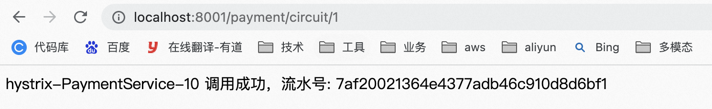

    2. 再错误：[http://localhost:8001/payment/circuit/-31](http://localhost:8001/payment/circuit/-31)


       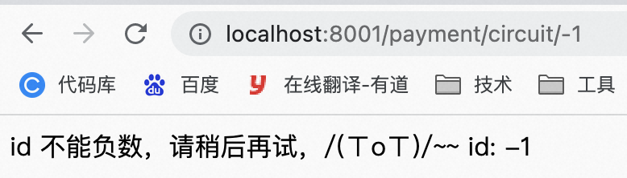


    3. 多次错误，然后慢慢正确，发现刚开始不满足条件，就算是正确的访问地址也不能进行


       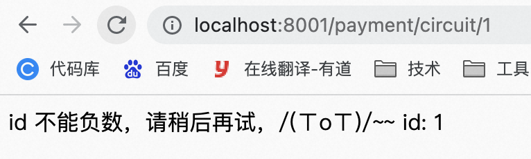


    4. 继续访问正确的，几次后，正确的也可以访问了


       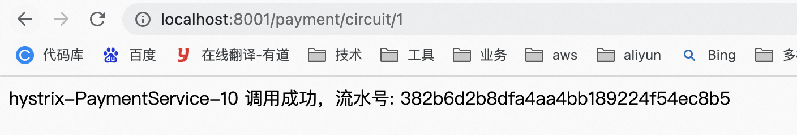

原理总结：

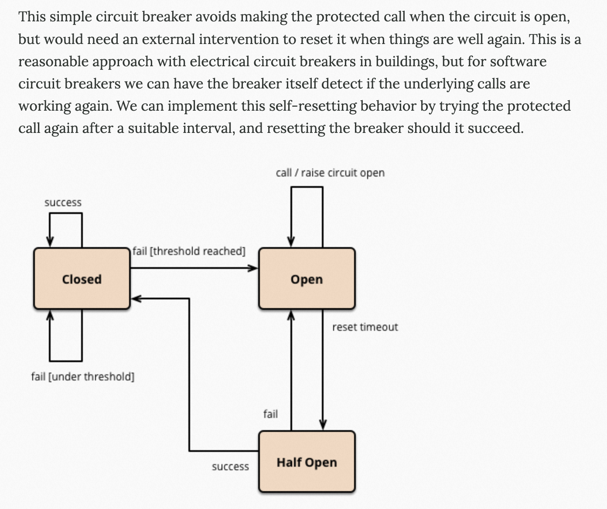

熔断类型：

+ 熔断打开：请求不再进行调用当前服务，内部设置时钟一般为MTTR（平均故障处理时间)，当打开时长达到所设时钟则进入半熔断状态
+ 熔断关闭：熔断关闭不会对服务进行熔断
+ 熔断半开：部分请求根据规则调用当前服务，如果请求成功且符合规则则认为当前服务恢复正常，关闭熔断


官网断路器流程图

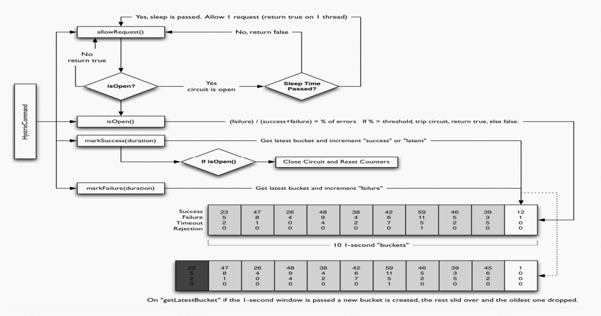


官网步骤：

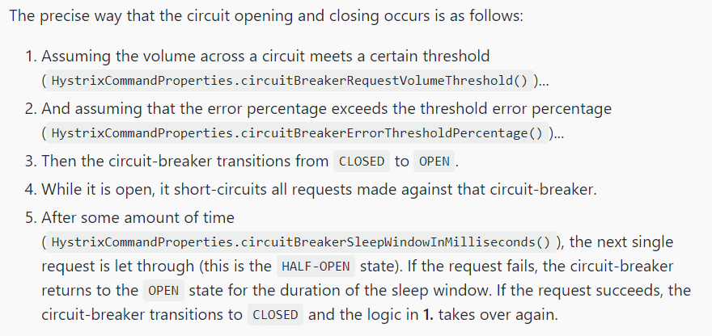


断路器在什么情况下开始起作用？

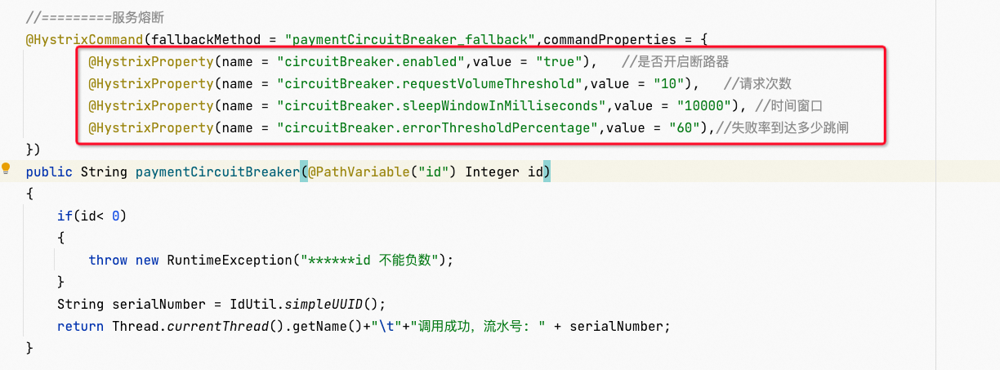

涉及到断路器的三个重要参数：快照时间窗、请求总数阀值、错误百分比阀值。

+ 快照时间窗：断路器确定是否打开需要统计一些请求和错误数据，而统计的时间范围就是快照时间窗，默认为最近的10秒。
+ 请求总数阀值：在快照时间窗内，必须满足请求总数阀值才有资格熔断。默认为20，意味着在10秒内，如果该hystrix命令的调用次数不足20次，即使所有的请求都超时或其他原因失败，断路器都不会打开。
+ 错误百分比阀值：当请求总数在快照时间窗内超过了阀值，比如发生了30次调用，如果在这30次调用中，有15次发生了超时异常，也就是超过50%的错误百分比，在默认设定50%阀值情况下，这时候就会将断路器打开。


断路器开启或者关闭的条件：

+ 当满足一定的阀值的时候（默认10秒内超过20个请求次数）
+ 当失败率达到一定的时候（默认10秒内超过50%的请求失败）
+ 到达以上阀值，断路器将会开启
+ 当开启的时候，所有请求都不会进行转发
+ 一段时间之后（默认是5秒），这个时候断路器是半开状态，会让其中一个请求进行转发。如果成功，断路器会关闭，若失败，继续开启。重复4和5


断路器打开之后：

1. 再有请求调用的时候，将不会调用主逻辑，而是直接调用降级fallback。通过断路器，实现了自动地发现错误并将降级逻辑切换为主逻辑，减少响应延迟的效果。
2. 原来的主逻辑要如何恢复呢？对于这一问题，hystrix也为我们实现了自动恢复功能。当断路器打开，对主逻辑进行熔断之后，hystrix会启动一个休眠时间窗，在这个时间窗内，降级逻辑是临时的成为主逻辑，当休眠时间窗到期，断路器将进入半开状态，释放一次请求到原来的主逻辑上，如果此次请求正常返回，那么断路器将继续闭合，主逻辑恢复，如果这次请求依然有问题，断路器继续进入打开状态，休眠时间窗重新计时。


全部配置

```java
//========================All
@HystrixCommand(fallbackMethod = "str_fallbackMethod",
                groupKey = "strGroupCommand",
                commandKey = "strCommand",
                threadPoolKey = "strThreadPool",

                commandProperties = {
                    // 设置隔离策略，THREAD 表示线程池 SEMAPHORE：信号池隔离
                    @HystrixProperty(name = "execution.isolation.strategy", value = "THREAD"),
                    // 当隔离策略选择信号池隔离的时候，用来设置信号池的大小（最大并发数）
                    @HystrixProperty(name = "execution.isolation.semaphore.maxConcurrentRequests", value = "10"),
                    // 配置命令执行的超时时间
                    @HystrixProperty(name = "execution.isolation.thread.timeoutinMilliseconds", value = "10"),
                    // 是否启用超时时间
                    @HystrixProperty(name = "execution.timeout.enabled", value = "true"),
                    // 执行超时的时候是否中断
                    @HystrixProperty(name = "execution.isolation.thread.interruptOnTimeout", value = "true"),
                    // 执行被取消的时候是否中断
                    @HystrixProperty(name = "execution.isolation.thread.interruptOnCancel", value = "true"),
                    // 允许回调方法执行的最大并发数
                    @HystrixProperty(name = "fallback.isolation.semaphore.maxConcurrentRequests", value = "10"),
                    // 服务降级是否启用，是否执行回调函数
                    @HystrixProperty(name = "fallback.enabled", value = "true"),
                    // 是否启用断路器
                    @HystrixProperty(name = "circuitBreaker.enabled", value = "true"),
                    // 该属性用来设置在滚动时间窗中，断路器熔断的最小请求数。例如，默认该值为 20 的时候，
                    // 如果滚动时间窗（默认10秒）内仅收到了19个请求， 即使这19个请求都失败了，断路器也不会打开。
                    @HystrixProperty(name = "circuitBreaker.requestVolumeThreshold", value = "20"),
                    // 该属性用来设置在滚动时间窗中，表示在滚动时间窗中，在请求数量超过
                    // circuitBreaker.requestVolumeThreshold 的情况下，如果错误请求数的百分比超过50,
                    // 就把断路器设置为 "打开" 状态，否则就设置为 "关闭" 状态。
                    @HystrixProperty(name = "circuitBreaker.errorThresholdPercentage", value = "50"),
                    // 该属性用来设置当断路器打开之后的休眠时间窗。 休眠时间窗结束之后，
                    // 会将断路器置为 "半开" 状态，尝试熔断的请求命令，如果依然失败就将断路器继续设置为 "打开" 状态，
                    // 如果成功就设置为 "关闭" 状态。
                    @HystrixProperty(name = "circuitBreaker.sleepWindowinMilliseconds", value = "5000"),
                    // 断路器强制打开
                    @HystrixProperty(name = "circuitBreaker.forceOpen", value = "false"),
                    // 断路器强制关闭
                    @HystrixProperty(name = "circuitBreaker.forceClosed", value = "false"),
                    // 滚动时间窗设置，该时间用于断路器判断健康度时需要收集信息的持续时间
                    @HystrixProperty(name = "metrics.rollingStats.timeinMilliseconds", value = "10000"),
                    // 该属性用来设置滚动时间窗统计指标信息时划分"桶"的数量，断路器在收集指标信息的时候会根据
                    // 设置的时间窗长度拆分成多个 "桶" 来累计各度量值，每个"桶"记录了一段时间内的采集指标。
                    // 比如 10 秒内拆分成 10 个"桶"收集这样，所以 timeinMilliseconds 必须能被 numBuckets 整除。否则会抛异常
                    @HystrixProperty(name = "metrics.rollingStats.numBuckets", value = "10"),
                    // 该属性用来设置对命令执行的延迟是否使用百分位数来跟踪和计算。如果设置为 false, 那么所有的概要统计都将返回 -1。
                    @HystrixProperty(name = "metrics.rollingPercentile.enabled", value = "false"),
                    // 该属性用来设置百分位统计的滚动窗口的持续时间，单位为毫秒。
                    @HystrixProperty(name = "metrics.rollingPercentile.timeInMilliseconds", value = "60000"),
                    // 该属性用来设置百分位统计滚动窗口中使用 “ 桶 ”的数量。
                    @HystrixProperty(name = "metrics.rollingPercentile.numBuckets", value = "60000"),
                    // 该属性用来设置在执行过程中每个 “桶” 中保留的最大执行次数。如果在滚动时间窗内发生超过该设定值的执行次数，
                    // 就从最初的位置开始重写。例如，将该值设置为100, 滚动窗口为10秒，若在10秒内一个 “桶 ”中发生了500次执行，
                    // 那么该 “桶” 中只保留 最后的100次执行的统计。另外，增加该值的大小将会增加内存量的消耗，并增加排序百分位数所需的计算时间。
                    @HystrixProperty(name = "metrics.rollingPercentile.bucketSize", value = "100"),
                    // 该属性用来设置采集影响断路器状态的健康快照（请求的成功、 错误百分比）的间隔等待时间。
                    @HystrixProperty(name = "metrics.healthSnapshot.intervalinMilliseconds", value = "500"),
                    // 是否开启请求缓存
                    @HystrixProperty(name = "requestCache.enabled", value = "true"),
                    // HystrixCommand的执行和事件是否打印日志到 HystrixRequestLog 中
                    @HystrixProperty(name = "requestLog.enabled", value = "true"),
                },
                threadPoolProperties = {
                    // 该参数用来设置执行命令线程池的核心线程数，该值也就是命令执行的最大并发量
                    @HystrixProperty(name = "coreSize", value = "10"),
                    // 该参数用来设置线程池的最大队列大小。当设置为 -1 时，线程池将使用 SynchronousQueue 实现的队列，
                    // 否则将使用 LinkedBlockingQueue 实现的队列。
                    @HystrixProperty(name = "maxQueueSize", value = "-1"),
                    // 该参数用来为队列设置拒绝阈值。 通过该参数， 即使队列没有达到最大值也能拒绝请求。
                    // 该参数主要是对 LinkedBlockingQueue 队列的补充,因为 LinkedBlockingQueue
                    // 队列不能动态修改它的对象大小，而通过该属性就可以调整拒绝请求的队列大小了。
                    @HystrixProperty(name = "queueSizeRejectionThreshold", value = "5"),
                }
               )
public String strConsumer() {
    return "hello 2020";
}

public String str_fallbackMethod()
{
    return "*****fall back str_fallbackMethod";
}

```

## 3.5 服务限流
参考后续Sentinel的讲解

# 4 Hystrix工作流程
官网：[官网](https://github.com/Netflix/Hystrix/wiki/How-it-Works)

Hystrix工作流程：

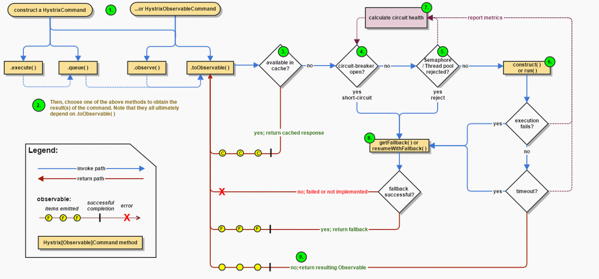

1. 创建 HystrixCommand（用在依赖的服务返回单个操作结果的时候） 或 HystrixObserableCommand（用在依赖的服务返回多个操作结果的时候） 对象。
2. 命令执行。其中 HystrixComand 实现了下面前两种执行方式；而 HystrixObservableCommand 实现了后两种执行方式：execute()：同步执行，从依赖的服务返回一个单一的结果对象， 或是在发生错误的时候抛出异常。queue()：异步执行， 直接返回 一个Future对象， 其中包含了服务执行结束时要返回的单一结果对象。observe()：返回 Observable 对象，它代表了操作的多个结果，它是一个 Hot Obserable（不论 "事件源" 是否有 "订阅者"，都会在创建后对事件进行发布，所以对于 Hot Observable 的每一个 "订阅者" 都有可能是从 "事件源" 的中途开始的，并可能只是看到了整个操作的局部过程）。toObservable()： 同样会返回 Observable 对象，也代表了操作的多个结果，但它返回的是一个Cold Observable（没有 "订阅者" 的时候并不会发布事件，而是进行等待，直到有 "订阅者" 之后才发布事件，所以对于 Cold Observable 的订阅者，它可以保证从一开始看到整个操作的全部过程）。
3. 若当前命令的请求缓存功能是被启用的， 并且该命令缓存命中， 那么缓存的结果会立即以 Observable 对象的形式 返回。
4. 检查断路器是否为打开状态。如果断路器是打开的，那么Hystrix不会执行命令，而是转接到 fallback 处理逻辑（第 8 步）；如果断路器是关闭的，检查是否有可用资源来执行命令（第 5 步）。
5. 线程池/请求队列/信号量是否占满。如果命令依赖服务的专有线程池和请求队列，或者信号量（不使用线程池的时候）已经被占满， 那么 Hystrix 也不会执行命令， 而是转接到 fallback 处理逻辑（第8步）。
6. Hystrix 会根据我们编写的方法来决定采取什么样的方式去请求依赖服务。HystrixCommand.run() ：返回一个单一的结果，或者抛出异常。HystrixObservableCommand.construct()： 返回一个Observable 对象来发射多个结果，或通过 onError 发送错误通知。
7. Hystrix会将 "成功"、"失败"、"拒绝"、"超时" 等信息报告给断路器， 而断路器会维护一组计数器来统计这些数据。断路器会使用这些统计数据来决定是否要将断路器打开，来对某个依赖服务的请求进行 "熔断/短路"。
8. 当命令执行失败的时候， Hystrix 会进入 fallback 尝试回退处理， 我们通常也称该操作为 "服务降级"。而能够引起服务降级处理的情况有下面几种：第4步： 当前命令处于"熔断/短路"状态，断路器是打开的时候。第5步： 当前命令的线程池、 请求队列或 者信号量被占满的时候。第6步：HystrixObservableCommand.construct() 或 HystrixCommand.run() 抛出异常的时候。
9. 当Hystrix命令执行成功之后， 它会将处理结果直接返回或是以Observable 的形式返回。

注意：如果我们没有为命令实现降级逻辑或者在降级处理逻辑中抛出了异常， Hystrix 依然会返回一个 Observable 对象， 但是它不会发射任何结果数据， 而是通过 onError 方法通知命令立即中断请求，并通过onError()方法将引起命令失败的异常发送给调用者。

# 5 服务监控HystrixDashboard
概述：除了隔离依赖服务的调用以外，Hystrix还提供了准实时的调用监控（Hystrix Dashboard），Hystrix会持续地记录所有通过Hystrix发起的请求的执行信息，并以统计报表和图形的形式展示给用户，包括每秒执行多少请求多少成功，多少失败等。Netflix通过hystrix-metrics-event-stream项目实现了对以上指标的监控。Spring Cloud也提供了Hystrix Dashboard的整合，对监控内容转化成可视化界面。

演示步骤：

1. 创建Module
    1. 创建Module

       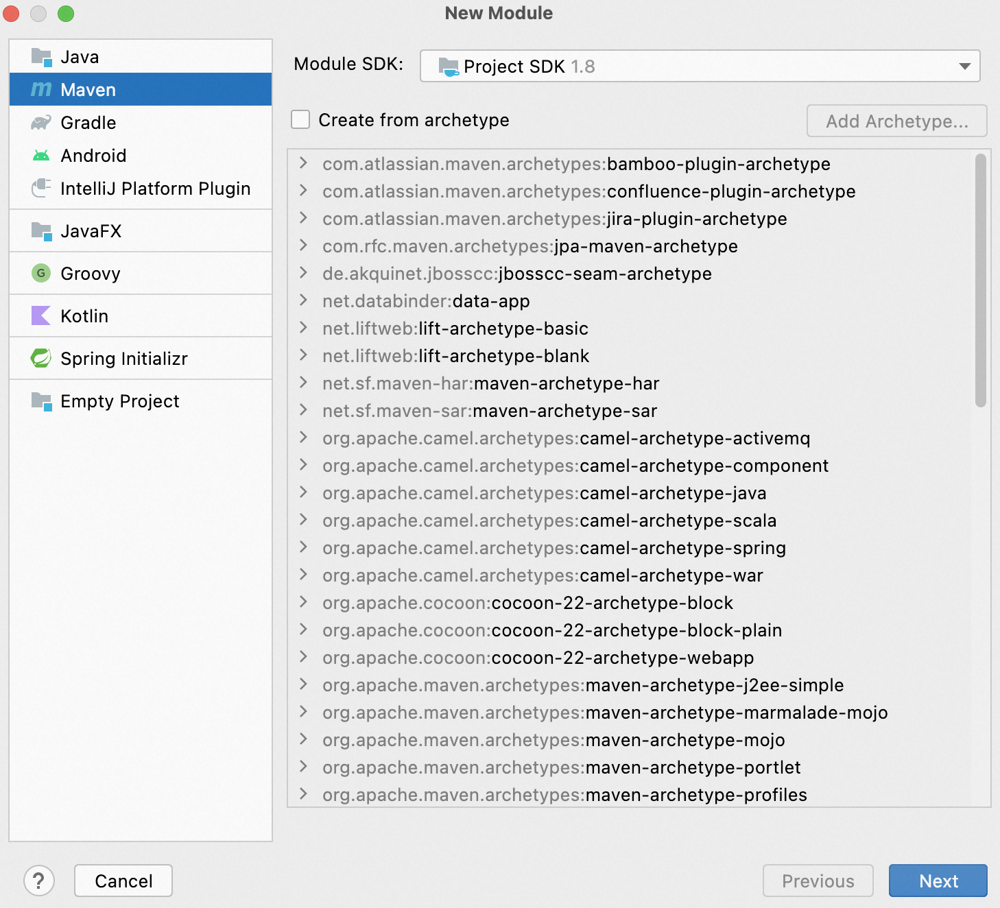


    2. 填写Module名称


       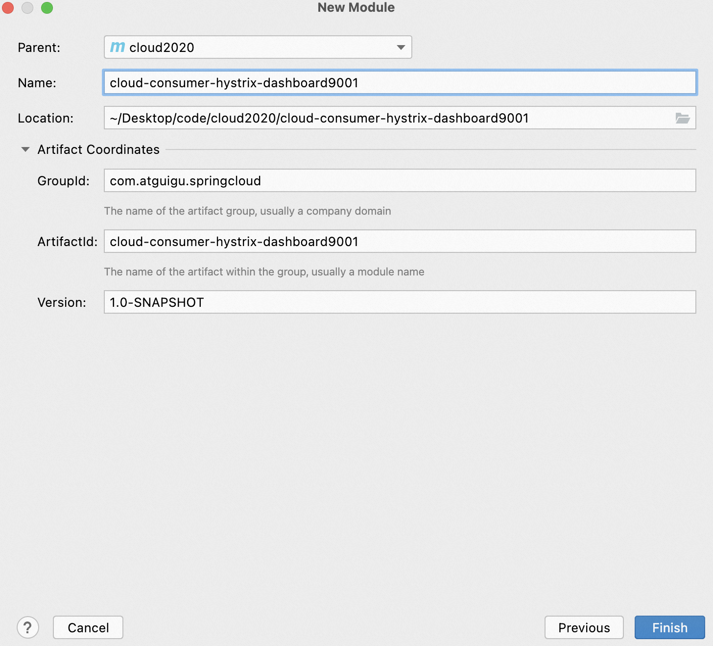


    3. 点击完成

2. POM

    ```xml
    <?xml version="1.0" encoding="UTF-8"?>
    <project xmlns="http://maven.apache.org/POM/4.0.0"
             xmlns:xsi="http://www.w3.org/2001/XMLSchema-instance"
             xsi:schemaLocation="http://maven.apache.org/POM/4.0.0 http://maven.apache.org/xsd/maven-4.0.0.xsd">
        <parent>
            <artifactId>cloud2020</artifactId>
            <groupId>com.atguigu.springcloud</groupId>
            <version>1.0-SNAPSHOT</version>
        </parent>
        <modelVersion>4.0.0</modelVersion>

        <artifactId>cloud-consumer-hystrix-dashboard9001</artifactId>

        <properties>
            <maven.compiler.source>8</maven.compiler.source>
            <maven.compiler.target>8</maven.compiler.target>
        </properties>

        <dependencies>
            <dependency>
                <groupId>org.springframework.cloud</groupId>
                <artifactId>spring-cloud-starter-netflix-hystrix-dashboard</artifactId>
            </dependency>
            <dependency>
                <groupId>org.springframework.boot</groupId>
                <artifactId>spring-boot-starter-actuator</artifactId>
            </dependency>

            <dependency>
                <groupId>org.springframework.boot</groupId>
                <artifactId>spring-boot-devtools</artifactId>
                <scope>runtime</scope>
                <optional>true</optional>
            </dependency>
            <dependency>
                <groupId>org.projectlombok</groupId>
                <artifactId>lombok</artifactId>
                <optional>true</optional>
            </dependency>
            <dependency>
                <groupId>org.springframework.boot</groupId>
                <artifactId>spring-boot-starter-test</artifactId>
                <scope>test</scope>
            </dependency>
        </dependencies>
    </project>
    ```


3. YML

   ```yaml
   server:
     port: 9001
   ```


4. 主启动

   ```java
   package com.atguigu.springcloud;

   import org.springframework.boot.SpringApplication;
   import org.springframework.boot.autoconfigure.SpringBootApplication;
   import org.springframework.cloud.netflix.hystrix.dashboard.EnableHystrixDashboard;

   /**
    * @auther zzyy
    * @create 2020-02-20 22:02
    */
   @SpringBootApplication
   @EnableHystrixDashboard
   public class HystrixDashboardMain9001
   {
       public static void main(String[] args) {
               SpringApplication.run(HystrixDashboardMain9001.class, args);
       }
   }
   ```


5. 测试：[http://localhost:9001/hystrix](http://localhost:9001/hystrix)

   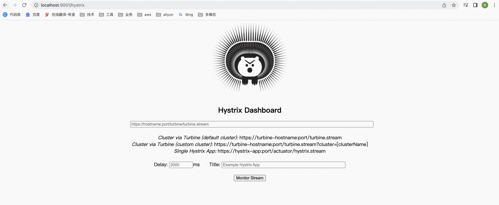


**将cloud-provider-hystrix-payment8001服务监控**

操作步骤：

1. 修改cloud-provider-hystrix-payment8001

   注意：新版本Hystrix需要在主启动类MainAppHystrix8001中指定监控路径

   ```java
   /**
        *此配置是为了服务监控而配置，与服务容错本身无关，springcloud升级后的坑
        *ServletRegistrationBean因为springboot的默认路径不是"/hystrix.stream"，
        *只要在自己的项目里配置上下面的servlet就可以了
        */
       @Bean
       public ServletRegistrationBean getServlet() {
           HystrixMetricsStreamServlet streamServlet = new HystrixMetricsStreamServlet();
           ServletRegistrationBean registrationBean = new ServletRegistrationBean(streamServlet);
           registrationBean.setLoadOnStartup(1);
           registrationBean.addUrlMappings("/hystrix.stream");
           registrationBean.setName("HystrixMetricsStreamServlet");
           return registrationBean;
       }
   ```

   要在启动类里面加上述代码，不然会出现下面的错误。

   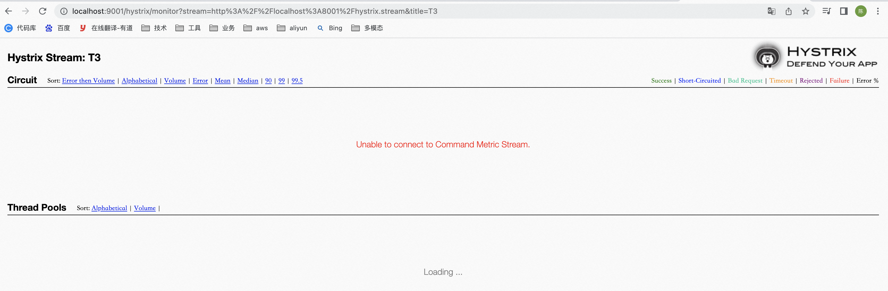

2. 开始测试：[http://localhost:8001/hystrix.stream](http://localhost:8001/hystrix.stream)
    1. 启动1个eureka7001
    2. 填写观察窗口

       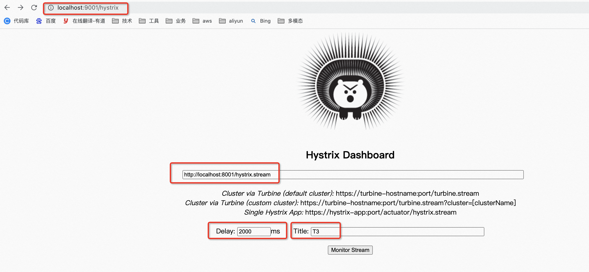Delay：该参数用来控制服务器上轮询监控信息的延迟时间，默认为2000毫秒，可以通过配置该属性来降低客户端的网络和CPU消耗。

       Title：该参数对应了头部标题Hystrix Stream之后的内容，默认会使用具体监控实例的URL，可以通过配置该信息来展示更合适的标题。 

3. 输入：[http://localhost:8001/payment/circuit/31](http://localhost:8001/payment/circuit/31)

   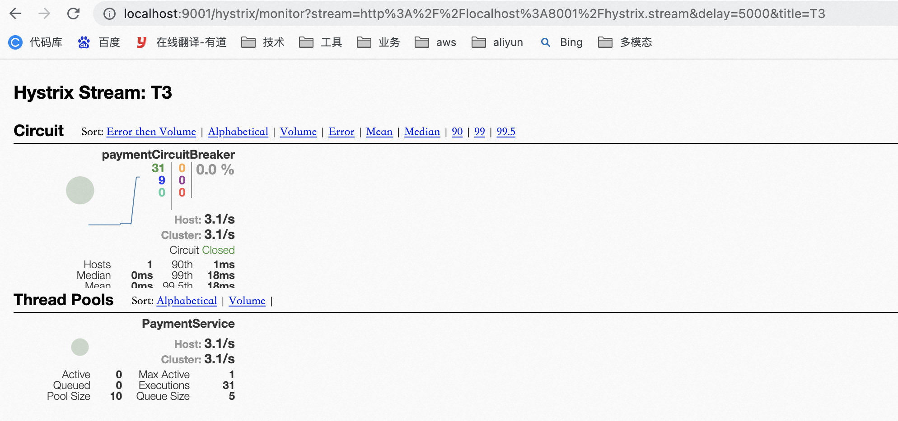

4. 输入：[http://localhost:8001/payment/circuit/-31](http://localhost:8001/payment/circuit/-31)

   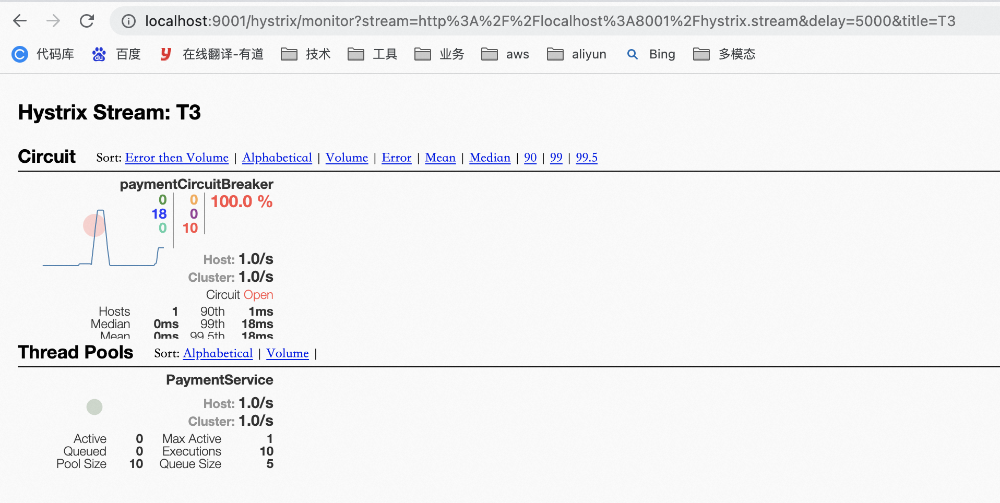


如何看上面这个图：

+ 7色

  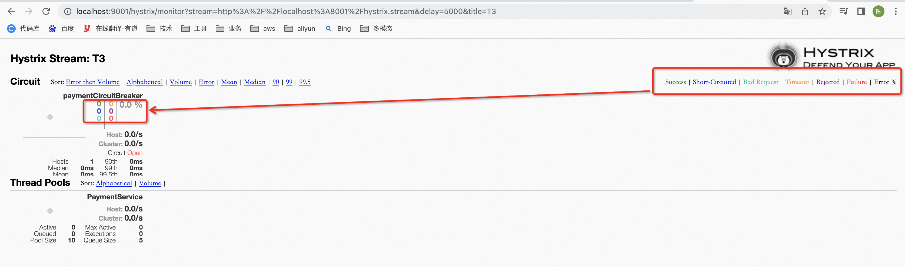

+ 1圈：实心圆：共有两种含义。
    - 它通过颜色的变化代表了实例的健康程度。健康度是绿色，异常是红色。
    - 该实心圆除了颜色的变化之外，它的大小也会根据实例的请求流量发生变化，流量越大该实心圆就越大。所以通过该实心圆的展示，就可以在大量的实例中快速的发现故障实例和高压力实例。
+ 1线：曲线：用来记录2分钟内流量的相对变化，可以通过它来观察到流量的上升和下降趋势。

整图说明：

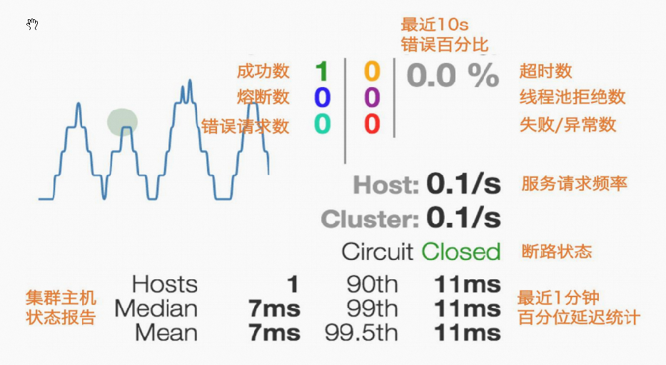

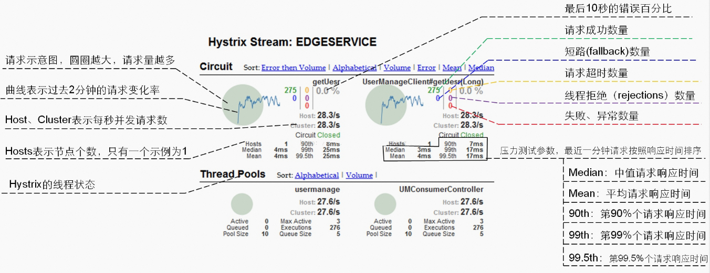

Circuit 为Close表示断路器关闭，为Open表示断路器打开。

