**<font style="color:#DF2A3F;">笔记来源：</font>**[**<font style="color:#DF2A3F;">尚硅谷SpringCloud框架开发教程(SpringCloudAlibaba微服务分布式架构丨Spring Cloud)</font>**](https://www.bilibili.com/video/BV18E411x7eT/?spm_id_from=333.337.search-card.all.click&vd_source=e8046ccbdc793e09a75eb61fe8e84a30)

# 27. <font style="color:#000000;">1 概念简介</font>
<font style="color:rgb(36, 41, 47);">Zuul官网：</font>[Zuul官网](https://github.com/Netflix/zuul/wiki)

<font style="color:#282828;">Gateway官网：</font>[Gateway官网](https://cloud.spring.io/spring-cloud-static/spring-cloud-gateway/2.2.1.RELEASE/reference/html/)

Cloud全家桶中有个很重要的组件就是网关，在1.x版本中都是采用的Zuul网关；但在2.x版本中，zuul的升级一直跳票，SpringCloud最后自己研发了一个网关替代Zuul，<font style="color:#ff0000;">那就是SpringCloud Gateway</font>一句话：<font style="color:#ff0000;">gateway是原zuul1.x版的替代</font>

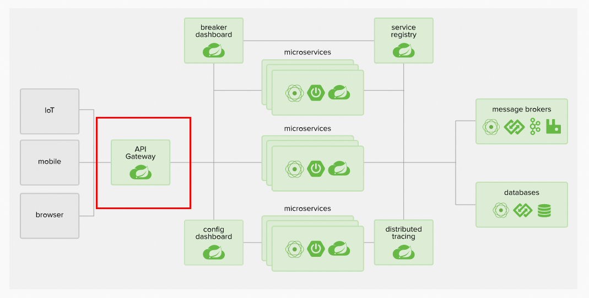

**概述**：

Gateway是在Spring生态系统之上构建的API网关服务，基于Spring 5，Spring Boot 2和 Project Reactor等技术。Gateway旨在提供一种简单而有效的方式来对API进行路由，以及提供一些强大的过滤器功能， 例如：熔断、限流、重试等。

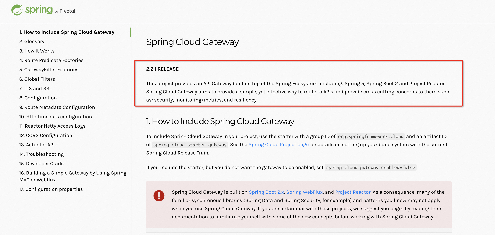

一句话：<font style="color:#3366ff;">SpringCloud Gateway 使用的Webflux中的reactor-netty响应式编程组件，底层使用了Netty通讯框架。</font>

<font style="color:#000000;">源码架构：</font>

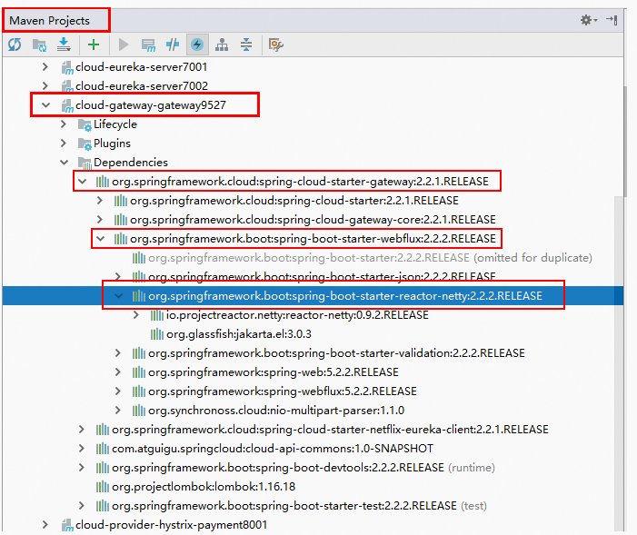

Gateway的主要功能：

+ <font style="color:#282828;">反向代理</font>
+ <font style="color:#282828;">鉴权</font>
+ <font style="color:#282828;">流量控制</font>
+ <font style="color:#282828;">熔断</font>
+ <font style="color:#282828;">日志监控</font>
+ <font style="color:#282828;">...等等</font>

在微服务架构中网关的位置：

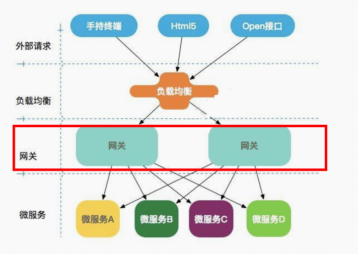


<font style="color:#282828;">有Zuul了怎么又出来了gateway？</font>

+ <font style="color:#282828;">我们为什么选择Gateway？</font>
    - <font style="color:#282828;">neflix不太靠谱，zuul2.0一直跳票，迟迟不发布</font>

:::info
一方面因为Zuul1.0已经进入了维护阶段，而且Gateway是SpringCloud团队研发的，是亲儿子产品，值得信赖。而且很多功能Zuul都没有用起来也非常的简单便捷。

Gateway是基于<font style="color:#ff0000;">异步非阻塞模型上</font>进行开发的，性能方面不需要担心。虽然Netflix早就发布了最新的 Zuul 2.x，但 Spring Cloud 貌似没有整合计划。而且Netflix相关组件都宣布进入维护期；不知前景如何。

多方面综合考虑Gateway是很理想的网关选择。

:::

    - <font style="color:#282828;">SpringCloud Gateway具有如下特性</font>

:::color1
<font style="color:#ff0000;">基于Spring Framework 5, Project Reactor 和 Spring Boot 2.0 进行构建；</font>

+ 动态路由：能够匹配任何请求属性；
+ 可以对路由指定 Predicate（断言）和 Filter（过滤器）；
+ 集成Hystrix的断路器功能；
+ 集成 Spring Cloud 服务发现功能；
+ 易于编写的 Predicate（断言）和 Filter（过滤器）；
+ 请求限流功能；
+ 支持路径重写。

:::

    - <font style="color:#282828;">SpringCloud Gateway 与 Zuul的区别</font>

:::color2
Spring Cloud Gateway 与 Zuul的区别

在SpringCloud Finchley 正式版之前，Spring Cloud 推荐的网关是 Netflix 提供的Zuul：

1. Zuul 1.x，是一个基于阻塞 I/O 的 API Gateway
2. Zuul 1.x<font style="color:#ff0000;"> 基于Servlet 2. 5使用阻塞架构</font>它不支持任何长连接(如 WebSocket) Zuul 的设计模式和Nginx较像，每次 I/ O 操作都是从工作线程中选择一个执行，请求线程被阻塞到工作线程完成，但是差别是Nginx 用C++ 实现，Zuul 用 Java 实现，而 JVM 本身会有第一次加载较慢的情况，使得Zuul 的性能相对较差。
3. Zuul 2.x理念更先进，想基于Netty非阻塞和支持长连接，但SpringCloud目前还没有整合。 Zuul 2.x的性能较 Zuul 1.x 有较大提升。在性能方面，根据官方提供的基准测试， Spring Cloud Gateway 的 RPS（每秒请求数）是Zuul 的 1. 6 倍。
4. Spring Cloud Gateway 建立 在 Spring Framework 5、 Project Reactor 和 Spring Boot 2 之上， 使用非阻塞 API。
5. Spring Cloud Gateway 还 支持 WebSocket， 并且与Spring紧密集成拥有更好的开发体验

:::

+ <font style="color:#282828;">Zuul1.x模型</font>

:::success
Springcloud中所集成的Zuul版本，采用的是Tomcat容器，使用的是传统的Servlet IO处理模型。

<font style="color:#0000ff;">Servlet的生命周期？</font>servlet由servlet container进行生命周期管理。

1. container启动时构造servlet对象并调用servlet `init()`进行初始化；
2. container运行时接受请求，并为每个请求分配一个线程（一般从线程池中获取空闲线程）然后调用service()。
3. container关闭时调用servlet `destory()`销毁servlet；

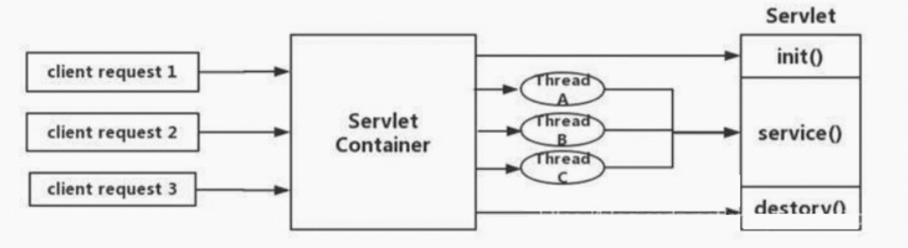

<font style="color:#0000ff;">上述模式的缺点：</font>

servlet是一个简单的网络IO模型，当请求进入servlet container时，servlet container就会为其绑定一个线程，在<font style="color:#ff0000;">并发不高的场景下</font>这种模型是适用的。但是一旦高并发(比如抽风用jemeter压)，线程数量就会上涨，而线程资源代价是昂贵的（上线文切换，内存消耗大）严重影响请求的处理时间。在一些简单业务场景下，不希望为每个request分配一个线程，只需要1个或几个线程就能应对极大并发的请求，这种业务场景下servlet模型没有优势

所以Zuul 1.X是<font style="color:#ff0000;">基于servlet之上的一个阻塞式处理模型</font>，即spring实现了处理所有request请求的一个servlet（DispatcherServlet）并由该servlet阻塞式处理处理。所以Springcloud Zuul无法摆脱servlet模型的弊端

:::

+ <font style="color:#282828;">GateWay模型</font>
    - <font style="color:#282828;">WebFlux是什么</font>

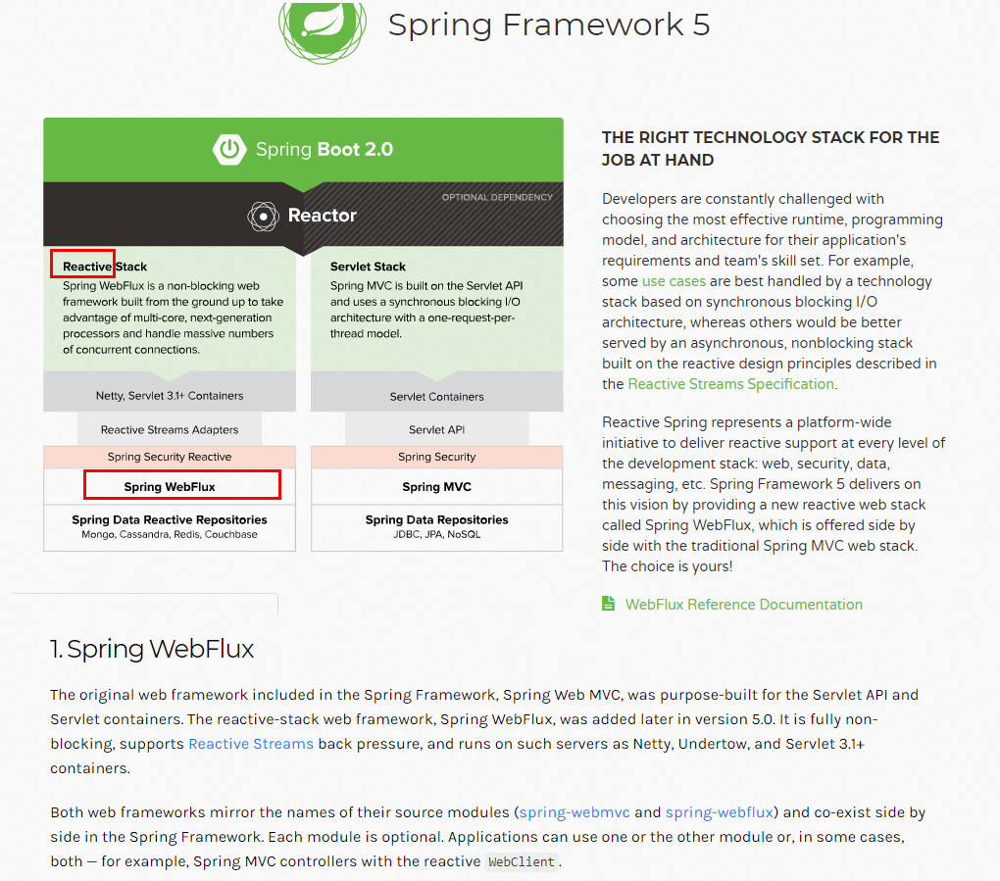

:::warning
传统的Web框架，比如说：struts2，springmvc等都是基于Servlet API与Servlet容器基础之上运行的。

但是<font style="color:#ff0000;">在Servlet3.1之后有了异步非阻塞的支持</font>。而WebFlux是一个典型非阻塞异步的框架，它的核心是基于Reactor的相关API实现的。相对于传统的web框架来说，它可以运行在诸如Netty，Undertow及支持Servlet3.1的容器上。非阻塞式+函数式编程（Spring5必须让你使用java8）

Spring WebFlux 是 Spring 5.0 引入的新的响应式框架，区别于 Spring MVC，它不需要依赖Servlet API，它是完全异步非阻塞的，并且基于 Reactor 来实现响应式流规范。

官网：[Spring WebFlux](https://docs.spring.io/spring/docs/current/spring-framework-reference/web-reactive.html#webflux-new-framework)

:::

# 2 三大核心概念
+  <font style="color:#282828;">Route(路由)：路由是构建网关的基本模块，它由ID，目标URI，一系列的断言和过滤器组成，如果断言为true则匹配该路由</font>
+ <font style="color:#282828;">Predicate(断言)：参考的是Java8的java.util.function.Predicate，开发人员可以匹配HTTP请求中的所有内容(例如请求头或请求参数)，</font><font style="color:#ff0000;">如果请求与断言相匹配则进行路由</font>
+ <font style="color:#282828;">Filter(过滤)：指的是Spring框架中GatewayFilter的实例，使用过滤器，可以在请求被路由前或者之后对请求进行修改。</font>


总体

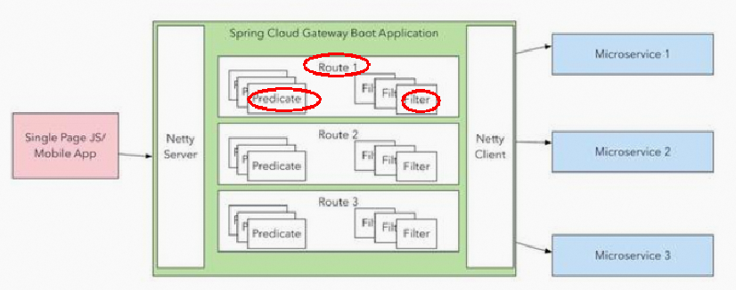

web请求，通过一些匹配条件，定位到真正的服务节点。并在这个转发过程的前后，进行一些精细化控制。

predicate就是我们的匹配条件；

而filter，就可以理解为一个无所不能的拦截器。有了这两个元素，再加上目标uri，就可以实现一个具体的路由了

# 3 Gateway工作流程
官网总结：


1. 客户端向 Spring Cloud Gateway 发出请求。然后在 Gateway Handler Mapping 中找到与请求相匹配的路由，将其发送到 Gateway Web Handler。
2. Handler 再通过指定的过滤器链来将请求发送到我们实际的服务执行业务逻辑，然后返回。
3. 过滤器之间用虚线分开是因为过滤器可能会在发送代理请求之前（“pre”）或之后（“post”）执行业务逻辑。
4. Filter在“pre”类型的过滤器可以做参数校验、权限校验、流量监控、日志输出、协议转换等，
5. 在“post”类型的过滤器中可以做响应内容、响应头的修改，日志的输出，流量监控等有着非常重要的作用。


<font style="color:#282828;">核心逻辑：</font><font style="color:#ff0000;">路由转发+执行过滤器链</font>

# 4 入门配置
先创建一个服务，创建服务步骤：

1. 创建Module
    1. 新建Module

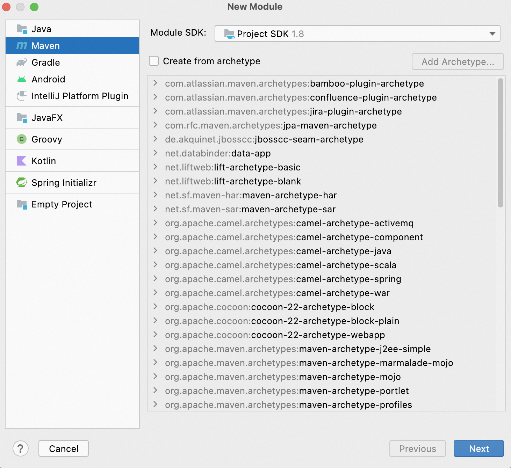

    2. 填写Module名称

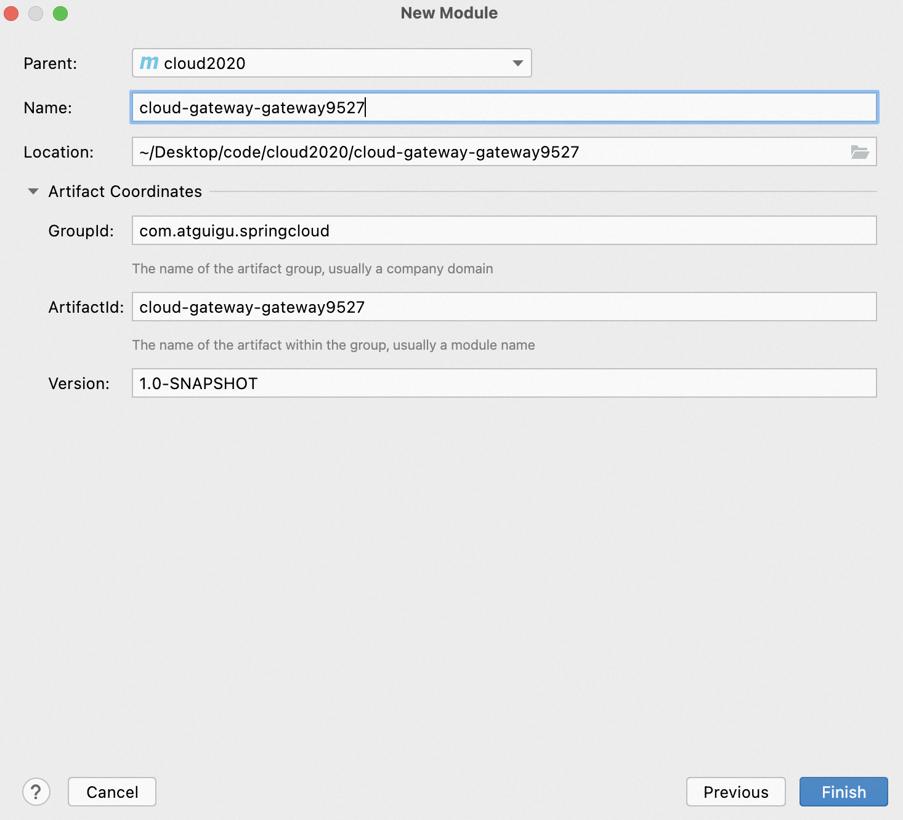

    3. 点击完成
2. POM

```xml
<?xml version="1.0" encoding="UTF-8"?>
<project xmlns="http://maven.apache.org/POM/4.0.0"
         xmlns:xsi="http://www.w3.org/2001/XMLSchema-instance"
         xsi:schemaLocation="http://maven.apache.org/POM/4.0.0 http://maven.apache.org/xsd/maven-4.0.0.xsd">
    <parent>
        cloud2020</artifactId>
        <groupId>com.atguigu.springcloud</groupId>
        <version>1.0-SNAPSHOT</version>
    </parent>
    <modelVersion>4.0.0</modelVersion>

    cloud-gateway-gateway9527</artifactId>

    <properties>
        <maven.compiler.source>8</maven.compiler.source>
        <maven.compiler.target>8</maven.compiler.target>
    </properties>


    <dependencies>
        <!--gateway-->
        <dependency>
            <groupId>org.springframework.cloud</groupId>
            spring-cloud-starter-gateway</artifactId>
        </dependency>
        <!--eureka-client-->
        <dependency>
            <groupId>org.springframework.cloud</groupId>
            spring-cloud-starter-netflix-eureka-client</artifactId>
        </dependency>
        <!-- 引入自己定义的api通用包，可以使用Payment支付Entity -->
        <dependency>
            <groupId>com.atguigu.springcloud</groupId>
            cloud-api-commons</artifactId>
            <version>${project.version}</version>
        </dependency>
        <!--一般基础配置类-->
        <dependency>
            <groupId>org.springframework.boot</groupId>
            spring-boot-devtools</artifactId>
            <scope>runtime</scope>
            <optional>true</optional>
        </dependency>
        <dependency>
            <groupId>org.projectlombok</groupId>
            lombok</artifactId>
            <optional>true</optional>
        </dependency>
        <dependency>
            <groupId>org.springframework.boot</groupId>
            spring-boot-starter-test</artifactId>
            <scope>test</scope>
        </dependency>
    </dependencies>

</project>
```

3. YML

```yaml
server:
  port: 9527

spring:
  application:
    name: cloud-gateway

eureka:
  instance:
    hostname: cloud-gateway-service
  client: #服务提供者provider注册进eureka服务列表内
    service-url:
      register-with-eureka: true
      fetch-registry: true
      defaultZone: http://eureka7001.com:7001/eureka
```

4. 业务类：暂无
5. 主启动

```java
package com.atguigu.springcloud;


import org.springframework.boot.SpringApplication;
import org.springframework.boot.autoconfigure.SpringBootApplication;
import org.springframework.cloud.netflix.eureka.EnableEurekaClient;

@SpringBootApplication
@EnableEurekaClient
public class GateWayMain9527
{
    public static void main(String[] args) {
        SpringApplication.run(GateWayMain9527.class, args);
    }
}

```

<font style="color:#282828;"></font>

<font style="color:#282828;">开始配置：</font>

<font style="color:#282828;">cloud-provider-payment8001看看controller的访问地址，有</font>`/payment/get/{id}`和`/payment/lb`这两个接口，先以这两个做测试吧

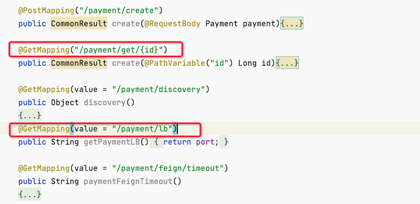

<font style="color:#282828;">我们目前不想暴露8001端口，希望在8001外面套一层9527，那么如何做呢？</font>

<font style="color:#282828;">Gateway网关路由有两种配置方式：</font>

1. <font style="color:#282828;">在配置文件yml中配置，就是上面的示例</font>
2. <font style="color:#282828;">代码中注入RouteLocator的Bean</font>

**<font style="color:#282828;"></font>**

**<font style="color:#DF2A3F;">YML方式新增网关配置：</font>**

```yaml
server:
  port: 9527

spring:
  application:
    name: cloud-gateway
  cloud:
    gateway:
      routes:
        - id: payment_routh #payment_route    #路由的ID，没有固定规则但要求唯一，建议配合服务名
          uri: http://localhost:8001          #匹配后提供服务的路由地址
          predicates:
            - Path=/payment/get/**         # 断言，路径相匹配的进行路由

        - id: payment_routh2 #payment_route    #路由的ID，没有固定规则但要求唯一，建议配合服务名
          uri: http://localhost:8001          #匹配后提供服务的路由地址
          predicates:
            - Path=/payment/lb/**         # 断言，路径相匹配的进行路由

eureka:
  instance:
    hostname: cloud-gateway-service
  client: #服务提供者provider注册进eureka服务列表内
    service-url:
      register-with-eureka: true
      fetch-registry: true
      defaultZone: http://eureka7001.com:7001/eureka
```

测试：

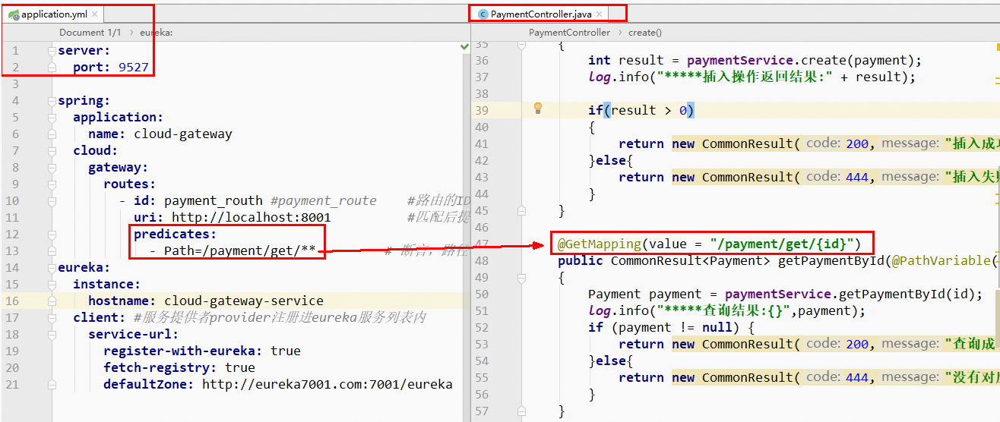

1. <font style="color:#282828;">启动7001、8001、9527网关</font>
2. <font style="color:#282828;">添加网关前：</font>[http://localhost:8001/payment/get/31](http://localhost:8001/payment/get/31)
3. <font style="color:#282828;">添加网关后：</font>[http://localhost:9527/payment/get/31](http://localhost:9527/payment/get/31)

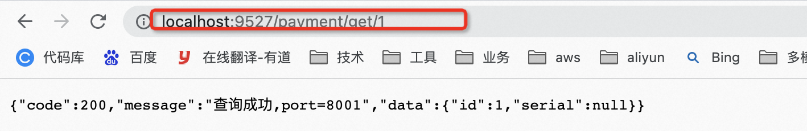

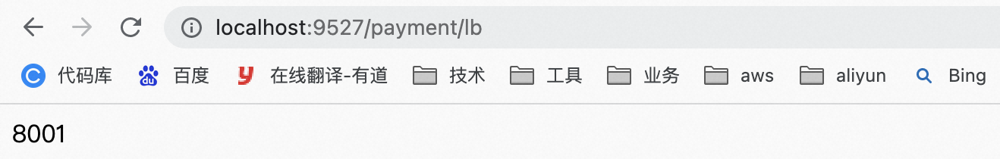


**<font style="color:#DF2A3F;">注入RouteLocator的Bean这种方式的演示：</font>**

<font style="color:#282828;">官网案例</font>

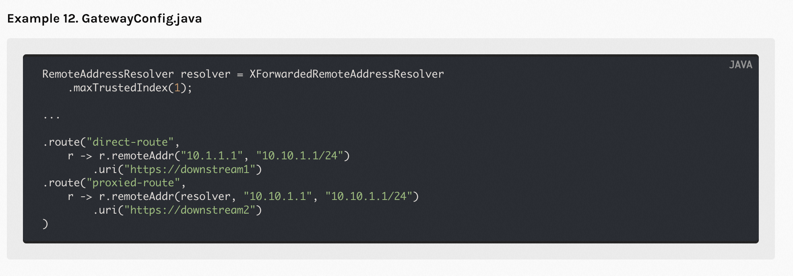

```java
package com.atguigu.springcloud.config;

import org.springframework.cloud.gateway.route.RouteLocator;
import org.springframework.cloud.gateway.route.builder.RouteLocatorBuilder;
import org.springframework.context.annotation.Bean;
import org.springframework.context.annotation.Configuration;

@Configuration
public class GateWayConfig
{
    /**
     * 配置了一个id为route-name的路由规则，
     * 当访问地址 http://localhost:9527/guonei时会自动转发到地址：http://news.baidu.com/guonei
     * @param builder
     * @return
     */
    @Bean
    public RouteLocator customRouteLocator(RouteLocatorBuilder builder)
    {
        RouteLocatorBuilder.Builder routes = builder.routes();

        routes.route("path_route_atguigu", r -> r.path("/guonei").uri("http://news.baidu.com/guonei")).build();

        return routes.build();

    }
    @Bean
    public RouteLocator customRouteLocator2(RouteLocatorBuilder builder)
    {
        RouteLocatorBuilder.Builder routes = builder.routes();
        routes.route("path_route_atguigu2", r -> r.path("/guoji").uri("http://news.baidu.com/guoji")).build();
        return routes.build();
    }
}
```

测试：[http://localhost:9527/guoji](http://localhost:9527/guoji)

# 5 实现动态路由
<font style="color:#282828;">默认情况下Gateway会根据注册中心注册的服务列表，以注册中心上微服务名为路径创建</font><font style="color:#ff0000;">动态路由进行转发，从而实现动态路由的功能</font>

<font style="color:#ff0000;">YML设置：</font>

```yaml
server:
  port: 9527

spring:
  application:
    name: cloud-gateway
  cloud:
    gateway:
      discovery:
        locator:
          enabled: true #开启从注册中心动态创建路由的功能，利用微服务名进行路由
      routes:
        - id: payment_routh #payment_route    #路由的ID，没有固定规则但要求唯一，建议配合服务名
          #uri: http://localhost:8001          #匹配后提供服务的路由地址
          uri: lb://cloud-payment-service #匹配后提供服务的路由地址
          predicates:
            - Path=/payment/get/**         # 断言，路径相匹配的进行路由

        - id: payment_routh2 #payment_route    #路由的ID，没有固定规则但要求唯一，建议配合服务名
          #uri: http://localhost:8001          #匹配后提供服务的路由地址
          uri: lb://cloud-payment-service #匹配后提供服务的路由地址
          predicates:
            - Path=/payment/lb/**         # 断言，路径相匹配的进行路由

eureka:
  instance:
    hostname: cloud-gateway-service
  client: #服务提供者provider注册进eureka服务列表内
    service-url:
      register-with-eureka: true
      fetch-registry: true
      defaultZone: http://eureka7001.com:7001/eureka
```

<font style="color:#282828;">需要注意的是uri的协议为lb，表示启用Gateway的负载均衡功能。</font>

`<font style="color:#282828;">lb://serviceName</font>`<font style="color:#282828;">是spring cloud gateway在微服务中自动为我们创建的负载均衡url</font>

**<font style="color:#4b4b4b;">测试：</font>**[http://localhost:9527/payment/lb](http://localhost:9527/payment/lb)；会出现<font style="color:#282828;">8001/8002两个端口切换</font>

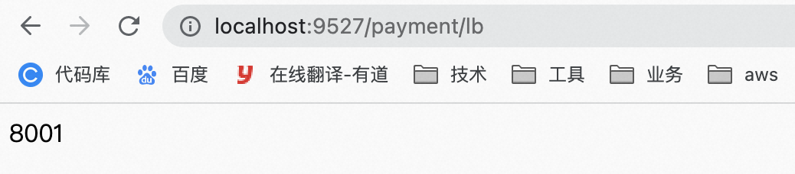

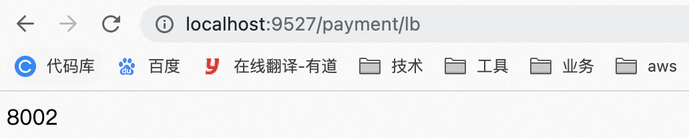

# 28. **<font style="color:#4b4b4b;">6 Predicate的使用</font>**
我们在启动我们的9527网关服务的时候，会出现

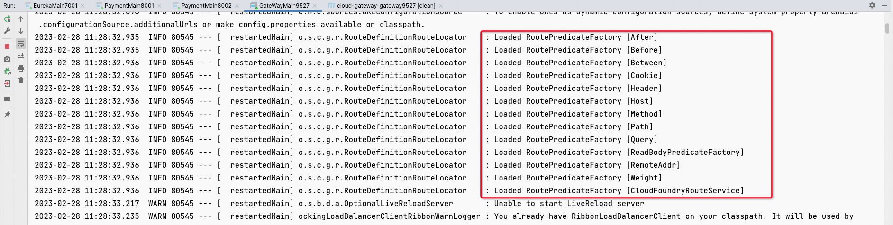

<font style="color:#282828;">Route Predicate Factories这个是什么？</font>

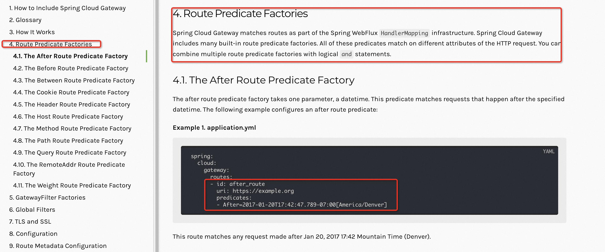

<font style="color:#282828;">常用的Route Predicate：</font>

1. **<font style="color:#282828;">After Route Predicate</font>**

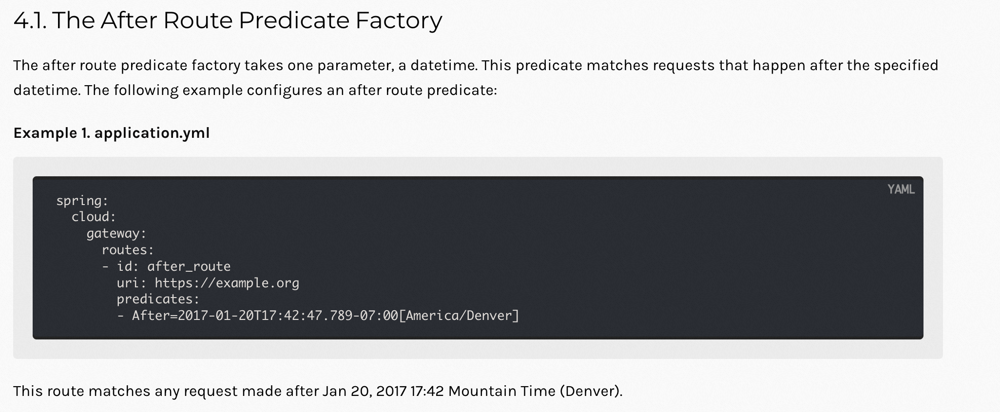

这个日期可以这样获取

```java
public static void main(String[] args) {
    ZonedDateTime zbj = ZonedDateTime.now(); // 默认时区
    System.out.println(zbj);//2023-02-28T11:49:24.926+08:00[Asia/Shanghai]
    //ZonedDateTime zny = ZonedDateTime.now(ZoneId.of("America/New_York")); // 用指定时区获取当前时间
    //System.out.println(zny);
}
```

2. **<font style="color:#282828;">Before Route Predicate</font>**

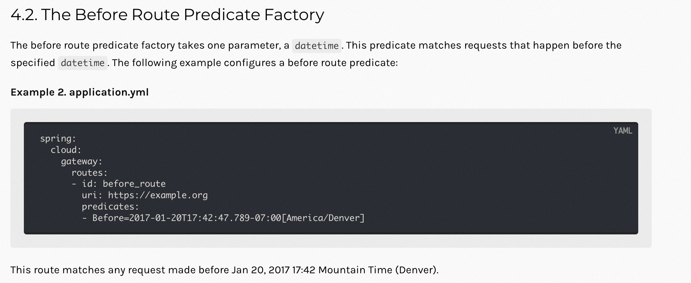

3. **<font style="color:#282828;">Between Route Predicate</font>**

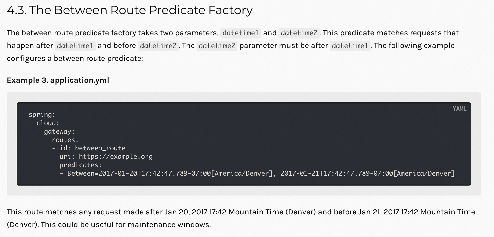

4. **<font style="color:#282828;">Cookie Route Predicate</font>**

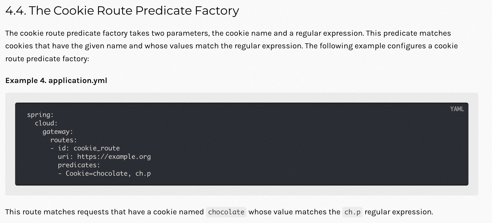

Cookie Route Predicate需要两个参数，一个是 Cookie name ,一个是正则表达式。

路由规则会通过获取对应的 Cookie name 值和正则表达式去匹配，如果匹配上就会执行路由，如果没有匹配上则不执行

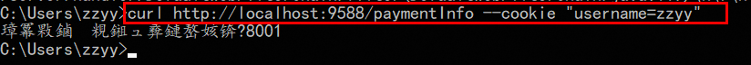

5. **<font style="color:#282828;">Header Route Predicate</font>**

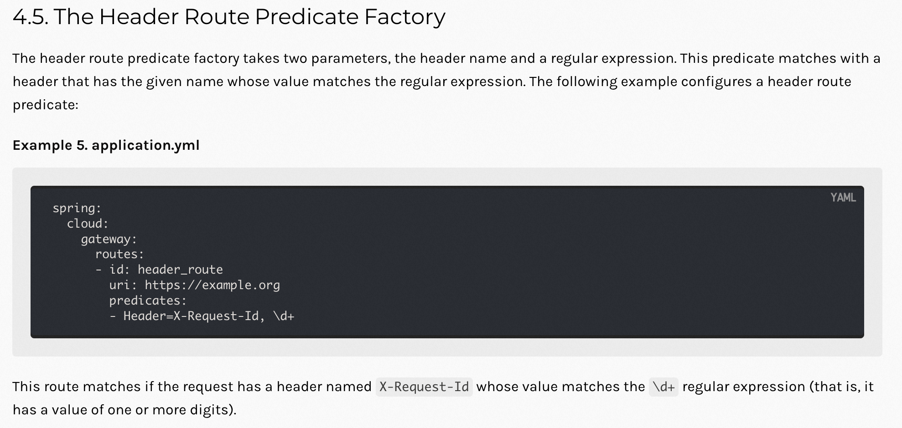

两个参数：一个是属性名称和一个正则表达式，这个属性值和正则表达式匹配则执行。

6. **<font style="color:#282828;">Host Route Predicate</font>**

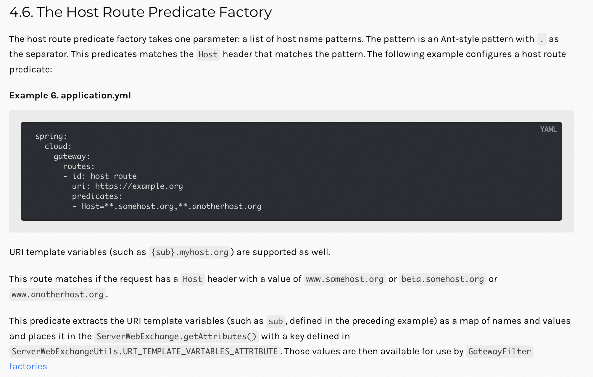

7. **<font style="color:#282828;">Method Route Predicate</font>**

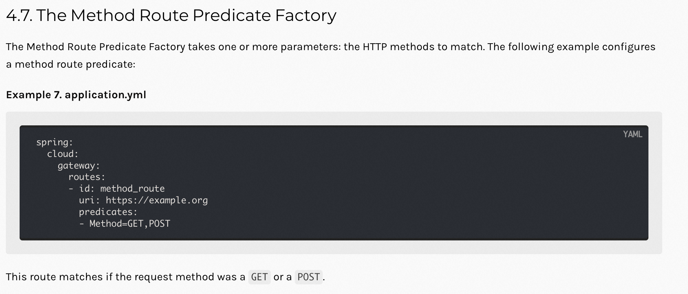

8. **<font style="color:#282828;">Path Route Predicate</font>**

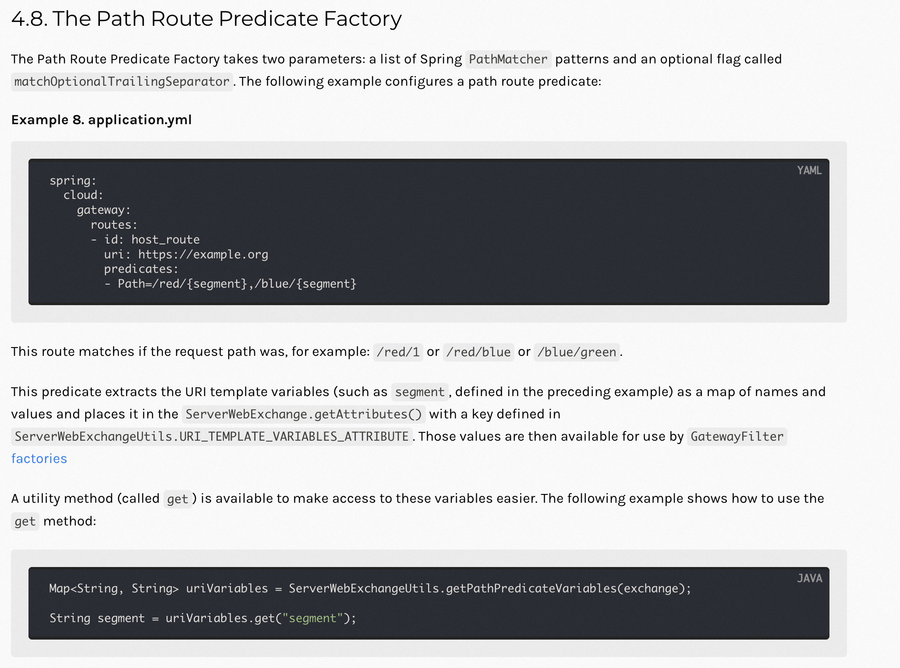

9. **<font style="color:#282828;">Query Route Predicate</font>**

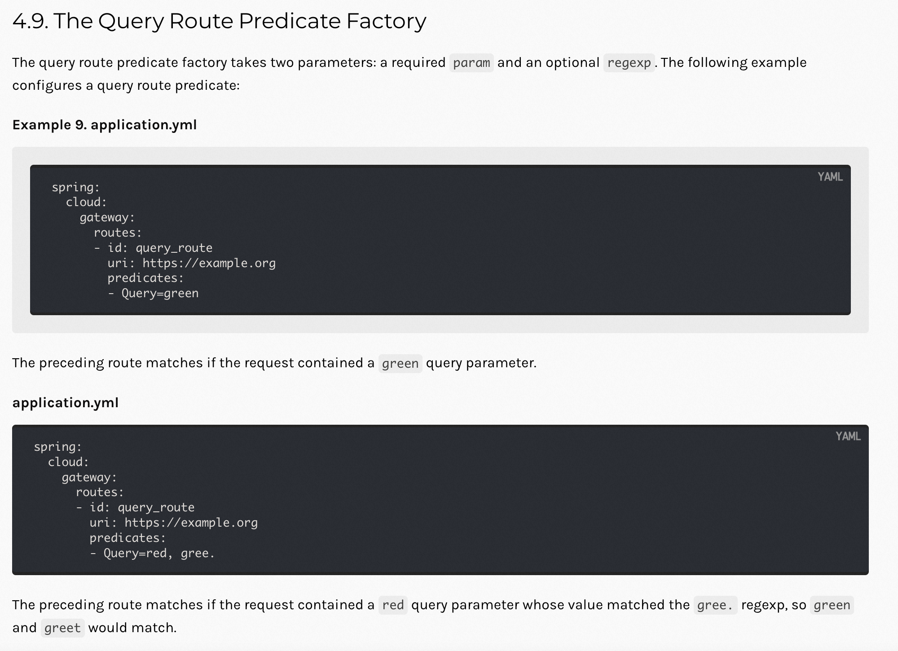

支持传入两个参数，一个是属性名，一个为属性值，属性值可以是正则表达式。

<font style="color:#DF2A3F;">总结：说白了，Predicate就是为了实现一组匹配规则，让请求过来找到对应的Route进行处理。</font>

# 7 **<font style="color:#4b4b4b;">Filter的使用</font>**
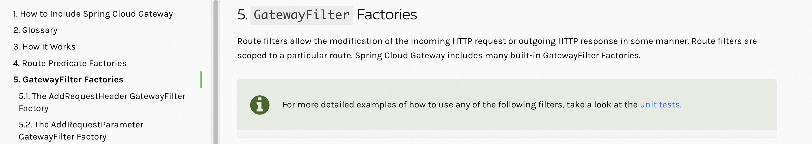

路由过滤器可用于修改进入的HTTP请求和返回的HTTP响应，路由过滤器只能指定路由进行使用。

Spring Cloud Gateway 内置了多种路由过滤器，他们都由GatewayFilter的工厂类来产生。

<font style="color:#282828;">Spring Cloud Gateway的Filter</font>

+ <font style="color:#282828;">生命周期，Only Two</font>
    - <font style="color:#282828;">pre</font>
    - <font style="color:#282828;">post</font>
+ <font style="color:#282828;">种类，Only Two</font>
    - <font style="color:#282828;">GatewayFilter </font>
    - <font style="color:#282828;">GlobalFilter</font>

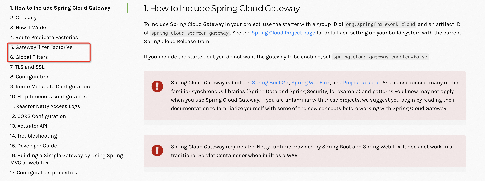

用法如下方官方示例图

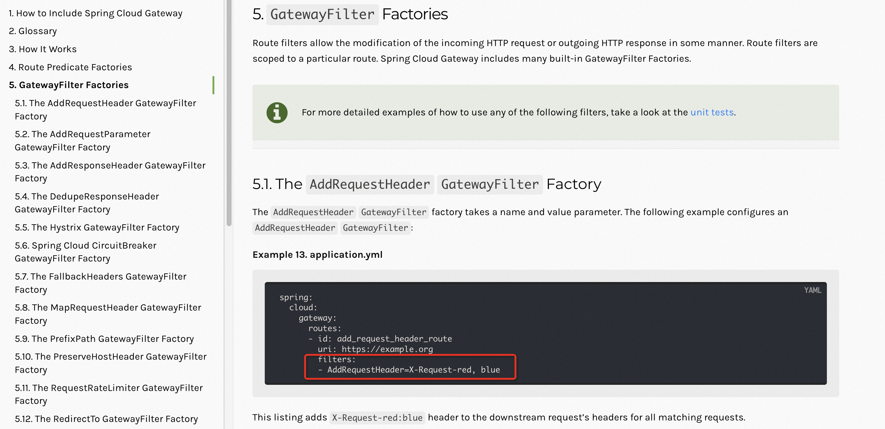

常见的<font style="color:#282828;">GatewayFilter：见</font>[官网](https://cloud.spring.io/spring-cloud-static/spring-cloud-gateway/2.2.1.RELEASE/reference/html/#gatewayfilter-factories)

## 7.1 **<font style="color:#4b4b4b;">自定义过滤器</font>**
<font style="color:#282828;">自定义全局GlobalFilter</font>

<font style="color:#282828;">方式：</font><font style="color:#000000;">实现</font>`<font style="color:#000000;">GlobalFilter</font>``<font style="color:#000000;">Ordered</font>`<font style="color:#000000;">两个接口</font>

<font style="color:#000000;">可以做什么？</font>

+ <font style="color:#282828;">全局日志记录</font>
+ <font style="color:#282828;">统一网关鉴权</font>
+ <font style="color:#282828;">...等等</font>

代码如下：

```java
package com.atguigu.springcloud.com.atguigu.springcloud.filter;

import org.springframework.cloud.gateway.filter.GatewayFilterChain;
import org.springframework.cloud.gateway.filter.GlobalFilter;
import org.springframework.core.Ordered;
import org.springframework.http.HttpStatus;
import org.springframework.stereotype.Component;
import org.springframework.web.server.ServerWebExchange;
import reactor.core.publisher.Mono;

import java.util.Date;

@Component //必须加，必须加，必须加
public class MyLogGateWayFilter implements GlobalFilter, Ordered
{
    @Override
    public Mono<Void> filter(ServerWebExchange exchange, GatewayFilterChain chain)
    {
        System.out.println("time:"+new Date()+"\t 执行了自定义的全局过滤器: "+"MyLogGateWayFilter"+"hello");

        String uname = exchange.getRequest().getQueryParams().getFirst("uname");
        if (uname == null) {
            System.out.println("****用户名为null，无法登录");
            exchange.getResponse().setStatusCode(HttpStatus.NOT_ACCEPTABLE);
            return exchange.getResponse().setComplete();
        }
        return chain.filter(exchange);
    }

    @Override
    public int getOrder()
    {
        return 0;
    }
}

```

启动7001、8001、8002、9527服务

测试：

+ 正确：[http://localhost:9527/payment/lb?uname=z3](http://localhost:9527/payment/lb?uname=z3)

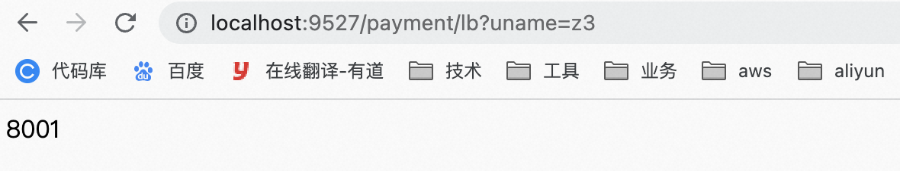

+ <font style="color:#282828;">错误：</font>[http://localhost:9527/payment/lb](http://localhost:9527/payment/lb)

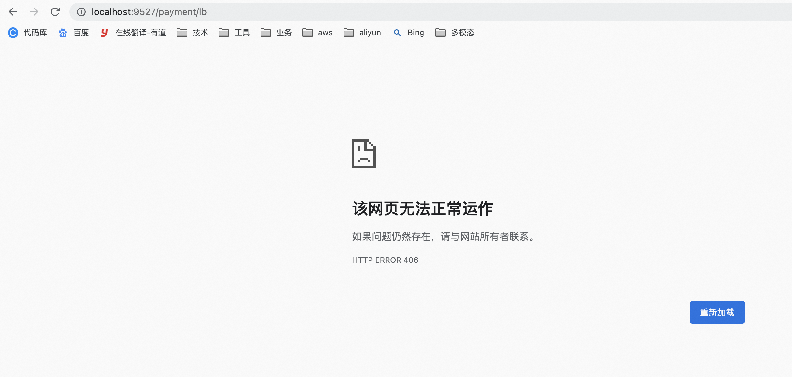


