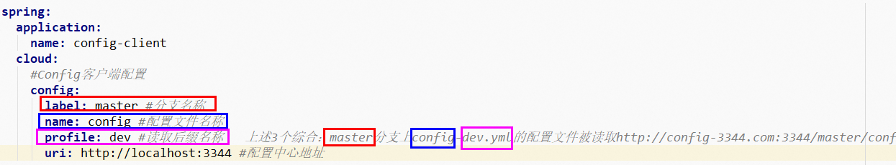

**笔记来源：**[**尚硅谷SpringCloud框架开发教程(SpringCloudAlibaba微服务分布式架构丨Spring Cloud)**](https://www.bilibili.com/video/BV18E411x7eT/?spm_id_from=333.337.search-card.all.click&vd_source=e8046ccbdc793e09a75eb61fe8e84a30)


**前言：**  分布式系统面临的配置问题

微服务意味着要将单体应用中的业务拆分成一个个子服务，每个服务的粒度相对较小，因此系统中会出现大量的服务。由于每个服务都需要必要的配置信息才能运行，所以一套集中式的、动态的配置管理设施是必不可少的。

SpringCloud提供了Config  Server来解决这个问题，我们每一个微服务自己带着一个application.yml，上百个配置文件的管理将会非常麻烦。所以分布式配置中心应运而生。

# 1 概述


Config是什么？SpringCloud Config为微服务架构中的微服务提供集中化的外部配置支持，配置服务器为各个不同微服务应用的所有环境提供了一个中心化的外部配置。


架构：SpringCloud Config分为服务端和客户端两部分。

服务端也称为分布式配置中心，它是一个独立的微服务应用，用来连接配置服务器并为客户端提供获取配置信息，加密/解密信息等访问接口

客户端则是通过指定的配置中心来管理应用资源，以及与业务相关的配置内容，并在启动的时候从配置中心获取和加载配置信息配置服务器默认采用git来存储配置信息，这样就有助于对环境配置进行版本管理，并且可以通过git客户端工具来方便的管理和访问配置内容。

主要功能：

+ 集中管理配置文件
+ 不同环境不同配置，动态化的配置更新，分环境部署比如dev/test/prod/beta/release
+ 运行期间动态调整配置，不再需要在每个服务部署的机器上编写配置文件，服务会向配置中心统一拉取配置自己的信息
+ 当配置发生变动时，服务不需要重启即可感知到配置的变化并应用新的配置
+ 将配置信息以REST接口的形式暴露，postman、curl访问刷新均可


与GitHub整合配置：由于SpringCloud Config默认使用Git来存储配置文件(也有其它方式,比如支持SVN和本地文件)，但最推荐的还是Git，而且使用的是http/https访问的形式。

官网：[SpringCloud Config](https://cloud.spring.io/spring-cloud-static/spring-cloud-config/2.2.1.RELEASE/reference/html/)


# 2 Config服务端的配置
## 2.1 GIT环境配置
配置步骤

1. 在GitHub上新建一个名为`springcloud-config`的新Repository

2. 获取`git@github.com:zzyybs/springcloud-config.git`地址

3. 本地硬盘目录上新建git仓库并clone：`git clone git@github.com:zzyybs/springcloud-config.git` 

4. 此时在本地D盘符下`D:\44\SpringCloud2020\springcloud-config` 。表示多个环境的配置文件，保存格式必须为 UTF-8 。该文件可以从周阳老师的github仓库克隆一份  [https://github.com/zzyybs/springcloud-config](https://github.com/zzyybs/springcloud-config)  。复制到自己的仓库    

                      

5. 如果需要修改，此处模拟运维人员操作git和github

   ```basic
   git add .
   git commit -m "init yml"
   git push origin master
   ```

## 2.2 搭建Config服务端
搭建步骤

1. 创建Module
    1. 创建Module

       


    2. 填写Module名称


       


    3. 点击完成

2. POM

    ```xml
    <?xml version="1.0" encoding="UTF-8"?>
    <project xmlns="http://maven.apache.org/POM/4.0.0"
             xmlns:xsi="http://www.w3.org/2001/XMLSchema-instance"
             xsi:schemaLocation="http://maven.apache.org/POM/4.0.0 http://maven.apache.org/xsd/maven-4.0.0.xsd">
        <parent>
            <artifactId>cloud2020</artifactId>
            <groupId>com.atguigu.springcloud</groupId>
            <version>1.0-SNAPSHOT</version>
        </parent>
        <modelVersion>4.0.0</modelVersion>

        <artifactId>cloud-config-center-3344</artifactId>

        <properties>
            <maven.compiler.source>8</maven.compiler.source>
            <maven.compiler.target>8</maven.compiler.target>
        </properties>

        <dependencies>
            <dependency>
                <groupId>org.springframework.cloud</groupId>
                <artifactId>spring-cloud-config-server</artifactId>
            </dependency>
            <dependency>
                <groupId>org.springframework.cloud</groupId>
                <artifactId>spring-cloud-starter-netflix-eureka-client</artifactId>
            </dependency>
            <dependency>
                <groupId>org.springframework.boot</groupId>
                <artifactId>spring-boot-starter-web</artifactId>
            </dependency>

            <dependency>
                <groupId>org.springframework.boot</groupId>
                <artifactId>spring-boot-starter-actuator</artifactId>
            </dependency>
            <dependency>
                <groupId>org.springframework.boot</groupId>
                <artifactId>spring-boot-devtools</artifactId>
                <scope>runtime</scope>
                <optional>true</optional>
            </dependency>
            <dependency>
                <groupId>org.projectlombok</groupId>
                <artifactId>lombok</artifactId>
                <optional>true</optional>
            </dependency>
            <dependency>
                <groupId>org.springframework.boot</groupId>
                <artifactId>spring-boot-starter-test</artifactId>
                <scope>test</scope>
            </dependency>
        </dependencies>
    </project>
    ```


3. YML

   ```yaml
   server:
     port: 3344

   spring:
     application:
       name:  cloud-config-center #注册进Eureka服务器的微服务名
     cloud:
       config:
         server:
           git:
             uri: git@github.com:zzyybs/springcloud-config.git #GitHub上面的git仓库名字
             ####搜索目录
             search-paths:
               - springcloud-config
         ####读取分支
         label: master

   #服务注册到eureka地址
   eureka:
     client:
       service-url:
         defaultZone: http://localhost:7001/eureka
   ```


4. 主启动

   ```java
   package com.atguigu.springcloud;

   import org.springframework.boot.SpringApplication;
   import org.springframework.boot.autoconfigure.SpringBootApplication;
   import org.springframework.cloud.config.server.EnableConfigServer;

   @SpringBootApplication
   @EnableConfigServer
   public class ConfigCenterMain3344
   {
       public static void main(String[] args) {
           SpringApplication.run(ConfigCenterMain3344.class, args);
       }
   }
   ```


5. 增加映射：修改hosts文件，增加映射

   ```properties
   127.0.0.1  config-3344.com
   ```


6. 测试：[http://config-3344.com:3344/master/config-dev.yml](http://config-3344.com:3344/master/config-dev.yml)


## 2.3 配置读取规则
官网图：


+ `**/{label}/{application}-{profile}.yml**`
    - master分支
        * [http://config-3344.com:3344/master/config-dev.yml](http://config-3344.com:3344/master/config-dev.yml)
        * [http://config-3344.com:3344/master/config-test.yml](http://config-3344.com:3344/master/config-test.yml)
        * [http://config-3344.com:3344/master/config-prod.yml](http://config-3344.com:3344/master/config-prod.yml)
    - dev分支
        * [http://config-3344.com:3344/dev/config-dev.yml](http://config-3344.com:3344/dev/config-dev.yml)
        * [http://config-3344.com:3344/dev/config-test.yml](http://config-3344.com:3344/dev/config-test.yml)
        * [http://config-3344.com:3344/dev/config-prod.yml](http://config-3344.com:3344/dev/config-prod.yml)
+ `**/{application}-{profile}.yml**`
    - [http://config-3344.com:3344/config-dev.yml](http://config-3344.com:3344/config-dev.yml)
    - [http://config-3344.com:3344/config-test.yml](http://config-3344.com:3344/config-test.yml)
    - [http://config-3344.com:3344/config-prod.yml](http://config-3344.com:3344/config-prod.yml)
    - [http://config-3344.com:3344/config-xxxx.yml(](http://config-3344.com:3344/config-xxxx.yml()不存在的配置)
+ `**/{application}/{profile}[/{label}]**`
    - [http://config-3344.com:3344/config/dev/master](http://config-3344.com:3344/config/dev/master)
    - [http://config-3344.com:3344/config/test/master](http://config-3344.com:3344/config/test/master)
    - [http://config-3344.com:3344/config/test/dev](http://config-3344.com:3344/config/test/dev)

重要配置细节总结：`/{label}-{name}-{profiles}.yml`

+ label：分支(branch)
+ name ：服务名
+ profiles：环境(dev/test/prod)


成功实现了用SpringCloud Config通过GitHub获取配置信息

# 3 Config客户端配置
客户端配置步骤：

1. 新建Module
    1. 新建Module

       


    2. 填写Module名称


       


    3. 点击完成

2. POM

    ```xml
    <?xml version="1.0" encoding="UTF-8"?>
    <project xmlns="http://maven.apache.org/POM/4.0.0"
             xmlns:xsi="http://www.w3.org/2001/XMLSchema-instance"
             xsi:schemaLocation="http://maven.apache.org/POM/4.0.0 http://maven.apache.org/xsd/maven-4.0.0.xsd">
        <parent>
            <artifactId>cloud2020</artifactId>
            <groupId>com.atguigu.springcloud</groupId>
            <version>1.0-SNAPSHOT</version>
        </parent>
        <modelVersion>4.0.0</modelVersion>

        <artifactId>cloud-config-client-3355</artifactId>

        <properties>
            <maven.compiler.source>8</maven.compiler.source>
            <maven.compiler.target>8</maven.compiler.target>
        </properties>
        <dependencies>
            <dependency>
                <groupId>org.springframework.cloud</groupId>
                <artifactId>spring-cloud-starter-config</artifactId>
            </dependency>
            <dependency>
                <groupId>org.springframework.cloud</groupId>
                <artifactId>spring-cloud-starter-netflix-eureka-client</artifactId>
            </dependency>
            <dependency>
                <groupId>org.springframework.boot</groupId>
                <artifactId>spring-boot-starter-web</artifactId>
            </dependency>
            <dependency>
                <groupId>org.springframework.boot</groupId>
                <artifactId>spring-boot-starter-actuator</artifactId>
            </dependency>

            <dependency>
                <groupId>org.springframework.boot</groupId>
                <artifactId>spring-boot-devtools</artifactId>
                <scope>runtime</scope>
                <optional>true</optional>
            </dependency>
            <dependency>
                <groupId>org.projectlombok</groupId>
                <artifactId>lombok</artifactId>
                <optional>true</optional>
            </dependency>
            <dependency>
                <groupId>org.springframework.boot</groupId>
                <artifactId>spring-boot-starter-test</artifactId>
                <scope>test</scope>
            </dependency>
        </dependencies>
    </project>
    ```


3. YML：`bootstrap.yml`

   >applicaiton.yml 是用户级的资源配置项
   >
   >bootstrap.yml 是系统级的，优先级更加高
   >
   >Spring Cloud 会创建一个`Bootstrap Context`，作为Spring应用的 `Application Context` 的父上下文。初始化的时候，`Bootstrap Context` 负责从外部源加载配置属性并解析配置。这两个上下文共享一个从外部获取的 `Environment` 。
   >
   >`Bootstrap` 属性有高优先级，默认情况下，它们不会被本地配置覆盖。 `Bootstrap context` 和`Application Context` 有着不同的约定，所以新增了一个 `bootstrap.yml` 文件，保证`Bootstrap Context` 和 `Application Context` 配置的分离。
   >
   >要将Client 模块下的 application.yml 文件改为 bootstrap.yml，这是很关键的。
   >
   >因为bootstrap.yml 是比 application.yml 先加载的。bootstrap.yml 优先级高于 application.yml

   ```yaml
   server:
     port: 3355

   spring:
     application:
       name: config-client
     cloud:
       #Config客户端配置
       config:
         label: master #分支名称
         name: config #配置文件名称
         profile: dev #读取后缀名称   上述3个综合：master分支上config-dev.yml的配置文件被读取http://config-3344.com:3344/master/config-dev.yml
         uri: http://localhost:3344 #配置中心地址k

   #服务注册到eureka地址
   eureka:
     client:
       service-url:
         defaultZone: http://localhost:7001/eureka
   ```

   

4. 主启动

   ```java
   package com.atguigu.springcloud;

   import org.springframework.boot.SpringApplication;
   import org.springframework.boot.autoconfigure.SpringBootApplication;
   import org.springframework.cloud.netflix.eureka.EnableEurekaClient;
   ```


   @EnableEurekaClient
   @SpringBootApplication
   public class ConfigClientMain3355
   {
       public static void main(String[] args) {
               SpringApplication.run(ConfigClientMain3355.class, args);
       }
   }
   ```


5. 业务类

   ```java
   package com.atguigu.springcloud.controller;

   import org.springframework.beans.factory.annotation.Value;
   import org.springframework.cloud.context.config.annotation.RefreshScope;
   import org.springframework.web.bind.annotation.GetMapping;
   import org.springframework.web.bind.annotation.RestController;


   @RestController
   public class ConfigClientController
   {
       @Value("${config.info}")
       private String configInfo;

       @GetMapping("/configInfo")
       public String getConfigInfo()
       {
           return configInfo;
       }
   }
   ```


6. 测试
    1. 启动Config配置中心3344微服务并自测
        * [http://config-3344.com:3344/master/config-prod.yml](http://config-3344.com:3344/master/config-prod.yml)
        * [http://config-3344.com:3344/master/config-dev.yml](http://config-3344.com:3344/master/config-dev.yml)
    2. 启动3355作为Client准备访问
        * [http://localhost:3355/configInfo](http://localhost:3355/configInfo)

      成功实现了客户端3355访问SpringCloud Config3344通过GitHub获取配置信息

7. 剩余问题
    - Linux运维修改GitHub上的配置文件内容做调整，刷新3344，发现ConfigServer配置中心立刻响应，刷新3355，发现ConfigClient客户端没有任何响应，3355没有变化除非自己重启或者重新加载，难道每次运维修改配置文件，客户端都需要重启？这显然是非常不合理的！！！

# 4 Config客户端之手动刷新
避免每次更新配置都要重启客户端微服务3355，解决上面的遗留问题，接下来做如下操作：

修改3355模块

1. POM

   ```xml
   <dependency>
     <groupId>org.springframework.boot</groupId>
     <artifactId>spring-boot-starter-actuator</artifactId>
   </dependency>
   ```


2. YML

   ```yaml
   server:
     port: 3355

   spring:
     application:
       name: config-client
     cloud:
       #Config客户端配置
       config:
         label: master #分支名称
         name: config #配置文件名称
         profile: dev #读取后缀名称   上述3个综合：master分支上config-dev.yml的配置文件被读取http://config-3344.com:3344/master/config-dev.yml
         uri: http://localhost:3344 #配置中心地址k

   #服务注册到eureka地址
   eureka:
     client:
       service-url:
         defaultZone: http://localhost:7001/eureka

   # 31. 暴露监控端点
   management:
     endpoints:
       web:
         exposure:
           include: "*"
   ```


3. controller：`@RefreshScope`

   ```java
   package com.atguigu.springcloud.controller;

   import org.springframework.beans.factory.annotation.Value;
   import org.springframework.cloud.context.config.annotation.RefreshScope;
   import org.springframework.web.bind.annotation.GetMapping;
   import org.springframework.web.bind.annotation.RestController;

   /**
    * @auther zzyy
    * @create 2020-02-21 18:08
    */
   @RestController
   @RefreshScope
   public class ConfigClientController
   {
       @Value("${config.info}")
       private String configInfo;

       @GetMapping("/configInfo")
       public String getConfigInfo()
       {
           return configInfo;
       }
   }
   ```


4. 再次测试
    1. 此时修改github里的配置文件，
    2. 访问[http://localhost:3355/configInfo](http://localhost:3355/configInfo)，发现还是没有改变，这个是什么原因呢？
5. 需要运维人员发送Post请求刷新3355：`curl -X POST "http://localhost:3355/actuator/refresh"`必须是POST请求，手动刷新

    

6. 再次修改github里的配置文件，然后调用上述命令，成功实现了客户端3355刷新到最新配置内容，避免了服务重启。
7. 遗留问题：虽然勉强实现了手动刷新，但是还是有非常多的问题
    - 假如有多个微服务客户端3355/3366/3377，每个微服务都要执行一次post请求，手动刷新？可否广播，一次通知，处处生效？我们想大范围的自动刷新，求方法，接下来我们看微服务之消息总线Bus来解决这个问题


