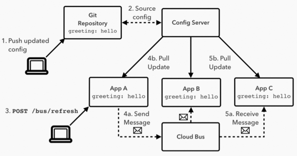
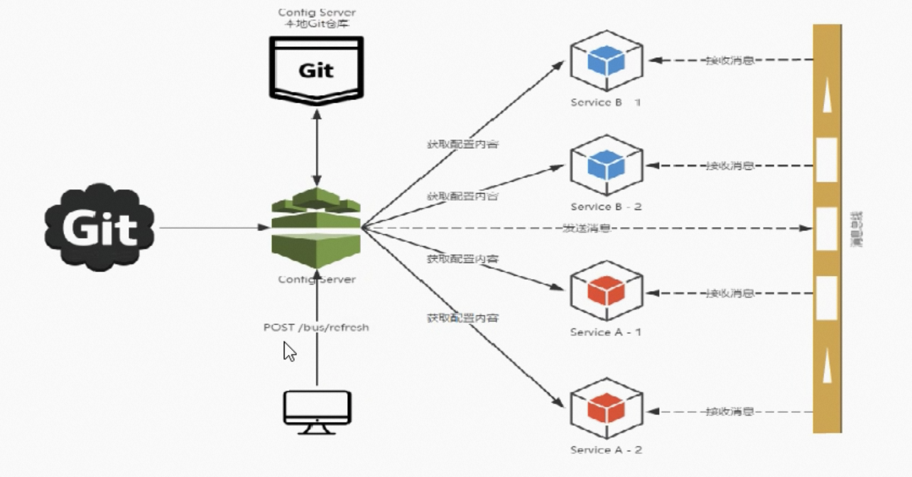
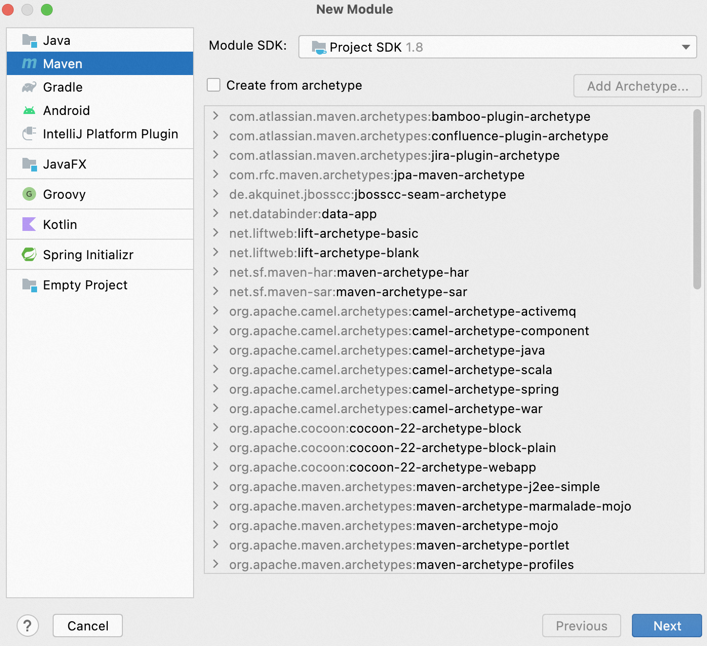
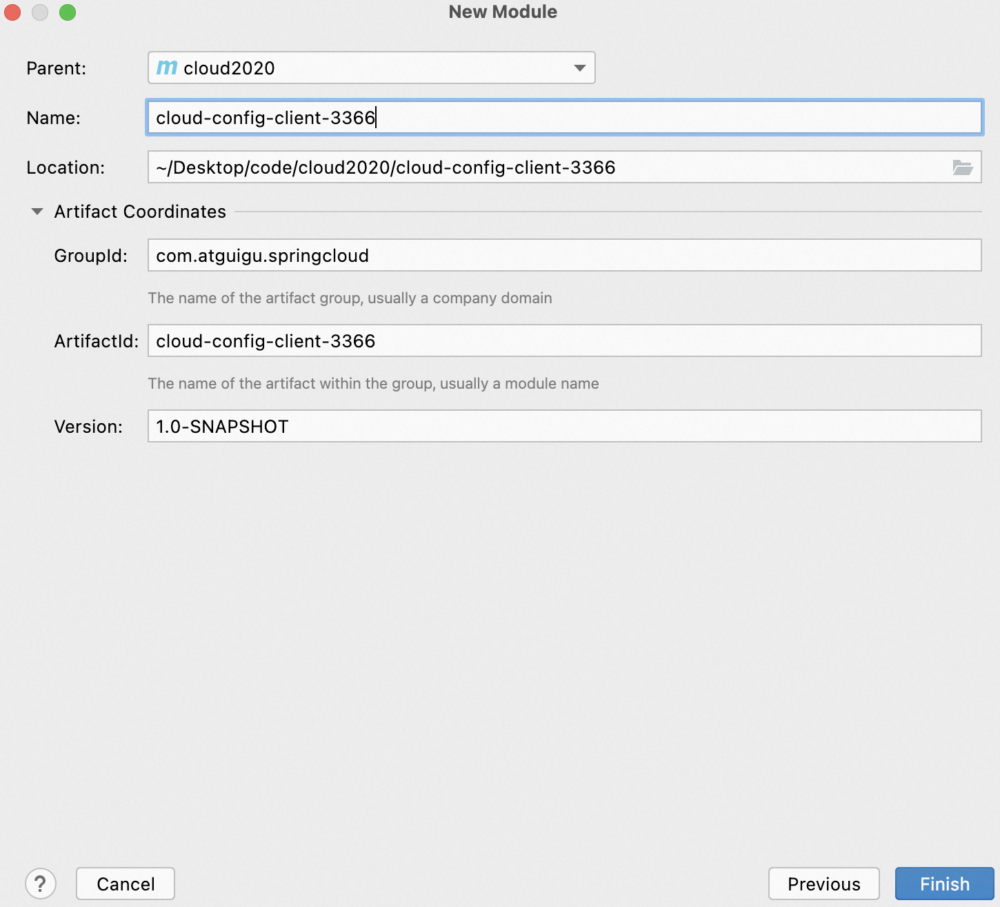
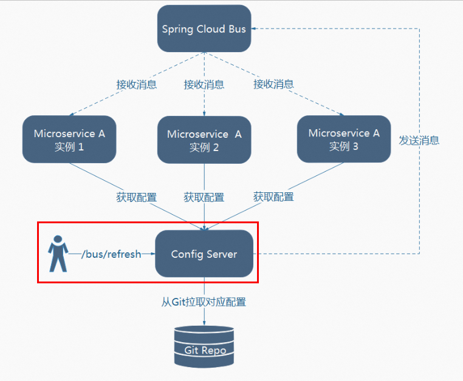
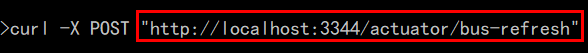
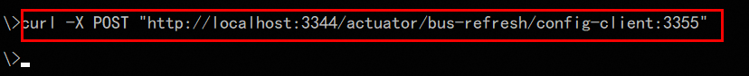
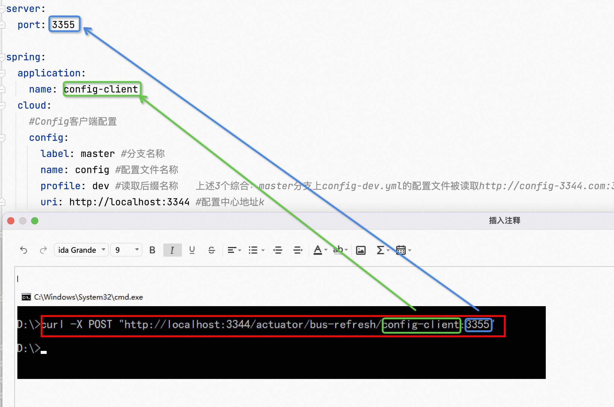
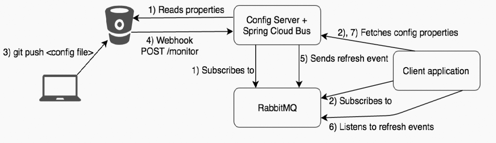

**笔记来源：**[**尚硅谷SpringCloud框架开发教程(SpringCloudAlibaba微服务分布式架构丨Spring Cloud)**](https://www.bilibili.com/video/BV18E411x7eT/?spm_id_from=333.337.search-card.all.click&vd_source=e8046ccbdc793e09a75eb61fe8e84a30)

前言：在前面我们知道，分布式的配置文件无法自动刷新，我们最多只能做到手动刷新，接下来我们学习Bus，Spring Cloud Bus 配合 Spring Cloud Config 使用可以实现配置的动态刷新。

# 1 概述

Spring Cloud Bus 配合 Spring Cloud Config 使用可以实现配置的动态刷新。

 

Spring Cloud Bus是用来将分布式系统的节点与轻量级消息系统链接起来的框架，它整合了Java的事件处理机制和消息中间件的功能。

Spring Clud Bus目前支持RabbitMQ和Kafka。

功能：Spring Cloud Bus能管理和传播分布式系统间的消息，就像一个分布式执行器，可用于广播状态更改、事件推送等，也可以当作微服务间的通信通道。



为何被称为总线？

什么是总线？在微服务架构的系统中，通常会使用轻量级的消息代理来构建一个共用的消息主题，并让系统中所有微服务实例都连接上来。由于该主题中产生的消息会被所有实例监听和消费，所以称它为消息总线。在总线上的各个实例，都可以方便地广播一些需要让其他连接在该主题上的实例都知道的消息。

基本原理：ConfigClient 实例都监听MQ中同一个 topic （默认是springCloudBus）。当一个服务刷新数据的时候，它会把这个信息放入到 Topic 中，这样其它监听同一Topic的服务就能得到通知，然后去更新自身的配置。

# 2 RabbitMQ环境配置
[01 RabbitMQ：消息队列简介](https://www.yuque.com/u21918439/vg7knb/ke1xkg)

# 3 Bus动态刷新全局广播
## 3.1 搭建测试服务
搭建步骤：以3355为模版

1. 创建Module
    1. 创建Module
       

    2. 填写Module名称
       

    3. 点击完成

2. POM

    ```xml
    <?xml version="1.0" encoding="UTF-8"?>
    <project xmlns="http://maven.apache.org/POM/4.0.0"
             xmlns:xsi="http://www.w3.org/2001/XMLSchema-instance"
             xsi:schemaLocation="http://maven.apache.org/POM/4.0.0 http://maven.apache.org/xsd/maven-4.0.0.xsd">
        <parent>
            <artifactId>cloud2020</artifactId>
            <groupId>com.atguigu.springcloud</groupId>
            <version>1.0-SNAPSHOT</version>
        </parent>
        <modelVersion>4.0.0</modelVersion>

        <artifactId>cloud-config-client-3366</artifactId>

        <properties>
            <maven.compiler.source>8</maven.compiler.source>
            <maven.compiler.target>8</maven.compiler.target>
        </properties>

        <dependencies>
            <dependency>
                <groupId>org.springframework.cloud</groupId>
                <artifactId>spring-cloud-starter-config</artifactId>
            </dependency>
            <dependency>
                <groupId>org.springframework.cloud</groupId>
                <artifactId>spring-cloud-starter-netflix-eureka-client</artifactId>
            </dependency>
            <dependency>
                <groupId>org.springframework.boot</groupId>
                <artifactId>spring-boot-starter-web</artifactId>
            </dependency>
            <dependency>
                <groupId>org.springframework.boot</groupId>
                <artifactId>spring-boot-starter-actuator</artifactId>
            </dependency>

            <dependency>
                <groupId>org.springframework.boot</groupId>
                <artifactId>spring-boot-devtools</artifactId>
                <scope>runtime</scope>
                <optional>true</optional>
            </dependency>
            <dependency>
                <groupId>org.projectlombok</groupId>
                <artifactId>lombok</artifactId>
                <optional>true</optional>
            </dependency>
            <dependency>
                <groupId>org.springframework.boot</groupId>
                <artifactId>spring-boot-starter-test</artifactId>
                <scope>test</scope>
            </dependency>
        </dependencies>
    </project>
    ```


3. YML：bootstrap.yml

   ```yaml
   server:
     port: 3366

   spring:
     application:
       name: config-client
     cloud:
       #Config客户端配置
       config:
         label: master #分支名称
         name: config #配置文件名称
         profile: dev #读取后缀名称   上述3个综合：master分支上config-dev.yml的配置文件被读取http://config-3344.com:3344/master/config-dev.yml
         uri: http://localhost:3344 #配置中心地址k

   #服务注册到eureka地址
   eureka:
     client:
       service-url:
         defaultZone: http://localhost:7001/eureka

   # 33. 暴露监控端点
   management:
     endpoints:
       web:
         exposure:
           include: "*"
   ```


4. 主启动

   ```java
   package com.atguigu.springcloud;

   import org.springframework.boot.SpringApplication;
   import org.springframework.boot.autoconfigure.SpringBootApplication;
   import org.springframework.cloud.netflix.eureka.EnableEurekaClient;

   /**
    * @auther zzyy
    * @create 2020-02-21 18:07
    */
   @EnableEurekaClient
   @SpringBootApplication
   public class ConfigClientMain3366
   {
       public static void main(String[] args) {
               SpringApplication.run(ConfigClientMain3366.class, args);
       }
   }
   ```


5. controller

   ```java
   package com.atguigu.springcloud;

   import org.springframework.beans.factory.annotation.Value;
   import org.springframework.cloud.context.config.annotation.RefreshScope;
   import org.springframework.web.bind.annotation.GetMapping;
   import org.springframework.web.bind.annotation.RestController;


   @RestController
   @RefreshScope
   public class ConfigClientController
   {
       @Value("${server.port}")
       private String serverPort;

       @Value("${config.info}")
       private String configInfo;

       @GetMapping("/configInfo")
       public String configInfo()
       {
           return "serverPort: "+serverPort+"\t

    configInfo: "+configInfo;
       }
   }
   ```

   ​

## 3.2 设计思想
两种方案：

方案一：利用消息总线触发一个客户端/bus/refresh,而刷新所有客户端的配置


方案二：利用消息总线触发一个服务端ConfigServer的/bus/refresh端点，而刷新所有客户端的配置



方案二的架构显然更加适合，图一不适合的原因如下

1. 打破了微服务的职责单一性，因为微服务本身是业务模块，它本不应该承担配置刷新的职责。
2. 破坏了微服务各节点的对等性。
3. 有一定的局限性。例如，微服务在迁移时，它的网络地址常常会发生变化，此时如果想要做到自动刷新，那就会增加更多的修改


方案二实施步骤

1. 给cloud-config-center-3344配置中心服务端添加消息总线支持
    - POM

      ```xml
      <!--添加消息总线RabbitMQ支持-->
      <dependency>
          <groupId>org.springframework.cloud</groupId>
          <artifactId>spring-cloud-starter-bus-amqp</artifactId>
      </dependency>
      ```

    - YML

      ```yaml
      server:
        port: 3344

      spring:
        application:
          name:  cloud-config-center #注册进Eureka服务器的微服务名
        cloud:
          config:
            server:
              git:
                uri: git@github.com:zzyybs/springcloud-config.git #GitHub上面的git仓库名字
                ####搜索目录
                search-paths:
                  - springcloud-config
            ####读取分支
            label: master
        #rabbitmq相关配置
        rabbitmq:
          host: localhost
          port: 5672
          username: guest
          password: guest

      #服务注册到eureka地址
      eureka:
        client:
          service-url:
            defaultZone: http://localhost:7001/eureka

      ##rabbitmq相关配置,暴露bus刷新配置的端点
      management:
        endpoints: #暴露bus刷新配置的端点
          web:
            exposure:
              include: 'bus-refresh'
      ```


2. 给`cloud-config-client-3355` `cloud-config-client-3355`客户端添加消息总线支持
    - POM

      ```xml
      <!--添加消息总线RabbitMQ支持-->
      <dependency>
          <groupId>org.springframework.cloud</groupId>
          <artifactId>spring-cloud-starter-bus-amqp</artifactId>
      </dependency>
      ```

    - YML

      ```yaml
      server:
        port: 3355 #或者是3366

      spring:
        application:
          name: config-client
        cloud:
          #Config客户端配置
          config:
            label: master #分支名称
            name: config #配置文件名称
            profile: dev #读取后缀名称   上述3个综合：master分支上config-dev.yml的配置文件被读取http://config-3344.com:3344/master/config-dev.yml
            uri: http://localhost:3344 #配置中心地址k
        #rabbitmq相关配置 15672是Web管理界面的端口；5672是MQ访问的端口
        rabbitmq:
          host: localhost
          port: 5672
          username: guest
          password: guest
          
      #服务注册到eureka地址
      eureka:
        client:
          service-url:
            defaultZone: http://localhost:7001/eureka

      # 34. 暴露监控端点
      management:
        endpoints:
          web:
            exposure:
              include: "*"
      ```


3.  测试
    1. 修改Github上配置文件增加版本号
    2. 执行`curl -X POST "http://localhost:3344/actuator/bus-refresh"`，一次发送，处处生效

        

    3. 配置中心：[http://config-3344.com:3344/config-dev.yml](http://config-3344.com:3344/config-dev.yml)

    4. 客户端：获取配置信息，发现都已经刷新了

        - [http://localhost:3355/configInfo](http://localhost:3355/configInfo)
        - [http://localhost:3366/configInfo](http://localhost:3366/configInfo)

    5. 一次修改，广播通知，处处生效

# 4 **Bus动态刷新定点通知**
不想全部通知，只想定点通知：只通知3355，不通知3366

简单一句话：/bus/refresh请求不再发送到具体的服务实例上，而是发给config server并通过destination参数类指定需要更新配置的服务或实例

公式：`http://localhost:配置中心的端口号/actuator/bus-refresh/{destination}`

案例：

我们这里以刷新运行在3355端口上的config-client为例，只通知3355，不通知3366

```bash
curl -X POST "http://localhost:3344/actuator/bus-refresh/config-client:3355"
```





通知总结All：



