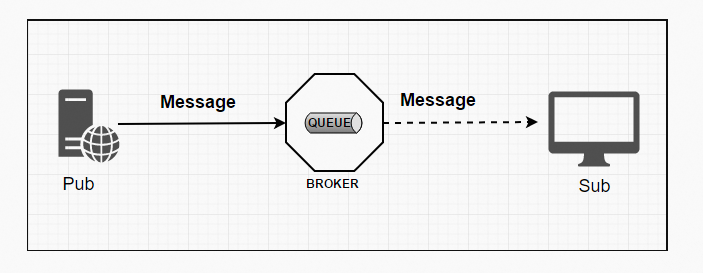
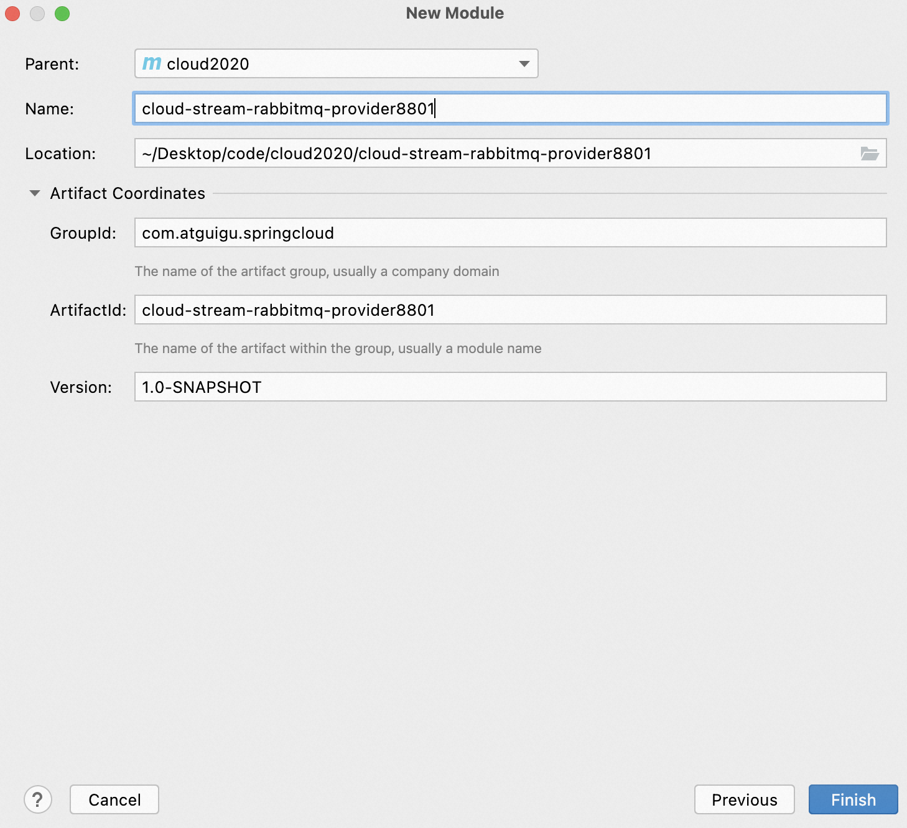
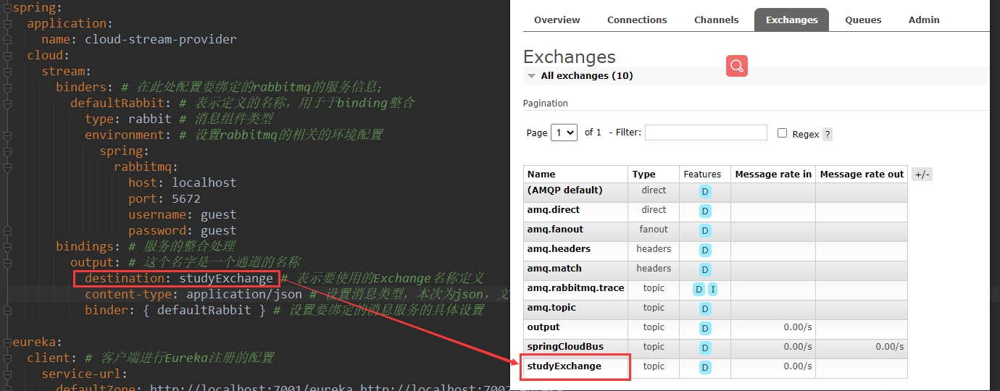
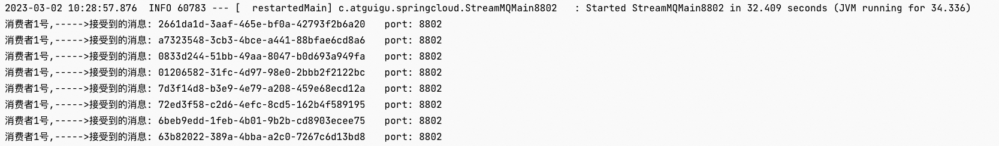
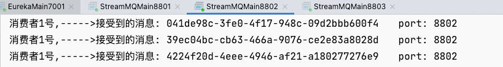
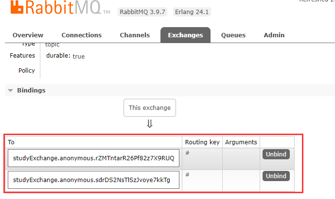
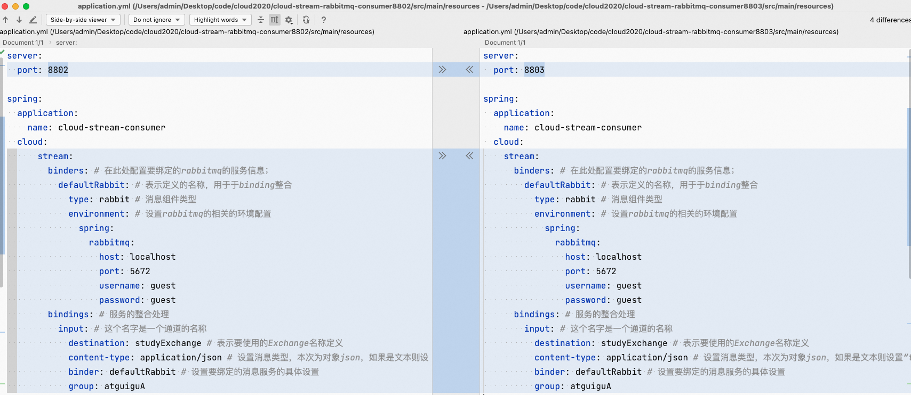

**<font style="color:#DF2A3F;">笔记来源：</font>**[**<font style="color:#DF2A3F;">尚硅谷SpringCloud框架开发教程(SpringCloudAlibaba微服务分布式架构丨Spring Cloud)</font>**](https://www.bilibili.com/video/BV18E411x7eT/?spm_id_from=333.337.search-card.all.click&vd_source=e8046ccbdc793e09a75eb61fe8e84a30)

**<font style="color:#DF2A3F;"></font>**

**<font style="color:#4861E0;">前言</font>**

为什么引入cloud stream？解决的痛点是什么？

+ 市面上存在着多种消息中间件技术ActiveMQ，RabbitMQ，RocketMQ，Kafka那么每多出来一种新的技术，就要付出响应的学习成本，消息中间件技术的多样导致开发者的学习成本很大
+ 不同的系统中会用到不同的消息中间件，那么当需要系统进行整合时，或者系统进行切换时，由于用的是不同的中间件技术，该怎么整合切换。存在多种MQ的情况时，如何进行切换、维护和开发？    具体的实现，需要的成本很大。
+ 那么有没有一种新的技术，让我们不再关注具体的MQ的细节，我们只需要用一种适配绑定的方式，自动的给我们在各种MQ内切换。
+ 引出了SpringCloud Stream，屏蔽底层的细节差异，让我只需要操作一个Cloud Stream，就可以操作底层下面各种各样不同的MQ。达到我们以更小的代价实现切换，维护，开发。

# 1 简介
## 1.1 概述
什么是SpringCloudStream？

官方定义 Spring Cloud Stream 是一个构建消息驱动微服务的框架。

应用程序通过 inputs 或者 outputs 来与 Spring Cloud Stream中**<font style="color:#F5222D;">binder对象</font>**交互。

通过我们配置来binding(绑定) ，而 Spring Cloud Stream 的 **<font style="color:#F5222D;">binder对象负责与消息中间件交互</font>**。

所以，我们只需要搞清楚如何与 Spring Cloud Stream 交互就可以方便使用消息驱动的方式。

通过使用Spring Integration来连接消息代理中间件以实现消息事件驱动。

Spring Cloud Stream 为一些供应商的消息中间件产品提供了个性化的自动化配置实现，引用了发布-订阅、消费组、分区的三个核心概念。

目前**<font style="color:#F5222D;">仅支持</font>****RabbitMQ、Kafka**。

**一句话：**SpringCloud Stream 屏蔽底层消息中间件的差异，降低切换成本，统一消息的编程模型。

官网：[SpringCloud Stream官网](https://spring.io/projects/spring-cloud-stream#overview)

文档：[SpringCloud Stream文档](https://docs.spring.io/spring-cloud-stream/docs/current/reference/html/)

中文指导手册：[SpringCloud Stream中文指导手册](https://m.wang1314.com/doc/webapp/topic/20971999.html)

## 1.2 设计思想
**<font style="color:#282828;">标准MQ</font>**



+ <font style="color:#282828;">Message：生产者/消费者之间靠</font><font style="color:#ff0000;">消息</font><font style="color:#282828;">媒介传递信息内容</font>
+ <font style="color:#282828;">消息通道MessageChannel：消息必须走特定的</font><font style="color:#ff0000;">通道</font>
+ <font style="color:#282828;">消息通道MessageChannel的子接口SubscribableChannel，由MessageHandler消息处理器所订阅，消息通道里的消息如何被消费呢，谁负责收发</font><font style="color:#ff0000;">处理</font>


**为什么用Cloud Stream？**

比方说我们同时用到了RabbitMQ和Kafka，由于这两个消息中间件的架构上的不同，整合和切换就会有很大的成本。像RabbitMQ有exchange，kafka有Topic和Partitions分区。


这些中间件的差异性导致我们实际项目开发给我们造成了一定的困扰，我们如果用了两个消息队列的其中一种，后面的业务需求，我想往另外一种消息队列进行迁移，这时候无疑就是一个灾难性的，**<font style="color:#F5222D;">一大堆东西都要重新推倒重新做</font>**，因为它跟我们的系统耦合了，这时候springcloud Stream给我们提供了一种解耦合的方式。


**stream是怎么统一底层差异的？**

在没有绑定器这个概念的情况下，我们的SpringBoot应用要直接与消息中间件进行信息交互的时候，

由于各消息中间件构建的初衷不同，它们的实现细节上会有较大的差异性

通过定义绑定器作为中间层，完美地实现了<font style="color:#ff0000;">应用程序与消息中间件细节之间的隔离</font>。

通过向应用程序暴露统一的Channel通道，使得应用程序不需要再考虑各种不同的消息中间件实现。

  
<font style="color:#ff0000;">通过定义绑定器Binder作为中间层，实现了应用程序与消息中间件细节之间的隔离。</font>


**Binder的详解**

在没有绑定器这个概念的情况下，我们的SpringBoot应用要直接与消息中间件进行信息交互的时候，由于各消息中间件构建的初衷不同，它们的实现细节上会有较大的差异性，通过定义绑定器作为中间层，完美地实现了应用程序与消息中间件细节之间的隔离。Stream对消息中间件的进一步封装，可以做到代码层面对中间件的无感知，甚至于动态的切换中间件(rabbitmq切换为kafka)，使得微服务开发的高度解耦，服务可以关注更多自己的业务流程。


**<font style="color:#F5222D;">通过定义绑定器Binder作为中间层，实现了应用程序与消息中间件细节之间的隔离。</font>**

Binder可以生成Binding，Binding用来绑定消息容器的生产者和消费者，它有两种类型，INPUT和OUTPUT，**<font style="background-color:#FFFFFF;">input对应于消费者（消费者从Stream接收消息），output对应于生产者（生产者从Stream发布消息）。</font>**

Stream中的消息通信方式遵循了发布-订阅模式。Topic主题进行广播：在RabbitMQ就是Exchange；在Kakfa中就是Topic


Spring Cloud Stream标准流程套路


+ Binder：很方便的连接中间件，屏蔽差异（用于连接中间件与生产/消费者）
+ Channel：通道，是队列Queue的一种抽象，在消息通讯系统中就是实现存储和转发的媒介，通过Channel对队列进行配置
+ Source和Sink：简单的可理解为参照对象是Spring Cloud Stream自身，**<font style="background-color:#FFFFFF;">从Stream发布消息就是输出（output），接受消息就是输入（input）</font>**。（简单的理解为输出/输如）


**<font style="color:#DF2A3F;">编码API和常用注解</font>**


| 组成 | 说明 |
| --- | --- |
| Middleware | 中间件，目前只支持RabbitMQ合Kafka |
| Binder | Binder是应用与消息中间件的封装，目前实行了Kafka和RabbitMQ的Binder，通过Binder可以很方便的连接中间件，可以动态的改变消息类型（对应Kafka的Topic，RabbitMQ的Exchange），这些都是可以通过配置文件来实现。 |
| @Input | 注解标识输入通道，通过该输入通道接受到的消息进入应用程序 |
| @Output | 注解标识输出通道，发布的消息将通过该通道离开应用程序 |
| @StreamListener | 监听队列，用于消费者的队列的消息接受 |
| @EnableBinding | 指信道channel和exchange绑定在一起 |


# 2 消息驱动之生产者
案例说明

+ RabbitMQ环境已经OK；
+ 工程中新建三个子模块：
    - cloud-stream-rabbitmq-provider8801， 作为生产者进行发消息模块
    - cloud-stream-rabbitmq-consumer8802，作为消息接收模块
    - cloud-stream-rabbitmq-consumer8803  作为消息接收模块


**<font style="color:#DF2A3F;">新建module</font>**

cloud-stream-rabbitmq-provider8801：作为生产者发送消息模块

新建步骤：

1. 新建Module
    1. 新建Module


    2. 填写Module名称



    3. 点击完成
2. POM

```xml
<?xml version="1.0" encoding="UTF-8"?>
<project xmlns="http://maven.apache.org/POM/4.0.0"
         xmlns:xsi="http://www.w3.org/2001/XMLSchema-instance"
         xsi:schemaLocation="http://maven.apache.org/POM/4.0.0 http://maven.apache.org/xsd/maven-4.0.0.xsd">
    <parent>
        cloud2020</artifactId>
        <groupId>com.atguigu.springcloud</groupId>
        <version>1.0-SNAPSHOT</version>
    </parent>
    <modelVersion>4.0.0</modelVersion>

    cloud-stream-rabbitmq-provider8801</artifactId>

    <properties>
        <maven.compiler.source>8</maven.compiler.source>
        <maven.compiler.target>8</maven.compiler.target>
    </properties>

    <dependencies>
        <dependency>
            <groupId>org.springframework.boot</groupId>
            spring-boot-starter-web</artifactId>
        </dependency>
        <dependency>
            <groupId>org.springframework.boot</groupId>
            spring-boot-starter-actuator</artifactId>
        </dependency>
        <dependency>
            <groupId>org.springframework.cloud</groupId>
            spring-cloud-starter-netflix-eureka-client</artifactId>
        </dependency>
        <dependency>
            <groupId>org.springframework.cloud</groupId>
            spring-cloud-starter-stream-rabbit</artifactId>
        </dependency>
        <!--基础配置-->
        <dependency>
            <groupId>org.springframework.boot</groupId>
            spring-boot-devtools</artifactId>
            <scope>runtime</scope>
            <optional>true</optional>
        </dependency>
        <dependency>
            <groupId>org.projectlombok</groupId>
            lombok</artifactId>
            <optional>true</optional>
        </dependency>
        <dependency>
            <groupId>org.springframework.boot</groupId>
            spring-boot-starter-test</artifactId>
            <scope>test</scope>
        </dependency>
    </dependencies>
</project>
```

3. YML

```yaml
server:
  port: 8801

spring:
  application:
    name: cloud-stream-provider
  cloud:
    stream:
      binders: # 在此处配置要绑定的rabbitmq的服务信息；
        defaultRabbit: # 表示定义的名称，用于于binding整合
          type: rabbit # 消息组件类型
          environment: # 设置rabbitmq的相关的环境配置
            spring:
              rabbitmq:
                host: localhost
                port: 5672
                username: guest
                password: guest
      bindings: # 服务的整合处理
        output: # 这个名字是一个通道的名称
          destination: studyExchange # 表示要使用的Exchange名称定义
          content-type: application/json # 设置消息类型，本次为json，文本则设置“text/plain”
          binder: defaultRabbit # 设置要绑定的消息服务的具体设置

eureka:
  client: # 客户端进行Eureka注册的配置
    service-url:
      defaultZone: http://localhost:7001/eureka
  instance:
    lease-renewal-interval-in-seconds: 2 # 设置心跳的时间间隔（默认是30秒）
    lease-expiration-duration-in-seconds: 5 # 如果现在超过了5秒的间隔（默认是90秒）
    instance-id: send-8801.com  # 在信息列表时显示主机名称
    prefer-ip-address: true     # 访问的路径变为IP地址
```

4. 主启动

```java
package com.atguigu.springcloud;

import org.springframework.boot.SpringApplication;
import org.springframework.boot.autoconfigure.SpringBootApplication;

/**
 * @auther zzyy
 * @create 2020-02-22 10:54
 */
@SpringBootApplication
public class StreamMQMain8801
{
    public static void main(String[] args)
    {
        SpringApplication.run(StreamMQMain8801.class,args);
    }
}

```

5. 业务类

```java
package com.atguigu.springcloud.controller;

import com.atguigu.springcloud.service.IMessageProvider;
import org.springframework.web.bind.annotation.GetMapping;
import org.springframework.web.bind.annotation.RestController;

import javax.annotation.Resource;

/**
 * @auther zzyy
 * @create 2020-02-22 11:17
 */
@RestController
public class SendMessageController
{
    @Resource
    private IMessageProvider messageProvider;

    @GetMapping(value = "/sendMessage")
    public String sendMessage()
    {
        return messageProvider.send();
    }

}

```

```java
package com.atguigu.springcloud.service;

/**
 * @auther zzyy
 * @create 2020-02-22 10:55
 */
public interface IMessageProvider
{
    public String send();
}

```

```java
package com.atguigu.springcloud.service.impl;

import com.atguigu.springcloud.service.IMessageProvider;
import org.springframework.cloud.stream.annotation.EnableBinding;
import org.springframework.integration.support.MessageBuilderFactory;
import org.springframework.messaging.MessageChannel;
import org.springframework.integration.support.MessageBuilder;
import javax.annotation.Resource;
import org.springframework.cloud.stream.messaging.Source;

import javax.annotation.Resource;
import java.util.UUID;

/**
 * @auther zzyy
 * @create 2020-02-22 10:56
 */
@EnableBinding(Source.class) //定义消息的推送管道
public class MessageProviderImpl implements IMessageProvider
{
    @Resource
    private MessageChannel output; // 消息发送管道

    @Override
    public String send()
    {
        String serial = UUID.randomUUID().toString();
        output.send(MessageBuilder.withPayload(serial).build());
        System.out.println("*****serial: "+serial);
        return null;
    }
}

```

6. 测试
    1. 启动7001、8001




    2. 访问[http://localhost:15672/](http://localhost:15672/)
    3. [http://localhost:8801/sendMessage](http://localhost:8801/sendMessage)

# 3 消息驱动之消费者
新建cloud-stream-rabbitmq-consumer8802

新建步骤：

1. 新建Module
    1. 新建Module


    2. 填写Module名称


    3. 点击完成
2. POM

```xml
<?xml version="1.0" encoding="UTF-8"?>
<project xmlns="http://maven.apache.org/POM/4.0.0"
         xmlns:xsi="http://www.w3.org/2001/XMLSchema-instance"
         xsi:schemaLocation="http://maven.apache.org/POM/4.0.0 http://maven.apache.org/xsd/maven-4.0.0.xsd">
    <parent>
        cloud2020</artifactId>
        <groupId>com.atguigu.springcloud</groupId>
        <version>1.0-SNAPSHOT</version>
    </parent>
    <modelVersion>4.0.0</modelVersion>

    cloud-stream-rabbitmq-consumer8802</artifactId>

    <properties>
        <maven.compiler.source>8</maven.compiler.source>
        <maven.compiler.target>8</maven.compiler.target>
    </properties>

    <dependencies>
        <dependency>
            <groupId>org.springframework.boot</groupId>
            spring-boot-starter-web</artifactId>
        </dependency>
        <dependency>
            <groupId>org.springframework.cloud</groupId>
            spring-cloud-starter-netflix-eureka-client</artifactId>
        </dependency>
        <dependency>
            <groupId>org.springframework.cloud</groupId>
            spring-cloud-starter-stream-rabbit</artifactId>
        </dependency>
        <dependency>
            <groupId>org.springframework.boot</groupId>
            spring-boot-starter-actuator</artifactId>
        </dependency>
        <!--基础配置-->
        <dependency>
            <groupId>org.springframework.boot</groupId>
            spring-boot-devtools</artifactId>
            <scope>runtime</scope>
            <optional>true</optional>
        </dependency>
        <dependency>
            <groupId>org.projectlombok</groupId>
            lombok</artifactId>
            <optional>true</optional>
        </dependency>
        <dependency>
            <groupId>org.springframework.boot</groupId>
            spring-boot-starter-test</artifactId>
            <scope>test</scope>
        </dependency>
    </dependencies>
</project>
```

3. YML

```yaml
server:
  port: 8802

spring:
  application:
    name: cloud-stream-consumer
  cloud:
      stream:
        binders: # 在此处配置要绑定的rabbitmq的服务信息；
          defaultRabbit: # 表示定义的名称，用于于binding整合
            type: rabbit # 消息组件类型
            environment: # 设置rabbitmq的相关的环境配置
              spring:
                rabbitmq:
                  host: localhost
                  port: 5672
                  username: guest
                  password: guest
        bindings: # 服务的整合处理
          input: # 这个名字是一个通道的名称
            destination: studyExchange # 表示要使用的Exchange名称定义
            content-type: application/json # 设置消息类型，本次为对象json，如果是文本则设置“text/plain”
            binder: defaultRabbit # 设置要绑定的消息服务的具体设置

eureka:
  client: # 客户端进行Eureka注册的配置
    service-url:
      defaultZone: http://localhost:7001/eureka
  instance:
    lease-renewal-interval-in-seconds: 2 # 设置心跳的时间间隔（默认是30秒）
    lease-expiration-duration-in-seconds: 5 # 如果现在超过了5秒的间隔（默认是90秒）
    instance-id: receive-8802.com  # 在信息列表时显示主机名称
    prefer-ip-address: true     # 访问的路径变为IP地址
```

4. 主启动

```java
package com.atguigu.springcloud;

import org.springframework.boot.SpringApplication;
import org.springframework.boot.autoconfigure.SpringBootApplication;

/**
 * @auther zzyy
 * @create 2020-02-22 11:56
 */
@SpringBootApplication
public class StreamMQMain8802
{
    public static void main(String[] args)
    {
        SpringApplication.run(StreamMQMain8802.class,args);
    }
}

```

5. 业务类

```java
package com.atguigu.springcloud.controller;

import org.springframework.beans.factory.annotation.Value;
import org.springframework.cloud.stream.annotation.EnableBinding;
import org.springframework.cloud.stream.annotation.StreamListener;
import org.springframework.cloud.stream.messaging.Sink;
import org.springframework.messaging.Message;
import org.springframework.stereotype.Component;

import javax.annotation.Resource;

/**
 * @auther zzyy
 * @create 2020-02-22 11:57
 */
@Component
@EnableBinding(Sink.class)
public class ReceiveMessageListenerController
{
    @Value("${server.port}")
    private String serverPort;


    @StreamListener(Sink.INPUT)
    public void input(Message<String> message)
    {
        System.out.println("消费者1号,----->接受到的消息: "+message.getPayload()+"\t  port: "+serverPort);
    }
}

```

6. 测试：[http://localhost:8801/sendMessage](http://localhost:8801/sendMessage)



# 4 分组消费与持久化
依照8802，clone出一份cloud-stream-rabbitmq-consumer8803

1. POM

```xml
<?xml version="1.0" encoding="UTF-8"?>
<project xmlns="http://maven.apache.org/POM/4.0.0"
         xmlns:xsi="http://www.w3.org/2001/XMLSchema-instance"
         xsi:schemaLocation="http://maven.apache.org/POM/4.0.0 http://maven.apache.org/xsd/maven-4.0.0.xsd">
    <parent>
        cloud2020</artifactId>
        <groupId>com.atguigu.springcloud</groupId>
        <version>1.0-SNAPSHOT</version>
    </parent>
    <modelVersion>4.0.0</modelVersion>

    cloud-stream-rabbitmq-consumer8803</artifactId>

    <properties>
        <maven.compiler.source>8</maven.compiler.source>
        <maven.compiler.target>8</maven.compiler.target>
    </properties>

    <dependencies>
        <dependency>
            <groupId>org.springframework.boot</groupId>
            spring-boot-starter-web</artifactId>
        </dependency>
        <dependency>
            <groupId>org.springframework.cloud</groupId>
            spring-cloud-starter-netflix-eureka-client</artifactId>
        </dependency>
        <dependency>
            <groupId>org.springframework.cloud</groupId>
            spring-cloud-starter-stream-rabbit</artifactId>
        </dependency>
        <dependency>
            <groupId>org.springframework.boot</groupId>
            spring-boot-starter-actuator</artifactId>
        </dependency>
        <!--基础配置-->
        <dependency>
            <groupId>org.springframework.boot</groupId>
            spring-boot-devtools</artifactId>
            <scope>runtime</scope>
            <optional>true</optional>
        </dependency>
        <dependency>
            <groupId>org.projectlombok</groupId>
            lombok</artifactId>
            <optional>true</optional>
        </dependency>
        <dependency>
            <groupId>org.springframework.boot</groupId>
            spring-boot-starter-test</artifactId>
            <scope>test</scope>
        </dependency>
    </dependencies>
</project>
```

2. YML

```yaml
server:
  port: 8803

spring:
  application:
    name: cloud-stream-consumer
  cloud:
    stream:
      binders: # 在此处配置要绑定的rabbitmq的服务信息；
        defaultRabbit: # 表示定义的名称，用于于binding整合
          type: rabbit # 消息组件类型
          environment: # 设置rabbitmq的相关的环境配置
            spring:
              rabbitmq:
                host: localhost
                port: 5672
                username: guest
                password: guest
      bindings: # 服务的整合处理
        input: # 这个名字是一个通道的名称
          destination: studyExchange # 表示要使用的Exchange名称定义
          content-type: application/json # 设置消息类型，本次为对象json，如果是文本则设置“text/plain”
          binder: defaultRabbit # 设置要绑定的消息服务的具体设置

eureka:
  client: # 客户端进行Eureka注册的配置
    service-url:
      defaultZone: http://localhost:7001/eureka
  instance:
    lease-renewal-interval-in-seconds: 2 # 设置心跳的时间间隔（默认是30秒）
    lease-expiration-duration-in-seconds: 5 # 如果现在超过了5秒的间隔（默认是90秒）
    instance-id: receive-8803.com  # 在信息列表时显示主机名称
    prefer-ip-address: true     # 访问的路径变为IP地址
```

3. 主启动

```java
package com.atguigu.springcloud;

import org.springframework.boot.SpringApplication;
import org.springframework.boot.autoconfigure.SpringBootApplication;

/**
 * @auther zzyy
 * @create 2020-02-22 11:56
 */
@SpringBootApplication
public class StreamMQMain8803
{
    public static void main(String[] args)
    {
        SpringApplication.run(StreamMQMain8803.class,args);
    }
}

```

4. 业务类

```java
package com.atguigu.springcloud.controller;

import org.springframework.beans.factory.annotation.Value;
import org.springframework.cloud.stream.annotation.EnableBinding;
import org.springframework.cloud.stream.annotation.StreamListener;
import org.springframework.cloud.stream.messaging.Sink;
import org.springframework.messaging.Message;
import org.springframework.stereotype.Component;

import javax.annotation.Resource;

/**
 * @auther zzyy
 * @create 2020-02-22 11:57
 */
@Component
@EnableBinding(Sink.class)
public class ReceiveMessageListenerController
{
    @Value("${server.port}")
    private String serverPort;


    @StreamListener(Sink.INPUT)
    public void input(Message<String> message)
    {
        System.out.println("消费者2号,----->接受到的消息: "+message.getPayload()+"\t  port: "+serverPort);
    }
}

```

4. 测试：启动7001、7002、8801（消息生产）、8802（消息消费）、8803（消息消费）


此时studyexchange有两个订阅者：8802、8803


8001生产者：


8002消费者



8003消费者


测试成功

****

**运行后的问题1：重复消费问题**

目前8801发送一条消息后，8802和8803会同时收到8801的消息，存在重复消费问题。


为什么要解决重复消费问题

比如8801下一个订单，但是被两个服务获取消费，会多扣一次款。

比如在如下场景中，订单系统我们做集群部署，都会从RabbitMQ中获取订单信息，那<font style="color:#ff0000;">如果一个订单同时被两个服务获取到</font>，那么就会造成数据错误，我们得避免这种情况。这时<font style="color:#ff0000;">我们就可以使用Stream中的消息分组来解决</font>


注意在Stream中处于同一个group中的多个消费者是竞争关系，就能够保证消息只会被其中一个应用消费一次。

<font style="color:#ff0000;">不同组是可以全面消费的(重复消费)，同一组内会发生竞争关系，只有其中一个可以消费。</font>



8802和8803默认是两个不同的分组。不同的微服务，默认分组是不同的，不同的组可以消费同一个消息


解决方法：消息分组

微服务应用放置于同一个group中，就能够保证消息只会被其中一个应用消费一次。<font style="color:#F5222D;">不同的组是可以全面消费的（重复消费），同一个组内的多个消费者会发生竞争关系，只有其中一个可以消费</font>。

先自定义分组，然后自定义配置分为同一个组，解决重复消费问题。


**自定义分组**

将8802和8803分为两个不同的组，atguiguA和atguiguB

修改8802和8803的yml


可以看到，分组已经变成我们自定义的atguiguA和atguiguB了

虽然实现了自定义分组，但是重复消费的问题依然存在。

分布式微服务应用为了实现高可用和负载均衡，实际上都会部署多个实例，本例启动了两个消费微服务(8802/8803)

多数情况，生产者发送消息给某个具体微服务时只希望被消费一次，按照上面我们启动两个应用的例子，虽然它们同属一个应用，但是这个消息出现了被重复消费两次的情况。为了解决这个问题，在Spring Cloud Stream中提供了<font style="color:#F5222D;">消费组</font>的概念。


消费组

将8802和8803分为同一个组atguiguA。



测试，现在没有出现重复消费问题。

8802/8803实现了轮询分组，每次只有一个消费者接收消息，8801模块的发的消息只能被8802或8803其中一个接收到，这样避免了重复消费。

8001生产者


8002消费者


8003消费者


**运行后的问题2：消息持久化问题**

通过上述，解决了重复消费问题，再看看持久化

1. 停止8802/8803，并去除掉8802的分组group: atguiguA（8803的分组group: atguiguA没有去掉）


2. 8801先发送4条消息到rabbitmq


3. 先启动8802，无分组属性配置，后台没有打出来消息，发现8802没有收到消息，消息丢失。。。。


4. 再启动8803，有分组属性配置，后台打印出来了MQ上的消息


