**笔记来源：**[**尚硅谷SpringCloud框架开发教程(SpringCloudAlibaba微服务分布式架构丨Spring Cloud)**](https://www.bilibili.com/video/BV18E411x7eT/?spm_id_from=333.337.search-card.all.click&vd_source=e8046ccbdc793e09a75eb61fe8e84a30)


# 1 概述
为什么会出现这个技术，要解决哪些问题。

在微服务框架中，一个客户端发起的请求在后端系统中会经过多次不同的服务节点调用来协同产生最后的请求结果，每一个前段请求都会形成一条复杂的分布式服务调用链路，链路中的任何一环出现高延时或错误都会引起整个请求最后的失败。

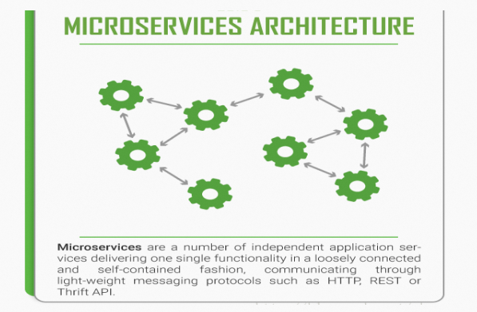 

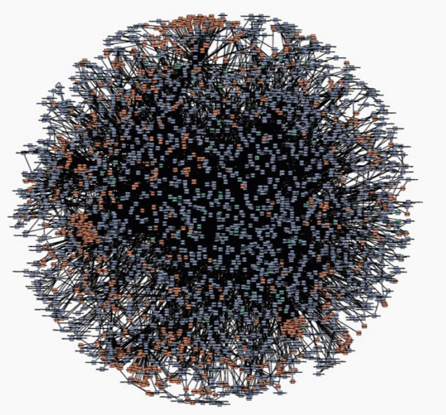 

SpringCloudSleuth提供了一套完整的服务跟踪的解决方案，在分布式系统中提供乐追踪解决方案并且兼容支持了zipkin。

官网：[SpringCloud Sleuth 官网](https://github.com/spring-cloud/spring-cloud-sleuth)

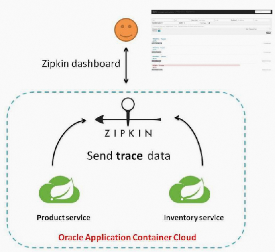

# 2 搭建链路监控
Sleuth：负责跟踪整理

zipkin：负责展现

## 2.1 安装zipkin
SpringCloud从F版起已不需要自己构建Zipkin Server了，只需调用jar包即可

Zipkin下载地址：[下载地址](https://repo1.maven.org/maven2/io/zipkin/java/zipkin-server/)

[zipkin-server-2.12.9-exec.jar](https://www.yuque.com/attachments/yuque/0/2023/jar/22334924/1677737695988-67e8df64-1c34-4084-8620-c8cc25a5f169.jar)

直接在cmd中运行`java -jar zipkin-server-2.12.9-exec.jar`

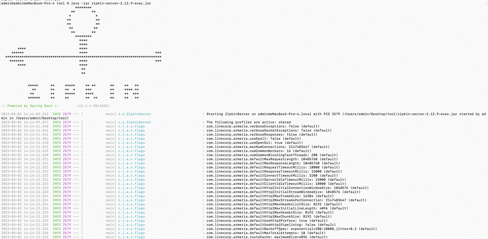

访问[http://localhost:9411/zipkin/](http://localhost:9411/zipkin/) web交互界面

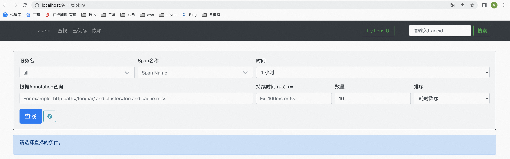

zipkin启动成功


完整的调用链路

表示一请求链路，一条链路通过Trace Id唯一标识，Span标识发起的请求信息，各span通过parent id 关联起来

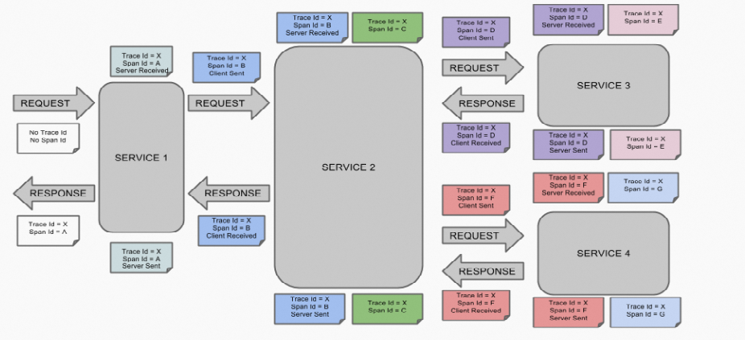

上图的通俗解释

一条链路通过Trace Id唯一标识，Span标识发起的请求信息，各span通过parent id 关联起来

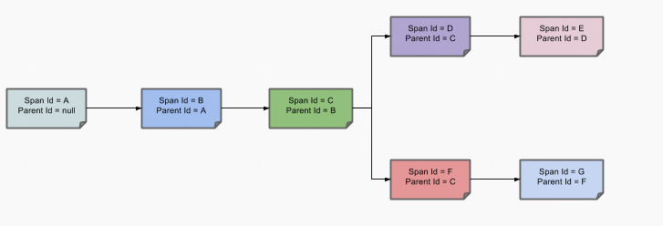

整个链路的依赖关系如下：

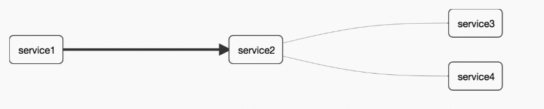

名次解释：

+ Trace：类似于树结构的Span集合，表示一条调用链路，存在唯一标识。
+ Span：表示调用链路来源，通俗的理解Span就是一次请求信息。各个Span通过parentID关联起来。

## 2.2 服务提供者
cloud-provider-payment8001

1. pom：引入spring-cloud-starter-zipkin依赖，其包含了sleuth + zipkin

   ```xml
   <?xml version="1.0" encoding="UTF-8"?>
   <project xmlns="http://maven.apache.org/POM/4.0.0"
            xmlns:xsi="http://www.w3.org/2001/XMLSchema-instance"
            xsi:schemaLocation="http://maven.apache.org/POM/4.0.0 http://maven.apache.org/xsd/maven-4.0.0.xsd">
       <parent>
           <artifactId>cloud2020</artifactId>
           <groupId>com.atguigu.springcloud</groupId>
           <version>1.0-SNAPSHOT</version>
       </parent>
       <modelVersion>4.0.0</modelVersion>

       <artifactId>cloud-provider-payment8001</artifactId>

       <properties>
           <maven.compiler.source>8</maven.compiler.source>
           <maven.compiler.target>8</maven.compiler.target>
       </properties>

       <dependencies>
           <!--包含了sleuth+zipkin-->
           <dependency>
               <groupId>org.springframework.cloud</groupId>
               <artifactId>spring-cloud-starter-zipkin</artifactId>
           </dependency>
           <!--eureka-client-->
           <dependency>
               <groupId>org.springframework.cloud</groupId>
               <artifactId>spring-cloud-starter-netflix-eureka-client</artifactId>
           </dependency>
           <dependency>
               <groupId>org.springframework.boot</groupId>
               <artifactId>spring-boot-starter-web</artifactId>
           </dependency>
           <dependency>
               <groupId>org.springframework.boot</groupId>
               <artifactId>spring-boot-starter-actuator</artifactId>
           </dependency>
           <dependency>
               <groupId>org.mybatis.spring.boot</groupId>
               <artifactId>mybatis-spring-boot-starter</artifactId>
           </dependency>
           <dependency>
               <groupId>com.alibaba</groupId>
               <artifactId>druid-spring-boot-starter</artifactId>
               <version>1.1.10</version>
           </dependency>
           <!--mysql-connector-java-->
           <dependency>
               <groupId>mysql</groupId>
               <artifactId>mysql-connector-java</artifactId>
           </dependency>
           <!--jdbc-->
           <dependency>
               <groupId>org.springframework.boot</groupId>
               <artifactId>spring-boot-starter-jdbc</artifactId>
           </dependency>
           <dependency>
               <groupId>org.springframework.boot</groupId>
               <artifactId>spring-boot-devtools</artifactId>
               <scope>runtime</scope>
               <optional>true</optional>
           </dependency>
           <dependency>
               <groupId>org.projectlombok</groupId>
               <artifactId>lombok</artifactId>
               <optional>true</optional>
           </dependency>
           <dependency>
               <groupId>org.springframework.boot</groupId>
               <artifactId>spring-boot-starter-test</artifactId>
               <scope>test</scope>
           </dependency>
           <dependency>
               <groupId>com.atguigu.springcloud</groupId>
               <artifactId>cloud-api-commons</artifactId>
               <version>1.0-SNAPSHOT</version>
           </dependency>
       </dependencies>

   </project>
   ```

2.  yml

    ```yaml
    server:
      port: 8001

    spring:
      application:
        name: cloud-payment-service
      zipkin:
        base-url: http://localhost:9411

      sleuth:
        sampler:
        #采样率值介于 0 到 1 之间，1 则表示全部采集
        probability: 1.0
      datasource:
        type: com.alibaba.druid.pool.DruidDataSource            # 当前数据源操作类型
        driver-class-name: org.gjt.mm.mysql.Driver              # mysql驱动包
        url: jdbc:mysql://localhost:3306/db2019?useUnicode=true&characterEncoding=utf-8&useSSL=false&allowPublicKeyRetrieval=true
        username: root
        password: 123456

    eureka:
      client:
        #表示是否将自己注册进EurekaServer默认为true。
        register-with-eureka: true
        #是否从EurekaServer抓取已有的注册信息，默认为true。单节点无所谓，集群必须设置为true才能配合ribbon使用负载均衡
        fetchRegistry: true
        service-url:
          #单机版
          defaultZone: http://localhost:7001/eureka
          # 集群版
          #defaultZone: http://eureka7001.com:7001/eureka,http://eureka7002.com:7002/eureka
      instance:
        lease-expiration-duration-in-seconds: 2
        lease-renewal-interval-in-seconds: 1

    mybatis:
      mapperLocations: classpath:mapper/*.xml
      type-aliases-package: com.atguigu.springcloud.entities    # 所有Entity别名类所在包
    ```

3. 业务类PaymentController

   ```java
   @GetMapping("/payment/zipkin")
   public String paymentZipkin()
   {
       return "hi ,i'am paymentzipkin server fall back，welcome to atguigu，O(∩_∩)O哈哈~";
   }
   ```

   ​

## 2.3 服务消费者
cloud-consumer-order80

1. pom：引入spring-cloud-starter-zipkin依赖，其包含了sleuth + zipkin

   ```xml
   <?xml version="1.0" encoding="UTF-8"?>
   <project xmlns="http://maven.apache.org/POM/4.0.0"
            xmlns:xsi="http://www.w3.org/2001/XMLSchema-instance"
            xsi:schemaLocation="http://maven.apache.org/POM/4.0.0 http://maven.apache.org/xsd/maven-4.0.0.xsd">
       <parent>
           <artifactId>cloud2020</artifactId>
           <groupId>com.atguigu.springcloud</groupId>
           <version>1.0-SNAPSHOT</version>
       </parent>
       <modelVersion>4.0.0</modelVersion>

       <artifactId>cloud-consumer-order80</artifactId>

       <properties>
           <maven.compiler.source>8</maven.compiler.source>
           <maven.compiler.target>8</maven.compiler.target>
       </properties>

       <dependencies>
           <!--包含了sleuth+zipkin-->
           <dependency>
               <groupId>org.springframework.cloud</groupId>
               <artifactId>spring-cloud-starter-zipkin</artifactId>
           </dependency>
           <dependency>
               <groupId>org.springframework.cloud</groupId>
               <artifactId>spring-cloud-starter-netflix-eureka-client</artifactId>
           </dependency>
           <dependency>
               <groupId>org.springframework.boot</groupId>
               <artifactId>spring-boot-starter-web</artifactId>
           </dependency>
           <dependency>
               <groupId>org.springframework.boot</groupId>
               <artifactId>spring-boot-starter-actuator</artifactId>
           </dependency>
           <dependency>
               <groupId>org.springframework.boot</groupId>
               <artifactId>spring-boot-devtools</artifactId>
               <scope>runtime</scope>
               <optional>true</optional>
           </dependency>
           <dependency>
               <groupId>org.projectlombok</groupId>
               <artifactId>lombok</artifactId>
               <optional>true</optional>
           </dependency>
           <dependency>
               <groupId>org.springframework.boot</groupId>
               <artifactId>spring-boot-starter-test</artifactId>
               <scope>test</scope>
           </dependency>
           <dependency>
               <groupId>com.atguigu.springcloud</groupId>
               <artifactId>cloud-api-commons</artifactId>
               <version>1.0-SNAPSHOT</version>
           </dependency>
       </dependencies>

   </project>
   ```


2. yml：注意缩进！

   ```yaml
   server:
     port: 80

   spring:
     application:
       name: cloud-order-service
     zipkin:
       base-url: http://localhost:9411
     sleuth:
       sampler:
         probability: 1

   eureka:
     client:
       #表示是否将自己注册进EurekaServer默认为true。
       register-with-eureka: true
       #是否从EurekaServer抓取已有的注册信息，默认为true。单节点无所谓，集群必须设置为true才能配合ribbon使用负载均衡
       fetchRegistry: true
       service-url:
         #单机版
         defaultZone: http://localhost:7001/eureka
         # 集群版
         #defaultZone: http://eureka7001.com:7001/eureka,http://eureka7002.com:7002/eureka
   ```


3. 业务类OrderController

   ```java
   // ====================> zipkin+sleuth
   @GetMapping("/consumer/payment/zipkin")
   public String paymentZipkin()
   {
       String result = restTemplate.getForObject("http://localhost:8001"+"/payment/zipkin/", String.class);
       return result;
   }
   ```

## 2.4 测试
1. **启动7001、7002、8001、80** 

   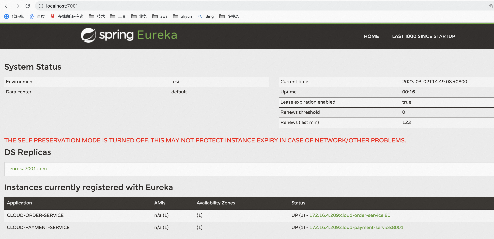

2. 访问：[http://localhost/consumer/payment/zipkin](http://localhost/consumer/payment/zipkin)

   

3. 打开浏览器访问：http://localhost:9411

   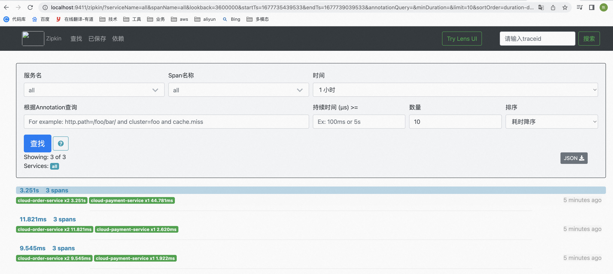

   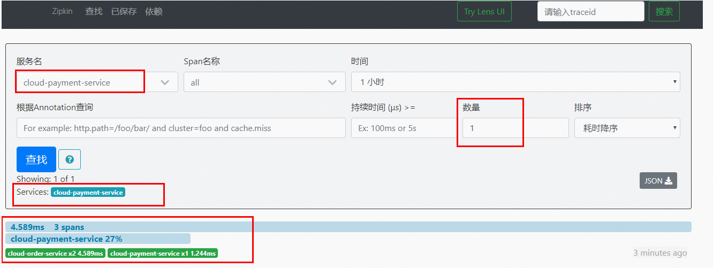

   调用关系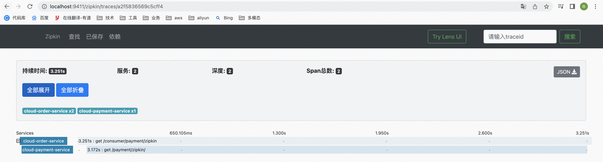

   依赖关系

   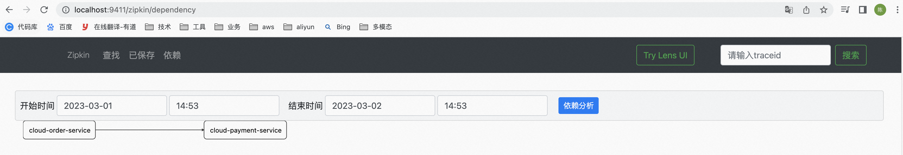

