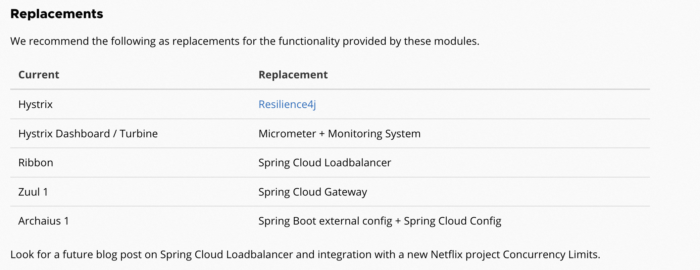

**笔记来源：**[**尚硅谷SpringCloud框架开发教程(SpringCloudAlibaba微服务分布式架构丨Spring Cloud)**](https://www.bilibili.com/video/BV18E411x7eT/?spm_id_from=333.337.search-card.all.click&vd_source=e8046ccbdc793e09a75eb61fe8e84a30)

****

## 1 **为什么会出现SpringCloud alibaba？**
Spring Cloud Netflix项目进入维护模式

:::danger
Spring Cloud Netflix项目进入维护模式

最近，Netflix宣布Hystrix进入维护模式。自2016年以来，Ribbon一直处于类似的状态。虽然Hystrix和Ribbon现在处于维护模式，但它们仍然在Netflix大规模部署。

Hystrix仪表盘和涡轮机已被Atlas所取代。这些项目的最后一次提交分别是2年和4年前。Zuul 1和Archaius 1都已被不向后兼容的后续版本所取代。

以下Spring Cloud Netflix模块和相应的启动器将进入维护模式:

1. spring-cloud-netflix-archaius
2. spring-cloud-netflix-hystrix-contract
3. spring-cloud-netflix-hystrix-dashboard
4. spring-cloud-netflix-hystrix-stream
5. spring-cloud-netflix-hystrix
6. spring-cloud-netflix-ribbon
7. spring-cloud-netflix-turbine-stream
8. spring-cloud-netflix-turbine
9. spring-cloud-netflix-zuul

这并不包括Eureka或并发限制模块。

什么是维护模式?

将模块置于维护模式，意味着Spring Cloud团队将不再向模块添加新特性。我们将修复block级别的bug和安全问题，我们也将考虑和审查来自社区的小型pull request。

我们打算继续支持这些模块，直到Greenwich版本被普遍采用至少一年。

:::

进入维护模式意味着什么呢？

Spring Cloud Netflix 将不再开发新的组件

我们都知道Spring Cloud 版本迭代算是比较快的，因而出现了很多重大ISSUE都还来不及Fix就又推另一个Release了。进入维护模式意思就是目前一直以后一段时间Spring Cloud Netflix提供的服务和功能就这么多了，不在开发新的组件和功能了。以后将以维护和Merge分支Full Request为主

新组件功能将以其他替代平代替的方式实现

## 2 **SpringCloud alibaba带来了什么？**
官网：[SpringCloud alibaba Git Hub地址](https://github.com/alibaba/spring-cloud-alibaba/blob/2.2.x/README-zh.md)

诞生：2018.10.31，Spring Cloud Alibaba 正式入驻了 Spring Cloud 官方孵化器，并在 Maven 中央库发布了第一个版本。

主要功能：

+ 服务限流降级：默认支持 Servlet、Feign、RestTemplate、Dubbo 和 RocketMQ 限流降级功能的接入，可以在运行时通过控制台实时修改限流降级规则，还支持查看限流降级 Metrics 监控。
+ 服务注册与发现：适配 Spring Cloud 服务注册与发现标准，默认集成了 Ribbon 的支持。
+ 分布式配置管理：支持分布式系统中的外部化配置，配置更改时自动刷新。
+ 消息驱动能力：基于 Spring Cloud Stream 为微服务应用构建消息驱动能力。
+ 阿里云对象存储：阿里云提供的海量、安全、低成本、高可靠的云存储服务。支持在任何应用、任何时间、任何地点存储和访问任意类型的数据。
+ 分布式任务调度：提供秒级、精准、高可靠、高可用的定时（基于 Cron 表达式）任务调度服务。同时提供分布式的任务执行模型，如网格任务。网格任务支持海量子任务均匀分配到所有 Worker（schedulerx-client）上执行。

## 3 SpringCloud alibaba学习资料获取
官网：[SpringCloud alibaba官网](https://spring.io/projects/spring-cloud-alibaba#overview)

[https://github.com/alibaba/spring-cloud-alibaba](https://github.com/alibaba/spring-cloud-alibaba)

[https://spring-cloud-alibaba-group.github.io/github-pages/greenwich/spring-cloud-alibaba.html](https://spring-cloud-alibaba-group.github.io/github-pages/greenwich/spring-cloud-alibaba.html)

中文：[https://github.com/alibaba/spring-cloud-alibaba/blob/master/README-zh.md](https://github.com/alibaba/spring-cloud-alibaba/blob/master/README-zh.md)

