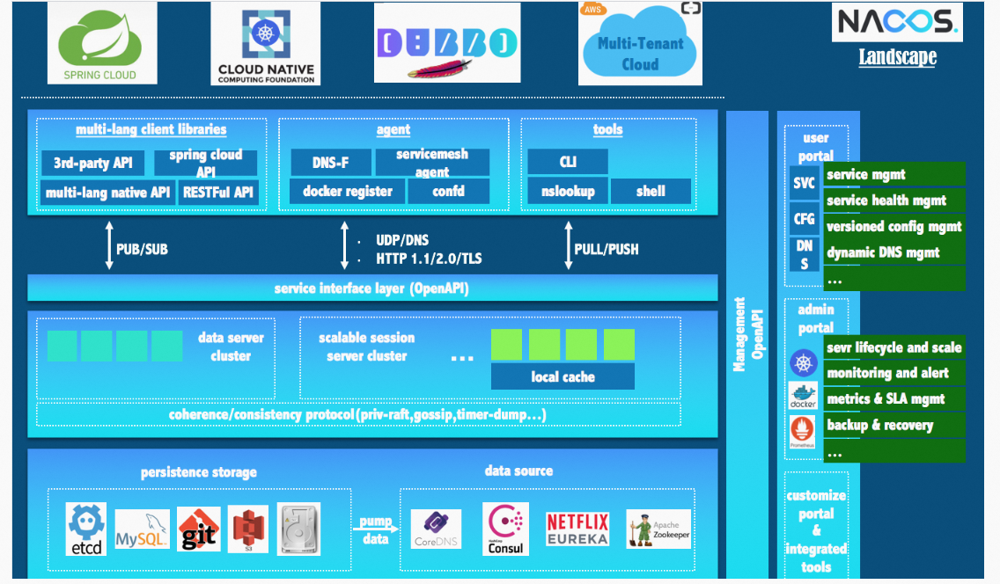
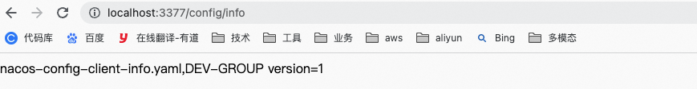

**<font style="color:#DF2A3F;">笔记来源：</font>**[**<font style="color:#DF2A3F;">尚硅谷SpringCloud框架开发教程(SpringCloudAlibaba微服务分布式架构丨Spring Cloud)</font>**](https://www.bilibili.com/video/BV18E411x7eT/?spm_id_from=333.337.search-card.all.click&vd_source=e8046ccbdc793e09a75eb61fe8e84a30)

**<font style="color:#DF2A3F;"></font>**

# 36. <font style="color:#000000;">1 Nacos简介</font>
<font style="color:#282828;">为什么叫Nacos？前四个字母分别为Naming和Configuration的前两个字母，最后的s为Service。</font>

<font style="color:#282828;"></font>

<font style="color:#282828;">概述</font>

<font style="color:#282828;">Nacos全称：Dynamic Naming and Configuration Service，一个更易于构建云原生应用的动态服务发现、配置管理和服务管理平台。Nacos就是注册中心 + 配置中心的组合。等价于</font>`<font style="color:#000000;">Nacos</font>`<font style="color:#000000;"> = </font>`<font style="color:#000000;">Eureka</font>`<font style="color:#000000;"> +</font>`<font style="color:#000000;">Config</font>`<font style="color:#000000;"> +</font>`<font style="color:#000000;">Bus</font>`

<font style="color:#000000;"></font>

<font style="color:#000000;">主要功能：</font>

+ <font style="color:#282828;">替代Eureka做服务注册中心</font>
+ <font style="color:#282828;">替代Config做服务配置中心</font>


官方文档：

+ [https://github.com/alibaba/Nacos](https://github.com/alibaba/Nacos)
+ [https://nacos.io/zh-cn/index.html](https://nacos.io/zh-cn/index.html)
+ [https://spring-cloud-alibaba-group.github.io/github-pages/greenwich/spring-cloud-alibaba.html#_spring_cloud_alibaba_nacos_discovery](https://spring-cloud-alibaba-group.github.io/github-pages/greenwich/spring-cloud-alibaba.html#_spring_cloud_alibaba_nacos_discovery)

<font style="color:#000000;"></font>

<font style="color:#000000;">各种注册中心的比较</font>

| 服务注册和发现框架 | CAP模型 | 控制台管理 | 社区活跃度 |
| --- | --- | --- | --- |
| Eureka | AP | 支持 | 低 |
| Zookeeper | CP | 不支持 | 中 |
| Consul | CP | 支持 | 高 |
| Nacos | AP | 支持 | 高 |


# 2 安装和运行Nacos
下载地址：[https://github.com/alibaba/nacos/releases](https://github.com/alibaba/nacos/releases)

[nacos-server-2.2.0.tar.gz](https://www.yuque.com/attachments/yuque/0/2023/gz/22334924/1677749527072-fa78418a-3938-4813-baab-32c6cf82db9c.gz)

进入到bin目录下：

```yaml
sh startup.sh -m standalone
```

<font style="color:#282828;">命令运行成功后直接访问http://localhost:8848/nacos</font>


# 3 Nacos作为服务注册中心
官方文档：[https://spring-cloud-alibaba-group.github.io/github-pages/greenwich/spring-cloud-alibaba.html#_spring_cloud_alibaba_nacos_config](https://spring-cloud-alibaba-group.github.io/github-pages/greenwich/spring-cloud-alibaba.html#_spring_cloud_alibaba_nacos_config)

## <font style="color:#4b4b4b;">3.1 基于Nacos的服务提供者</font>
创建<font style="color:#000000;">cloudalibaba-provider-payment9001</font>操作步骤

1. 新建Module
    1. 创建Module


    2. 填写Module名称


    3. 点击完成
2. POM
    1. 父POM

```xml
<dependency>
        <groupId>com.alibaba.cloud</groupId>
        spring-cloud-alibaba-dependencies</artifactId>
        <version>2.1.0.RELEASE</version>
        <type>pom</type>
        <scope>import</scope>
      </dependency>
```

    2. 子模块

```xml
<?xml version="1.0" encoding="UTF-8"?>
<project xmlns="http://maven.apache.org/POM/4.0.0"
         xmlns:xsi="http://www.w3.org/2001/XMLSchema-instance"
         xsi:schemaLocation="http://maven.apache.org/POM/4.0.0 http://maven.apache.org/xsd/maven-4.0.0.xsd">
    <parent>
        cloud2020</artifactId>
        <groupId>com.atguigu.springcloud</groupId>
        <version>1.0-SNAPSHOT</version>
    </parent>
    <modelVersion>4.0.0</modelVersion>

    cloudalibaba-provider-payment9001</artifactId>

    <properties>
        <maven.compiler.source>8</maven.compiler.source>
        <maven.compiler.target>8</maven.compiler.target>
    </properties>
    <dependencies>
        <!--SpringCloud ailibaba nacos -->
        <dependency>
            <groupId>com.alibaba.cloud</groupId>
            spring-cloud-starter-alibaba-nacos-discovery</artifactId>
        </dependency>
        <!-- SpringBoot整合Web组件 -->
        <dependency>
            <groupId>org.springframework.boot</groupId>
            spring-boot-starter-web</artifactId>
        </dependency>
        <dependency>
            <groupId>org.springframework.boot</groupId>
            spring-boot-starter-actuator</artifactId>
        </dependency>
        <!--日常通用jar包配置-->
        <dependency>
            <groupId>org.springframework.boot</groupId>
            spring-boot-devtools</artifactId>
            <scope>runtime</scope>
            <optional>true</optional>
        </dependency>
        <dependency>
            <groupId>org.projectlombok</groupId>
            lombok</artifactId>
            <optional>true</optional>
        </dependency>
        <dependency>
            <groupId>org.springframework.boot</groupId>
            spring-boot-starter-test</artifactId>
            <scope>test</scope>
        </dependency>
    </dependencies>
</project>
```

3. YML

```yaml
server:
  port: 9001

spring:
  application:
    name: nacos-payment-provider
  cloud:
    nacos:
      discovery:
        server-addr: localhost:8848 #配置Nacos地址

management:
  endpoints:
    web:
      exposure:
        include: '*'
```

4. 主启动

```java
package com.atguigu.springcloud.alibaba;

import org.springframework.boot.SpringApplication;
import org.springframework.boot.autoconfigure.SpringBootApplication;
import org.springframework.cloud.client.discovery.EnableDiscoveryClient;

/**
 * @auther zzyy
 * @create 2020-02-23 14:12
 */
@EnableDiscoveryClient
@SpringBootApplication
public class PaymentMain9001
{
    public static void main(String[] args) {
            SpringApplication.run(PaymentMain9001.class, args);
    }
}

```

5. 业务类

```java
package com.atguigu.springcloud.alibaba.controller;

import org.springframework.beans.factory.annotation.Value;
import org.springframework.web.bind.annotation.GetMapping;
import org.springframework.web.bind.annotation.PathVariable;
import org.springframework.web.bind.annotation.RestController;

/**
 * @auther zzyy
 * @create 2020-02-23 14:13
 */
@RestController
public class PaymentController
{
    @Value("${server.port}")
    private String serverPort;

    @GetMapping(value = "/payment/nacos/{id}")
    public String getPayment(@PathVariable("id") Integer id)
    {
        return "nacos registry, serverPort: "+ serverPort+"\t id"+id;
    }
}

```

6. 测试：[http://localhost:9001/payment/nacos/1](http://localhost:9001/payment/nacos/1)


创建和9001基本一样的<font style="color:#000000;">cloudalibaba-provider-payment9002</font>操作步骤

1. POM

```xml
<?xml version="1.0" encoding="UTF-8"?>
<project xmlns="http://maven.apache.org/POM/4.0.0"
         xmlns:xsi="http://www.w3.org/2001/XMLSchema-instance"
         xsi:schemaLocation="http://maven.apache.org/POM/4.0.0 http://maven.apache.org/xsd/maven-4.0.0.xsd">
    <parent>
        cloud2020</artifactId>
        <groupId>com.atguigu.springcloud</groupId>
        <version>1.0-SNAPSHOT</version>
    </parent>
    <modelVersion>4.0.0</modelVersion>

    cloudalibaba-provider-payment9002</artifactId>

    <properties>
        <maven.compiler.source>8</maven.compiler.source>
        <maven.compiler.target>8</maven.compiler.target>
    </properties>
    <dependencies>
        <!--SpringCloud ailibaba nacos -->
        <dependency>
            <groupId>com.alibaba.cloud</groupId>
            spring-cloud-starter-alibaba-nacos-discovery</artifactId>
        </dependency>
        <!-- SpringBoot整合Web组件 -->
        <dependency>
            <groupId>org.springframework.boot</groupId>
            spring-boot-starter-web</artifactId>
        </dependency>
        <dependency>
            <groupId>org.springframework.boot</groupId>
            spring-boot-starter-actuator</artifactId>
        </dependency>
        <!--日常通用jar包配置-->
        <dependency>
            <groupId>org.springframework.boot</groupId>
            spring-boot-devtools</artifactId>
            <scope>runtime</scope>
            <optional>true</optional>
        </dependency>
        <dependency>
            <groupId>org.projectlombok</groupId>
            lombok</artifactId>
            <optional>true</optional>
        </dependency>
        <dependency>
            <groupId>org.springframework.boot</groupId>
            spring-boot-starter-test</artifactId>
            <scope>test</scope>
        </dependency>
    </dependencies>

</project>
```

2. YML

```yaml
server:
  port: 9002

spring:
  application:
    name: nacos-payment-provider
  cloud:
    nacos:
      discovery:
        server-addr: localhost:8848 #配置Nacos地址
      
management:
  endpoints:
    web:
      exposure:
        include: '*'


```

3. 主启动

```java
package com.atguigu.springcloud.alibaba;

import org.springframework.boot.SpringApplication;
import org.springframework.boot.autoconfigure.SpringBootApplication;
import org.springframework.cloud.client.discovery.EnableDiscoveryClient;

/**
 * @auther zzyy
 * @create 2020-02-23 14:12
 */
@EnableDiscoveryClient
@SpringBootApplication
public class PaymentMain9002
{
    public static void main(String[] args) {
        SpringApplication.run(PaymentMain9002.class, args);
    }
}

```

4. 业务类

```java
package com.atguigu.springcloud.alibaba.controller;

import org.springframework.beans.factory.annotation.Value;
import org.springframework.web.bind.annotation.GetMapping;
import org.springframework.web.bind.annotation.PathVariable;
import org.springframework.web.bind.annotation.RestController;

/**
 * @auther zzyy
 * @create 2020-02-23 14:13
 */
@RestController
public class PaymentController
{
    @Value("${server.port}")
    private String serverPort;

    @GetMapping(value = "/payment/nacos/{id}")
    public String getPayment(@PathVariable("id") Integer id)
    {
        return "nacos registry, serverPort: "+ serverPort+"\t id"+id;
    }
}


```

5. 测试：[http://localhost:9002/payment/nacos/1](http://localhost:9002/payment/nacos/1)


## <font style="color:#4b4b4b;">3.2 基于Nacos的服务消费者</font>
构建步骤：<font style="color:#282828;">cloudalibaba-consumer-nacos-order83</font>

1. 创建Module
    1. 新建Module


    2. 填写Module名称


    3. 点击完成
2. POM

```xml
<?xml version="1.0" encoding="UTF-8"?>
<project xmlns="http://maven.apache.org/POM/4.0.0"
         xmlns:xsi="http://www.w3.org/2001/XMLSchema-instance"
         xsi:schemaLocation="http://maven.apache.org/POM/4.0.0 http://maven.apache.org/xsd/maven-4.0.0.xsd">
    <parent>
        cloud2020</artifactId>
        <groupId>com.atguigu.springcloud</groupId>
        <version>1.0-SNAPSHOT</version>
    </parent>
    <modelVersion>4.0.0</modelVersion>

    cloudalibaba-consumer-nacos-order83</artifactId>

    <properties>
        <maven.compiler.source>8</maven.compiler.source>
        <maven.compiler.target>8</maven.compiler.target>
    </properties>
    <dependencies>
        <!--SpringCloud ailibaba nacos -->
        <dependency>
            <groupId>com.alibaba.cloud</groupId>
            spring-cloud-starter-alibaba-nacos-discovery</artifactId>
        </dependency>
        <!-- 引入自己定义的api通用包，可以使用Payment支付Entity -->
        <dependency>
            <groupId>com.atguigu.springcloud</groupId>
            cloud-api-commons</artifactId>
            <version>${project.version}</version>
        </dependency>
        <!-- SpringBoot整合Web组件 -->
        <dependency>
            <groupId>org.springframework.boot</groupId>
            spring-boot-starter-web</artifactId>
        </dependency>
        <dependency>
            <groupId>org.springframework.boot</groupId>
            spring-boot-starter-actuator</artifactId>
        </dependency>
        <!--日常通用jar包配置-->
        <dependency>
            <groupId>org.springframework.boot</groupId>
            spring-boot-devtools</artifactId>
            <scope>runtime</scope>
            <optional>true</optional>
        </dependency>
        <dependency>
            <groupId>org.projectlombok</groupId>
            lombok</artifactId>
            <optional>true</optional>
        </dependency>
        <dependency>
            <groupId>org.springframework.boot</groupId>
            spring-boot-starter-test</artifactId>
            <scope>test</scope>
        </dependency>
    </dependencies>

</project>
```

3. YML

```yaml
server:
  port: 83


spring:
  application:
    name: nacos-order-consumer
  cloud:
    nacos:
      discovery:
        server-addr: localhost:8848


#消费者将要去访问的微服务名称(注册成功进nacos的微服务提供者)
service-url:
  nacos-user-service: http://nacos-payment-provider

```

4. 主启动

```java
package com.atguigu.springcloud.alibaba;

import org.springframework.boot.SpringApplication;
import org.springframework.boot.autoconfigure.SpringBootApplication;
import org.springframework.cloud.client.discovery.EnableDiscoveryClient;

/**
 * @auther zzyy
 * @create 2020-02-23 14:44
 */
@EnableDiscoveryClient
@SpringBootApplication
public class OrderNacosMain83
{
    public static void main(String[] args)
    {
        SpringApplication.run(OrderNacosMain83.class,args);
    }
}

```

5. 业务类

```java
package com.atguigu.springcloud.alibaba.controller;

import lombok.extern.slf4j.Slf4j;
import org.springframework.beans.factory.annotation.Value;
import org.springframework.web.bind.annotation.GetMapping;
import org.springframework.web.bind.annotation.PathVariable;
import org.springframework.web.bind.annotation.RestController;
import org.springframework.web.client.RestTemplate;

import javax.annotation.Resource;

/**
 * @auther zzyy
 * @create 2020-02-23 15:01
 */
@RestController
@Slf4j
public class OrderNacosController
{
    @Resource
    private RestTemplate restTemplate;

    @Value("${service-url.nacos-user-service}")
    private String serverURL;

    @GetMapping(value = "/consumer/payment/nacos/{id}")
    public String paymentInfo(@PathVariable("id") Long id)
    {
        return restTemplate.getForObject(serverURL+"/payment/nacos/"+id,String.class);
    }

}

```

```java
package com.atguigu.springcloud.alibaba.config;

import org.springframework.cloud.client.loadbalancer.LoadBalanced;
import org.springframework.context.annotation.Bean;
import org.springframework.context.annotation.Configuration;
import org.springframework.web.client.RestTemplate;

/**
 * @auther zzyy
 * @create 2020-02-23 14:45
 */
@Configuration
public class ApplicationContextConfig
{
    @Bean
    @LoadBalanced
    public RestTemplate getRestTemplate()
    {
        return new RestTemplate();
    }
}

```

6. 测试：[http://localhost:83/consumer/payment/nacos/13](http://localhost:83/consumer/payment/nacos/13)


## 3.3 **<font style="color:#4b4b4b;">服务注册中心对比</font>**
<font style="color:#282828;">Nacos全景图所示</font>



**<font style="color:#282828;">Nacos和CAP</font>**


<font style="color:#282828;"></font>

**<font style="color:#ff0000;">Nacos 支持AP和CP模式的切换</font>**

<font style="color:#ff0000;">C是所有节点在同一时间看到的数据是一致的；而A的定义是所有的请求都会收到响应。</font>

<font style="color:#0000ff;">何时选择使用何种模式？</font>

一般来说，如果不需要存储服务级别的信息且服务实例是通过nacos-client注册，并能够保持心跳上报，那么就可以选择AP模式。当前主流的服务如 Spring cloud 和 Dubbo 服务，都适用于AP模式，AP模式为了服务的可能性而减弱了一致性，因此AP模式下只支持注册临时实例。

如果需要在服务级别编辑或者存储配置信息，那么 CP 是必须，K8S服务和DNS服务则适用于CP模式。

CP模式下则支持注册持久化实例，此时则是以 Raft 协议为集群运行模式，该模式下注册实例之前必须先注册服务，如果服务不存在，则会返回错误。

```bash
curl -X PUT '$NACOS_SERVER:8848/nacos/v1/ns/operator/switches?entry=serverMode&value=CP'
```

# 4 Nacos作为服务配置中心
## 4.1 基础配置
构建<font style="color:#282828;">cloudalibaba-config-nacos-client3377服务：</font>

1. <font style="color:#282828;">创建Module</font>
    1. 创建Module


    2. 填写Module名称


    3. 点击完成
2. <font style="color:#282828;">POM</font>

```xml
<?xml version="1.0" encoding="UTF-8"?>
<project xmlns="http://maven.apache.org/POM/4.0.0"
         xmlns:xsi="http://www.w3.org/2001/XMLSchema-instance"
         xsi:schemaLocation="http://maven.apache.org/POM/4.0.0 http://maven.apache.org/xsd/maven-4.0.0.xsd">
    <parent>
        cloud2020</artifactId>
        <groupId>com.atguigu.springcloud</groupId>
        <version>1.0-SNAPSHOT</version>
    </parent>
    <modelVersion>4.0.0</modelVersion>

    cloudalibaba-config-nacos-client3377</artifactId>

    <properties>
        <maven.compiler.source>8</maven.compiler.source>
        <maven.compiler.target>8</maven.compiler.target>
    </properties>
    <dependencies>
        <!--nacos-config-->
        <dependency>
            <groupId>com.alibaba.cloud</groupId>
            spring-cloud-starter-alibaba-nacos-config</artifactId>
        </dependency>
        <!--nacos-discovery-->
        <dependency>
            <groupId>com.alibaba.cloud</groupId>
            spring-cloud-starter-alibaba-nacos-discovery</artifactId>
        </dependency>
        <!--web + actuator-->
        <dependency>
            <groupId>org.springframework.boot</groupId>
            spring-boot-starter-web</artifactId>
        </dependency>
        <dependency>
            <groupId>org.springframework.boot</groupId>
            spring-boot-starter-actuator</artifactId>
        </dependency>
        <!--一般基础配置-->
        <dependency>
            <groupId>org.springframework.boot</groupId>
            spring-boot-devtools</artifactId>
            <scope>runtime</scope>
            <optional>true</optional>
        </dependency>
        <dependency>
            <groupId>org.projectlombok</groupId>
            lombok</artifactId>
            <optional>true</optional>
        </dependency>
        <dependency>
            <groupId>org.springframework.boot</groupId>
            spring-boot-starter-test</artifactId>
            <scope>test</scope>
        </dependency>
    </dependencies>

</project>
```

3. <font style="color:#282828;">YML</font>

Nacos同springcloud-config一样，在项目初始化时，要保证先从配置中心进行配置拉取，拉取配置之后，才能保证项目的正常启动。

springboot中配置文件的加载是存在优先级顺序的，<font style="color:#ff0000;">bootstrap优先级高于application</font>

    - <font style="color:#282828;">bootstrap.yaml</font>

```yaml
# 37. nacos配置
server:
  port: 3377

spring:
  application:
    name: nacos-config-client
  cloud:
    nacos:
      discovery:
        server-addr: localhost:8848 #Nacos服务注册中心地址
      config:
        server-addr: localhost:8848 #Nacos作为配置中心地址
        file-extension: yaml #指定yaml格式的配置
# 38.        group: DEV_GROUP
# 39.        namespace: 7d8f0f5a-6a53-4785-9686-dd460158e5d4


# 40. 

$$
{spring.application.name}-${spring.profile.active}.
$$
{spring.cloud.nacos.config.file-extension}
# 41. nacos-config-client-dev.yaml

# 42. nacos-config-client-test.yaml   ----> config.info
```

    - <font style="color:#282828;">application.yaml</font>

```yaml
spring:
  profiles:
    active: dev # 表示开发环境
    #active: test # 表示测试环境
    #active: info
```

4. <font style="color:#282828;">主启动</font>

```java
package com.atguigu.springcloud.alibaba;

import org.springframework.boot.SpringApplication;
import org.springframework.boot.autoconfigure.SpringBootApplication;
import org.springframework.cloud.client.discovery.EnableDiscoveryClient;

/**
 * @auther zzyy
 * @create 2020-02-23 17:01
 */
@EnableDiscoveryClient
@SpringBootApplication
public class NacosConfigClientMain3377
{
    public static void main(String[] args) {
        SpringApplication.run(NacosConfigClientMain3377.class, args);
    }
}

```

5. <font style="color:#282828;">业务类</font>

```java
package com.atguigu.springcloud.alibaba.controller;

import org.springframework.beans.factory.annotation.Value;
import org.springframework.cloud.context.config.annotation.RefreshScope;
import org.springframework.web.bind.annotation.GetMapping;
import org.springframework.web.bind.annotation.RestController;

/**
 * @auther zzyy
 * @create 2020-02-23 17:02
 */
@RestController
@RefreshScope //支持Nacos的动态刷新功能。
public class ConfigClientController
{
    @Value("${config.info}")
    private String configInfo;

    @GetMapping("/config/info")
    public String getConfigInfo() {
        return configInfo;
    }
}

```


<font style="color:#282828;">在Nacos中添加配置信息</font>

<font style="color:#282828;">Nacos中的dataid的组成格式及与SpringBoot配置文件中的匹配规则，如下：</font>

<font style="color:#282828;">官网：</font>[https://nacos.io/zh-cn/docs/quick-start-spring-cloud.html](https://nacos.io/zh-cn/docs/quick-start-spring-cloud.html)


<font style="color:#0000ff;">最后公式：</font>`<font style="color:#0000ff;">

$$
{spring.application.name}-${spring.profiles.active}.
$$
{spring.cloud.nacos.config.file-extension}</font>`

<font style="color:#000000;">操作步骤：</font>

1. <font style="color:#282828;">配置新增</font>


2. <font style="color:#282828;">Nacos界面配置对应</font>


:::danger
<font style="color:#282828;">公式：</font>`<font style="color:#117CEE;">

$$
{spring.application.name}-${spring.profiles.active}.
$$
{spring.cloud.nacos.config.file-extension}</font>`

+ <font style="color:#282828;">prefix 默认为 spring.application.name 的值</font>
+ <font style="color:#282828;">spring.profile.active 即为当前环境对应的 profile，可以通过配置项 spring.profile.active 来配置。</font>
+ <font style="color:#282828;">file-exetension 为配置内容的数据格式，可以通过配置项 spring.cloud.nacos.config.file-extension 来配置</font>

:::

3. 测试

<font style="color:#282828;">启动前需要在nacos客户端-配置管理-配置管理栏目下有对应的yaml配置文件</font>

<font style="color:#282828;">运行cloud-config-nacos-client3377的主启动类</font>

<font style="color:#282828;">调用接口查看配置信息：</font>[http://localhost:3377/config/info](http://localhost:3377/config/info)

<font style="color:#282828;">自带动态刷新：修改下Nacos中的yaml配置文件，再次调用查看配置的接口，就会发现配置已经刷新</font>


总结：


<font style="color:#282828;">历史配置：Nacos会记录配置文件的历史版本默认保留30天，此外还有一键回滚功能，回滚操作将会触发配置更新</font>

<font style="color:#282828;">回滚</font>


## 4.2 **<font style="color:#4b4b4b;">分类配置</font>**
上面的配置已经基本完成了配置中心的功能，但是还存在以下问题：

1. <font style="color:#0000ff;">问题1：</font>实际开发中，通常一个系统会准备
    - dev开发环境
    - test测试环境
    - prod生产环境。

如何保证指定环境启动时服务能正确读取到Nacos上相应环境的配置文件呢？

2. <font style="color:#0000ff;">问题2：</font>

一个大型分布式微服务系统会有很多微服务子项目，每个微服务项目又都会有相应的开发环境、测试环境、预发环境、正式环境......，那怎么对这些微服务配置进行管理呢？

<font style="color:#282828;">Nacos的图形化管理界面</font>

<font style="color:#282828;">配置管理</font>


<font style="color:#282828;">命名空间</font>


下面演示三种加载配置

### 4.2.1 <font style="color:#282828;">DataID方案</font>
<font style="color:#282828;">指定spring.profile.active和配置文件的DataID来使不同环境下读取不同的配置</font>

1. <font style="color:#282828;">默认空间+默认分组+新建dev和test两个DataID</font>
    1. <font style="color:#282828;">新建dev配置DataID</font>


    2. <font style="color:#282828;">新建test配置DataID</font>


3. <font style="color:#282828;">通过spring.profile.active属性就能进行多环境下配置文件的读取</font>


4. 测试


### 4.2.2 <font style="color:#282828;">Group方案</font>
<font style="color:#282828;">通过Group实现环境区分</font>

1. <font style="color:#282828;">创建YAML文件</font>
    1. TEST-GROUP


    2. DEV-GROUP


2. <font style="color:#282828;">在nacos图形界面控制台上面新建配置文件DataID</font>


3. <font style="color:#ff0000;">在config下增加一条group的配置即可。可配置为DEV_GROUP或TEST_GROUP</font>


4. 测试：[http://localhost:3377/config/info](http://localhost:3377/config/info)



### 4.2.3 <font style="color:#282828;">Namespace方案</font>
<font style="color:#282828;">通过</font><font style="color:#282828;">Namespace</font><font style="color:#282828;">实现环境区分</font>

1. <font style="color:#282828;">test的Namespace</font>


2. <font style="color:#282828;">配置列表查看</font>


3. <font style="color:#282828;">按照命名空间配置填写</font>
    1. 在dev的namespace下创建yaml文件


    2. 在test的namespace下创建yaml文件


4. <font style="color:#282828;">bootstrap.yml和application.yml里面</font>


5. 测试：[http://localhost:3377/config/info](http://localhost:3377/config/info)


# 5 Nacos集群和持久化配置
**<font style="color:#DF2A3F;"></font>**

