**笔记来源：**[**尚硅谷SpringCloud框架开发教程(SpringCloudAlibaba微服务分布式架构丨Spring Cloud)**](https://www.bilibili.com/video/BV18E411x7eT/?spm_id_from=333.337.search-card.all.click&vd_source=e8046ccbdc793e09a75eb61fe8e84a30)

# 1 Sentinel简介
[GitHub - alibaba/Sentinel: A powerful flow control component enabling reliability, resilience and monitoring for microservices. (面向云原生微服务的高可用流控防护组件)](https://github.com/alibaba/Sentinel)

[介绍](https://github.com/alibaba/Sentinel/wiki/%E4%BB%8B%E7%BB%8D)

[introduction | Sentinel](https://sentinelguard.io/zh-cn/docs/introduction.html)

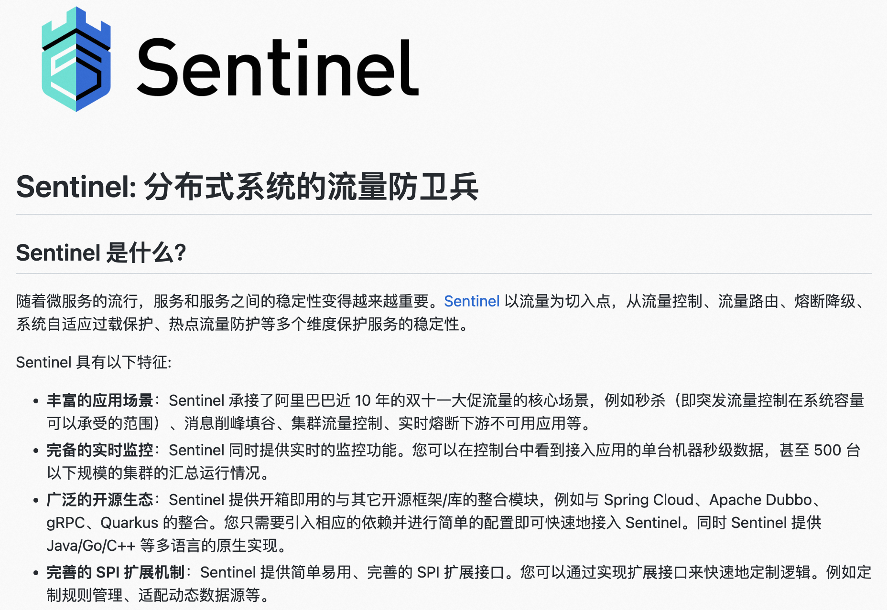

一句话解释，就是之前我们讲解过的Hystrix

下载地址：[https://github.com/alibaba/Sentinel/releases](https://github.com/alibaba/Sentinel/releases)

Sentinel的主要功能：

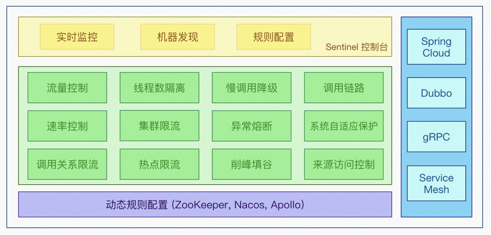

如何用？

官网：[https://spring-cloud-alibaba-group.github.io/github-pages/greenwich/spring-cloud-alibaba.html#_spring_cloud_alibaba_sentinel](https://spring-cloud-alibaba-group.github.io/github-pages/greenwich/spring-cloud-alibaba.html#_spring_cloud_alibaba_sentinel)

# 2 **安装Sentinel控制台**
Sentinel 分为两个部分:

+ 核心库（Java 客户端）不依赖任何框架/库，能够运行于所有 Java 运行时环境，同时对 Dubbo / Spring Cloud 等框架也有较好的支持。
+ 控制台（Dashboard）基于 Spring Boot 开发，打包后可以直接运行，不需要额外的 Tomcat 等应用容器。

下载地址：[https://github.com/alibaba/Sentinel/releases](https://github.com/alibaba/Sentinel/releases)

安装步骤：前提具备 JAVA8+ 环境，8080端口不能被占用

1. 运行命令

   ```basic
   java --add-opens java.base/java.lang=ALL-UNNAMED -jar sentinel-dashboard-1.7.2.jar
   # 44.  --add-opens java.base/java.lang=ALL-UNNAMED  加这个原因是因为本地的JDK版本太高了
   ```

   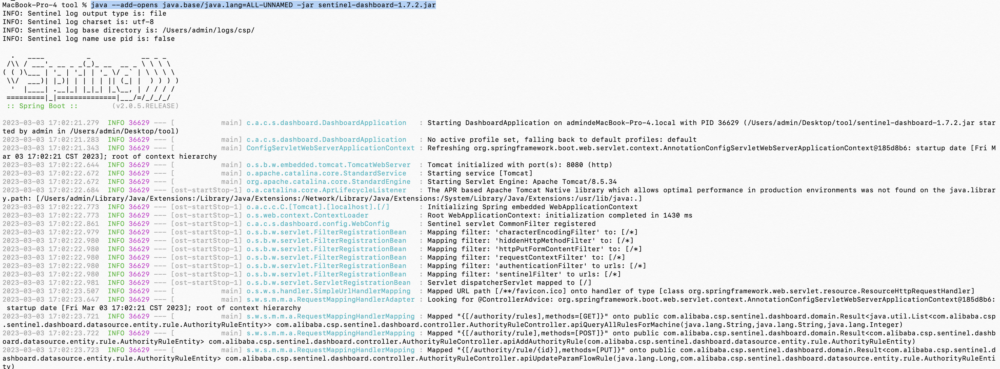

2. 访问：[http://localhost:8080](http://localhost:8080)

   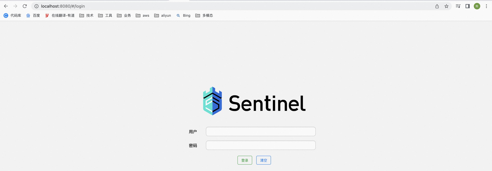

3. 登录账号密码均为sentinel

   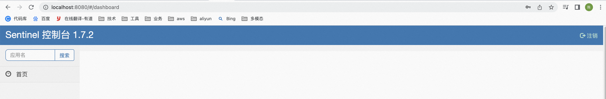

# 3 **初始化演示工程**
构建 cloudalibaba-sentinel-service8401服务，构建步骤：

1. 新建Module
    1. 新建Module

       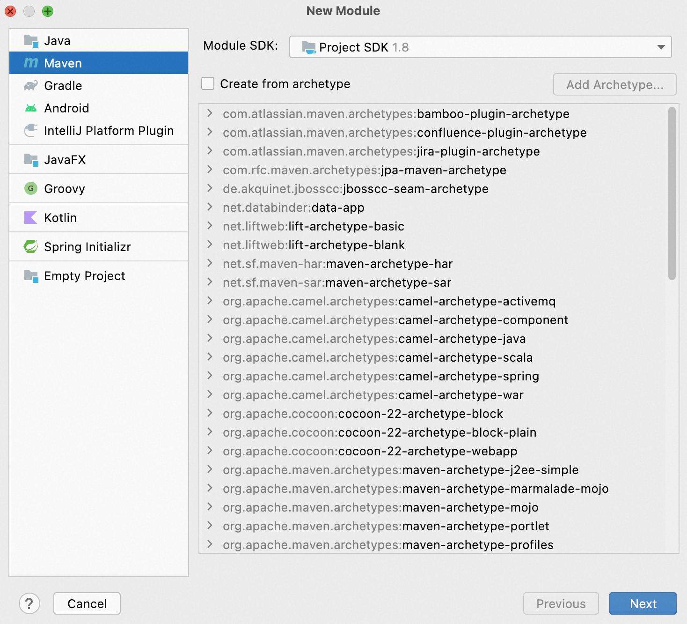


    2. 填写Module名称


       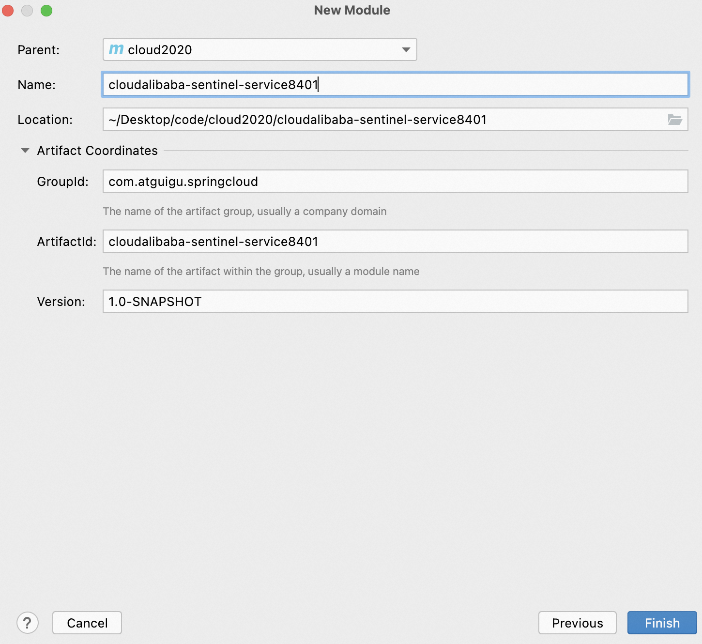


    3. 点击完成

2. POM

    ```xml
    <?xml version="1.0" encoding="UTF-8"?>
    <project xmlns="http://maven.apache.org/POM/4.0.0"
             xmlns:xsi="http://www.w3.org/2001/XMLSchema-instance"
             xsi:schemaLocation="http://maven.apache.org/POM/4.0.0 http://maven.apache.org/xsd/maven-4.0.0.xsd">
        <parent>
            <artifactId>cloud2020</artifactId>
            <groupId>com.atguigu.springcloud</groupId>
            <version>1.0-SNAPSHOT</version>
        </parent>
        <modelVersion>4.0.0</modelVersion>

        <artifactId>cloudalibaba-sentinel-service8401</artifactId>

        <properties>
            <maven.compiler.source>8</maven.compiler.source>
            <maven.compiler.target>8</maven.compiler.target>
        </properties>

        <dependencies>
            <dependency><!-- 引入自己定义的api通用包，可以使用Payment支付Entity -->
                <groupId>com.atguigu.springcloud</groupId>
                <artifactId>cloud-api-commons</artifactId>
                <version>${project.version}</version>
            </dependency>
            <!--SpringCloud ailibaba nacos -->
            <dependency>
                <groupId>com.alibaba.cloud</groupId>
                <artifactId>spring-cloud-starter-alibaba-nacos-discovery</artifactId>
            </dependency>
            <!--SpringCloud ailibaba sentinel-datasource-nacos 后续做持久化用到-->
            <dependency>
                <groupId>com.alibaba.csp</groupId>
                <artifactId>sentinel-datasource-nacos</artifactId>
            </dependency>
            <!--SpringCloud ailibaba sentinel -->
            <dependency>
                <groupId>com.alibaba.cloud</groupId>
                <artifactId>spring-cloud-starter-alibaba-sentinel</artifactId>
            </dependency>
            <!--openfeign-->
            <dependency>
                <groupId>org.springframework.cloud</groupId>
                <artifactId>spring-cloud-starter-openfeign</artifactId>
            </dependency>
            <!-- SpringBoot整合Web组件+actuator -->
            <dependency>
                <groupId>org.springframework.boot</groupId>
                <artifactId>spring-boot-starter-web</artifactId>
            </dependency>
            <dependency>
                <groupId>org.springframework.boot</groupId>
                <artifactId>spring-boot-starter-actuator</artifactId>
            </dependency>
            <!--日常通用jar包配置-->
            <dependency>
                <groupId>org.springframework.boot</groupId>
                <artifactId>spring-boot-devtools</artifactId>
                <scope>runtime</scope>
                <optional>true</optional>
            </dependency>
            <dependency>
                <groupId>cn.hutool</groupId>
                <artifactId>hutool-all</artifactId>
                <version>4.6.3</version>
            </dependency>
            <dependency>
                <groupId>org.projectlombok</groupId>
                <artifactId>lombok</artifactId>
                <optional>true</optional>
            </dependency>
            <dependency>
                <groupId>org.springframework.boot</groupId>
                <artifactId>spring-boot-starter-test</artifactId>
                <scope>test</scope>
            </dependency>

        </dependencies>
    </project>
    ```


3. YML

   ```yaml
   server:
     port: 8401

   spring:
     application:
       name: cloudalibaba-sentinel-service
     cloud:
       nacos:
         discovery:
           server-addr: localhost:8848 #Nacos服务注册中心地址
       sentinel:
         transport:
           dashboard: localhost:8080 #配置Sentinel dashboard地址
           port: 8719 #默认8719端口，假如被占用会自动从8719开始依次+1扫描,直至找到未被占用的端口
           
   management:
     endpoints:
       web:
         exposure:
           include: '*'
   ```


4. 主启动

   ```java
   package com.atguigu.springcloud.alibaba;

   import org.springframework.boot.SpringApplication;
   import org.springframework.boot.autoconfigure.SpringBootApplication;
   import org.springframework.cloud.client.discovery.EnableDiscoveryClient;

   /**
    * @auther zzyy
    * @create 2020-02-24 16:26
    */
   @EnableDiscoveryClient
   @SpringBootApplication
   public class MainApp8401
   {
       public static void main(String[] args) {
           SpringApplication.run(MainApp8401.class, args);
       }
   }
   ```


5. 业务类

   ```java
   package com.atguigu.springcloud.alibaba.controller;

   import com.alibaba.csp.sentinel.annotation.SentinelResource;
   import com.alibaba.csp.sentinel.slots.block.BlockException;
   import lombok.extern.slf4j.Slf4j;
   import org.springframework.web.bind.annotation.GetMapping;
   import org.springframework.web.bind.annotation.RequestParam;
   import org.springframework.web.bind.annotation.RestController;

   import java.util.concurrent.TimeUnit;

   /**
    * @auther zzyy
    * @create 2020-02-24 16:26
    */
   @RestController
   @Slf4j
   public class FlowLimitController
   {
       @GetMapping("/testA")
       public String testA()
       {
           return "------testA";
       }

       @GetMapping("/testB")
       public String testB()
       {
           log.info(Thread.currentThread().getName()+"\t"+"...testB");
           return "------testB";
       }

   }
   ```


6. 测试：启动Nacos8848、启动Sentinel8080、启动微服务8401

   查看sentienl控制台，空空如也，啥都没有

   

   Sentinel采用的懒加载说明：执行一次访问即可

   - [http://localhost:8401/testA](http://localhost:8401/testA)
   - [http://localhost:8401/testB](http://localhost:8401/testB)

   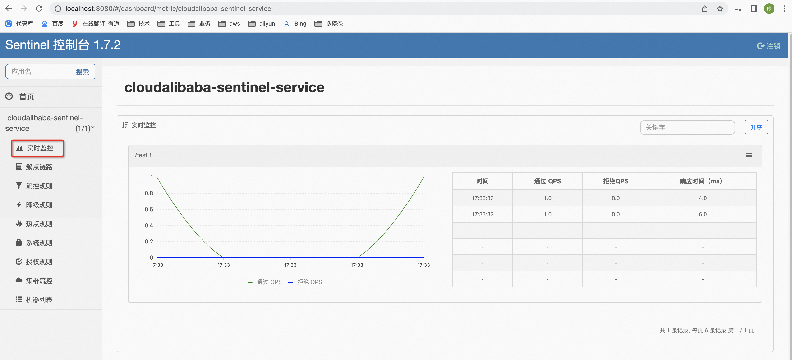

7. 结论：sentinel8080正在监控微服务8401

# 4 流控规则
## 4.1 基本介绍
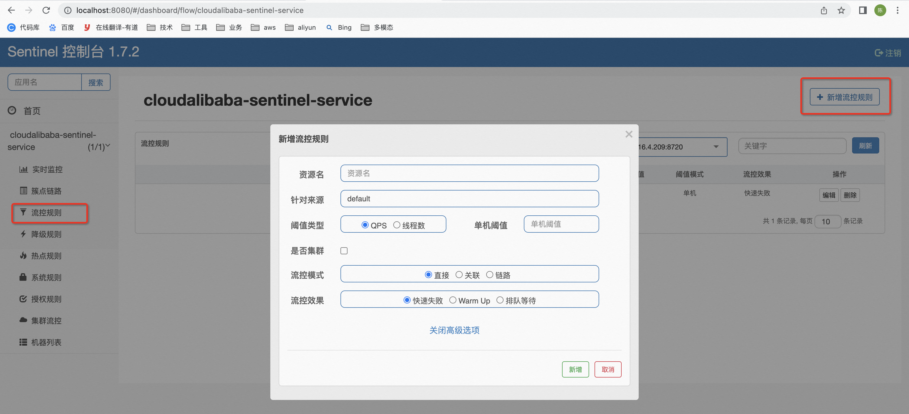

进一步解释：

+ 资源名：唯一名称，默认请求路径
+ 针对来源：Sentinel可以针对调用者进行限流，填写微服务名，默认default(不区分来源)
+ 阈值类型/单机阈值：
    - QPS(每秒钟的请求数量)：当调用该api的QPS达到阈值的时候，进行限流
    - 线程数：当调用该api的线程数达到阈值的时候，进行限流
+ 是否集群：不需要集群
+ 流控模式：
    - 直接：api达到限流涤件时，直接限流
    - 关联：当关联的资源达到阈值时，就限流自己
    - 链路：只记录指定链路上的流量（指定资源从入口资源进来的流量，如果达到阈值，就进行限流）【api级别的针对来源】
+ 流控效果：
    - 快速失败：直接失败，抛异常
    - Warm Up:根据codeFactor(冷加载因子，默认3)的值，从阈值/codeFactor,经过预热时长，才达到设置的QPS阈值
    - 排队等待：匀速排队，让请求以匀速的速度通过，阈值类型必须设置为QPS,否则无效

## 4.2 流控模式
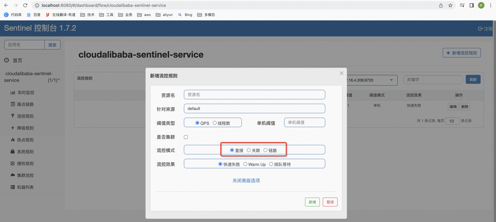

### 4.2.1 直接（默认）
系统默认：直接->快速失败

配置及说明：

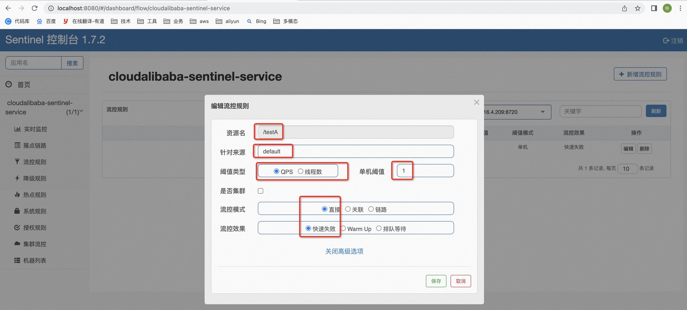

测试：

1. 快速点击访问[http://localhost:8401/testA](http://localhost:8401/testA)
2. 结果

   

3. 思考：直接调用默认报错信息，技术方面OK，but,是否应该有我们自己的后续处理？类似有个fallback的兜底方法？

### 4.2.2 关联
是什么？

当关联的资源达到阈值时，就限流自己，当与A关联的资源B达到阀值后，就限流A自己，一句话：B惹事，A挂了

适用的场景：比如支付系统到达阈值以后，订单系统就可以限流了。

配置：

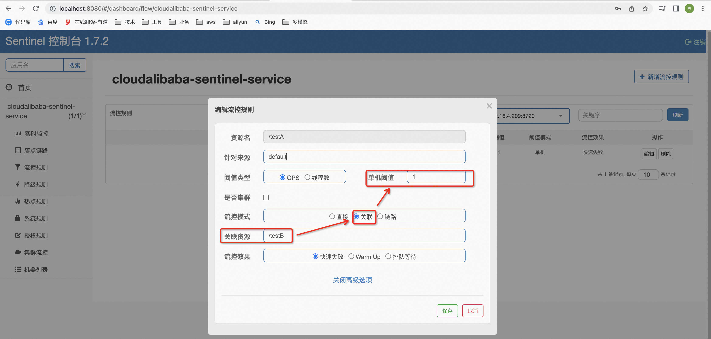

设置效果：当关联资源/testB的qps阀值超过1时，就限流/testA的Rest访问地址，当关联资源到阈值后限制配置好的资源名

测试：

1. 访问testB成功
2. 大批量线程高并发访问B，导致A失效了：20个线程每次间隔0.3s秒访问一次

   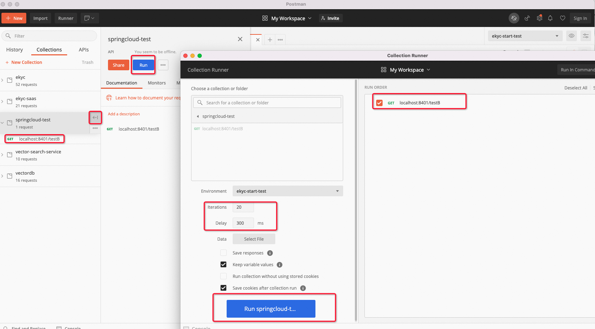

3. 点击访问：[http://localhost:8401/testA](http://localhost:8401/testA)，运行后发现testA挂了

   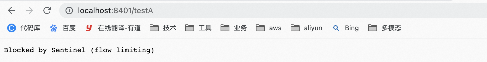

   等testB的流量过去以后，发现testA又好了

   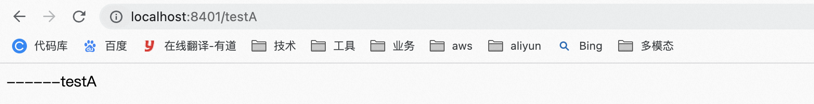

### 4.2.3 链路
## 4.3 流控效果
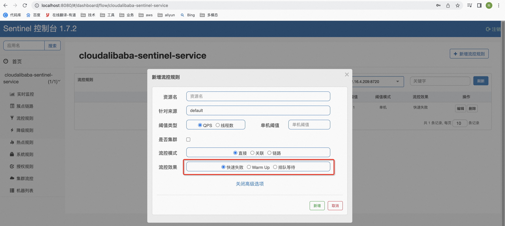

### 4.3.1 快速失败
直接 -> 快速失败（默认的流控处理）

直接失败，抛出异常：Blocked by Sentinel (flow limiting)

源码：

```java
//
// Source code recreated from a .class file by IntelliJ IDEA
// (powered by FernFlower decompiler)
//

package com.alibaba.csp.sentinel.slots.block.flow.controller;

import com.alibaba.csp.sentinel.node.Node;
import com.alibaba.csp.sentinel.node.OccupyTimeoutProperty;
import com.alibaba.csp.sentinel.slots.block.flow.PriorityWaitException;
import com.alibaba.csp.sentinel.slots.block.flow.TrafficShapingController;
import com.alibaba.csp.sentinel.util.TimeUtil;

public class DefaultController implements TrafficShapingController {
    private static final int DEFAULT_AVG_USED_TOKENS = 0;
    private double count;
    private int grade;

    public DefaultController(double count, int grade) {
        this.count = count;
        this.grade = grade;
    }

    public boolean canPass(Node node, int acquireCount) {
        return this.canPass(node, acquireCount, false);
    }

    public boolean canPass(Node node, int acquireCount, boolean prioritized) {
        int curCount = this.avgUsedTokens(node);
        if ((double)(curCount + acquireCount) > this.count) {
            if (prioritized && this.grade == 1) {
                long currentTime = TimeUtil.currentTimeMillis();
                long waitInMs = node.tryOccupyNext(currentTime, acquireCount, this.count);
                if (waitInMs < (long)OccupyTimeoutProperty.getOccupyTimeout()) {
                    node.addWaitingRequest(currentTime + waitInMs, acquireCount);
                    node.addOccupiedPass(acquireCount);
                    this.sleep(waitInMs);
                    throw new PriorityWaitException(waitInMs);
                }
            }

            return false;
        } else {
            return true;
        }
    }

    private int avgUsedTokens(Node node) {
        if (node == null) {
            return 0;
        } else {
            return this.grade == 0 ? node.curThreadNum() : (int)node.passQps();
        }
    }

    private void sleep(long timeMillis) {
        try {
            Thread.sleep(timeMillis);
        } catch (InterruptedException var4) {
        }

    }
}

```

### 4.3.2 Warm UP（预热）
说明：

> 公式：阈值除以coldFactor（默认值为3），经过预热时长后才会达到阈值

官网：[https://github.com/alibaba/Sentinel/wiki/%E6%B5%81%E9%87%8F%E6%8E%A7%E5%88%B6](https://github.com/alibaba/Sentinel/wiki/%E6%B5%81%E9%87%8F%E6%8E%A7%E5%88%B6)

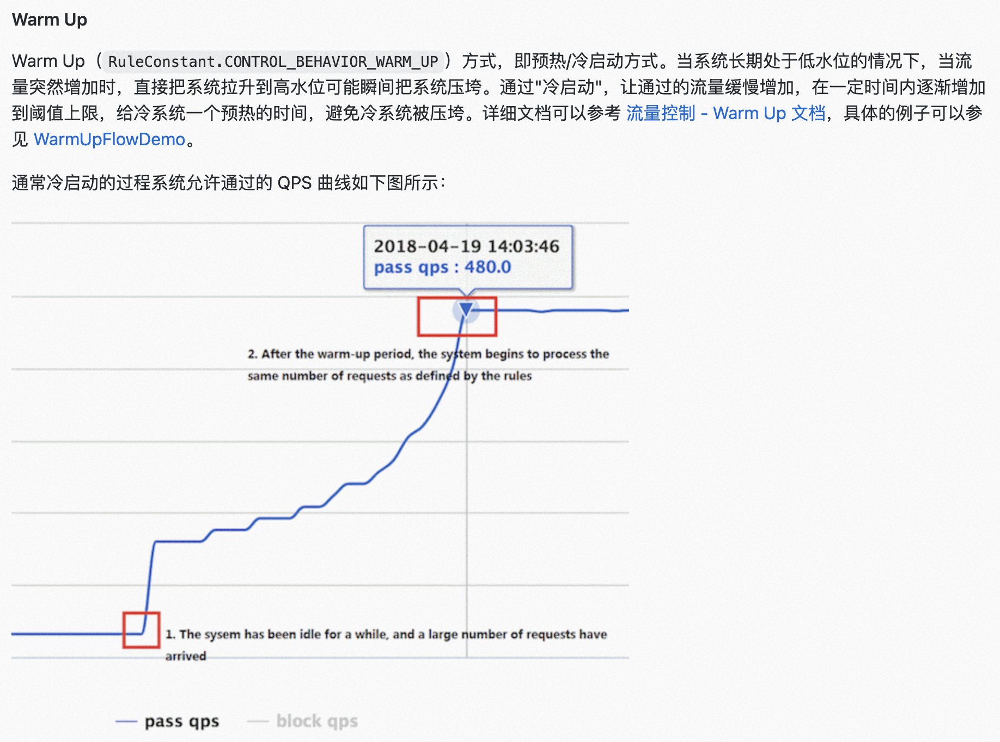

默认coldFactor为3，即请求 QPS 从 threshold(阈值) / 3 开始，经预热时长逐渐升至设定的 QPS 阈值。

源码：

```java
//
// Source code recreated from a .class file by IntelliJ IDEA
// (powered by FernFlower decompiler)
//

package com.alibaba.csp.sentinel.slots.block.flow.controller;

import com.alibaba.csp.sentinel.node.Node;
import com.alibaba.csp.sentinel.slots.block.flow.TrafficShapingController;
import com.alibaba.csp.sentinel.util.TimeUtil;
import java.util.concurrent.atomic.AtomicLong;

public class WarmUpController implements TrafficShapingController {
    protected double count;
    private int coldFactor;
    protected int warningToken = 0;
    private int maxToken;
    protected double slope;
    protected AtomicLong storedTokens = new AtomicLong(0L);
    protected AtomicLong lastFilledTime = new AtomicLong(0L);

    public WarmUpController(double count, int warmUpPeriodInSec, int coldFactor) {
        this.construct(count, warmUpPeriodInSec, coldFactor);
    }

    public WarmUpController(double count, int warmUpPeriodInSec) {
        this.construct(count, warmUpPeriodInSec, 3);
    }

    private void construct(double count, int warmUpPeriodInSec, int coldFactor) {
        if (coldFactor <= 1) {
            throw new IllegalArgumentException("Cold factor should be larger than 1");
        } else {
            this.count = count;
            this.coldFactor = coldFactor;
            this.warningToken = (int)((double)warmUpPeriodInSec * count) / (coldFactor - 1);
            this.maxToken = this.warningToken + (int)((double)(2 * warmUpPeriodInSec) * count / (1.0D + (double)coldFactor));
            this.slope = ((double)coldFactor - 1.0D) / count / (double)(this.maxToken - this.warningToken);
        }
    }

    public boolean canPass(Node node, int acquireCount) {
        return this.canPass(node, acquireCount, false);
    }

    public boolean canPass(Node node, int acquireCount, boolean prioritized) {
        long passQps = (long)node.passQps();
        long previousQps = (long)node.previousPassQps();
        this.syncToken(previousQps);
        long restToken = this.storedTokens.get();
        if (restToken >= (long)this.warningToken) {
            long aboveToken = restToken - (long)this.warningToken;
            double warningQps = Math.nextUp(1.0D / ((double)aboveToken * this.slope + 1.0D / this.count));
            if ((double)(passQps + (long)acquireCount) <= warningQps) {
                return true;
            }
        } else if ((double)(passQps + (long)acquireCount) <= this.count) {
            return true;
        }

        return false;
    }

    protected void syncToken(long passQps) {
        long currentTime = TimeUtil.currentTimeMillis();
        currentTime -= currentTime % 1000L;
        long oldLastFillTime = this.lastFilledTime.get();
        if (currentTime > oldLastFillTime) {
            long oldValue = this.storedTokens.get();
            long newValue = this.coolDownTokens(currentTime, passQps);
            if (this.storedTokens.compareAndSet(oldValue, newValue)) {
                long currentValue = this.storedTokens.addAndGet(0L - passQps);
                if (currentValue < 0L) {
                    this.storedTokens.set(0L);
                }

                this.lastFilledTime.set(currentTime);
            }

        }
    }

    private long coolDownTokens(long currentTime, long passQps) {
        long oldValue = this.storedTokens.get();
        long newValue = oldValue;
        if (oldValue < (long)this.warningToken) {
            newValue = (long)((double)oldValue + (double)(currentTime - this.lastFilledTime.get()) * this.count / 1000.0D);
        } else if (oldValue > (long)this.warningToken && passQps < (long)((int)this.count / this.coldFactor)) {
            newValue = (long)((double)oldValue + (double)(currentTime - this.lastFilledTime.get()) * this.count / 1000.0D);
        }

        return Math.min(newValue, (long)this.maxToken);
    }
}

```

配置：

默认 coldFactor 为 3，即请求QPS从(threshold / 3) 开始，经多少预热时长才逐渐升至设定的 QPS 阈值。

案例：阀值为10+预热时长设置5秒。

系统初始化的阀值为10 / 3 约等于3,即阀值刚开始为3；然后过了5秒后阀值才慢慢升高恢复到10

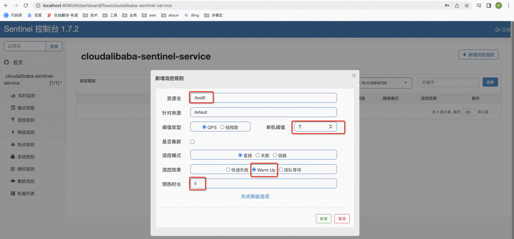

测试：刚开始不行，后续慢慢OK

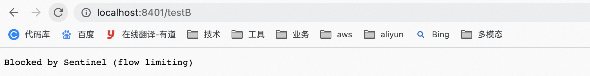

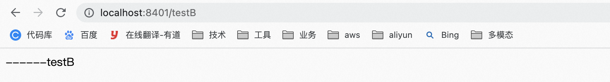

应用场景：秒杀系统在开启的瞬间，会有很多流量上来，很有可能把系统打死，预热方式就是把为了保护系统，可慢慢的把流量放进来，慢慢的把阀值增长到设置的阀值。

### 4.3.3 排队等待
匀速排队，阈值必须设置为QPS

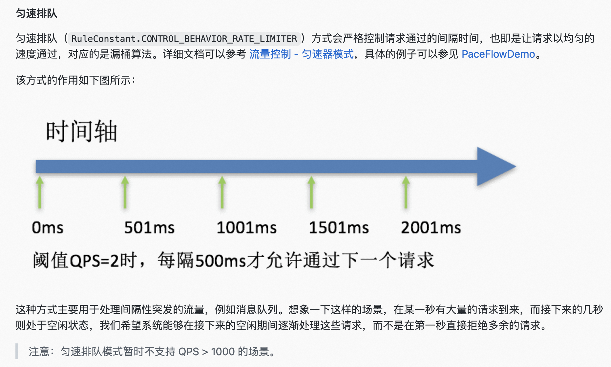

源码：

```java
//
// Source code recreated from a .class file by IntelliJ IDEA
// (powered by FernFlower decompiler)
//

package com.alibaba.csp.sentinel.slots.block.flow.controller;

import com.alibaba.csp.sentinel.node.Node;
import com.alibaba.csp.sentinel.slots.block.flow.TrafficShapingController;
import com.alibaba.csp.sentinel.util.TimeUtil;
import java.util.concurrent.atomic.AtomicLong;

public class RateLimiterController implements TrafficShapingController {
    private final int maxQueueingTimeMs;
    private final double count;
    private final AtomicLong latestPassedTime = new AtomicLong(-1L);

    public RateLimiterController(int timeOut, double count) {
        this.maxQueueingTimeMs = timeOut;
        this.count = count;
    }

    public boolean canPass(Node node, int acquireCount) {
        return this.canPass(node, acquireCount, false);
    }

    public boolean canPass(Node node, int acquireCount, boolean prioritized) {
        if (acquireCount <= 0) {
            return true;
        } else if (this.count <= 0.0D) {
            return false;
        } else {
            long currentTime = TimeUtil.currentTimeMillis();
            long costTime = Math.round(1.0D * (double)acquireCount / this.count * 1000.0D);
            long expectedTime = costTime + this.latestPassedTime.get();
            if (expectedTime <= currentTime) {
                this.latestPassedTime.set(currentTime);
                return true;
            } else {
                long waitTime = costTime + this.latestPassedTime.get() - TimeUtil.currentTimeMillis();
                if (waitTime > (long)this.maxQueueingTimeMs) {
                    return false;
                } else {
                    long oldTime = this.latestPassedTime.addAndGet(costTime);

                    try {
                        waitTime = oldTime - TimeUtil.currentTimeMillis();
                        if (waitTime > (long)this.maxQueueingTimeMs) {
                            this.latestPassedTime.addAndGet(-costTime);
                            return false;
                        } else {
                            if (waitTime > 0L) {
                                Thread.sleep(waitTime);
                            }

                            return true;
                        }
                    } catch (InterruptedException var15) {
                        return false;
                    }
                }
            }
        }
    }
}

```

配置：单机阈值设置为1，流控效果设置为排队等待，意思为：每隔一秒才允许下一个请求进入

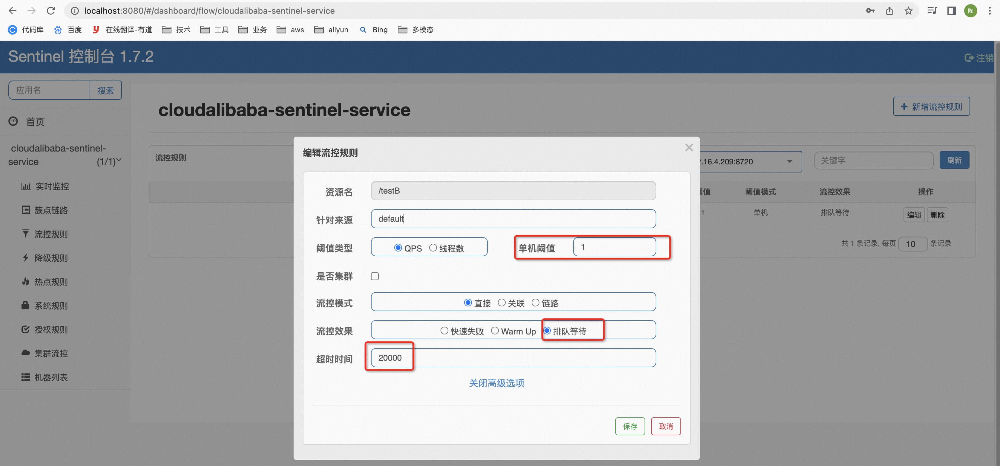

测试：

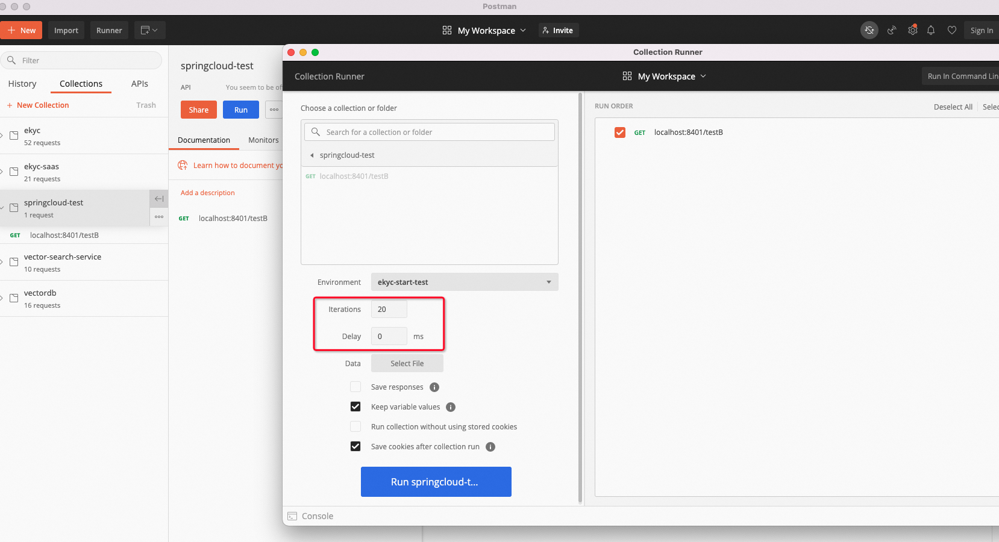


我们发现：尽管我们再postman中发出20个请求，尽管Delay是0，但是请求还是每隔1s左右才发出，再看看控制台页面

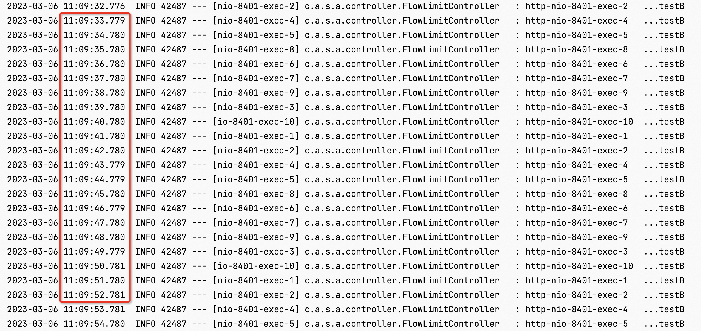

我们再删除掉这个流控规则，重新调用一下postman，发现：

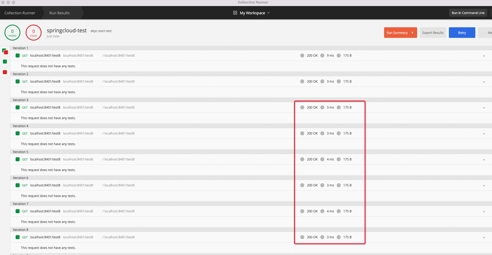

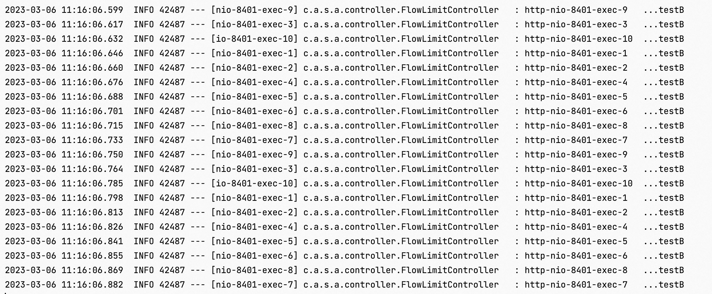

这样可以更深刻的理解排队等待这个流控效果。

# 5 降级规则
官网：[https://github.com/alibaba/Sentinel/wiki/%E7%86%94%E6%96%AD%E9%99%8D%E7%BA%A7](https://github.com/alibaba/Sentinel/wiki/%E7%86%94%E6%96%AD%E9%99%8D%E7%BA%A7)

Sentinel 熔断降级会在调用链路中某个资源出现不稳定状态时（例如调用超时或异常比例升高），对这个资源的调用进行限制，让请求快速失败，避免影响到其它的资源而导致级联错误。

当资源被降级后，在接下来的降级时间窗口之内，对该资源的调用都自动熔断（默认行为是抛出 DegradeException）。

Sentinel的断路器是没有半开状态的，半开的状态是指系统自动去检测是否请求有异常，没有异常就关闭断路器恢复使用，有异常则继续打开断路器不可用。具体可以参考Hystrix

降级策略

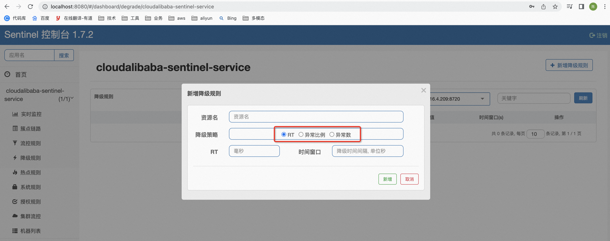

+ RT（平均响应时间，秒级）：平均响应时间   超出阈值  且   在时间窗口内通过的请求>=5，两个条件同时满足后触发降级
    - 窗口期过后关闭断路器
    - RT最大4900（更大的需要通过 `-Dcsp.sentinel.statistic.max.rt=XXXX`才能生效）
+  异常比列（秒级）
    - QPS >= 5 且异常比例（秒级统计）超过阈值时，触发降级；时间窗口结束后，关闭降级
+ 异常数（分钟级）
    - 异常数（分钟统计）超过阈值时，触发降级；时间窗口结束后，关闭降级


## 5.1 RT
平均响应时间(DEGRADE_GRADE_RT)：当1s内持续进入5个请求，对应时刻的平均响应时间（秒级)均超过阈值(count，以ms为单位)，那么在接下的时间窗口(DegradeRule中的  
timewindow，以s为单位)之内，对这个方法的调用都会自动地熔断（抛出DegradeException)。注意 Sentinel 默认统计的RT上限是4900ms，超出此阈值的都会算作4900ms,若需要变更此上限可以通过启动配置项 `-Dcsp.sentinel.statistic.max.rt=xxx` 来配置。

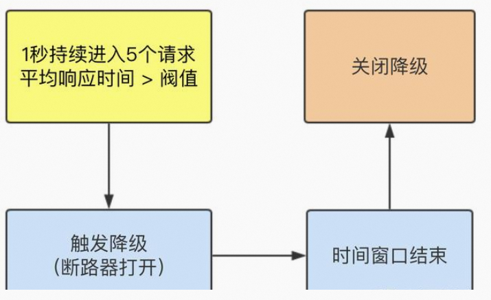

测试

1. 代码

   ```java
   @GetMapping("/testD")
   public String testD()
   {
       try { TimeUnit.SECONDS.sleep(1); } catch (InterruptedException e) { e.printStackTrace(); }
       log.info("testD 测试RT");
       return "------testD";
   }
   ```


2. 配置

   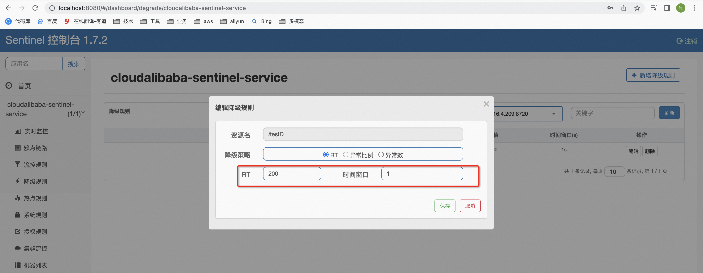

3. Jmeter压测

   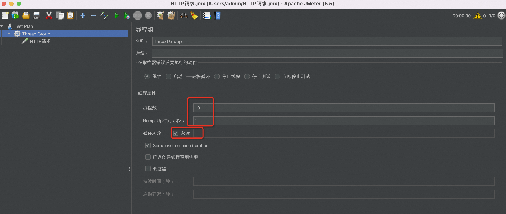

4. 结论：按照上述配置，永远一秒钟打进来10个线程（大于5个了）调用testD，我们希望200毫秒处理完本次任务，如果超过200毫秒还没处理完，在未来1秒钟的时间窗口内，断路器打开(保险丝跳闸)微服务不可用，保险丝跳闸断电了后续我停止jmeter，没有这么大的访问量了，断路器关闭(保险丝恢复)，微服务恢复OK

    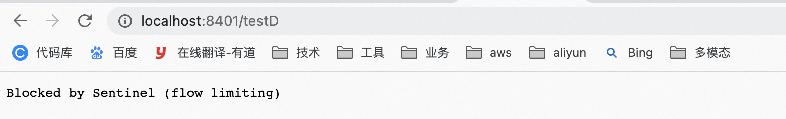

## 5.2 异常比例
异常比例（DEGRADE_GRADE_EXCEPTION_RATI0）：当资源的海秒请求量>=5，并且每秒异常总数占通过量的比值超过阈值(DegradeRule中的count)之后，资源进入降级状态，即在接下的时间窗口（DegradeRule中的timeWindow，以s为单位）之内，对这个方法的调用都会自动地返回。异常比率的阈值范围是[0.0,1.0]，代表0%-100%。


测试：

1. 代码

   ```java
   @GetMapping("/testD")
   public String testD()
   {
       log.info("testD 异常比例");
       int age = 10/0;
       return "------testD";
   }
   ```


2. 配置

   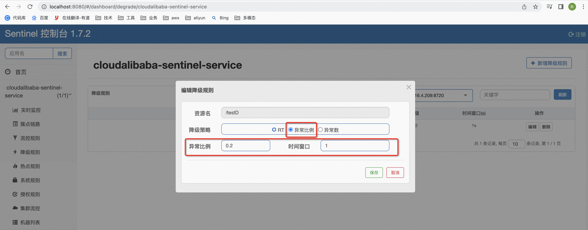

3. Jmeter

   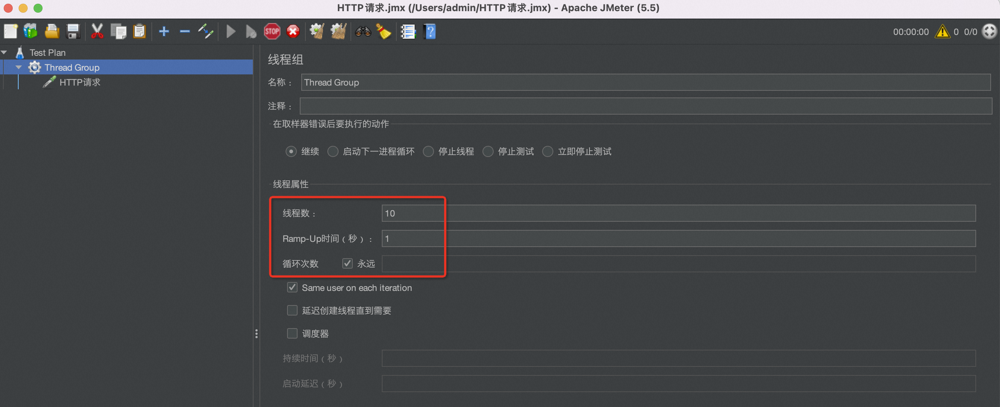

4. 结论：按照上述配置，单独访问一次，必然来一次报错一次(`int age  = 10/0`)，调一次错一次；

    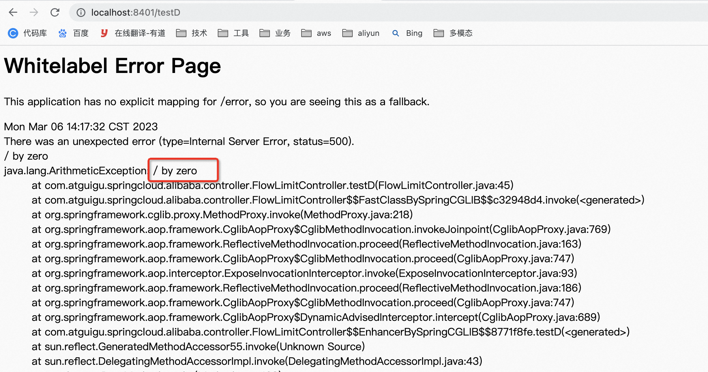

    开启jmeter后，直接高并发发送请求，多次调用达到我们的配置条件了。断路器开启(保险丝跳闸)，微服务不可用了，不再报错error而是服务降级了。

    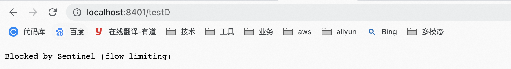 


## 5.3 异常数
异常数（DEGRADE GRADE EXCEPTION COUNT）: 当资源近1分钟的异常数目超过阈值之后会进行熔断。注意由于统计时间窗口是分钟级别的，若timeWindow小于60s,则结束熔断状态后仍可能再进入熔断状态。  
时间窗口一定要大于等于60秒。异常数是按照分钟统计的

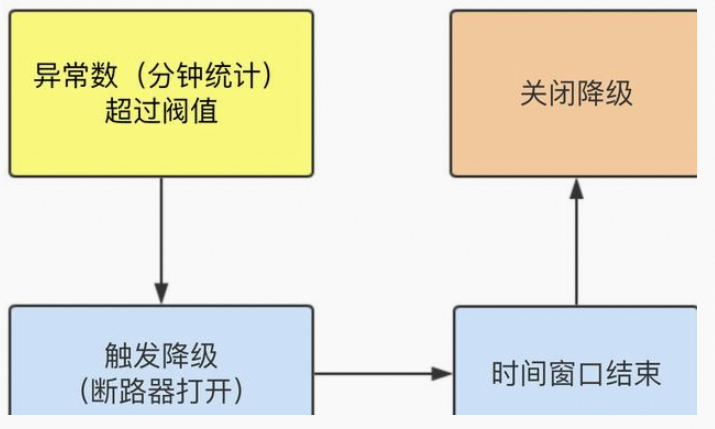

测试：

1. 代码

   ```java
   @GetMapping("/testE")
   public String testE()
   {
       log.info("testE 测试异常数");
       int age = 10/0;
       return "------testE 测试异常数";
   }
   ```


2. 配置

   

3. 结论：[http://localhost:8401/testE](http://localhost:8401/testE)
    - 第一次访问绝对报错，因为除数不能为零

      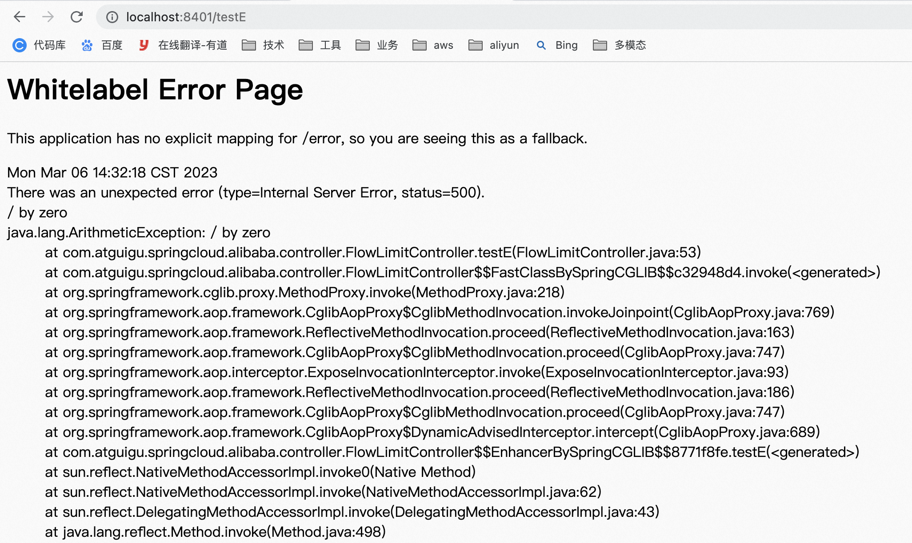

    - 但是达到5次报错后，进入熔断后降级。


      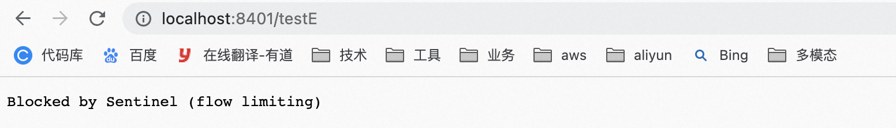

# 6 热点规则限流
基本介绍

何为热点：热点即经常访问的数据，很多时候我们希望统计或者限制某个热点数据中访问频次最高的TopN数据，并对其访问进行限流或者其它操作

官网：[https://github.com/alibaba/Sentinel/wiki/%E7%83%AD%E7%82%B9%E5%8F%82%E6%95%B0%E9%99%90%E6%B5%81](https://github.com/alibaba/Sentinel/wiki/%E7%83%AD%E7%82%B9%E5%8F%82%E6%95%B0%E9%99%90%E6%B5%81)

兜底方法：分为系统默认和客户自定义，两种

之前的case，限流出问题后，都是用sentinel系统默认的提示：Blocked by Sentinel (flow limiting)

我们能不能自定?类似hystrix，某个方法出问题了，就找对应的兜底降级方法？

结论：从 HystrixCommand  到 @SentinelResource 

## 6.1 基础热点规则限流
**操作步骤**  

1. 代码如下  

   ```java
   @GetMapping("/testHotKey")
   @SentinelResource(value = "testHotKey",blockHandler = "deal_testHotKey")
   public String testHotKey(@RequestParam(value = "p1",required = false) String p1,
                            @RequestParam(value = "p2",required = false) String p2)
   {
           
       return "------testHotKey";
   }

   public String deal_testHotKey (String p1, String p2, BlockException exception)
   {
       return "------deal_testHotKey,o(╥﹏╥)o";  //sentinel系统默认的提示：Blocked by Sentinel (flow limiting)
   }
   ```


2. 配置

   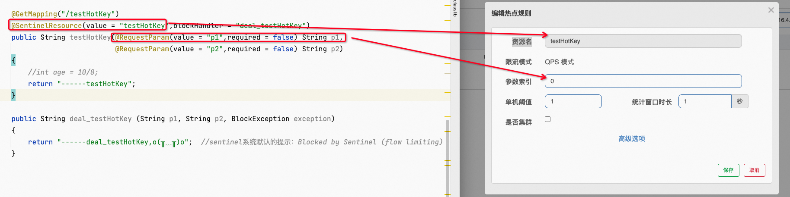

   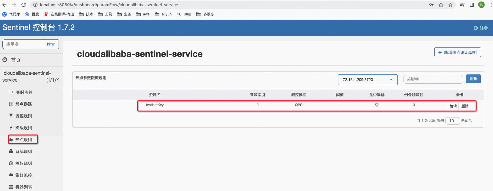

3. 测试
    - `@SentinelResource(value = "testHotKey")` 没有 `blockHandler`

      异常打到了前台用户界面看到，不友好

      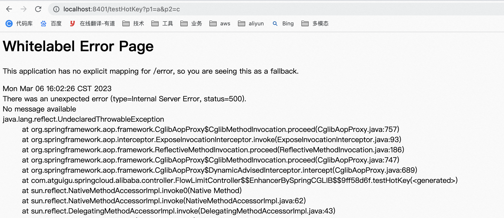

    - `@SentinelResource(value = "testHotKey", blockHandler = "dealHandler_testHotKey")`


      方法testHotKey里面第一个参数只要QPS超过每秒1次，马上降级处理，用了我们自己定义的

      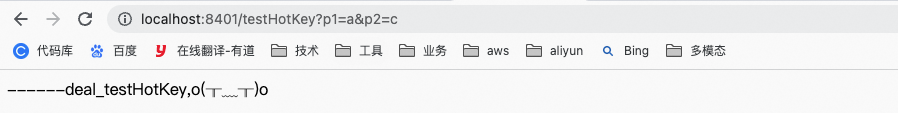

    - [http://localhost:8401/testHotKey?p1=abc](http://localhost:8401/testHotKey?p1=abc)    error

    - [http://localhost:8401/testHotKey?p1=abc&p2=33](http://localhost:8401/testHotKey?p1=abc&p2=33)    error

    - [http://localhost:8401/testHotKey?p2=abc](http://localhost:8401/testHotKey?p2=abc)  right

## 6.2 参数例外项
上述案例演示了第一个参数p1，当QPS超过1秒1次点击后马上被限流

普通：超过1秒钟一个后，达到阈值1后马上被限流

特例：我们期望p1参数当它是某个特殊值时，它的限流值和平时不一样，我们期望p1参数当它是某个特殊值时，它的限流值和平时不一样

操作步骤

1. 配置

   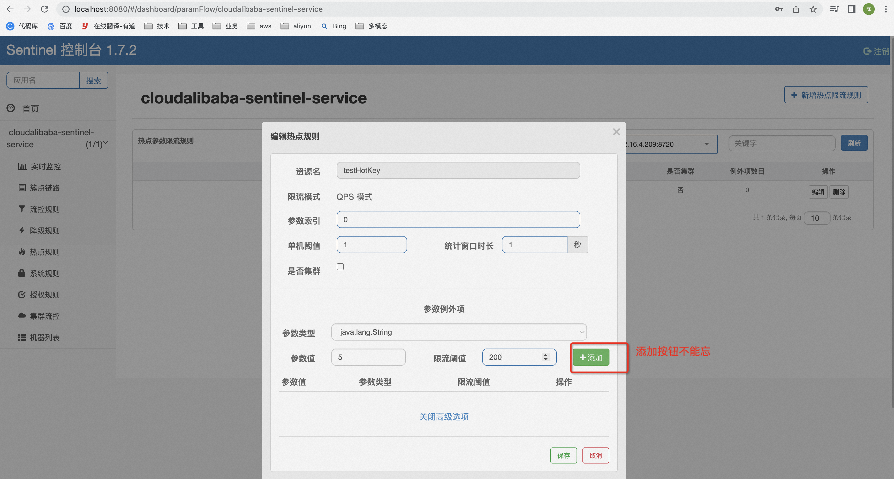

2. 测试
    - [http://localhost:8401/testHotKey?p1=5](http://localhost:8401/testHotKey?p1=5)
    - [http://localhost:8401/testHotKey?p1=3](http://localhost:8401/testHotKey?p1=3)
    - 当p1等于5的时候，阈值变为200，当p1不等于5的时候，阈值就是平常的1
    - 热点参数的注意点，参数必须是基本类型或者String

# 7 系统规则
官网：[https://github.com/alibaba/Sentinel/wiki/%E7%B3%BB%E7%BB%9F%E8%87%AA%E9%80%82%E5%BA%94%E9%99%90%E6%B5%81](https://github.com/alibaba/Sentinel/wiki/%E7%B3%BB%E7%BB%9F%E8%87%AA%E9%80%82%E5%BA%94%E9%99%90%E6%B5%81)


系统规则

系统保护规则是从应用级别的入口流量进行控制，从单台机器的 load、CPU 使用率、平均 RT、入口 QPS 和并发线程数等几个维度监控应用指标，让系统尽可能跑在最大吞吐量的同时保证系统整体的稳定性。

系统保护规则是应用整体维度的，而不是资源维度的，并且**仅对入口流量生效**。入口流量指的是进入应用的流量（EntryType.IN），比如 Web 服务或 Dubbo 服务端接收的请求，都属于入口流量。

系统规则支持以下的模式：

+ **Load 自适应**（仅对 Linux/Unix-like 机器生效）：系统的 load1 作为启发指标，进行自适应系统保护。当系统 load1 超过设定的启发值，且系统当前的并发线程数超过估算的系统容量时才会触发系统保护（BBR 阶段）。系统容量由系统的 maxQps * minRt 估算得出。设定参考值一般是 CPU cores * 2.5。
+ **CPU usage**（1.5.0+ 版本）：当系统 CPU 使用率超过阈值即触发系统保护（取值范围 0.0-1.0），比较灵敏。
+ **平均 RT**：当单台机器上所有入口流量的平均 RT 达到阈值即触发系统保护，单位是毫秒。
+ **并发线程数**：当单台机器上所有入口流量的并发线程数达到阈值即触发系统保护。
+ **入口 QPS**：当单台机器上所有入口流量的 QPS 达到阈值即触发系统保护。


配置：

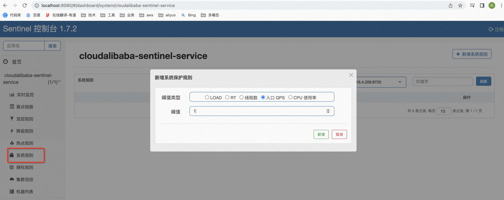

测试：

1. [http://localhost:8401/testA](http://localhost:8401/testA)

   

2. [http://localhost:8401/testB](http://localhost:8401/testB)

   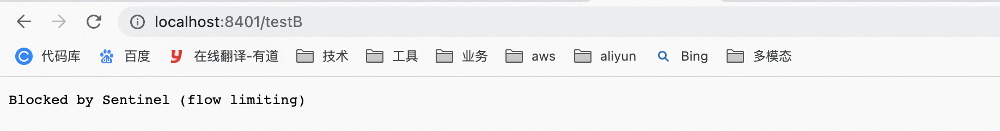

我们发现所有的接口都进行了限流。

