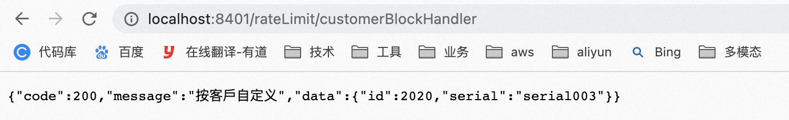
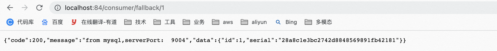
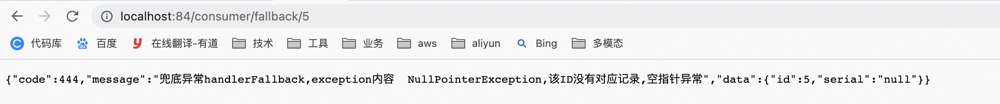

**笔记来源：**[**尚硅谷SpringCloud框架开发教程(SpringCloudAlibaba微服务分布式架构丨Spring Cloud)**](https://www.bilibili.com/video/BV18E411x7eT/?spm_id_from=333.337.search-card.all.click&vd_source=e8046ccbdc793e09a75eb61fe8e84a30)


# 1 **@SentinelResource**
## 1.1 按照资源名称限流
操作步骤

1. 启动Nacos成功：[http://localhost:8848/nacos/#/login](http://localhost:8848/nacos/#/login)
2. 启动Sentinel成功：`java -jar sentinel-dashboard-1.7.0.jar` 
3. 操作Module：cloudalibaba-sentinel-service8401
    1. POM

       ```xml
       <dependency><!-- 引入自己定义的api通用包，可以使用Payment支付Entity -->
           <groupId>com.atguigu.springcloud</groupId>
           <artifactId>cloud-api-commons</artifactId>
           <version>${project.version}</version>
       </dependency>
       ```

    2. 业务类

       ```java
       package com.atguigu.springcloud.alibaba.controller;

       import com.alibaba.csp.sentinel.annotation.SentinelResource;
       import com.alibaba.csp.sentinel.slots.block.BlockException;
       import com.atguigu.springcloud.alibaba.myhandler.CustomerBlockHandler;
       import com.atguigu.springcloud.entities.CommonResult;
       import com.atguigu.springcloud.entities.Payment;
       import org.springframework.web.bind.annotation.GetMapping;
       import org.springframework.web.bind.annotation.RestController;

       /**
        * @auther zzyy
        * @create 2020-02-25 15:04
        */
       @RestController
       public class RateLimitController
       {
           @GetMapping("/byResource")
           @SentinelResource(value = "byResource",blockHandler = "handleException")
           public CommonResult byResource()
           {
               return new CommonResult(200,"按资源名称限流测试OK",new Payment(2020L,"serial001"));
           }
           public CommonResult handleException(BlockException exception)
           {
               return new CommonResult(444,exception.getClass().getCanonicalName()+"\t 服务不可用");
           }
       }
       ```


4. 配置步骤

   

   表示1秒钟内查询次数大于1，就跑到我们自定义的处流，限流

   图形配置和代码关系

   

5. 测试

   1秒钟点击1下，OK。超过上述，疯狂点击，返回了自己定义的限流处理信息，限流发生

   

6. 额外问题。此时关闭服务8401看看

   

   Sentinel控制台，流控规则消失了？临时/持久？

   

## 1.2 **按照Url地址限流**
通过访问的URL来限流，会返回Sentinel自带默认的限流处理信息

操作步骤

1. 业务类

   ```java
   package com.atguigu.springcloud.alibaba.controller;

   import com.alibaba.csp.sentinel.annotation.SentinelResource;
   import com.alibaba.csp.sentinel.slots.block.BlockException;
   import com.atguigu.springcloud.alibaba.myhandler.CustomerBlockHandler;
   import com.atguigu.springcloud.entities.CommonResult;
   import com.atguigu.springcloud.entities.Payment;
   import org.springframework.web.bind.annotation.GetMapping;
   import org.springframework.web.bind.annotation.RestController;

   /**
    * @auther zzyy
    * @create 2020-02-25 15:04
    */
   @RestController
   public class RateLimitController
   {
       @GetMapping("/byResource")
       @SentinelResource(value = "byResource",blockHandler = "handleException")
       public CommonResult byResource()
       {
           return new CommonResult(200,"按资源名称限流测试OK",new Payment(2020L,"serial001"));
       }
       public CommonResult handleException(BlockException exception)
       {
           return new CommonResult(444,exception.getClass().getCanonicalName()+"\t 服务不可用");
       }

       @GetMapping("/rateLimit/byUrl")
       @SentinelResource(value = "byUrl")
       public CommonResult byUrl()
       {
           return new CommonResult(200,"按url限流测试OK",new Payment(2020L,"serial002"));
       }
   }
   ```


2. 访问一次：[http://localhost:8401/rateLimit/byUrl](http://localhost:8401/rateLimit/byUrl)

   

3. Sentinel控制台配置

   

   

4. 测试：会返回Sentinel自带的限流处理结果

   

**上面兜底方案面临的问题：**

1. 系统默认的，没有体现我们自己的业务要求。
2. 依照现有条件，我们自定义的处理方法又和业务代码耦合在一块，不直观。
3. 每个业务方法都添加一个兜底的，那代码膨胀加剧。
4. 全局统一的处理方法没有体现。

## 1.3 **客户自定义限流处理逻辑**
操作步骤：

1. 创建 CustomerBlockHandler 类用于自定义限流处理逻辑

   ```java
   package com.atguigu.springcloud.alibaba.myhandler;

   import com.alibaba.csp.sentinel.slots.block.BlockException;
   import com.atguigu.springcloud.entities.CommonResult;
   import com.atguigu.springcloud.entities.Payment;

   /**
    * @auther zzyy
    * @create 2020-02-25 15:32
    */
   public class CustomerBlockHandler
   {
       public static CommonResult handlerException(BlockException exception)
       {
           return new CommonResult(4444,"按客戶自定义,global handlerException----1");
       }
       public static CommonResult handlerException2(BlockException exception)
       {
           return new CommonResult(4444,"按客戶自定义,global handlerException----2");
       }
   }
   ```


2. 业务类

   ```java
   @GetMapping("/rateLimit/customerBlockHandler")
   @SentinelResource(value = "customerBlockHandler",
           blockHandlerClass = CustomerBlockHandler.class,
           blockHandler = "handlerException2")
   public CommonResult customerBlockHandler()
   {
       return new CommonResult(200,"按客戶自定义",new Payment(2020L,"serial003"));
   }
   ```


3. 启动微服务后先调用一次：

   

4. Sentinel控制台配置

   

5. 快速点击：测试后我们自定义的出来了

   

6. 进一步说明

   


**更多注解属性说明**

>@SentinelResource 注解
>
>注意：注解方式埋点不支持 private 方法。
>
>@SentinelResource 用于定义资源，并提供可选的异常处理和 fallback 配置项。 @SentinelResource 注解包含以下属性：
>
>- value：资源名称，必需项（不能为空）
>- entryType：entry 类型，可选项（默认为 EntryType.OUT）
>- blockHandler / blockHandlerClass: blockHandler 对应处理 BlockException 的函数名称，可选项。blockHandler 函数访问范围需要是 public，返回类型需要与原方法相匹配，参数类型需要和原方法相匹配并且最后加一个额外的参数，类型为 BlockException。blockHandler 函数默认需要和原方法在同一个类中。若希望使用其他类的函数，则可以指定 blockHandlerClass 为对应的类的 Class 对象，注意对应的函数必需为 static 函数，否则无法解析。
>- fallback：fallback 函数名称，可选项，用于在抛出异常的时候提供 fallback 处理逻辑。fallback 函数可以针对所有类型的异常（除了 exceptionsToIgnore 里面排除掉的异常类型）进行处理。fallback 函数签名和位置要求：
>  - 返回值类型必须与原函数返回值类型一致；
>  - 方法参数列表需要和原函数一致，或者可以额外多一个 Throwable 类型的参数用于接收对应的异常。
>  - fallback 函数默认需要和原方法在同一个类中。若希望使用其他类的函数，则可以指定 fallbackClass 为对应的类的 Class 对象，注意对应的函数必需为 static 函数，否则无法解析。
>- defaultFallback（since 1.6.0）：默认的 fallback 函数名称，可选项，通常用于通用的 fallback 逻辑（即可以用于很多服务或方法）。默认 fallback 函数可以针对所以类型的异常（除了 exceptionsToIgnore 里面排除掉的异常类型）进行处理。若同时配置了 fallback 和 defaultFallback，则只有 fallback 会生效。defaultFallback 函数签名要求：
>  - 返回值类型必须与原函数返回值类型一致；
>  - 方法参数列表需要为空，或者可以额外多一个 Throwable 类型的参数用于接收对应的异常。
>  - defaultFallback 函数默认需要和原方法在同一个类中。若希望使用其他类的函数，则可以指定 fallbackClass 为对应的类的 Class 对象，注意对应的函数必需为 static 函数，否则无法解析。
>- exceptionsToIgnore（since 1.6.0）：用于指定哪些异常被排除掉，不会计入异常统计中，也不会进入 fallback 逻辑中，而是会原样抛出。
>
>注：1.6.0 之前的版本 fallback 函数只针对降级异常（DegradeException）进行处理，**不能针对业务异常进行处理**。
>
>特别地，若 blockHandler 和 fallback 都进行了配置，则被限流降级而抛出 BlockException 时只会进入 blockHandler 处理逻辑。若未配置 blockHandler、fallback 和 defaultFallback，则被限流降级时会将 BlockException **直接抛出**。


详细见官网：[https://sentinelguard.io/zh-cn/docs/annotation-support.html](https://sentinelguard.io/zh-cn/docs/annotation-support.html)

Sentinel主要有三个核心Api

+ SphU定义资源
+ Tracer定义统计
+ ContextUtil定义了上下文

# 2 服务熔断功能
sentinel 整合`ribbon`  + `openFeign` + `fallback` 

## 2.1 Ribbon系列
启动nacos和sentinel

**新建cloudalibaba-provider-payment9003**

1. 新建Module
    1. 新建Module

       


    2. 填写Module名称


       


    3. 点击完成

2. POM

    ```xml
    <?xml version="1.0" encoding="UTF-8"?>
    <project xmlns="http://maven.apache.org/POM/4.0.0"
             xmlns:xsi="http://www.w3.org/2001/XMLSchema-instance"
             xsi:schemaLocation="http://maven.apache.org/POM/4.0.0 http://maven.apache.org/xsd/maven-4.0.0.xsd">
        <parent>
            <artifactId>cloud2020</artifactId>
            <groupId>com.atguigu.springcloud</groupId>
            <version>1.0-SNAPSHOT</version>
        </parent>
        <modelVersion>4.0.0</modelVersion>

        <artifactId>cloudalibaba-provider-payment9003</artifactId>

        <properties>
            <maven.compiler.source>8</maven.compiler.source>
            <maven.compiler.target>8</maven.compiler.target>
        </properties>

        <dependencies>
            <!--SpringCloud ailibaba nacos -->
            <dependency>
                <groupId>com.alibaba.cloud</groupId>
                <artifactId>spring-cloud-starter-alibaba-nacos-discovery</artifactId>
            </dependency>
            <dependency><!-- 引入自己定义的api通用包，可以使用Payment支付Entity -->
                <groupId>com.atguigu.springcloud</groupId>
                <artifactId>cloud-api-commons</artifactId>
                <version>${project.version}</version>
            </dependency>
            <!-- SpringBoot整合Web组件 -->
            <dependency>
                <groupId>org.springframework.boot</groupId>
                <artifactId>spring-boot-starter-web</artifactId>
            </dependency>
            <dependency>
                <groupId>org.springframework.boot</groupId>
                <artifactId>spring-boot-starter-actuator</artifactId>
            </dependency>
            <!--日常通用jar包配置-->
            <dependency>
                <groupId>org.springframework.boot</groupId>
                <artifactId>spring-boot-devtools</artifactId>
                <scope>runtime</scope>
                <optional>true</optional>
            </dependency>
            <dependency>
                <groupId>org.projectlombok</groupId>
                <artifactId>lombok</artifactId>
                <optional>true</optional>
            </dependency>
            <dependency>
                <groupId>org.springframework.boot</groupId>
                <artifactId>spring-boot-starter-test</artifactId>
                <scope>test</scope>
            </dependency>
        </dependencies>

    </project>
    ```


3. YML

   ```yaml
   server:
     port: 9003

   spring:
     application:
       name: nacos-payment-provider
     cloud:
       nacos:
         discovery:
           server-addr: localhost:8848 #配置Nacos地址

   management:
     endpoints:
       web:
         exposure:
           include: '*'
   ```


4. 主启动

   ```java
   package com.atguigu.springcloud.alibaba;

   import org.springframework.boot.SpringApplication;
   import org.springframework.boot.autoconfigure.SpringBootApplication;
   import org.springframework.cloud.client.discovery.EnableDiscoveryClient;

   /**
    * @auther zzyy
    * @create 2020-02-25 16:10
    */
   @SpringBootApplication
   @EnableDiscoveryClient
   public class PaymentMain9003
   {
       public static void main(String[] args) {
           SpringApplication.run(PaymentMain9003.class, args);
       }
   }
   ```


5. 业务类

   ```java
   package com.atguigu.springcloud.alibaba.controller;

   import com.atguigu.springcloud.entities.CommonResult;
   import com.atguigu.springcloud.entities.Payment;
   import org.springframework.beans.factory.annotation.Value;
   import org.springframework.web.bind.annotation.GetMapping;
   import org.springframework.web.bind.annotation.PathVariable;
   import org.springframework.web.bind.annotation.RestController;

   import java.util.HashMap;

   /**
    * @auther zzyy
    * @create 2020-02-25 16:11
    */
   @RestController
   public class PaymentController
   {
       @Value("${server.port}")
       private String serverPort;

       public static HashMap<Long,Payment> hashMap = new HashMap<>();
       static
       {
           hashMap.put(1L,new Payment(1L,"28a8c1e3bc2742d8848569891fb42181"));
           hashMap.put(2L,new Payment(2L,"bba8c1e3bc2742d8848569891ac32182"));
           hashMap.put(3L,new Payment(3L,"6ua8c1e3bc2742d8848569891xt92183"));
       }

       @GetMapping(value = "/paymentSQL/{id}")
       public CommonResult<Payment> paymentSQL(@PathVariable("id") Long id)
       {
           Payment payment = hashMap.get(id);
           CommonResult<Payment> result = new CommonResult(200,"from mysql,serverPort:  "+serverPort,payment);
           return result;
       }
   }
   ```


6. 测试：[http://localhost:9003/paymentSQL/1](http://localhost:9003/paymentSQL/1)

   

   

**新建cloudalibaba-provider-payment9004**

1. 创建新的Module
    1. 新建Module

       


    2. 填写Module名称


       


    3. 点击完成

2. POM

    ```xml
    <?xml version="1.0" encoding="UTF-8"?>
    <project xmlns="http://maven.apache.org/POM/4.0.0"
             xmlns:xsi="http://www.w3.org/2001/XMLSchema-instance"
             xsi:schemaLocation="http://maven.apache.org/POM/4.0.0 http://maven.apache.org/xsd/maven-4.0.0.xsd">
        <parent>
            <artifactId>cloud2020</artifactId>
            <groupId>com.atguigu.springcloud</groupId>
            <version>1.0-SNAPSHOT</version>
        </parent>
        <modelVersion>4.0.0</modelVersion>

        <artifactId>cloudalibaba-provider-payment9004</artifactId>

        <properties>
            <maven.compiler.source>8</maven.compiler.source>
            <maven.compiler.target>8</maven.compiler.target>
        </properties>
        <dependencies>
            <!--SpringCloud ailibaba nacos -->
            <dependency>
                <groupId>com.alibaba.cloud</groupId>
                <artifactId>spring-cloud-starter-alibaba-nacos-discovery</artifactId>
            </dependency>
            <dependency><!-- 引入自己定义的api通用包，可以使用Payment支付Entity -->
                <groupId>com.atguigu.springcloud</groupId>
                <artifactId>cloud-api-commons</artifactId>
                <version>${project.version}</version>
            </dependency>
            <!-- SpringBoot整合Web组件 -->
            <dependency>
                <groupId>org.springframework.boot</groupId>
                <artifactId>spring-boot-starter-web</artifactId>
            </dependency>
            <dependency>
                <groupId>org.springframework.boot</groupId>
                <artifactId>spring-boot-starter-actuator</artifactId>
            </dependency>
            <!--日常通用jar包配置-->
            <dependency>
                <groupId>org.springframework.boot</groupId>
                <artifactId>spring-boot-devtools</artifactId>
                <scope>runtime</scope>
                <optional>true</optional>
            </dependency>
            <dependency>
                <groupId>org.projectlombok</groupId>
                <artifactId>lombok</artifactId>
                <optional>true</optional>
            </dependency>
            <dependency>
                <groupId>org.springframework.boot</groupId>
                <artifactId>spring-boot-starter-test</artifactId>
                <scope>test</scope>
            </dependency>
        </dependencies>
    </project>
    ```


3. YML

   ```yaml
   server:
     port: 9004

   spring:
     application:
       name: nacos-payment-provider
     cloud:
       nacos:
         discovery:
           server-addr: localhost:8848 #配置Nacos地址

   management:
     endpoints:
       web:
         exposure:
           include: '*'
   ```


4. 主启动

   ```java
   package com.atguigu.springcloud.alibaba;

   import org.springframework.boot.SpringApplication;
   import org.springframework.boot.autoconfigure.SpringBootApplication;
   import org.springframework.cloud.client.discovery.EnableDiscoveryClient;

   /**
    * @auther zzyy
    * @create 2020-02-25 16:13
    */
   @SpringBootApplication
   @EnableDiscoveryClient
   public class PaymentMain9004
   {
       public static void main(String[] args) {
           SpringApplication.run(PaymentMain9004.class, args);
       }
   }
   ```


5. 业务类

   ```java
   package com.atguigu.springcloud.alibaba.controller;

   import com.atguigu.springcloud.entities.CommonResult;
   import com.atguigu.springcloud.entities.Payment;
   import org.springframework.beans.factory.annotation.Value;
   import org.springframework.web.bind.annotation.GetMapping;
   import org.springframework.web.bind.annotation.PathVariable;
   import org.springframework.web.bind.annotation.RestController;

   import java.util.HashMap;

   /**
    * @auther zzyy
    * @create 2020-02-25 16:13
    */
   @RestController
   public class PaymentController
   {
       @Value("${server.port}")
       private String serverPort;

       public static HashMap<Long,Payment> hashMap = new HashMap<>();
       static
       {
           hashMap.put(1L,new Payment(1L,"28a8c1e3bc2742d8848569891fb42181"));
           hashMap.put(2L,new Payment(2L,"bba8c1e3bc2742d8848569891ac32182"));
           hashMap.put(3L,new Payment(3L,"6ua8c1e3bc2742d8848569891xt92183"));
       }

       @GetMapping(value = "/paymentSQL/{id}")
       public CommonResult<Payment> paymentSQL(@PathVariable("id") Long id)
       {
           Payment payment = hashMap.get(id);
           CommonResult<Payment> result = new CommonResult(200,"from mysql,serverPort:  "+serverPort,payment);
           return result;
       }
   }
   ```


6. 测试：[http://localhost:9004/paymentSQL/1](http://localhost:9004/paymentSQL/1)

   

   

**新建cloudalibaba-consumer-nacos-order84**

1. 新建Module
    1. 新建Module

       


    2. 填写Module名称


       


    3. 点击完成

2. POM

    ```xml
    <?xml version="1.0" encoding="UTF-8"?>
    <project xmlns="http://maven.apache.org/POM/4.0.0"
             xmlns:xsi="http://www.w3.org/2001/XMLSchema-instance"
             xsi:schemaLocation="http://maven.apache.org/POM/4.0.0 http://maven.apache.org/xsd/maven-4.0.0.xsd">
        <parent>
            <artifactId>cloud2020</artifactId>
            <groupId>com.atguigu.springcloud</groupId>
            <version>1.0-SNAPSHOT</version>
        </parent>
        <modelVersion>4.0.0</modelVersion>

        <artifactId>cloudalibaba-consumer-nacos-order84</artifactId>

        <properties>
            <maven.compiler.source>8</maven.compiler.source>
            <maven.compiler.target>8</maven.compiler.target>
        </properties>

        <dependencies>
            <dependency>
                <groupId>com.alibaba.cloud</groupId>
                <artifactId>spring-cloud-starter-alibaba-nacos-discovery</artifactId>
            </dependency>
            <!--SpringCloud ailibaba sentinel -->
            <dependency>
                <groupId>com.alibaba.cloud</groupId>
                <artifactId>spring-cloud-starter-alibaba-sentinel</artifactId>
            </dependency>
            <!-- 引入自己定义的api通用包，可以使用Payment支付Entity -->
            <dependency>
                <groupId>com.atguigu.springcloud</groupId>
                <artifactId>cloud-api-commons</artifactId>
                <version>${project.version}</version>
            </dependency>
            <!-- SpringBoot整合Web组件 -->
            <dependency>
                <groupId>org.springframework.boot</groupId>
                <artifactId>spring-boot-starter-web</artifactId>
            </dependency>
            <dependency>
                <groupId>org.springframework.boot</groupId>
                <artifactId>spring-boot-starter-actuator</artifactId>
            </dependency>
            <!--日常通用jar包配置-->
            <dependency>
                <groupId>org.springframework.boot</groupId>
                <artifactId>spring-boot-devtools</artifactId>
                <scope>runtime</scope>
                <optional>true</optional>
            </dependency>
            <dependency>
                <groupId>org.projectlombok</groupId>
                <artifactId>lombok</artifactId>
                <optional>true</optional>
            </dependency>
            <dependency>
                <groupId>org.springframework.boot</groupId>
                <artifactId>spring-boot-starter-test</artifactId>
                <scope>test</scope>
            </dependency>
        </dependencies>
    </project>
    ```


3. YML

   ```yaml
   server:
     port: 84

   spring:
     application:
       name: nacos-order-consumer
     cloud:
       nacos:
         discovery:
           server-addr: localhost:8848
       sentinel:
         transport:
           #配置Sentinel dashboard地址
           dashboard: localhost:8080
           #默认8719端口，假如被占用会自动从8719开始依次+1扫描,直至找到未被占用的端口
           port: 8719

   #消费者将要去访问的微服务名称(注册成功进nacos的微服务提供者)
   service-url:
     nacos-user-service: http://nacos-payment-provider
   ```


4. 主启动

   ```java
   package com.atguigu.springcloud.alibaba;

   import org.springframework.boot.SpringApplication;
   import org.springframework.boot.autoconfigure.SpringBootApplication;
   import org.springframework.cloud.client.discovery.EnableDiscoveryClient;
   import org.springframework.cloud.openfeign.EnableFeignClients;

   @EnableDiscoveryClient
   @SpringBootApplication
   public class OrderNacosMain84
   {
       public static void main(String[] args) {
           SpringApplication.run(OrderNacosMain84.class, args);
       }
   }
   ```


5. 业务类

   ```java
   package com.atguigu.springcloud.alibaba.config;

   import org.springframework.cloud.client.loadbalancer.LoadBalanced;
   import org.springframework.context.annotation.Bean;
   import org.springframework.context.annotation.Configuration;
   import org.springframework.web.client.RestTemplate;

   /**
    * @auther zzyy
    * @create 2020-02-25 16:06
    */
   @Configuration
   public class ApplicationContextConfig
   {
       @Bean
       @LoadBalanced
       public RestTemplate getRestTemplate()
       {
           return new RestTemplate();
       }
   }
   ```

   ```java
   package com.atguigu.springcloud.alibaba.controller;

   import com.alibaba.csp.sentinel.annotation.SentinelResource;
   import com.alibaba.csp.sentinel.slots.block.BlockException;
   import com.atguigu.springcloud.alibaba.service.PaymentService;
   import com.atguigu.springcloud.entities.CommonResult;
   import com.atguigu.springcloud.entities.Payment;
   import lombok.extern.slf4j.Slf4j;
   import org.springframework.web.bind.annotation.GetMapping;
   import org.springframework.web.bind.annotation.PathVariable;
   import org.springframework.web.bind.annotation.RequestMapping;
   import org.springframework.web.bind.annotation.RestController;
   import org.springframework.web.client.RestTemplate;

   import javax.annotation.Resource;

   @RestController
   @Slf4j
   public class CircleBreakerController
   {
       public static final String SERVICE_URL = "http://nacos-payment-provider";

       @Resource
       private RestTemplate restTemplate;

       @RequestMapping("/consumer/fallback/{id}")
       public CommonResult<Payment> fallback(@PathVariable Long id)
       {
           CommonResult<Payment> result = restTemplate.getForObject(SERVICE_URL + "/paymentSQL/"+id,CommonResult.class,id);

           if (id == 4) {
               throw new IllegalArgumentException ("IllegalArgumentException,非法参数异常....");
           }else if (result.getData() == null) {
               throw new NullPointerException ("NullPointerException,该ID没有对应记录,空指针异常");
           }

           return result;
       } 
   }
   ```

运行下面几个案例，测试目的

+ fallback管运行异常
+ blockHandler管配置违规


没有任何配置

1. 代码如下

   ```java
   package com.atguigu.springcloud.alibaba.controller;

   import com.alibaba.csp.sentinel.annotation.SentinelResource;
   import com.alibaba.csp.sentinel.slots.block.BlockException;
   import com.atguigu.springcloud.alibaba.service.PaymentService;
   import com.atguigu.springcloud.entities.CommonResult;
   import com.atguigu.springcloud.entities.Payment;
   import lombok.extern.slf4j.Slf4j;
   import org.springframework.web.bind.annotation.GetMapping;
   import org.springframework.web.bind.annotation.PathVariable;
   import org.springframework.web.bind.annotation.RequestMapping;
   import org.springframework.web.bind.annotation.RestController;
   import org.springframework.web.client.RestTemplate;

   import javax.annotation.Resource;

   @RestController
   @Slf4j
   public class CircleBreakerController
   {
       public static final String SERVICE_URL = "http://nacos-payment-provider";

       @Resource
       private RestTemplate restTemplate;

       @RequestMapping("/consumer/fallback/{id}")
       @SentinelResource(value = "fallback") //没有配置
       public CommonResult<Payment> fallback(@PathVariable Long id)
       {
           CommonResult<Payment> result = restTemplate.getForObject(SERVICE_URL + "/paymentSQL/"+id,CommonResult.class,id);

           if (id == 4) {
               throw new IllegalArgumentException ("IllegalArgumentException,非法参数异常....");
           }else if (result.getData() == null) {
               throw new NullPointerException ("NullPointerException,该ID没有对应记录,空指针异常");
           }

           return result;
       }
   }
   ```


2. 给客户error页面，不友好

   


只配置fallback

1. 代码如下

   ```java
   package com.atguigu.springcloud.alibaba.controller;

   import com.alibaba.csp.sentinel.annotation.SentinelResource;
   import com.alibaba.csp.sentinel.slots.block.BlockException;
   import com.atguigu.springcloud.alibaba.service.PaymentService;
   import com.atguigu.springcloud.entities.CommonResult;
   import com.atguigu.springcloud.entities.Payment;
   import lombok.extern.slf4j.Slf4j;
   import org.springframework.web.bind.annotation.GetMapping;
   import org.springframework.web.bind.annotation.PathVariable;
   import org.springframework.web.bind.annotation.RequestMapping;
   import org.springframework.web.bind.annotation.RestController;
   import org.springframework.web.client.RestTemplate;

   import javax.annotation.Resource;

   /**
    * @auther zzyy
    * @create 2020-02-25 16:05
    */
   @RestController
   @Slf4j
   public class CircleBreakerController
   {
       public static final String SERVICE_URL = "http://nacos-payment-provider";

       @Resource
       private RestTemplate restTemplate;

       @RequestMapping("/consumer/fallback/{id}")
       @SentinelResource(value = "fallback",fallback = "handlerFallback") //fallback只负责业务异常
       public CommonResult<Payment> fallback(@PathVariable Long id)
       {
           CommonResult<Payment> result = restTemplate.getForObject(SERVICE_URL + "/paymentSQL/"+id,CommonResult.class,id);

           if (id == 4) {
               throw new IllegalArgumentException ("IllegalArgumentException,非法参数异常....");
           }else if (result.getData() == null) {
               throw new NullPointerException ("NullPointerException,该ID没有对应记录,空指针异常");
           }

           return result;
       }
       //本例是fallback
       public CommonResult handlerFallback(@PathVariable  Long id,Throwable e) {
           Payment payment = new Payment(id,"null");
           return new CommonResult<>(444,"兜底异常handlerFallback,exception内容  "+e.getMessage(),payment);
       }
   }
   ```

   

2. 测试：[http://localhost:84/consumer/fallback/4](http://localhost:84/consumer/fallback/4)

   

   

   本例sentinel无配置


只配置blockHandler

1. 代码如下

   ```java
   package com.atguigu.springcloud.alibaba.controller;

   import com.alibaba.csp.sentinel.annotation.SentinelResource;
   import com.alibaba.csp.sentinel.slots.block.BlockException;
   import com.atguigu.springcloud.alibaba.service.PaymentService;
   import com.atguigu.springcloud.entities.CommonResult;
   import com.atguigu.springcloud.entities.Payment;
   import lombok.extern.slf4j.Slf4j;
   import org.springframework.web.bind.annotation.GetMapping;
   import org.springframework.web.bind.annotation.PathVariable;
   import org.springframework.web.bind.annotation.RequestMapping;
   import org.springframework.web.bind.annotation.RestController;
   import org.springframework.web.client.RestTemplate;

   import javax.annotation.Resource;

   /**
    * @auther zzyy
    * @create 2020-02-25 16:05
    */
   @RestController
   @Slf4j
   public class CircleBreakerController
   {
       public static final String SERVICE_URL = "http://nacos-payment-provider";

       @Resource
       private RestTemplate restTemplate;

       @RequestMapping("/consumer/fallback/{id}")
       @SentinelResource(value = "fallback",blockHandler = "blockHandler") //blockHandler只负责sentinel控制台配置违规
       public CommonResult<Payment> fallback(@PathVariable Long id)
       {
           CommonResult<Payment> result = restTemplate.getForObject(SERVICE_URL + "/paymentSQL/"+id,CommonResult.class,id);

           if (id == 4) {
               throw new IllegalArgumentException ("IllegalArgumentException,非法参数异常....");
           }else if (result.getData() == null) {
               throw new NullPointerException ("NullPointerException,该ID没有对应记录,空指针异常");
           }

           return result;
       }

       //本例是blockHandler
       public CommonResult blockHandler(@PathVariable  Long id,BlockException blockException) {
           Payment payment = new Payment(id,"null");
           return new CommonResult<>(445,"blockHandler-sentinel限流,无此流水: blockException  "+blockException.getMessage(),payment);
       }

   }
   ```

   

2. sentinel控制台配置

   

3. 测试：[http://localhost:84/consumer/fallback/1](http://localhost:84/consumer/fallback/1)，快速点击

   


fallback和blockHandler都配置

1. 代码如下

   ```java
   package com.atguigu.springcloud.alibaba.controller;

   import com.alibaba.csp.sentinel.annotation.SentinelResource;
   import com.alibaba.csp.sentinel.slots.block.BlockException;
   import com.atguigu.springcloud.alibaba.service.PaymentService;
   import com.atguigu.springcloud.entities.CommonResult;
   import com.atguigu.springcloud.entities.Payment;
   import lombok.extern.slf4j.Slf4j;
   import org.springframework.web.bind.annotation.GetMapping;
   import org.springframework.web.bind.annotation.PathVariable;
   import org.springframework.web.bind.annotation.RequestMapping;
   import org.springframework.web.bind.annotation.RestController;
   import org.springframework.web.client.RestTemplate;

   import javax.annotation.Resource;

   /**
    * @auther zzyy
    * @create 2020-02-25 16:05
    */
   @RestController
   @Slf4j
   public class CircleBreakerController
   {
       public static final String SERVICE_URL = "http://nacos-payment-provider";

       @Resource
       private RestTemplate restTemplate;

       @RequestMapping("/consumer/fallback/{id}")
       @SentinelResource(value = "fallback",fallback = "handlerFallback",blockHandler = "blockHandler")
       public CommonResult<Payment> fallback(@PathVariable Long id)
       {
           CommonResult<Payment> result = restTemplate.getForObject(SERVICE_URL + "/paymentSQL/"+id,CommonResult.class,id);

           if (id == 4) {
               throw new IllegalArgumentException ("IllegalArgumentException,非法参数异常....");
           }else if (result.getData() == null) {
               throw new NullPointerException ("NullPointerException,该ID没有对应记录,空指针异常");
           }

           return result;
       }
       //本例是fallback
       public CommonResult handlerFallback(@PathVariable  Long id,Throwable e) {
           Payment payment = new Payment(id,"null");
           return new CommonResult<>(444,"兜底异常handlerFallback,exception内容  "+e.getMessage(),payment);
       }
       //本例是blockHandler
       public CommonResult blockHandler(@PathVariable  Long id,BlockException blockException) {
           Payment payment = new Payment(id,"null");
           return new CommonResult<>(445,"blockHandler-sentinel限流,无此流水: blockException  "+blockException.getMessage(),payment);
       }
   }
   ```


2. sentinel控制台配置

   

   

3. 测试

   

   若 blockHandler 和 fallback 都进行了配置，则被限流降级而抛出 BlockException 时只会进入 blockHandler 处理逻辑。


测试忽略属性

1. 代码如下

   ```java
   package com.atguigu.springcloud.alibaba.controller;

   import com.alibaba.csp.sentinel.annotation.SentinelResource;
   import com.alibaba.csp.sentinel.slots.block.BlockException;
   import com.atguigu.springcloud.alibaba.service.PaymentService;
   import com.atguigu.springcloud.entities.CommonResult;
   import com.atguigu.springcloud.entities.Payment;
   import lombok.extern.slf4j.Slf4j;
   import org.springframework.web.bind.annotation.GetMapping;
   import org.springframework.web.bind.annotation.PathVariable;
   import org.springframework.web.bind.annotation.RequestMapping;
   import org.springframework.web.bind.annotation.RestController;
   import org.springframework.web.client.RestTemplate;

   import javax.annotation.Resource;


   @RestController
   @Slf4j
   public class CircleBreakerController
   {
       public static final String SERVICE_URL = "http://nacos-payment-provider";

       @Resource
       private RestTemplate restTemplate;

       @RequestMapping("/consumer/fallback/{id}")
       @SentinelResource(value = "fallback",fallback = "handlerFallback",blockHandler = "blockHandler",
               exceptionsToIgnore = {IllegalArgumentException.class})
       public CommonResult<Payment> fallback(@PathVariable Long id)
       {
           CommonResult<Payment> result = restTemplate.getForObject(SERVICE_URL + "/paymentSQL/"+id,CommonResult.class,id);

           if (id == 4) {
               throw new IllegalArgumentException ("IllegalArgumentException,非法参数异常....");
           }else if (result.getData() == null) {
               throw new NullPointerException ("NullPointerException,该ID没有对应记录,空指针异常");
           }

           return result;
       }
       //本例是fallback
       public CommonResult handlerFallback(@PathVariable  Long id,Throwable e) {
           Payment payment = new Payment(id,"null");
           return new CommonResult<>(444,"兜底异常handlerFallback,exception内容  "+e.getMessage(),payment);
       }
       //本例是blockHandler
       public CommonResult blockHandler(@PathVariable  Long id,BlockException blockException) {
           Payment payment = new Payment(id,"null");
           return new CommonResult<>(445,"blockHandler-sentinel限流,无此流水: blockException  "+blockException.getMessage(),payment);
       }
   }
   ```

   

2. 本例sentinel无配置
3. 测试
    - [http://localhost:84/consumer/fallback/4](http://localhost:84/consumer/fallback/4)

      

    - [http://localhost:84/consumer/fallback/](http://localhost:84/consumer/fallback/4)5


      

## 2.2 Feign系列
修改84模块：Feign组件一般是消费侧

修改步骤：

1. POM

   ```xml
   <!--SpringCloud openfeign -->
   <dependency>
       <groupId>org.springframework.cloud</groupId>
       <artifactId>spring-cloud-starter-openfeign</artifactId>
   </dependency>
   <!--SpringCloud ailibaba nacos -->
   ```


2. YML：激活Sentinel对Feign的支持

   ```yaml
   server:
     port: 84

   spring:
     application:
       name: nacos-order-consumer
     cloud:
       nacos:
         discovery:
           server-addr: localhost:8848
       sentinel:
         transport:
           #配置Sentinel dashboard地址
           dashboard: localhost:8080
           #默认8719端口，假如被占用会自动从8719开始依次+1扫描,直至找到未被占用的端口
           port: 8719

   #消费者将要去访问的微服务名称(注册成功进nacos的微服务提供者)
   service-url:
     nacos-user-service: http://nacos-payment-provider

   # 45. 激活Sentinel对Feign的支持
   feign:
     sentinel:
       enabled: true
   ```


3. 业务类：带@FeignClient注解的业务接口

   ```java
   package com.atguigu.springcloud.alibaba.service;

   import com.atguigu.springcloud.entities.CommonResult;
   import com.atguigu.springcloud.entities.Payment;
   import org.springframework.stereotype.Component;

   /**
    * @auther zzyy
    * @create 2020-02-25 18:30
    */
   @Component
   public class PaymentFallbackService implements PaymentService
   {
       @Override
       public CommonResult<Payment> paymentSQL(Long id)
       {
           return new CommonResult<>(44444,"服务降级返回,---PaymentFallbackService",new Payment(id,"errorSerial"));
       }
   }
   ```

   ```java
   package com.atguigu.springcloud.alibaba.service;

   import com.atguigu.springcloud.entities.CommonResult;
   import com.atguigu.springcloud.entities.Payment;
   import org.springframework.cloud.openfeign.FeignClient;
   import org.springframework.web.bind.annotation.GetMapping;
   import org.springframework.web.bind.annotation.PathVariable;

   /**
    * @auther zzyy
    * @create 2020-02-25 18:15
    */
   @FeignClient(value = "nacos-payment-provider",fallback = PaymentFallbackService.class)
   public interface PaymentService
   {
       @GetMapping(value = "/paymentSQL/{id}")
       public CommonResult<Payment> paymentSQL(@PathVariable("id") Long id);
   }
   ```

   ```java
   //==================OpenFeign
   @Resource
   private PaymentService paymentService;

   @GetMapping(value = "/consumer/paymentSQL/{id}")
   public CommonResult<Payment> paymentSQL(@PathVariable("id") Long id)
   {
       return paymentService.paymentSQL(id);
   }
   ```


4. 主启动：添加 @EnableFeignClients 启动Feign的功能

   ```java
   package com.atguigu.springcloud.alibaba;

   import org.springframework.boot.SpringApplication;
   import org.springframework.boot.autoconfigure.SpringBootApplication;
   import org.springframework.cloud.client.discovery.EnableDiscoveryClient;
   import org.springframework.cloud.openfeign.EnableFeignClients;

   /**
    * @auther zzyy
    * @create 2020-02-25 16:04
    */
   @EnableDiscoveryClient
   @SpringBootApplication
   @EnableFeignClients
   public class OrderNacosMain84
   {
       public static void main(String[] args) {
           SpringApplication.run(OrderNacosMain84.class, args);
       }
   }
   ```


5. 测试
    - [http://localhost:84/consumer/paymentSQL/1](http://localhost:84/consumer/paymentSQL/1)

      

    - 测试84调用9003，此时故意关闭9003微服务提供者，看84消费侧自动降级，不会被耗死


      

      

# 3 规则持久化
是什么？一旦我们重启应用，sentinel规则将消失，生产环境需要将配置规则进行持久化

怎么玩？将限流配置规则持久化进Nacos保存，只要刷新8401某个rest地址，sentinel控制台的流控规则就能看到，只要Nacos里面的配置不删除，针对8401上sentinel上的流控规则持续有效

修改cloudalibaba-sentinel-service8401操作步骤：

1. POM

   ```xml
   <!--SpringCloud ailibaba sentinel-datasource-nacos 后续做持久化用到-->
   <dependency>
         <groupId>com.alibaba.csp</groupId>
         <artifactId>sentinel-datasource-nacos</artifactId>
   </dependency>
   ```


2. YML

   ```yaml
   server:
     port: 8401

   spring:
     application:
       name: cloudalibaba-sentinel-service
     cloud:
       nacos:
         discovery:
           server-addr: localhost:8848 #Nacos服务注册中心地址
       sentinel:
         transport:
           dashboard: localhost:8080 #配置Sentinel dashboard地址
           port: 8719
         datasource:
           ds1:
             nacos:
               server-addr: localhost:8848
               dataId: cloudalibaba-sentinel-service
               groupId: DEFAULT_GROUP
               data-type: json
               rule-type: flow

   management:
     endpoints:
       web:
         exposure:
           include: '*'

   feign:
     sentinel:
       enabled: true # 激活Sentinel对Feign的支持
   ```


3. Nacos配置

   ```json
   [
       {
           "resource": "/rateLimit/byUrl",
           "limitApp": "default",
           "grade": 1,
           "count": 1,
           "strategy": 0,
           "controlBehavior": 0,
           "clusterMode": false
       }
   ]
   # resource：资源名称；
   # limitApp：来源应用；
   # grade：阈值类型，0表示线程数，1表示QPS；
   # count：单机阈值；
   # strategy：流控模式，0表示直接，1表示关联，2表示链路；
   # controlBehavior：流控效果，0表示快速失败，1表示Warm Up，2表示排队等待；
   # clusterMode：是否集群。
   ```

   

4. 测试
    1. [http://localhost:8401/rateLimit/byUrl](http://localhost:8401/rateLimit/byUrl)

       


    2. 启动8401后刷新sentinel发现业务规则有了


       

       此限流规则并不是我们手动在sentinel控制台配置的，而是在nacos的配置文件上写的。


    3. 快速点击：[http://localhost:8401/rateLimit/byUrl](http://localhost:8401/rateLimit/byUrl)，发现限流规则生效。


       


    4. 停止8401再看sentinel


       

       发现限流规则没有了

       


    5. 重新启动8401再看sentinel


       乍一看还是没有，稍等一会儿，再次调用：[http://localhost:8401/rateLimit/byUrl](http://localhost:8401/rateLimit/byUrl)，重新配置出现了，持久化验证通过

       

