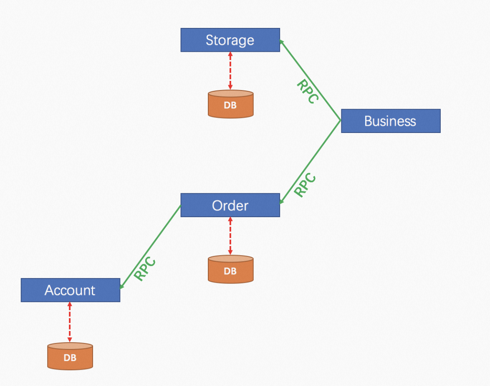
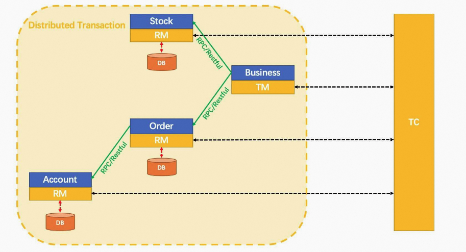
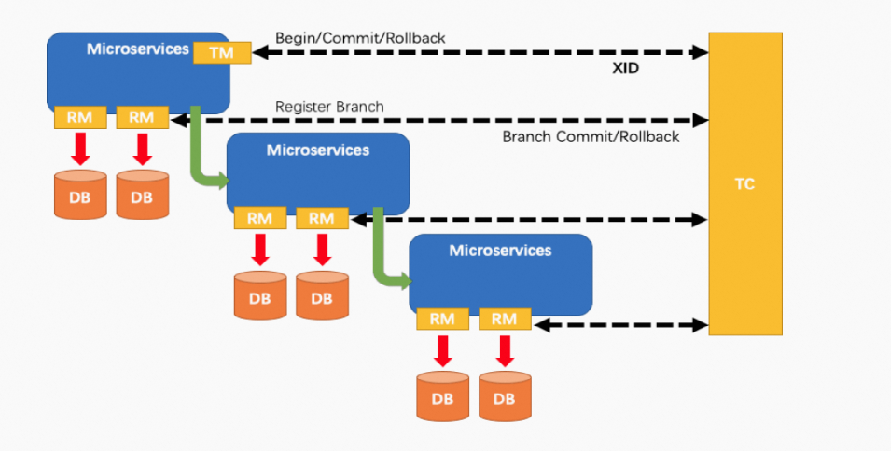
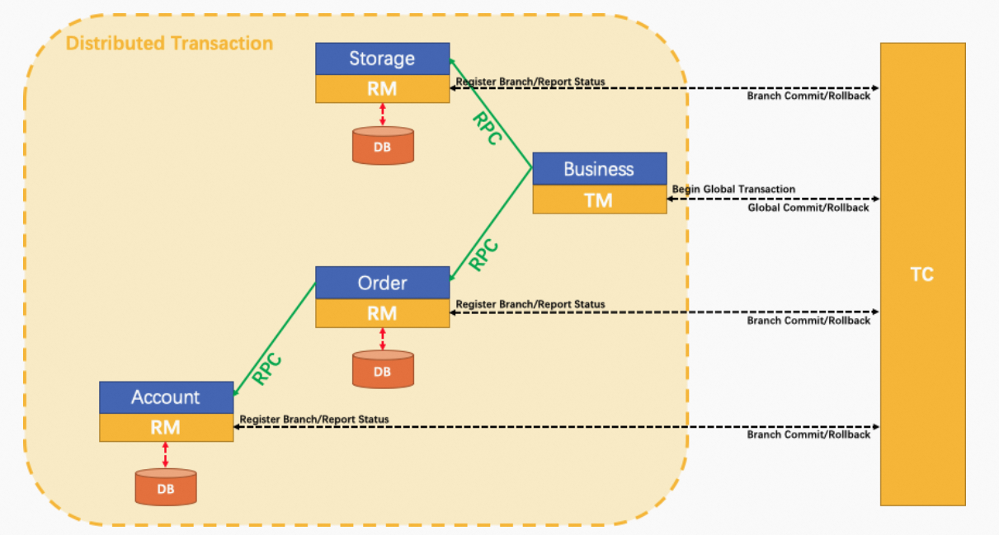

**笔记来源：**[**尚硅谷SpringCloud框架开发教程(SpringCloudAlibaba微服务分布式架构丨Spring Cloud)**](https://www.bilibili.com/video/BV18E411x7eT/?spm_id_from=333.337.search-card.all.click&vd_source=e8046ccbdc793e09a75eb61fe8e84a30)

****

**前言**

单体应用被拆分成微服务应用，原来的三个模块被拆分成三个独立的应用，分别使用三个独立的数据源，

业务操作需要调用三个服务来完成。此时每个服务内部的数据一致性由本地事务来保证，但是全局的数据一致性问题没法保证。

从1：1 -> 1：N -> N：N

用户购买商品的业务逻辑。整个业务逻辑由3个微服务提供支持：

+ 仓储服务：对给定的商品扣除仓储数量。
+ 订单服务：根据采购需求创建订单。
+ 帐户服务：从用户帐户中扣除余额。

架构图

一句话：一次业务操作需要跨多个数据源或需要跨多个系统进行远程调用，就会产生分布式事务问题

# 46. 1 Seata简介
Seata 是什么?

Seata 是一款开源的分布式事务解决方案，致力于提供高性能和简单易用的分布式事务服务。Seata 将为用户提供了 AT、TCC、SAGA 和 XA 事务模式，为用户打造一站式的分布式解决方案。

官网地址：[https://seata.io/zh-cn/docs/overview/what-is-seata.html](https://seata.io/zh-cn/docs/overview/what-is-seata.html)

一个典型的分布式事务过程：分布式事务处理过程的一ID+三组件模型

+ Transaction ID XID
+ 3组件概念
    - Transaction Coordinator (TC)：事务协调器，维护全局事务的运行状态，负责协调并驱动全局事务的提交或回滚；
    - Transaction Manager (TM)：控制全局事务的边界，负责开启一个全局事务，并最终发起全局提交或全局回滚的决议；
    - Resource Manager (RM)：控制分支事务，负责分支注册、状态汇报，并接收事务协调器的指令，驱动分支（本地）事务的提交和回滚

处理过程：

1. TM 向 TC 申请开启一个全局事务，全局事务创建成功并生成一个全局唯一的 XID；
2. XID 在微服务调用链路的上下文中传播；
3. RM 向 TC 注册分支事务，将其纳入 XID 对应全局事务的管辖；
4. TM 向 TC 发起针对 XID 的全局提交或回滚决议；
5. TC 调度 XID 下管辖的全部分支事务完成提交或回滚请求。

  
下载地址：[https://github.com/seata/seata/releases](https://github.com/seata/seata/releases)

怎么玩？

+ 本地@Transactional
+ 全局@GlobalTransactional：我们只需要使用一个 @GlobalTransactional 注解在业务方法上:

SEATA 的分布式交易解决方案

# 2 **Seata-Server安装**
**官网：**[http://seata.io/zh-cn/](http://seata.io/zh-cn/)

