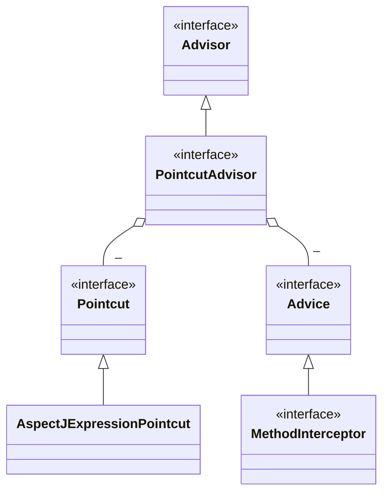
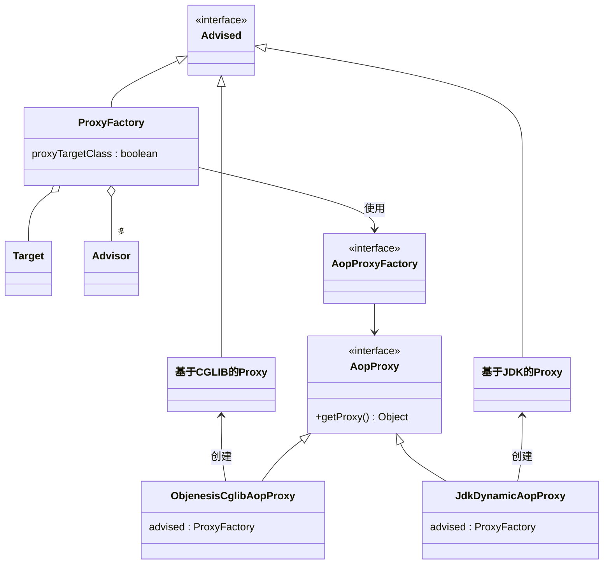
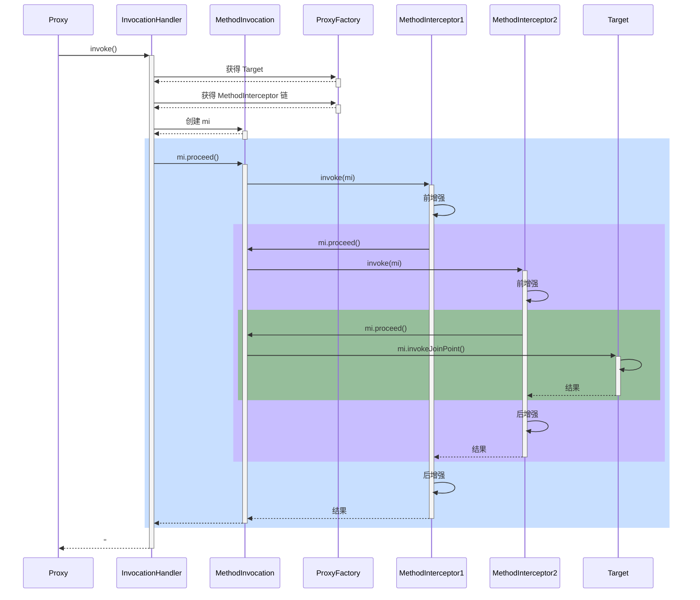

**<font style="color:#DF2A3F;">笔记来源：</font>**[**<font style="color:#DF2A3F;">黑马程序员Spring视频教程，深度讲解spring5底层原理</font>**](https://www.bilibili.com/video/BV1P44y1N7QG/?spm_id_from=333.337.search-card.all.click&vd_source=e8046ccbdc793e09a75eb61fe8e84a30)

**<font style="color:#DF2A3F;"></font>**

AOP 底层实现方式之一是代理，由代理结合通知和目标，提供增强功能

除此以外，aspectj 提供了两种另外的 AOP 底层实现：

+  第一种是通过 ajc 编译器在**编译** class 类文件时，就把通知的增强功能，织入到目标类的字节码中 
+  第二种是通过 agent 在**加载**目标类时，修改目标类的字节码，织入增强功能 
+  作为对比，之前学习的代理是**运行**时生成新的字节码 


简单比较的话：

+ aspectj 在编译和加载时，修改目标字节码，性能较高
+ aspectj 因为不用代理，能突破一些技术上的限制，例如对构造、对静态方法、对 final 也能增强
+ 但 aspectj 侵入性较强，且需要学习新的 aspectj 特有语法，因此没有广泛流行

## 1. AOP 实现之 ajc 编译器


代码参考

```xml
<plugin>
	<groupId>org.codehaus.mojo</groupId>
  aspectj-maven-plugin</artifactId>
  <version>1.14.0</version>
  <configuration>
    <complianceLevel>1.8</complianceLevel>
    <source>8</source>
    <target>8</target>
    <showWeaveInfo>true</showWeaveInfo>
    <verbose>true</verbose>
    <Xlint>ignore</Xlint>
    <encoding>UTF-8</encoding>
  </configuration>
  <executions>
    <execution>
      <goals>
        <!-- use this goal to weave all your main classes -->
        <goal>compile</goal>
        <!-- use this goal to weave all your test classes -->
        <goal>test-compile</goal>
      </goals>
    </execution>
  </executions>
</plugin>
```


```java
package com.itheima;

import com.itheima.service.MyService;
import org.slf4j.Logger;
import org.slf4j.LoggerFactory;
import org.springframework.boot.autoconfigure.SpringBootApplication;

/*
    注意几点
    1. 版本选择了 java 8, 因为目前的 aspectj-maven-plugin 1.14.0 最高只支持到 java 16
    2. 一定要用 maven 的 compile 来编译, idea 不会调用 ajc 编译器
 */
@SpringBootApplication
public class A09 {

    private static final Logger log = LoggerFactory.getLogger(A09.class);

    public static void main(String[] args) {
//        ConfigurableApplicationContext context = SpringApplication.run(A10Application.class, args);
//        MyService service = context.getBean(MyService.class);
//
//        log.debug("service class: {}", service.getClass());
//        service.foo();
//
//        context.close();

        new MyService().foo();

        /*
            学到了什么
            1. aop 的原理并非代理一种, 编译器也能玩出花样
         */
    }
}
```


```java
package com.itheima.aop;

import org.aspectj.lang.annotation.Aspect;
import org.aspectj.lang.annotation.Before;
import org.slf4j.Logger;
import org.slf4j.LoggerFactory;

@Aspect // ⬅️注意此切面并未被 Spring 管理
public class MyAspect {

    private static final Logger log = LoggerFactory.getLogger(MyAspect.class);

    @Before("execution(* com.itheima.service.MyService.foo())")
    public void before() {
        log.debug("before()");
    }
}
```


```java
package com.itheima.service;

import org.slf4j.Logger;
import org.slf4j.LoggerFactory;
import org.springframework.stereotype.Service;

@Service
public class MyService {

    private static final Logger log = LoggerFactory.getLogger(MyService.class);

    public static void foo() {
        log.debug("foo()");
    }
}
```

**<font style="color:#E8323C;">收获</font>**

1. 编译器也能修改 class 实现增强
2. 编译器增强能突破代理仅能通过方法重写增强的限制：可以对构造方法、静态方法等实现增强

> _**注意**_
>
> + 版本选择了 java 8, 因为目前的 aspectj-maven-plugin 1.14.0 最高只支持到 java 16
> + 一定要用 maven 的 compile 来编译, idea 不会调用 ajc 编译器
>

## 2. AOP 实现之 agent 类加载
代码参考

```java
package com.itheima;

import com.itheima.service.MyService;
import org.slf4j.Logger;
import org.slf4j.LoggerFactory;
import org.springframework.boot.SpringApplication;
import org.springframework.boot.autoconfigure.SpringBootApplication;
import org.springframework.context.ConfigurableApplicationContext;

/*
    注意几点
    1. 版本选择了 java 8, 因为目前的 aspectj-maven-plugin 1.14.0 最高只支持到 java 16
    2. 运行时需要在 VM options 里加入 -javaagent:D:/tools/m2/repository/org/aspectj/aspectjweaver/1.9.7/aspectjweaver-1.9.7.jar
       把其中 C:/Users/manyh/.m2/repository 改为你自己 maven 仓库起始地址
 */
@SpringBootApplication
public class A10 {

    private static final Logger log = LoggerFactory.getLogger(A10.class);

    public static void main(String[] args) {
        ConfigurableApplicationContext context = SpringApplication.run(A10.class, args);
        MyService service = context.getBean(MyService.class);

        // ⬇️MyService 并非代理, 但 foo 方法也被增强了, 做增强的 java agent, 在加载类时, 修改了 class 字节码
        log.debug("service class: {}", service.getClass());
        service.foo();

//        context.close();

        /*
            学到了什么
            1. aop 的原理并非代理一种, agent 也能, 只要字节码变了, 行为就变了
         */
    }
}
```


```java
package com.itheima.aop;

import org.aspectj.lang.annotation.Aspect;
import org.aspectj.lang.annotation.Before;
import org.slf4j.Logger;
import org.slf4j.LoggerFactory;

@Aspect // ⬅️注意此切面并未被 Spring 管理
public class MyAspect {

    private static final Logger log = LoggerFactory.getLogger(MyAspect.class);

    @Before("execution(* com.itheima.service.MyService.*())")
    public void before() {
        log.debug("before()");
    }
}
```


```java
package com.itheima.service;

import org.slf4j.Logger;
import org.slf4j.LoggerFactory;
import org.springframework.stereotype.Service;

@Service
public class MyService {

    private static final Logger log = LoggerFactory.getLogger(MyService.class);

    final public void foo() {
        log.debug("foo()");
        this.bar();
    }

    public void bar() {
        log.debug("bar()");
    }
}
```

**<font style="color:#E8323C;">收获</font>**

1. 类加载时可以通过 agent 修改 class 实现增强


## 3. AOP 实现之 proxy
### 3.1 jdk 动态代理
```java
package com.itheima.a11;
import java.io.IOException;
import java.lang.reflect.Proxy;

public class JdkProxyDemo {

    interface Foo {
        void foo();
    }

    static final class Target implements Foo {
        public void foo() {
            System.out.println("target foo");
        }
    }

    // jdk 只能针对接口代理
    // cglib
    public static void main(String[] param) throws IOException {
        // 目标对象
        Target target = new Target();

        ClassLoader loader = JdkProxyDemo.class.getClassLoader(); // 用来加载在运行期间动态生成的字节码
        Foo proxy = (Foo) Proxy.newProxyInstance(loader, new Class[]{Foo.class}, (p, method, args) -> {
            System.out.println("before...");
            // 目标.方法(参数)
            // 方法.invoke(目标, 参数);
            Object result = method.invoke(target, args);
            System.out.println("after....");
            return result; // 让代理也返回目标方法执行的结果
        });

        System.out.println(proxy.getClass());

        proxy.foo();

        System.in.read();
    }
}
```


运行结果

```plain
proxy before...
target foo
proxy after...
```

**<font style="color:#E8323C;">收获</font>**

+ jdk 动态代理要求目标**必须**实现接口，生成的代理类实现相同接口，因此代理与目标之间是平级兄弟关系


### 3.2 cglib 代理
```java
package com.itheima.a11;

import org.springframework.cglib.proxy.Enhancer;
import org.springframework.cglib.proxy.MethodInterceptor;
import org.springframework.cglib.proxy.MethodProxy;

import java.lang.reflect.Method;
import java.util.Arrays;

public class CglibProxyDemo {

    static class Target {
        public void foo() {
            System.out.println("target foo");
        }
    }

    // 代理是子类型, 目标是父类型
    public static void main(String[] param) {
//        Target target = new Target();

        Target proxy = (Target) Enhancer.create(Target.class, (MethodInterceptor) (p, method, args, methodProxy) -> {
            System.out.println("before...");
//            Object result = method.invoke(target, args); // 用方法反射调用目标
            // methodProxy 它可以避免反射调用
//            Object result = methodProxy.invoke(target, args); // 内部没有用反射, 需要目标 （spring）
            Object result = methodProxy.invokeSuper(p, args); // 内部没有用反射, 需要代理
            System.out.println("after...");
            return result;
        });

        proxy.foo();

    }
}
```

运行结果与 jdk 动态代理相同

**<font style="color:#E8323C;">收获</font>**

+ cglib 不要求目标实现接口，它生成的代理类是目标的子类，因此代理与目标之间是子父关系
+ 限制⛔：根据上述分析 final 类无法被 cglib 增强

## 4. jdk动态代理进阶
### 4.1 模拟jdk动态代理
```java
package com.itheima.a12;

import java.lang.reflect.InvocationHandler;
import java.lang.reflect.Method;

public class A12 {

    interface Foo {
        void foo();
        int bar();
    }

    static class Target implements Foo {
        public void foo() {
            System.out.println("target foo");
        }

        @Override
        public int bar() {
            System.out.println("target bar");
            return 100;
        }
    }

    /*interface InvocationHandler {
        Object invoke(Object proxy, Method method, Object[] args) throws Throwable;
    }*/

    public static void main(String[] param) {
        Foo proxy = new $Proxy0(new InvocationHandler() {
            @Override
            public Object invoke(Object proxy, Method method, Object[] args) throws Throwable{
                // 1. 功能增强
                System.out.println("before...");
                // 2. 调用目标
//                new Target().foo();
                return method.invoke(new Target(), args);
            }
        });
        proxy.foo();
        proxy.bar();
        /*
            学到了什么: 代理一点都不难, 无非就是利用了多态、反射的知识
                1. 方法重写可以增强逻辑, 只不过这【增强逻辑】千变万化, 不能写死在代理内部
                2. 通过接口回调将【增强逻辑】置于代理类之外
                3. 配合接口方法反射(也是多态), 就可以再联动调用目标方法
         */
    }
}
```


模拟代理实现

```java
package com.itheima.a12;

//import com.itheima.a13.A13.InvocationHandler;

import java.lang.reflect.InvocationHandler;
import java.lang.reflect.Method;
import java.lang.reflect.Proxy;
import java.lang.reflect.UndeclaredThrowableException;

public class $Proxy0 extends Proxy implements A12.Foo {

    public $Proxy0(InvocationHandler h) {
        super(h);
    }
    @Override
    public void foo() {
        try {
            h.invoke(this, foo, new Object[0]);
        } catch (RuntimeException | Error e) {
            throw e;
        } catch (Throwable e) {
            throw new UndeclaredThrowableException(e);
        }
    }

    @Override
    public int bar() {
        try {
            Object result = h.invoke(this, bar, new Object[0]);
            return (int) result;
        } catch (RuntimeException | Error e) {
            throw e;
        } catch (Throwable e) {
            throw new UndeclaredThrowableException(e);
        }
    }

    static Method foo;
    static Method bar;
    static {
        try {
            foo = A12.Foo.class.getMethod("foo");
            bar = A12.Foo.class.getMethod("bar");
        } catch (NoSuchMethodException e) {
            throw new NoSuchMethodError(e.getMessage());
        }
    }
}
```

**<font style="color:#E8323C;">收获</font>**

代理一点都不难，无非就是利用了多态、反射的知识

1. 方法重写可以增强逻辑，只不过这【增强逻辑】千变万化，不能写死在代理内部
2. 通过接口回调将【增强逻辑】置于代理类之外
3. 配合接口方法反射（是多态调用），就可以再联动调用目标方法
4. 会用 arthas 的 jad 工具反编译代理类
5. 限制⛔：代理增强是借助多态来实现，因此成员变量、静态方法、final 方法均不能通过代理实现


### 4.2 方法反射优化
代码参考

```java
package com.itheima.a12;

import java.lang.reflect.Field;
import java.lang.reflect.Method;

// 运行时请添加 --add-opens java.base/java.lang.reflect=ALL-UNNAMED --add-opens java.base/jdk.internal.reflect=ALL-UNNAMED
public class TestMethodInvoke {
    public static void main(String[] args) throws Exception {
        Method foo = TestMethodInvoke.class.getMethod("foo", int.class);
        for (int i = 1; i <= 17; i++) {
            show(i, foo);
            foo.invoke(null, i);
        }
        System.in.read();
    }

    // 方法反射调用时, 底层 MethodAccessor 的实现类
    private static void show(int i, Method foo) throws Exception {
        Method getMethodAccessor = Method.class.getDeclaredMethod("getMethodAccessor");
        getMethodAccessor.setAccessible(true);
        Object invoke = getMethodAccessor.invoke(foo);
        if (invoke == null) {
            System.out.println(i + ":" + null);
            return;
        }
        Field delegate = Class.forName("jdk.internal.reflect.DelegatingMethodAccessorImpl").getDeclaredField("delegate");
        delegate.setAccessible(true);
        System.out.println(i + ":" + delegate.get(invoke));
    }

    public static void foo(int i) {
        System.out.println(i + ":" + "foo");
    }
}
```

**<font style="color:#E8323C;">收获</font>**

1. 前 16 次反射性能较低
2. 第 17 次调用会生成代理类，优化为非反射调用
3. 会用 arthas 的 jad 工具反编译第 17 次调用生成的代理类


> _**注意**_
>
> 运行时请添加 --add-opens java.base/java.lang.reflect=ALL-UNNAMED --add-opens java.base/jdk.internal.reflect=ALL-UNNAMED
>


## 5. cglib 代理进阶
**<font style="color:#E8323C;">模拟cglib代理</font>**

代码参考

```java
package com.itheima.a13;

import org.springframework.cglib.proxy.MethodInterceptor;
import org.springframework.cglib.proxy.MethodProxy;

import java.lang.reflect.Method;

public class A13 {

    public static void main(String[] args) {
        Proxy proxy = new Proxy();
        Target target = new Target();
        proxy.setMethodInterceptor(new MethodInterceptor() {
            @Override
            public Object intercept(Object p, Method method, Object[] args,
                                    MethodProxy methodProxy) throws Throwable {
                System.out.println("before...");
                return method.invoke(target, args); // 反射调用
                // FastClass
//                return methodProxy.invoke(target, args); // 内部无反射, 结合目标用
//                return methodProxy.invokeSuper(p, args); // 内部无反射, 结合代理用
            }
        });

        proxy.save();
        proxy.save(1);
        proxy.save(2L);
    }
}
```

```java
package com.itheima.a13;

import org.springframework.cglib.proxy.MethodInterceptor;
import org.springframework.cglib.proxy.MethodProxy;

import java.lang.reflect.Method;
import java.lang.reflect.UndeclaredThrowableException;

public class Proxy extends Target {

    private MethodInterceptor methodInterceptor;

    public void setMethodInterceptor(MethodInterceptor methodInterceptor) {
        this.methodInterceptor = methodInterceptor;
    }

    static Method save0;
    static Method save1;
    static Method save2;
    static MethodProxy save0Proxy;
    static MethodProxy save1Proxy;
    static MethodProxy save2Proxy;
    static {
        try {
            save0 = Target.class.getMethod("save");
            save1 = Target.class.getMethod("save", int.class);
            save2 = Target.class.getMethod("save", long.class);
            save0Proxy = MethodProxy.create(Target.class, Proxy.class, "()V", "save", "saveSuper");
            save1Proxy = MethodProxy.create(Target.class, Proxy.class, "(I)V", "save", "saveSuper");
            save2Proxy = MethodProxy.create(Target.class, Proxy.class, "(J)V", "save", "saveSuper");
        } catch (NoSuchMethodException e) {
            throw new NoSuchMethodError(e.getMessage());
        }
    }

    // >>>>>>>>>>>>>>>>>>>>>>>>>>>>>>> 带原始功能的方法
    public void saveSuper() {
        super.save();
    }
    public void saveSuper(int i) {
        super.save(i);
    }
    public void saveSuper(long j) {
        super.save(j);
    }
    // >>>>>>>>>>>>>>>>>>>>>>>>>>>>>>> 带增强功能的方法
    @Override
    public void save() {
        try {
            methodInterceptor.intercept(this, save0, new Object[0], save0Proxy);
        } catch (Throwable e) {
            throw new UndeclaredThrowableException(e);
        }
    }

    @Override
    public void save(int i) {
        try {
            methodInterceptor.intercept(this, save1, new Object[]{i}, save1Proxy);
        } catch (Throwable e) {
            throw new UndeclaredThrowableException(e);
        }
    }

    @Override
    public void save(long j) {
        try {
            methodInterceptor.intercept(this, save2, new Object[]{j}, save2Proxy);
        } catch (Throwable e) {
            throw new UndeclaredThrowableException(e);
        }
    }
}
```


```java
package com.itheima.a13;

public class Target {
    public void save() {
        System.out.println("save()");
    }

    public void save(int i) {
        System.out.println("save(int)");
    }

    public void save(long j) {
        System.out.println("save(long)");
    }
}
```

**<font style="color:#E8323C;">收获</font>**：和 jdk 动态代理原理查不多

1. 回调的接口换了一下，InvocationHandler 改成了 MethodInterceptor
2. 调用目标时有所改进，见下面代码片段 
    1. method.invoke 是反射调用，必须调用到足够次数才会进行优化
    2. methodProxy.invoke 是不反射调用，它会正常（间接）调用目标对象的方法（Spring 采用）
    3. methodProxy.invokeSuper 也是不反射调用，它会正常（间接）调用代理对象的方法，可以省略目标对象


> _**注意**_
>
> + 调用 Object 的方法, 后两种在 jdk >= 9 时都有问题, 需要 --add-opens java.base/java.lang=ALL-UNNAMED
>


## 6. cglib避免反射调用
**<font style="color:#E8323C;">cglib如何避免反射</font>**

代码参考

```java
package com.itheima.a13;

import org.springframework.cglib.core.Signature;

public class ProxyFastClass {
    static Signature s0 = new Signature("saveSuper", "()V");
    static Signature s1 = new Signature("saveSuper", "(I)V");
    static Signature s2 = new Signature("saveSuper", "(J)V");

    // 获取代理方法的编号
    /*
        Proxy
            saveSuper()              0
            saveSuper(int)           1
            saveSuper(long)          2
        signature 包括方法名字、参数返回值
     */
    public int getIndex(Signature signature) {
        if (s0.equals(signature)) {
            return 0;
        } else if (s1.equals(signature)) {
            return 1;
        } else if (s2.equals(signature)) {
            return 2;
        }
        return -1;
    }

    // 根据方法编号, 正常调用目标对象方法
    public Object invoke(int index, Object proxy, Object[] args) {
        if (index == 0) {
            ((Proxy) proxy).saveSuper();
            return null;
        } else if (index == 1) {
            ((Proxy) proxy).saveSuper((int) args[0]);
            return null;
        } else if (index == 2) {
            ((Proxy) proxy).saveSuper((long) args[0]);
            return null;
        } else {
            throw new RuntimeException("无此方法");
        }
    }

    public static void main(String[] args) {
        ProxyFastClass fastClass = new ProxyFastClass();
        int index = fastClass.getIndex(new Signature("saveSuper", "()V"));
        System.out.println(index);

        fastClass.invoke(index, new Proxy(), new Object[0]);
    }
}
```


```java
package com.itheima.a13;

import org.springframework.cglib.core.Signature;

public class TargetFastClass {
    static Signature s0 = new Signature("save", "()V");
    static Signature s1 = new Signature("save", "(I)V");
    static Signature s2 = new Signature("save", "(J)V");

    // 获取目标方法的编号
    /*
        Target
            save()              0
            save(int)           1
            save(long)          2
        signature 包括方法名字、参数返回值
     */
    public int getIndex(Signature signature) {
        if (s0.equals(signature)) {
            return 0;
        } else if (s1.equals(signature)) {
            return 1;
        } else if (s2.equals(signature)) {
            return 2;
        }
        return -1;
    }

    // 根据方法编号, 正常调用目标对象方法
    public Object invoke(int index, Object target, Object[] args) {
        if (index == 0) {
            ((Target) target).save();
            return null;
        } else if (index == 1) {
            ((Target) target).save((int) args[0]);
            return null;
        } else if (index == 2) {
            ((Target) target).save((long) args[0]);
            return null;
        } else {
            throw new RuntimeException("无此方法");
        }
    }

    public static void main(String[] args) {
        TargetFastClass fastClass = new TargetFastClass();
        int index = fastClass.getIndex(new Signature("save", "(I)V"));
        System.out.println(index);
        fastClass.invoke(index, new Target(), new Object[]{100});
    }
}
```


收获


1. 当调用 MethodProxy 的 invoke 或 invokeSuper 方法时, 会动态生成两个类 
    - ProxyFastClass 配合代理对象一起使用, 避免反射
    - TargetFastClass 配合目标对象一起使用, 避免反射 (Spring 用的这种)
2. TargetFastClass 记录了 Target 中方法与编号的对应关系 
    - save(long) 编号 2
    - save(int) 编号 1
    - save() 编号 0
    - 首先根据方法名和参数个数、类型, 用 switch 和 if 找到这些方法编号
    - 然后再根据编号去调用目标方法, 又用了一大堆 switch 和 if, 但避免了反射
3. ProxyFastClass 记录了 Proxy 中方法与编号的对应关系，不过 Proxy 额外提供了下面几个方法 
    - saveSuper(long) 编号 2，不增强，仅是调用 super.save(long)
    - saveSuper(int) 编号 1，不增强, 仅是调用 super.save(int)
    - saveSuper() 编号 0，不增强, 仅是调用 super.save()
    - 查找方式与 TargetFastClass 类似
4. 为什么有这么麻烦的一套东西呢？ 
    - 避免反射, 提高性能, 代价是一个代理类配两个 FastClass 类, 代理类中还得增加仅调用 super 的一堆方法
    - 用编号处理方法对应关系比较省内存, 另外, 最初获得方法顺序是不确定的, 这个过程没法固定死


## 7. jdk和cglib在Spring中的统一
Spring 中对切点、通知、切面的抽象如下

+ 切点：接口 Pointcut，典型实现 AspectJExpressionPointcut
+ 通知：典型接口为 MethodInterceptor 代表环绕通知
+ 切面：Advisor，包含一个 Advice 通知，PointcutAdvisor 包含一个 Advice 通知和一个 Pointcut




代理相关类图

+ AopProxyFactory 根据 proxyTargetClass 等设置选择 AopProxy 实现
+ AopProxy 通过 getProxy 创建代理对象
+ 图中 Proxy 都实现了 Advised 接口，能够获得关联的切面集合与目标（其实是从 ProxyFactory 取得）
+ 调用代理方法时，会借助 ProxyFactory 将通知统一转为环绕通知：MethodInterceptor





**<font style="color:#E8323C;">底层切点、通知、切面</font>**

```java
package com.itheima.a15;

import org.aopalliance.intercept.MethodInterceptor;
import org.aopalliance.intercept.MethodInvocation;
import org.springframework.aop.aspectj.AspectJExpressionPointcut;
import org.springframework.aop.framework.ProxyFactory;
import org.springframework.aop.support.DefaultPointcutAdvisor;

public class A15 {
    public static void main(String[] args) {
        /*
            两个切面概念
            aspect =
                通知1(advice) +  切点1(pointcut)
                通知2(advice) +  切点2(pointcut)
                通知3(advice) +  切点3(pointcut)
                ...
            advisor = 更细粒度的切面，包含一个通知和切点
         */

        // 1. 备好切点
        AspectJExpressionPointcut pointcut = new AspectJExpressionPointcut();
        pointcut.setExpression("execution(* foo())");
        // 2. 备好通知
        MethodInterceptor advice = invocation -> {
            System.out.println("before...");
            Object result = invocation.proceed(); // 调用目标
            System.out.println("after...");
            return result;
        };
        // 3. 备好切面
        DefaultPointcutAdvisor advisor = new DefaultPointcutAdvisor(pointcut, advice);

        /*
           4. 创建代理
                a. proxyTargetClass = false, 目标实现了接口, 用 jdk 实现
                b. proxyTargetClass = false,  目标没有实现接口, 用 cglib 实现
                c. proxyTargetClass = true, 总是使用 cglib 实现
         */
        Target2 target = new Target2();
        ProxyFactory factory = new ProxyFactory();
        factory.setTarget(target);
        factory.addAdvisor(advisor);
        factory.setInterfaces(target.getClass().getInterfaces());
        factory.setProxyTargetClass(false);
        Target2 proxy = (Target2) factory.getProxy();
        System.out.println(proxy.getClass());
        proxy.foo();
        proxy.bar();
        /*
            学到了什么
                a. Spring 的代理选择规则
                b. 底层的切点实现
                c. 底层的通知实现
                d. ProxyFactory 是用来创建代理的核心实现, 用 AopProxyFactory 选择具体代理实现
                    - JdkDynamicAopProxy
                    - ObjenesisCglibAopProxy
         */
    }

    interface I1 {
        void foo();

        void bar();
    }

    static class Target1 implements I1 {
        public void foo() {
            System.out.println("target1 foo");
        }

        public void bar() {
            System.out.println("target1 bar");
        }
    }

    static class Target2 {
        public void foo() {
            System.out.println("target2 foo");
        }

        public void bar() {
            System.out.println("target2 bar");
        }
    }
}
```


```java
package com.itheima.a15;

import org.aspectj.lang.ProceedingJoinPoint;
import org.aspectj.lang.annotation.Around;
import org.aspectj.lang.annotation.Aspect;
import org.springframework.aop.aspectj.annotation.AnnotationAwareAspectJAutoProxyCreator;
import org.springframework.context.annotation.Bean;
import org.springframework.context.annotation.ConfigurationClassPostProcessor;
import org.springframework.context.annotation.Scope;
import org.springframework.context.annotation.ScopedProxyMode;
import org.springframework.context.support.GenericApplicationContext;

// 代理能否重复被代理
public class A15_1 {
    public static void main(String[] args) {
        GenericApplicationContext context = new GenericApplicationContext();
        context.registerBean("myConfig", MyConfig.class);
        context.registerBean(ConfigurationClassPostProcessor.class);
        context.registerBean("aspect1", Aspect1.class);
        context.registerBean(AnnotationAwareAspectJAutoProxyCreator.class);
        context.refresh();

        Bean1 bean1 = context.getBean(Bean1.class);
        bean1.foo();
        System.out.println(bean1.getClass());
        // 此代理是为了解决功能增强问题
        System.out.println(context.getBean("scopedTarget.bean1").getClass());
    }

    static class MyConfig {
        // 此代理是为了解决单例注入多例问题
        @Bean
        @Scope(proxyMode = ScopedProxyMode.TARGET_CLASS)
        public Bean1 bean1() {
            return new Bean1();
        }
    }

    static class Bean1 {
        public void foo() {
            System.out.println("bean1 foo");
        }
    }

    @Aspect
    static class Aspect1 {
        @Around("execution(* foo())")
        public Object before(ProceedingJoinPoint pjp) throws Throwable {
            System.out.println("aspect1 around");
            return pjp.proceed();
        }
    }
}
```


```java
package com.itheima.a15;

import org.aspectj.lang.annotation.Aspect;
import org.aspectj.lang.annotation.Before;
import org.springframework.aop.aspectj.annotation.AnnotationAwareAspectJAutoProxyCreator;
import org.springframework.aop.framework.autoproxy.AbstractAdvisorAutoProxyCreator;
import org.springframework.beans.factory.support.BeanDefinitionBuilder;
import org.springframework.beans.factory.support.DefaultListableBeanFactory;

import java.lang.reflect.Method;
import java.util.List;

public class A15_2 {

    public static void main(String[] args) throws Exception{
        DefaultListableBeanFactory beanFactory = new DefaultListableBeanFactory();
        beanFactory.registerBeanDefinition("aaa", BeanDefinitionBuilder.genericBeanDefinition(Aspect2.class).getBeanDefinition());
        beanFactory.registerBeanDefinition("aspect1", BeanDefinitionBuilder.genericBeanDefinition(Aspect1.class).getBeanDefinition());
        AnnotationAwareAspectJAutoProxyCreator creator = new AnnotationAwareAspectJAutoProxyCreator();
        creator.setBeanFactory(beanFactory);
        Method findEligibleAdvisors = AbstractAdvisorAutoProxyCreator.class.getDeclaredMethod("findEligibleAdvisors", Class.class, String.class);
        findEligibleAdvisors.setAccessible(true);
        List obj = (List) findEligibleAdvisors.invoke(creator, Bean1.class, "bean1");
        for (Object o : obj) {
            System.out.println(o);
        }

//        Field default_precedence_comparator = AspectJAwareAdvisorAutoProxyCreator.class.getDeclaredField("DEFAULT_PRECEDENCE_COMPARATOR");
//        Comparator<Advisor> comparator = (Comparator<Advisor>) default_precedence_comparator.get(creator);
    }

    static class Bean1 {
        public void foo() {

        }
    }

    @Aspect
    static class Aspect1 {
        @Before("execution(* foo())")
        public void before1(){

        }
    }

    @Aspect
    static class Aspect2 {
        @Before("execution(* foo())")
        public void before2(){

        }
    }
}
```

**<font style="color:#E8323C;">收获</font>**

1. 底层的切点实现
2. 底层的通知实现
3. 底层的切面实现
4. ProxyFactory 用来创建代理 
    - 如果指定了接口，且 proxyTargetClass = false，使用 JdkDynamicAopProxy
    - 如果没有指定接口，或者 proxyTargetClass = true，使用 ObjenesisCglibAopProxy 
        * 例外：如果目标是接口类型或已经是 Jdk 代理，使用 JdkDynamicAopProxy

> _**注意**_
>
> + 要区分本章节提到的 MethodInterceptor，它与之前 cglib 中用的的 MethodInterceptor 是不同的接口
>


## 8. 切点匹配
**<font style="color:#E8323C;">切点匹配</font>**

代码参考

```java
package com.itheima.a16;

import org.springframework.aop.aspectj.AspectJExpressionPointcut;
import org.springframework.aop.support.StaticMethodMatcherPointcut;
import org.springframework.core.annotation.MergedAnnotations;
import org.springframework.transaction.annotation.Transactional;

import java.lang.reflect.Method;

public class A16 {
    public static void main(String[] args) throws NoSuchMethodException {
//        AspectJExpressionPointcut pt1 = new AspectJExpressionPointcut();
//        pt1.setExpression("execution(* bar())");
//        System.out.println(pt1.matches(T1.class.getMethod("foo"), T1.class));
//        System.out.println(pt1.matches(T1.class.getMethod("bar"), T1.class));
//
//        AspectJExpressionPointcut pt2 = new AspectJExpressionPointcut();
//        pt2.setExpression("@annotation(org.springframework.transaction.annotation.Transactional)");
//        System.out.println(pt2.matches(T1.class.getMethod("foo"), T1.class));
//        System.out.println(pt2.matches(T1.class.getMethod("bar"), T1.class));

        StaticMethodMatcherPointcut pt3 = new StaticMethodMatcherPointcut() {
            @Override
            public boolean matches(Method method, Class<?> targetClass) {
                // 检查方法上是否加了 Transactional 注解
                MergedAnnotations annotations = MergedAnnotations.from(method);
                if (annotations.isPresent(Transactional.class)) {
                    return true;
                }
                // 查看类上是否加了 Transactional 注解
                annotations = MergedAnnotations.from(targetClass, MergedAnnotations.SearchStrategy.TYPE_HIERARCHY);
                if (annotations.isPresent(Transactional.class)) {
                    return true;
                }
                return false;
            }
        };

        System.out.println(pt3.matches(T1.class.getMethod("foo"), T1.class));
        System.out.println(pt3.matches(T1.class.getMethod("bar"), T1.class));
        System.out.println(pt3.matches(T2.class.getMethod("foo"), T2.class));
        System.out.println(pt3.matches(T3.class.getMethod("foo"), T3.class));

        /*
            学到了什么
                a. 底层切点实现是如何匹配的: 调用了 aspectj 的匹配方法
                b. 比较关键的是它实现了 MethodMatcher 接口, 用来执行方法的匹配
         */
    }


    static class T1 {
        @Transactional
        public void foo() {
        }
        public void bar() {
        }
    }

    @Transactional
    static class T2 {
        public void foo() {
        }
    }

    @Transactional
    interface I3 {
        void foo();
    }
    static class T3 implements I3 {
        public void foo() {
        }
    }
}
```

**<font style="color:#E8323C;">收获</font>**

1. 常见 aspectj 切点用法
2. aspectj 切点的局限性，实际的 [@Transactional ](/Transactional ) 切点实现 


## 9. 从@Aspect到Advisor
### 9.1 代理创建器
代码参考

```java
package org.springframework.aop.framework.autoproxy;

import org.aspectj.lang.annotation.Aspect;
import org.aspectj.lang.annotation.Before;
import org.springframework.aop.Advisor;
import org.springframework.aop.aspectj.annotation.AnnotationAwareAspectJAutoProxyCreator;
import org.springframework.context.annotation.Configuration;
import org.springframework.context.annotation.ConfigurationClassPostProcessor;
import org.springframework.context.support.GenericApplicationContext;
import org.springframework.core.annotation.Order;

import java.util.List;

public class A17 {
    public static void main(String[] args) {
        GenericApplicationContext context = new GenericApplicationContext();
        context.registerBean("aspect1", Aspect1.class);
        context.registerBean("config", Config.class);
        context.registerBean(ConfigurationClassPostProcessor.class);
        context.registerBean(AnnotationAwareAspectJAutoProxyCreator.class);
        // BeanPostProcessor
        // 创建 -> (*) 依赖注入 -> 初始化 (*)

        context.refresh();
//        for (String name : context.getBeanDefinitionNames()) {
//            System.out.println(name);
//        }

        /*
            第一个重要方法 findEligibleAdvisors 找到有【资格】的 Advisors
                a. 有【资格】的 Advisor 一部分是低级的, 可以由自己编写, 如下例中的 advisor3
                b. 有【资格】的 Advisor 另一部分是高级的, 由本章的主角解析 @Aspect 后获得
         */
        AnnotationAwareAspectJAutoProxyCreator creator = context.getBean(AnnotationAwareAspectJAutoProxyCreator.class);
        List<Advisor> advisors = creator.findEligibleAdvisors(Target2.class, "target2");
        /*for (Advisor advisor : advisors) {
            System.out.println(advisor);
        }*/

        /*
            第二个重要方法 wrapIfNecessary
                a. 它内部调用 findEligibleAdvisors, 只要返回集合不空, 则表示需要创建代理
         */
        Object o1 = creator.wrapIfNecessary(new Target1(), "target1", "target1");
        System.out.println(o1.getClass());
        Object o2 = creator.wrapIfNecessary(new Target2(), "target2", "target2");
        System.out.println(o2.getClass());

        ((Target1) o1).foo();
        /*
            学到了什么
                a. 自动代理后处理器 AnnotationAwareAspectJAutoProxyCreator 会帮我们创建代理
                b. 通常代理创建的活在原始对象初始化后执行, 但碰到循环依赖会提前至依赖注入之前执行
                c. 高级的 @Aspect 切面会转换为低级的 Advisor 切面, 理解原理, 大道至简
         */
    }

    static class Target1 {
        public void foo() {
            System.out.println("target1 foo");
        }
    }

    static class Target2 {
        public void bar() {
            System.out.println("target2 bar");
        }
    }

    @Aspect // 高级切面类
    @Order(1)
    static class Aspect1 {
        @Before("execution(* foo())")
        public void before1() {
            System.out.println("aspect1 before1...");
        }

        @Before("execution(* foo())")
        public void before2() {
            System.out.println("aspect1 before2...");
        }
    }

    @Configuration
    static class Config {
        /*@Bean // 低级切面
        public Advisor advisor3(MethodInterceptor advice3) {
            AspectJExpressionPointcut pointcut = new AspectJExpressionPointcut();
            pointcut.setExpression("execution(* foo())");
            DefaultPointcutAdvisor advisor = new DefaultPointcutAdvisor(pointcut, advice3);
            return advisor;
        }
        @Bean
        public MethodInterceptor advice3() {
            return invocation -> {
                System.out.println("advice3 before...");
                Object result = invocation.proceed();
                System.out.println("advice3 after...");
                return result;
            };
        }*/
    }

}
```

**<font style="color:#E8323C;">收获</font>**

1. AnnotationAwareAspectJAutoProxyCreator 的作用 
    - 将高级 [@Aspect ](/Aspect ) 切面统一为低级 Advisor 切面 
    - 在合适的时机创建代理
2. findEligibleAdvisors 找到有【资格】的 Advisors 
    - 有【资格】的 Advisor 一部分是低级的, 可以由自己编写, 如本例 A17 中的 advisor3
    - 有【资格】的 Advisor 另一部分是高级的, 由解析 [@Aspect ](/Aspect ) 后获得 
3. wrapIfNecessary 
    - 它内部调用 findEligibleAdvisors, 只要返回集合不空, 则表示需要创建代理
    - 它的调用时机通常在原始对象初始化后执行, 但碰到循环依赖会提前至依赖注入之前执行


### 9.2 代理创建时机
代码参考

```java
package org.springframework.aop.framework.autoproxy;

import org.aopalliance.intercept.MethodInterceptor;
import org.aopalliance.intercept.MethodInvocation;
import org.springframework.aop.Advisor;
import org.springframework.aop.aspectj.AspectJExpressionPointcut;
import org.springframework.aop.aspectj.annotation.AnnotationAwareAspectJAutoProxyCreator;
import org.springframework.aop.support.DefaultPointcutAdvisor;
import org.springframework.beans.factory.annotation.Autowired;
import org.springframework.beans.factory.annotation.AutowiredAnnotationBeanPostProcessor;
import org.springframework.context.annotation.Bean;
import org.springframework.context.annotation.CommonAnnotationBeanPostProcessor;
import org.springframework.context.annotation.Configuration;
import org.springframework.context.annotation.ConfigurationClassPostProcessor;
import org.springframework.context.support.GenericApplicationContext;

import javax.annotation.PostConstruct;

public class A17_1 {

    public static void main(String[] args) {
        GenericApplicationContext context = new GenericApplicationContext();
        context.registerBean(ConfigurationClassPostProcessor.class);
        context.registerBean(Config.class);
        context.refresh();
        context.close();
        // 创建 -> (*) 依赖注入 -> 初始化 (*)
        /*
            学到了什么
                a. 代理的创建时机
                    1. 初始化之后 (无循环依赖时)
                    2. 实例创建后, 依赖注入前 (有循环依赖时), 并暂存于二级缓存
                b. 依赖注入与初始化不应该被增强, 仍应被施加于原始对象
         */
    }

    @Configuration
    static class Config {
        @Bean // 解析 @Aspect、产生代理
        public AnnotationAwareAspectJAutoProxyCreator annotationAwareAspectJAutoProxyCreator() {
            return new AnnotationAwareAspectJAutoProxyCreator();
        }

        @Bean // 解析 @Autowired
        public AutowiredAnnotationBeanPostProcessor autowiredAnnotationBeanPostProcessor() {
            return new AutowiredAnnotationBeanPostProcessor();
        }

        @Bean // 解析 @PostConstruct
        public CommonAnnotationBeanPostProcessor commonAnnotationBeanPostProcessor() {
            return new CommonAnnotationBeanPostProcessor();
        }

        @Bean
        public Advisor advisor(MethodInterceptor advice) {
            AspectJExpressionPointcut pointcut = new AspectJExpressionPointcut();
            pointcut.setExpression("execution(* foo())");
            return new DefaultPointcutAdvisor(pointcut, advice);
        }

        @Bean
        public MethodInterceptor advice() {
            return (MethodInvocation invocation) -> {
                System.out.println("before...");
                return invocation.proceed();
            };
        }

        @Bean
        public Bean1 bean1() {
            return new Bean1();
        }

        @Bean
        public Bean2 bean2() {
            return new Bean2();
        }
    }

    static class Bean1 {
        public void foo() {

        }
        public Bean1() {
            System.out.println("Bean1()");
        }
        @Autowired public void setBean2(Bean2 bean2) {
            System.out.println("Bean1 setBean2(bean2) class is: " + bean2.getClass());
        }
        @PostConstruct public void init() {
            System.out.println("Bean1 init()");
        }
    }

    static class Bean2 {
        public Bean2() {
            System.out.println("Bean2()");
        }
        @Autowired public void setBean1(Bean1 bean1) {
            System.out.println("Bean2 setBean1(bean1) class is: " + bean1.getClass());
        }
        @PostConstruct public void init() {
            System.out.println("Bean2 init()");
        }
    }
}
```

**<font style="color:#E8323C;">收获</font>**

1. 代理的创建时机 
    - 初始化之后 (无循环依赖时)
    - 实例创建后, 依赖注入前 (有循环依赖时), 并暂存于二级缓存
2. 依赖注入与初始化不应该被增强, 仍应被施加于原始对象


### 9.3 @Before对应的低级通知
代码参考

```java
package org.springframework.aop.framework.autoproxy;

import org.aspectj.lang.ProceedingJoinPoint;
import org.aspectj.lang.annotation.Before;
import org.springframework.aop.Advisor;
import org.springframework.aop.aspectj.AspectInstanceFactory;
import org.springframework.aop.aspectj.AspectJExpressionPointcut;
import org.springframework.aop.aspectj.AspectJMethodBeforeAdvice;
import org.springframework.aop.aspectj.SingletonAspectInstanceFactory;
import org.springframework.aop.interceptor.ExposeInvocationInterceptor;
import org.springframework.aop.support.DefaultPointcutAdvisor;

import java.lang.reflect.Method;
import java.util.ArrayList;
import java.util.List;

public class A17_2 {

    static class Aspect {
        @Before("execution(* foo())")
        public void before1() {
            System.out.println("before1");
        }

        @Before("execution(* foo())")
        public void before2() {
            System.out.println("before2");
        }

        public void after() {
            System.out.println("after");
        }

        public void afterReturning() {
            System.out.println("afterReturning");
        }

        public void afterThrowing() {
            System.out.println("afterThrowing");
        }

        public Object around(ProceedingJoinPoint pjp) throws Throwable {
            try {
                System.out.println("around...before");
                return pjp.proceed();
            } finally {
                System.out.println("around...after");
            }
        }
    }

    static class Target {
        public void foo() {
            System.out.println("target foo");
        }
    }

    @SuppressWarnings("all")
    public static void main(String[] args) throws Throwable {

        AspectInstanceFactory factory = new SingletonAspectInstanceFactory(new Aspect());
        // 高级切面转低级切面类
        List<Advisor> list = new ArrayList<>();
        for (Method method : Aspect.class.getDeclaredMethods()) {
            if (method.isAnnotationPresent(Before.class)) {
                // 解析切点
                String expression = method.getAnnotation(Before.class).value();
                AspectJExpressionPointcut pointcut = new AspectJExpressionPointcut();
                pointcut.setExpression(expression);
                // 通知类
                AspectJMethodBeforeAdvice advice = new AspectJMethodBeforeAdvice(method, pointcut, factory);
                // 切面
                Advisor advisor = new DefaultPointcutAdvisor(pointcut, advice);
                list.add(advisor);
            }
        }
        for (Advisor advisor : list) {
            System.out.println(advisor);
        }
        /*
            @Before 前置通知会被转换为下面原始的 AspectJMethodBeforeAdvice 形式, 该对象包含了如下信息
                a. 通知代码从哪儿来
                b. 切点是什么(这里为啥要切点, 后面解释)
                c. 通知对象如何创建, 本例共用同一个 Aspect 对象
            类似的通知还有
                1. AspectJAroundAdvice (环绕通知)
                2. AspectJAfterReturningAdvice
                3. AspectJAfterThrowingAdvice
                4. AspectJAfterAdvice (环绕通知)
         */

    }
}
```

**<font style="color:#E8323C;">收获</font>**

1. [@Before ](/Before ) 前置通知会被转换为原始的 AspectJMethodBeforeAdvice 形式, 该对象包含了如下信息  
    1. 通知代码从哪儿来
    2. 切点是什么(这里为啥要切点, 后面解释)
    3. 通知对象如何创建, 本例共用同一个 Aspect 对象
2. 类似的还有 
    1. AspectJAroundAdvice (环绕通知)
    2. AspectJAfterReturningAdvice
    3. AspectJAfterThrowingAdvice (环绕通知)
    4. AspectJAfterAdvice (环绕通知)


## 10. 静态通知调用
代理对象调用流程如下（以 JDK 动态代理实现为例）

+ 从 ProxyFactory 获得 Target 和环绕通知链，根据他俩创建 MethodInvocation，简称 mi
+ 首次执行 mi.proceed() 发现有下一个环绕通知，调用它的 invoke(mi)
+ 进入环绕通知1，执行前增强，再次调用 mi.proceed() 发现有下一个环绕通知，调用它的 invoke(mi)
+ 进入环绕通知2，执行前增强，调用 mi.proceed() 发现没有环绕通知，调用 mi.invokeJoinPoint() 执行目标方法
+ 目标方法执行结束，将结果返回给环绕通知2，执行环绕通知2 的后增强
+ 环绕通知2继续将结果返回给环绕通知1，执行环绕通知1 的后增强
+ 环绕通知1返回最终的结果


图中不同颜色对应一次环绕通知或目标的调用起始至终结




### 10.1 通知调用过程
代码参考

```java
package org.springframework.aop.framework;

import org.aopalliance.intercept.MethodInvocation;
import org.aspectj.lang.ProceedingJoinPoint;
import org.aspectj.lang.annotation.AfterReturning;
import org.aspectj.lang.annotation.AfterThrowing;
import org.aspectj.lang.annotation.Around;
import org.aspectj.lang.annotation.Before;
import org.springframework.aop.Advisor;
import org.springframework.aop.aspectj.*;
import org.springframework.aop.interceptor.ExposeInvocationInterceptor;
import org.springframework.aop.support.DefaultPointcutAdvisor;

import java.lang.reflect.Method;
import java.util.ArrayList;
import java.util.List;

public class A18 {

    static class Aspect {
        @Before("execution(* foo())")
        public void before1() {
            System.out.println("before1");
        }

        @Before("execution(* foo())")
        public void before2() {
            System.out.println("before2");
        }

        public void after() {
            System.out.println("after");
        }

        @AfterReturning("execution(* foo())")
        public void afterReturning() {
            System.out.println("afterReturning");
        }

        @AfterThrowing("execution(* foo())")
        public void afterThrowing(Exception e) {
            System.out.println("afterThrowing " + e.getMessage());
        }

        @Around("execution(* foo())")
        public Object around(ProceedingJoinPoint pjp) throws Throwable {
            try {
                System.out.println("around...before");
                return pjp.proceed();
            } finally {
                System.out.println("around...after");
            }
        }
    }

    static class Target {
        public void foo() {
            System.out.println("target foo");
        }
    }

    @SuppressWarnings("all")
    public static void main(String[] args) throws Throwable {

        AspectInstanceFactory factory = new SingletonAspectInstanceFactory(new Aspect());
        // 1. 高级切面转低级切面类
        List<Advisor> list = new ArrayList<>();
        for (Method method : Aspect.class.getDeclaredMethods()) {
            if (method.isAnnotationPresent(Before.class)) {
                // 解析切点
                String expression = method.getAnnotation(Before.class).value();
                AspectJExpressionPointcut pointcut = new AspectJExpressionPointcut();
                pointcut.setExpression(expression);
                // 通知类
                AspectJMethodBeforeAdvice advice = new AspectJMethodBeforeAdvice(method, pointcut, factory);
                // 切面
                Advisor advisor = new DefaultPointcutAdvisor(pointcut, advice);
                list.add(advisor);
            } else if (method.isAnnotationPresent(AfterReturning.class)) {
                // 解析切点
                String expression = method.getAnnotation(AfterReturning.class).value();
                AspectJExpressionPointcut pointcut = new AspectJExpressionPointcut();
                pointcut.setExpression(expression);
                // 通知类
                AspectJAfterReturningAdvice advice = new AspectJAfterReturningAdvice(method, pointcut, factory);
                // 切面
                Advisor advisor = new DefaultPointcutAdvisor(pointcut, advice);
                list.add(advisor);
            } else if (method.isAnnotationPresent(Around.class)) {
                // 解析切点
                String expression = method.getAnnotation(Around.class).value();
                AspectJExpressionPointcut pointcut = new AspectJExpressionPointcut();
                pointcut.setExpression(expression);
                // 通知类
                AspectJAroundAdvice advice = new AspectJAroundAdvice(method, pointcut, factory);
                // 切面
                Advisor advisor = new DefaultPointcutAdvisor(pointcut, advice);
                list.add(advisor);
            }
        }
        for (Advisor advisor : list) {
            System.out.println(advisor);
        }

        /*
            @Before 前置通知会被转换为下面原始的 AspectJMethodBeforeAdvice 形式, 该对象包含了如下信息
                a. 通知代码从哪儿来
                b. 切点是什么
                c. 通知对象如何创建, 本例共用同一个 Aspect 对象
            类似的通知还有
                1. AspectJAroundAdvice (环绕通知)
                2. AspectJAfterReturningAdvice
                3. AspectJAfterThrowingAdvice (环绕通知)
                4. AspectJAfterAdvice (环绕通知)
         */

        // 2. 通知统一转换为环绕通知 MethodInterceptor
        /*

            其实无论 ProxyFactory 基于哪种方式创建代理, 最后干活(调用 advice)的是一个 MethodInvocation 对象
                a. 因为 advisor 有多个, 且一个套一个调用, 因此需要一个调用链对象, 即 MethodInvocation
                b. MethodInvocation 要知道 advice 有哪些, 还要知道目标, 调用次序如下

                将 MethodInvocation 放入当前线程
                    |-> before1 ----------------------------------- 从当前线程获取 MethodInvocation
                    |                                             |
                    |   |-> before2 --------------------          | 从当前线程获取 MethodInvocation
                    |   |                              |          |
                    |   |   |-> target ------ 目标   advice2    advice1
                    |   |                              |          |
                    |   |-> after2 ---------------------          |
                    |                                             |
                    |-> after1 ------------------------------------
                c. 从上图看出, 环绕通知才适合作为 advice, 因此其他 before、afterReturning 都会被转换成环绕通知
                d. 统一转换为环绕通知, 体现的是设计模式中的适配器模式
                    - 对外是为了方便使用要区分 before、afterReturning
                    - 对内统一都是环绕通知, 统一用 MethodInterceptor 表示

            此步获取所有执行时需要的 advice (静态)
                a. 即统一转换为 MethodInterceptor 环绕通知, 这体现在方法名中的 Interceptors 上
                b. 适配如下
                  - MethodBeforeAdviceAdapter 将 @Before AspectJMethodBeforeAdvice 适配为 MethodBeforeAdviceInterceptor
                  - AfterReturningAdviceAdapter 将 @AfterReturning AspectJAfterReturningAdvice 适配为 AfterReturningAdviceInterceptor
         */
        Target target = new Target();
        ProxyFactory proxyFactory = new ProxyFactory();
        proxyFactory.setTarget(target);
        proxyFactory.addAdvice(ExposeInvocationInterceptor.INSTANCE); // 准备把 MethodInvocation 放入当前线程
        proxyFactory.addAdvisors(list);

        System.out.println(">>>>>>>>>>>>>>>>>>>>>>>>>>>>>>");
        List<Object> methodInterceptorList = proxyFactory.getInterceptorsAndDynamicInterceptionAdvice(Target.class.getMethod("foo"), Target.class);
        for (Object o : methodInterceptorList) {
            System.out.println(o);
        }

        System.out.println(">>>>>>>>>>>>>>>>>>>>>>>>>>>>>>");
        // 3. 创建并执行调用链 (环绕通知s + 目标)
        MethodInvocation methodInvocation = new ReflectiveMethodInvocation(
                null, target, Target.class.getMethod("foo"), new Object[0], Target.class, methodInterceptorList
        );
        methodInvocation.proceed();


        /*
            学到了什么
                a. 无参数绑定的通知如何被调用
                b. MethodInvocation 编程技巧: 拦截器、过滤器等等实现都与此类似
                c. 适配器模式在 Spring 中的体现
         */

    }
}
```


**<font style="color:#E8323C;">收获</font>**：代理方法执行时会做如下工作

1. 通过 proxyFactory 的 getInterceptorsAndDynamicInterceptionAdvice() 将其他通知统一转换为 MethodInterceptor 环绕通知 
    - MethodBeforeAdviceAdapter 将 [@Before ](/Before ) AspectJMethodBeforeAdvice 适配为 MethodBeforeAdviceInterceptor 
    - AfterReturningAdviceAdapter 将 [@AfterReturning ](/AfterReturning ) AspectJAfterReturningAdvice 适配为 AfterReturningAdviceInterceptor 
    - 这体现的是适配器设计模式
2. 所谓静态通知，体现在上面方法的 Interceptors 部分，这些通知调用时无需再次检查切点，直接调用即可
3. 结合目标与环绕通知链，创建 MethodInvocation 对象，通过它完成整个调用


### 10.2 模拟MethodInvocation


代码参考

```java
package org.springframework.aop.framework;

import org.aopalliance.intercept.MethodInterceptor;
import org.aopalliance.intercept.MethodInvocation;

import java.lang.reflect.AccessibleObject;
import java.lang.reflect.Method;
import java.util.List;

/*
    模拟调用链过程, 是一个简单的递归过程
        1. proceed() 方法调用链中下一个环绕通知
        2. 每个环绕通知内部继续调用 proceed()
        3. 调用到没有更多通知了, 就调用目标方法
 */
public class A18_1 {

    static class Target {
        public void foo() {
            System.out.println("Target.foo()");
        }
    }

    static class Advice1 implements MethodInterceptor {
        public Object invoke(MethodInvocation invocation) throws Throwable {
            System.out.println("Advice1.before()");
            Object result = invocation.proceed();// 调用下一个通知或目标
            System.out.println("Advice1.after()");
            return result;
        }
    }

    static class Advice2 implements MethodInterceptor {
        public Object invoke(MethodInvocation invocation) throws Throwable {
            System.out.println("Advice2.before()");
            Object result = invocation.proceed();// 调用下一个通知或目标
            System.out.println("Advice2.after()");
            return result;
        }
    }


    static class MyInvocation implements MethodInvocation {
        private Object target;  // 1
        private Method method;
        private Object[] args;
        List<MethodInterceptor> methodInterceptorList; // 2
        private int count = 1; // 调用次数

        public MyInvocation(Object target, Method method, Object[] args, List<MethodInterceptor> methodInterceptorList) {
            this.target = target;
            this.method = method;
            this.args = args;
            this.methodInterceptorList = methodInterceptorList;
        }

        @Override
        public Method getMethod() {
            return method;
        }

        @Override
        public Object[] getArguments() {
            return args;
        }

        @Override
        public Object proceed() throws Throwable { // 调用每一个环绕通知, 调用目标
            if (count > methodInterceptorList.size()) {
                // 调用目标， 返回并结束递归
                return method.invoke(target, args);
            }
            // 逐一调用通知, count + 1
            MethodInterceptor methodInterceptor = methodInterceptorList.get(count++ - 1);
            return methodInterceptor.invoke(this);
        }

        @Override
        public Object getThis() {
            return target;
        }

        @Override
        public AccessibleObject getStaticPart() {
            return method;
        }
    }

    public static void main(String[] args) throws Throwable {
        Target target = new Target();
        List<MethodInterceptor> list = List.of(
                new Advice1(),
                new Advice2()
        );
        MyInvocation invocation = new MyInvocation(target, Target.class.getMethod("foo"), new Object[0], list);
        invocation.proceed();
    }
}
```

**<font style="color:#E8323C;">收获</font>**

1. proceed() 方法调用链中下一个环绕通知
2. 每个环绕通知内部继续调用 proceed()
3. 调用到没有更多通知了, 就调用目标方法

MethodInvocation 的编程技巧在实现拦截器、过滤器时能用上


## 11. 动态通知调用
**<font style="color:#E8323C;">带参数绑定的通知方法调用</font>**

代码参考

```java
package org.springframework.aop.framework.autoproxy;

import org.aspectj.lang.annotation.Aspect;
import org.aspectj.lang.annotation.Before;
import org.springframework.aop.Advisor;
import org.springframework.aop.aspectj.annotation.AnnotationAwareAspectJAutoProxyCreator;
import org.springframework.aop.framework.ProxyFactory;
import org.springframework.aop.framework.ReflectiveMethodInvocation;
import org.springframework.context.annotation.Bean;
import org.springframework.context.annotation.Configuration;
import org.springframework.context.annotation.ConfigurationClassPostProcessor;
import org.springframework.context.support.GenericApplicationContext;

import java.lang.reflect.Field;
import java.util.List;

public class  A19 {

    @Aspect
    static class MyAspect {
        @Before("execution(* foo(..))") // 静态通知调用，不带参数绑定，执行时不需要切点
        public void before1() {
            System.out.println("before1");
        }

        @Before("execution(* foo(..)) && args(x)") // 动态通知调用，需要参数绑定，执行时还需要切点对象
        public void before2(int x) {
            System.out.printf("before2(%d)%n", x);
        }
    }

    static class Target {
        public void foo(int x) {
            System.out.printf("target foo(%d)%n", x);
        }
    }

    @Configuration
    static class MyConfig {
        @Bean
        AnnotationAwareAspectJAutoProxyCreator proxyCreator() {
            return new AnnotationAwareAspectJAutoProxyCreator();
        }

        @Bean
        public MyAspect myAspect() {
            return new MyAspect();
        }
    }

    public static void main(String[] args) throws Throwable {
        GenericApplicationContext context = new GenericApplicationContext();
        context.registerBean(ConfigurationClassPostProcessor.class);
        context.registerBean(MyConfig.class);
        context.refresh();

        AnnotationAwareAspectJAutoProxyCreator creator = context.getBean(AnnotationAwareAspectJAutoProxyCreator.class);
        List<Advisor> list = creator.findEligibleAdvisors(Target.class, "target");

        Target target = new Target();
        ProxyFactory factory = new ProxyFactory();
        factory.setTarget(target);
        factory.addAdvisors(list);
        Object proxy = factory.getProxy(); // 获取代理

        List<Object> interceptorList = factory.getInterceptorsAndDynamicInterceptionAdvice(Target.class.getMethod("foo", int.class), Target.class);
        for (Object o : interceptorList) {
            showDetail(o);
        }

        System.out.println(">>>>>>>>>>>>>>>>>>>>>>>>>>");
        ReflectiveMethodInvocation invocation = new ReflectiveMethodInvocation(
                proxy, target, Target.class.getMethod("foo", int.class), new Object[]{100}, Target.class, interceptorList
        ) {};

        invocation.proceed();

        /*
            学到了什么
                a. 有参数绑定的通知调用时还需要切点，对参数进行匹配及绑定
                b. 复杂程度高, 性能比无参数绑定的通知调用低
         */
    }

    public static void showDetail(Object o) {
        try {
            Class<?> clazz = Class.forName("org.springframework.aop.framework.InterceptorAndDynamicMethodMatcher");
            if (clazz.isInstance(o)) {
                Field methodMatcher = clazz.getDeclaredField("methodMatcher");
                methodMatcher.setAccessible(true);
                Field methodInterceptor = clazz.getDeclaredField("interceptor");
                methodInterceptor.setAccessible(true);
                System.out.println("环绕通知和切点：" + o);
                System.out.println("\t切点为：" + methodMatcher.get(o));
                System.out.println("\t通知为：" + methodInterceptor.get(o));
            } else {
                System.out.println("普通环绕通知：" + o);
            }
        } catch (Exception e) {
            e.printStackTrace();
        }
    }
}
```

**<font style="color:#E8323C;">收获</font>**

1. 通过 proxyFactory 的 getInterceptorsAndDynamicInterceptionAdvice() 将其他通知统一转换为 MethodInterceptor 环绕通知
2. 所谓动态通知，体现在上面方法的 DynamicInterceptionAdvice 部分，这些通知调用时因为要为通知方法绑定参数，还需再次利用切点表达式
3. 动态通知调用复杂程度高，性能较低

