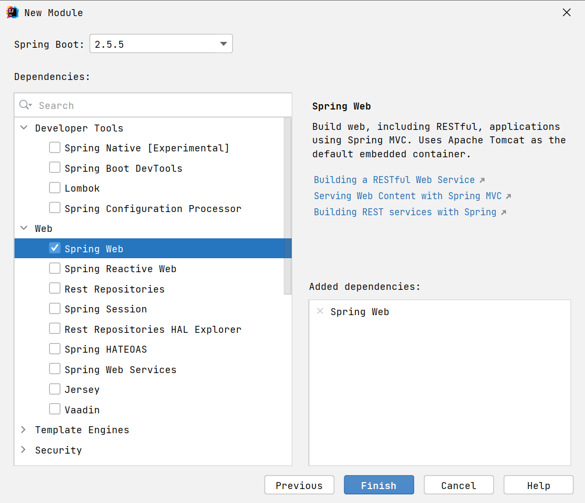

**<font style="color:#DF2A3F;">笔记来源：</font>**[**<font style="color:#DF2A3F;">黑马程序员Spring视频教程，深度讲解spring5底层原理</font>**](https://www.bilibili.com/video/BV1P44y1N7QG/?spm_id_from=333.337.search-card.all.click&vd_source=e8046ccbdc793e09a75eb61fe8e84a30)

# 1 Boot 骨架项目
如果是 linux 环境，用以下命令即可获取 spring boot 的骨架 pom.xml

```shell
curl -G https://start.spring.io/pom.xml -d dependencies=web,mysql,mybatis -o pom.xml
```

也可以使用 Postman 等工具实现

若想获取更多用法，请参考

```shell
curl https://start.spring.io
```

# 2 Boot War项目
**step1**：创建模块，区别在于打包方式选择 war


接下来勾选 Spring Web 支持




**step2**：编写控制器

```java
@Controller
public class MyController {

    @RequestMapping("/hello")
    public String abc() {
        System.out.println("进入了控制器");
        return "hello";
    }
}
```


**step3**：编写 jsp 视图，新建 webapp 目录和一个 hello.jsp 文件，注意文件名与控制器方法返回的视图逻辑名一致

```plain
src
	|- main
		|- java
		|- resources
		|- webapp
			|- hello.jsp
```

**step4**：配置视图路径，打开 application.properties 文件

```properties
spring.mvc.view.prefix=/
spring.mvc.view.suffix=.jsp
```

> 将来 prefix + 控制器方法返回值 + suffix 即为视图完整路径
>


**测试**

如果用 mvn 插件 `mvn spring-boot:run` 或 main 方法测试

1. 必须添加如下依赖，因为此时用的还是内嵌 tomcat，而内嵌 tomcat 默认不带 jasper（用来解析 jsp）

```xml
<dependency>
    <groupId>org.apache.tomcat.embed</groupId>
    tomcat-embed-jasper</artifactId>
    <scope>provided</scope>
</dependency>
```

也可以使用 Idea 配置 tomcat 来测试，此时用的是外置 tomcat

2. 骨架生成的代码中，多了一个 ServletInitializer，它的作用就是配置外置 Tomcat 使用的，在外置 Tomcat 启动后，去调用它创建和运行 SpringApplication


**启示**

对于 jar 项目，若要支持 jsp，也可以在加入 jasper 依赖的前提下，把 jsp 文件置入 `META-INF/resources`

# 3 Boot 启动过程
**step1**：SpringApplication 构造

1. 记录 BeanDefinition 源
2. 推断应用类型
3. 记录 ApplicationContext 初始化器
4. 记录监听器
5. 推断主启动类

对应 SpringApplication 构造方法代码演示

```java
package com.itheima.a39;

import org.springframework.boot.SpringApplication;
import org.springframework.boot.WebApplicationType;
import org.springframework.boot.web.embedded.tomcat.TomcatServletWebServerFactory;
import org.springframework.context.ApplicationContextInitializer;
import org.springframework.context.ApplicationEvent;
import org.springframework.context.ApplicationListener;
import org.springframework.context.ConfigurableApplicationContext;
import org.springframework.context.annotation.Bean;
import org.springframework.context.annotation.Configuration;
import org.springframework.context.support.GenericApplicationContext;

import java.lang.reflect.Method;
import java.util.List;
import java.util.Set;

@Configuration
public class A39_1 {

    public static void main(String[] args) throws Exception {
        System.out.println("1. 演示获取 Bean Definition 源");
        SpringApplication spring = new SpringApplication(A39_1.class);
        spring.setSources(Set.of("classpath:b01.xml"));

        System.out.println("2. 演示推断应用类型");
        Method deduceFromClasspath = WebApplicationType.class.getDeclaredMethod("deduceFromClasspath");
        deduceFromClasspath.setAccessible(true);
        System.out.println("\t应用类型为:"+deduceFromClasspath.invoke(null));//静态方法反射调用无需对象，所以此处的obj是null

        System.out.println("3. 演示 ApplicationContext 初始化器");
        spring.addInitializers(applicationContext -> {
            if (applicationContext instanceof GenericApplicationContext gac) {
                gac.registerBean("bean3", Bean3.class);
            }
        });

        System.out.println("4. 演示监听器与事件");
        spring.addListeners(event -> System.out.println("\t事件为:" + event.getClass()));

        System.out.println("5. 演示主类推断");
        Method deduceMainApplicationClass = SpringApplication.class.getDeclaredMethod("deduceMainApplicationClass");
        deduceMainApplicationClass.setAccessible(true);
        System.out.println("\t主类是："+deduceMainApplicationClass.invoke(spring));

        ConfigurableApplicationContext context = spring.run(args);

        // 创建 ApplicationContext
        // 调用初始化器 对 ApplicationContext 做扩展
        // ApplicationContext.refresh
        for (String name : context.getBeanDefinitionNames()) {
            System.out.println("name: " + name + " 来源：" + context.getBeanFactory().getBeanDefinition(name).getResourceDescription());
        }
        context.close();
        /*
            学到了什么
            a. SpringApplication 构造方法中所做的操作
                1. 可以有多种源用来加载 bean 定义
                2. 应用类型推断
                3. 容器初始化器
                4. 演示启动各阶段事件
                5. 演示主类推断
         */
    }

    static class Bean1 {

    }

    static class Bean2 {

    }

    static class Bean3 {

    }

    @Bean
    public Bean2 bean2() {
        return new Bean2();
    }

    @Bean
    public TomcatServletWebServerFactory servletWebServerFactory() {
        return new TomcatServletWebServerFactory();
    }
}

```

**step2**：执行 run 方法

1.  得到 SpringApplicationRunListeners，名字取得不好，实际是事件发布器 
    - 发布 application starting 事件1️⃣
2.  封装启动 args 
3.  准备 Environment 添加命令行参数（*） 
4.  ConfigurationPropertySources 处理（*） 
    - 发布 application environment 已准备事件2️⃣
5.  通过 EnvironmentPostProcessorApplicationListener 进行 env 后处理（*） 
    - application.properties，由 StandardConfigDataLocationResolver 解析
    - spring.application.json
6.  绑定 spring.main 到 SpringApplication 对象（*） 
7.  打印 banner（*） 
8.  创建容器 
9.  准备容器 
    - 发布 application context 已初始化事件3️⃣
10.  加载 bean 定义 
    - 发布 application prepared 事件4️⃣
11.  refresh 容器 
    - 发布 application started 事件5️⃣
12.  执行 runner 
    -  发布 application ready 事件6️⃣ 
    -  这其中有异常，发布 application failed 事件7️⃣ 

> 带 * 的有独立的示例
>


**演示 - 启动过程**

对应第1步，并演示 7 个事件

```java
package com.itheima.a39;

import org.springframework.boot.DefaultBootstrapContext;
import org.springframework.boot.SpringApplication;
import org.springframework.boot.SpringApplicationRunListener;
import org.springframework.context.support.GenericApplicationContext;
import org.springframework.core.env.StandardEnvironment;
import org.springframework.core.io.support.SpringFactoriesLoader;

import java.lang.reflect.Constructor;
import java.util.List;

public class A39_2 {
    public static void main(String[] args) throws Exception{

        // 添加 app 监听器
        SpringApplication app = new SpringApplication();
        app.addListeners(e -> System.out.println(e.getClass()));

        // 获取事件发送器实现类名
        List<String> names = SpringFactoriesLoader.loadFactoryNames(SpringApplicationRunListener.class, A39_2.class.getClassLoader());
        for (String name : names) {
            System.out.println(name);
            Class<?> clazz = Class.forName(name);
            Constructor<?> constructor = clazz.getConstructor(SpringApplication.class, String[].class);
            SpringApplicationRunListener publisher = (SpringApplicationRunListener) constructor.newInstance(app, args);

            // 发布事件
            DefaultBootstrapContext bootstrapContext = new DefaultBootstrapContext();
            publisher.starting(bootstrapContext); // spring boot 开始启动
            publisher.environmentPrepared(bootstrapContext, new StandardEnvironment()); // 环境信息准备完毕
            GenericApplicationContext context = new GenericApplicationContext();
            publisher.contextPrepared(context); // 在 spring 容器创建，并调用初始化器之后，发送此事件
            publisher.contextLoaded(context); // 所有 bean definition 加载完毕
            context.refresh();
            publisher.started(context); // spring 容器初始化完成(refresh 方法调用完毕)
            publisher.running(context); // spring boot 启动完毕

            publisher.failed(context, new Exception("出错了")); // spring boot 启动出错
        }

        /*
            学到了什么
            a. 如何读取 spring.factories 中的配置
            b. run 方法内获取事件发布器 (得到 SpringApplicationRunListeners) 的过程, 对应步骤中
                1.获取事件发布器
                发布 application starting 事件1️⃣
                发布 application environment 已准备事件2️⃣
                发布 application context 已初始化事件3️⃣
                发布 application prepared 事件4️⃣
                发布 application started 事件5️⃣
                发布 application ready 事件6️⃣
                这其中有异常，发布 application failed 事件7️⃣
         */
    }
}
```


对应第2步和第8到12步

```java
package com.itheima.a39;

import org.springframework.beans.factory.support.DefaultListableBeanFactory;
import org.springframework.beans.factory.xml.XmlBeanDefinitionReader;
import org.springframework.boot.*;
import org.springframework.boot.web.embedded.tomcat.TomcatServletWebServerFactory;
import org.springframework.boot.web.reactive.context.AnnotationConfigReactiveWebServerApplicationContext;
import org.springframework.boot.web.servlet.context.AnnotationConfigServletWebServerApplicationContext;
import org.springframework.boot.web.servlet.server.ServletWebServerFactory;
import org.springframework.context.ApplicationContextInitializer;
import org.springframework.context.ConfigurableApplicationContext;
import org.springframework.context.annotation.*;
import org.springframework.context.support.GenericApplicationContext;
import org.springframework.core.io.ClassPathResource;
import org.springframework.test.context.junit4.SpringRunner;

import java.util.Arrays;
import java.util.Set;

// 运行时请添加运行参数 --server.port=8080 debug
public class A39_3 {
    @SuppressWarnings("all")
    public static void main(String[] args) throws Exception {
        SpringApplication app = new SpringApplication();
        app.addInitializers(new ApplicationContextInitializer<ConfigurableApplicationContext>() {
            @Override
            public void initialize(ConfigurableApplicationContext applicationContext) {
                System.out.println("执行初始化器增强...");
            }
        });

        System.out.println(">>>>>>>>>>>>>>>>>>>>>>>> 2. 封装启动 args");
        DefaultApplicationArguments arguments = new DefaultApplicationArguments(args);

        System.out.println(">>>>>>>>>>>>>>>>>>>>>>>> 8. 创建容器");
        GenericApplicationContext context = createApplicationContext(WebApplicationType.SERVLET);

        System.out.println(">>>>>>>>>>>>>>>>>>>>>>>> 9. 准备容器");
        for (ApplicationContextInitializer initializer : app.getInitializers()) {
            initializer.initialize(context);
        }

        System.out.println(">>>>>>>>>>>>>>>>>>>>>>>> 10. 加载 bean 定义");
        DefaultListableBeanFactory beanFactory = context.getDefaultListableBeanFactory();
        AnnotatedBeanDefinitionReader reader1 = new AnnotatedBeanDefinitionReader(beanFactory);
        XmlBeanDefinitionReader reader2 = new XmlBeanDefinitionReader(beanFactory);
        ClassPathBeanDefinitionScanner scanner = new ClassPathBeanDefinitionScanner(beanFactory);

        reader1.register(Config.class);
        reader2.loadBeanDefinitions(new ClassPathResource("b03.xml"));
        scanner.scan("com.itheima.a39.sub");

        System.out.println(">>>>>>>>>>>>>>>>>>>>>>>> 11. refresh 容器");
        context.refresh();

        for (String name : context.getBeanDefinitionNames()) {
            System.out.println("name:" + name + " 来源：" + beanFactory.getBeanDefinition(name).getResourceDescription());
        }

        System.out.println(">>>>>>>>>>>>>>>>>>>>>>>> 12. 执行 runner");
        for (CommandLineRunner runner : context.getBeansOfType(CommandLineRunner.class).values()) {
            runner.run(args);
        }

        for (ApplicationRunner runner : context.getBeansOfType(ApplicationRunner.class).values()) {
            runner.run(arguments);
        }

        /*
            学到了什么
            a. 创建容器、加载 bean 定义、refresh, 对应的步骤

         */
    }

    private static GenericApplicationContext createApplicationContext(WebApplicationType type) {
        GenericApplicationContext context = null;
        switch (type) {
            case SERVLET -> context = new AnnotationConfigServletWebServerApplicationContext();
            case REACTIVE -> context = new AnnotationConfigReactiveWebServerApplicationContext();
            case NONE -> context = new AnnotationConfigApplicationContext();
        }
        return context;
    }

    static class Bean4 {

    }

    static class Bean5 {

    }

    static class Bean6 {

    }

    @Configuration
    static class Config {
        @Bean
        public Bean5 bean5() {
            return new Bean5();
        }

        @Bean
        public ServletWebServerFactory servletWebServerFactory() {
            return new TomcatServletWebServerFactory();
        }

        @Bean
        public CommandLineRunner commandLineRunner() {
            return new CommandLineRunner() {
                @Override
                public void run(String... args) throws Exception {
                    System.out.println("commandLineRunner()..." + Arrays.toString(args));
                }
            };
        }

        @Bean
        public ApplicationRunner applicationRunner() {
            return new ApplicationRunner() {
                @Override
                public void run(ApplicationArguments args) throws Exception {
                    System.out.println("applicationRunner()..." + Arrays.toString(args.getSourceArgs()));
                    System.out.println(args.getOptionNames());
                    System.out.println(args.getOptionValues("server.port"));
                    System.out.println(args.getNonOptionArgs());
                }
            };
        }
    }
}

```

对应第3步

```java
package org.springframework.boot;

import org.springframework.core.env.PropertySource;
import org.springframework.core.env.SimpleCommandLinePropertySource;
import org.springframework.core.io.ClassPathResource;
import org.springframework.core.io.support.ResourcePropertySource;

import java.io.IOException;

public class Step3 {
    public static void main(String[] args) throws IOException {
        ApplicationEnvironment env = new ApplicationEnvironment(); // 系统环境变量, properties, yaml
        env.getPropertySources().addLast(new ResourcePropertySource(new ClassPathResource("step3.properties")));
        env.getPropertySources().addFirst(new SimpleCommandLinePropertySource(args));
        for (PropertySource<?> ps : env.getPropertySources()) {
            System.out.println(ps);
        }
//        System.out.println(env.getProperty("JAVA_HOME"));

        System.out.println(env.getProperty("server.port"));
    }
}

```

对应第4步

```java
package org.springframework.boot;

import org.springframework.boot.context.properties.source.ConfigurationPropertySources;
import org.springframework.core.env.PropertySource;
import org.springframework.core.io.ClassPathResource;
import org.springframework.core.io.support.ResourcePropertySource;

import java.io.IOException;

public class Step4 {

    public static void main(String[] args) throws IOException, NoSuchFieldException {
        ApplicationEnvironment env = new ApplicationEnvironment();
        env.getPropertySources().addLast(
                new ResourcePropertySource("step4", new ClassPathResource("step4.properties"))
        );
        ConfigurationPropertySources.attach(env);
        for (PropertySource<?> ps : env.getPropertySources()) {
            System.out.println(ps);
        }

        System.out.println(env.getProperty("user.first-name"));
        System.out.println(env.getProperty("user.middle-name"));
        System.out.println(env.getProperty("user.last-name"));
    }
}

```

对应第5步

```java
package org.springframework.boot;

import org.springframework.boot.context.config.ConfigDataEnvironmentPostProcessor;
import org.springframework.boot.context.event.EventPublishingRunListener;
import org.springframework.boot.env.EnvironmentPostProcessor;
import org.springframework.boot.env.EnvironmentPostProcessorApplicationListener;
import org.springframework.boot.env.RandomValuePropertySourceEnvironmentPostProcessor;
import org.springframework.boot.logging.DeferredLog;
import org.springframework.boot.logging.DeferredLogs;
import org.springframework.core.env.ConfigurableEnvironment;
import org.springframework.core.env.PropertySource;
import org.springframework.core.io.support.SpringFactoriesLoader;

import javax.swing.*;
import java.util.List;

/*
    可以添加参数 --spring.application.json={\"server\":{\"port\":9090}} 测试 SpringApplicationJsonEnvironmentPostProcessor
 */
public class Step5 {
    public static void main(String[] args) {
        SpringApplication app = new SpringApplication();
        app.addListeners(new EnvironmentPostProcessorApplicationListener());

        /*List<String> names = SpringFactoriesLoader.loadFactoryNames(EnvironmentPostProcessor.class, Step5.class.getClassLoader());
        for (String name : names) {
            System.out.println(name);
        }*/

        EventPublishingRunListener publisher = new EventPublishingRunListener(app, args);
        ApplicationEnvironment env = new ApplicationEnvironment();
        System.out.println(">>>>>>>>>>>>>>>>>>>>>>>>> 增强前");
        for (PropertySource<?> ps : env.getPropertySources()) {
            System.out.println(ps);
        }
        publisher.environmentPrepared(new DefaultBootstrapContext(), env);
        System.out.println(">>>>>>>>>>>>>>>>>>>>>>>>> 增强后");
        for (PropertySource<?> ps : env.getPropertySources()) {
            System.out.println(ps);
        }

    }

    private static void test1() {
        SpringApplication app = new SpringApplication();
        ApplicationEnvironment env = new ApplicationEnvironment();

        System.out.println(">>>>>>>>>>>>>>>>>>>>>>>>> 增强前");
        for (PropertySource<?> ps : env.getPropertySources()) {
            System.out.println(ps);
        }
        ConfigDataEnvironmentPostProcessor postProcessor1 = new ConfigDataEnvironmentPostProcessor(new DeferredLogs(), new DefaultBootstrapContext());
        postProcessor1.postProcessEnvironment(env, app);
        System.out.println(">>>>>>>>>>>>>>>>>>>>>>>>> 增强后");
        for (PropertySource<?> ps : env.getPropertySources()) {
            System.out.println(ps);
        }
        RandomValuePropertySourceEnvironmentPostProcessor postProcessor2 = new RandomValuePropertySourceEnvironmentPostProcessor(new DeferredLog());
        postProcessor2.postProcessEnvironment(env, app);
        System.out.println(">>>>>>>>>>>>>>>>>>>>>>>>> 增强后");
        for (PropertySource<?> ps : env.getPropertySources()) {
            System.out.println(ps);
        }
        System.out.println(env.getProperty("server.port"));
        System.out.println(env.getProperty("random.int"));
        System.out.println(env.getProperty("random.int"));
        System.out.println(env.getProperty("random.int"));
        System.out.println(env.getProperty("random.uuid"));
        System.out.println(env.getProperty("random.uuid"));
        System.out.println(env.getProperty("random.uuid"));
    }
}

```

对应第6步

```java
package org.springframework.boot;

import org.springframework.boot.SpringApplication;
import org.springframework.boot.context.properties.ConfigurationProperties;
import org.springframework.boot.context.properties.bind.BindResult;
import org.springframework.boot.context.properties.bind.Bindable;
import org.springframework.boot.context.properties.bind.Binder;
import org.springframework.core.env.StandardEnvironment;
import org.springframework.core.io.ClassPathResource;
import org.springframework.core.io.support.ResourcePropertySource;

import java.io.IOException;

public class Step6 {
    // 绑定 spring.main 前缀的 key value 至 SpringApplication, 请通过 debug 查看
    public static void main(String[] args) throws IOException {
        SpringApplication application = new SpringApplication();
        ApplicationEnvironment env = new ApplicationEnvironment();
        env.getPropertySources().addLast(new ResourcePropertySource("step4", new ClassPathResource("step4.properties")));
        env.getPropertySources().addLast(new ResourcePropertySource("step6", new ClassPathResource("step6.properties")));

//        User user = Binder.get(env).bind("user", User.class).get();
//        System.out.println(user);

//        User user = new User();
//        Binder.get(env).bind("user", Bindable.ofInstance(user));
//        System.out.println(user);

        System.out.println(application);
        Binder.get(env).bind("spring.main", Bindable.ofInstance(application));
        System.out.println(application);
    }

    static class User {
        private String firstName;
        private String middleName;
        private String lastName;
        public String getFirstName() {
            return firstName;
        }
        public void setFirstName(String firstName) {
            this.firstName = firstName;
        }
        public String getMiddleName() {
            return middleName;
        }
        public void setMiddleName(String middleName) {
            this.middleName = middleName;
        }
        public String getLastName() {
            return lastName;
        }
        public void setLastName(String lastName) {
            this.lastName = lastName;
        }
        @Override
        public String toString() {
            return "User{" +
                   "firstName='" + firstName + '\'' +
                   ", middleName='" + middleName + '\'' +
                   ", lastName='" + lastName + '\'' +
                   '}';
        }
    }
}

```

对应第7步

```java
package org.springframework.boot;

import org.springframework.core.env.MapPropertySource;
import org.springframework.core.io.DefaultResourceLoader;

import java.util.Map;

public class Step7 {
    public static void main(String[] args) {
        ApplicationEnvironment env = new ApplicationEnvironment();
        SpringApplicationBannerPrinter printer = new SpringApplicationBannerPrinter(
                new DefaultResourceLoader(),
                new SpringBootBanner()
        );
        // 测试文字 banner
//        env.getPropertySources().addLast(new MapPropertySource("custom", Map.of("spring.banner.location","banner1.txt")));
        // 测试图片 banner
//        env.getPropertySources().addLast(new MapPropertySource("custom", Map.of("spring.banner.image.location","banner2.png")));
        // 版本号的获取
        System.out.println(SpringBootVersion.getVersion());
        printer.print(env, Step7.class, System.out);
    }
}

```

**收获**

1. SpringApplication 构造方法中所做的操作 
    - 可以有多种源用来加载 bean 定义
    - 应用类型推断
    - 添加容器初始化器
    - 添加监听器
    - 演示主类推断
2. 如何读取 spring.factories 中的配置
3. 从配置中获取重要的事件发布器：SpringApplicationRunListeners
4. 容器的创建、初始化器增强、加载 bean 定义等
5. CommandLineRunner、ApplicationRunner 的作用
6. 环境对象 
    1. 命令行 PropertySource
    2. ConfigurationPropertySources 规范环境键名称
    3. EnvironmentPostProcessor 后处理增强 
        * 由 EventPublishingRunListener 通过监听事件2️⃣来调用
    4. 绑定 spring.main 前缀的 key value 至 SpringApplication
7. Banner

# 4 Tomcat 内嵌容器
Tomcat 基本结构

```plain
Server
└───Service
    ├───Connector (协议, 端口)
    └───Engine
        └───Host(虚拟主机 localhost)
            ├───Context1 (应用1, 可以设置虚拟路径, / 即 url 起始路径; 项目磁盘路径, 即 docBase )
            │   │   index.html
            │   └───WEB-INF
            │       │   web.xml (servlet, filter, listener) 3.0
            │       ├───classes (servlet, controller, service ...)
            │       ├───jsp
            │       └───lib (第三方 jar 包)
            └───Context2 (应用2)
                │   index.html
                └───WEB-INF
                        web.xml
```

## 4.1 Tomcat 内嵌容器
关键代码

```java
package com.itheima.a40;

import org.apache.catalina.Context;
import org.apache.catalina.LifecycleException;
import org.apache.catalina.connector.Connector;
import org.apache.catalina.startup.Tomcat;
import org.apache.coyote.ProtocolHandler;
import org.apache.coyote.http11.Http11Nio2Protocol;
import org.springframework.boot.autoconfigure.web.servlet.DispatcherServletRegistrationBean;
import org.springframework.boot.web.servlet.ServletRegistrationBean;
import org.springframework.boot.web.servlet.context.AnnotationConfigServletWebServerApplicationContext;
import org.springframework.context.annotation.Bean;
import org.springframework.context.annotation.Configuration;
import org.springframework.http.converter.json.MappingJackson2HttpMessageConverter;
import org.springframework.web.bind.annotation.GetMapping;
import org.springframework.web.bind.annotation.RestController;
import org.springframework.web.context.WebApplicationContext;
import org.springframework.web.context.support.AnnotationConfigWebApplicationContext;
import org.springframework.web.servlet.DispatcherServlet;
import org.springframework.web.servlet.mvc.method.annotation.RequestMappingHandlerAdapter;

import javax.servlet.ServletContainerInitializer;
import javax.servlet.ServletContext;
import javax.servlet.ServletException;
import java.io.File;
import java.io.IOException;
import java.nio.file.Files;
import java.util.Collections;
import java.util.List;
import java.util.Map;
import java.util.Set;

public class TestTomcat {
    /*
        Server
        └───Service
            ├───Connector (协议, 端口)
            └───Engine
                └───Host(虚拟主机 localhost)
                    ├───Context1 (应用1, 可以设置虚拟路径, / 即 url 起始路径; 项目磁盘路径, 即 docBase )
                    │   │   index.html
                    │   └───WEB-INF
                    │       │   web.xml (servlet, filter, listener) 3.0
                    │       ├───classes (servlet, controller, service ...)
                    │       ├───jsp
                    │       └───lib (第三方 jar 包)
                    └───Context2 (应用2)
                        │   index.html
                        └───WEB-INF
                                web.xml
     */
    @SuppressWarnings("all")
    public static void main(String[] args) throws LifecycleException, IOException {
        // 1.创建 Tomcat 对象
        Tomcat tomcat = new Tomcat();
        tomcat.setBaseDir("tomcat");

        // 2.创建项目文件夹, 即 docBase 文件夹
        File docBase = Files.createTempDirectory("boot.").toFile();
        docBase.deleteOnExit();

        // 3.创建 Tomcat 项目, 在 Tomcat 中称为 Context
        Context context = tomcat.addContext("", docBase.getAbsolutePath());

        WebApplicationContext springContext = getApplicationContext();

        // 4.编程添加 Servlet
        context.addServletContainerInitializer(new ServletContainerInitializer() {
            @Override
            public void onStartup(Set<Class<?>> c, ServletContext ctx) throws ServletException {
                HelloServlet helloServlet = new HelloServlet();
                ctx.addServlet("aaa", helloServlet).addMapping("/hello");

//                DispatcherServlet dispatcherServlet = springContext.getBean(DispatcherServlet.class);
//                ctx.addServlet("dispatcherServlet", dispatcherServlet).addMapping("/");
                for (ServletRegistrationBean registrationBean : springContext.getBeansOfType(ServletRegistrationBean.class).values()) {
                    registrationBean.onStartup(ctx);
                }
            }
        }, Collections.emptySet());

        // 5.启动 Tomcat
        tomcat.start();

        // 6.创建连接器, 设置监听端口
        Connector connector = new Connector(new Http11Nio2Protocol());
        connector.setPort(8080);
        tomcat.setConnector(connector);
    }

    public static WebApplicationContext getApplicationContext() {
//        AnnotationConfigServletWebServerApplicationContext
        AnnotationConfigWebApplicationContext context = new AnnotationConfigWebApplicationContext();
        context.register(Config.class);
        context.refresh();
        return context;
    }

    @Configuration
    static class Config {
        @Bean
        public DispatcherServletRegistrationBean registrationBean(DispatcherServlet dispatcherServlet) {
            return new DispatcherServletRegistrationBean(dispatcherServlet, "/");
        }

        @Bean
        // 这个例子中必须为 DispatcherServlet 提供 AnnotationConfigWebApplicationContext, 否则会选择 XmlWebApplicationContext 实现
        public DispatcherServlet dispatcherServlet(WebApplicationContext applicationContext) {
            return new DispatcherServlet(applicationContext);
        }

        @Bean
        public RequestMappingHandlerAdapter requestMappingHandlerAdapter() {
            RequestMappingHandlerAdapter handlerAdapter = new RequestMappingHandlerAdapter();
            handlerAdapter.setMessageConverters(List.of(new MappingJackson2HttpMessageConverter()));
            return handlerAdapter;
        }

        @RestController
        static class MyController {
            @GetMapping("hello2")
            public Map<String,Object> hello() {
                return Map.of("hello2", "hello2, spring!");
            }
        }
    }
}
```

```java
package com.itheima.a40;

import javax.servlet.ServletException;
import javax.servlet.http.HttpServlet;
import javax.servlet.http.HttpServletRequest;
import javax.servlet.http.HttpServletResponse;
import java.io.IOException;

public class HelloServlet extends HttpServlet {

    @Override
    protected void doGet(HttpServletRequest req, HttpServletResponse resp) throws ServletException, IOException {
        resp.setContentType("text/html;charset=utf-8");
        resp.getWriter().print("""
                <h3>hello</h3>
                """);
    }
} 
```

## 4.2 集成 Spring 容器
关键代码

```java
WebApplicationContext springContext = getApplicationContext();

// 4.编程添加 Servlet
context.addServletContainerInitializer(new ServletContainerInitializer() {
    @Override
    public void onStartup(Set<Class<?>> c, ServletContext ctx) throws ServletException {
        // ⬇️通过 ServletRegistrationBean 添加 DispatcherServlet 等
        for (ServletRegistrationBean registrationBean : 
             springContext.getBeansOfType(ServletRegistrationBean.class).values()) {
            registrationBean.onStartup(ctx);
        }
    }
}, Collections.emptySet());
```


# 5 Boot 自动配置
**<font style="color:#000000;">1）</font>**`**<font style="color:#000000;">AopAutoConfiguration</font>**`

Spring Boot 是利用了自动配置类来简化了 aop 相关配置

+ AOP 自动配置类为 `org.springframework.boot.autoconfigure.aop.AopAutoConfiguration`
+ 可以通过 `spring.aop.auto=false` 禁用 aop 自动配置
+ AOP 自动配置的本质是通过 `@EnableAspectJAutoProxy` 来开启了自动代理，如果在引导类上自己添加了 `@EnableAspectJAutoProxy` 那么以自己添加的为准
+ `@EnableAspectJAutoProxy` 的本质是向容器中添加了 `AnnotationAwareAspectJAutoProxyCreator` 这个 bean 后处理器，它能够找到容器中所有切面，并为匹配切点的目标类创建代理，创建代理的工作一般是在 bean 的初始化阶段完成的

<u></u>

**<font style="color:#000000;">2）</font>**`**<font style="color:#000000;">DataSourceAutoConfiguration</font>**`

+ 对应的自动配置类为：`org.springframework.boot.autoconfigure.jdbc.DataSourceAutoConfiguration`
+ 它内部采用了条件装配，通过检查容器的 `bean`，以及类路径下的 `class`，来决定该 `@Bean` 是否生效 
+ 简单说明一下，Spring Boot 支持两大类数据源：
    - EmbeddedDatabase - 内嵌数据库连接池
    - PooledDataSource - 非内嵌数据库连接池，PooledDataSource 又支持如下数据源
        * hikari 提供的 HikariDataSource
        * tomcat-jdbc 提供的 DataSource
        * dbcp2 提供的 BasicDataSource
        * oracle 提供的 PoolDataSourceImpl

如果知道数据源的实现类类型，即指定了 `spring.datasource.type`，理论上可以支持所有数据源，但这样做的一个最大问题是无法订制每种数据源的详细配置（如最大、最小连接数等）


**3）**`**MybatisAutoConfiguration**`

+ MyBatis 自动配置类为 `org.mybatis.spring.boot.autoconfigure.MybatisAutoConfiguration`
+ 它主要配置了两个 bean 
    - SqlSessionFactory - MyBatis 核心对象，用来创建 SqlSession
    - SqlSessionTemplate - SqlSession 的实现，此实现会与当前线程绑定
    - 用 ImportBeanDefinitionRegistrar 的方式扫描所有标注了 [@Mapper ](/Mapper ) 注解的接口 
    - 用 AutoConfigurationPackages 来确定扫描的包
+ 还有一个相关的 bean：MybatisProperties，它会读取配置文件中带 `mybatis.` 前缀的配置项进行定制配置


@MapperScan  注解的作用与 MybatisAutoConfiguration 类似，会注册 MapperScannerConfigurer 有如下区别 

+ @MapperScan  扫描具体包（当然也可以配置关注哪个注解） 
+ @MapperScan  如果不指定扫描具体包，则会把引导类范围内，所有接口当做 Mapper 接口 
+ MybatisAutoConfiguration 关注的是所有标注 @Mapper  注解的接口，会忽略掉非 @Mapper  标注的接口 


这里有同学有疑问，之前介绍的都是将具体类交给 Spring 管理，怎么到了 MyBatis 这儿，接口就可以被管理呢？

+ 其实并非将接口交给 Spring 管理，而是每个接口会对应一个 MapperFactoryBean，是后者被 Spring 所管理，接口只是作为 MapperFactoryBean 的一个属性来配置


**4）**`**TransactionAutoConfiguration**`

+  事务自动配置类有两个： 
    - `org.springframework.boot.autoconfigure.jdbc.DataSourceTransactionManagerAutoConfiguration`
    - `org.springframework.boot.autoconfigure.transaction.TransactionAutoConfiguration`
+  前者配置了 DataSourceTransactionManager 用来执行事务的提交、回滚操作 
+  后者功能上对标 @EnableTransactionManagement，包含以下三个 bean 
    - BeanFactoryTransactionAttributeSourceAdvisor 事务切面类，包含通知和切点
    - TransactionInterceptor 事务通知类，由它在目标方法调用前后加入事务操作
    - AnnotationTransactionAttributeSource 会解析 [@Transactional ](/Transactional ) 及事务属性，也包含了切点功能 
+  如果自己配置了 DataSourceTransactionManager 或是在引导类加了 @EnableTransactionManagement，则以自己配置的为准 


**5）**`**ServletWebServerFactoryAutoConfiguration**`

+ 提供 ServletWebServerFactory


**6）**`**DispatcherServletAutoConfiguration**`

+ 提供 DispatcherServlet
+ 提供 DispatcherServletRegistrationBean


**7）**`**WebMvcAutoConfiguration**`

+ 配置 DispatcherServlet 的各项组件，提供的 bean 见过的有 
    - 多项 HandlerMapping
    - 多项 HandlerAdapter
    - HandlerExceptionResolver


**8）**`**ErrorMvcAutoConfiguration**`

+ 提供的 bean 有 BasicErrorController


**9）**`**MultipartAutoConfiguration**`

+ 它提供了 org.springframework.web.multipart.support.StandardServletMultipartResolver
+ 该 bean 用来解析 multipart/form-data 格式的数据


**10）**`**HttpEncodingAutoConfiguration**`

+ POST 请求参数如果有中文，无需特殊设置，这是因为 Spring Boot 已经配置了 org.springframework.boot.web.servlet.filter.OrderedCharacterEncodingFilter
+ 对应配置 server.servlet.encoding.charset=UTF-8，默认就是 UTF-8
+ 当然，它只影响非 json 格式的数据


**演示 ：自动配置类原理**

关键代码

假设已有第三方的两个自动配置类

```java
@Configuration // ⬅️第三方的配置类
static class AutoConfiguration1 {
    @Bean
    public Bean1 bean1() {
        return new Bean1();
    }
}

@Configuration // ⬅️第三方的配置类
static class AutoConfiguration2 {
    @Bean
    public Bean2 bean2() {
        return new Bean2();
    }
}
```


提供一个配置文件 `META-INF/spring.factories`，key 为导入器类名，值为多个自动配置类名，用逗号分隔

```properties
MyImportSelector=\
AutoConfiguration1,\
AutoConfiguration2
```

> **注意 **：上述配置文件中 MyImportSelector 与 AutoConfiguration1，AutoConfiguration2 为简洁均省略了包名，自己测试时请将包名根据情况补全
>


引入自动配置

```java
@Configuration // ⬅️本项目的配置类
@Import(MyImportSelector.class)
static class Config { }

static class MyImportSelector implements DeferredImportSelector {
    // ⬇️该方法从 META-INF/spring.factories 读取自动配置类名，返回的 String[] 即为要导入的配置类
    public String[] selectImports(AnnotationMetadata importingClassMetadata) {
        return SpringFactoriesLoader
            .loadFactoryNames(MyImportSelector.class, null).toArray(new String[0]);
    }
}
```

**收获**

1. 自动配置类本质上就是一个配置类而已，只是用 `META-INF/spring.factories` 管理，与应用配置类解耦
2. @Enable  打头的注解本质是利用了 @Import  
3. @Import  配合 DeferredImportSelector 即可实现导入，selectImports 方法的返回值即为要导入的配置类名 
4. DeferredImportSelector 的导入会在最后执行，为的是让其它配置优先解析

# 6 条件装配底层
条件装配的底层是本质上是 @Conditional  与 Condition，这两个注解。引入自动配置类时，期望满足一定条件才能被 Spring 管理，不满足则不管理，怎么做呢？ 

比如条件是【类路径下必须有 dataSource】这个 bean ，怎么做呢？

首先编写条件判断类，它实现 Condition 接口，编写条件判断逻辑

```java
static class MyCondition1 implements Condition { 
    // ⬇️如果存在 Druid 依赖，条件成立
    public boolean matches(ConditionContext context, AnnotatedTypeMetadata metadata) {
        return ClassUtils.isPresent("com.alibaba.druid.pool.DruidDataSource", null);
    }
}
```

其次，在要导入的自动配置类上添加 `@Conditional(MyCondition1.class)`，将来此类被导入时就会做条件检查

```java
@Configuration // 第三方的配置类
@Conditional(MyCondition1.class) // ⬅️加入条件
static class AutoConfiguration1 {
    @Bean
    public Bean1 bean1() {
        return new Bean1();
    }
}
```

分别测试加入和去除 druid 依赖，观察 bean1 是否存在于容器

```xml
<dependency>
    <groupId>com.alibaba</groupId>
    druid</artifactId>
    <version>1.1.17</version>
</dependency>
```

收获

1. 学习一种特殊的 if - else

# 7 FactoryBean
代码参考

```java
package com.itheima.a43;

import org.springframework.context.annotation.AnnotationConfigApplicationContext;
import org.springframework.context.annotation.ComponentScan;

@ComponentScan
public class A43 {

    public static void main(String[] args) {
        AnnotationConfigApplicationContext context = new AnnotationConfigApplicationContext(A43.class);

        Bean1 bean1 = (Bean1) context.getBean("bean1");
        Bean1 bean2 = (Bean1) context.getBean("bean1");
        Bean1 bean3 = (Bean1) context.getBean("bean1");
        System.out.println(bean1);
        System.out.println(bean2);
        System.out.println(bean3);

        System.out.println(context.getBean(Bean1.class));

        System.out.println(context.getBean(Bean1FactoryBean.class));
        System.out.println(context.getBean("&bean1"));

        context.close();
    }

}
```

```java
package com.itheima.a43;

import org.slf4j.Logger;
import org.slf4j.LoggerFactory;
import org.springframework.beans.BeansException;
import org.springframework.beans.factory.BeanFactory;
import org.springframework.beans.factory.BeanFactoryAware;
import org.springframework.beans.factory.annotation.Autowired;

import javax.annotation.PostConstruct;

public class Bean1 implements BeanFactoryAware {
    private static final Logger log = LoggerFactory.getLogger(Bean1.class);

    private Bean2 bean2;

    @Autowired
    public void setBean2(Bean2 bean2) {
        log.debug("setBean2({})", bean2);
        this.bean2 = bean2;
    }

    public Bean2 getBean2() {
        return bean2;
    }

    @PostConstruct
    public void init() {
        log.debug("init");
    }

    @Override
    public void setBeanFactory(BeanFactory beanFactory) throws BeansException {
        log.debug("setBeanFactory({})", beanFactory);
    }
}
```

```java
package com.itheima.a43;

import org.slf4j.Logger;
import org.slf4j.LoggerFactory;
import org.springframework.beans.factory.FactoryBean;
import org.springframework.stereotype.Component;

@Component("bean1")
public class Bean1FactoryBean implements FactoryBean<Bean1> {

    private static final Logger log = LoggerFactory.getLogger(Bean1FactoryBean.class);

    // 决定了根据【类型】获取或依赖注入能否成功
    @Override
    public Class<?> getObjectType() {
        return Bean1.class;
    }

    // 决定了 getObject() 方法被调用一次还是多次
    @Override
    public boolean isSingleton() {
        return true;
    }

    @Override
    public Bean1 getObject() throws Exception {
        Bean1 bean1 = new Bean1();
        log.debug("create bean: {}", bean1);
        return bean1;
    }
}
```

```java
package com.itheima.a43;

import org.slf4j.Logger;
import org.slf4j.LoggerFactory;
import org.springframework.beans.BeansException;
import org.springframework.beans.factory.config.BeanPostProcessor;
import org.springframework.stereotype.Component;

@Component
public class Bean1PostProcessor implements BeanPostProcessor {

    private static final Logger log = LoggerFactory.getLogger(Bean1PostProcessor.class);

    @Override
    public Object postProcessBeforeInitialization(Object bean, String beanName) throws BeansException {
        if (beanName.equals("bean1") && bean instanceof Bean1) {
            log.debug("before [{}] init", beanName);
        }
        return bean;
    }

    @Override
    public Object postProcessAfterInitialization(Object bean, String beanName) throws BeansException {
        if (beanName.equals("bean1") && bean instanceof Bean1) {
            log.debug("after [{}] init", beanName);
        }
        return bean;
    }
}
```

```java
package com.itheima.a43;

import org.springframework.stereotype.Component;

@Component
public class Bean2 {
}
```

**收获**

1. 它的作用是用制造创建过程较为复杂的产品, 如`SqlSessionFactory`, 但 `@Bean`已具备等价功能 
2. 使用上较为古怪, 一不留神就会用错 
    1. 被 FactoryBean 创建的产品 
        * 会认为创建、依赖注入、Aware 接口回调、前初始化这些都是 FactoryBean 的职责, 这些流程都不会走
        * 唯有后初始化的流程会走, 也就是产品可以被代理增强
        * 单例的产品不会存储于 BeanFactory 的 singletonObjects 成员中, 而是另一个 factoryBeanObjectCache 成员中
    2. 按名字去获取时, 拿到的是产品对象, 名字前面加 & 获取的是工厂对象

# 8 @Indexed原理
真实项目中，只需要加入以下依赖即可

```xml
<dependency>
    <groupId>org.springframework</groupId>
    spring-context-indexer</artifactId>
    <optional>true</optional>
</dependency>
```

代码参考

```java
package com.itheima.a44;

import org.springframework.beans.factory.support.DefaultListableBeanFactory;
import org.springframework.context.annotation.ClassPathBeanDefinitionScanner;

import java.io.IOException;
import java.lang.reflect.InvocationTargetException;

/*
    做这个试验前, 先在 target/classes 创建 META-INF/spring.components, 内容为

    com.itheima.a44.Bean1=org.springframework.stereotype.Component
    com.itheima.a44.Bean2=org.springframework.stereotype.Component

    做完实现建议删除, 避免影响其它组件扫描的结果

    真实项目中, 这个步骤可以自动完成, 加入以下依赖
    <dependency>
        <groupId>org.springframework</groupId>
        spring-context-indexer</artifactId>
        <optional>true</optional>
    </dependency>
 */
public class A44 {
    public static void main(String[] args) throws IOException, NoSuchMethodException, InvocationTargetException, IllegalAccessException {
        DefaultListableBeanFactory beanFactory = new DefaultListableBeanFactory();
        // 组件扫描的核心类
        ClassPathBeanDefinitionScanner scanner = new ClassPathBeanDefinitionScanner(beanFactory);

        scanner.scan(A44.class.getPackageName());

        for (String name : beanFactory.getBeanDefinitionNames()) {
            System.out.println(name);
        }

        /*
            学到了什么
                a. @Indexed 的原理, 在编译时就根据 @Indexed 生成 META-INF/spring.components 文件
                扫描时
                1. 如果发现 META-INF/spring.components 存在, 以它为准加载 bean definition
                2. 否则, 会遍历包下所有 class 资源 (包括 jar 内的)
         */
    }
}
```

```java
package com.itheima.a44;

import org.springframework.stereotype.Component;

@Component
public class Bean1 {
}
```

```java
package com.itheima.a44;

import org.springframework.stereotype.Component;

@Component
public class Bean2 {
}
```

```java
package com.itheima.a44;

import org.springframework.stereotype.Component;

@Component
public class Bean3 {
}
```

**收获**

1. 在编译时就根据`@Indexed`生成`META-INF/spring.components`文件 
2. 扫描时 
    - 如果发现`META-INF/spring.components` 存在, 以它为准加载 bean definition
    - 否则, 会遍历包下所有 class 资源 (包括 jar 内的)
3. 解决的问题，在编译期就找到 @Component  组件，节省运行期间扫描 @Component  的时间 

# 9 代理进一步理解
代码参考

```java
package com.itheima.a45;

import org.springframework.aop.framework.Advised;
import org.springframework.boot.SpringApplication;
import org.springframework.boot.autoconfigure.SpringBootApplication;
import org.springframework.context.ConfigurableApplicationContext;

import java.lang.reflect.Method;

@SpringBootApplication
public class A45 {

    public static void main(String[] args) throws Exception {
        ConfigurableApplicationContext context = SpringApplication.run(A45.class, args);

        Bean1 proxy = context.getBean(Bean1.class);


        /*
            1.演示 spring 代理的设计特点
                依赖注入和初始化影响的是原始对象
                代理与目标是两个对象，二者成员变量并不共用数据
         */
//        showProxyAndTarget(proxy);
//
//        System.out.println(">>>>>>>>>>>>>>>>>>>");
//        System.out.println(proxy.getBean2());
//        System.out.println(proxy.isInitialized());

        /*
            2.演示 static 方法、final 方法、private 方法均无法增强
         */

        proxy.m1();
        proxy.m2();
        proxy.m3();
        Method m4 = Bean1.class.getDeclaredMethod("m1");
        m4.setAccessible(true);
        m4.invoke(proxy);

        context.close();
    }


    public static void showProxyAndTarget(Bean1 proxy) throws Exception {
        System.out.println(">>>>> 代理中的成员变量");
        System.out.println("\tinitialized=" + proxy.initialized);
        System.out.println("\tbean2=" + proxy.bean2);

        if (proxy instanceof Advised advised) {
            System.out.println(">>>>> 目标中的成员变量");
            Bean1 target = (Bean1) advised.getTargetSource().getTarget();
            System.out.println("\tinitialized=" + target.initialized);
            System.out.println("\tbean2=" + target.bean2);
        }
    }

}

```

```java
package com.itheima.a45;

import org.slf4j.Logger;
import org.slf4j.LoggerFactory;
import org.springframework.beans.factory.annotation.Autowired;
import org.springframework.stereotype.Component;

import javax.annotation.PostConstruct;

@Component
public class Bean1 {

    private static final Logger log = LoggerFactory.getLogger(Bean1.class);

    protected Bean2 bean2;

    protected boolean initialized;

    @Autowired
    public void setBean2(Bean2 bean2) {
        log.debug("setBean2(Bean2 bean2)");
        this.bean2 = bean2;
    }

    @PostConstruct
    public void init() {
        log.debug("init");
        initialized = true;
    }

    public Bean2 getBean2() {
        log.debug("getBean2()");
        return bean2;
    }

    public boolean isInitialized() {
        log.debug("isInitialized()");
        return initialized;
    }

    public void m1() {
        System.out.println("m1() 成员方法");
    }

    final public void m2() {
        System.out.println("m2() final 方法");
    }

    static public void m3() {
        System.out.println("m3() static 方法");
    }

    private void m4() {
        System.out.println("m4() private 方法");
    }

}

```

```java
package com.itheima.a45;

import org.springframework.stereotype.Component;

@Component
public class Bean2 {
}

```

```java
package com.itheima.a45;

import org.aspectj.lang.annotation.Aspect;
import org.aspectj.lang.annotation.Before;
import org.springframework.stereotype.Component;

@Aspect
@Component
public class MyAspect {

    // 故意对所有方法增强
    @Before("execution(* com.itheima.a45.Bean1.*(..))")
    public void before() {
        System.out.println("before");
    }
}

```

**收获**

1.  spring 代理的设计特点 
    -  依赖注入和初始化影响的是原始对象 
        * 因此 cglib 不能用 MethodProxy.invokeSuper()
    -  代理与目标是两个对象，二者成员变量并不共用数据 
2.  static 方法、final 方法、private 方法均无法增强 
    - 进一步理解代理增强基于方法重写


# 10 @Value装配底层 
按类型装配的步骤

1. 查看需要的类型是否为 Optional，是，则进行封装（非延迟），否则向下走
2. 查看需要的类型是否为 ObjectFactory 或 ObjectProvider，是，则进行封装（延迟），否则向下走
3. 查看需要的类型（成员或参数）上是否用 @Lazy  修饰，是，则返回代理，否则向下走 
4. 解析 @Value  的值  
    1. 如果需要的值是字符串，先解析 ${ }，再解析 #{ }
    2. 不是字符串，需要用 TypeConverter 转换
5. 看需要的类型是否为 Stream、Array、Collection、Map，是，则按集合处理，否则向下走
6. 在 BeanFactory 的 resolvableDependencies 中找有没有类型合适的对象注入，没有向下走
7. 在 BeanFactory 及父工厂中找类型匹配的 bean 进行筛选，筛选时会考虑 @Qualifier  及泛型 
8. 结果个数为 0 抛出 NoSuchBeanDefinitionException 异常
9. 如果结果 > 1，再根据 @Primary  进行筛选 
10. 如果结果仍 > 1，再根据成员名或变量名进行筛选
11. 结果仍 > 1，抛出 NoUniqueBeanDefinitionException 异常


代码参考

```java
package com.itheima.a46;

import org.springframework.beans.factory.annotation.Value;
import org.springframework.beans.factory.config.BeanExpressionContext;
import org.springframework.beans.factory.config.ConfigurableListableBeanFactory;
import org.springframework.beans.factory.config.DependencyDescriptor;
import org.springframework.beans.factory.support.DefaultListableBeanFactory;
import org.springframework.context.annotation.AnnotationConfigApplicationContext;
import org.springframework.context.annotation.Configuration;
import org.springframework.context.annotation.ContextAnnotationAutowireCandidateResolver;
import org.springframework.stereotype.Component;

import java.lang.reflect.Field;

// 本章节作为第四讲的延续
@Configuration
@SuppressWarnings("all")
public class A46 {

    public static void main(String[] args) throws Exception {
        AnnotationConfigApplicationContext context = new AnnotationConfigApplicationContext(A46.class);
        DefaultListableBeanFactory beanFactory = context.getDefaultListableBeanFactory();

        ContextAnnotationAutowireCandidateResolver resolver = new ContextAnnotationAutowireCandidateResolver();
        resolver.setBeanFactory(beanFactory);

//        test1(context, resolver, Bean1.class.getDeclaredField("home"));
//        test2(context, resolver, Bean1.class.getDeclaredField("age"));
//        test3(context, resolver, Bean2.class.getDeclaredField("bean3"));
        test3(context, resolver, Bean4.class.getDeclaredField("value"));
    }

    private static void test3(AnnotationConfigApplicationContext context, ContextAnnotationAutowireCandidateResolver resolver, Field field) {
        DependencyDescriptor dd1 = new DependencyDescriptor(field, false);
        // 获取 @Value 的内容
        String value = resolver.getSuggestedValue(dd1).toString();
        System.out.println(value);

        // 解析 ${}
        value = context.getEnvironment().resolvePlaceholders(value);
        System.out.println(value);
        System.out.println(value.getClass());

        // 解析 #{} @bean3
        Object bean3 = context.getBeanFactory().getBeanExpressionResolver().evaluate(value, new BeanExpressionContext(context.getBeanFactory(), null));

        // 类型转换
        Object result = context.getBeanFactory().getTypeConverter().convertIfNecessary(bean3, dd1.getDependencyType());
        System.out.println(result);
    }

    private static void test2(AnnotationConfigApplicationContext context, ContextAnnotationAutowireCandidateResolver resolver, Field field) {
        DependencyDescriptor dd1 = new DependencyDescriptor(field, false);
        // 获取 @Value 的内容
        String value = resolver.getSuggestedValue(dd1).toString();
        System.out.println(value);

        // 解析 ${}
        value = context.getEnvironment().resolvePlaceholders(value);
        System.out.println(value);
        System.out.println(value.getClass());
        Object age = context.getBeanFactory().getTypeConverter().convertIfNecessary(value, dd1.getDependencyType());
        System.out.println(age.getClass());
    }

    private static void test1(AnnotationConfigApplicationContext context, ContextAnnotationAutowireCandidateResolver resolver, Field field) {
        DependencyDescriptor dd1 = new DependencyDescriptor(field, false);
        // 获取 @Value 的内容
        String value = resolver.getSuggestedValue(dd1).toString();
        System.out.println(value);

        // 解析 ${}
        value = context.getEnvironment().resolvePlaceholders(value);
        System.out.println(value);
    }

    public class Bean1 {
        @Value("${JAVA_HOME}")
        private String home;
        @Value("18")
        private int age;
    }

    public class Bean2 {
        @Value("#{@bean3}") // SpringEL       #{SpEL}
        private Bean3 bean3;
    }

    @Component("bean3")
    public class Bean3 {
    }

    static class Bean4 {
        @Value("#{'hello, ' + '${JAVA_HOME}'}")
        private String value;
    }
}

```

收获

1. ContextAnnotationAutowireCandidateResolver 作用之一，获取 @Value  的值 
2. 了解 ${ } 对应的解析器
3. 了解 #{ } 对应的解析器
4. TypeConvert 的一项体现

# 11 @Autowired装配底层 
代码参考

```java
package com.itheima.a47;

import org.springframework.beans.BeansException;
import org.springframework.beans.factory.ObjectFactory;
import org.springframework.beans.factory.annotation.Autowired;
import org.springframework.beans.factory.config.DependencyDescriptor;
import org.springframework.beans.factory.support.DefaultListableBeanFactory;
import org.springframework.context.annotation.AnnotationConfigApplicationContext;
import org.springframework.context.annotation.Configuration;
import org.springframework.context.annotation.ContextAnnotationAutowireCandidateResolver;
import org.springframework.context.annotation.Lazy;
import org.springframework.core.MethodParameter;
import org.springframework.stereotype.Component;

import java.lang.reflect.Method;
import java.util.Optional;

@Configuration
public class A47_1 {
    public static void main(String[] args) throws NoSuchFieldException, NoSuchMethodException {
        AnnotationConfigApplicationContext context = new AnnotationConfigApplicationContext(A47_1.class);
        DefaultListableBeanFactory beanFactory = context.getDefaultListableBeanFactory();
        System.out.println(">>>>>>>>>>>>>>>>>>>>>>>>>>>>>>>>>>>>>>>>");
        // 1. 根据成员变量的类型注入
        DependencyDescriptor dd1 = new DependencyDescriptor(Bean1.class.getDeclaredField("bean2"), false);
        System.out.println(beanFactory.doResolveDependency(dd1, "bean1", null, null));
        System.out.println(">>>>>>>>>>>>>>>>>>>>>>>>>>>>>>>>>>>>>>>>");
        // 2. 根据参数的类型注入
        Method setBean2 = Bean1.class.getDeclaredMethod("setBean2", Bean2.class);
        DependencyDescriptor dd2 = new DependencyDescriptor(new MethodParameter(setBean2, 0), false);
        System.out.println(beanFactory.doResolveDependency(dd2, "bean1", null, null));
        System.out.println(">>>>>>>>>>>>>>>>>>>>>>>>>>>>>>>>>>>>>>>>");
        // 3. 结果包装为 Optional<Bean2>
        DependencyDescriptor dd3 = new DependencyDescriptor(Bean1.class.getDeclaredField("bean3"), false);
        if (dd3.getDependencyType() == Optional.class) {
            dd3.increaseNestingLevel();
            Object result = beanFactory.doResolveDependency(dd3, "bean1", null, null);
            System.out.println(Optional.ofNullable(result));
        }
        System.out.println(">>>>>>>>>>>>>>>>>>>>>>>>>>>>>>>>>>>>>>>>");
        // 4. 结果包装为 ObjectProvider,ObjectFactory
        DependencyDescriptor dd4 = new DependencyDescriptor(Bean1.class.getDeclaredField("bean4"), false);
        if (dd4.getDependencyType() == ObjectFactory.class) {
            dd4.increaseNestingLevel();
            ObjectFactory objectFactory = new ObjectFactory() {
                @Override
                public Object getObject() throws BeansException {
                    return beanFactory.doResolveDependency(dd4, "bean1", null, null);
                }
            };
            System.out.println(objectFactory.getObject());
        }
        System.out.println(">>>>>>>>>>>>>>>>>>>>>>>>>>>>>>>>>>>>>>>>");
        // 5. 对 @Lazy 的处理
        DependencyDescriptor dd5 = new DependencyDescriptor(Bean1.class.getDeclaredField("bean2"), false);
        ContextAnnotationAutowireCandidateResolver resolver = new ContextAnnotationAutowireCandidateResolver();
        resolver.setBeanFactory(beanFactory);
        Object proxy = resolver.getLazyResolutionProxyIfNecessary(dd5, "bean1");
        System.out.println(proxy);
        System.out.println(proxy.getClass());
        /*
            学到了什么
                1. Optional 及 ObjectFactory 对于内嵌类型的处理, 源码参考 ResolvableType
                2. ObjectFactory 懒惰的思想
                3. @Lazy 懒惰的思想
            下一节, 继续学习 doResolveDependency 内部处理
         */
    }

    static class Bean1 {
        @Autowired @Lazy private Bean2 bean2;
        @Autowired public void setBean2(Bean2 bean2) {
            this.bean2 = bean2;
        }
        @Autowired private Optional<Bean2> bean3;
        @Autowired private ObjectFactory<Bean2> bean4;
    }

    @Component("bean2")
    static class Bean2 {
        /*@Override
        public String toString() {
            return super.toString();
        }*/
    }
}

```

```java
package com.itheima.a47;

import org.springframework.beans.factory.BeanFactoryUtils;
import org.springframework.beans.factory.annotation.Autowired;
import org.springframework.beans.factory.annotation.Qualifier;
import org.springframework.beans.factory.config.BeanDefinition;
import org.springframework.beans.factory.config.BeanDefinitionHolder;
import org.springframework.beans.factory.config.DependencyDescriptor;
import org.springframework.beans.factory.support.DefaultListableBeanFactory;
import org.springframework.beans.factory.support.RootBeanDefinition;
import org.springframework.context.ConfigurableApplicationContext;
import org.springframework.context.annotation.AnnotationConfigApplicationContext;
import org.springframework.context.annotation.Configuration;
import org.springframework.context.annotation.ContextAnnotationAutowireCandidateResolver;
import org.springframework.stereotype.Component;

import java.lang.reflect.Field;
import java.util.ArrayList;
import java.util.List;
import java.util.Map;

@SuppressWarnings("all")
@Configuration
public class A47_2 {
    public static void main(String[] args) throws NoSuchFieldException, IllegalAccessException {
        AnnotationConfigApplicationContext context = new AnnotationConfigApplicationContext(A47_2.class);
        DefaultListableBeanFactory beanFactory = context.getDefaultListableBeanFactory();
        System.out.println(">>>>>>>>>>>>>>>>>>>>>>>>>>>>> 1. 数组类型");
        testArray(beanFactory);
        System.out.println(">>>>>>>>>>>>>>>>>>>>>>>>>>>>> 2. List 类型");
        testList(beanFactory);
        System.out.println(">>>>>>>>>>>>>>>>>>>>>>>>>>>>> 3. applicationContext");
        testApplicationContext(beanFactory);
        System.out.println(">>>>>>>>>>>>>>>>>>>>>>>>>>>>> 4. 泛型");
        testGeneric(beanFactory);
        System.out.println(">>>>>>>>>>>>>>>>>>>>>>>>>>>>> 5. @Qualifier");
        testQualifier(beanFactory);
        /*
            学到了什么
                1. 如何获取数组元素类型
                2. Spring 如何获取泛型中的类型
                3. 特殊对象的处理, 如 ApplicationContext, 并注意 Map 取值时的类型匹配问题 (另见  TestMap)
                4. 谁来进行泛型匹配 (另见 TestGeneric)
                5. 谁来处理 @Qualifier
                6. 刚开始都只是按名字处理, 等候选者确定了, 才会创建实例
         */
    }

    private static void testQualifier(DefaultListableBeanFactory beanFactory) throws NoSuchFieldException {
        DependencyDescriptor dd5 = new DependencyDescriptor(Target.class.getDeclaredField("service"), true);
        Class<?> type = dd5.getDependencyType();
        ContextAnnotationAutowireCandidateResolver resolver = new ContextAnnotationAutowireCandidateResolver();
        resolver.setBeanFactory(beanFactory);
        for (String name : BeanFactoryUtils.beanNamesForTypeIncludingAncestors(beanFactory, type)) {
            BeanDefinition bd = beanFactory.getMergedBeanDefinition(name);
            //                                                             @Qualifier("service2")
            if (resolver.isAutowireCandidate(new BeanDefinitionHolder(bd,name), dd5)) {
                System.out.println(name);
                System.out.println(dd5.resolveCandidate(name, type, beanFactory));
            }
        }
    }
    private static void testGeneric(DefaultListableBeanFactory beanFactory) throws NoSuchFieldException {
        DependencyDescriptor dd4 = new DependencyDescriptor(Target.class.getDeclaredField("dao"), true);
        Class<?> type = dd4.getDependencyType();
        ContextAnnotationAutowireCandidateResolver resolver = new ContextAnnotationAutowireCandidateResolver();
        resolver.setBeanFactory(beanFactory);
        for (String name : BeanFactoryUtils.beanNamesForTypeIncludingAncestors(beanFactory, type)) {
            BeanDefinition bd = beanFactory.getMergedBeanDefinition(name);
            // 对比 BeanDefinition 与 DependencyDescriptor 的泛型是否匹配
            if (resolver.isAutowireCandidate(new BeanDefinitionHolder(bd,name), dd4)) {
                System.out.println(name);
                System.out.println(dd4.resolveCandidate(name, type, beanFactory));
            }
        }
    }
    private static void testApplicationContext(DefaultListableBeanFactory beanFactory) throws NoSuchFieldException, IllegalAccessException {
        DependencyDescriptor dd3 = new DependencyDescriptor(Target.class.getDeclaredField("applicationContext"), true);

        Field resolvableDependencies = DefaultListableBeanFactory.class.getDeclaredField("resolvableDependencies");
        resolvableDependencies.setAccessible(true);
        Map<Class<?>, Object> dependencies = (Map<Class<?>, Object>) resolvableDependencies.get(beanFactory);
//        dependencies.forEach((k, v) -> {
//            System.out.println("key:" + k + " value: " + v);
//        });
        for (Map.Entry<Class<?>, Object> entry : dependencies.entrySet()) {
            // 左边类型                      右边类型
            if (entry.getKey().isAssignableFrom(dd3.getDependencyType())) {
                System.out.println(entry.getValue());
                break;
            }
        }
    }
    private static void testList(DefaultListableBeanFactory beanFactory) throws NoSuchFieldException {
        DependencyDescriptor dd2 = new DependencyDescriptor(Target.class.getDeclaredField("serviceList"), true);
        if (dd2.getDependencyType() == List.class) {
            Class<?> resolve = dd2.getResolvableType().getGeneric().resolve();
            System.out.println(resolve);
            List<Object> list = new ArrayList<>();
            String[] names = BeanFactoryUtils.beanNamesForTypeIncludingAncestors(beanFactory, resolve);
            for (String name : names) {
                Object bean = dd2.resolveCandidate(name, resolve, beanFactory);
                list.add(bean);
            }
            System.out.println(list);
        }
    }
    private static void testArray(DefaultListableBeanFactory beanFactory) throws NoSuchFieldException {
        DependencyDescriptor dd1 = new DependencyDescriptor(Target.class.getDeclaredField("serviceArray"), true);
        if (dd1.getDependencyType().isArray()) {
            Class<?> componentType = dd1.getDependencyType().getComponentType();
            System.out.println(componentType);
            String[] names = BeanFactoryUtils.beanNamesForTypeIncludingAncestors(beanFactory, componentType);
            List<Object> beans = new ArrayList<>();
            for (String name : names) {
                System.out.println(name);
                Object bean = dd1.resolveCandidate(name, componentType, beanFactory);
                beans.add(bean);
            }
            Object array = beanFactory.getTypeConverter().convertIfNecessary(beans, dd1.getDependencyType());
            System.out.println(array);
        }
    }
    static class Target {
        @Autowired private Service[] serviceArray;
        @Autowired private List<Service> serviceList;
        @Autowired private ConfigurableApplicationContext applicationContext;
        @Autowired private Dao<Teacher> dao;
        @Autowired @Qualifier("service2") private Service service;
    }
    interface Dao<T> {

    }
    @Component("dao1") static class Dao1 implements Dao<Student> {
    }
    @Component("dao2") static class Dao2 implements Dao<Teacher> {
    }

    static class Student {

    }

    static class Teacher {

    }

    interface Service {

    }

    @Component("service1")
    static class Service1 implements Service {

    }

    @Component("service2")
    static class Service2 implements Service {

    }

    @Component("service3")
    static class Service3 implements Service {

    }
}

```

```java
package com.itheima.a47;

import org.springframework.beans.factory.BeanFactoryUtils;
import org.springframework.beans.factory.annotation.Autowired;
import org.springframework.beans.factory.config.BeanDefinition;
import org.springframework.beans.factory.config.DependencyDescriptor;
import org.springframework.beans.factory.support.BeanDefinitionBuilder;
import org.springframework.beans.factory.support.DefaultListableBeanFactory;
import org.springframework.context.annotation.AnnotationConfigApplicationContext;
import org.springframework.context.annotation.Configuration;
import org.springframework.context.annotation.Primary;
import org.springframework.stereotype.Component;

@Configuration
public class A47_3 {
    public static void main(String[] args) throws NoSuchFieldException {
        AnnotationConfigApplicationContext context = new AnnotationConfigApplicationContext(A47_3.class);
        DefaultListableBeanFactory beanFactory = context.getDefaultListableBeanFactory();
        testPrimary(beanFactory);
        testDefault(beanFactory);

        /*
            学到了什么
                1. @Primary 的处理, 其中 @Primary 会在 @Bean 解析或组件扫描时被解析 (另见 TestPrimary)
                2. 最后的防线, 通过属性或参数名匹配
         */
    }

    private static void testDefault(DefaultListableBeanFactory beanFactory) throws NoSuchFieldException {
        DependencyDescriptor dd = new DependencyDescriptor(Target2.class.getDeclaredField("service3"), false);
        Class<?> type = dd.getDependencyType();
        for (String name : BeanFactoryUtils.beanNamesForTypeIncludingAncestors(beanFactory, type)) {
            if(name.equals(dd.getDependencyName())) {
                System.out.println(name);
            }
        }
    }

    private static void testPrimary(DefaultListableBeanFactory beanFactory) throws NoSuchFieldException {
        DependencyDescriptor dd = new DependencyDescriptor(Target1.class.getDeclaredField("service"), false);
        Class<?> type = dd.getDependencyType();
        for (String name : BeanFactoryUtils.beanNamesForTypeIncludingAncestors(beanFactory, type)) {
            if (beanFactory.getMergedBeanDefinition(name).isPrimary()) {
                System.out.println(name);
            }
        }
    }

    static class Target1 {
        @Autowired private Service service;
    }

    static class Target2 {
        @Autowired private Service service3;
    }

    interface Service {

    }
    @Component("service1") static class Service1 implements Service {

    }
    @Component("service2") static class Service2 implements Service {

    }
    @Component("service3") static class Service3 implements Service {

    }
}

```

收获

1. @Autowired  本质上是根据成员变量或方法参数的类型进行装配 
2. 如果待装配类型是 Optional，需要根据 Optional 泛型找到 bean，再封装为 Optional 对象装配
3. 如果待装配的类型是 ObjectFactory，需要根据 ObjectFactory 泛型创建 ObjectFactory 对象装配 
    - 此方法可以延迟 bean 的获取
4. 如果待装配的成员变量或方法参数上用 @Lazy  标注，会创建代理对象装配  
    - 此方法可以延迟真实 bean 的获取
    - 被装配的代理不作为 bean
5. 如果待装配类型是数组，需要获取数组元素类型，根据此类型找到多个 bean 进行装配
6. 如果待装配类型是 Collection 或其子接口，需要获取 Collection 泛型，根据此类型找到多个 bean
7. 如果待装配类型是 ApplicationContext 等特殊类型 
    - 会在 BeanFactory 的 <font style="background-color:#FFFFFF;">resolvableDependencies</font> 成员按类型查找装配
    - <font style="background-color:#FFFFFF;">resolvableDependencies </font>是 map 集合，key 是特殊类型，value 是其对应对象
    - 不能直接根据 key 进行查找，而是用 isAssignableFrom 逐一尝试右边类型是否可以被赋值给左边的 key 类型
8. 如果待装配类型有泛型参数 
    - 需要利用 ContextAnnotationAutowireCandidateResolver 按泛型参数类型筛选
9. 如果待装配类型有 @Qualifier   
    - 需要利用 ContextAnnotationAutowireCandidateResolver 按注解提供的 bean 名称筛选
10. 有 @Primary  标注的 @Component  或 @Bean  的处理 
11. 与成员变量名或方法参数名同名 bean 的处理


# 12 事件监听器
代码参考

```java
package com.itheima.a48;

import org.slf4j.Logger;
import org.slf4j.LoggerFactory;
import org.springframework.beans.factory.annotation.Autowired;
import org.springframework.context.ApplicationEvent;
import org.springframework.context.ApplicationEventPublisher;
import org.springframework.context.ApplicationListener;
import org.springframework.context.annotation.AnnotationConfigApplicationContext;
import org.springframework.context.annotation.Configuration;
import org.springframework.context.event.ApplicationEventMulticaster;
import org.springframework.stereotype.Component;

// 事件解耦例子
@Configuration
public class A48_1 {
    public static void main(String[] args) {
        AnnotationConfigApplicationContext context = new AnnotationConfigApplicationContext(A48_1.class);
        context.getBean(MyService.class).doBusiness();
        context.close();
    }

    static class MyEvent extends ApplicationEvent {
        public MyEvent(Object source) {
            super(source);
        }
    }

    @Component
    static class MyService {
        private static final Logger log = LoggerFactory.getLogger(MyService.class);
        @Autowired
        private ApplicationEventPublisher publisher; // applicationContext
        public void doBusiness() {
            log.debug("主线业务");
            // 主线业务完成后需要做一些支线业务，下面是问题代码
            publisher.publishEvent(new MyEvent("MyService.doBusiness()"));
        }
    }

//    @Component
    static class SmsApplicationListener implements ApplicationListener<MyEvent> {
        private static final Logger log = LoggerFactory.getLogger(SmsApplicationListener.class);
        @Override
        public void onApplicationEvent(MyEvent event) {
            log.debug("发送短信");
        }
    }

    @Component
    static class EmailApplicationListener implements ApplicationListener<MyEvent> {
        private static final Logger log = LoggerFactory.getLogger(EmailApplicationListener.class);
        @Override
        public void onApplicationEvent(MyEvent event) {
            log.debug("发送邮件");
        }
    }

}
```

```java
package com.itheima.a48;

import org.slf4j.Logger;
import org.slf4j.LoggerFactory;
import org.springframework.beans.factory.annotation.Autowired;
import org.springframework.context.ApplicationEvent;
import org.springframework.context.ApplicationEventPublisher;
import org.springframework.context.ApplicationListener;
import org.springframework.context.annotation.AnnotationConfigApplicationContext;
import org.springframework.context.annotation.Bean;
import org.springframework.context.annotation.Configuration;
import org.springframework.context.event.EventListener;
import org.springframework.context.event.SimpleApplicationEventMulticaster;
import org.springframework.scheduling.concurrent.ThreadPoolTaskExecutor;
import org.springframework.stereotype.Component;

import java.util.concurrent.ThreadPoolExecutor;

@Configuration
public class A48_2 {
    public static void main(String[] args) {
        AnnotationConfigApplicationContext context = new AnnotationConfigApplicationContext(A48_2.class);
        context.getBean(MyService.class).doBusiness();
        context.close();
    }

    static class MyEvent extends ApplicationEvent {
        public MyEvent(Object source) {
            super(source);
        }
    }

    @Component
    static class MyService {
        private static final Logger log = LoggerFactory.getLogger(MyService.class);
        @Autowired
        private ApplicationEventPublisher publisher; // applicationContext
        public void doBusiness() {
            log.debug("主线业务");
            // 主线业务完成后需要做一些支线业务，下面是问题代码
            publisher.publishEvent(new MyEvent("MyService.doBusiness()"));
        }
    }

    @Component
    static class SmsService {
        private static final Logger log = LoggerFactory.getLogger(SmsService.class);
        @EventListener
        public void listener(MyEvent myEvent) {
            log.debug("发送短信");
        }
    }

    @Component
    static class EmailService {
        private static final Logger log = LoggerFactory.getLogger(EmailService.class);
        @EventListener
        public void listener(MyEvent myEvent) {
            log.debug("发送邮件");
        }
    }

    @Bean
    public ThreadPoolTaskExecutor executor() {
        ThreadPoolTaskExecutor executor = new ThreadPoolTaskExecutor();
        executor.setCorePoolSize(3);
        executor.setMaxPoolSize(10);
        executor.setQueueCapacity(100);
        return executor;
    }

    @Bean
    public SimpleApplicationEventMulticaster applicationEventMulticaster(ThreadPoolTaskExecutor executor) {
        SimpleApplicationEventMulticaster multicaster = new SimpleApplicationEventMulticaster();
        multicaster.setTaskExecutor(executor);
        return multicaster;
    }

}
```

```java
package com.itheima.a48;

import org.slf4j.Logger;
import org.slf4j.LoggerFactory;
import org.springframework.beans.factory.SmartInitializingSingleton;
import org.springframework.beans.factory.annotation.Autowired;
import org.springframework.context.ApplicationEvent;
import org.springframework.context.ApplicationEventPublisher;
import org.springframework.context.ConfigurableApplicationContext;
import org.springframework.context.annotation.AnnotationConfigApplicationContext;
import org.springframework.context.annotation.Bean;
import org.springframework.context.annotation.Configuration;
import org.springframework.stereotype.Component;

import java.lang.annotation.ElementType;
import java.lang.annotation.Retention;
import java.lang.annotation.RetentionPolicy;
import java.lang.annotation.Target;
import java.lang.reflect.Method;

@Configuration
public class A48_3 {
    public static void main(String[] args) {
        AnnotationConfigApplicationContext context = new AnnotationConfigApplicationContext(A48_3.class);
        context.getBean(MyService.class).doBusiness();
        context.close();
    }

    @Bean
    public SmartInitializingSingleton smartInitializingSingleton(ConfigurableApplicationContext context) {
        return () -> {
            for (String name : context.getBeanDefinitionNames()) {
                Object bean = context.getBean(name);
                for (Method method : bean.getClass().getMethods()) {
                    if (method.isAnnotationPresent(MyListener.class)) {
                        context.addApplicationListener((event) -> {
                            System.out.println(event);
                            Class<?> eventType = method.getParameterTypes()[0];// 监听器方法需要的事件类型
                            if (eventType.isAssignableFrom(event.getClass())) {
                                try {
                                    method.invoke(bean, event);
                                } catch (Exception e) {
                                    e.printStackTrace();
                                }
                            }
                        });
                    }
                }
            }
        };
    }

    @Component
    static class MyService {
        private static final Logger log = LoggerFactory.getLogger(MyService.class);
        @Autowired
        private ApplicationEventPublisher publisher; // applicationContext

        public void doBusiness() {
            log.debug("主线业务");
            // 主线业务完成后需要做一些支线业务，下面是问题代码
            publisher.publishEvent(new MyEvent("MyService.doBusiness()"));
        }
    }

    @Component
    static class SmsService {
        private static final Logger log = LoggerFactory.getLogger(SmsService.class);

        @MyListener
        public void listener(MyEvent myEvent) {
            log.debug("发送短信");
        }
    }

    @Component
    static class EmailService {
        private static final Logger log = LoggerFactory.getLogger(EmailService.class);

        @MyListener
        public void listener(MyEvent myEvent) {
            log.debug("发送邮件");
        }
    }

    @Retention(RetentionPolicy.RUNTIME)
    @Target(ElementType.METHOD)
    @interface MyListener {
    }

    static class MyEvent extends ApplicationEvent {
        public MyEvent(Object source) {
            super(source);
        }
    }
}
```

****

**收获**

事件监听器的两种方式

1. 实现 ApplicationListener 接口 
    - 根据接口泛型确定事件类型
2. @EventListener 标注监听方法  
    - 根据监听器方法参数确定事件类型
    - 解析时机：在 SmartInitializingSingleton（所有单例初始化完成后），解析每个单例 bean


# 13 事件发布器
代码参考

```java
package com.itheima.a49;

import org.slf4j.Logger;
import org.slf4j.LoggerFactory;
import org.springframework.beans.factory.annotation.Autowired;
import org.springframework.context.ApplicationEvent;
import org.springframework.context.ApplicationEventPublisher;
import org.springframework.context.ApplicationListener;
import org.springframework.context.ConfigurableApplicationContext;
import org.springframework.context.annotation.AnnotationConfigApplicationContext;
import org.springframework.context.annotation.Bean;
import org.springframework.context.annotation.Configuration;
import org.springframework.context.event.ApplicationEventMulticaster;
import org.springframework.context.event.GenericApplicationListener;
import org.springframework.core.ResolvableType;
import org.springframework.scheduling.concurrent.ThreadPoolTaskExecutor;
import org.springframework.stereotype.Component;

import java.util.ArrayList;
import java.util.List;
import java.util.function.Predicate;

@Configuration
public class A49 {
    public static void main(String[] args) {
        AnnotationConfigApplicationContext context = new AnnotationConfigApplicationContext(A49.class);
        context.getBean(MyService.class).doBusiness();
        context.close();
    }

    static class MyEvent extends ApplicationEvent {
        public MyEvent(Object source) {
            super(source);
        }
    }

    @Component
    static class MyService {
        private static final Logger log = LoggerFactory.getLogger(MyService.class);
        @Autowired
        private ApplicationEventPublisher publisher; // applicationContext

        public void doBusiness() {
            log.debug("主线业务");
            // 主线业务完成后需要做一些支线业务，下面是问题代码
            publisher.publishEvent(new MyEvent("MyService.doBusiness()"));
        }
    }

    @Component
    static class SmsApplicationListener implements ApplicationListener<MyEvent> {
        private static final Logger log = LoggerFactory.getLogger(SmsApplicationListener.class);

        @Override
        public void onApplicationEvent(MyEvent event) {
            log.debug("发送短信");
        }
    }

    @Component
    static class EmailApplicationListener implements ApplicationListener<MyEvent> {
        private static final Logger log = LoggerFactory.getLogger(EmailApplicationListener.class);

        @Override
        public void onApplicationEvent(MyEvent event) {
            log.debug("发送邮件");
        }
    }

    @Bean
    public ThreadPoolTaskExecutor executor() {
        ThreadPoolTaskExecutor executor = new ThreadPoolTaskExecutor();
        executor.setCorePoolSize(3);
        executor.setMaxPoolSize(10);
        executor.setQueueCapacity(100);
        return executor;
    }

    @Bean
    public ApplicationEventMulticaster applicationEventMulticaster(ConfigurableApplicationContext context, ThreadPoolTaskExecutor executor) {
        return new AbstractApplicationEventMulticaster() {
            private List<GenericApplicationListener> listeners = new ArrayList<>();

            // 收集监听器
            public void addApplicationListenerBean(String name) {
                ApplicationListener listener = context.getBean(name, ApplicationListener.class);
                System.out.println(listener);
                // 获取该监听器支持的事件类型
                ResolvableType type = ResolvableType.forClass(listener.getClass()).getInterfaces()[0].getGeneric();
                System.out.println(type);

                // 将原始的 listener 封装为支持事件类型检查的 listener
                GenericApplicationListener genericApplicationListener = new GenericApplicationListener() {
                    // 是否支持某事件类型                真实的事件类型
                    public boolean supportsEventType(ResolvableType eventType) {
                        return type.isAssignableFrom(eventType);
                    }

                    public void onApplicationEvent(ApplicationEvent event) {
                        executor.submit(() -> listener.onApplicationEvent(event));
                    }
                };

                listeners.add(genericApplicationListener);
            }

            // 发布事件
            public void multicastEvent(ApplicationEvent event, ResolvableType eventType) {
                for (GenericApplicationListener listener : listeners) {
                    if (listener.supportsEventType(ResolvableType.forClass(event.getClass()))) {
                        listener.onApplicationEvent(event);
                    }
                }
            }
        };
    }

    abstract static class AbstractApplicationEventMulticaster implements ApplicationEventMulticaster {

        @Override
        public void addApplicationListener(ApplicationListener<?> listener) {

        }

        @Override
        public void addApplicationListenerBean(String listenerBeanName) {

        }

        @Override
        public void removeApplicationListener(ApplicationListener<?> listener) {

        }

        @Override
        public void removeApplicationListenerBean(String listenerBeanName) {

        }

        @Override
        public void removeApplicationListeners(Predicate<ApplicationListener<?>> predicate) {

        }

        @Override
        public void removeApplicationListenerBeans(Predicate<String> predicate) {

        }

        @Override
        public void removeAllListeners() {

        }

        @Override
        public void multicastEvent(ApplicationEvent event) {

        }

        @Override
        public void multicastEvent(ApplicationEvent event, ResolvableType eventType) {

        }
    }
}
```

```java
package com.itheima.a49;

import org.springframework.context.ApplicationEvent;
import org.springframework.context.ApplicationListener;
import org.springframework.context.PayloadApplicationEvent;
import org.springframework.context.event.ApplicationEventMulticaster;
import org.springframework.context.event.GenericApplicationListener;
import org.springframework.context.support.GenericApplicationContext;
import org.springframework.core.ResolvableType;

import java.util.ArrayList;
import java.util.List;
import java.util.function.Predicate;

// 演示事件发布器实现要点
public class TestEventPublisher {
    public static void main(String[] args) {
        GenericApplicationContext context = new GenericApplicationContext();
        context.registerBean("applicationEventMulticaster", MyApplicationEventMulticaster.class);
        context.refresh();

        context.publishEvent(new Object());
        context.publishEvent("aaaa");
        context.publishEvent(new Bean1());
    }

    interface Inter {

    }

    static class Bean1 implements Inter{

    }

    static class MyApplicationEventMulticaster implements ApplicationEventMulticaster {

        private List<ApplicationListener> listeners = new ArrayList<>();

        {
            listeners.add(new GenericApplicationListener() {
                @Override
                public void onApplicationEvent(ApplicationEvent event) {
                    if (event instanceof PayloadApplicationEvent payloadApplicationEvent) {
                        System.out.println(payloadApplicationEvent.getPayload());
                    }
                }

                @Override
                public boolean supportsEventType(ResolvableType eventType) {
                    System.out.println(eventType);
                    // eventType --> PayloadApplicationEvent<Object>, PayloadApplicationEvent<String>
                    return (Inter.class.isAssignableFrom(eventType.getGeneric().toClass()));
                }
            });
        }

        @Override
        public void addApplicationListener(ApplicationListener<?> listener) {

        }

        @Override
        public void addApplicationListenerBean(String listenerBeanName) {

        }

        @Override
        public void removeApplicationListener(ApplicationListener<?> listener) {

        }

        @Override
        public void removeApplicationListenerBean(String listenerBeanName) {

        }

        @Override
        public void removeApplicationListeners(Predicate<ApplicationListener<?>> predicate) {

        }

        @Override
        public void removeApplicationListenerBeans(Predicate<String> predicate) {

        }

        @Override
        public void removeAllListeners() {

        }

        @Override
        public void multicastEvent(ApplicationEvent event) {
            multicastEvent(event, null);
        }

        @SuppressWarnings("all")
        @Override
        public void multicastEvent(ApplicationEvent event, ResolvableType eventType) {
            listeners.stream().filter(applicationListener -> {
                        if (eventType == null) {
                            return false;
                        }
                        if (applicationListener instanceof GenericApplicationListener genericApplicationListener) {
                            return genericApplicationListener.supportsEventType(eventType);
                        }
                        return false;
                    })
                    .forEach(applicationListener -> {
                        applicationListener.onApplicationEvent(event);
                    });
        }
    }
}

```

**收获**

事件发布器模拟实现

1. addApplicationListenerBean 负责收集容器中的监听器 
    - 监听器会统一转换为 GenericApplicationListener 对象，以支持判断事件类型
2. multicastEvent 遍历监听器集合，发布事件 
    - 发布前先通过 GenericApplicationListener.supportsEventType 判断支持该事件类型才发事件
    - 可以利用线程池进行异步发事件优化
3. 如果发送的事件对象不是 ApplicationEvent 类型，Spring 会把它包装为 PayloadApplicationEvent 并用泛型技术解析事件对象的原始类型 
    - 视频中未讲解

