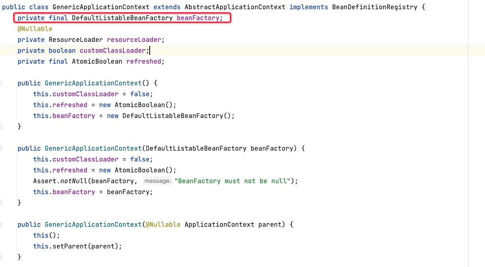
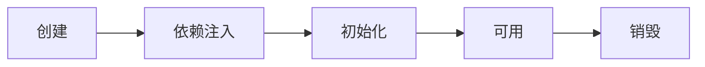
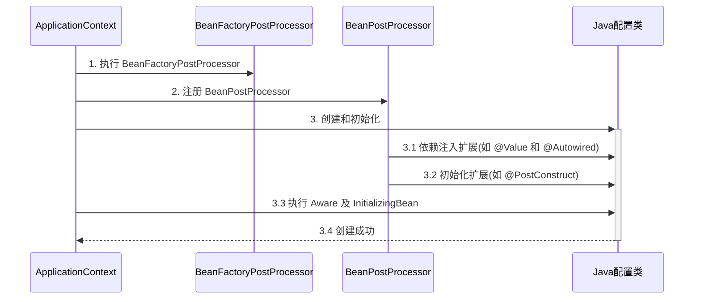
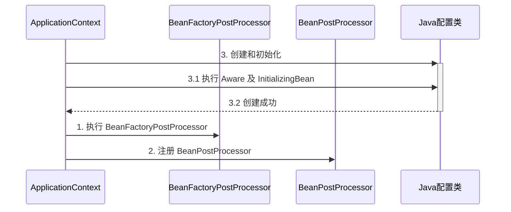
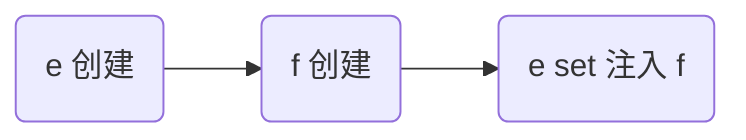
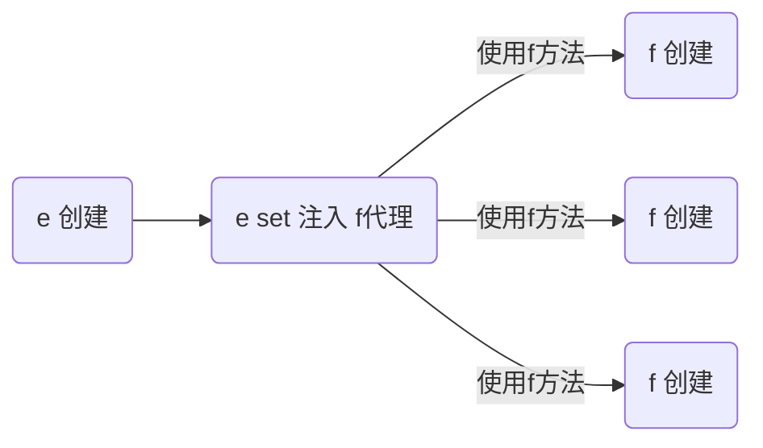

**<font style="color:#DF2A3F;">笔记来源：</font>**[**<font style="color:#DF2A3F;">黑马程序员Spring视频教程，深度讲解spring5底层原理</font>**](https://www.bilibili.com/video/BV1P44y1N7QG/?spm_id_from=333.337.search-card.all.click&vd_source=e8046ccbdc793e09a75eb61fe8e84a30)

## 1 容器接口
+  BeanFactory 接口，典型功能有： 
    - getBean
+  ApplicationContext 接口，是 BeanFactory 的子接口。它扩展了 BeanFactory 接口的功能，如： 
    - 国际化
    - 通配符方式获取一组 Resource 资源
    - 整合 Environment 环境（能通过它获取各种来源的配置信息）
    - 事件发布与监听，实现组件之间的解耦

### 1.1 代码示例
```java
package com.itheima.a01;

import org.slf4j.Logger;
import org.slf4j.LoggerFactory;
import org.springframework.beans.factory.config.ConfigurableListableBeanFactory;
import org.springframework.beans.factory.support.DefaultSingletonBeanRegistry;
import org.springframework.boot.SpringApplication;
import org.springframework.boot.autoconfigure.SpringBootApplication;
import org.springframework.context.ConfigurableApplicationContext;
import org.springframework.core.io.Resource;

import java.io.IOException;
import java.lang.reflect.Field;
import java.util.Locale;
import java.util.Map;

/*
    BeanFactory 与 ApplicationContext 的区别
 */
@SpringBootApplication
public class A01 {

    private static final Logger log = LoggerFactory.getLogger(A01.class);

    public static void main(String[] args) throws NoSuchFieldException, IllegalAccessException, IOException {

        ConfigurableApplicationContext context = SpringApplication.run(A01.class, args);
        /*
            1. 到底什么是 BeanFactory
                - 它是 ApplicationContext 的父接口
                - 它才是 Spring 的核心容器, 主要的 ApplicationContext 实现都【组合】了它的功能
         */
        System.out.println(context);


        /*
            2. BeanFactory 能干点啥
                - 表面上只有 getBean
                - 实际上控制反转、基本的依赖注入、直至 Bean 的生命周期的各种功能, 都由它的实现类提供
         */
        Field singletonObjects = DefaultSingletonBeanRegistry.class.getDeclaredField("singletonObjects");
        singletonObjects.setAccessible(true);
        ConfigurableListableBeanFactory beanFactory = context.getBeanFactory();
        //此处是反射调用获取map集合，singletonObjects.get(Object object)意思为object对象来调用获取这个成员变量
        Map<String, Object> map = (Map<String, Object>) singletonObjects.get(beanFactory);
        map.entrySet().stream().filter(e -> e.getKey().startsWith("component"))
                .forEach(e -> {
                    System.out.println(e.getKey() + "=" + e.getValue());
                });

        /*
            3. ApplicationContext 比 BeanFactory 多点啥
         */
        System.out.println(context.getMessage("hi", null, Locale.CHINA));
        System.out.println(context.getMessage("hi", null, Locale.ENGLISH));
        System.out.println(context.getMessage("hi", null, Locale.JAPANESE));

        Resource[] resources = context.getResources("classpath*:META-INF/spring.factories");
        for (Resource resource : resources) {
            System.out.println(resource);
        }

        System.out.println(context.getEnvironment().getProperty("java_home"));
        System.out.println(context.getEnvironment().getProperty("server.port"));

//        context.publishEvent(new UserRegisteredEvent(context));
        context.getBean(Component1.class).register();

        /*
            4. 学到了什么
                a. BeanFactory 与 ApplicationContext 并不仅仅是简单接口继承的关系, ApplicationContext 组合并扩展了 BeanFactory 的功能
                b. 又新学一种代码之间解耦途径
            练习：完成用户注册与发送短信之间的解耦, 用事件方式、和 AOP 方式分别实现
         */
    }
}
```

> _**注意**_
>
> + 如果 jdk > 8, 运行时请添加 <font style="color:#E8323C;">--add-opens java.base/java.lang=ALL-UNNAMED</font>，这是因为这些版本的 jdk 默认不允许跨 module 反射
> + 事件发布还可以异步，这个没有展示，请自行查阅 @EnableAsync，[@Async ](/Async ) 的用法 
>

```java
@Component
public class Component1 {

    private static final Logger log = LoggerFactory.getLogger(Component1.class);

    @Autowired
    private ApplicationEventPublisher context;

    public void register() {
        log.debug("用户注册");
        context.publishEvent(new UserRegisteredEvent(this));
    }

}
```

```java
@Component
public class Component2 {

    private static final Logger log = LoggerFactory.getLogger(Component2.class);

    @EventListener
    public void aaa(UserRegisteredEvent event) {
        log.debug("{}", event);
        log.debug("发送短信");
    }
}
```

```java
public class UserRegisteredEvent extends ApplicationEvent {
    public UserRegisteredEvent(Object source) {
        super(source);
    }
}
```

```java
public class TestMessageSource {
    public static void main(String[] args) {
        GenericApplicationContext context = new GenericApplicationContext();

        context.registerBean("messageSource", MessageSource.class, () -> {
            ResourceBundleMessageSource ms = new ResourceBundleMessageSource();
            ms.setDefaultEncoding("utf-8");
            ms.setBasename("messages");
            return ms;
        });

        context.refresh();

        System.out.println(context.getMessage("hi", null, Locale.ENGLISH));
        System.out.println(context.getMessage("hi", null, Locale.CHINESE));
        System.out.println(context.getMessage("hi", null, Locale.JAPANESE));
    }
}
```

国际化文件均在 src/resources 目录下  
messages.properties（空）  
messages_en.properties

```properties
hi=Hello
```


messages_ja.properties

```properties
hi=こんにちは
```


messages_zh.properties

```properties
hi=你好
```

> _**注意**_
>
> + ApplicationContext 中 MessageSource bean 的名字固定为 messageSource
> + 使用 SpringBoot 时，国际化文件名固定为 messages
> + 空的 messages.properties 也必须存在
>


**<font style="color:#E8323C;">收获</font>**

通过这个示例结合 debug 查看 ApplicationContext 对象的内部结构，学到：

1.  到底什么是 BeanFactory 
    - 它是 ApplicationContext 的父接口
    - <font style="color:#E8323C;">它才是 Spring 的核心容器, 主要的 ApplicationContext 实现都【组合】了它的功能，【组合】是指 ApplicationContext 的一个重要成员变量就是 BeanFactory</font>
2.  BeanFactory 能干点啥 
    - 表面上只有 getBean
    - 实际上控制反转、基本的依赖注入、直至 Bean 的生命周期的各种功能，都由它的实现类提供
    - 例子中通过反射查看了它的成员变量 singletonObjects，内部包含了所有的单例 bean
3.  ApplicationContext 比 BeanFactory 多点啥 
    - ApplicationContext 组合并扩展了 BeanFactory 的功能
    - 国际化、通配符方式获取一组 Resource 资源、整合 Environment 环境、事件发布与监听
    - 新学一种代码之间解耦途径，事件解耦

## 2 容器实现
Spring 的发展历史较为悠久，因此很多资料还在讲解它较旧的实现，这里出于怀旧的原因，把它们都列出来，供大家参考

+ DefaultListableBeanFactory，是 BeanFactory 最重要的实现，像**控制反转**和**依赖注入**功能，都是它来实现
+ ClassPathXmlApplicationContext，从类路径查找 XML 配置文件，创建容器（旧）
+ FileSystemXmlApplicationContext，从磁盘路径查找 XML 配置文件，创建容器（旧）
+ XmlWebApplicationContext，传统 SSM 整合时，基于 XML 配置文件的容器（旧）
+ AnnotationConfigWebApplicationContext，传统 SSM 整合时，基于 java 配置类的容器（旧）
+ AnnotationConfigApplicationContext，Spring boot 中非 web 环境容器（新）
+ AnnotationConfigServletWebServerApplicationContext，Spring boot 中 servlet web 环境容器（新）
+ AnnotationConfigReactiveWebServerApplicationContext，Spring boot 中 reactive web 环境容器（新）

<font style="color:#E8323C;">另外要注意的是，后面这些带有 ApplicationContext 的类都是 ApplicationContext 接口的实现，但它们是</font>**<font style="color:#E8323C;">组合</font>**<font style="color:#E8323C;">了 </font>**<font style="color:#E8323C;">DefaultListableBeanFactory</font>**<font style="color:#E8323C;"> 的功能，并非继承而来</font>



### 2.1 DefaultListableBeanFactory
代码参考

```java
package com.itheima.a02;

import org.slf4j.Logger;
import org.slf4j.LoggerFactory;
import org.springframework.beans.factory.annotation.Autowired;
import org.springframework.beans.factory.config.BeanFactoryPostProcessor;
import org.springframework.beans.factory.config.BeanPostProcessor;
import org.springframework.beans.factory.support.AbstractBeanDefinition;
import org.springframework.beans.factory.support.BeanDefinitionBuilder;
import org.springframework.beans.factory.support.DefaultListableBeanFactory;
import org.springframework.context.annotation.AnnotationConfigUtils;
import org.springframework.context.annotation.Bean;
import org.springframework.context.annotation.Configuration;
import org.springframework.core.Ordered;

import javax.annotation.Resource;

public class TestBeanFactory {

    public static void main(String[] args) {
        DefaultListableBeanFactory beanFactory = new DefaultListableBeanFactory();
        // bean 的定义（class, scope, 初始化, 销毁）
        AbstractBeanDefinition beanDefinition =
                BeanDefinitionBuilder.genericBeanDefinition(Config.class).setScope("singleton").getBeanDefinition();
        beanFactory.registerBeanDefinition("config", beanDefinition);

        // 给 BeanFactory 添加一些常用的后处理器
        AnnotationConfigUtils.registerAnnotationConfigProcessors(beanFactory);

        // BeanFactory 后处理器主要功能，补充了一些 bean 定义
        beanFactory.getBeansOfType(BeanFactoryPostProcessor.class).values().forEach(beanFactoryPostProcessor -> {
            beanFactoryPostProcessor.postProcessBeanFactory(beanFactory);
        });

        // Bean 后处理器, 针对 bean 的生命周期的各个阶段提供扩展, 例如 @Autowired @Resource ...
        beanFactory.getBeansOfType(BeanPostProcessor.class).values().stream()
                .sorted(beanFactory.getDependencyComparator())
                .forEach(beanPostProcessor -> {
            System.out.println(">>>>" + beanPostProcessor);
            beanFactory.addBeanPostProcessor(beanPostProcessor);
        });

        for (String name : beanFactory.getBeanDefinitionNames()) {
            System.out.println(name);
        }

        beanFactory.preInstantiateSingletons(); // 准备好所有单例
        System.out.println(">>>>>>>>>>>>>>>>>>>>>>>>>>>>>>>>>>>> ");
		// System.out.println(beanFactory.getBean(Bean1.class).getBean2());
        System.out.println(beanFactory.getBean(Bean1.class).getInter());
        /*
            学到了什么:
            a. beanFactory 不会做的事
                   1. 不会主动调用 BeanFactory 后处理器
                   2. 不会主动添加 Bean 后处理器
                   3. 不会主动初始化单例
                   4. 不会解析beanFactory 还不会解析 ${ } 与 #{ }
            b. bean 后处理器会有排序的逻辑
         */

        System.out.println("Common:" + (Ordered.LOWEST_PRECEDENCE - 3));
        System.out.println("Autowired:" + (Ordered.LOWEST_PRECEDENCE - 2));
    }

    @Configuration
    static class Config {
        @Bean
        public Bean1 bean1() {
            return new Bean1();
        }

        @Bean
        public Bean2 bean2() {
            return new Bean2();
        }

        @Bean
        public Bean3 bean3() {
            return new Bean3();
        }

        @Bean
        public Bean4 bean4() {
            return new Bean4();
        }
    }

    interface Inter {

    }

    static class Bean3 implements Inter {

    }

    static class Bean4 implements Inter {

    }

    static class Bean1 {
        private static final Logger log = LoggerFactory.getLogger(Bean1.class);

        public Bean1() {
            log.debug("构造 Bean1()");
        }

        @Autowired
        private Bean2 bean2;

        public Bean2 getBean2() {
            return bean2;
        }

        @Autowired
        @Resource(name = "bean4")
        private Inter bean3;

        public Inter getInter() {
            return bean3;
        }
    }

    static class Bean2 {
        private static final Logger log = LoggerFactory.getLogger(Bean2.class);

        public Bean2() {
            log.debug("构造 Bean2()");
        }
    }
}
```

**<font style="color:#E8323C;">收获</font>**

+ beanFactory 可以通过 registerBeanDefinition 注册一个 bean definition 对象 
    - 我们平时使用的配置类、xml、组件扫描等方式都是生成 bean definition 对象注册到 beanFactory 当中
    - bean definition 描述了这个 bean 的创建蓝图：scope 是什么、用构造还是工厂创建、初始化销毁方法是什么，等等
+ beanFactory 需要手动调用 beanFactory 后处理器对它做增强 
    - 例如通过解析 @Bean、[@ComponentScan ](/ComponentScan ) 等注解，来补充一些 bean definition 
+ beanFactory 需要手动添加 bean 后处理器，以便对后续 bean 的创建过程提供增强 
    - 例如 @Autowired，[@Resource ](/Resource ) 等注解的解析都是 bean 后处理器完成的 
    - bean 后处理的添加顺序会对解析结果有影响，见视频中同时加 @Autowired，[@Resource ](/Resource ) 的例子 
+ beanFactory 需要手动调用方法来初始化单例
+ beanFactory 需要额外设置才能解析 ${} 与 #{}

### 2.2 ApplicationContext实现
代码参考

```java
package com.itheima.a02;

import org.slf4j.Logger;
import org.slf4j.LoggerFactory;
import org.springframework.boot.autoconfigure.web.servlet.DispatcherServletRegistrationBean;
import org.springframework.boot.web.embedded.tomcat.TomcatServletWebServerFactory;
import org.springframework.boot.web.servlet.context.AnnotationConfigServletWebServerApplicationContext;
import org.springframework.boot.web.servlet.server.ServletWebServerFactory;
import org.springframework.context.annotation.AnnotationConfigApplicationContext;
import org.springframework.context.annotation.Bean;
import org.springframework.context.annotation.Configuration;
import org.springframework.context.support.ClassPathXmlApplicationContext;
import org.springframework.context.support.FileSystemXmlApplicationContext;
import org.springframework.web.servlet.DispatcherServlet;
import org.springframework.web.servlet.mvc.Controller;

/*
  常见 ApplicationContext 实现
*/
public class A02 {
    private static final Logger log = LoggerFactory.getLogger(A02.class);

    public static void main(String[] args) {
        testClassPathXmlApplicationContext();
//        testFileSystemXmlApplicationContext();
//        testAnnotationConfigApplicationContext();
//        testAnnotationConfigServletWebServerApplicationContext();

    /*

		DefaultListableBeanFactory beanFactory = new DefaultListableBeanFactory();
        System.out.println("读取之前...");
        for (String name : beanFactory.getBeanDefinitionNames()) {
            System.out.println(name);
        }
        System.out.println("读取之后...");
        XmlBeanDefinitionReader reader = new XmlBeanDefinitionReader(beanFactory);
        reader.loadBeanDefinitions(new FileSystemResource("src\\main\\resources\\a02.xml"));
        for (String name : beanFactory.getBeanDefinitionNames()) {
            System.out.println(name);
        }
		
	*/

        /*
            学到了什么
                a. 常见的 ApplicationContext 容器实现
                b. 内嵌容器、DispatcherServlet 的创建方法、作用
         */
    }

    // ⬇较为经典的容器, 基于 classpath 下 xml 格式的配置文件来创建
    private static void testClassPathXmlApplicationContext() {
        ClassPathXmlApplicationContext context =
                new ClassPathXmlApplicationContext("a02.xml");

        for (String name : context.getBeanDefinitionNames()) {
            System.out.println(name);
        }

        System.out.println(context.getBean(Bean2.class).getBean1());
    }

    // ⬇基于磁盘路径下 xml 格式的配置文件来创建
    private static void testFileSystemXmlApplicationContext() {
        FileSystemXmlApplicationContext context =
                new FileSystemXmlApplicationContext(
                        "src\\main\\resources\\a02.xml");
        for (String name : context.getBeanDefinitionNames()) {
            System.out.println(name);
        }

        System.out.println(context.getBean(Bean2.class).getBean1());
    }

    // ⬇较为经典的容器, 基于java 配置类来创建
    private static void testAnnotationConfigApplicationContext() {
        AnnotationConfigApplicationContext context =
                new AnnotationConfigApplicationContext(Config.class);

        for (String name : context.getBeanDefinitionNames()) {
            System.out.println(name);
        }

        System.out.println(context.getBean(Bean2.class).getBean1());
    }

    // ⬇较为经典的容器, 基于 java 配置类来创建, 用于 web 环境
    private static void testAnnotationConfigServletWebServerApplicationContext() {
        AnnotationConfigServletWebServerApplicationContext context =
                new AnnotationConfigServletWebServerApplicationContext(WebConfig.class);
        for (String name : context.getBeanDefinitionNames()) {
            System.out.println(name);
        }
    }

    @Configuration
    static class WebConfig {
        @Bean
        public ServletWebServerFactory servletWebServerFactory(){
            return new TomcatServletWebServerFactory();
        }
        @Bean
        public DispatcherServlet dispatcherServlet() {
            return new DispatcherServlet();
        }
        @Bean
        public DispatcherServletRegistrationBean registrationBean(DispatcherServlet dispatcherServlet) {
            return new DispatcherServletRegistrationBean(dispatcherServlet, "/");
        }
        @Bean("/hello")
        public Controller controller1() {
            return (request, response) -> {
                response.getWriter().print("hello");
                return null;
            };
        }
    }

    @Configuration
    static class Config {
        @Bean
        public Bean1 bean1() {
            return new Bean1();
        }

        @Bean
        public Bean2 bean2(Bean1 bean1) {
            Bean2 bean2 = new Bean2();
            bean2.setBean1(bean1);
            return bean2;
        }
    }

    static class Bean1 {
    }

    static class Bean2 {

        private Bean1 bean1;

        public void setBean1(Bean1 bean1) {
            this.bean1 = bean1;
        }

        public Bean1 getBean1() {
            return bean1;
        }
    }
}
```

**<font style="color:#E8323C;">收获</font>**

1. 常见的 ApplicationContext 容器实现
2. 内嵌容器、DispatcherServlet 的创建方法、作用


## 3 Bean 的生命周期
一个受 Spring 管理的 bean，生命周期主要阶段有

1. 创建：根据 bean 的构造方法或者工厂方法来创建 bean 实例对象
2. 依赖注入：根据 @Autowired，[@Value ](/Value ) 或其它一些手段，为 bean 的成员变量填充值、建立关系 
3. 初始化：回调各种 Aware 接口，调用对象的各种初始化方法
4. 销毁：在容器关闭时，会销毁所有单例对象（即调用它们的销毁方法） 
    - prototype 对象也能够销毁，不过需要容器这边主动调用

一些资料会提到，生命周期中还有一类 bean 后处理器：BeanPostProcessor，会在 bean 的初始化的前后，提供一些扩展逻辑。但这种说法是不完整的，见下面的演示1


### 3.1 bean生命周期
代码参考

```java
package com.itheima.a03;

import org.springframework.boot.SpringApplication;
import org.springframework.boot.autoconfigure.SpringBootApplication;
import org.springframework.context.ConfigurableApplicationContext;

/*
    bean 的生命周期, 以及 bean 后处理器
    学到了什么
        a. Spring bean 生命周期各个阶段
        b. 模板设计模式, 大流程已经固定好了, 通过接口回调(bean 后处理器)扩展
 */
@SpringBootApplication
public class A03 {
    public static void main(String[] args) {
        ConfigurableApplicationContext context = SpringApplication.run(A03.class, args);
        context.close();
    }
}
```


```java
package com.itheima.a03;

import org.slf4j.Logger;
import org.slf4j.LoggerFactory;
import org.springframework.beans.factory.annotation.Autowired;
import org.springframework.beans.factory.annotation.Value;
import org.springframework.stereotype.Component;

import javax.annotation.PostConstruct;
import javax.annotation.PreDestroy;

@Component
public class LifeCycleBean {
    private static final Logger log = LoggerFactory.getLogger(LifeCycleBean.class);

    public LifeCycleBean() {
        log.debug("构造");
    }

    @Autowired
    public void autowire(@Value("${JAVA_HOME}") String home) {
        log.debug("依赖注入: {}", home);
    }

    @PostConstruct
    public void init() {
        log.debug("初始化");
    }

    @PreDestroy
    public void destroy() {
        log.debug("销毁");
    }
}
```


```java
package com.itheima.a03;

import org.slf4j.Logger;
import org.slf4j.LoggerFactory;
import org.springframework.beans.BeansException;
import org.springframework.beans.PropertyValues;
import org.springframework.beans.factory.config.DestructionAwareBeanPostProcessor;
import org.springframework.beans.factory.config.InstantiationAwareBeanPostProcessor;
import org.springframework.stereotype.Component;

@Component
public class MyBeanPostProcessor implements InstantiationAwareBeanPostProcessor, DestructionAwareBeanPostProcessor {

    private static final Logger log = LoggerFactory.getLogger(MyBeanPostProcessor.class);

    @Override
    public void postProcessBeforeDestruction(Object bean, String beanName) throws BeansException {
        if (beanName.equals("lifeCycleBean"))
            log.debug("<<<<<< 销毁之前执行, 如 @PreDestroy");
    }

    @Override
    public Object postProcessBeforeInstantiation(Class<?> beanClass, String beanName) throws BeansException {
        if (beanName.equals("lifeCycleBean"))
            log.debug("<<<<<< 实例化之前执行, 这里返回的对象会替换掉原本的 bean");
        return null;
    }

    @Override
    public boolean postProcessAfterInstantiation(Object bean, String beanName) throws BeansException {
        if (beanName.equals("lifeCycleBean")) {
            log.debug("<<<<<< 实例化之后执行, 这里如果返回 false 会跳过依赖注入阶段");
//            return false;
        }
        return true;
    }

    @Override
    public PropertyValues postProcessProperties(PropertyValues pvs, Object bean, String beanName) throws BeansException {
        if (beanName.equals("lifeCycleBean"))
            log.debug("<<<<<< 依赖注入阶段执行, 如 @Autowired、@Value、@Resource");
        return pvs;
    }

    @Override
    public Object postProcessBeforeInitialization(Object bean, String beanName) throws BeansException {
        if (beanName.equals("lifeCycleBean"))
            log.debug("<<<<<< 初始化之前执行, 这里返回的对象会替换掉原本的 bean, 如 @PostConstruct、@ConfigurationProperties");
        return bean;
    }

    @Override
    public Object postProcessAfterInitialization(Object bean, String beanName) throws BeansException {
        if (beanName.equals("lifeCycleBean"))
            log.debug("<<<<<< 初始化之后执行, 这里返回的对象会替换掉原本的 bean, 如代理增强");
        return bean;
    }
}
```





创建前后的增强

+ postProcessBeforeInstantiation 
    - 这里返回的对象若不为 null 会替换掉原本的 bean，并且仅会走 postProcessAfterInitialization 流程
+ postProcessAfterInstantiation 
    - 这里如果返回 false 会跳过依赖注入阶段


依赖注入前的增强

+ postProcessProperties 
    - 如 @Autowired、@Value、[@Resource ](/Resource ) 


初始化前后的增强

+ postProcessBeforeInitialization 
    - 这里返回的对象会替换掉原本的 bean
    - 如 @PostConstruct、@ConfigurationProperties
+ postProcessAfterInitialization 
    - 这里返回的对象会替换掉原本的 bean
    - 如代理增强


销毁之前的增强

+ postProcessBeforeDestruction 
    - 如 [@PreDestroy ](/PreDestroy ) 


收获

1. Spring bean 生命周期各个阶段
2. 模板设计模式, 指大流程已经固定好了, 通过接口回调（bean 后处理器）在一些关键点前后提供扩展


### 3.2 模板方法设计模式
关键代码

```java
public class TestMethodTemplate {

    public static void main(String[] args) {
        MyBeanFactory beanFactory = new MyBeanFactory();
        beanFactory.addBeanPostProcessor(bean -> System.out.println("解析 @Autowired"));
        beanFactory.addBeanPostProcessor(bean -> System.out.println("解析 @Resource"));
        beanFactory.getBean();
    }

    // 模板方法  Template Method Pattern
    static class MyBeanFactory {
        public Object getBean() {
            Object bean = new Object();
            System.out.println("构造 " + bean);
            System.out.println("依赖注入 " + bean); // @Autowired, @Resource
            for (BeanPostProcessor processor : processors) {
                processor.inject(bean);
            }
            System.out.println("初始化 " + bean);
            return bean;
        }

        private List<BeanPostProcessor> processors = new ArrayList<>();

        public void addBeanPostProcessor(BeanPostProcessor processor) {
            processors.add(processor);
        }
    }
    
    static interface BeanPostProcessor {
        public void inject(Object bean); // 对依赖注入阶段的扩展
    }
}
```


### 3.3 bean后处理器排序
代码参考

```java
package com.itheima.a03;

import org.slf4j.Logger;
import org.slf4j.LoggerFactory;
import org.springframework.beans.BeansException;
import org.springframework.beans.factory.config.BeanPostProcessor;
import org.springframework.beans.factory.support.DefaultListableBeanFactory;
import org.springframework.context.annotation.AnnotationConfigUtils;
import org.springframework.core.Ordered;
import org.springframework.core.PriorityOrdered;
import org.springframework.core.annotation.Order;

import java.util.ArrayList;
import java.util.List;

/*
    bean 后处理的的排序
 */
public class TestProcessOrder {

    public static void main(String[] args) {
        DefaultListableBeanFactory beanFactory = new DefaultListableBeanFactory();
        AnnotationConfigUtils.registerAnnotationConfigProcessors(beanFactory);

        List<BeanPostProcessor> list = new ArrayList<>(List.of(new P1(), new P2(), new P3(), new P4(), new P5()));
        list.sort(beanFactory.getDependencyComparator());

        list.forEach(processor->{
            processor.postProcessBeforeInitialization(new Object(), "");
        });

        /*
            学到了什么
                1. 实现了 PriorityOrdered 接口的优先级最高
                2. 实现了 Ordered 接口与加了 @Order 注解的平级, 按数字升序
                3. 其它的排在最后
         */
    }

    @Order(1)
    static class P1 implements BeanPostProcessor {
        private static final Logger log = LoggerFactory.getLogger(P1.class);

        @Override
        public Object postProcessBeforeInitialization(Object bean, String beanName) throws BeansException {
            log.debug("postProcessBeforeInitialization @Order(1)");
            return bean;
        }
    }

    @Order(2)
    static class P2 implements BeanPostProcessor {
        private static final Logger log = LoggerFactory.getLogger(P2.class);

        @Override
        public Object postProcessBeforeInitialization(Object bean, String beanName) throws BeansException {
            log.debug("postProcessBeforeInitialization @Order(2)");
            return bean;
        }

    }

    static class P3 implements BeanPostProcessor, PriorityOrdered {
        private static final Logger log = LoggerFactory.getLogger(P3.class);

        @Override
        public Object postProcessBeforeInitialization(Object bean, String beanName) throws BeansException {
            log.debug("postProcessBeforeInitialization PriorityOrdered");
            return bean;
        }

        @Override
        public int getOrder() {
            return 100;
        }
    }

    static class P4 implements BeanPostProcessor, Ordered {
        private static final Logger log = LoggerFactory.getLogger(P4.class);

        @Override
        public Object postProcessBeforeInitialization(Object bean, String beanName) throws BeansException {
            log.debug("postProcessBeforeInitialization Ordered");
            return bean;
        }

        @Override
        public int getOrder() {
            return 0;
        }
    }

    static class P5 implements BeanPostProcessor {
        private static final Logger log = LoggerFactory.getLogger(P5.class);

        @Override
        public Object postProcessBeforeInitialization(Object bean, String beanName) throws BeansException {
            log.debug("postProcessBeforeInitialization");
            return bean;
        }
    }
}
```

收获

1. 实现了 PriorityOrdered 接口的优先级最高
2. 实现了 Ordered 接口与加了 [@Order ](/Order ) 注解的平级, 按数字升序 
3. 其它的排在最后


## 4 Bean 后处理器
### 4.1 后处理器作用
代码参考

```java

package com.itheima.a04;

import org.springframework.beans.factory.annotation.AutowiredAnnotationBeanPostProcessor;
import org.springframework.beans.factory.support.DefaultListableBeanFactory;
import org.springframework.boot.context.properties.ConfigurationPropertiesBindingPostProcessor;
import org.springframework.context.annotation.CommonAnnotationBeanPostProcessor;
import org.springframework.context.annotation.ContextAnnotationAutowireCandidateResolver;
import org.springframework.context.support.GenericApplicationContext;

/*
    bean 后处理器的作用
 */
public class A04 {
    public static void main(String[] args) {
        // ⬇GenericApplicationContext 是一个【干净】的容器
        GenericApplicationContext context = new GenericApplicationContext();

        // ⬇用原始方法注册三个 bean
        context.registerBean("bean1", Bean1.class);
        context.registerBean("bean2", Bean2.class);
        context.registerBean("bean3", Bean3.class);
        context.registerBean("bean4", Bean4.class);

        context.getDefaultListableBeanFactory().setAutowireCandidateResolver(new ContextAnnotationAutowireCandidateResolver());
        context.registerBean(AutowiredAnnotationBeanPostProcessor.class); // @Autowired @Value

        context.registerBean(CommonAnnotationBeanPostProcessor.class); // @Resource @PostConstruct @PreDestroy

        ConfigurationPropertiesBindingPostProcessor.register(context.getDefaultListableBeanFactory());

        // ⬇初始化容器
        context.refresh(); // 执行beanFactory后处理器, 添加bean后处理器, 初始化所有单例

        System.out.println(context.getBean(Bean1.class));

        // ⬇销毁容器
        context.close();

        /*
            学到了什么
                a. @Autowired 等注解的解析属于 bean 生命周期阶段(依赖注入, 初始化)的扩展功能
                b. 这些扩展功能由 bean 后处理器来完成
         */
    }
}
```


```java
package com.itheima.a04;

import org.slf4j.Logger;
import org.slf4j.LoggerFactory;
import org.springframework.beans.factory.annotation.Autowired;
import org.springframework.beans.factory.annotation.Value;

import javax.annotation.PostConstruct;
import javax.annotation.PreDestroy;
import javax.annotation.Resource;

public class Bean1 {
    private static final Logger log = LoggerFactory.getLogger(Bean1.class);

    private Bean2 bean2;

    @Autowired
    public void setBean2(Bean2 bean2) {
        log.debug("@Autowired 生效: {}", bean2);
        this.bean2 = bean2;
    }

    @Autowired
    private Bean3 bean3;

    @Resource
    public void setBean3(Bean3 bean3) {
        log.debug("@Resource 生效: {}", bean3);
        this.bean3 = bean3;
    }

    private String home;

    @Autowired
    public void setHome(@Value("${JAVA_HOME}") String home) {
        log.debug("@Value 生效: {}", home);
        this.home = home;
    }

    @PostConstruct
    public void init() {
        log.debug("@PostConstruct 生效");
    }

    @PreDestroy
    public void destroy() {
        log.debug("@PreDestroy 生效");
    }

    @Override
    public String toString() {
        return "Bean1{" +
               "bean2=" + bean2 +
               ", bean3=" + bean3 +
               ", home='" + home + '\'' +
               '}';
    }
}
```


```java
public class Bean2 {
}
```


```java
public class Bean3 {
}
```


```java
package com.itheima.a04;

import org.springframework.boot.context.properties.ConfigurationProperties;

/*
    java.home=
    java.version=
 */
@ConfigurationProperties(prefix = "java")
public class Bean4 {

    private String home;

    private String version;

    public String getHome() {
        return home;
    }

    public void setHome(String home) {
        this.home = home;
    }

    public String getVersion() {
        return version;
    }

    public void setVersion(String version) {
        this.version = version;
    }

    @Override
    public String toString() {
        return "Bean4{" +
               "home='" + home + '\'' +
               ", version='" + version + '\'' +
               '}';
    }
}
```


收获

1. [@Autowired ](/Autowired ) 等注解的解析属于 bean 生命周期阶段（依赖注入, 初始化）的扩展功能，这些扩展功能由 bean 后处理器来完成 
2. 每个后处理器各自增强什么功能 
    - AutowiredAnnotationBeanPostProcessor 解析 [@Autowired ](/Autowired ) 与 [@Value ](/Value ) 
    - CommonAnnotationBeanPostProcessor 解析 @Resource、@PostConstruct、[@PreDestroy ](/PreDestroy ) 
    - ConfigurationPropertiesBindingPostProcessor 解析 @ConfigurationProperties
3. 另外 ContextAnnotationAutowireCandidateResolver 负责获取 [@Value ](/Value ) 的值，解析 @Qualifier、泛型、[@Lazy ](/Lazy ) 等 


### 4.2 [@Autowired ](/Autowired ) bean后处理器运行分析 
代码参考

```java
package com.itheima.a04;

import org.springframework.beans.PropertyValues;
import org.springframework.beans.factory.annotation.AutowiredAnnotationBeanPostProcessor;
import org.springframework.beans.factory.annotation.InjectionMetadata;
import org.springframework.beans.factory.config.DependencyDescriptor;
import org.springframework.beans.factory.support.DefaultListableBeanFactory;
import org.springframework.context.annotation.ContextAnnotationAutowireCandidateResolver;
import org.springframework.core.MethodParameter;
import org.springframework.core.env.StandardEnvironment;

import java.lang.reflect.Field;
import java.lang.reflect.Method;

// AutowiredAnnotationBeanPostProcessor 运行分析
public class DigInAutowired {
    public static void main(String[] args) throws Throwable {
        DefaultListableBeanFactory beanFactory = new DefaultListableBeanFactory();
        beanFactory.registerSingleton("bean2", new Bean2()); // 创建过程,依赖注入,初始化
        beanFactory.registerSingleton("bean3", new Bean3());
        beanFactory.setAutowireCandidateResolver(new ContextAnnotationAutowireCandidateResolver()); // @Value
        beanFactory.addEmbeddedValueResolver(new StandardEnvironment()::resolvePlaceholders); // ${} 的解析器

        // 1. 查找哪些属性、方法加了 @Autowired, 这称之为 InjectionMetadata
        AutowiredAnnotationBeanPostProcessor processor = new AutowiredAnnotationBeanPostProcessor();
        processor.setBeanFactory(beanFactory);

        Bean1 bean1 = new Bean1();
//        System.out.println(bean1);
//        processor.postProcessProperties(null, bean1, "bean1"); // 执行依赖注入 @Autowired @Value
//        System.out.println(bean1);

//        Method findAutowiringMetadata = AutowiredAnnotationBeanPostProcessor.class.getDeclaredMethod("findAutowiringMetadata", String.class, Class.class, PropertyValues.class);
//        findAutowiringMetadata.setAccessible(true);
//        InjectionMetadata metadata = (InjectionMetadata) findAutowiringMetadata.invoke(processor, "bean1", Bean1.class, null);// 获取 Bean1 上加了 @Value @Autowired 的成员变量，方法参数信息
//        System.out.println(metadata);

        // 2. 调用 InjectionMetadata 来进行依赖注入, 注入时按类型查找值
//        metadata.inject(bean1, "bean1", null);
//        System.out.println(bean1);

        // 3. 如何按类型查找值
        Field bean3 = Bean1.class.getDeclaredField("bean3");
        DependencyDescriptor dd1 = new DependencyDescriptor(bean3, false);
        Object o = beanFactory.doResolveDependency(dd1, null, null, null);
        System.out.println(o);

        Method setBean2 = Bean1.class.getDeclaredMethod("setBean2", Bean2.class);
        DependencyDescriptor dd2 =
                new DependencyDescriptor(new MethodParameter(setBean2, 0), true);
        Object o1 = beanFactory.doResolveDependency(dd2, null, null, null);
        System.out.println(o1);

        Method setHome = Bean1.class.getDeclaredMethod("setHome", String.class);
        DependencyDescriptor dd3 = new DependencyDescriptor(new MethodParameter(setHome, 0), true);
        Object o2 = beanFactory.doResolveDependency(dd3, null, null, null);
        System.out.println(o2);

    }
}
```


收获

1. AutowiredAnnotationBeanPostProcessor.findAutowiringMetadata 用来获取某个 bean 上加了 [@Value ](/Value ) [@Autowired ](/Autowired ) 的成员变量，方法参数的信息，表示为 InjectionMetadata 
2. InjectionMetadata 可以完成依赖注入
3. InjectionMetadata 内部根据成员变量，方法参数封装为 DependencyDescriptor 类型
4. 有了 DependencyDescriptor，就可以利用 beanFactory.doResolveDependency 方法进行基于类型的查找


## 5 BeanFactory 后处理器
### 5.1 BeanFactory后处理器的作用
代码参考

```java
package com.itheima.a05;

import com.itheima.a05.mapper.Mapper1;
import com.itheima.a05.mapper.Mapper2;
import org.slf4j.Logger;
import org.slf4j.LoggerFactory;
import org.springframework.context.support.GenericApplicationContext;

import java.io.IOException;

/*
    BeanFactory 后处理器的作用
 */
public class A05 {
    private static final Logger log = LoggerFactory.getLogger(A05.class);

    public static void main(String[] args) throws IOException {

        // ⬇️GenericApplicationContext 是一个【干净】的容器
        GenericApplicationContext context = new GenericApplicationContext();
        context.registerBean("config", Config.class);
//        context.registerBean(ConfigurationClassPostProcessor.class); // @ComponentScan @Bean @Import @ImportResource
//        context.registerBean(MapperScannerConfigurer.class, bd -> { // @MapperScanner
//            bd.getPropertyValues().add("basePackage", "com.itheima.a05.mapper");
//        });

//        context.registerBean(ComponentScanPostProcessor.class); // 解析 @ComponentScan

        context.registerBean(AtBeanPostProcessor.class); // 解析 @Bean
        context.registerBean(MapperPostProcessor.class); // 解析 Mapper 接口

        // ⬇️初始化容器
        context.refresh();

        for (String name : context.getBeanDefinitionNames()) {
            System.out.println(name);
        }

        Mapper1 mapper1 = context.getBean(Mapper1.class);
        Mapper2 mapper2 = context.getBean(Mapper2.class);

        // ⬇️销毁容器
        context.close();

        /*
            学到了什么
                a. @ComponentScan, @Bean, @Mapper 等注解的解析属于核心容器(即 BeanFactory)的扩展功能
                b. 这些扩展功能由不同的 BeanFactory 后处理器来完成, 其实主要就是补充了一些 bean 定义
         */
    }
}
```

+ ConfigurationClassPostProcessor 可以解析 
    - [@ComponentScan ](/ComponentScan ) 
    - [@Bean ](/Bean ) 
    - [@Import ](/Import ) 
    - [@ImportResource ](/ImportResource ) 
+ MapperScannerConfigurer 可以解析 
    - Mapper 接口

收获

1. @ComponentScan, @Bean, [@Mapper ](/Mapper ) 等注解的解析属于核心容器（即 BeanFactory）的扩展功能 
2. 这些扩展功能由不同的 BeanFactory 后处理器来完成，其实主要就是补充了一些 bean 定义

### 5.2 模拟解析[@ComponentScan ](/ComponentScan ) 
代码参考

```java
package com.itheima.a05;

import org.springframework.beans.BeansException;
import org.springframework.beans.factory.config.ConfigurableListableBeanFactory;
import org.springframework.beans.factory.support.AbstractBeanDefinition;
import org.springframework.beans.factory.support.BeanDefinitionBuilder;
import org.springframework.beans.factory.support.BeanDefinitionRegistry;
import org.springframework.beans.factory.support.BeanDefinitionRegistryPostProcessor;
import org.springframework.context.annotation.AnnotationBeanNameGenerator;
import org.springframework.context.annotation.ComponentScan;
import org.springframework.core.annotation.AnnotationUtils;
import org.springframework.core.io.Resource;
import org.springframework.core.io.support.PathMatchingResourcePatternResolver;
import org.springframework.core.type.AnnotationMetadata;
import org.springframework.core.type.classreading.CachingMetadataReaderFactory;
import org.springframework.core.type.classreading.MetadataReader;
import org.springframework.stereotype.Component;

import java.io.IOException;

public class ComponentScanPostProcessor implements BeanDefinitionRegistryPostProcessor {
    @Override // context.refresh
    public void postProcessBeanFactory(ConfigurableListableBeanFactory configurableListableBeanFactory) throws BeansException {

    }

    @Override
    public void postProcessBeanDefinitionRegistry(BeanDefinitionRegistry beanFactory) throws BeansException {
        try {
            ComponentScan componentScan = AnnotationUtils.findAnnotation(Config.class, ComponentScan.class);
            if (componentScan != null) {
                for (String p : componentScan.basePackages()) {
                    System.out.println(p);
                    // com.itheima.a05.component -> classpath*:com/itheima/a05/component/**/*.class
                    String path = "classpath*:" + p.replace(".", "/") + "/**/*.class";
                    System.out.println(path);
                    CachingMetadataReaderFactory factory = new CachingMetadataReaderFactory();
                    Resource[] resources = new PathMatchingResourcePatternResolver().getResources(path);
                    AnnotationBeanNameGenerator generator = new AnnotationBeanNameGenerator();
                    for (Resource resource : resources) {
                        // System.out.println(resource);
                        MetadataReader reader = factory.getMetadataReader(resource);
                        // System.out.println("类名:" + reader.getClassMetadata().getClassName());
                        AnnotationMetadata annotationMetadata = reader.getAnnotationMetadata();
                        // System.out.println("是否加了 @Component:" + annotationMetadata.hasAnnotation(Component.class.getName()));
                        // System.out.println("是否加了 @Component 派生:" + annotationMetadata.hasMetaAnnotation(Component.class.getName()));
                        if (annotationMetadata.hasAnnotation(Component.class.getName())
                            || annotationMetadata.hasMetaAnnotation(Component.class.getName())) {
                            AbstractBeanDefinition bd = BeanDefinitionBuilder
                                    .genericBeanDefinition(reader.getClassMetadata().getClassName())
                                    .getBeanDefinition();
                            String name = generator.generateBeanName(bd, beanFactory);
                            beanFactory.registerBeanDefinition(name, bd);
                        }
                    }
                }
            }
        } catch (IOException e) {
            e.printStackTrace();
        }
    }
}
```


```java
@Component
public class Bean2 {

    private static final Logger log = LoggerFactory.getLogger(Bean2.class);

    public Bean2() {
        log.debug("我被 Spring 管理啦");
    }
}
```


```java
package com.itheima.a05.component;

import org.slf4j.Logger;
import org.slf4j.LoggerFactory;
import org.springframework.stereotype.Component;
import org.springframework.stereotype.Controller;

@Controller
public class Bean3 {

    private static final Logger log = LoggerFactory.getLogger(Bean3.class);

    public Bean3() {
        log.debug("我被 Spring 管理啦");
    }
}
```


```java
package com.itheima.a05.component;

import org.slf4j.Logger;
import org.slf4j.LoggerFactory;
import org.springframework.stereotype.Component;

public class Bean4 {

    private static final Logger log = LoggerFactory.getLogger(Bean4.class);

    public Bean4() {
        log.debug("我被 Spring 管理啦");
    }
}
```


收获

1. Spring 操作元数据的工具类 CachingMetadataReaderFactory
2. 通过注解元数据（AnnotationMetadata）获取直接或间接标注的注解信息
3. 通过类元数据（ClassMetadata）获取类名，AnnotationBeanNameGenerator 生成 bean 名
4. 解析元数据是基于 ASM 技术


### 5.3 模拟解析[@Bean ](/Bean ) 
代码参考

```java
package com.itheima.a05;

import org.springframework.beans.BeansException;
import org.springframework.beans.factory.config.ConfigurableListableBeanFactory;
import org.springframework.beans.factory.support.AbstractBeanDefinition;
import org.springframework.beans.factory.support.BeanDefinitionBuilder;
import org.springframework.beans.factory.support.BeanDefinitionRegistry;
import org.springframework.beans.factory.support.BeanDefinitionRegistryPostProcessor;
import org.springframework.context.annotation.Bean;
import org.springframework.core.io.ClassPathResource;
import org.springframework.core.type.MethodMetadata;
import org.springframework.core.type.classreading.CachingMetadataReaderFactory;
import org.springframework.core.type.classreading.MetadataReader;

import java.io.IOException;
import java.util.Set;

public class AtBeanPostProcessor implements BeanDefinitionRegistryPostProcessor {
    @Override
    public void postProcessBeanFactory(ConfigurableListableBeanFactory configurableListableBeanFactory) throws BeansException {

    }

    @Override
    public void postProcessBeanDefinitionRegistry(BeanDefinitionRegistry beanFactory) throws BeansException {
        try {
            CachingMetadataReaderFactory factory = new CachingMetadataReaderFactory();
            MetadataReader reader = factory.getMetadataReader(new ClassPathResource("com/itheima/a05/Config.class"));
            Set<MethodMetadata> methods = reader.getAnnotationMetadata().getAnnotatedMethods(Bean.class.getName());
            for (MethodMetadata method : methods) {
                System.out.println(method);
                String initMethod = method.getAnnotationAttributes(Bean.class.getName()).get("initMethod").toString();
                BeanDefinitionBuilder builder = BeanDefinitionBuilder.genericBeanDefinition();
                builder.setFactoryMethodOnBean(method.getMethodName(), "config");
                builder.setAutowireMode(AbstractBeanDefinition.AUTOWIRE_CONSTRUCTOR);
                if (initMethod.length() > 0) {
                    builder.setInitMethodName(initMethod);
                }
                AbstractBeanDefinition bd = builder.getBeanDefinition();
                beanFactory.registerBeanDefinition(method.getMethodName(), bd);
            }
        } catch (IOException e) {
            e.printStackTrace();
        }
    }
}
```

```java
package com.itheima.a05;

import com.alibaba.druid.pool.DruidDataSource;
import org.mybatis.spring.SqlSessionFactoryBean;
import org.springframework.context.annotation.Bean;
import org.springframework.context.annotation.ComponentScan;
import org.springframework.context.annotation.Configuration;

import javax.sql.DataSource;

@Configuration
@ComponentScan("com.itheima.a05.component")
public class Config {
    @Bean
    public Bean1 bean1() {
        return new Bean1();
    }

    @Bean
    public SqlSessionFactoryBean sqlSessionFactoryBean(DataSource dataSource) {
        SqlSessionFactoryBean sqlSessionFactoryBean = new SqlSessionFactoryBean();
        sqlSessionFactoryBean.setDataSource(dataSource);
        return sqlSessionFactoryBean;
    }

    @Bean(initMethod = "init")
    public DruidDataSource dataSource() {
        DruidDataSource dataSource = new DruidDataSource();
        dataSource.setUrl("jdbc:mysql://localhost:3306/test");
        dataSource.setUsername("root");
        dataSource.setPassword("root");
        return dataSource;
    }

    /*@Bean
    public MapperFactoryBean<Mapper1> mapper1(SqlSessionFactory sqlSessionFactory) {
        MapperFactoryBean<Mapper1> factory = new MapperFactoryBean<>(Mapper1.class);
        factory.setSqlSessionFactory(sqlSessionFactory);
        return factory;
    }

    @Bean
    public MapperFactoryBean<Mapper2> mapper2(SqlSessionFactory sqlSessionFactory) {
        MapperFactoryBean<Mapper2> factory = new MapperFactoryBean<>(Mapper2.class);
        factory.setSqlSessionFactory(sqlSessionFactory);
        return factory;
    }*/
}
```


收获

1. 进一步熟悉注解元数据（AnnotationMetadata）获取方法上注解信息


### 5.4 模拟解析Mapper接口


代码参考


```java
package com.itheima.a05;

import org.mybatis.spring.mapper.MapperFactoryBean;
import org.springframework.beans.BeansException;
import org.springframework.beans.factory.config.BeanFactoryPostProcessor;
import org.springframework.beans.factory.config.ConfigurableListableBeanFactory;
import org.springframework.beans.factory.support.AbstractBeanDefinition;
import org.springframework.beans.factory.support.BeanDefinitionBuilder;
import org.springframework.beans.factory.support.BeanDefinitionRegistry;
import org.springframework.beans.factory.support.BeanDefinitionRegistryPostProcessor;
import org.springframework.context.annotation.AnnotationBeanNameGenerator;
import org.springframework.core.io.Resource;
import org.springframework.core.io.support.PathMatchingResourcePatternResolver;
import org.springframework.core.type.ClassMetadata;
import org.springframework.core.type.classreading.CachingMetadataReaderFactory;
import org.springframework.core.type.classreading.MetadataReader;

import java.io.IOException;

public class MapperPostProcessor implements BeanDefinitionRegistryPostProcessor {

    @Override
    public void postProcessBeanDefinitionRegistry(BeanDefinitionRegistry beanFactory) throws BeansException {
        try {
            PathMatchingResourcePatternResolver resolver = new PathMatchingResourcePatternResolver();
            Resource[] resources = resolver.getResources("classpath:com/itheima/a05/mapper/**/*.class");
            AnnotationBeanNameGenerator generator = new AnnotationBeanNameGenerator();
            CachingMetadataReaderFactory factory = new CachingMetadataReaderFactory();
            for (Resource resource : resources) {
                MetadataReader reader = factory.getMetadataReader(resource);
                ClassMetadata classMetadata = reader.getClassMetadata();
                if (classMetadata.isInterface()) {
                    AbstractBeanDefinition bd = BeanDefinitionBuilder.genericBeanDefinition(MapperFactoryBean.class)
                            .addConstructorArgValue(classMetadata.getClassName())
                            .setAutowireMode(AbstractBeanDefinition.AUTOWIRE_BY_TYPE)
                            .getBeanDefinition();
                    AbstractBeanDefinition bd2 = BeanDefinitionBuilder.genericBeanDefinition(classMetadata.getClassName()).getBeanDefinition();
                    String name = generator.generateBeanName(bd2, beanFactory);
                    beanFactory.registerBeanDefinition(name, bd);
                }
            }
        } catch (IOException e) {
            e.printStackTrace();
        }

    }

    @Override
    public void postProcessBeanFactory(ConfigurableListableBeanFactory beanFactory) throws BeansException {

    }
}
```


```java
@Mapper
public interface Mapper1 {
}
```


```java
@Mapper
public interface Mapper2 {
}
```


```java
public class Mapper3 {
}
```


收获


1. Mapper 接口被 Spring 管理的本质：实际是被作为 MapperFactoryBean 注册到容器中
2. Spring 的诡异做法，根据接口生成的 BeanDefinition 仅为根据接口名生成 bean 名


## 6 Aware 接口


### 6.1 Aware接口及InitializingBean接口


代码参考


```java
package com.itheima.a06;

import org.slf4j.Logger;
import org.slf4j.LoggerFactory;
import org.springframework.beans.factory.annotation.AutowiredAnnotationBeanPostProcessor;
import org.springframework.context.annotation.CommonAnnotationBeanPostProcessor;
import org.springframework.context.annotation.ConfigurationClassPostProcessor;
import org.springframework.context.support.GenericApplicationContext;

/*
    Aware 接口及 InitializingBean 接口
 */
public class A06 {
    private static final Logger log = LoggerFactory.getLogger(A06.class);

    public static void main(String[] args) {
        /*
            1. Aware 接口用于注入一些与容器相关信息, 例如
                a. BeanNameAware 注入 bean 的名字
                b. BeanFactoryAware 注入 BeanFactory 容器
                c. ApplicationContextAware 注入 ApplicationContext 容器
                d. EmbeddedValueResolverAware ${}

         */
        GenericApplicationContext context = new GenericApplicationContext();
//        context.registerBean("myBean", MyBean.class);
//        context.registerBean("myConfig1", MyConfig1.class);
        context.registerBean("myConfig2", MyConfig2.class);
        context.registerBean(AutowiredAnnotationBeanPostProcessor.class);
        context.registerBean(CommonAnnotationBeanPostProcessor.class);
        context.registerBean(ConfigurationClassPostProcessor.class);

        /*
            2. 有同学说: b、c、d 的功能用 @Autowired 就能实现啊, 为啥还要用 Aware 接口呢
            简单地说:
                a. @Autowired 的解析需要用到 bean 后处理器, 属于扩展功能
                b. 而 Aware 接口属于内置功能, 不加任何扩展, Spring 就能识别
            某些情况下, 扩展功能会失效, 而内置功能不会失效

            例1: 你会发现用 Aware 注入 ApplicationContext 成功, 而 @Autowired 注入 ApplicationContext 失败
         */

        /*
            例2: Java 配置类在添加了 bean 工厂后处理器后,
                你会发现用传统接口方式的注入和初始化仍然成功, 而 @Autowired 和 @PostConstruct 的注入和初始化失败
         */

        context.refresh(); // 1. beanFactory 后处理器,  2. 添加 bean 后处理器, 3. 初始化单例
        context.close();

        /*
            学到了什么
                a. Aware 接口提供了一种【内置】 的注入手段, 可以注入 BeanFactory, ApplicationContext
                b. InitializingBean 接口提供了一种【内置】的初始化手段
                c. 内置的注入和初始化不受扩展功能的影响, 总会被执行, 因此 Spring 框架内部的类常用它们
         */
    }
}
```


```java
package com.itheima.a06;

import org.slf4j.Logger;
import org.slf4j.LoggerFactory;
import org.springframework.beans.BeansException;
import org.springframework.beans.factory.BeanNameAware;
import org.springframework.beans.factory.InitializingBean;
import org.springframework.beans.factory.annotation.Autowired;
import org.springframework.context.ApplicationContext;
import org.springframework.context.ApplicationContextAware;

import javax.annotation.PostConstruct;

public class MyBean implements BeanNameAware, ApplicationContextAware, InitializingBean {

    private static final Logger log = LoggerFactory.getLogger(MyBean.class);

    @Override
    public void setBeanName(String name) {
        log.debug("当前bean " + this + " 名字叫:" + name);
    }

    @Override
    public void setApplicationContext(ApplicationContext applicationContext) throws BeansException {
        log.debug("当前bean " + this + " 容器是:" + applicationContext);
    }

    @Override
    public void afterPropertiesSet() throws Exception {
        log.debug("当前bean " + this + " 初始化");
    }

    @Autowired
    public void aaa(ApplicationContext applicationContext) {
        log.debug("当前bean " + this + " 使用@Autowired 容器是:" + applicationContext);
    }

    @PostConstruct
    public void init() {
        log.debug("当前bean " + this + " 使用@PostConstruct 初始化");
    }
}
```


```java
package com.itheima.a06;

import org.slf4j.Logger;
import org.slf4j.LoggerFactory;
import org.springframework.beans.BeansException;
import org.springframework.beans.factory.InitializingBean;
import org.springframework.beans.factory.config.BeanFactoryPostProcessor;
import org.springframework.context.ApplicationContext;
import org.springframework.context.ApplicationContextAware;
import org.springframework.context.annotation.Bean;
import org.springframework.context.annotation.Configuration;

@Configuration
public class MyConfig2 implements InitializingBean, ApplicationContextAware {

    private static final Logger log = LoggerFactory.getLogger(MyConfig2.class);

    @Override
    public void afterPropertiesSet() throws Exception {
        log.debug("初始化");
    }

    @Override
    public void setApplicationContext(ApplicationContext applicationContext) throws BeansException {
        log.debug("注入 ApplicationContext");
    }

    @Bean //  beanFactory 后处理器
    public BeanFactoryPostProcessor processor2() {
        return beanFactory -> {
            log.debug("执行 processor2");
        };
    }
}
```


收获


1. Aware 接口提供了一种【内置】 的注入手段，例如 
    - BeanNameAware 注入 bean 的名字
    - BeanFactoryAware 注入 BeanFactory 容器
    - ApplicationContextAware 注入 ApplicationContext 容器
    - EmbeddedValueResolverAware 注入 ${} 解析器
2. InitializingBean 接口提供了一种【内置】的初始化手段
3. 对比 
    - 内置的注入和初始化不受扩展功能的影响，总会被执行
    - 而扩展功能受某些情况影响可能会失效
    - 因此 Spring 框架内部的类常用内置注入和初始化


### 6.2 配置类@Autowired失效分析


Java 配置类不包含 BeanFactoryPostProcessor 的情况





Java 配置类包含 BeanFactoryPostProcessor 的情况，因此要创建其中的 BeanFactoryPostProcessor 必须提前创建 Java 配置类，而此时的 BeanPostProcessor 还未准备好，导致 [@Autowired ](/Autowired ) 等注解失效 





对应代码


```java
@Configuration
public class MyConfig1 {

    private static final Logger log = LoggerFactory.getLogger(MyConfig1.class);

    @Autowired
    public void setApplicationContext(ApplicationContext applicationContext) {
        log.debug("注入 ApplicationContext");
    }

    @PostConstruct
    public void init() {
        log.debug("初始化");
    }

    @Bean //  ⬅️ 注释或添加 beanFactory 后处理器对应上方两种情况
    public BeanFactoryPostProcessor processor1() {
        return beanFactory -> {
            log.debug("执行 processor1");
        };
    }

}
```


> _**注意**_
>
>  
>
> 解决方法：
>
>  
>
> + 用内置依赖注入和初始化取代扩展依赖注入和初始化
> + 用静态工厂方法代替实例工厂方法，避免工厂对象提前被创建
>


## 7 初始化与销毁


### 7.1 初始化销毁顺序


代码参考


```java
@SpringBootApplication
public class A07_1 {

    public static void main(String[] args) {
        ConfigurableApplicationContext context = SpringApplication.run(A07_1.class, args);
        context.close();
        /*
            学到了什么
                a. Spring 提供了多种初始化和销毁手段
                b. Spring 的面试有多么地卷
         */
    }

    @Bean(initMethod = "init3")
    public Bean1 bean1() {
        return new Bean1();
    }

    @Bean(destroyMethod = "destroy3")
    public Bean2 bean2() {
        return new Bean2();
    }
}
```


```java
package com.itheima.a07;

import org.springframework.beans.factory.support.BeanDefinitionBuilder;
import org.springframework.beans.factory.support.DefaultListableBeanFactory;

public class A07_2 {

    public static void main(String[] args) {
        DefaultListableBeanFactory beanFactory = new DefaultListableBeanFactory();
        beanFactory.registerBeanDefinition(
                "myBean",
                BeanDefinitionBuilder.genericBeanDefinition(MyBean.class)
                        .setDestroyMethodName("destroy")
                        .getBeanDefinition()
        );

        System.out.println(beanFactory.getBean(MyBean.class));
        beanFactory.destroySingletons(); // 销毁之后, 仍可创建新的单例
        System.out.println(beanFactory.getBean(MyBean.class));

    }

    static class MyBean {
        public MyBean() {
            System.out.println("MyBean()");
        }

        public void destroy() {
            System.out.println("destroy()");
        }
    }
}
```


```java
package com.itheima.a07;

import org.slf4j.Logger;
import org.slf4j.LoggerFactory;
import org.springframework.beans.factory.InitializingBean;

import javax.annotation.PostConstruct;

public class Bean1 implements InitializingBean {
    private static final Logger log = LoggerFactory.getLogger(Bean1.class);

    @PostConstruct
    public void init1() {
        log.debug("初始化1");
    }

    @Override
    public void afterPropertiesSet() throws Exception {
        log.debug("初始化2");
    }

    public void init3() {
        log.debug("初始化3");
    }
}
```


```java
package com.itheima.a07;

import org.slf4j.Logger;
import org.slf4j.LoggerFactory;
import org.springframework.beans.factory.DisposableBean;

import javax.annotation.PreDestroy;

public class Bean2 implements DisposableBean {
    private static final Logger log = LoggerFactory.getLogger(Bean2.class);

    @PreDestroy
    public void destroy1() {
        log.debug("销毁1");
    }

    @Override
    public void destroy() throws Exception {
        log.debug("销毁2");
    }

    public void destroy3() {
        log.debug("销毁3");
    }
}
```


收获


Spring 提供了多种初始化手段，除了课堂上讲的 [@PostConstruct，@Bean(initMethod) ](/initMethod) 之外，还可以实现 InitializingBean 接口来进行初始化，如果同一个 bean 用了以上手段声明了 3 个初始化方法，那么它们的执行顺序是 


1. [@PostConstruct ](/PostConstruct ) 标注的初始化方法 
2. InitializingBean 接口的初始化方法
3. [@Bean(initMethod) ](/initMethod) 指定的初始化方法 


与初始化类似，Spring 也提供了多种销毁手段，执行顺序为


1. [@PreDestroy ](/PreDestroy ) 标注的销毁方法 
2. DisposableBean 接口的销毁方法
3. [@Bean(destroyMethod) ](/destroyMethod) 指定的销毁方法 


## 8 Scope


在当前版本的 Spring 和 Spring Boot 程序中，支持五种 Scope


+ singleton，容器启动时创建（未设置延迟），容器关闭时销毁
+ prototype，每次使用时创建，不会自动销毁，需要调用 DefaultListableBeanFactory.destroyBean(bean) 销毁
+ request，每次请求用到此 bean 时创建，请求结束时销毁
+ session，每个会话用到此 bean 时创建，会话结束时销毁
+ application，web 容器用到此 bean 时创建，容器停止时销毁


有些文章提到有 globalSession 这一 Scope，也是陈旧的说法，目前 Spring 中已废弃


但要注意，如果在 singleton 注入其它 scope 都会有问题，解决方法有


+ [@Lazy ](/Lazy ) 
+ [@Scope(proxyMode ](/Scope(proxyMode ) = ScopedProxyMode.TARGET_CLASS) 
+ ObjectFactory
+ ApplicationContext.getBean


### 8.1 request, session, application作用域


代码参考


```java
package com.itheima.a08;

import org.springframework.boot.SpringApplication;
import org.springframework.boot.autoconfigure.SpringBootApplication;

/*
    singleton, prototype, request, session, application

    jdk >= 9 如果反射调用 jdk 中方法
    jdk <= 8 不会有问题

    演示 request, session, application 作用域
    打开不同的浏览器, 刷新 http://localhost:8080/test 即可查看效果
    如果 jdk > 8, 运行时请添加 --add-opens java.base/java.lang=ALL-UNNAMED
 */
@SpringBootApplication
public class A08 {
    public static void main(String[] args) {
        SpringApplication.run(A08.class, args);
        /*
            学到了什么
                a. 有几种 scope
                b. 在 singleton 中使用其它几种 scope 的方法
                c. 其它 scope 的销毁
                    1. 可以将通过 server.servlet.session.timeout=10s 观察 session bean 的销毁
                    2. ServletContextScope 销毁机制疑似实现有误
         */
    }
}
```


```java
package com.itheima.a08;

import org.springframework.beans.factory.annotation.Autowired;
import org.springframework.context.annotation.Lazy;
import org.springframework.web.bind.annotation.GetMapping;
import org.springframework.web.bind.annotation.RestController;

import javax.servlet.ServletContext;
import javax.servlet.http.HttpServletRequest;
import javax.servlet.http.HttpSession;

@RestController
public class MyController {

    @Lazy
    @Autowired
    private BeanForRequest beanForRequest;

    @Lazy
    @Autowired
    private BeanForSession beanForSession;

    @Lazy
    @Autowired
    private BeanForApplication beanForApplication;

    @GetMapping(value = "/test", produces = "text/html")
    public String test(HttpServletRequest request, HttpSession session) {
        ServletContext sc = request.getServletContext();
        String sb = "<ul>" +
                    "<li>" + "request scope:" + beanForRequest + "</li>" +
                    "<li>" + "session scope:" + beanForSession + "</li>" +
                    "<li>" + "application scope:" + beanForApplication + "</li>" +
                    "</ul>";
        return sb;
    }

}
```


```java
package com.itheima.a08;

import org.slf4j.Logger;
import org.slf4j.LoggerFactory;
import org.springframework.context.annotation.Scope;
import org.springframework.stereotype.Component;

import javax.annotation.PreDestroy;

@Scope("application")
@Component
public class BeanForApplication {
    private static final Logger log = LoggerFactory.getLogger(BeanForApplication.class);

    @PreDestroy
    public void destroy() {
        log.debug("destroy");
    }
}
```


```java
package com.itheima.a08;

import org.slf4j.Logger;
import org.slf4j.LoggerFactory;
import org.springframework.context.annotation.Scope;
import org.springframework.stereotype.Component;

import javax.annotation.PreDestroy;

@Scope("request")
@Component
public class BeanForRequest {
    private static final Logger log = LoggerFactory.getLogger(BeanForRequest.class);

    @PreDestroy
    public void destroy() {
        log.debug("destroy");
    }

}
```


```java
package com.itheima.a08;

import org.slf4j.Logger;
import org.slf4j.LoggerFactory;
import org.springframework.context.annotation.Scope;
import org.springframework.stereotype.Component;

import javax.annotation.PreDestroy;

@Scope("session")
@Component
public class BeanForSession {
    private static final Logger log = LoggerFactory.getLogger(BeanForSession.class);

    @PreDestroy
    public void destroy() {
        log.debug("destroy");
    }
}
```


+ 打开不同的浏览器, 刷新 [http://localhost:8080/test](http://localhost:8080/test) 即可查看效果
+ 如果 jdk > 8, 运行时请添加 `--add-opens java.base/java.lang=ALL-UNNAMED`


收获💡


1. 有几种 scope
2. 在 singleton 中使用其它几种 scope 的方法
3. 其它 scope 的销毁时机 
    - 可以将通过 server.servlet.session.timeout=30s 观察 session bean 的销毁
    - ServletContextScope 销毁机制疑似实现有误


### 8.2 singleton注入其它scope失效


以单例注入多例为例


有一个单例对象 E


```java
@Component
public class E {
    private static final Logger log = LoggerFactory.getLogger(E.class);

    private F f;

    public E() {
        log.info("E()");
    }

    @Autowired
    public void setF(F f) {
        this.f = f;
        log.info("setF(F f) {}", f.getClass());
    }

    public F getF() {
        return f;
    }
}
```


要注入的对象 F 期望是多例


```java
@Component
@Scope("prototype")
public class F {
    private static final Logger log = LoggerFactory.getLogger(F.class);

    public F() {
        log.info("F()");
    }
}
```


测试


```java
E e = context.getBean(E.class);
F f1 = e.getF();
F f2 = e.getF();
System.out.println(f1);
System.out.println(f2);
```


输出


```plain
com.itheima.demo.cycle.F@6622fc65
com.itheima.demo.cycle.F@6622fc65
```


发现它们是同一个对象，而不是期望的多例对象


对于单例对象来讲，依赖注入仅发生了一次，后续再没有用到多例的 F，因此 E 用的始终是第一次依赖注入的 F





解决


+ 仍然使用 [@Lazy ](/Lazy ) 生成代理 
+ 代理对象虽然还是同一个，但当每次**使用代理对象的任意方法**时，由代理创建新的 f 对象





```java
@Component
public class E {

    @Autowired
    @Lazy
    public void setF(F f) {
        this.f = f;
        log.info("setF(F f) {}", f.getClass());
    }

    // ...
}
```


> _**注意**_
>
>  
>
> + [@Lazy ](/Lazy ) 加在也可以加在成员变量上，但加在 set 方法上的目的是可以观察输出，加在成员变量上就不行了 
> + [@Autowired ](/Autowired ) 加在 set 方法的目的类似 
>


输出


```plain
E: setF(F f) class com.itheima.demo.cycle.F

$$

$$

$$
EnhancerBySpringCGLIB
$$

$$

$$

8b54f2bc
F: F()
com.itheima.demo.cycle.F@3a6f2de3
F: F()
com.itheima.demo.cycle.F@56303b57
```


从输出日志可以看到调用 setF 方法时，f 对象的类型是代理类型


### 8.3 四种解决方法


代码参考


```java
package com.itheima.a08;

import com.itheima.a08.sub.E;
import org.slf4j.Logger;
import org.slf4j.LoggerFactory;
import org.springframework.context.annotation.AnnotationConfigApplicationContext;
import org.springframework.context.annotation.ComponentScan;

/*
    如果 jdk > 8, 运行时请添加 --add-opens java.base/java.lang=ALL-UNNAMED
 */
@ComponentScan("com.itheima.a08.sub")
public class A08_1 {

    private static final Logger log = LoggerFactory.getLogger(A08_1.class);

    public static void main(String[] args) {
        AnnotationConfigApplicationContext context =
                new AnnotationConfigApplicationContext(A08_1.class);

        E e = context.getBean(E.class);
        log.debug("{}", e.getF1().getClass());
        log.debug("{}", e.getF1());
        log.debug("{}", e.getF1());
        log.debug("{}", e.getF1());

        log.debug("{}", e.getF2().getClass());
        log.debug("{}", e.getF2());
        log.debug("{}", e.getF2());
        log.debug("{}", e.getF2());

        log.debug("{}", e.getF3());
        log.debug("{}", e.getF3());

        log.debug("{}", e.getF4());
        log.debug("{}", e.getF4());

        context.close();
        /*
            学到了什么
                a. 单例注入其它 scope 的四种解决方法
                b. 解决方法虽然不同, 但理念上殊途同归: 都是推迟其它 scope bean 的获取
         */
    }
}
```


```java
package com.itheima.a08.sub;

import org.springframework.beans.factory.ObjectFactory;
import org.springframework.beans.factory.annotation.Autowired;
import org.springframework.context.ApplicationContext;
import org.springframework.context.annotation.Lazy;
import org.springframework.stereotype.Component;

@Component
public class E {

    @Lazy
    @Autowired
    private F1 f1;

    @Autowired
    private F2 f2;

    @Autowired
    private ObjectFactory<F3> f3;

    @Autowired
    private ApplicationContext context;

    public F1 getF1() {
        return f1;
    }

    public F2 getF2() {
        return f2;
    }

    public F3 getF3() {
        return f3.getObject();
    }

    public F4 getF4() {
        return context.getBean(F4.class);
    }
}
```


```java
package com.itheima.a08.sub;

import org.springframework.context.annotation.Scope;
import org.springframework.stereotype.Component;

@Scope("prototype")
@Component
public class F1 {
}
```


```java
package com.itheima.a08.sub;

import org.springframework.context.annotation.Scope;
import org.springframework.context.annotation.ScopedProxyMode;
import org.springframework.stereotype.Component;

@Scope(value = "prototype", proxyMode = ScopedProxyMode.TARGET_CLASS)
@Component
public class F2 {
}
```


```java
package com.itheima.a08.sub;

import org.springframework.context.annotation.Scope;
import org.springframework.stereotype.Component;

@Scope("prototype")
@Component
public class F3 {
}
```


```java
package com.itheima.a08.sub;

import org.springframework.context.annotation.Scope;
import org.springframework.stereotype.Component;

@Scope("prototype")
@Component
public class F4 {
}
```


+ 如果 jdk > 8, 运行时请添加 `--add-opens java.base/java.lang=ALL-UNNAMED`


收获


1. 单例注入其它 scope 的四种解决方法 
    - [@Lazy ](/Lazy ) 
    - [@Scope(value ](/Scope(value ) = "prototype", proxyMode = ScopedProxyMode.TARGET_CLASS) 
    - ObjectFactory
    - ApplicationContext
2. 解决方法虽然不同，但理念上殊途同归: 都是推迟其它 scope bean 的获取

