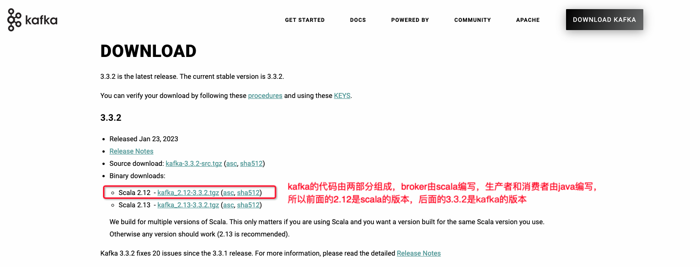
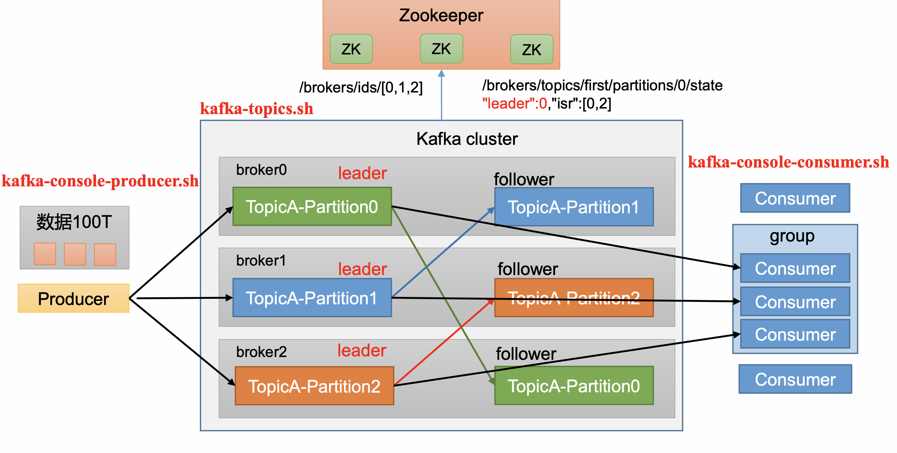

**<font style="color:#DF2A3F;">笔记来源：</font>**[**<font style="color:#DF2A3F;">【尚硅谷】Kafka3.x教程（从入门到调优，深入全面）</font>**](https://www.bilibili.com/video/BV1vr4y1677k?p=10&vd_source=e8046ccbdc793e09a75eb61fe8e84a30)

# 1 安装部署
官方下载地址：

[kafka下载地址](http://kafka.apache.org/downloads.html)



1. 解压安装包

```bash
[atguigu@hadoop102 software]$ tar -zxvf kafka_2.12-3.0.0.tgz -C /opt/module/
```

2. 修改解压后的文件名称

```bash
[atguigu@hadoop102  module]$ mv kafka_2.12-3.0.0/ kafka
```

3. 进入到/opt/module/kafka 目录，修改配置文件 

```bash
[atguigu@hadoop102 kafka]$ cd config/ 
[atguigu@hadoop102 config]$ vim server.properties
```

输入以下内容:

```properties
#broker 的全局唯一编号，不能重复，只能是数字。 
broker.id=0
#处理网络请求的线程数量 
num.network.threads=3
#用来处理磁盘 IO 的线程数量 
num.io.threads=8 
#发送套接字的缓冲区大小 
socket.send.buffer.bytes=102400
#接收套接字的缓冲区大小 
socket.receive.buffer.bytes=102400
#请求套接字的缓冲区大小
socket.request.max.bytes=104857600
#kafka 运行日志(数据)存放的路径，路径不需要提前创建，kafka 自动帮你创建，可以 配置多个磁盘路径，路径与路径之间可以用"，"分隔 
log.dirs=/opt/module/kafka/datas
#topic 在当前 broker 上的分区个数
num.partitions=1
#用来恢复和清理 data 下数据的线程数量 
num.recovery.threads.per.data.dir=1
# 1. 每个topic创建时的副本数，默认时1个副本 
offsets.topic.replication.factor=1
#segment 文件保留的最长时间，超时将被删除
log.retention.hours=168
#每个segment 文件的大小，默认最大 1G 
log.segment.bytes=1073741824
# 2. 检查过期数据的时间，默认5分钟检查一次是否数据过期 
log.retention.check.interval.ms=300000
#配置连接 Zookeeper 集群地址(在 zk 根目录下创建/kafka，方便管理)
zookeeper.connect=hadoop102:2181,hadoop103:2181,hadoop104:2181/kafka
```

4. 分发安装包
5. 分别在其他机器上修改配置文件`/opt/module/kafka/config/server.properties`中的`broker.id=1``broker.id=2`  
注：`broker.id`不得重复，整个集群中唯一。
6. 配置环境变量
    1. 在`vim ~/.bash_profile`文件中增加 kafka 环境变量配置 

```properties
#KAFKA_HOME
export KAFKA_HOME=/opt/module/kafka 
export PATH=

$$

$$

PATH:
$$

$$

KAFKA_HOME/bin
```

    2. 刷新一下环境变量。

```bash
[atguigu@hadoop102  module]$ source  ~/.bash_profile
```

    3. 分发环境变量文件到其他节点，并 source。
7. 启动集群
    1. 先启动 Zookeeper 集群，然后启动 Kafka。

```bash
admin@admindeMacBook-Pro-4 bin % sh zookeeper-server-start.sh -daemon ../config/zookeeper.properties
```

    2. 依次在三个节点上启动 Kafka。

```bash
[atguigu@hadoop102 kafka]$ bin/kafka-server-start.sh -daemon config/server.properties
[atguigu@hadoop103 kafka]$ bin/kafka-server-start.sh -daemon config/server.properties
[atguigu@hadoop104 kafka]$ bin/kafka-server-start.sh -daemon config/server.properties
```

注意:配置文件的路径要能够到 server.properties。 

8. 关闭集群

```bash
[atguigu@hadoop102 kafka]$ bin/kafka-server-stop.sh 
[atguigu@hadoop103 kafka]$ bin/kafka-server-stop.sh 
[atguigu@hadoop104 kafka]$ bin/kafka-server-stop.sh
```


**集群启停脚本**

1. 在`/home/atguigu/bin`目录下创建文件 `kf.sh` 脚本文件 

```bash
[atguigu@hadoop102  bin]$ vim kf.sh 
```

脚本如下: 

```bash
#! /bin/bash
case $1 in
"start"){
	for i in hadoop102 hadoop103 hadoop104 
	do
		echo " --------启动 $i Kafka-------"
		ssh $i "/opt/module/kafka/bin/kafka-server-start.sh - daemon /opt/module/kafka/config/server.properties"
	done 
};;
"stop"){
	for i in hadoop102 hadoop103 hadoop104 
	do
		echo " --------停止 $i Kafka-------"
		ssh $i "/opt/module/kafka/bin/kafka-server-stop.sh " 
	done
};; 
esac
```

2. 添加执行权限

```bash
[atguigu@hadoop102 bin]$ chmod +x kf.sh 
```

3. 启动集群命令

```bash
[atguigu@hadoop102 ~]$ kf.sh start 
```

4. 停止集群命令

```bash
[atguigu@hadoop102 ~]$ kf.sh stop 
```

<font style="color:#DF2A3F;">注意:停止 Kafka 集群时，一定要等 Kafka 所有节点进程全部停止后再停止 Zookeeper 集群。因为 Zookeeper 集群当中记录着 Kafka 集群相关信息，Zookeeper 集群一旦先停止， Kafka 集群就没有办法再获取停止进程的信息，只能手动杀死 Kafka 进程了。</font>

# 2 Kafka命令行操作 		
 <font style="color:rgb(100.000000%, 0.000000%, 0.000000%);">Kafka 基础架构 </font>

 			

 			 		

 	 



## 2.1 主题命令行操作
1）查看操作主题命令参数

```bash
[atguigu@hadoop102  kafka]$ bin/kafka-topics.sh 
```

| 参数 | 描述 |
| --- | --- |
| --bootstrap-server <String: server toconnect to> | 连接的 Kafka Broker 主机名称和端口号。  |
|  --topic <String: topic> | 操作的 topic 名称。 |
| --create | 创建主题。 |
| --delete | 删除主题。 |
| --alter | 修改主题。 |
| --list | 查看所有主题。 |
| --describe | 查看主题详细描述。 |
| --partitions <Integer: # of partitions>  | 设置分区数。 |
| --replication-factor<Integer: replication factor>  | 设置分区副本。 |
| --config <String: name=value> | 更新系统默认的配置。 |


2）查看当前服务器中的所有 topic

```bash
[atguigu@hadoop102 kafka]$ bin/kafka-topics.sh --bootstrap-server localhost:9092 --list
```

  
3）创建 first topic

```bash
[atguigu@hadoop102  kafka]$ bin/kafka-topics.sh --bootstrap-server localhost:9092 --create --partitions 1 --replication-factor 3 --topic first
```

选项说明:

+ --topic 定义topic 名
+ --replication-factor 定义副本数 
+ --partitions 定义分区数

4）查看 first 主题的详情

```bash
[atguigu@hadoop102  kafka]$ bin/kafka-topics.sh --bootstrap-server localhost:9092 --describe --topic first 
```

  
5）修改分区数(注意:分区数只能增加，不能减少)

```bash
[atguigu@hadoop102  kafka]$ bin/kafka-topics.sh --bootstrap-server localhost:9092 --alter --topic first --partitions 3 
```

  
6）再次查看 first 主题的详情

```bash
[atguigu@hadoop102  kafka]$ bin/kafka-topics.sh --bootstrap-server localhost:9092 --describe --topic first 
```

  
7）删除 topic(自己演示)

```bash
[atguigu@hadoop102  kafka]$ bin/kafka-topics.sh --bootstrap-server localhost:9092 --delete --topic first 
```

## 2.2 生产者命令行操作
1）查看操作生产者命令参数

```bash
[atguigu@hadoop102  kafka]$ bin/kafka-console-producer.sh 
```

| 参数 | 描述 |
| --- | --- |
| --bootstrap-server <String: server toconnect to>  | 连接的 Kafka Broker 主机名称和端口号。 |
| --topic <String: topic> | 操作的 topic 名称。 |


2）发送消息

```bash
[atguigu@hadoop102  kafka]$ bin/kafka-console-producer.sh --bootstrap-server localhost:9092 --topic first
>hello world
```

## 2.3 消费者命令行操作
1）查看操作消费者命令参数

```bash
[atguigu@hadoop102  kafka]$ bin/kafka-console-consumer.sh 
```

| 参数 | 描述 |
| --- | --- |
| --bootstrap-server <String: server toconnect to>  | 连接的 Kafka Broker 主机名称和端口号。 |
| --topic <String: topic> | 操作的 topic 名称。 |
| --from-beginning | 从头开始消费。 |
| --group <String: consumer group id> | 指定消费者组名称。 |


2）消费消息

消费 first 主题中的数据。

```bash
[atguigu@hadoop102 kafka]$ bin/kafka-console-consumer.sh --bootstrap-server localhost:9092 --topic first
```

  
把主题中所有的数据都读取出来(包括历史数据)。

```bash
[atguigu@hadoop102 kafka]$ bin/kafka-console-consumer.sh --bootstrap-server localhost:9092 --from-beginning --topic first
```

