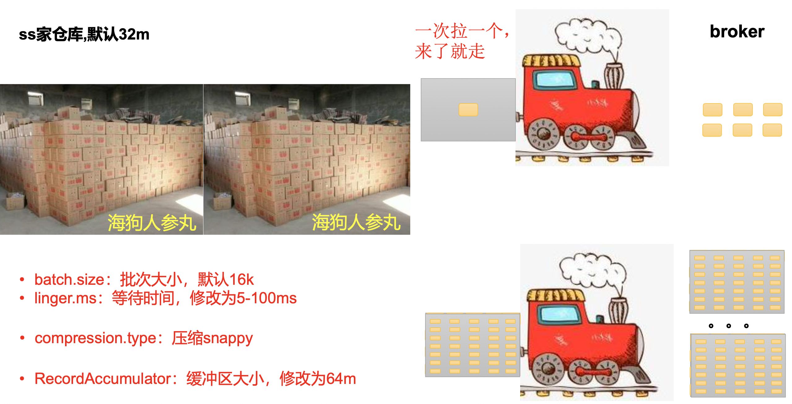

**<font style="color:#DF2A3F;">笔记来源：</font>**[**<font style="color:#DF2A3F;">【尚硅谷】Kafka3.x教程（从入门到调优，深入全面）</font>**](https://www.bilibili.com/video/BV1vr4y1677k?p=10&vd_source=e8046ccbdc793e09a75eb61fe8e84a30) 	 	 		

# 1 生产者消息发送流程 
## 1.1 发送原理 
在消息发送的过程中，涉及到了<font style="color:rgb(100.000000%, 0.000000%, 0.000000%);">两个线程——</font>**<font style="color:rgb(100.000000%, 0.000000%, 0.000000%);">main </font>**<font style="color:rgb(100.000000%, 0.000000%, 0.000000%);">线程和 </font>**<font style="color:rgb(100.000000%, 0.000000%, 0.000000%);">Sender </font>**<font style="color:rgb(100.000000%, 0.000000%, 0.000000%);">线程</font>。在 main 线程 中创建了<font style="color:rgb(100.000000%, 0.000000%, 0.000000%);">一个双端队列 </font>**<font style="color:rgb(100.000000%, 0.000000%, 0.000000%);">RecordAccumulator</font>**。main 线程将消息发送给 RecordAccumulator， Sender 线程不断从 RecordAccumulator 中拉取消息发送到 Kafka Broker。 


## 1.2 生产者重要参数列表 
| 参数名称  | 描述  |
| --- | --- |
| bootstrap.servers  | 生产者连接集群所需的 broker 地址清单。例如 hadoop102:9092,hadoop103:9092,hadoop104:9092，可以 设置 1 个或者多个，中间用逗号隔开。注意这里并非需要所有的 broker 地址，因为生产者从给定的 broker 里查找到其他 broker 信息。 |
| key.serializer 和 value.serializer | 指定发送消息的 key 和 value 的序列化类型。一定要写全类名。  |
| buffer.memory  | RecordAccumulator 缓冲区总大小，<font style="color:rgb(100.000000%, 0.000000%, 0.000000%);">默认 32m。 </font> |
| batch.size | 缓冲区一批数据最大值，<font style="color:rgb(100.000000%, 0.000000%, 0.000000%);">默认 16k</font>。适当增加该值，可 以提高吞吐量，但是如果该值设置太大，会导致数据 传输延迟增加。 |
| linger.ms | 如果数据迟迟未达到 batch.size，sender 等待 linger.time 之后就会发送数据。单位 ms，<font style="color:rgb(100.000000%, 0.000000%, 0.000000%);">默认值是 0ms</font>，表示没 有延迟。生产环境建议该值大小为 5-100ms 之间。  |
| acks  | 0:生产者发送过来的数据，不需要等数据落盘应答。 1:生产者发送过来的数据，Leader 收到数据后应答。 -1(all):生产者发送过来的数据，Leader+和 isr 队列 里面的所有节点收齐数据后应答。<font style="color:rgb(100.000000%, 0.000000%, 0.000000%);">默认值是-1，-1 和 all 是等价的。</font> |
| max.in.flight.requests.per.connection  | 允许最多没有返回 ack 的次数，<font style="color:rgb(100.000000%, 0.000000%, 0.000000%);">默认为 5</font>，开启幂等性 要保证该值是 1-5 的数字。  |
| retries  | 当消息发送出现错误的时候，系统会重发消息。retries 表示重试次数。<font style="color:rgb(100.000000%, 0.000000%, 0.000000%);">默认是 int 最大值，2147483647。 </font>如果设置了重试，还想保证消息的有序性，需要设置 MAX_IN_FLIGHT_REQUESTS_PER_CONNECTION=1 否则在重试此失败消息的时候，其他的消息可能发送成功了。  |
| retry.backoff.ms | 两次重试之间的时间间隔，默认是 100ms。 |
|  enable.idempotence  | 是否开启幂等性，<font style="color:rgb(100.000000%, 0.000000%, 0.000000%);">默认 true</font>，开启幂等性。  |
| compression.type | 生产者发送的所有数据的压缩方式。<font style="color:rgb(100.000000%, 0.000000%, 0.000000%);">默认是 none</font>，也 就是不压缩。 支持压缩类型:<font style="color:rgb(100.000000%, 0.000000%, 0.000000%);">none、gzip、snappy、lz4 和 zstd。 </font> |


# 2 异步发送API 
## 2.1 普通异步发送
需求:创建 Kafka 生产者，采用异步的方式发送到 Kafka Broker  
<font style="color:rgb(100.000000%, 0.000000%, 0.000000%);">异步发送流程 </font>


代码编写 

导入依赖 

```xml
<dependencies>
     <dependency>
					<groupId>org.apache.kafka</groupId> 
       		kafka-clients</artifactId> 
       		<version>3.0.0</version>
     </dependency>
</dependencies>
```

创建包名:`com.atguigu.kafka.producer` 

写不带回调函数的 API 代码 

```java
package com.atguigu.kafka.producer;

import org.apache.kafka.clients.producer.KafkaProducer; 
import org.apache.kafka.clients.producer.ProducerRecord;
import java.util.Properties;

public class CustomProducer {
	public static void main(String[] args) throws InterruptedException {
		// 1. 创建 kafka 生产者的配置对象
		Properties properties = new Properties();
		// 2. 给 kafka 配置对象添加配置信息:bootstrap.servers
		properties.put(ProducerConfig.BOOTSTRAP_SERVERS_CONFIG, "hadoop102:9092");
		// key,value 序列化(必须):key.serializer，value.serializer
    	properties.put(ProducerConfig.KEY_SERIALIZER_CLASS_CONFIG, "org.apache.kafka.common.serialization.StringSerializer");
		properties.put(ProducerConfig.VALUE_SERIALIZER_CLASS_CONFIG, "org.apache.kafka.common.serialization.StringSerializer");
		// 3. 创建 kafka 生产者对象
		KafkaProducer<String, String> kafkaProducer = new KafkaProducer<String, String>(properties);
		// 4. 调用 send 方法,发送消息 
        for (int i = 0; i < 5; i++) {
			kafkaProducer.send(new ProducerRecord<>("first","atguigu " + i));
		}
		// 5. 关闭资源
        kafkaProducer.close();
    }
}
```

测试：

开启 Kafka 消费者。 

```bash
[atguigu@hadoop103 kafka]$ bin/kafka-console-consumer.sh -- bootstrap-server hadoop102:9092 --topic first
```

观察控制台中是否接收到消息。 

## 2.2 带回调函数的异步发送 
回调函数会在 producer 收到 ack 时调用，为异步调用，该方法有两个参数，分别是元 数据信息(RecordMetadata)和异常信息(Exception)，如果 Exception 为 null，说明消息发 送成功，如果 Exception 不为 null，说明消息发送失败。 

 <font style="color:rgb(100.000000%, 0.000000%, 0.000000%);">注意:消息发送失败会自动重试，不需要我们在回调函数中手动重试。 </font>

代码如下：

```java
package com.atguigu.kafka.producer;

import org.apache.kafka.clients.producer.*; 
import java.util.Properties;

public class CustomProducerCallback {
	public static void main(String[] args) throws InterruptedException {
		// 1. 创建 kafka 生产者的配置对象
		Properties properties = new Properties();
		// 2. 给 kafka 配置对象添加配置信息
		properties.put(ProducerConfig.BOOTSTRAP_SERVERS_CONFIG, "hadoop102:9092");
		// key,value 序列化(必须):key.serializer，value.serializer
		properties.put(ProducerConfig.KEY_SERIALIZER_CLASS_CONFIG, StringSerializer.class.getName());
		properties.put(ProducerConfig.VALUE_SERIALIZER_CLASS_CONFIG, StringSerializer.class.getName());
		// 3. 创建 kafka 生产者对象
		KafkaProducer<String, String> kafkaProducer = new KafkaProducer<String, String>(properties);
		// 4. 调用 send 方法,发送消息 
        for (int i = 0; i < 5; i++) {
			// 添加回调
			kafkaProducer.send(new ProducerRecord<>("first", "atguigu " + i), new Callback() {
    			// 该方法在Producer收到ack时调用，为异步调用 
                @Override
				public void onCompletion(RecordMetadata metadata, Exception exception) {
					if (exception == null) {
						// 没有异常,输出信息到控制台 
                        System.out.println(" 主 题 : " + metadata.topic() + "->" + "分区:" + metadata.partition()); 
                    } else {
						// 出现异常打印 
                        exception.printStackTrace();
					} 
                }
			});
			// 延迟一会会看到数据发往不同分区
            Thread.sleep(2);
        }
		// 5. 关闭资源
        kafkaProducer.close();
    }
}
```

测试:  
开启 Kafka 消费者。 

```java
[atguigu@hadoop103 kafka]$ bin/kafka-console-consumer.sh -- bootstrap-server hadoop102:9092 --topic first
```

观察控制台中是否接收到消息。 在 IDEA 控制台观察回调信息。 					 					 				

# 3 同步发送API 
<font style="color:rgb(100.000000%, 0.000000%, 0.000000%);">同步发送流程 </font>


只需在异步发送的基础上，再调用一下`get()`方法即可。 

代码如下：

```java
package com.atguigu.kafka.producer;

import org.apache.kafka.clients.producer.KafkaProducer; 
import org.apache.kafka.clients.producer.ProducerConfig; 
import org.apache.kafka.clients.producer.ProducerRecord; 
import java.util.Properties;
import java.util.concurrent.ExecutionException; 

public class CustomProducerSync {
	public static void main(String[] args) throws InterruptedException, ExecutionException {
		// 1. 创建 kafka 生产者的配置对象
		Properties properties = new Properties();
		// 2. 给 kafka 配置对象添加配置信息 
        properties.put(ProducerConfig.BOOTSTRAP_SERVERS_CONFIG,"hadoop102:9092");
		properties.put(ProducerConfig.KEY_SERIALIZER_CLASS_CONFIG, StringSerializer.class.getName());
		properties.put(ProducerConfig.VALUE_SERIALIZER_CLASS_CONFIG, StringSerializer.class.getName());
		// 3. 创建 kafka 生产者对象
		KafkaProducer<String, String> kafkaProducer = new KafkaProducer<String, String>(properties);
    	// 4. 调用 send 方法,发送消息
		for (int i = 0; i < 10; i++) {
			// 异步发送 默认
			// kafkaProducer.send(new ProducerRecord<>("first","kafka" + i));
			// 同步发送
			kafkaProducer.send(new ProducerRecord<>("first","kafka" + i)).get();
		}
		// 5. 关闭资源
        kafkaProducer.close();
    }
}
```

测试：  
开启 Kafka 消费者。 

```java
[atguigu@hadoop103 kafka]$ bin/kafka-console-consumer.sh -- bootstrap-server hadoop102:9092 --topic first
```

在 IDEA 中执行代码，观察控制台中是否接收到消息。 

# 4 生产者分区 
## 4.1 分区好处 
<font style="color:rgb(100.000000%, 0.000000%, 0.000000%);">Kafka 分区好处</font>

+ <font style="color:rgb(100.000000%, 0.000000%, 0.000000%);">便于合理使用存储资源</font>，每个Partition在一个Broker上存储，可以把海量的数据按照分区切割成一块一块数据存储在多台Broker上。合理控制分区的任务，可以实现<font style="color:rgb(100.000000%, 0.000000%, 0.000000%);">负载均衡</font>的效果。 
+ <font style="color:rgb(100.000000%, 0.000000%, 0.000000%);">提高并行度</font>，生产者可以以分区为单位<font style="color:rgb(100.000000%, 0.000000%, 0.000000%);">发送数据</font>;消费者可以以分区为单位进行<font style="color:rgb(100.000000%, 0.000000%, 0.000000%);">消费数据</font>。 

			 					 				

## 4.2 生产者发送消息的分区策略 
1）默认的分区器DefaultPartitioner 

全局查找 DefaultPartitioner类。 

```java
/**
 * The default partitioning strategy:
 * If a partition is specified in the record, use it
 * If no partition is specified but a key is present choose a partition based on a hash of the key
 * If no partition or key is present choose the sticky partition that changes when the batch is full. See KIP-480 for details about sticky partitioning.
 */
public class DefaultPartitioner implements Partitioner {
    ...
}
```

在**IDEA**中全局查找**<font style="color:rgb(100.000000%, 0.000000%, 0.000000%);">ProducerRecord</font>**<font style="color:rgb(100.000000%, 0.000000%, 0.000000%);">类，在类中可以看到如下构造方法: </font>

```java
//指明partition的情况下，直接将指明的值作为partition值; 例如partition=0，所有数据写入分区0
public ProducerRecord(String topic, Integer partition, Long timestamp, K key, V value, Iterable<Header> headers) {
    if (topic == null)
        throw new IllegalArgumentException("Topic cannot be null.");
    if (timestamp != null && timestamp < 0)
        throw new IllegalArgumentException(
            String.format("Invalid timestamp: %d. Timestamp should always be non-negative or null.", timestamp));
    if (partition != null && partition < 0)
        throw new IllegalArgumentException(
            String.format("Invalid partition: %d. Partition number should always be non-negative or null.", partition));
    this.topic = topic;
    this.partition = partition;
    this.key = key;
    this.value = value;
    this.timestamp = timestamp;
    this.headers = new RecordHeaders(headers);
}

//指明partition的情况下，直接将指明的值作为partition值; 例如partition=0，所有数据写入分区0
public ProducerRecord(String topic, Integer partition, Long timestamp, K key, V value) {
    this(topic, partition, timestamp, key, value, null);
}


//指明partition的情况下，直接将指明的值作为partition值; 例如partition=0，所有数据写入分区0
public ProducerRecord(String topic, Integer partition, K key, V value, Iterable<Header> headers) {
    this(topic, partition, null, key, value, headers);
}


//指明partition的情况下，直接将指明的值作为partition值; 例如partition=0，所有数据写入分区0
public ProducerRecord(String topic, Integer partition, K key, V value) {
    this(topic, partition, null, key, value, null);
}

//没有指明partition值但有key的情况下，将key的hash值与topic的 partition数进行取余得到partition值; 
//例如:key1的hash值=5， key2的hash值=6 ，topic的partition数=2，那 么key1 对应的value1写入1号分区，key2对应的value2写入0号分区。
public ProducerRecord(String topic, K key, V value) {
    this(topic, null, null, key, value, null);
}


//既没有partition值又没有key值的情况下，Kafka采用Sticky Partition(黏性分区器)，会随机选择一个分区，并尽可能一直使用该分区，待该分区的batch已满或者已完成，Kafka再随机一个分区进行使用(和上一次的分区不同)。
//例如:第一次随机选择0号分区，等0号分区当前批次满了(默认16k)或者linger.ms设置的时间到， Kafka再随机一个分区进行使用(如果还是0会继续随机)。
public ProducerRecord(String topic, V value) {
    this(topic, null, null, null, value, null);
}

```

**2**）案例一  
<font style="color:rgb(100.000000%, 0.000000%, 0.000000%);">将数据发往指定 partition 的情况</font>下，例如，将所有数据发往分区0中。 

```java
package com.cg.kafka.producer;

import org.apache.kafka.clients.producer.*;
import org.apache.kafka.clients.producer.internals.DefaultPartitioner;
import org.apache.kafka.common.serialization.StringSerializer;

import java.util.Properties;

public class CustomProducerCallbackPartitions {
    public static void main(String[] args) {

        // 1. 创建 kafka 生产者的配置对象
        Properties properties = new Properties();
        // 2. 给 kafka 配置对象添加配置信息
        properties.put(ProducerConfig.BOOTSTRAP_SERVERS_CONFIG,"localhost:9092 ");
        properties.put(ProducerConfig.KEY_SERIALIZER_CLASS_CONFIG, StringSerializer.class.getName());
        properties.put(ProducerConfig.VALUE_SERIALIZER_CLASS_CONFIG, StringSerializer.class.getName());
        // key,value 序列化(必须):key.serializer，value.serializer
        KafkaProducer<String, String> kafkaProducer = new KafkaProducer<>(properties);
        for (int i = 0; i < 5; i++) {
            // 指定数据发送到 1 号分区，key 为空(IDEA 中 ctrl + p 查看参数)
            kafkaProducer.send(new ProducerRecord<>("first", 0, "", "atguigu " + i), new Callback() {
                    @Override
                    public void onCompletion (RecordMetadata metadata, Exception e){
                    if (e == null) {
                        System.out.println(" 主 题 : " + metadata.topic() + "->" + "分区:" + metadata.partition());
                    } else {
                        e.printStackTrace();
                    }
                }
            });
        }
        kafkaProducer.close();
    }
}

```

测试：  
开启 Kafka 消费者。 在 IDEA 中执行代码，观察cmd控制台中是否接收到消息。 在 IDEA 控制台观察回调信息。

```java
主 题 : first->分区:0
主 题 : first->分区:0
主 题 : first->分区:0
主 题 : first->分区:0
主 题 : first->分区:0
```

**3**）案例二  
<font style="color:rgb(100.000000%, 0.000000%, 0.000000%);">没有指明 partition 值但有 key 的情况下</font>，将 key 的 hash 值与 topic 的 partition 数进行取 余得到 partition 值。 

```java
admin@admindeMacBook-Pro-4 bin % ./kafka-topics.sh --bootstrap-server localhost:9092 --describe --topic first        
Topic: first	TopicId: BKafZminSX6KZf_HhIncXQ	PartitionCount: 3	ReplicationFactor: 1	Configs: 
	Topic: first	Partition: 0	Leader: 0	Replicas: 0	Isr: 0
	Topic: first	Partition: 1	Leader: 0	Replicas: 0	Isr: 0
	Topic: first	Partition: 2	Leader: 0	Replicas: 0	Isr: 0
```

```java
package com.cg.kafka.producer;

import org.apache.kafka.clients.producer.*;
import org.apache.kafka.clients.producer.internals.DefaultPartitioner;
import org.apache.kafka.common.serialization.StringSerializer;

import java.util.Properties;

public class CustomProducerCallbackPartitions {
    public static void main(String[] args) {

        // 1. 创建 kafka 生产者的配置对象
        Properties properties = new Properties();
        // 2. 给 kafka 配置对象添加配置信息
        properties.put(ProducerConfig.BOOTSTRAP_SERVERS_CONFIG,"localhost:9092 ");
        properties.put(ProducerConfig.KEY_SERIALIZER_CLASS_CONFIG, StringSerializer.class.getName());
        properties.put(ProducerConfig.VALUE_SERIALIZER_CLASS_CONFIG, StringSerializer.class.getName());
        // key,value 序列化(必须):key.serializer，value.serializer
        KafkaProducer<String, String> kafkaProducer = new KafkaProducer<>(properties);
        for (int i = 0; i < 5; i++) {
            // 指定数据发送到 1 号分区，key 为空(IDEA 中 ctrl + p 查看参数)
            kafkaProducer.send(new ProducerRecord<>("first",  "b", "atguigu " + i), new Callback() {
                    @Override
                    public void onCompletion (RecordMetadata metadata, Exception e){
                    if (e == null) {
                        System.out.println(" 主 题 : " + metadata.topic() + "->" + "分区:" + metadata.partition());
                    } else {
                        e.printStackTrace();
                    }
                }
            });
        }
        kafkaProducer.close();
    }
}

```

测试：

1. key="a"时，在控制台查看结果。 

```java
主 题 : first->分区:1
主 题 : first->分区:1
主 题 : first->分区:1
主 题 : first->分区:1
主 题 : first->分区:1
```

2. key="b"时，在控制台查看结果。 

```java
主 题 : first->分区:2
主 题 : first->分区:2
主 题 : first->分区:2
主 题 : first->分区:2
主 题 : first->分区:2
```

3. key="f"时，在控制台查看结果。 

```java
主 题 : first->分区:0
主 题 : first->分区:0
主 题 : first->分区:0
主 题 : first->分区:0
主 题 : first->分区:0
```

## 4.3 自定义分区器 
需求：例如我们实现一个分区器实现，发送过来的数据中如果包含 atguigu，就发往 0 号分区， 不包含 atguigu，就发往 1 号分区。 ****

实现步骤 ：

1. 定义类实现 Partitioner 接口。 
2. 重写 partition()方法。 

```java
package com.cg.kafka.producer;

import org.apache.kafka.clients.producer.Partitioner;
import org.apache.kafka.common.Cluster;

import java.util.Map;

/**
 * 1. 实现接口Partitioner
 * 2. 实现 3 个方法:partition,close,configure
 * 3. 编写 partition 方法,返回分区号
 */
public class MyPartitioner implements Partitioner {
    /**
     * 返回信息对应的分区
     * @param topic         主题
     * @param key           消息的 key
     * @param keyBytes      消息的 key 序列化后的字节数组
     * @param value         消息的 value
     * @param valueBytes    消息的 value 序列化后的字节数组
     * @param cluster       集群元数据可以查看分区信息
     * @return
     */
    @Override
    public int partition(String topic, Object key, byte[] keyBytes, Object value, byte[] valueBytes, Cluster cluster) {
        // 获取消息
        String msgValue = value.toString();
        // 创建partition
        int partition;
        // 判断消息是否包含atguigu
        if (msgValue.contains("atguigu")) {
            partition = 0;
        } else {
            partition = 1;
        }
        // 返回分区号
        return partition;
    }

    // 关闭资源
    @Override
    public void close() {
    }

    // 配置方法 @Override
    public void configure(Map<String, ?> configs) {
    }
}

```

```java
package com.cg.kafka.producer;

import org.apache.kafka.clients.producer.*;
import org.apache.kafka.clients.producer.internals.DefaultPartitioner;
import org.apache.kafka.common.serialization.StringSerializer;

import java.util.Properties;

public class CustomProducerCallbackPartitions {
    public static void main(String[] args) {

        // 1. 创建 kafka 生产者的配置对象
        Properties properties = new Properties();
        // 2. 给 kafka 配置对象添加配置信息
        properties.put(ProducerConfig.BOOTSTRAP_SERVERS_CONFIG,"localhost:9092 ");
        properties.put(ProducerConfig.KEY_SERIALIZER_CLASS_CONFIG, StringSerializer.class.getName());
        properties.put(ProducerConfig.VALUE_SERIALIZER_CLASS_CONFIG, StringSerializer.class.getName());
        // 添加自定义分区器
        properties.put(ProducerConfig.PARTITIONER_CLASS_CONFIG,"com.cg.kafka.producer.MyPartitioner");
        // key,value 序列化(必须):key.serializer，value.serializer
        KafkaProducer<String, String> kafkaProducer = new KafkaProducer<>(properties);
        for (int i = 0; i < 5; i++) {
            // 指定数据发送到 1 号分区，key 为空(IDEA 中 ctrl + p 查看参数)
            kafkaProducer.send(new ProducerRecord<>("first",  "atguigu " + i), new Callback() {
                    @Override
                    public void onCompletion (RecordMetadata metadata, Exception e){
                    if (e == null) {
                        System.out.println(" 主 题 : " + metadata.topic() + "->" + "分区:" + metadata.partition());
                    } else {
                        e.printStackTrace();
                    }
                }
            });
        }
        kafkaProducer.close();
    }
}

```

在 IDEA 控制台观察回调信息。 

```java
 主 题 : first->分区:0
 主 题 : first->分区:0
 主 题 : first->分区:0
 主 题 : first->分区:0
 主 题 : first->分区:0
```

				 				

# 5 生产者如何提高吞吐量 
<font style="color:rgb(100.000000%, 0.000000%, 0.000000%);">生产经验——生产者如何提高吞吐量 </font>

	

这是一个双刃剑，提高了吞吐量，但是同时也提高了数据的延迟

代码如下：

```java
package com.atguigu.kafka.producer;

import org.apache.kafka.clients.producer.KafkaProducer; 
import org.apache.kafka.clients.producer.ProducerRecord;
import java.util.Properties;

public class CustomProducerParameters {
	public static void main(String[] args) throws InterruptedException {
		// 1. 创建 kafka 生产者的配置对象
		Properties properties = new Properties();
		// 2. 给 kafka 配置对象添加配置信息:bootstrap.servers
		properties.put(ProducerConfig.BOOTSTRAP_SERVERS_CONFIG, "hadoop102:9092");
		// key,value 序列化(必须):key.serializer，value.serializer
		properties.put(ProducerConfig.KEY_SERIALIZER_CLASS_CONFIG, "org.apache.kafka.common.serialization.StringSerializer");
		properties.put(ProducerConfig.VALUE_SERIALIZER_CLASS_CONFIG, "org.apache.kafka.common.serialization.StringSerializer");
		// batch.size:批次大小，默认16K 
        properties.put(ProducerConfig.BATCH_SIZE_CONFIG, 16384);
		// linger.ms:等待时间，默认 0 
        properties.put(ProducerConfig.LINGER_MS_CONFIG, 1);
		// RecordAccumulator:缓冲区大小，默认 32M:buffer.memory 
        properties.put(ProducerConfig.BUFFER_MEMORY_CONFIG, 33554432);
		// compression.type:压缩，默认 none，可配置值 gzip、snappy、 lz4 和 zstd
		properties.put(ProducerConfig.COMPRESSION_TYPE_CONFIG,"snappy");
		// 3. 创建 kafka 生产者对象
		KafkaProducer<String, String> kafkaProducer = new KafkaProducer<String, String>(properties);
		// 4. 调用 send 方法,发送消息 
        for (int i = 0; i < 5; i++) {
			kafkaProducer.send(new ProducerRecord<>("first","atguigu " + i));
		}
		// 5. 关闭资源
        kafkaProducer.close();
    }
}
```

测试:  
在 hadoop102 上开启 Kafka 消费者。 

```bash
bin/kafka-console-consumer.sh -- bootstrap-server hadoop102:9092 --topic first
```

在 IDEA 中执行代码，观察生产者控制台中是否接收到消息。 

# 6 数据可靠性 
回顾发送流程 

 				 			

<font style="color:rgb(100.000000%, 0.000000%, 0.000000%);">ACK应答原理</font>


 	 	 		


思考：当ACK为-1时，Leader收到数据，所有Follower都开始同步数据， 但有一个Follower，因为某种故障，迟迟不能与Leader进行 同步，那这个问题怎么解决呢? 


**<font style="color:rgb(100.000000%, 0.000000%, 0.000000%);">可靠性总结: </font>**

+ **<font style="color:rgb(100.000000%, 0.000000%, 0.000000%);">acks=0</font>**<font style="color:rgb(100.000000%, 0.000000%, 0.000000%);">，生产者发送过来数据就不管了，可靠性差，效率高; </font>
+ **<font style="color:rgb(100.000000%, 0.000000%, 0.000000%);">acks=1</font>**<font style="color:rgb(100.000000%, 0.000000%, 0.000000%);">，生产者发送过来数据</font>**<font style="color:rgb(100.000000%, 0.000000%, 0.000000%);">Leader</font>**<font style="color:rgb(100.000000%, 0.000000%, 0.000000%);">应答，可靠性中等，效率中等; </font>
+ **<font style="color:rgb(100.000000%, 0.000000%, 0.000000%);">acks=-1</font>**<font style="color:rgb(100.000000%, 0.000000%, 0.000000%);">，生产者发送过来数据</font>**<font style="color:rgb(100.000000%, 0.000000%, 0.000000%);">Leader</font>**<font style="color:rgb(100.000000%, 0.000000%, 0.000000%);">和</font>**<font style="color:rgb(100.000000%, 0.000000%, 0.000000%);">ISR</font>**<font style="color:rgb(100.000000%, 0.000000%, 0.000000%);">队列里面所有</font>**<font style="color:rgb(100.000000%, 0.000000%, 0.000000%);">Follwer</font>**<font style="color:rgb(100.000000%, 0.000000%, 0.000000%);">应答，可靠性高，效率低; </font>

<font style="color:rgb(100.000000%, 0.000000%, 0.000000%);">在生产环境中，</font>**<font style="color:rgb(100.000000%, 0.000000%, 0.000000%);">acks=0</font>**<font style="color:rgb(100.000000%, 0.000000%, 0.000000%);">很少使用;</font>**<font style="color:rgb(100.000000%, 0.000000%, 0.000000%);">acks=1</font>**<font style="color:rgb(100.000000%, 0.000000%, 0.000000%);">，一般用于传输普通日志，允许丢个别数据;</font>**<font style="color:rgb(100.000000%, 0.000000%, 0.000000%);">acks=-1</font>**<font style="color:rgb(100.000000%, 0.000000%, 0.000000%);">，一般用于传输和钱相关的数据， 对可靠性要求比较高的场景。 </font>

 		

ACK为-1时候，还会引发一个数据重复问题

**<font style="color:rgb(100.000000%, 0.000000%, 0.000000%);">重复分析: </font>**


代码如下：

```java
package com.atguigu.kafka.producer;

import org.apache.kafka.clients.producer.KafkaProducer; 
import org.apache.kafka.clients.producer.ProducerRecord;
import java.util.Properties;

public class CustomProducerAck {
	public static void main(String[] args) throws InterruptedException {
		// 1. 创建 kafka 生产者的配置对象
		Properties properties = new Properties();
		// 2. 给 kafka 配置对象添加配置信息:bootstrap.servers
    	properties.put(ProducerConfig.BOOTSTRAP_SERVERS_CONFIG, "hadoop102:9092");
		// key,value 序列化(必须):key.serializer，value.serializer
		properties.put(ProducerConfig.KEY_SERIALIZER_CLASS_CONFIG, StringSerializer.class.getName());
		properties.put(ProducerConfig.VALUE_SERIALIZER_CLASS_CONFIG, StringSerializer.class.getName());
		// 设置acks，默认是all
        properties.put(ProducerConfig.ACKS_CONFIG, "all");
		// 重试次数retries，默认是int最大值，2147483647 
        properties.put(ProducerConfig.RETRIES_CONFIG, 3);
		// 3. 创建 kafka 生产者对象
		KafkaProducer<String, String> kafkaProducer = new KafkaProducer<String, String>(properties);
		// 4. 调用 send 方法,发送消息 
        for (int i = 0; i < 5; i++) {
			kafkaProducer.send(new ProducerRecord<>("first","atguigu " + i));
		}
		// 5. 关闭资源
        kafkaProducer.close();
    }
}
```

# 7 数据去重 
## 7.1 数据传递语义 
<font style="color:rgb(100.000000%, 0.000000%, 0.000000%);">数据传递语义 </font>

+ 至少一次(**AtLeastOnce**)= <font style="color:rgb(100.000000%, 0.000000%, 0.000000%);">ACK级别设置为-1  </font>**+  **<font style="color:rgb(100.000000%, 0.000000%, 0.000000%);">分区副本大于等于2  </font>**+ **<font style="color:rgb(100.000000%, 0.000000%, 0.000000%);">ISR里应答的最小副本数量大于等于2 </font>
+ 最多一次(**AtMostOnce**)**= **<font style="color:rgb(100.000000%, 0.000000%, 0.000000%);">ACK级别设置为0 </font>

总结：

+ At Least Once可以保证数据不丢失，但是<font style="color:rgb(100.000000%, 0.000000%, 0.000000%);">不能保证数据不重复; </font>
+ At Most Once可以保证数据不重复，但是<font style="color:rgb(100.000000%, 0.000000%, 0.000000%);">不能保证数据不丢失。 </font>

精确一次(**Exactly Once**)：对于一些非常重要的信息，比如和钱相关的数据，要求数据<font style="color:rgb(100.000000%, 0.000000%, 0.000000%);">既不能重复也不丢失</font>。 Kafka 0.11版本以后，引入了一项重大特性:<font style="color:rgb(100.000000%, 0.000000%, 0.000000%);">幂等性和事务。 </font>

## 7.2 幂等性 
<font style="color:rgb(100.000000%, 0.000000%, 0.000000%);">幂等性原理 </font>

幂等性就是指Producer不论向Broker发送多少次重复数据，Broker端都只会持久化一条，保证了不重复。 

精确一次(**Exactly Once**) **= **幂等性 **+ **至少一次( **ack=-1 + **分区副本数**>=2 + ISR**最小副本数量**>=2**) 。 

重复数据的判断标准：具有<font style="color:rgb(100.000000%, 0.000000%, 0.000000%);"><PID, Partition, SeqNumber></font>相同主键的消息提交时，Broker只会持久化一条。其中<font style="color:rgb(100.000000%, 0.000000%, 0.000000%);">PID是Kafka每次重启都会分配一个新的</font>；<font style="color:rgb(100.000000%, 0.000000%, 0.000000%);">Partition 表示分区号</font>；<font style="color:rgb(100.000000%, 0.000000%, 0.000000%);">Sequence Number是单调自增的。 </font>

所以幂等性只能保证的是在单分区单会话内不重复。


如何使用幂等性：开启参数`**enable.idempotence**`** **默认为`true`，`false`关闭。 

## 7.3 生产者事务 
Kafka 事务原理

<font style="color:rgb(100.000000%, 0.000000%, 0.000000%);">说明:开启事务，必须开启幂等性。 </font>  


Kafka 的事务一共有如下 5 个 API 

```java
// 1 初始化事务
void initTransactions(); 
// 2 开启事务
void beginTransaction() throws ProducerFencedException;
// 3 在事务内提交已经消费的偏移量(主要用于消费者)
void sendOffsetsToTransaction(Map<TopicPartition, OffsetAndMetadata> offsets, String consumerGroupId) throws ProducerFencedException; 
// 4 提交事务
void commitTransaction() throws ProducerFencedException; 
// 5 放弃事务(类似于回滚事务的操作)
void abortTransaction() throws ProducerFencedException;
```

单个 Producer，使用事务保证消息的仅一次发送 

```java
package com.atguigu.kafka.producer;

import org.apache.kafka.clients.producer.KafkaProducer; 
import org.apache.kafka.clients.producer.ProducerRecord;
import java.util.Properties;

public class CustomProducerTransactions {
	public static void main(String[] args) throws InterruptedException {
		// 1. 创建 kafka 生产者的配置对象
		Properties properties = new Properties();
		// 2. 给 kafka 配置对象添加配置信息 
        properties.put(ProducerConfig.BOOTSTRAP_SERVERS_CONFIG, "hadoop102:9092");
		// key,value 序列化
		properties.put(ProducerConfig.KEY_SERIALIZER_CLASS_CONFIG, StringSerializer.class.getName());
		properties.put(ProducerConfig.VALUE_SERIALIZER_CLASS_CONFIG, StringSerializer.class.getName());
		// 设置事务id(必须)，事务id任意起名
		properties.put(ProducerConfig.TRANSACTIONAL_ID_CONFIG, "transaction_id_0");
		// 3. 创建 kafka 生产者对象
		KafkaProducer<String, String> kafkaProducer = new KafkaProducer<String, String>(properties);
		// 初始化事务 
        kafkaProducer.initTransactions(); 
        // 开启事务 
        kafkaProducer.beginTransaction(); 
        try {
			// 4. 调用 send 方法,发送消息 
            for (int i = 0; i < 5; i++) {
				// 发送消息
				kafkaProducer.send(new ProducerRecord<>("first", "atguigu " + i));
				
			}
			// int i = 1 / 0; 
            // 提交事务
			kafkaProducer.commitTransaction();
		} catch (Exception e) { 
            // 终止事务
			kafkaProducer.abortTransaction(); 
        } finally {
			// 5. 关闭资源
    		kafkaProducer.close();
		}
	} 
}
```

# 8 数据有序 
<font style="color:rgb(100.000000%, 0.000000%, 0.000000%);">生产经验——数据有序 </font>

 				 	

# 9 数据乱序 
<font style="color:rgb(100.000000%, 0.000000%, 0.000000%);">生产经验——数据乱序 </font>

1. kafka在1.x版本之前保证数据单分区有序，条件如下: 

`**max.in.flight.requests.per.connection**=1`(不需要考虑是否开启幂等性)。 

2. kafka在1.x及以后版本保证数据单分区有序，条件如下: 
    1. 未开启幂等性 

`**max.in.flight.requests.per.connection**`需要设置为**1**。 

    2. 开启幂等性 

 	     `**max.in.flight.requests.per.connection**`需要设置小于等于**5**。 原因说明：因为在kafka1.x以后，启用幂等后，kafka服务端会缓存producer发来的最近5个request的元数据， 故无论如何，都可以保证最近5个request的数据都是有序的。 


