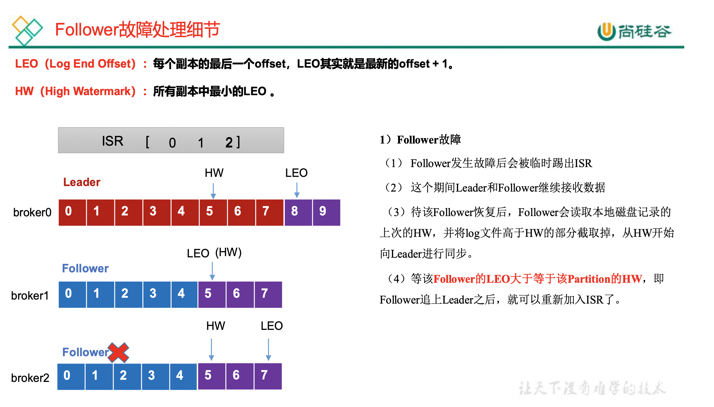
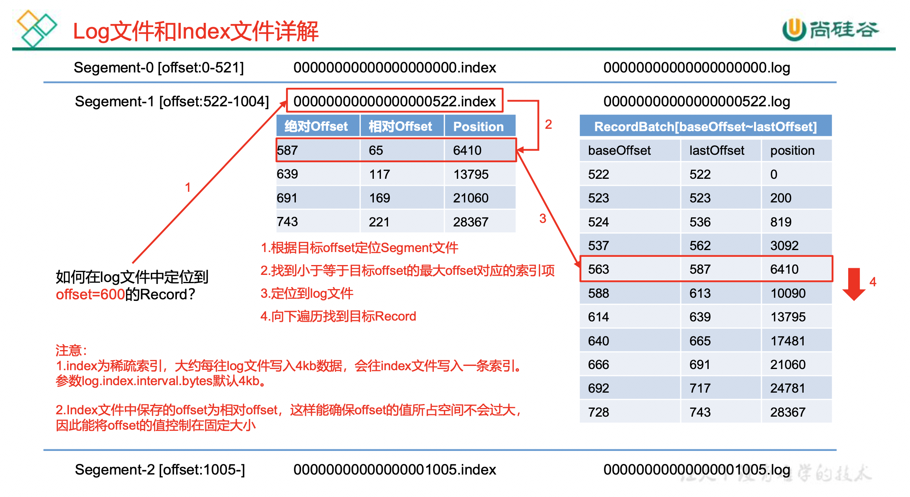
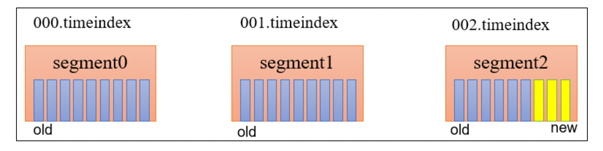

**<font style="color:#DF2A3F;">笔记来源：</font>**[**<font style="color:#DF2A3F;">【尚硅谷】Kafka3.x教程（从入门到调优，深入全面）</font>**](https://www.bilibili.com/video/BV1vr4y1677k?p=10&vd_source=e8046ccbdc793e09a75eb61fe8e84a30)

# 1 Broker工作流程
## 1.1 Zookeeper存储的Kafka信息
1. 启动 Zookeeper 客户端。

```java
bin/zkCli.sh
```

2. 通过 ls 命令可以查看 kafka 相关信息。

```java
ls /kafka
```

	 	 		

## 1.2 Kafka Broker总体工作流程 
模拟 Kafka 上下线，Zookeeper 中数据变化 

1. 查看/kafka/brokers/ids 路径上的节点。

```java
[zk: localhost:2181(CONNECTED) 2] ls /kafka/brokers/ids
[0, 1, 2]
```

2.  查看/kafka/controller 路径上的数据。

```java
[zk: localhost:2181(CONNECTED) 15] get /kafka/controller 
{"version":1,"brokerid":0,"timestamp":"1637292471777"}
```

3. 查看/kafka/brokers/topics/first/partitions/0/state 路径上的数据。

```java
[zk: localhost:2181(CONNECTED) 16] get /kafka/brokers/topics/first/partitions/0/state
{"controller_epoch":24,"leader":0,"version":1,"leader_epoch":18," isr":[0,1,2]}
```

4. 停止 hadoop104 上的 kafka。

```java
[atguigu@hadoop104  kafka]$ bin/kafka-server-stop.sh 
```

5. 再次查看/kafka/brokers/ids 路径上的节点。

```java
[zk: localhost:2181(CONNECTED) 3] ls /kafka/brokers/ids
[0, 1]
```

6. 再次查看/kafka/controller 路径上的数据。

```java
[zk: localhost:2181(CONNECTED) 15] get /kafka/controller 
{"version":1,"brokerid":0,"timestamp":"1637292471777"}
```

7. 再次查看/kafka/brokers/topics/first/partitions/0/state 路径上的数据。

```java
[zk: localhost:2181(CONNECTED) 16] get /kafka/brokers/topics/first/partitions/0/state
{"controller_epoch":24,"leader":0,"version":1,"leader_epoch":18," isr":[0,1]}
```

8. 启动 hadoop104 上的 kafka。

```java
[atguigu@hadoop104  kafka]$ bin/kafka-server-start.sh - daemon ./config/server.properties 
```

9. 再次观察1,2,3步骤中的内容。 

## 1.3 Broker重要参数
| 参数名称 | 描述 |
| --- | --- |
| <font style="background-color:rgb(100.000000%, 100.000000%, 100.000000%);">replica.lag.time.max.ms </font> | <font style="background-color:rgb(100.000000%, 100.000000%, 100.000000%);">ISR 中，如果 Follower 长时间未向 Leader 发送通 信请求或同步数据，则该 Follower 将被踢出 ISR。 该时间阈值，</font><font style="color:rgb(100.000000%, 0.000000%, 0.000000%);background-color:rgb(100.000000%, 100.000000%, 100.000000%);">默认30s。 </font>  |
| auto.leader.rebalance.enable | 默认是 true。 自动 Leader Partition 平衡。 |
| leader.imbalance.per.broker.percentage | 默认是 10%。每个 broker 允许的不平衡的 leader 的比率。如果每个 broker 超过了这个值，控制器会触发 leader 的平衡。 |
| leader.imbalance.check.interval.seconds | 默认值 300 秒。检查 leader 负载是否平衡的间隔时 间。 |
| log.segment.bytes | Kafka 中 log 日志是分成一块块存储的，此配置是指 log 日志划分成块的大小，默认值 1G。 |
| log.index.interval.bytes | 默认 4kb，kafka 里面每当写入了 4kb 大小的日志 (.log)，然后就往 index 文件里面记录一个索引。 |
| log.retention.hours | Kafka 中数据保存的时间，默认 7 天。 |
| log.retention.minutes  | Kafka 中数据保存的时间，分钟级别，默认关闭。 |
| log.retention.ms | Kafka 中数据保存的时间，毫秒级别，默认关闭。 |
| log.retention.check.interval.ms | 检查数据是否保存超时的间隔，默认是5分钟。 |
| log.retention.bytes | 默认等于-1，表示无穷大。超过设置的所有日志总大小，删除最早的segment。 |
| log.cleanup.policy | 默认是 delete，表示所有数据启用删除策略; 如果设置值为 compact，表示所有数据启用压缩策略。 |
| num.io.threads | 默认是 8。负责写磁盘的线程数。整个参数值要占总核数的 50%。 |
| num.replica.fetchers | 副本拉取线程数，这个参数占总核数的 50%的 1/3。 |
| num.network.threads | 默认是 3。数据传输线程数，这个参数占总核数的 50%的 2/3 。 |
| log.flush.interval.messages | 强制页缓存刷写到磁盘的条数，默认是 long 的最大值，9223372036854775807。一般不建议修改， 交给系统自己管理。 |
| log.flush.interval.ms | 每隔多久，刷数据到磁盘，默认是 null。一般不建议修改，交给系统自己管理。 |


# 2 节点服役和退役 
## 2.1 服役新节点
1. 新节点准备
    1. 关闭 hadoop104，并右键执行克隆操作。 
    2. 开启 hadoop105，并修改 IP 地址。

```java
[root@hadoop104  ~]# vim /etc/sysconfig/network-scripts/ifcfg- ens33 
DEVICE=ens33
TYPE=Ethernet
ONBOOT=yes
BOOTPROTO=static
NAME="ens33"
IPADDR=192.168.10.105
PREFIX=24
GATEWAY=192.168.10.2
DNS1=192.168.10.2
```

    3. 在 hadoop105 上，修改主机名称为 hadoop105。

```java
[root@hadoop104  ~]# vim /etc/hostname 
hadoop105
```

    4. 重新启动 hadoop104、hadoop105。
    5. 修改 haodoop105 中 kafka 的 broker.id 为 3。
    6. 删除 hadoop105 中 kafka 下的 datas 和 logs。 

```java
[atguigu@hadoop105  kafka]$ rm -rf datas/  logs/
```

    7. 启动 hadoop102、hadoop103、hadoop104 上的 kafka 集群。

```java
[atguigu@hadoop102  ~]$ zk.sh start 
[atguigu@hadoop102  ~]$ kf.sh start 
```

    8. 单独启动 hadoop105 中的 kafka。

```java
[atguigu@hadoop105  kafka]$ bin/kafka-server-start.sh - daemon ./config/server.properties 
```

2. 执行负载均衡操作
    1. 创建一个要均衡的主题。

```java
[atguigu@hadoop102  kafka]$ vim topics-to-move.json 
{
	"topics": [
		{"topic": "first"}
	],
	"version": 1
}
```

    2. 生成一个负载均衡的计划。

```bash
[atguigu@hadoop102  kafka]$ bin/kafka-reassign-partitions.sh --bootstrap-server hadoop102:9092 --topics-to-move-json-file topics-to-move.json --broker-list "0,1,2,3" --generate
```

    3. 创建副本存储计划(所有副本存储在 broker0、broker1、broker2、broker3 中)。 

```java
[atguigu@hadoop102  kafka]$ vim increase-replication-factor.json
输入如下内容:
{"version":1,"partitions":[{"topic":"first","partition":0,"replic as":[2,3,0],"log_dirs":["any","any","any"]},{"topic":"first","par tition":1,"replicas":[3,0,1],"log_dirs":["any","any","any"]},{"to pic":"first","partition":2,"replicas":[0,1,2],"log_dirs":["any"," any","any"]}]}
```

    4. 执行副本存储计划。

```bash
[atguigu@hadoop102  kafka]$ bin/kafka-reassign-partitions.sh --bootstrap-server hadoop102:9092 --reassignment-json-file increase-replication-factor.json --execute 
```

    5. 验证副本存储计划。

```bash
[atguigu@hadoop102  kafka]$ bin/kafka-reassign-partitions.sh --bootstrap-server hadoop102:9092 --reassignment-json-file increase-replication-factor.json --verify
```

## 2.2 退役旧节点
1. 执行负载均衡操作 

先按照退役一台节点，生成执行计划，然后按照服役时操作流程执行负载均衡。 

    1. 创建一个要均衡的主题。

```bash
[atguigu@hadoop102  kafka]$ vim topics-to-move.json 
{
	"topics": [
		{"topic": "first"}
	],
	"version": 1
}
```

    2. 创建执行计划。

```bash
[atguigu@hadoop102  kafka]$ bin/kafka-reassign-partitions.sh --bootstrap-server hadoop102:9092 --topics-to-move-json-file topics-to-move.json --broker-list "0,1,2" --generate 
```

    3. 创建副本存储计划(所有副本存储在 broker0、broker1、broker2 中)。

```bash
[atguigu@hadoop102  kafka]$ vim increase-replication-factor.json 

输入以下内容：
{"version":1,"partitions":[{"topic":"first","partition":0,"replic as":[2,0,1],"log_dirs":["any","any","any"]},{"topic":"first","par tition":1,"replicas":[0,1,2],"log_dirs":["any","any","any"]},{"to pic":"first","partition":2,"replicas":[1,2,0],"log_dirs":["any"," any","any"]}]}
```

    4. 执行副本存储计划。

```bash
[atguigu@hadoop102  kafka]$ bin/kafka-reassign-partitions.sh --bootstrap-server hadoop102:9092 --reassignment-json-file increase-replication-factor.json --execute 
```

    5. 验证副本存储计划。

```bash
[atguigu@hadoop102  kafka]$ bin/kafka-reassign-partitions.sh -- bootstrap-server hadoop102:9092 --reassignment-json-file increase-replication-factor.json --verify 
```

2. 执行停止命令  
在 hadoop105 上执行停止命令即可。

```bash
[atguigu@hadoop105  kafka]$ bin/kafka-server-stop.sh 
```

# 3 Kafka副本 
## 3.1 副本基本信息
+  Kafka 副本作用:提高数据可靠性。
+ Kafka 默认副本 1 个，生产环境一般配置为 2 个，保证数据可靠性；太多副本会 增加磁盘存储空间，增加网络上数据传输，降低效率。
+ Kafka 中副本分为:Leader 和 Follower。Kafka 生产者只会把数据发往 Leader， 然后 Follower 找 Leader 进行同步数据。
+ Kafka 分区中的所有副本统称为 AR(Assigned Repllicas)。 AR = ISR + OSR
    - ISR，表示和 Leader 保持同步的 Follower 集合。如果 Follower 长时间未向 Leader 发送通信请求或同步数据，则该 Follower 将被踢出 ISR。该时间阈值由`replica.lag.time.max.ms` 参数设定，默认 30s。Leader 发生故障之后，就会从 ISR 中选举新的 Leader。
    - OSR，表示 Follower 与 Leader 副本同步时，延迟过多的副本。 

## 3.2 Leader 选举流程
Kafka 集群中有一个 broker 的 Controller 会被选举为 Controller Leader，负责管理集群 broker 的上下线，所有 topic 的分区副本分配和 Leader 选举等工作。  
Controller 的信息同步工作是依赖于 Zookeeper 的。 


1. 创建一个新的 topic，4 个分区，4 个副本

```bash
[atguigu@hadoop102  kafka]$ bin/kafka-topics.sh --bootstrap-server hadoop102:9092 --create --topic atguigu1 --partitions 4 --replication-factor 4
```

2. 查看 Leader 分布情况

```bash
[atguigu@hadoop102  kafka]$ bin/kafka-topics.sh --bootstrap-server hadoop102:9092 --describe --topic atguigu1

Topic: atguigu1 TopicId: awpgX_7WR-OX3Vl6HE8sVg PartitionCount: 4 ReplicationFactor: 4 Configs: segment.bytes=1073741824
	Topic: atguigu1  Partition: 0 Leader: 3  Replicas: 3,0,2,1   Isr: 3,0,2,1
	Topic: atguigu1  Partition: 1 Leader: 1  Replicas: 1,2,3,0   Isr: 1,2,3,0 
	Topic: atguigu1  Partition: 2 Leader: 0  Replicas: 0,3,1,2   Isr: 0,3,1,2
	Topic: atguigu1  Partition: 3 Leader: 2  Replicas: 2,1,0,3   Isr: 2,1,0,3
```

3. 停止掉 hadoop105 的 kafka 进程，并查看 Leader 分区情况

```bash
[atguigu@hadoop105  kafka]$ bin/kafka-server-stop.sh
[atguigu@hadoop102  kafka]$ bin/kafka-topics.sh --bootstrap-server hadoop102:9092 --describe --topic atguigu1
Topic: atguigu1 TopicId: awpgX_7WR-OX3Vl6HE8sVg PartitionCount: 4 ReplicationFactor: 4 Configs: segment.bytes=1073741824
	Topic: atguigu1 Partition: 0 Leader: 0 Replicas: 3,0,2,1 Isr: 0,2,1
	Topic: atguigu1 Partition: 1 Leader: 1 Replicas: 1,2,3,0 Isr: 1,2,0
	Topic: atguigu1 Partition: 2 Leader: 0 Replicas: 0,3,1,2 Isr: 0,1,2
	Topic: atguigu1 Partition: 3 Leader: 2 Replicas: 2,1,0,3 Isr: 2,1,0
```

4. 停止掉 hadoop104 的 kafka 进程，并查看 Leader 分区情况 

```bash
[atguigu@hadoop104  kafka]$ bin/kafka-server-stop.sh
[atguigu@hadoop102  kafka]$ bin/kafka-topics.sh --bootstrap-server hadoop102:9092 --describe --topic atguigu1 
Topic: atguigu1 TopicId: awpgX_7WR-OX3Vl6HE8sVg PartitionCount: 4 ReplicationFactor: 4 Configs: segment.bytes=1073741824
	Topic: atguigu1  Partition: 0 Leader: 0Replicas: 3,0,2,1 Isr: 0,1
	Topic: atguigu1  Partition: 1 Leader: 1Replicas: 1,2,3,0 Isr: 1,0
	Topic: atguigu1  Partition: 2 Leader: 0Replicas: 0,3,1,2 Isr: 0,1
	Topic: atguigu1  Partition: 3 Leader: 1Replicas: 2,1,0,3 Isr: 1,0
```

5. 启动 hadoop105 的 kafka 进程，并查看 Leader 分区情况 

```bash
[atguigu@hadoop105  kafka]$ bin/kafka-server-start.sh -daemon config/server.properties
[atguigu@hadoop102  kafka]$ bin/kafka-topics.sh --bootstrap-server hadoop102:9092 --describe --topic atguigu1
Topic: atguigu1 TopicId: awpgX_7WR-OX3Vl6HE8sVg PartitionCount: 4 ReplicationFactor: 4 Configs: segment.bytes=1073741824
	Topic: atguigu1		Partition: 0 Leader: 0Replicas: 3,0,2,1 Isr: 0,1,3
	Topic: atguigu1		Partition: 1 Leader: 1Replicas: 1,2,3,0 Isr: 1,0,3
	Topic: atguigu1		Partition: 2 Leader: 0Replicas: 0,3,1,2 Isr: 0,1,3
	Topic: atguigu1		Partition: 3 Leader: 1Replicas: 2,1,0,3 Isr: 1,0,3
```

6. 启动 hadoop104 的 kafka 进程，并查看 Leader 分区情况

```bash
[atguigu@hadoop104  kafka]$ bin/kafka-server-start.sh -daemon config/server.properties
[atguigu@hadoop102  kafka]$ bin/kafka-topics.sh --bootstrap-server hadoop102:9092 --describe --topic atguigu1 
Topic: atguigu1 TopicId: awpgX_7WR-OX3Vl6HE8sVg PartitionCount: 4 ReplicationFactor: 4 Configs: segment.bytes=1073741824
	Topic: atguigu1		Partition: 0 Leader: 0Replicas: 3,0,2,1 Isr: 0,1,3,2
	Topic: atguigu1		Partition: 1 Leader: 1Replicas: 1,2,3,0 Isr: 1,0,3,2
	Topic: atguigu1		Partition: 2 Leader: 0Replicas: 0,3,1,2 Isr: 0,1,3,2
	Topic: atguigu1		Partition: 3 Leader: 1Replicas: 2,1,0,3 Isr: 1,0,3,2
```

7. 停止掉 hadoop103 的 kafka 进程，并查看 Leader 分区情况

```bash
[atguigu@hadoop103  kafka]$ bin/kafka-server-stop.sh 
[atguigu@hadoop102  kafka]$ bin/kafka-topics.sh --bootstrap-server hadoop102:9092 --describe --topic atguigu1 
Topic: atguigu1 TopicId: awpgX_7WR-OX3Vl6HE8sVg PartitionCount: 4 ReplicationFactor: 4 Configs: segment.bytes=1073741824
	Topic: atguigu1		Partition: 0 Leader: 0Replicas: 3,0,2,1 Isr: 0,3,2
	Topic: atguigu1		Partition: 1 Leader: 2Replicas: 1,2,3,0 Isr: 0,3,2
	Topic: atguigu1		Partition: 2 Leader: 0Replicas: 0,3,1,2 Isr: 0,3,2
	Topic: atguigu1		Partition: 3 Leader: 2Replicas: 2,1,0,3 Isr: 0,3,2
```

## 3.3 Leader和Follower故障处理细节 



## 3.4 分区副本分配
如果 kafka 服务器只有 4 个节点，那么设置 kafka 的分区数大于服务器台数，在 kafka 底层如何分配存储副本呢?

1. 创建 16 分区，3 个副本
    1. 创建一个新的 topic，名称为 second。

```bash
[atguigu@hadoop102  kafka]$ bin/kafka-topics.sh --bootstrap-server hadoop102:9092 --create --partitions 16 --replication-factor 3 --topic second 
```

2. 查看分区和副本情况。

```bash
[atguigu@hadoop102  kafka]$ bin/kafka-topics.sh --bootstrap-server hadoop102:9092 --describe --topic second

Topic: second4 Partition: 0  Leader: 0  Replicas: 0,1,2 Isr: 0,1,2
Topic: second4 Partition: 1  Leader: 1  Replicas: 1,2,3 Isr: 1,2,3
Topic: second4 Partition: 2  Leader: 2  Replicas: 2,3,0 Isr: 2,3,0 
Topic: second4 Partition: 3  Leader: 3  Replicas: 3,0,1 Isr: 3,0,1

Topic: second4 Partition: 4  Leader: 0  Replicas: 0,2,3 Isr: 0,2,3
Topic: second4 Partition: 5  Leader: 1  Replicas: 1,3,0 Isr: 1,3,0
Topic: second4 Partition: 6  Leader: 2  Replicas: 2,0,1 Isr: 2,0,1
Topic: second4 Partition: 7  Leader: 3  Replicas: 3,1,2 Isr: 3,1,2

Topic: second4 Partition: 8  Leader: 0  Replicas: 0,3,1 Isr: 0,3,1
Topic: second4 Partition: 9  Leader: 1  Replicas: 1,0,2 Isr: 1,0,2
Topic: second4 Partition: 10 Leader: 2  Replicas: 2,1,3 Isr: 2,1,3
Topic: second4 Partition: 11 Leader: 3  Replicas: 3,2,0 Isr: 3,2,0

Topic: second4 Partition: 12 Leader: 0  Replicas: 0,1,2 Isr: 0,1,2
Topic: second4 Partition: 13 Leader: 1  Replicas: 1,2,3 Isr: 1,2,3
Topic: second4 Partition: 14 Leader: 2  Replicas: 2,3,0 Isr: 2,3,0
Topic: second4 Partition: 15 Leader: 3  Replicas: 3,0,1 Isr: 3,0,1
```


## 3.5 手动调整分区副本存储
生产经验——手动调整分区副本存储  
在生产环境中，每台服务器的配置和性能不一致，但是Kafka只会根据自己的代码规则创建对应的分区副 本，就会导致个别服务器存储压力较大。所有需要手动调整分区副本的存储。  
需求：创建一个新的topic，4个分区，两个副本，名称为three。将该topic的所有副本都存储到broker0和 broker1两台服务器上。

  
手动调整分区副本存储的步骤如下: 

1. 创建一个新的 topic，名称为 three。

```bash
[atguigu@hadoop102  kafka]$ bin/kafka-topics.sh --bootstrap-server hadoop102:9092 --create --partitions 4 --replication-factor 2 --topic three 
```

2. 查看分区副本存储情况。

```bash
[atguigu@hadoop102  kafka]$ bin/kafka-topics.sh --bootstrap-server hadoop102:9092 --describe --topic three 
```

3. 创建副本存储计划(所有副本都指定存储在 broker0、broker1 中)。

```bash
[atguigu@hadoop102  kafka]$ vim increase-replication-factor.json 
```

输入如下内容:

```bash
{
   	"version":1,
		"partitions":
			[
				{"topic":"three","partition":0,"replicas":[0,1]}, 
				{"topic":"three","partition":1,"replicas":[0,1]}, 
				{"topic":"three","partition":2,"replicas":[1,0]}, 
				{"topic":"three","partition":3,"replicas":[1,0]}
			]
}
```

4. 执行副本存储计划。

```bash
[atguigu@hadoop102 kafka]$ bin/kafka-reassign-partitions.sh --bootstrap-server hadoop102:9092 --reassignment-json-file increase-replication-factor.json --execute
```

5. 验证副本存储计划。

```bash
[atguigu@hadoop102 kafka]$ bin/kafka-reassign-partitions.sh --bootstrap-server hadoop102:9092 --reassignment-json-file increase-replication-factor.json --verify
```

6. 查看分区副本存储情况。

```bash
[atguigu@hadoop102 kafka]$ bin/kafka-topics.sh --bootstrap-server hadoop102:9092 --describe --topic three
```

## 3.6 Leader Partition 负载平衡 


| 参数名称 | 描述 |
| --- | --- |
| auto.leader.rebalance.enable | 默认是 true。 自动 Leader Partition 平衡。生产环 境中，leader 重选举的代价比较大，可能会带来 性能影响，建议设置为 false 关闭。 |
| leader.imbalance.per.broker.percentage | 默认是 10%。每个 broker 允许的不平衡的 leader 的比率。如果每个 broker 超过了这个值，控制器 会触发 leader 的平衡。 |
| leader.imbalance.check.interval.seconds |  默认值 300 秒。检查 leader 负载是否平衡的间隔时间。 |


## 3.7 增加副本因子
在生产环境当中，由于某个主题的重要等级需要提升，我们考虑增加副本。副本数的 增加需要先制定计划，然后根据计划执行。

1. 创建 topic

```bash
[atguigu@hadoop102 kafka]$ bin/kafka-topics.sh --bootstrap-server hadoop102:9092 --create --partitions 3 --replication-factor 1 --topic four
```

2. 手动增加副本存储
    1. 创建副本存储计划(所有副本都指定存储在 broker0、broker1、broker2 中)。

```bash
[atguigu@hadoop102  kafka]$ vim increase-replication-factor.json 
```

输入如下内容:

```bash
{
	"version":1,
	"partitions":[
			{"topic":"four","partition":0,"replica s":[0,1,2]},
			{"topic":"four","partition":1,"replicas":[0,1,2]},
			{"t opic":"four","partition":2,"replicas":[0,1,2]}
	]
}
```

    2. 执行副本存储计划。

```bash
[atguigu@hadoop102  kafka]$ bin/kafka-reassign-partitions.sh --bootstrap-server hadoop102:9092 --reassignment-json-file increase-replication-factor.json --execute 
```

# 4 文件存储
## 4.1 文件存储机制
Topic 数据的存储机制 

思考:Topic 数据到底存储在什么位置? 

1. 启动生产者，并发送消息。

```bash
[atguigu@hadoop102  kafka]$ bin/kafka-console-producer.sh --bootstrap-server hadoop102:9092 --topic first 
>hello world
```

2. 查看 hadoop102(或者 hadoop103、hadoop104)的`/opt/module/kafka/datas/first-1 (first-0、first-2)`路径上的文件。

```bash
[atguigu@hadoop104 first-1]$ ls
00000000000000000092.index 
00000000000000000092.log 
00000000000000000092.snapshot 
00000000000000000092.timeindex 
leader-epoch-checkpoint 
partition.metadata
```

3. 直接查看 log 日志，发现是乱码。

```bash
[atguigu@hadoop104 first-1]$ cat 00000000000000000092.log
```

4. 通过工具查看 index 和 log 信息

```bash
[atguigu@hadoop104 first-1]$ kafka-run-class.sh kafka.tools.DumpLogSegments --files ./00000000000000000000.index
Dumping ./00000000000000000000.index
offset: 3 position: 152


[atguigu@hadoop104 first-1]$ kafka-run-class.sh kafka.tools.DumpLogSegments --files ./00000000000000000000.log
Dumping datas/first-0/00000000000000000000.log
Starting offset: 0
baseOffset: 0 lastOffset: 1 count: 2 baseSequence: -1 lastSequence: -1 producerId: -1 producerEpoch: -1 partitionLeaderEpoch: 0 isTransactional: false isControl: false position: 0 CreateTime: 1636338440962 size: 75 magic: 2 compresscodec: none crc: 2745337109 isvalid: true
baseOffset: 2 lastOffset: 2 count: 1 baseSequence: -1 lastSequence: -1 producerId: -1 producerEpoch: -1 partitionLeaderEpoch: 0 isTransactional: false isControl: false position: 75 CreateTime: 1636351749089 size: 77 magic: 2 compresscodec: none crc: 273943004 isvalid: true
baseOffset: 3 lastOffset: 3 count: 1 baseSequence: -1 lastSequence: -1 producerId: -1 producerEpoch: -1 partitionLeaderEpoch: 0 isTransactional: false isControl: false position: 152 CreateTime: 1636351749119 size: 77 magic: 2 compresscodec: none crc: 106207379 isvalid: true
baseOffset: 4 lastOffset: 8 count: 5 baseSequence: -1 lastSequence: -1 producerId: -1 producerEpoch: -1 partitionLeaderEpoch: 0 isTransactional: false isControl: false position: 229 CreateTime: 1636353061435 size: 141 magic: 2 compresscodec: none crc: 157376877 isvalid: true
baseOffset: 9 lastOffset: 13 count: 5 baseSequence: -1 lastSequence: -1 producerId: -1 producerEpoch: -1 partitionLeaderEpoch: 0 isTransactional: false isControl: false position: 370 CreateTime: 1636353204051 size: 146 magic: 2 compresscodec: none crc: 4058582827 isvalid: true
```

index 文件和 log 文件详解  
  
  
说明：日志存储参数配置

| 参数 | 描述 |
| --- | --- |
| log.segment.bytes | Kafka 中 log 日志是分成一块块存储的，此配置是指 log 日志划分 成块的大小，默认值 1G。 |
| log.index.interval.bytes | 默认 4kb，kafka 里面每当写入了 4kb 大小的日志(.log)，然后就 往 index 文件里面记录一个索引。 稀疏索引。 |


## 4.2 文件清理策略
Kafka 中默认的日志保存时间为 7 天，可以通过调整如下参数修改保存时间。 

+ `log.retention.hours`，最低优先级小时，默认7天。
+ `log.retention.minutes`，分钟。
+ `log.retention.ms`，最高优先级毫秒。
+ `log.retention.check.interval.ms`，负责设置检查周期，默认5分钟。 

那么日志一旦超过了设置的时间，怎么处理呢?  
Kafka 中提供的日志清理策略有 **<font style="color:#DF2A3F;">delete</font>** 和 **<font style="color:#DF2A3F;">compact</font>** 两种。  


**delete 日志删除：将过期数据删除**

+ log.cleanup.policy = delete 所有数据启用删除策略
    - 基于时间：默认打开。以 segment 中所有记录中的最大时间戳作为该文件时间戳。 
    - 基于大小：默认关闭。超过设置的所有日志总大小，删除最早的 segment。`log.retention.bytes`，默认等于-1，表示无穷大。

思考:如果一个 segment 中有一部分数据过期，一部分没有过期，怎么处理?

  
**compact 日志压缩**

  
压缩后的offset可能是不连续的，比如上图中没有6，当从这些offset消费消息时，将会拿到比这个offset大 的offset对应的消息，实际上会拿到offset为7的消息，并从这个位置开始消费。  
这种策略只适合特殊场景，比如消息的key是用户ID，value是用户的资料，通过这种压缩策略，整个消息 集里就保存了所有用户最新的资料。

# 5 高效读写数据
1. Kafka 本身是分布式集群，可以采用分区技术，并行度高 
2. 读数据采用稀疏索引，可以快速定位要消费的数据 
3. 顺序写磁盘
    - Kafka 的 producer 生产数据，要写入到 log 文件中，写的过程是一直追加到文件末端， 为顺序写。官网有数据表明，同样的磁盘，顺序写能到 600M/s，而随机写只有 100K/s。这 与磁盘的机械机构有关，顺序写之所以快，是因为其省去了大量磁头寻址的时间。  

4. 页缓存 + 零拷贝技术
    - 零拷贝：Kafka的数据加工处理操作交由Kafka生产者和Kafka消费者处理。Kafka Broker应用层不关心存储的数据，所以就不用走应用层，传输效率高。
    - PageCache页缓存：Kafka重度依赖底层操作系统提供的PageCache功能。当上层有写操作时，操作系统只是将数据写入 PageCache。当读操作发生时，先从PageCache中查找，如果找不到，再去磁盘中读取。实际上PageCache是把尽可能多的空闲内存 都当做了磁盘缓存来使用。


| 参数 | 描述 |
| --- | --- |
| log.flush.interval.messages | 强制页缓存刷写到磁盘的条数，默认是 long 的最大值， 9223372036854775807。一般不建议修改，交给系统自己管理。 |
| log.flush.interval.ms | 每隔多久，刷数据到磁盘，默认是 null。一般不建议修改， 交给系统自己管理。 |


  
  


