**<font style="color:#DF2A3F;">笔记来源：</font>**[**<font style="color:#DF2A3F;">【尚硅谷】Kafka3.x教程（从入门到调优，深入全面）</font>**](https://www.bilibili.com/video/BV1vr4y1677k?p=10&vd_source=e8046ccbdc793e09a75eb61fe8e84a30)

# 1 Kafka 消费方式
MQ消费方式

+ pull(拉)模式：consumer采用从broker中主动拉取数据。Kafka采用这种方式。 
+ push(推)模式：Kafka没有采用这种方式，因为由broker 决定消息发送速率，很难适应所有消费者的 消费速率。例如推送的速度是50m/s， Consumer1、Consumer2就来不及处理消息。

pull模式不足之处是，如果Kafka没有数 据，消费者可能会陷入循环中，一直返回空数据。  
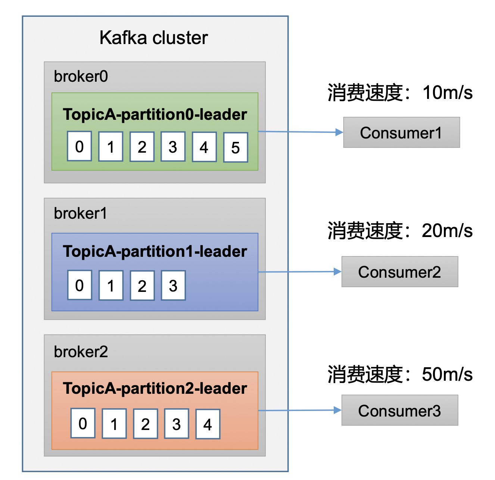

# 2 Kafka 消费者工作流程 
## 2.1 消费者总体工作流程
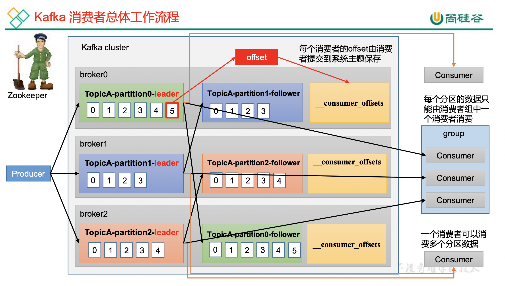

## 2.2 消费者组原理
Consumer Group(CG)：消费者组，由多个consumer组成。形成一个消费者组的条件，是所有消费者的groupid相同。

+ 消费者组内每个消费者负责消费不同分区的数据，一个分区只能由一个组内消费者消费。
+ 消费者组之间互不影响。所有的消费者都属于某个消费者组，即消费者组是逻辑上的一个订阅者。

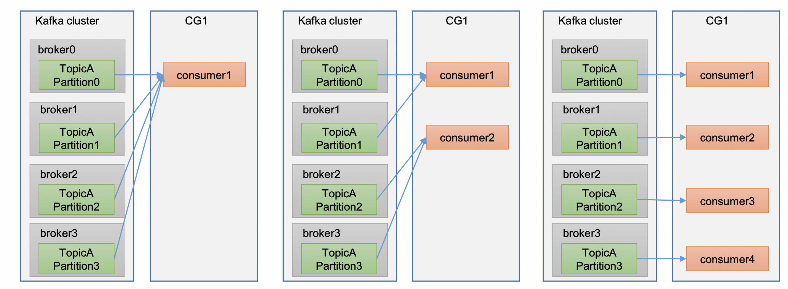

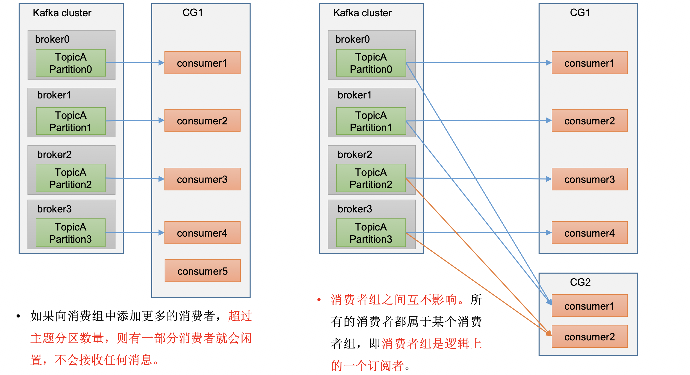	 		

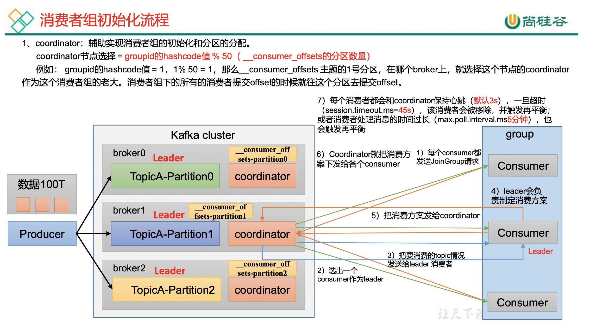		

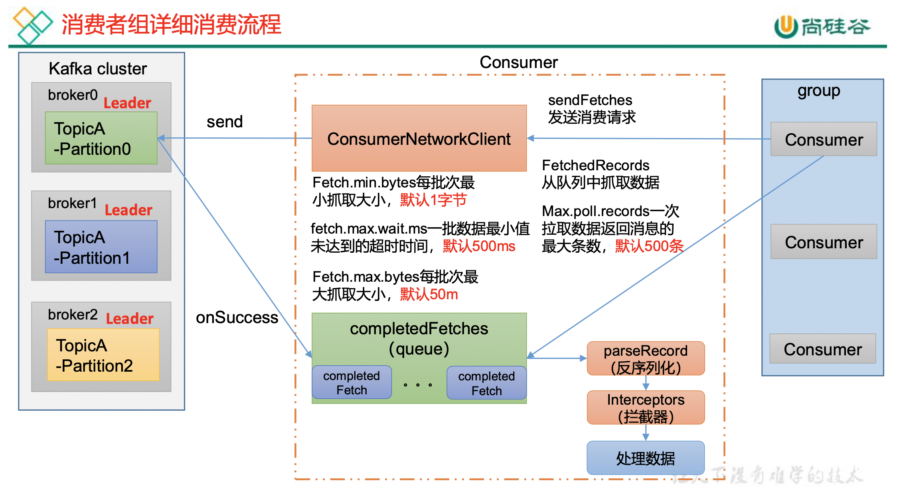 	 

## 2.3 消费者重要参数
| 参数名称 | 描述 |
| --- | --- |
| bootstrap.servers | 向 Kafka 集群建立初始连接用到的 host/port 列表。 |
| key.deserializer和 value.deserializer | 指定接收消息的 key 和 value 的反序列化类型。一定要写全类名。 |
| group.id  | 标记消费者所属的消费者组。 |
| enable.auto.commit | 默认值为 true，消费者会自动周期性地向服务器提交偏移量。 |
| auto.commit.interval.ms | 如果设置了 enable.auto.commit 的值为 true， 则该值定了消费者偏移量向 Kafka 提交的频率，默认 5s。 |
| auto.offset.reset | 当 Kafka 中没有初始偏移量或当前偏移量在服务器中不存在 (如，数据被删除了)，该如何处理? earliest:自动重置偏 移量到最早的偏移量。 latest:默认，自动重置偏移量为最 新的偏移量。 none:如果消费组原来的(previous)偏移量 不存在，则向消费者抛异常。 anything:向消费者抛异常。 |
| offsets.topic.num.partitions | __consumer_offsets 的分区数，默认是 50 个分区。 |
| heartbeat.interval.ms | Kafka 消费者和 coordinator 之间的心跳时间，默认 3s。 该条目的值必须小于 session.timeout.ms ，也不应该高于 session.timeout.ms 的 1/3。 |
| session.timeout.ms | Kafka 消费者和 coordinator 之间连接超时时间，默认 45s。 超过该值，该消费者被移除，消费者组执行再平衡。 |
| max.poll.interval.ms | 消费者处理消息的最大时长，默认是 5 分钟。超过该值，该 消费者被移除，消费者组执行再平衡。 |
| fetch.min.bytes | 默认 1 个字节。消费者获取服务器端一批消息最小的字节 数。 |
| fetch.max.wait.ms | 默认 500ms。如果没有从服务器端获取到一批数据的最小字 节数。该时间到，仍然会返回数据。 |
| fetch.max.bytes | 默认Default: 52428800(50 m)。消费者获取服务器端一批 消息最大的字节数。如果服务器端一批次的数据大于该值 (50m)仍然可以拉取回来这批数据，因此，这不是一个绝对最大值。一批次的大小受 message.max.bytes (broker config)or max.message.bytes (topic config)影响。 |
| max.poll.records | 一次 poll 拉取数据返回消息的最大条数，默认是 500 条。 |


# 3 消费者 API
## 3.1 独立消费者案例(订阅主题)
需求：建一个独立消费者，消费 first 主题中数据。

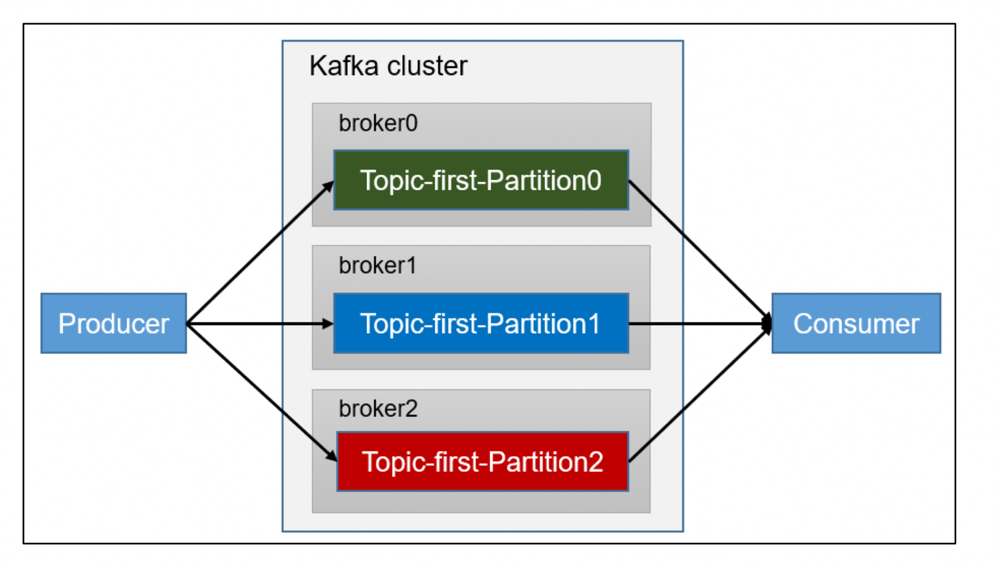  
注意：在消费者 API 代码中必须配置消费者组 id。命令行启动消费者不填写消费者组 id 会被自动填写随机的消费者组 id。  
代码如下：

```java
package com.atguigu.kafka.consumer;

import org.apache.kafka.clients.consumer.ConsumerConfig;
import org.apache.kafka.clients.consumer.ConsumerRecord; 
import org.apache.kafka.clients.consumer.ConsumerRecords; 
import org.apache.kafka.clients.consumer.KafkaConsumer;
import java.time.Duration;
import java.util.ArrayList;
import java.util.Properties;

public class CustomConsumer {
	public static void main(String[] args) {
		// 1.创建消费者的配置对象
		Properties properties = new Properties();
		// 2.给消费者配置对象添加参数
		properties.put(ConsumerConfig.BOOTSTRAP_SERVERS_CONFIG, "hadoop102:9092");
		// 配置序列化 必须 
        properties.put(ConsumerConfig.KEY_DESERIALIZER_CLASS_CONFIG, StringDeserializer.class.getName());
		properties.put(ConsumerConfig.VALUE_DESERIALIZER_CLASS_CONFIG, StringDeserializer.class.getName());
		// 配置消费者组(组名任意起名) 必须 
        properties.put(ConsumerConfig.GROUP_ID_CONFIG, "test");
		// 创建消费者对象
		KafkaConsumer<String, String> kafkaConsumer = new KafkaConsumer<String, String>(properties);
		// 注册要消费的主题(可以消费多个主题) 
        ArrayList<String> topics = new ArrayList<>(); 
        topics.add("first"); 
        kafkaConsumer.subscribe(topics);
		// 拉取数据打印
		while (true) {
			// 设置 1s 中消费一批数据
			ConsumerRecords<String, String> consumerRecords = kafkaConsumer.poll(Duration.ofSeconds(1));
			// 打印消费到的数据
			for (ConsumerRecord<String, String> consumerRecord : consumerRecords) {
                System.out.println(consumerRecord);
			} 
        }
    }
}
```

测试

1. 在 IDEA 中执行消费者程序。
2. 在 Kafka 集群控制台，创建 Kafka 生产者，并输入数据。
3. 在 IDEA 控制台观察接收到的数据。

## 3.2 独立消费者案例(订阅分区) 
需求:创建一个独立消费者，消费 first 主题 0 号分区的数据。

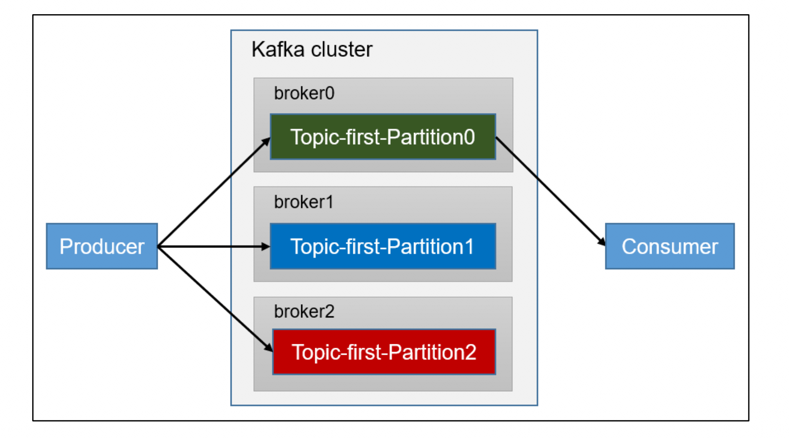  
代码如下

```java
package com.atguigu.kafka.consumer;

import org.apache.kafka.clients.consumer.ConsumerConfig; 
import org.apache.kafka.clients.consumer.ConsumerRecord; 
import org.apache.kafka.clients.consumer.ConsumerRecords; 
import org.apache.kafka.clients.consumer.KafkaConsumer;
import org.apache.kafka.common.TopicPartition;
import java.time.Duration;
import java.util.ArrayList;
import java.util.Arrays;
import java.util.Properties;

public class CustomConsumerPartition { 
    public static void main(String[] args) {
		Properties properties = new Properties();
		properties.put(ConsumerConfig.BOOTSTRAP_SERVERS_CONFIG,"hadoop102 :9092");
    	// 配置序列化 必须 
        properties.put(ConsumerConfig.KEY_DESERIALIZER_CLASS_CONFIG, StringDeserializer.class.getName());
		properties.put(ConsumerConfig.VALUE_DESERIALIZER_CLASS_CONFIG, StringDeserializer.class.getName());
		// 配置消费者组(必须)，名字可以任意起 
        properties.put(ConsumerConfig.GROUP_ID_CONFIG,"test");
		KafkaConsumer<String, String> kafkaConsumer = new KafkaConsumer<>(properties);
		// 消费某个主题的某个分区数据
		ArrayList<TopicPartition> topicPartitions = new ArrayList<>();
		topicPartitions.add(new TopicPartition("first", 0)); 
        kafkaConsumer.assign(topicPartitions);
        while (true){
			ConsumerRecords<String, String> consumerRecords = kafkaConsumer.poll(Duration.ofSeconds(1));
			for (ConsumerRecord<String, String> consumerRecord : consumerRecords) {
                System.out.println(consumerRecord); 
            }
		} 
    }
}

```

测试

1. 在 IDEA 中执行消费者程序。
2. 在 IDEA 中执行生产者程序，在控制台观察生成几个 0 号分区的数据。
3. 在 IDEA 控制台，观察接收到的数据，只能消费到 0 号分区数据表示正确。

## 3.3 消费者组案例 
需求：测试同一个主题的分区数据，只能由一个消费者组中的一个消费。

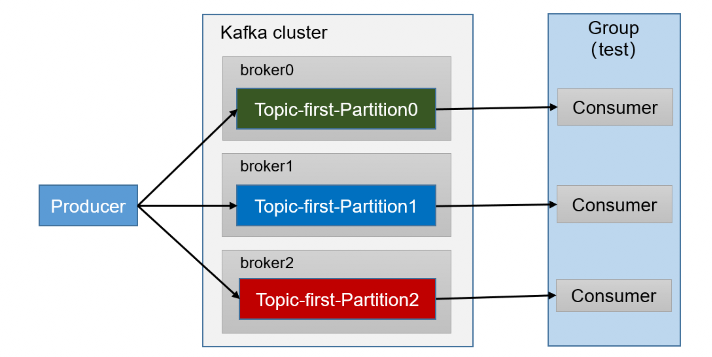  
复制一份基础消费者的代码，在 IDEA 中同时启动，即可启动同一个消费者组中

启动代码中的生产者发送消息，在 IDEA 控制台即可看到两个消费者在消费不同分区的数据（如果只发生到一个分区，可以在发送时增加延迟代码 `Thread.sleep(2);`）

# 4 分区的分配以及再平衡 
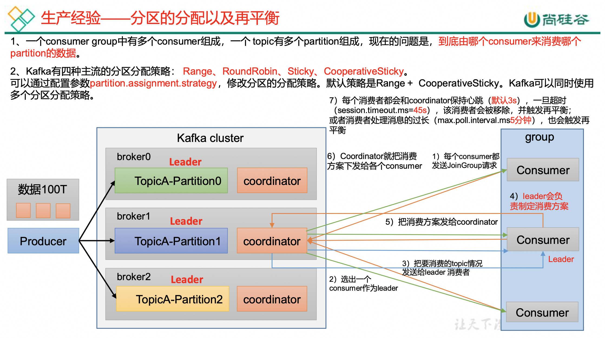

|  参数名称 |  描述 |
| --- | --- |
| heartbeat.interval.ms | Kafka 消费者和 coordinator 之间的心跳时间，默认 3s。 该条目的值必须小于 session.timeout.ms，也不应该高于 session.timeout.ms 的 1/3。 |
| session.timeout.ms 	  | Kafka 消费者和 coordinator 之间连接超时时间，默认 45s。超 过该值，该消费者被移除，消费者组执行再平衡。 |
| max.poll.interval.ms 	  |  消费者处理消息的最大时长，默认是 5 分钟。超过该值，该消费者被移除，消费者组执行再平衡。 |
| partition.assignment.strategy 	  | 消费者分区分配策略，默认策略是 Range + CooperativeSticky。Kafka 可以同时使用多个分区分配策略。 可以选择的策略包括：`Range``RoundRobin``Sticky``CooperativeSticky` |


## 4.1 Range 以及再平衡
**Range 分区策略原理**


Range 分区分配策略案例 

1. 修改主题 four 为 7 个分区。

```java
[atguigu@hadoop102  kafka]$ bin/kafka-topics.sh --bootstrap-server localhost:9092 --alter --topic four --partitions 7 
```

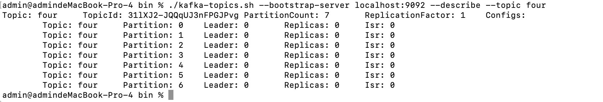  
注意：分区数可以增加，但是不能减少。

2. 复制 CustomConsumer 类，复制3份。这样可以由三个消费者 CustomConsumer、CustomConsumer1、CustomConsumer2 组成消费者组，组名都为“test”， 同时启动 3 个消费者。

```java
package com.cg.kafka.consumer;

import org.apache.kafka.clients.consumer.ConsumerConfig;
import org.apache.kafka.clients.consumer.ConsumerRecord;
import org.apache.kafka.clients.consumer.ConsumerRecords;
import org.apache.kafka.clients.consumer.KafkaConsumer;
import org.apache.kafka.common.serialization.StringDeserializer;

import java.time.Duration;
import java.util.ArrayList;
import java.util.Properties;

public class CustomConsumer {
    public static void main(String[] args) {
        // 1.创建消费者的配置对象
        Properties properties = new Properties();
        // 2.给消费者配置对象添加参数
        properties.put(ConsumerConfig.BOOTSTRAP_SERVERS_CONFIG, "localhost:9092");
        // 配置序列化 必须
        properties.put(ConsumerConfig.KEY_DESERIALIZER_CLASS_CONFIG, StringDeserializer.class.getName());
        properties.put(ConsumerConfig.VALUE_DESERIALIZER_CLASS_CONFIG, StringDeserializer.class.getName());
        // 配置消费者组(组名任意起名) 必须
        properties.put(ConsumerConfig.GROUP_ID_CONFIG, "test");
        // 创建消费者对象
        KafkaConsumer<String, String> kafkaConsumer = new KafkaConsumer<String, String>(properties);
        // 注册要消费的主题(可以消费多个主题)
        ArrayList<String> topics = new ArrayList<>();
        topics.add("four");
        kafkaConsumer.subscribe(topics);
        // 拉取数据打印
        while (true) {
            // 设置 1s 中消费一批数据
            ConsumerRecords<String, String> consumerRecords = kafkaConsumer.poll(Duration.ofSeconds(1));
            // 打印消费到的数据
            for (ConsumerRecord<String, String> consumerRecord : consumerRecords) {
                System.out.println(consumerRecord);
            }
        }
    }
}

```

3. 启动 CustomProducer 生产者，发送 500 条消息，随机发送到不同的分区。  
说明：Kafka 默认的分区分配策略就是 Range + CooperativeSticky，所以不需要修改策 略。
4. 观看 3 个消费者分别消费哪些分区的数据。  
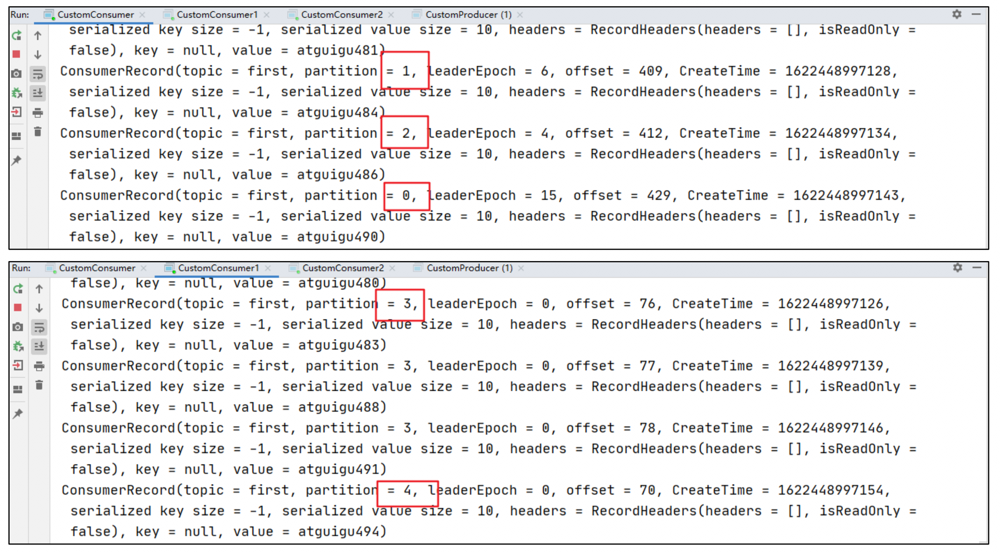

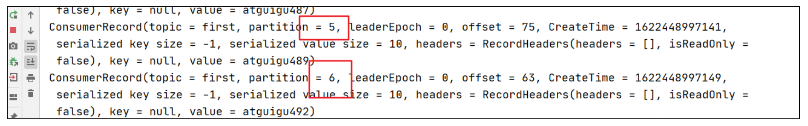

5. 停止掉 0 号消费者，快速重新发送消息观看结果(45s 以内，越快越好)。  
1 号消费者:消费到 3、4 号分区数据。  
2 号消费者:消费到 5、6 号分区数据。  
0 号消费者的任务会整体被分配到 1 号消费者或者 2 号消费者。  
说明：0 号消费者挂掉后，消费者组需要按照超时时间 45s 来判断它是否退出，所以需要等待，时间到了 45s 后，判断它真的退出就会把任务分配给其他 broker 执行。 
6. 再次重新发送消息观看结果(45s 以后)。  
1 号消费者:消费到 0、1、2、3 号分区数据。  
2 号消费者:消费到 4、5、6 号分区数据。  
说明：消费者 0 已经被踢出消费者组，所以重新按照 range 方式分配。 5.4.2 RoundRobin 以及再平衡

## 4.2 RoundRobin 分区策略原理 
分区分配策略之RoundRobin  
RoundRobin 针对集群中所有Topic而言。  
RoundRobin 轮询分区策略，是把所有的 partition 和所有的 consumer 都列出来，然后按照 hashcode 进行排序，最后 通过轮询算法来分配 partition 给到各个消费者。  
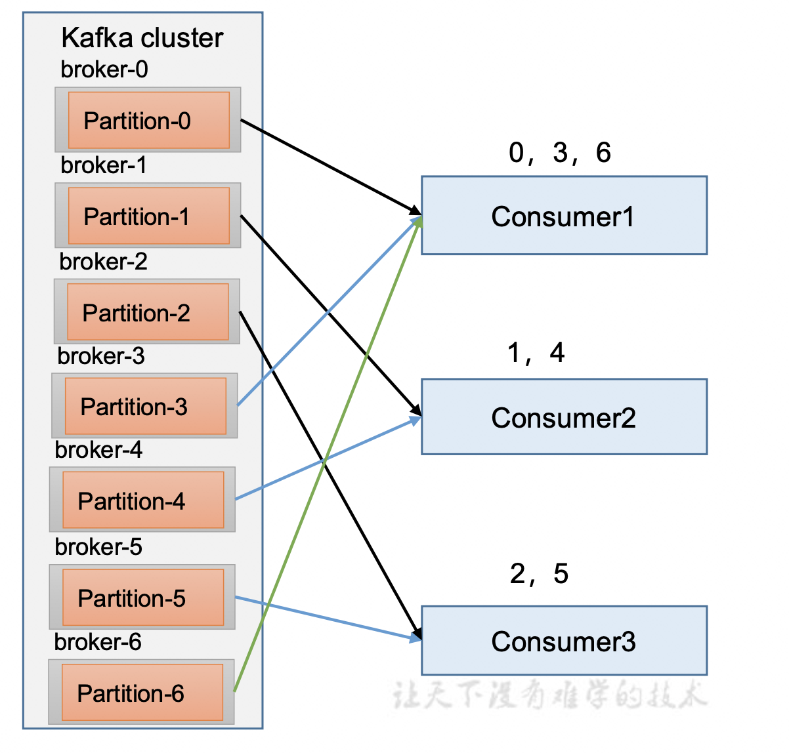  
RoundRobin 分区分配策略案例

1. 依次在 CustomConsumer、CustomConsumer1、CustomConsumer2 三个消费者代码中修改分区分配策略为 RoundRobin。

```java
// 修改分区分配策略 
properties.put(ConsumerConfig.PARTITION_ASSIGNMENT_STRATEGY_CONFIG, "org.apache.kafka.clients.consumer.RoundRobinAssignor");
```

2. 重启 3 个消费者，重复发送消息的步骤，观看分区结果。

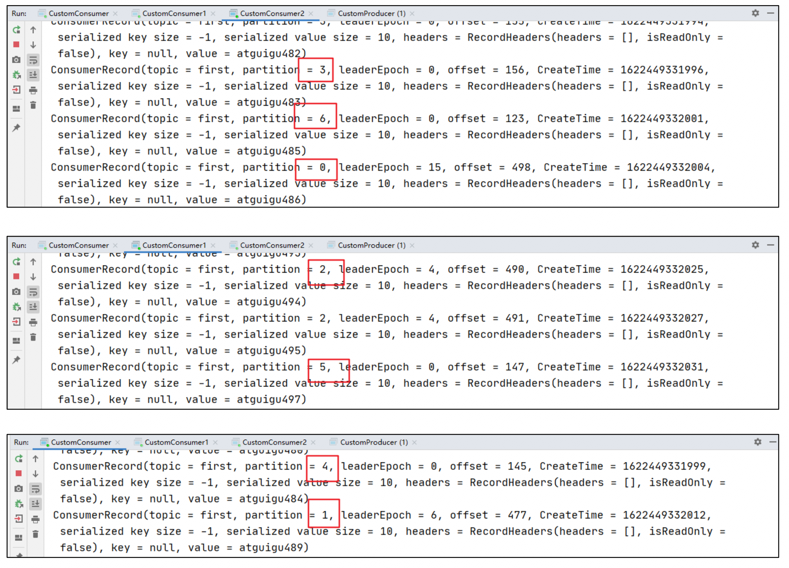

3. RoundRobin 分区分配再平衡案例
    1. 停止掉 0 号消费者，快速重新发送消息观看结果(45s 以内，越快越好)。  
1 号消费者:消费到 2、5 号分区数据  
2 号消费者:消费到 4、1 号分区数据  
0 号消费者的任务会按照 RoundRobin 的方式，把数据轮询分成 0 、6 和 3 号分区数据，分别由 1 号消费者或者 2 号消费者消费。  
说明：0 号消费者挂掉后，消费者组需要按照超时时间 45s 来判断它是否退出，所以需要等待，时间到了 45s 后，判断它真的退出就会把任务分配给其他 broker 执行。 
    2. 再次重新发送消息观看结果(45s 以后)。  
1 号消费者:消费到 0、2、4、6 号分区数据  
2 号消费者:消费到 1、3、5 号分区数据  
说明：消费者 0 已经被踢出消费者组，所以重新按照 RoundRobin 方式分配。

## 4.3 Sticky 以及再平衡
粘性分区定义:可以理解为分配的结果带有“粘性的”。即在执行一次新的分配之前， 考虑上一次分配的结果，尽量少的调整分配的变动，可以节省大量的开销。  
粘性分区是 Kafka 从 0.11.x 版本开始引入这种分配策略，首先会尽量均衡的放置分区 到消费者上面，在出现同一消费者组内消费者出现问题的时候，会尽量保持原有分配的分 区不变化。  
需求：设置主题为 first，7 个分区;准备 3 个消费者，采用粘性分区策略，并进行消费，观察 消费分配情况。然后再停止其中一个消费者，再次观察消费分配情况。  


步骤

1. 修改分区分配策略为粘性。  
注意：3 个消费者都应该注释掉，之后重启 3 个消费者，如果出现报错，全部停止等 会再重启，或者修改为全新的消费者组。

```java
// 修改分区分配策略
ArrayList<String> startegys = new ArrayList<>(); 
startegys.add("org.apache.kafka.clients.consumer.StickyAssignor");
properties.put(ConsumerConfig.PARTITION_ASSIGNMENT_STRATEGY_CONFIG,startegys);
```

2. 使用同样的生产者发送 500 条消息。 可以看到会尽量保持分区的个数近似划分分区。

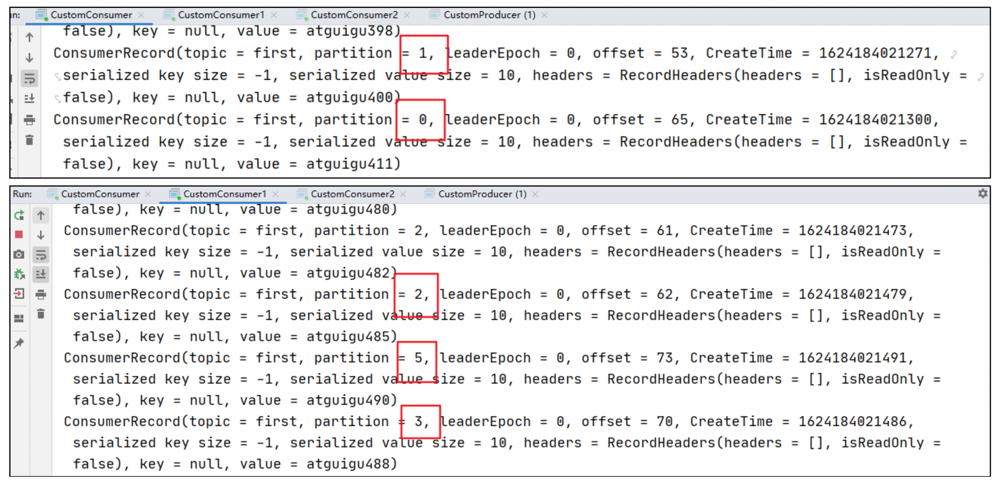

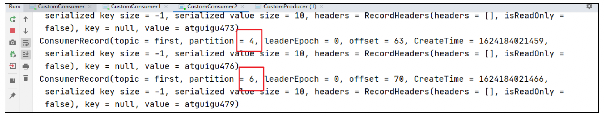

3. Sticky 分区分配再平衡案例
    1. 停止掉 0 号消费者，快速重新发送消息观看结果(45s 以内，越快越好)。  
1 号消费者:消费到 2、5、3 号分区数据。  
2 号消费者:消费到 4、6 号分区数据。  
0 号消费者的任务会按照粘性规则，尽可能均衡的随机分成 0 和 1 号分区数据，分别由 1 号消费者或者 2 号消费者消费。  
说明:0 号消费者挂掉后，消费者组需要按照超时时间 45s 来判断它是否退出，所以需要等待，时间到了 45s 后，判断它真的退出就会把任务分配给其他 broker 执行。 
    2. 再次重新发送消息观看结果(45s 以后)。  
1 号消费者:消费到 2、3、5 号分区数据。  
2 号消费者:消费到 0、1、4、6 号分区数据。  
说明：消费者 0 已经被踢出消费者组，所以重新按照粘性方式分配。 

# 5 offset 位移
## 5.1 offset 的默认维护位置 
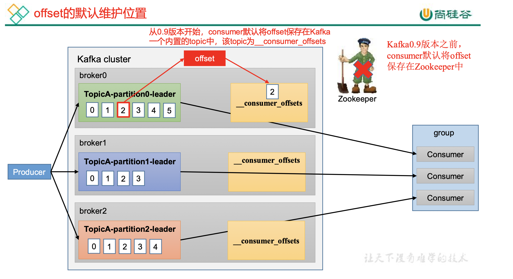  
__consumer_offsets 主题里面采用 key 和 value 的方式存储数据。key 是 group.id+topic+ 分区号，value 就是当前 offset 的值。每隔一段时间，kafka 内部会对这个 topic 进行 compact，也就是每个 group.id+topic+分区号就保留最新数据。  
消费 offset 案例

1. 思想：__consumer_offsets 为 Kafka 中的 topic，那就可以通过消费者进行消费。
2. 在配置文件 config/consumer.properties 中添加配置 exclude.internal.topics=false， 默认是 true，表示不能消费系统主题。为了查看该系统主题数据，所以该参数修改为 false。
3. 采用命令行方式，创建一个新的 topic。

```bash
[atguigu@hadoop102 kafka]$ bin/kafka-topics.sh --bootstrap-server hadoop102:9092 --create --topic atguigu --partitions 2 --replication-factor 2
```

4. 启动生产者往 atguigu 生产数据。

```bash
[atguigu@hadoop102 kafka]$ bin/kafka-console-producer.sh --topic atguigu --bootstrap-server hadoop102:9092
```

5. 启动消费者消费 atguigu 数据。

```bash
[atguigu@hadoop104  kafka]$ bin/kafka-console-consumer.sh --bootstrap-server hadoop102:9092 --topic atguigu --group test 
```

注意:指定消费者组名称，更好观察数据存储位置(key 是 group.id+topic+分区号)。

6. 查看消费者消费主题__consumer_offsets。

```bash
[atguigu@hadoop102 kafka]

$$
 bin/kafka-console-consumer.sh --topic __consumer_offsets --bootstrap-server hadoop102:9092 --consumer.config config/consumer.properties --formatter "kafka.coordinator.group.GroupMetadataManager\
$$
OffsetsMessageForm atter" --from-beginning


[offset,atguigu,1]::OffsetAndMetadata(offset=7, leaderEpoch=Optional[0], metadata=, commitTimestamp=1622442520203, expireTimestamp=None) 
[offset,atguigu,0]::OffsetAndMetadata(offset=8, leaderEpoch=Optional[0], metadata=, commitTimestamp=1622442520203, expireTimestamp=None)
```

## 5.2 自动提交offset 
为了使我们能够专注于自己的业务逻辑，Kafka提供了自动提交offset的功能。 自动提交offset的相关参数:

+ `enable.auto.commit`：是否开启自动提交offset功能，默认是true
+ `auto.commit.interval.ms`：自动提交offset的时间间隔，默认是5s

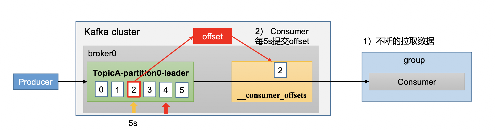  


| 参数名称 | 描述 |
| --- | --- |
| enable.auto.commit | 默认值为 true，消费者会自动周期性地向服务器提交偏移量。 |
| auto.commit.interval.ms | 如果设置了 enable.auto.commit 的值为 true， 则该值定义了消费者偏移量向 Kafka 提交的频率，默认 5s。 |


消费者自动提交 offset

```java
package com.atguigu.kafka.consumer;

import org.apache.kafka.clients.consumer.ConsumerConfig; 
import org.apache.kafka.clients.consumer.ConsumerRecord; 
import org.apache.kafka.clients.consumer.ConsumerRecords; 
import org.apache.kafka.clients.consumer.KafkaConsumer;
import java.util.Arrays;
import java.util.Properties;

public class CustomConsumerAutoOffset { 
    public static void main(String[] args) {
    	// 1. 创建 kafka 消费者配置类
    	Properties properties = new Properties();
    	// 2. 添加配置参数
    	// 添加连接 
        properties.put(ConsumerConfig.BOOTSTRAP_SERVERS_CONFIG,"hadoop102:9092");
    	// 配置序列化 必须 
        properties.put(ConsumerConfig.KEY_DESERIALIZER_CLASS_CONFIG, "org.apache.kafka.common.serialization.StringDeserializer");
        properties.put(ConsumerConfig.VALUE_DESERIALIZER_CLASS_CONFIG, "org.apache.kafka.common.serialization.StringDeserializer");
		// 配置消费者组 
        properties.put(ConsumerConfig.GROUP_ID_CONFIG, "test");
		// 是否自动提交offset
		properties.put(ConsumerConfig.ENABLE_AUTO_COMMIT_CONFIG, true);
		// 提交offset的时间周期1000ms，默认5s 
        properties.put(ConsumerConfig.AUTO_COMMIT_INTERVAL_MS_CONFIG, 1000);
		//3. 创建kafka消费者
		KafkaConsumer<String, String> consumer = new KafkaConsumer<>(properties);
		//4. 设置消费主题 形参是列表 
        consumer.subscribe(Arrays.asList("first"));
		//5. 消费数据 
        while (true){
			// 读取消息
			ConsumerRecords<String, String> consumerRecords = consumer.poll(Duration.ofSeconds(1));
			// 输出消息
			for (ConsumerRecord<String, String> consumerRecord : consumerRecords) {
                System.out.println(consumerRecord.value()); 
            }
            
		} 
    }
}
```

## 5.3 手动提交offset 
虽然自动提交offset十分简单便利，但由于其是基于时间提交的，开发人员难以把握offset提交的时机。因 此Kafka还提供了手动提交offset的API。  
手动提交offset的方法有两种：分别是commitSync(同步提交)和commitAsync(异步提交)。两者的相同点是，都会将本次提交的一批数据最高的偏移量提交;不同点是，同步提交阻塞当前线程，一直到提交成功，并且会自动失败重试(由不可控因素导致，也会出现提交失败);而异步提交则没有失败重试机制，故有可能提交失败。

+ commitSync(同步提交):必须等待offset提交完毕，再去消费下一批数据。
+ commitAsync(异步提交) :发送完提交offset请求后，就开始消费下一批数据了。

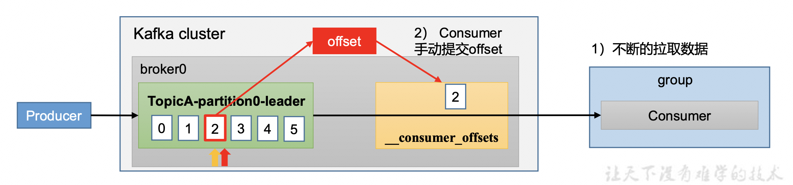  
同步提交 offset  
由于同步提交 offset 有失败重试机制，故更加可靠，但是由于一直等待提交结果，提交的效率比较低。以下为同步提交 offset 的示例。

```java
package com.atguigu.kafka.consumer;

import org.apache.kafka.clients.consumer.ConsumerConfig; 
import org.apache.kafka.clients.consumer.ConsumerRecord; 
import org.apache.kafka.clients.consumer.ConsumerRecords; 
import org.apache.kafka.clients.consumer.KafkaConsumer;
import java.util.Arrays;
import java.util.Properties;

public class CustomConsumerByHandSync {
	public static void main(String[] args) {
		// 1. 创建 kafka 消费者配置类
		Properties properties = new Properties(); 
        // 2. 添加配置参数
		// 添加连接
		properties.put(ConsumerConfig.BOOTSTRAP_SERVERS_CONFIG, "hadoop102:9092");
		// 配置序列化 必须 
        properties.put(ConsumerConfig.KEY_DESERIALIZER_CLASS_CONFIG, "org.apache.kafka.common.serialization.StringDeserializer");
		properties.put(ConsumerConfig.VALUE_DESERIALIZER_CLASS_CONFIG, "org.apache.kafka.common.serialization.StringDeserializer");
		// 配置消费者组
    	properties.put(ConsumerConfig.GROUP_ID_CONFIG, "test");
		// 是否自动提交offset
		properties.put(ConsumerConfig.ENABLE_AUTO_COMMIT_CONFIG, false);
		//3. 创建kafka消费者
		KafkaConsumer<String, String> consumer = new KafkaConsumer<>(properties);
		//4. 设置消费主题 形参是列表 
        consumer.subscribe(Arrays.asList("first"));
		//5. 消费数据 
        while (true){
			// 读取消息
			ConsumerRecords<String, String> consumerRecords = consumer.poll(Duration.ofSeconds(1));
			// 输出消息
			for (ConsumerRecord<String, String> consumerRecord : consumerRecords) {
                System.out.println(consumerRecord.value()); 
            }
            // 同步提交offset
			consumer.commitSync();
		} 
    }
}
```

异步提交 offset  
虽然同步提交 offset 更可靠一些，但是由于其会阻塞当前线程，直到提交成功。因此吞吐量会受到很大的影响。因此更多的情况下，会选用异步提交 offset 的方式。 以下为异步提交 offset 的示例:

```java
package com.atguigu.kafka.consumer;

import org.apache.kafka.clients.consumer.*; 
import org.apache.kafka.common.TopicPartition;
import java.util.Arrays;
import java.util.Map;
import java.util.Properties;

public class CustomConsumerByHandAsync { 
    public static void main(String[] args) {
		// 1. 创建 kafka 消费者配置类
		Properties properties = new Properties();
		// 2. 添加配置参数
        // 添加连接
		properties.put(ConsumerConfig.BOOTSTRAP_SERVERS_CONFIG, "hadoop102:9092");
		// 配置序列化 必须 
        properties.put(ConsumerConfig.KEY_DESERIALIZER_CLASS_CONFIG, "org.apache.kafka.common.serialization.StringDeserializer");
		properties.put(ConsumerConfig.VALUE_DESERIALIZER_CLASS_CONFIG, "org.apache.kafka.common.serialization.StringDeserializer");
		// 配置消费者组 
        properties.put(ConsumerConfig.GROUP_ID_CONFIG, "test");
		// 是否自动提交offset
		properties.put(ConsumerConfig.ENABLE_AUTO_COMMIT_CONFIG, "false");
		//3. 创建Kafka消费者
		KafkaConsumer<String, String> consumer = new KafkaConsumer<>(properties);
		//4. 设置消费主题 形参是列表 
        consumer.subscribe(Arrays.asList("first"));
		//5. 消费数据 
        while (true){
			// 读取消息
			ConsumerRecords<String, String> consumerRecords = consumer.poll(Duration.ofSeconds(1));
			// 输出消息
			for (ConsumerRecord<String, String> consumerRecord : consumerRecords) {
				System.out.println(consumerRecord.value()); 
            }
			// 异步提交offset
    		consumer.commitAsync();
		}
	} 
}
```

## 5.4 指定 Offset 消费
`auto.offset.reset = earliest | latest | none`  默认是 latest。  
当 Kafka 中没有初始偏移量(消费者组第一次消费)或服务器上不再存在当前偏移量 时(例如该数据已被删除)，该怎么办?

+ earliest:自动将偏移量重置为最早的偏移量，--from-beginning。 
+ latest(默认值):自动将偏移量重置为最新偏移量。
+ none:如果未找到消费者组的先前偏移量，则向消费者抛出异常。

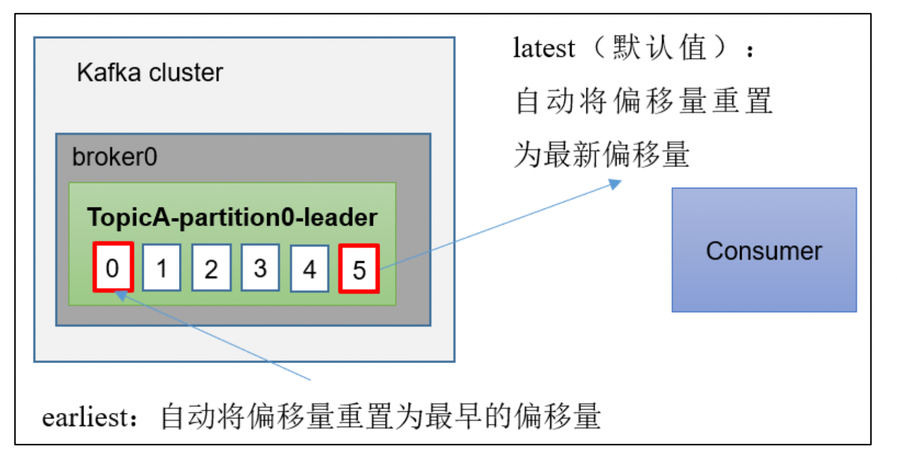  
任意指定 offset 位移开始消费

```java
package com.atguigu.kafka.consumer;

import org.apache.kafka.clients.consumer.ConsumerConfig; 
import org.apache.kafka.clients.consumer.ConsumerRecord; 
import org.apache.kafka.clients.consumer.ConsumerRecords; 
import org.apache.kafka.clients.consumer.KafkaConsumer; 
import org.apache.kafka.common.TopicPartition;
import org.apache.kafka.common.serialization.StringDeserializer;
import java.time.Duration;
import java.util.ArrayList;
import java.util.HashSet;
import java.util.Properties;
import java.util.Set;
public class CustomConsumerSeek {
	public static void main(String[] args) {
		// 0 配置信息
		Properties properties = new Properties();
		// 连接
		properties.put(ConsumerConfig.BOOTSTRAP_SERVERS_CONFIG, "hadoop102:9092");
		// key value 反序列化 
        properties.put(ConsumerConfig.KEY_DESERIALIZER_CLASS_CONFIG,StringDeserializer.class.getName());
		properties.put(ConsumerConfig.VALUE_DESERIALIZER_CLASS_CONFIG, StringDeserializer.class.getName());
		properties.put(ConsumerConfig.GROUP_ID_CONFIG, "test2");
		// 1 创建一个消费者
		KafkaConsumer<String, String> kafkaConsumer = new KafkaConsumer<>(properties);
    	// 2 订阅一个主题
		ArrayList<String> topics = new ArrayList<>(); 
        topics.add("first"); 
        kafkaConsumer.subscribe(topics);
		Set<TopicPartition> assignment= new HashSet<>();
		while (assignment.size() == 0) { 
            kafkaConsumer.poll(Duration.ofSeconds(1));
			// 获取消费者分区分配信息(有了分区分配信息才能开始消费) 
            assignment = kafkaConsumer.assignment();
		}
		// 遍历所有分区，并指定 offset 从 1700 的位置开始消费 
        for (TopicPartition tp: assignment) {
            kafkaConsumer.seek(tp, 1700);
        }
		// 3 消费该主题数据 
        while (true) {
			ConsumerRecords<String, String> consumerRecords = kafkaConsumer.poll(Duration.ofSeconds(1));
			for (ConsumerRecord<String, String> consumerRecord : consumerRecords) {
            	System.out.println(consumerRecord); 
        	}
		} 
	}
}

```

注意：每次执行完，需要修改消费者组名;

## 5.5 指定时间消费
需求：在生产环境中，会遇到最近消费的几个小时数据异常，想重新按照时间消费。 例如要求按照时间消费前一天的数据，怎么处理?  
操作步骤：

```java
package com.atguigu.kafka.consumer;

import org.apache.kafka.clients.consumer.*;
import org.apache.kafka.common.TopicPartition;
import org.apache.kafka.common.serialization.StringDeserializer;
import java.time.Duration;
import java.util.*;

public class CustomConsumerForTime {
	public static void main(String[] args) {
		// 0 配置信息
    	Properties properties = new Properties();
		// 连接
		properties.put(ConsumerConfig.BOOTSTRAP_SERVERS_CONFIG, "hadoop102:9092");
		// key value 反序列化 
        properties.put(ConsumerConfig.KEY_DESERIALIZER_CLASS_CONFIG, StringDeserializer.class.getName());
		properties.put(ConsumerConfig.VALUE_DESERIALIZER_CLASS_CONFIG, StringDeserializer.class.getName());
		properties.put(ConsumerConfig.GROUP_ID_CONFIG, "test2");
		// 1 创建一个消费者
		KafkaConsumer<String, String> kafkaConsumer = new KafkaConsumer<>(properties);
		// 2 订阅一个主题
		ArrayList<String> topics = new ArrayList<>(); 
        topics.add("first"); 
        kafkaConsumer.subscribe(topics);
		Set<TopicPartition> assignment = new HashSet<>();
		while (assignment.size() == 0) { 
            kafkaConsumer.poll(Duration.ofSeconds(1));
			// 获取消费者分区分配信息(有了分区分配信息才能开始消费) 
            assignment = kafkaConsumer.assignment();
		}
		HashMap<TopicPartition, Long> timestampToSearch = new HashMap<>();
		// 封装集合存储，每个分区对应一天前的数据
		for (TopicPartition topicPartition : assignment) {
			timestampToSearch.put(topicPartition, System.currentTimeMillis() - 1 * 24 * 3600 * 1000);
		}
		// 获取从1天前开始消费的每个分区的offset
		Map<TopicPartition, OffsetAndTimestamp> offsets = kafkaConsumer.offsetsForTimes(timestampToSearch);
		// 遍历每个分区，对每个分区设置消费时间。
		for (TopicPartition topicPartition : assignment) {
			OffsetAndTimestamp offsetAndTimestamp = offsets.get(topicPartition);
			// 根据时间指定开始消费的位置
			if (offsetAndTimestamp != null){
				kafkaConsumer.seek(topicPartition, offsetAndTimestamp.offset());
			} 
        }
    	// 3 消费该主题数据 
		while (true) {
			ConsumerRecords<String, String> consumerRecords = kafkaConsumer.poll(Duration.ofSeconds(1));
			for (ConsumerRecord<String, String> consumerRecord : consumerRecords) {
                System.out.println(consumerRecord); 
            }
		} 
    }
}
```

## 5.6 漏消费和重复消费
重复消费：已经消费了数据，但是 offset 没提交。 

漏消费：先提交 offset 后消费，有可能会造成数据的漏消费。  
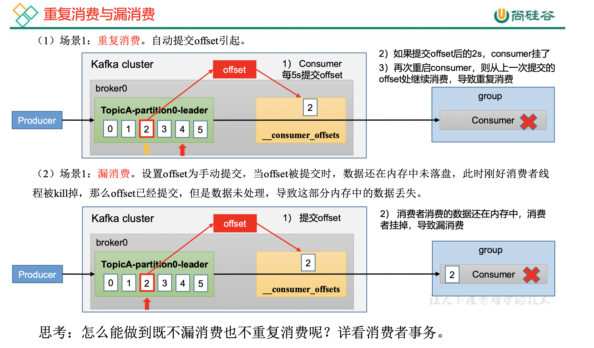

# 6 消费者事务 
如果想完成Consumer端的精准一次性消费，那么需要Kafka消费端将消费过程和提交offset 过程做原子绑定。此时我们需要将Kafka的offset保存到支持事务的自定义介质(比如 MySQL)。这部分知识会在后续项目部分涉及。  


# 7 数据积压
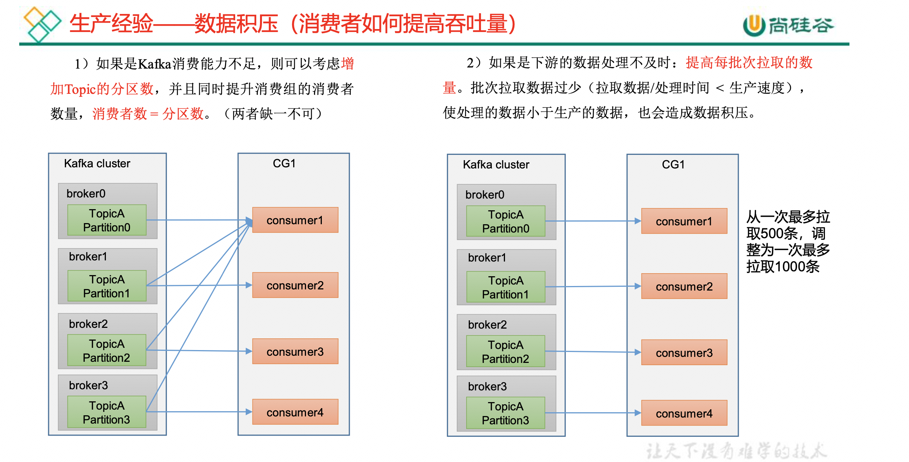

| 参数名称 | 描述 |
| --- | --- |
| fetch.max.bytes | 默认Default: 52428800(50m)。消费者获取服务器端一批 消息最大的字节数。如果服务器端一批次的数据大于该值 (50m)仍然可以拉取回来这批数据，因此，这不是一个绝对最大值。一批次的大受 `message.max.bytes` (broker config) or `max.message.bytes` (topic config)影响。 |
| max.poll.records | 一次 poll 拉取数据返回消息的最大条数，默认是 500 条 |


  
  


