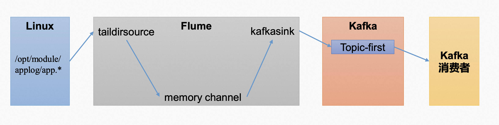
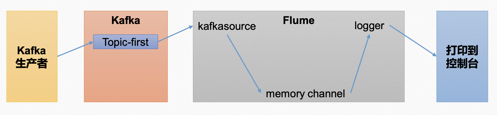

**<font style="color:#DF2A3F;">笔记来源：</font>**[**<font style="color:#DF2A3F;">【尚硅谷】Kafka3.x教程（从入门到调优，深入全面）</font>**](https://www.bilibili.com/video/BV1vr4y1677k?p=10&vd_source=e8046ccbdc793e09a75eb61fe8e84a30)

  
Flume 是一个在大数据开发中非常常用的组件。可以用于 Kafka 的生产者，也可以用于Flume 的消费者。


# 1 Flume 生产者 
Flume生产者



1. 启动 kafka 集群
2. 启动 kafka 消费者

```bash
[atguigu@hadoop103 kafka]$ bin/kafka-console-consumer.sh --bootstrap-server hadoop102:9092 --topic first
```

3. **<font style="color:#DF2A3F;">Flume 安装步骤</font>**

Flume 官网地址：[http://flume.apache.org/ ](http://flume.apache.org/ )

文档查看地址：[http://flume.apache.org/FlumeUserGuide.html ](http://flume.apache.org/FlumeUserGuide.html )

下载地址：[http://archive.apache.org/dist/flume/ ](http://archive.apache.org/dist/flume/ )

    1. 将`apache-flume-1.9.0-bin.tar.gz` 上传到 linux 的/opt/software 目录下 
    2. 解压`apache-flume-1.9.0-bin.tar.gz` 到`/opt/module/`目录下 

```java
[atguigu@hadoop102 software]$ tar -zxf /opt/software/apache- flume-1.9.0-bin.tar.gz -C /opt/module/
```

    3. 修改`apache-flume-1.9.0-bin`的名称为 flume 

```java
[atguigu@hadoop102 module]$ mv /opt/module/apache-flume-1.9.0-bin /opt/module/flume
```

    4. 将 lib 文件夹下的`guava-11.0.2.jar`删除以兼容 Hadoop 3.1.3 

```java
 [atguigu@hadoop102 lib]$ rm /opt/module/flume/lib/guava- 11.0.2.jar
```

4. 配置 Flume，在 hadoop102 节点的 Flume 的 job 目录下创建 `file_to_kafka.conf`

```bash
[atguigu@hadoop102 flume]$ mkdir jobs 
[atguigu@hadoop102 flume]$ vim jobs/file_to_kafka.conf
```

配置文件内容如下

```bash
# 1 组件定义 
a1.sources = r1 
a1.sinks = k1 
a1.channels = c1

# 2 配置 source
a1.sources.r1.type = TAILDIR
a1.sources.r1.filegroups = f1
a1.sources.r1.filegroups.f1 = /opt/module/applog/app.* 
a1.sources.r1.positionFile = /opt/module/flume/taildir_position.json
# 3 配置 channel
a1.channels.c1.type = memory 
a1.channels.c1.capacity = 1000 
a1.channels.c1.transactionCapacity = 100
# 4 配置 sink
a1.sinks.k1.type = org.apache.flume.sink.kafka.KafkaSink
a1.sinks.k1.kafka.bootstrap.servers = hadoop102:9092,hadoop103:9092,hadoop104:9092 
a1.sinks.k1.kafka.topic = first
a1.sinks.k1.kafka.flumeBatchSize = 20 
a1.sinks.k1.kafka.producer.acks = 1 
a1.sinks.k1.kafka.producer.linger.ms = 1
# 5 拼接组件 
a1.sources.r1.channels = c1 
a1.sinks.k1.channel = c1
```

5. 启动 Flume

```bash
[atguigu@hadoop102 flume]$ bin/flume-ng agent -c conf/ -n a1 -f jobs/file_to_kafka.conf &
```

6. 向/opt/module/applog/app.log 里追加数据，查看 kafka 消费者消费情况 

```bash
[atguigu@hadoop102 module]$ mkdir app.log
[atguigu@hadoop102 applog]$ echo hello >> /opt/module/applog/app.log
```

7. 观察 kafka 消费者，能够看到消费的 hello 数据 

# 2 Flume 消费者
Flume消费者



1. 配置 Flume：在 hadoop102 节点的 Flume 的/opt/module/flume/jobs 目录下创建 `kafka_to_file.conf ` 

```bash
[atguigu@hadoop102  jobs]$ vim kafka_to_file.conf 
```

配置文件内容如下

```bash
# 1 组件定义 
a1.sources = r1 
a1.sinks = k1 
a1.channels = c1

# 2 配置 source
a1.sources.r1.type = org.apache.flume.source.kafka.KafkaSource 
a1.sources.r1.batchSize = 50 
a1.sources.r1.batchDurationMillis = 200 
a1.sources.r1.kafka.bootstrap.servers = hadoop102:9092 
a1.sources.r1.kafka.topics = first 
a1.sources.r1.kafka.consumer.group.id = custom.g.id

# 3 配置 channel
a1.channels.c1.type = memory 
a1.channels.c1.capacity = 1000 
a1.channels.c1.transactionCapacity = 100

# 4 配置 sink 
a1.sinks.k1.type = logger
 
# 5 拼接组件 
a1.sources.r1.channels = c1 
a1.sinks.k1.channel = c1
```

2. 启动 Flume

```bash
[atguigu@hadoop102 flume]$ bin/flume-ng agent -c conf/ -n a1 -f jobs/kafka_to_file.conf -Dflume.root.logger=INFO,console
```

3. 启动 kafka 生产者

```bash
[atguigu@hadoop103 kafka]$ bin/kafka-console-producer.sh -- bootstrap-server hadoop102:9092 --topic first
```

并输入数据，例如：hello world 

4. 观察控制台输出的日志

