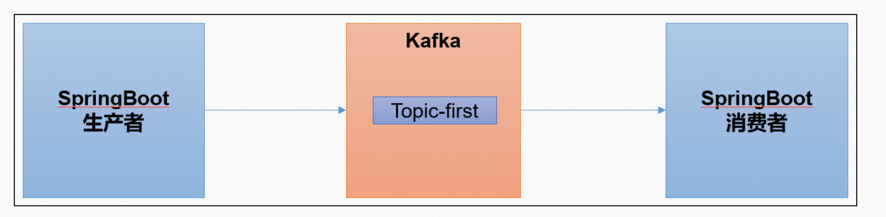

**<font style="color:#DF2A3F;">笔记来源：</font>**[**<font style="color:#DF2A3F;">【尚硅谷】Kafka3.x教程（从入门到调优，深入全面）</font>**](https://www.bilibili.com/video/BV1vr4y1677k?p=10&vd_source=e8046ccbdc793e09a75eb61fe8e84a30)

  
SpringBoot 是一个在 JavaEE 开发中非常常用的组件。可以用于 Kafka 的生产者，也可以 用于 SpringBoot 的消费者。



# 1 SpringBoot 环境准备 
添加依赖

```xml
<dependencies>
    <dependency>
        <groupId>org.springframework.boot</groupId>
        spring-boot-starter-web</artifactId> 
    </dependency>

    <dependency> 
        <groupId>org.springframework.kafka</groupId> 
        spring-kafka</artifactId>
    </dependency>
    
    <dependency> 
        <groupId>org.projectlombok</groupId> 
        lombok</artifactId> 
        <optional>true</optional>
    </dependency>
    
    <dependency>
        <groupId>org.springframework.boot</groupId> 
        spring-boot-starter-test</artifactId>
        <scope>test</scope>
    </dependency>
    
    <dependency> 
        <groupId>org.springframework.kafka</groupId> 
        spring-kafka-test</artifactId> 
        <scope>test</scope>
    </dependency>
</dependencies>
```

# 3.  2 SpringBoot 生产者
1. 修改 SpringBoot 核心配置文件 application.propeties, 添加生产者相关信息

```properties
# 4. 应用名称 
spring.application.name=atguigu_springboot_kafka
# 5. 指定 kafka 的地址
spring.kafka.bootstrap- servers=hadoop102:9092,hadoop103:9092,hadoop104:9092
#指定 key 和 value 的序列化器
spring.kafka.producer.key- serializer=org.apache.kafka.common.serialization.StringSerializer 
spring.kafka.producer.value- serializer=org.apache.kafka.common.serialization.StringSerializer
```

2. 创建 controller 从浏览器接收数据, 并写入指定的 topic

```java
package com.atguigu.springboot;
import org.springframework.beans.factory.annotation.Autowired; 
import org.springframework.kafka.core.KafkaTemplate;
import org.springframework.web.bind.annotation.RequestMapping; 
import org.springframework.web.bind.annotation.RestController;
@RestController
public class ProducerController { 
    // Kafka 模板用来向 kafka 发送数据
    @Autowired
    KafkaTemplate<String, String> kafka;
        
    @RequestMapping("/atguigu") 
    public String data(String msg) {
        kafka.send("first", msg);
        return "ok"; 
    }
}
```

3. 在浏览器中给/atguigu 接口发送数据 [http://localhost:8080/atguigu?msg=hello](http://localhost:8080/atguigu?msg=hello)

# 3 SpringBoot 消费者
1. 修改 SpringBoot 核心配置文件 application.propeties

```properties
# 6. =========消费者配置开始========= # 6. 指定 kafka 的地址
spring.kafka.bootstrap- servers=hadoop102:9092,hadoop103:9092,hadoop104:9092
# 7. 指定 key 和 value 的反序列化器
spring.kafka.consumer.key-deserializer=org.apache.kafka.common.serialization.StringDeserializer
spring.kafka.consumer.value-deserializer=org.apache.kafka.common.serialization.StringDeserializer
#指定消费者组的 
group_id spring.kafka.consumer.group-id=atguigu 
# 8. =========消费者配置结束=========
```

2. 创建类消费 Kafka 中指定 topic 的数据

```java
package com.atguigu.springboot;

import org.springframework.context.annotation.Configuration;
import org.springframework.kafka.annotation.KafkaListener; 

@Configuration
public class KafkaConsumer {
	// 指定要监听的 topic
	@KafkaListener(topics = "first")
	public void consumeTopic(String msg) { // 参数: 收到的 value
		System.out.println("收到的信息: " + msg); 
    }
}
```

3. 向 first 主题发送数据

```bash
[atguigu@hadoop102 kafka]$ bin/kafka-console-producer.sh --bootstrap-server hadoop102:9092 --topic first
```


