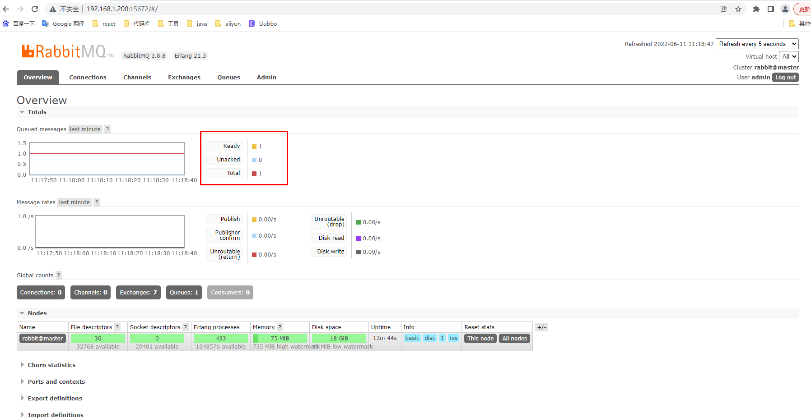
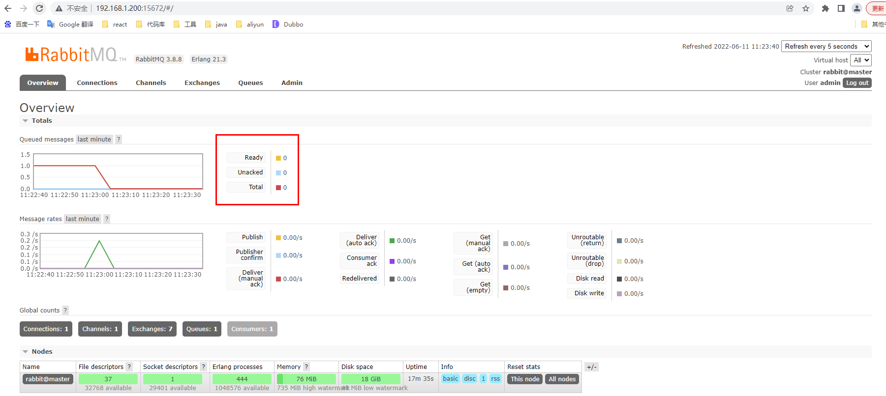

**<font style="color:#DF2A3F;">笔记来源：</font>**[**<font style="color:#DF2A3F;">尚硅谷RabbitMQ教程丨快速掌握MQ消息中间件</font>**](https://www.bilibili.com/video/BV1cb4y1o7zz/?spm_id_from=333.337.search-card.all.click&vd_source=e8046ccbdc793e09a75eb61fe8e84a30)


在本教程的这一部分中，我们将用 Java 编写两个程序。**发送单个消息的生产者和接收消息并打印出来的消费者**。我们将介绍 Java API 中的一些细节。  
在下图中，`P`是我们的生产者，`C`是我们的消费者。中间的框是一个队列-RabbitMQ 代表使用者保留的消息缓冲区  


添加 Maven 依赖

```xml
<!--指定 jdk 编译版本--> <build>
 <plugins>
    <plugins>
      <plugin>
        <groupId>org.apache.maven.plugins</groupId>
        maven-compiler-plugin</artifactId>
        <configuration>
          <source>8</source>
          <target>8</target>
        </configuration>
      </plugin>
    </plugins>
 </plugins>
</build> 

<dependencies>
    <!--rabbitmq 依赖客户端-->
    <dependency>
      <groupId>com.rabbitmq</groupId>
      amqp-client</artifactId>
      <version>5.8.0</version>
    </dependency>
    <!--操作文件流的一个依赖-->
    <dependency>
      <groupId>commons-io</groupId>
      commons-io</artifactId>
      <version>2.6</version>
    </dependency>
</dependencies>
```

## 1 消息生产者
```java
package com.ali.rabbitmq;

import com.rabbitmq.client.Channel;
import com.rabbitmq.client.Connection;
import com.rabbitmq.client.ConnectionFactory;

public class Producer {
    private final static String QUEUE_NAME = "hello";
    public static void main(String[] args) throws Exception {
        //创建一个连接工厂
        ConnectionFactory factory = new ConnectionFactory();
        factory.setHost("192.168.1.200");
        factory.setUsername("admin");
        factory.setPassword("123");
        
        //channel 实现了自动 close 接口 自动关闭 不需要显示关闭
        try(Connection connection = factory.newConnection(); 
            Channel channel = connection.createChannel()
           ) {
            /**
             * 生成一个队列
             * 1.队列名称
             * 2.队列里面的消息是否持久化 默认消息存储在内存中
             * 3.该队列是否只供一个消费者进行消费 是否进行共享 true 可以多个消费者消费
             * 4.是否自动删除 最后一个消费者端开连接以后 该队列是否自动删除 true 自动删除
             * 5.其他参数
             */
            channel.queueDeclare(QUEUE_NAME,false,false,false,null);
            String message="hello world";
            /**
             * 发送一个消息
             * 1.发送到那个交换机
             * 2.路由的 key 是哪个
             * 3.其他的参数信息
             * 4.发送消息的消息体
             */
            channel.basicPublish("",QUEUE_NAME,null,message.getBytes());
            System.out.println("消息发送完毕");
        }
    } 
}
```

发送完成后，查看后台，发现有一个待消费信息  


## 2 消息消费者
```java
package com.ali.rabbitmq;

import com.rabbitmq.client.*;

public class Consumer {
    private final static String QUEUE_NAME = "hello";

    public static void main(String[] args) throws Exception {
        ConnectionFactory factory = new ConnectionFactory();
        factory.setHost("182.92.234.71");
        factory.setUsername("admin");
        factory.setPassword("123");
        Connection connection = factory.newConnection();
        Channel channel = connection.createChannel();
        System.out.println("等待接收消息....");
        //推送的消息如何进行消费的接口回调
        DeliverCallback deliverCallback = (consumerTag, delivery) -> {
            String message = new String(delivery.getBody());
            System.out.println(message);
        };
        //取消消费的一个回调接口 如在消费的时候队列被删除掉了
        CancelCallback cancelCallback = (consumerTag) -> {
            System.out.println("消息消费被中断");
        };
        /**
         * 消费者消费消息
         * 1.消费哪个队列
         * 2.消费成功之后是否要自动应答 true 代表自动应答 false 手动应答
         * 3.消费者未成功消费的回调
         */
        channel.basicConsume(QUEUE_NAME, true, deliverCallback, cancelCallback);
    }
}
```

  
消费完成后查看后台：  



