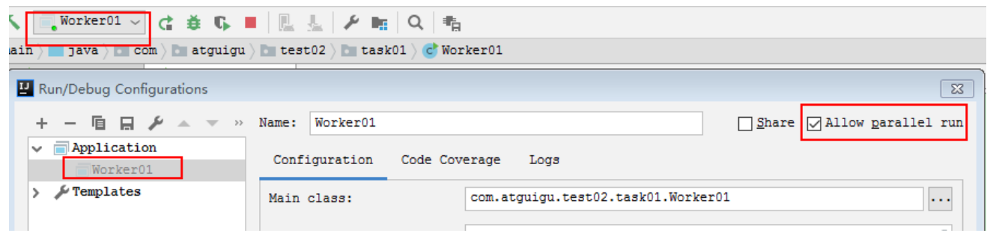
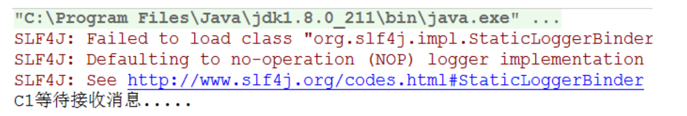
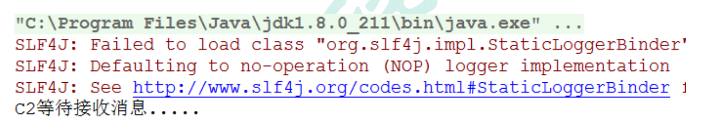
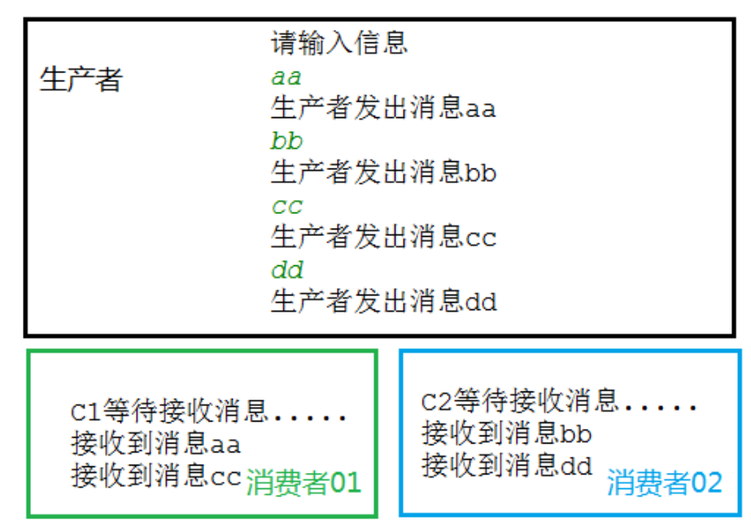

**<font style="color:#DF2A3F;">笔记来源：</font>**[**<font style="color:#DF2A3F;">尚硅谷RabbitMQ教程丨快速掌握MQ消息中间件</font>**](https://www.bilibili.com/video/BV1cb4y1o7zz/?spm_id_from=333.337.search-card.all.click&vd_source=e8046ccbdc793e09a75eb61fe8e84a30)


工作队列（又称任务队列）：主要思想是避免立即执行资源密集型任务，而不得不等待它完成。相反我们安排任务在之后执行。我们把任务封装为消息并将其发送到队列。在后台运行的工作进程将弹出任务并最终执行作业。当有多个工作线程时，这些工作线程将一起处理这些任务。

## 1 轮训分发消息
在这个案例中我们会启动两个工作线程，一个消息发送线程，我们来看看他们两个工作线程是如何工作的。

操作步骤：

1. 抽取工具类

```java
package com.ali.rabbitmq.work;

import com.rabbitmq.client.Channel;
import com.rabbitmq.client.Connection;
import com.rabbitmq.client.ConnectionFactory;

public class RabbitMqUtils {
    //得到一个连接的 channel
    public static Channel getChannel() throws Exception {
        //创建一个连接工厂
        ConnectionFactory factory = new ConnectionFactory();
        factory.setHost("182.92.234.71");
        factory.setUsername("admin");
        factory.setPassword("123");
        Connection connection = factory.newConnection();
        Channel channel = connection.createChannel();
        return channel;
    }
}
```

2. 启动两个工作线程

```java
package com.ali.rabbitmq.work;

import com.rabbitmq.client.CancelCallback;
import com.rabbitmq.client.Channel;
import com.rabbitmq.client.DeliverCallback;

public class Worker01 {
    private static final String QUEUE_NAME="hello";
    public static void main(String[] args) throws Exception {
        Channel channel = RabbitMqUtils.getChannel();
        
        DeliverCallback deliverCallback=(consumerTag, delivery)->{
            String receivedMessage = new String(delivery.getBody());
            System.out.println("接收到消息:"+receivedMessage);
        };
        CancelCallback cancelCallback=(consumerTag)->{
            System.out.println(consumerTag+"消费者取消消费接口回调逻辑");
        };
        System.out.println("C2 消费者启动等待消费......");
        channel.basicConsume(QUEUE_NAME,true,deliverCallback,cancelCallback);
    } 
}
```

启动两次main方法就可以了  
  
  


3. 启动一个发送线程

```java
package com.ali.rabbitmq.work;

import com.rabbitmq.client.Channel;

import java.util.Scanner;

public class Task01 {
    private static final String QUEUE_NAME = "hello";

    public static void main(String[] args) throws Exception {
        try (Channel channel = RabbitMqUtils.getChannel();) {
            channel.queueDeclare(QUEUE_NAME, false, false, false, null);
            //从控制台当中接受信息
            Scanner scanner = new Scanner(System.in);
            while (scanner.hasNext()) {
                String message = scanner.next();
                channel.basicPublish("", QUEUE_NAME, null, message.getBytes());
                System.out.println("发送消息完成:" + message);
            }
        }
    }
}
```

4. 结果展示

通过程序执行发现生产者总共发送 4 个消息，消费者 1 和消费者 2 分别分得两个消息，并且是按照有序的一个接收一次消息  



