**<font style="color:#DF2A3F;">笔记来源：</font>**[**<font style="color:#DF2A3F;">尚硅谷RabbitMQ教程丨快速掌握MQ消息中间件</font>**](https://www.bilibili.com/video/BV1cb4y1o7zz/?spm_id_from=333.337.search-card.all.click&vd_source=e8046ccbdc793e09a75eb61fe8e84a30)

## 1 消费者端消息应答
### 1.1 概念
消费者完成一个任务可能需要一段时间，如果其中一个消费者处理一个长的任务并仅只完成了部分突然它挂掉了，会发生什么情况？

RabbitMQ 一旦向消费者传递了一条消息，便立即将该消息标记为删除。在这种情况下，突然有个消费者挂掉了，我们将丢失正在处理的消息。以及后续发送给该消费者的消息，因为它无法接收到。

为了保证消息在发送过程中不丢失，Rabbitmq 引入消息应答机制，消息应答就是：<font style="color:#DF2A3F;">消费者在接收到消息并且处理该消息之后，告诉 rabbitmq 它已经处理了，rabbitmq 可以把该消息删除了。</font>

### 1.2 自动应答
<font style="color:#DF2A3F;">消息发送后</font>立即被认为已经传送成功，这种模式需要在<font style="color:#DF2A3F;">高吞吐量和数据传输安全性方面做权衡</font>，因为这种模式如果消息在接收到之前，消费者那边出现连接或者 Channel 关闭，那么消息就丢失了。

当然另一方面，这种模式消费者那边可以传递过载的消息，没有对传递的消息数量进行限制，当然这样有可能使得消费者这边由于接收太多还来不及处理的消息，导致这些消息的积压，最终使得内存耗尽，最终这些消费者线程被操作系统杀死，所以这种模式仅适用在消费者可以高效并以某种速率能够处理这些消息的情况下使用。

自动应答和手动应答均指的是消费者端。

### 1.3 手动应答
消息应答的方法 ：

+ `Channel.basicAck`(用于肯定确认) ：RabbitMQ 已知道该消息并且成功的处理消息，可以将其丢弃了
+ `Channel.basicNack`(用于否定确认)
+ `Channel.basicReject`(用于否定确认) ：与`Channel.basicNack`相比少一个参数，不处理该消息了直接拒绝，可以将其丢弃了

### 1.4 Multiple的解释
手动应答的好处是可以批量应答并且减少网络拥堵  
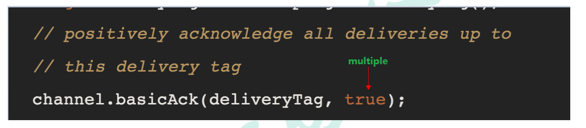

multiple 的 true 和 false 代表不同意思

+ true 代表批量应答 channel 上未应答的消息，比如说 channel 上有传送 tag 的消息 `5,6,7,8` 当前 tag 是 8 那么此时5-8 的这些还未应答的消息都会被确认收到消息应答
+ false 同上面相比只会应答 tag=8 的消息 5,6,7 这三个消息依然不会被确认收到消息应答

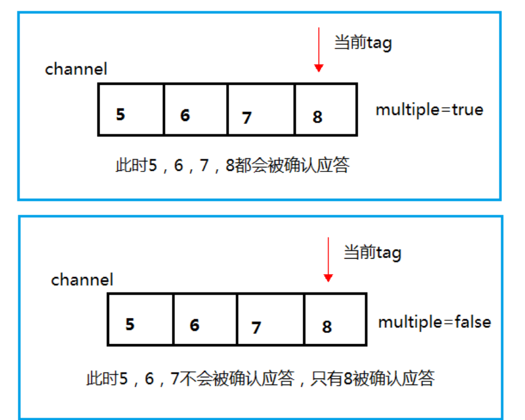

### 1.5 消息自动重新入队
如果消费者由于某些原因失去连接（其通道已关闭，连接已关闭或 TCP 连接丢失），导致消息未发送 ACK 确认，RabbitMQ 将了解到消息未完全处理，并将对其重新排队。如果此时其他消费者可以处理，它将很快将其重新分发给另一个消费者。这样，即使某个消费者偶尔死亡，也可以确保不会丢失任何消息。

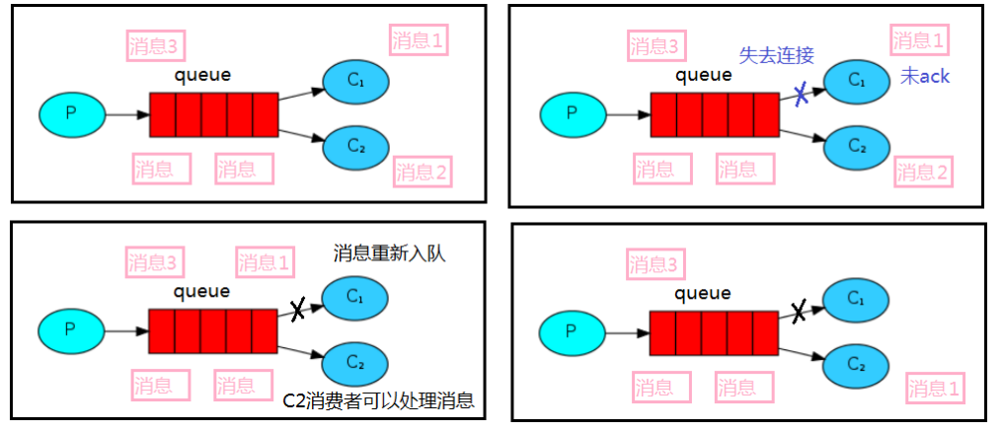

### 1.6 消息手动应答代码
默认消息采用的是自动应答，所以我们要想实现消息消费过程中不丢失，需要把自动应答改为手动应答，消费者在上面代码的基础上增加下面画红色部分代码。  
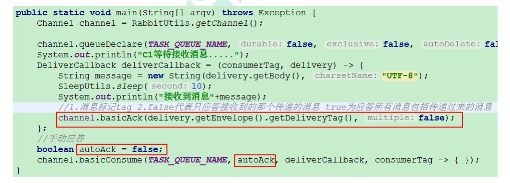

消息生产者

```java
package com.ali.rabbitmq.work;

import com.rabbitmq.client.Channel;

import java.util.Scanner;

public class Task02 {
    private static final String TASK_QUEUE_NAME = "ack_queue";

    public static void main(String[] argv) throws Exception {
        try (Channel channel = RabbitMqUtils.getChannel()) {
            channel.queueDeclare(TASK_QUEUE_NAME, false, false, false, null);
            Scanner sc = new Scanner(System.in);
            System.out.println("请输入信息");
            while (sc.hasNext()) {
                String message = sc.nextLine();
                channel.basicPublish("", TASK_QUEUE_NAME, null, message.getBytes("UTF-8"));
                System.out.println("生产者发出消息" + message);
            }
        }
    }
}
```


消费者 01

```java
package com.ali.rabbitmq.work;

import com.ali.rabbitmq.SleepUtils;
import com.rabbitmq.client.Channel;
import com.rabbitmq.client.DeliverCallback;

import java.util.concurrent.TimeUnit;

public class Work03 {
    private static final String ACK_QUEUE_NAME="ack_queue";
    public static void main(String[] args) throws Exception {
        Channel channel = RabbitMqUtils.getChannel();
        System.out.println("C1 等待接收消息处理时间较短");
        //消息消费的时候如何处理消息
        DeliverCallback deliverCallback=(consumerTag,delivery)->{
            String message= new String(delivery.getBody());
            SleepUtils.sleep(1);
            System.out.println("接收到消息:"+message);
            /**
             * 1.消息标记 tag
             * 2.是否批量应答未应答消息
             */
            channel.basicAck(delivery.getEnvelope().getDeliveryTag(),false);
        };
        //采用手动应答
        boolean autoAck=false;
        channel.basicConsume(ACK_QUEUE_NAME,autoAck,deliverCallback,(consumerTag)->{
            System.out.println(consumerTag+"消费者取消消费接口回调逻辑");
        });
    }

}
```


消费者 02

```java
package com.ali.rabbitmq.work;

import com.ali.rabbitmq.SleepUtils;
import com.rabbitmq.client.Channel;
import com.rabbitmq.client.DeliverCallback;

public class Work04 {
    private static final String ACK_QUEUE_NAME = "ack_queue";

    public static void main(String[] args) throws Exception {
        Channel channel = RabbitMqUtils.getChannel();
        System.out.println("C2 等待接收消息处理时间较长");
        //消息消费的时候如何处理消息
        DeliverCallback deliverCallback = (consumerTag, delivery) -> {
            String message = new String(delivery.getBody());
            SleepUtils.sleep(30);
            System.out.println("接收到消息:" + message);
            /**
             * 1.消息标记 tag
             * 2.是否批量应答未应答消息
             */
            channel.basicAck(delivery.getEnvelope().getDeliveryTag(), false);
        };
        //采用手动应答
        boolean autoAck = false;
        channel.basicConsume(ACK_QUEUE_NAME, autoAck, deliverCallback, (consumerTag) -> {
            System.out.println(consumerTag + "消费者取消消费接口回调逻辑");
        });
    }
}
```


睡眠工具类

```java
package com.ali.rabbitmq;

public class SleepUtils {
    public static void sleep(int second) {
        try {
            Thread.sleep(1000 * second);
        } catch (InterruptedException _ignored) {
            Thread.currentThread().interrupt();
        }
    }
}
```


### 1.7 手动应答效果演示
正常情况下消息发送方发送两个消息 C1 和 C2 分别接收到消息并进行处理  
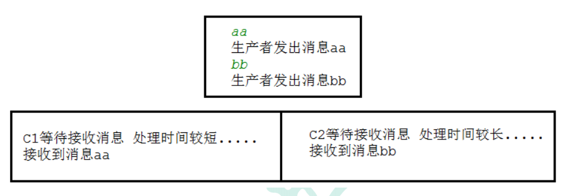

在发送者发送消息 dd，发出消息之后的把 C2 消费者停掉，按理说该 C2 来处理该消息，但是由于它处理时间较长，在还未处理完，也就是说 C2 还没有执行 ack 代码的时候，C2 被停掉了，此时会看到消息被 C1 接收到了，说明消息 dd 被重新入队，然后分配给能处理消息的 C1 处理了  
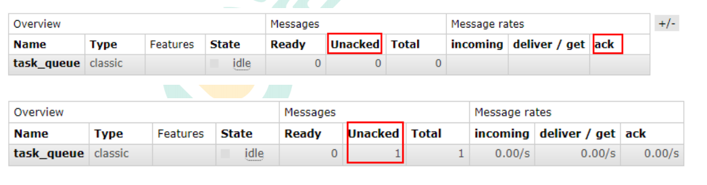

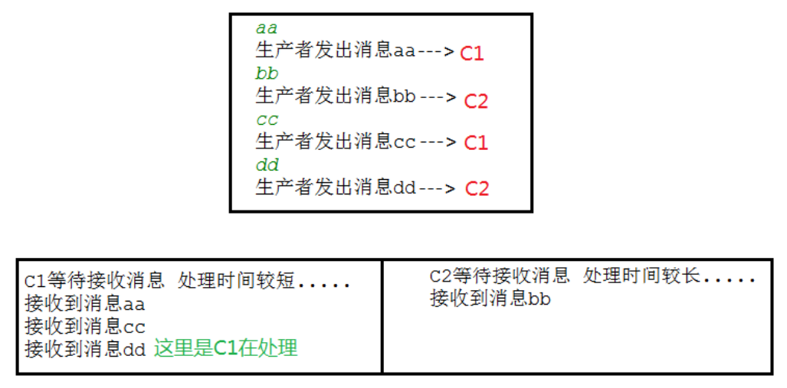

## 2 RabbitMQ 持久化
### 2.1 概念
刚刚我们已经看到了如何处理任务不丢失的情况，但是如何保障当 RabbitMQ 服务停掉以后消息生产者发送过来的消息不丢失。

默认情况下 RabbitMQ 退出或由于某种原因崩溃时，它忽视队列和消息，除非告知它不要这样做。确保消息不会丢失需要做两件事：**<font style="color:#DF2A3F;">我们需要将队列和消息都标记为持久化</font>**

### 2.2 队列如何实现持久化
之前我们创建的队列都是非持久化的，rabbitmq 如果重启的化，该队列就会被删除掉，如果要队列实现持久化 需要在声明队列的时候把 durable 参数设置为持久化  
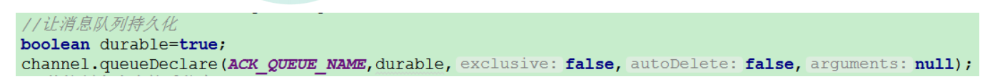

但是需要注意的就是如果之前声明的队列不是持久化的，需要把原先队列先删除，或者重新创建一个持久化的队列，不然就会出现错误。  
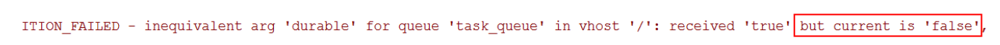

以下为控制台中持久化与非持久化队列的 UI 显示区  
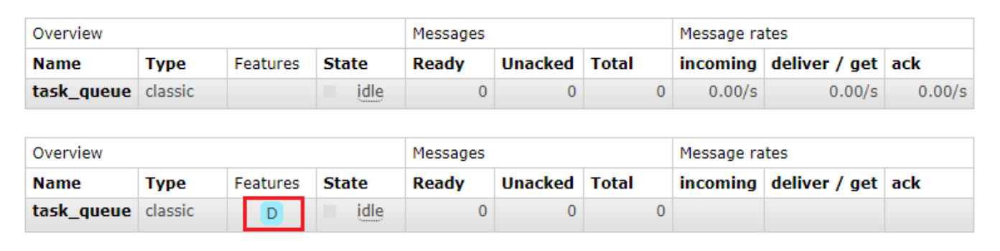  
这个时候即使重启 rabbitmq 队列也依然存在

### 2.3 消息实现持久化
要想让消息实现持久化需要在消息生产者修改代码，MessageProperties.PERSISTENT_TEXT_PLAIN 添加这个属性。  
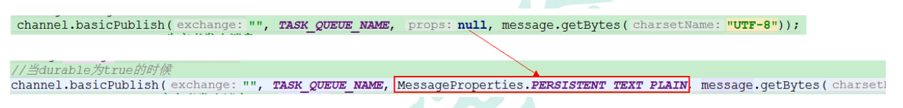

将消息标记为持久化并不能完全保证不会丢失消息。尽管它告诉 RabbitMQ 将消息保存到磁盘，但是这里依然存在当消息刚准备存储在磁盘的时候 但是还没有存储完，消息还在缓存的一个间隔点。此时并没有真正写入磁盘。持久性保证并不强，但是对于我们的简单任务队列而言，这已经绰绰有余了。如果需要更强有力的持久化策略，参考后边课件发布确认章节。

### 2.4 不公平分发
在最开始的时候我们学习到 RabbitMQ 分发消息采用的轮训分发，但是在某种场景下这种策略并不是很好，比方说有两个消费者在处理任务，其中有个消费者 1 处理任务的速度非常快，而另外一个消费者 2 处理速度却很慢，这个时候我们还是采用轮训分发的话，就会到这处理速度快的这个消费者很大一部分时间处于空闲状态，而处理慢的那个消费者一直在干活，这种分配方式在这种情况下其实就不太好，但是RabbitMQ 并不知道这种情况它依然很公平的进行分发。

为了避免这种情况，我们可以设置参数`channel.basicQos(1);`  
  
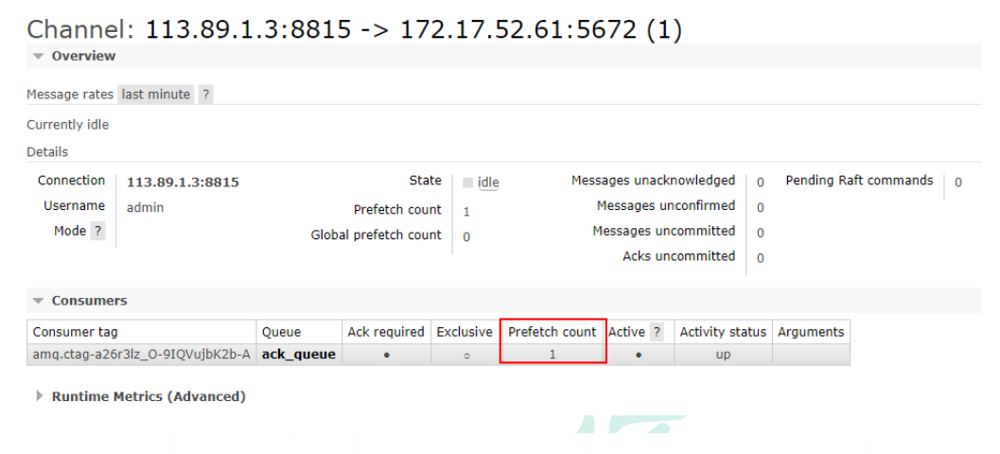  
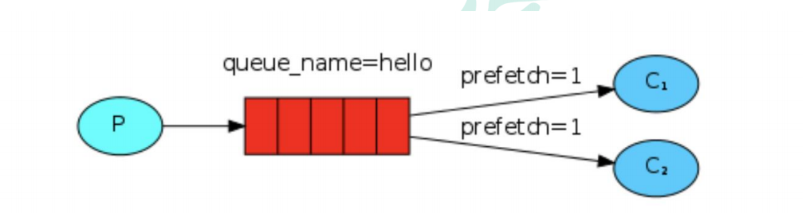

意思就是如果这个任务我还没有处理完或者我还没有应答你，你先别分配给我，我目前只能处理一个任务，然后 rabbitmq 就会把该任务分配给没有那么忙的那个空闲消费者，当然如果所有的消费者都没有完成手上任务，队列还在不停的添加新任务，队列有可能就会遇到队列被撑满的情况，这个时候就只能添加新的 worker 或者改变其他存储任务的策略。

### 2.5 预取值
本身消息的发送就是异步发送的，所以在任何时候，Channel 上肯定不止只有一个消息，另外来自消费者的手动确认本质上也是异步的。

因此这里就存在一个未确认的消息缓冲区，因此希望开发人员能<font style="color:#DF2A3F;">限制此缓冲区的大小，以避免缓冲区里面无限制的未确认消息问题</font>。

这个时候就可以通过使用 basic.qos 方法设置【预取计数】值来完成的。<font style="color:#01B2BC;">该值定义通道上允许的未确认消息的最大数量</font>。一旦数量达到配置的数量，RabbitMQ 将停止在通道上传递更多消息，除非至少有一个未处理的消息被确认。

例如：假设在通道上有未确认的消息 `5、6、7、8`，并且通道的预取计数设置为 4，此时 RabbitMQ 将不会在该通道上再传递任何消息，除非至少有一个未应答的消息被 ack。比方说 tag = 6 这个消息刚刚被确认 ACK，RabbitMQ 将会感知这个情况到并再发送一条消息。

消息应答和 qos 预取值对用户吞吐量有重大影响。通常，增加预取将提高向消费者传递消息的速度。虽然自动应答传输消息速率是最佳的，但是，在这种情况下已传递但尚未处理的消息的数量也会增加，从而增加了消费者的 RAM 消耗（随机存取存储器）。应该<font style="color:#01B2BC;">小心使用具有无限预处理的自动确认模式</font>或<font style="color:#01B2BC;">手动确认模式</font>，消费者消费了大量的消息如果没有确认的话，会导致消费者连接节点的内存消耗变大，所以找到合适的预取值是一个反复试验的过程，不同的负载该值取值也不同。 100 到 300 范围内的值通常可提供最佳的吞吐量，并且不会给消费者带来太大的风险。预取值为 1 是最保守的。当然这将使吞吐量变得很低，特别是消费者连接延迟很严重的情况下，特别是在消费者连接等待时间较长的环境中。对于大多数应用来说，稍微高一点的值将是最佳的。

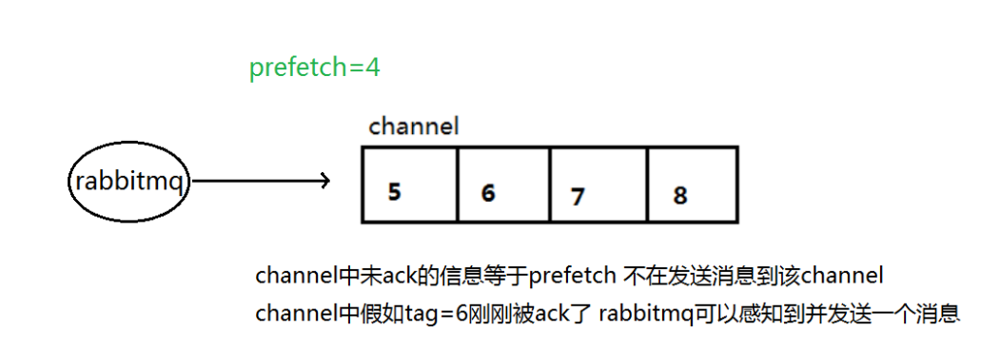

# 9. 


