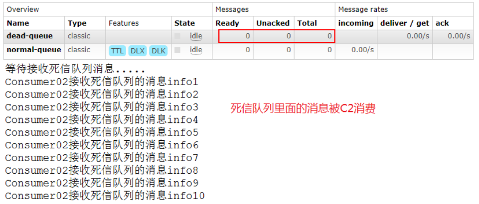
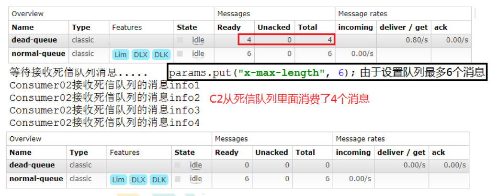
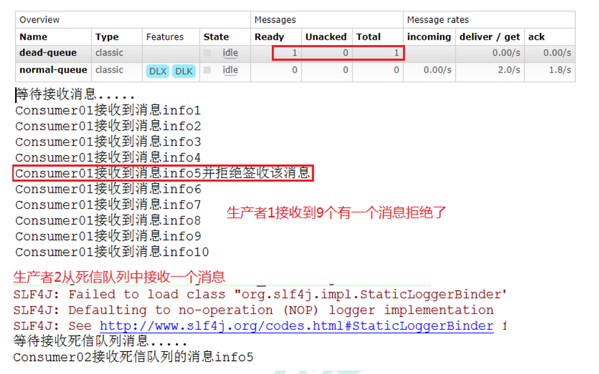

**<font style="color:#DF2A3F;">笔记来源：</font>**[**<font style="color:#DF2A3F;">尚硅谷RabbitMQ教程丨快速掌握MQ消息中间件</font>**](https://www.bilibili.com/video/BV1cb4y1o7zz/?spm_id_from=333.337.search-card.all.click&vd_source=e8046ccbdc793e09a75eb61fe8e84a30)

## 1 概念
死信的概念：先从概念解释上搞清楚这个定义，死信顾名思义就是无法被消费的消息，字面意思可以这样理解，一般来说，Producer 将消息投递到 Broker 或者直接到 Queue 里了，Consumer 从 Queue 取出消息进行消费，`**<font style="color:#DF2A3F;">但某些时候由于特定的原因导致Queue中的某些消息无法被消费</font>**`，这样的消息如果没有后续的处理，就变成了死信，有死信自然就有了死信队列。

应用场景：为了保证订单业务的消息数据不丢失，需要使用到 RabbitMQ 的死信队列机制，当消息消费发生异常时，将消息投入死信队列中。还有比如说：用户在商城下单成功并点击去支付后在指定时间未支付时自动失效。


死信的来源

+ 消息 TTL 过期
+ 队列达到最大长度（队列满了，无法再添加数据到 MQ 中）
+ 消息被拒绝（ basic.reject 或 basic.nack ）并且 requeue=false.

## 2 死信实战
### 2.1 代码架构图


### 2.2 消息 TTL 过期
生产者代码

```java
package com.ali.rabbitmq.sixin.ttl;

import com.ali.rabbitmq.work.RabbitMqUtils;
import com.rabbitmq.client.AMQP;
import com.rabbitmq.client.BuiltinExchangeType;
import com.rabbitmq.client.Channel;

public class Producer {
    private static final String NORMAL_EXCHANGE = "normal_exchange";
    public static void main(String[] argv) throws Exception {
        try (Channel channel = RabbitMqUtils.getChannel()) {
            channel.exchangeDeclare(NORMAL_EXCHANGE, BuiltinExchangeType.DIRECT);
            //设置消息的 TTL 时间
            AMQP.BasicProperties properties = new
                    AMQP.BasicProperties().builder().expiration("10000").build();
            //该信息是用作演示队列个数限制
            for (int i = 1; i <11 ; i++) {
                String message="info"+i;
                channel.basicPublish(NORMAL_EXCHANGE, "zhangsan", properties,
                        message.getBytes());
                System.out.println("生产者发送消息:"+message);
            }
        }
    } }
```


消费者 C1 代码（启动之后关闭该消费者，模拟其接收不到消息）

```java
package com.ali.rabbitmq.sixin.ttl;

import com.ali.rabbitmq.work.RabbitMqUtils;
import com.rabbitmq.client.BuiltinExchangeType;
import com.rabbitmq.client.Channel;
import com.rabbitmq.client.DeliverCallback;

import java.util.HashMap;
import java.util.Map;

public class Consumer01 {
    //普通交换机名称
    private static final String NORMAL_EXCHANGE = "normal_exchange";
    //死信交换机名称
    private static final String DEAD_EXCHANGE = "dead_exchange";

    public static void main(String[] argv) throws Exception {
        Channel channel = RabbitMqUtils.getChannel();
        //声明死信和普通交换机 类型为 direct
        channel.exchangeDeclare(NORMAL_EXCHANGE, BuiltinExchangeType.DIRECT);
        channel.exchangeDeclare(DEAD_EXCHANGE, BuiltinExchangeType.DIRECT);
        //声明死信队列
        String deadQueue = "dead-queue";
        channel.queueDeclare(deadQueue, false, false, false, null);
        //死信队列绑定死信交换机与 routingkey
        channel.queueBind(deadQueue, DEAD_EXCHANGE, "lisi");
        //正常队列绑定死信队列信息
        Map<String, Object> params = new HashMap<>();
        //正常队列设置死信交换机 参数 key 是固定值
        params.put("x-dead-letter-exchange", DEAD_EXCHANGE);
        //正常队列设置死信 routing-key 参数 key 是固定值
        params.put("x-dead-letter-routing-key", "lisi");

        String normalQueue = "normal-queue";
        channel.queueDeclare(normalQueue, false, false, false, params);
        channel.queueBind(normalQueue, NORMAL_EXCHANGE, "zhangsan");
        System.out.println("等待接收消息.....");
        DeliverCallback deliverCallback = (consumerTag, delivery) -> {
            String message = new String(delivery.getBody(), "UTF-8");
            System.out.println("Consumer01 接收到消息" + message);
        };
        channel.basicConsume(normalQueue, true, deliverCallback, consumerTag -> {
        });
    }
}
```


消费者 C2 代码（以上步骤完成后，启动 C2 消费者，它消费死信队列里面的消息）

```java

package com.ali.rabbitmq.sixin.ttl;

import com.ali.rabbitmq.work.RabbitMqUtils;
import com.rabbitmq.client.BuiltinExchangeType;
import com.rabbitmq.client.Channel;
import com.rabbitmq.client.DeliverCallback;

public class Consumer02 {
    private static final String DEAD_EXCHANGE = "dead_exchange";

    public static void main(String[] argv) throws Exception {
        Channel channel = RabbitMqUtils.getChannel();
        channel.exchangeDeclare(DEAD_EXCHANGE, BuiltinExchangeType.DIRECT);
        String deadQueue = "dead-queue";
        channel.queueDeclare(deadQueue, false, false, false, null);
        channel.queueBind(deadQueue, DEAD_EXCHANGE, "lisi");
        System.out.println("等待接收死信队列消息.....");
        DeliverCallback deliverCallback = (consumerTag, delivery) -> {
            String message = new String(delivery.getBody(), "UTF-8");
            System.out.println("Consumer02 接收死信队列的消息" + message);
        };
        channel.basicConsume(deadQueue, true, deliverCallback, consumerTag -> {
        });
    }
}
```



### 2.3 队列达到最大长度
1. 消息生产者代码去掉 TTL 属性

```java
package com.ali.rabbitmq.sixin.maxlength;

import com.ali.rabbitmq.work.RabbitMqUtils;
import com.rabbitmq.client.BuiltinExchangeType;
import com.rabbitmq.client.Channel;

public class Producer {
    private static final String NORMAL_EXCHANGE = "normal_exchange";

    public static void main(String[] argv) throws Exception {
        try (Channel channel = RabbitMqUtils.getChannel()) {
            channel.exchangeDeclare(NORMAL_EXCHANGE, BuiltinExchangeType.DIRECT);
            //该信息是用作演示队列个数限制
            for (int i = 1; i < 11; i++) {
                String message = "info" + i;
                channel.basicPublish(NORMAL_EXCHANGE, "zhangsan", null, message.getBytes());
                System.out.println("生产者发送消息:" + message);
            }
        }
    }
}
```

2. C1 消费者修改以下代码（启动之后关闭该消费者，模拟其接收不到消息）

```java
package com.ali.rabbitmq.sixin.maxlength;

import com.ali.rabbitmq.work.RabbitMqUtils;
import com.rabbitmq.client.BuiltinExchangeType;
import com.rabbitmq.client.Channel;
import com.rabbitmq.client.DeliverCallback;

import java.util.HashMap;
import java.util.Map;

public class Consumer01 {
    //普通交换机名称
    private static final String NORMAL_EXCHANGE = "normal_exchange";
    //死信交换机名称
    private static final String DEAD_EXCHANGE = "dead_exchange";

    public static void main(String[] argv) throws Exception {
        Channel channel = RabbitMqUtils.getChannel();
        //声明死信和普通交换机 类型为 direct
        channel.exchangeDeclare(NORMAL_EXCHANGE, BuiltinExchangeType.DIRECT);
        channel.exchangeDeclare(DEAD_EXCHANGE, BuiltinExchangeType.DIRECT);
        //声明死信队列
        String deadQueue = "dead-queue";
        channel.queueDeclare(deadQueue, false, false, false, null);
        //死信队列绑定死信交换机与 routingkey
        channel.queueBind(deadQueue, DEAD_EXCHANGE, "lisi");
        //正常队列绑定死信队列信息
        Map<String, Object> params = new HashMap<>();
        //正常队列设置死信交换机 参数 key 是固定值
        params.put("x-dead-letter-exchange", DEAD_EXCHANGE);
        //正常队列设置死信 routing-key 参数 key 是固定值
        params.put("x-dead-letter-routing-key", "lisi");

        //设置正常队列长度的限制
        params.put("x-max-length",6);

        String normalQueue = "normal-queue";
        channel.queueDeclare(normalQueue, false, false, false, params);
        channel.queueBind(normalQueue, NORMAL_EXCHANGE, "zhangsan");
        System.out.println("等待接收消息.....");
        DeliverCallback deliverCallback = (consumerTag, delivery) -> {
            String message = new String(delivery.getBody(), "UTF-8");
            System.out.println("Consumer01 接收到消息" + message);
        };
        channel.basicConsume(normalQueue, true, deliverCallback, consumerTag -> {
        });
    }
}
```

注意此时需要把原先队列删除 因为参数改变了，不然服务会报错，无法启动

3. C2 消费者代码不变（启动 C2 消费者）

```java
package com.ali.rabbitmq.sixin.maxlength;

import com.ali.rabbitmq.work.RabbitMqUtils;
import com.rabbitmq.client.BuiltinExchangeType;
import com.rabbitmq.client.Channel;
import com.rabbitmq.client.DeliverCallback;

public class Consumer02 {
    private static final String DEAD_EXCHANGE = "dead_exchange";

    public static void main(String[] argv) throws Exception {
        Channel channel = RabbitMqUtils.getChannel();
        channel.exchangeDeclare(DEAD_EXCHANGE, BuiltinExchangeType.DIRECT);
        String deadQueue = "dead-queue";
        channel.queueDeclare(deadQueue, false, false, false, null);
        channel.queueBind(deadQueue, DEAD_EXCHANGE, "lisi");
        System.out.println("等待接收死信队列消息.....");
        DeliverCallback deliverCallback = (consumerTag, delivery) -> {
            String message = new String(delivery.getBody(), "UTF-8");
            System.out.println("Consumer02 接收死信队列的消息" + message);
        };
        channel.basicConsume(deadQueue, true, deliverCallback, consumerTag -> {
        });
    }
}
```



### 2.4 消息被拒
1. 消息生产者代码同上生产者一致
2. C1 消费者代码（启动之后关闭该消费者，模拟其接收不到消息）

```java
package com.ali.rabbitmq.sixin.reject;

import com.ali.rabbitmq.work.RabbitMqUtils;
import com.rabbitmq.client.BuiltinExchangeType;
import com.rabbitmq.client.Channel;
import com.rabbitmq.client.DeliverCallback;

import java.util.HashMap;
import java.util.Map;

public class Consumer01 {

    //普通交换机名称
    private static final String NORMAL_EXCHANGE = "normal_exchange";
    //死信交换机名称
    private static final String DEAD_EXCHANGE = "dead_exchange";

    public static void main(String[] argv) throws Exception {
        Channel channel = RabbitMqUtils.getChannel();
        //声明死信和普通交换机 类型为 direct
        channel.exchangeDeclare(NORMAL_EXCHANGE, BuiltinExchangeType.DIRECT);
        channel.exchangeDeclare(DEAD_EXCHANGE, BuiltinExchangeType.DIRECT);
        //声明死信队列
        String deadQueue = "dead-queue";
        channel.queueDeclare(deadQueue, false, false, false, null);
        //死信队列绑定死信交换机与 routingkey
        channel.queueBind(deadQueue, DEAD_EXCHANGE, "lisi");
        //正常队列绑定死信队列信息
        Map<String, Object> params = new HashMap<>();
        //正常队列设置死信交换机 参数 key 是固定值
        params.put("x-dead-letter-exchange", DEAD_EXCHANGE);
        //正常队列设置死信 routing-key 参数 key 是固定值
        params.put("x-dead-letter-routing-key", "lisi");
        String normalQueue = "normal-queue";
        channel.queueDeclare(normalQueue, false, false, false, params);
        channel.queueBind(normalQueue, NORMAL_EXCHANGE, "zhangsan");
        System.out.println("等待接收消息.....");
        DeliverCallback deliverCallback = (consumerTag, delivery) -> {
            String message = new String(delivery.getBody(), "UTF-8");
            if (message.equals("info5")) {
                System.out.println("Consumer01 接收到消息" + message + "并拒绝签收该消息");
                //requeue 设置为 false 代表拒绝重新入队 该队列如果配置了死信交换机将发送到死信队列中
                channel.basicReject(delivery.getEnvelope().getDeliveryTag(), false);
            } else {
                System.out.println("Consumer01 接收到消息" + message);
                channel.basicAck(delivery.getEnvelope().getDeliveryTag(), false);
            }
        };
        boolean autoAck = false;
        channel.basicConsume(normalQueue, autoAck, deliverCallback, consumerTag -> {
        });
    }

}
```

 注意此时需要把原先队列删除 因为参数改变了，不然服务会报错，无法启动

3. C2 消费者代码不变，启动消费者1，然后再启动消费者2



