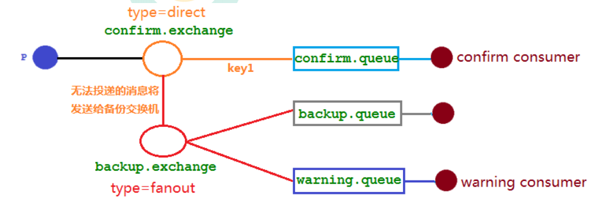

**<font style="color:#DF2A3F;">笔记来源：</font>**[**<font style="color:#DF2A3F;">尚硅谷RabbitMQ教程丨快速掌握MQ消息中间件</font>**](https://www.bilibili.com/video/BV1cb4y1o7zz/?spm_id_from=333.337.search-card.all.click&vd_source=e8046ccbdc793e09a75eb61fe8e84a30)


在生产环境中由于一些不明原因，导致 rabbitmq 重启，在 RabbitMQ 重启期间生产者消息投递失败，导致消息丢失，需要手动处理和恢复。于是，我们开始思考，如何才能进行 RabbitMQ 的消息可靠投递呢？  
特别是在这样比较极端的情况，RabbitMQ 集群不可用的时候，无法投递的消息该如何处理呢:  


## 1 发布确认SpringBoot版本
### 1.1 确认机制方案


### 1.2 代码架构图


### 1.3 配置文件
在配置文件当中需要添加

```properties
spring.rabbitmq.publisher-confirm-type=correlated
```

+ `NONE`：禁用发布确认模式，是默认值
+ `CORRELATED`：发布消息成功到交换器后会触发回调方法
+ `SIMPLE`：经测试有两种效果，其一效果和 CORRELATED 值一样会触发回调方法，其二在发布消息成功后使用 rabbitTemplate 调用 waitForConfirms 或 waitForConfirmsOrDie 方法等待 broker 节点返回发送结果，根据返回结果来判定下一步的逻辑，要注意的点是waitForConfirmsOrDie 方法如果返回 false 则会关闭 channel，则接下来无法发送消息到 broker

```properties
spring.rabbitmq.host=182.92.234.71
spring.rabbitmq.port=5672
spring.rabbitmq.username=admin
spring.rabbitmq.password=123
spring.rabbitmq.publisher-confirm-type=correlated
```

### 1.4 添加配置类
```java
package com.ali.config;

import org.springframework.amqp.core.*;
import org.springframework.beans.factory.annotation.Qualifier;
import org.springframework.context.annotation.Bean;
import org.springframework.context.annotation.Configuration;

@Configuration
public class ConfirmConfig {
    public static final String CONFIRM_EXCHANGE_NAME = "confirm.exchange";
    public static final String CONFIRM_QUEUE_NAME = "confirm.queue";
    //声明业务 Exchange
    @Bean("confirmExchange")
    public DirectExchange confirmExchange(){
        return new DirectExchange(CONFIRM_EXCHANGE_NAME);
    }
    // 声明确认队列
    @Bean("confirmQueue")
    public Queue confirmQueue(){
        return QueueBuilder.durable(CONFIRM_QUEUE_NAME).build();
    }
    // 声明确认队列绑定关系
    @Bean
    public Binding queueBinding(@Qualifier("confirmQueue") Queue queue,
                                @Qualifier("confirmExchange") DirectExchange exchange){
        return BindingBuilder.bind(queue).to(exchange).with("key1");
    } }
```

### 1.5 消息生产者
```java
package com.ali.controller;

import com.ali.callback.MyCallBack;
import lombok.extern.slf4j.Slf4j;
import org.springframework.amqp.rabbit.connection.CorrelationData;
import org.springframework.amqp.rabbit.core.RabbitTemplate;
import org.springframework.beans.factory.annotation.Autowired;
import org.springframework.web.bind.annotation.GetMapping;
import org.springframework.web.bind.annotation.PathVariable;
import org.springframework.web.bind.annotation.RequestMapping;
import org.springframework.web.bind.annotation.RestController;

import javax.annotation.PostConstruct;

@RestController
@RequestMapping("/confirm")
@Slf4j
public class Producer {
    public static final String CONFIRM_EXCHANGE_NAME = "confirm.exchange";
    @Autowired
    private RabbitTemplate rabbitTemplate;
    @Autowired
    private MyCallBack myCallBack;

    //依赖注入 rabbitTemplate 之后再设置它的回调对象
    @PostConstruct
    public void init() {
        rabbitTemplate.setConfirmCallback(myCallBack);
    }

    @GetMapping("sendMessage/{message}")
    public void sendMessage(@PathVariable String message) {
        //指定消息 id 为 1
        CorrelationData correlationData1 = new CorrelationData("1");
        String routingKey = "key1";

        rabbitTemplate.convertAndSend(CONFIRM_EXCHANGE_NAME, routingKey, message + routingKey, correlationData1);
        CorrelationData correlationData2 = new CorrelationData("2");
        routingKey = "key2";

        rabbitTemplate.convertAndSend(CONFIRM_EXCHANGE_NAME, routingKey, message + routingKey, correlationData2);
        log.info("发送消息内容:{}", message);
    }
}
```

### 1.6 回调接口
```java
package com.ali.callback;

import lombok.extern.slf4j.Slf4j;
import org.springframework.amqp.core.Message;
import org.springframework.amqp.rabbit.connection.CorrelationData;
import org.springframework.amqp.rabbit.core.RabbitTemplate;
import org.springframework.stereotype.Component;

@Component
@Slf4j
public class MyCallBack implements RabbitTemplate.ConfirmCallback {
    /**
     * 交换机不管是否收到消息的一个回调方法
     * CorrelationData
     * 消息相关数据
     * ack
     * 交换机是否收到消息
     */
    @Override
    public void confirm(CorrelationData correlationData, boolean ack, String cause) {
        String id=correlationData!=null?correlationData.getId():"";
        if(ack){
            log.info("交换机已经收到 id 为:{}的消息",id);
        }else{
            log.info("交换机还未收到 id 为:{}消息,由于原因:{}",id,cause);
        }
    }
}
```

### 1.7 消息消费者
```java
package com.ali.consumer;

import lombok.extern.slf4j.Slf4j;
import org.springframework.amqp.core.Message;
import org.springframework.amqp.rabbit.annotation.RabbitListener;
import org.springframework.stereotype.Component;

@Component
@Slf4j
public class ConfirmConsumer {
    public static final String CONFIRM_QUEUE_NAME = "confirm.queue";

    @RabbitListener(queues = CONFIRM_QUEUE_NAME)
    public void receiveMsg(Message message) {
        String msg = new String(message.getBody());
        log.info("接受到队列 confirm.queue 消息:{}", msg);
    }
}
```

### 1.8 结果分析


可以看到，发送了两条消息，第一条消息的 RoutingKey 为 "key1"，第二条消息的 RoutingKey 为"key2"，两条消息都成功被交换机接收，也收到了交换机的确认回调，但消费者只收到了一条消息，因为第二条消息的 RoutingKey 与队列的 BindingKey 不一致，也没有其它队列能接收这个消息，所有第二条消息被直接丢弃了。

## 2 回退消息
### 2.1 Mandatory 参数
在仅开启了生产者确认机制的情况下，交换机接收到消息后，会直接给消息生产者发送确认消息，如果发现该消息不可路由，那么消息会被直接丢弃，此时生产者是不知道消息被丢弃这个事件的。那么如何让无法被路由的消息帮我想办法处理一下？最起码通知我一声，我好自己处理啊。通过设置 mandatory 参数可以在当消息传递过程中不可达目的地时将消息返回给生产者。


配置文件中添加：

```properties
spring.rabbitmq.publisher-returns=true
```

### 2.2 消息生产者代码
```java
package com.ali.controller;

import lombok.extern.slf4j.Slf4j;
import org.springframework.amqp.core.Message;
import org.springframework.amqp.rabbit.connection.CorrelationData;
import org.springframework.amqp.rabbit.core.RabbitTemplate;
import org.springframework.beans.factory.annotation.Autowired;
import org.springframework.stereotype.Component;
import org.springframework.web.bind.annotation.GetMapping;
import org.springframework.web.bind.annotation.RestController;

import javax.annotation.PostConstruct;
import java.util.UUID;

@Slf4j
@Component
@RestController
public class MessageProducer implements RabbitTemplate.ConfirmCallback,
        RabbitTemplate.ReturnCallback {
    @Autowired
    private RabbitTemplate rabbitTemplate;

    //rabbitTemplate 注入之后就设置该值
    @PostConstruct
    private void init() {
        rabbitTemplate.setConfirmCallback(this);
        /**
         * true：
         * 交换机无法将消息进行路由时，会将该消息返回给生产者
         * false：
         * 如果发现消息无法进行路由，则直接丢弃
         */
        rabbitTemplate.setMandatory(true);
        //设置回退消息交给谁处理
        rabbitTemplate.setReturnCallback(this);
    }

    @GetMapping("sendMessage")
    public void sendMessage(String message) {
        //让消息绑定一个 id 值
        CorrelationData correlationData1 = new CorrelationData(UUID.randomUUID().toString());
        rabbitTemplate.convertAndSend("confirm.exchange", "key1", message + "key1", correlationData1)
        ;
        log.info("发送消息 id 为:{}内容为{}", correlationData1.getId(), message + "key1");
        CorrelationData correlationData2 = new CorrelationData(UUID.randomUUID().toString());

        rabbitTemplate.convertAndSend("confirm.exchange", "key2", message + "key2", correlationData2)
        ;
        log.info("发送消息 id 为:{}内容为{}", correlationData2.getId(), message + "key2");
    }

    @Override
    public void confirm(CorrelationData correlationData, boolean ack, String cause) {
        String id = correlationData != null ? correlationData.getId() : "";
        if (ack) {
            log.info("交换机收到消息确认成功, id:{}", id);
        } else {
            log.error("消息 id:{}未成功投递到交换机,原因是:{}", id, cause);
        }
    }

    @Override
    public void returnedMessage(Message message, int replyCode, String replyText, String
            exchange, String routingKey) {
        log.info("消息:{}被服务器退回，退回原因:{}, 交换机是:{}, 路由 key:{}",
                new String(message.getBody()), replyText, exchange, routingKey);
    }
}
```

### 2.3 结果分析


## 3 备份交换机
有了 mandatory 参数和回退消息，我们获得了对无法投递消息的感知能力，有机会在生产者的消息无法被投递时发现并处理。但有时候，我们并不知道该如何处理这些无法路由的消息，最多打个日志，然后触发报警，再来手动处理。而通过日志来处理这些无法路由的消息是很不优雅的做法，特别是当生产者所在的服务有多台机器的时候，手动复制日志会更加麻烦而且容易出错。而且设置 mandatory 参数会增加生产者的复杂性，需要添加处理这些被退回的消息的逻辑。如果既不想丢失消息，又不想增加生产者的复杂性，该怎么做呢？前面在设置死信队列的文章中，我们提到，可以为队列设置死信交换机来存储那些处理失败的消息，可是这些不可路由消息根本没有机会进入到队列，因此无法使用死信队列来保存消息。在 RabbitMQ 中，有一种备份交换机的机制存在，可以很好的应对这个问题。什么是备份交换机呢？备份交换机可以理解为 RabbitMQ 中交换机的“备胎”，当我们为某一个交换机声明一个对应的备份交换机时，就是为它创建一个备胎，当交换机接收到一条不可路由消息时，将会把这条消息转发到备份交换机中，由备份交换机来进行转发和处理，通常备份交换机的类型为 Fanout ，这样就能把所有消息都投递到与其绑定的队列中，然后我们在备份交换机下绑定一个队列，这样所有那些原交换机无法被路由的消息，就会都进入这个队列了。当然，我们还可以建立一个报警队列，用独立的消费者来进行监测和报警。

### 3.1 代码架构图




### 3.2 修改配置类
```java
package com.ali.config;

import org.springframework.amqp.core.*;
import org.springframework.beans.factory.annotation.Qualifier;
import org.springframework.context.annotation.Bean;
import org.springframework.context.annotation.Configuration;

@Configuration
public class BackExchangeConfig {
    public static final String CONFIRM_EXCHANGE_NAME = "confirm.exchange";
    public static final String CONFIRM_QUEUE_NAME = "confirm.queue";
    public static final String BACKUP_EXCHANGE_NAME = "backup.exchange";
    public static final String BACKUP_QUEUE_NAME = "backup.queue";
    public static final String WARNING_QUEUE_NAME = "warning.queue";
    // 声明确认队列
    @Bean("confirmQueue")
    public Queue confirmQueue(){
        return QueueBuilder.durable(CONFIRM_QUEUE_NAME).build();
    }
    //声明确认队列绑定关系
    @Bean
    public Binding queueBinding(@Qualifier("confirmQueue") Queue queue,
                                @Qualifier("confirmExchange") DirectExchange exchange){
        return BindingBuilder.bind(queue).to(exchange).with("key1");
    }
    //声明备份 Exchange
    @Bean("backupExchange")
    public FanoutExchange backupExchange(){
        return new FanoutExchange(BACKUP_EXCHANGE_NAME);
    }
    //声明确认 Exchange 交换机的备份交换机
    @Bean("confirmExchange")
    public DirectExchange confirmExchange(){
        ExchangeBuilder exchangeBuilder =
                ExchangeBuilder.directExchange(CONFIRM_EXCHANGE_NAME)
                        .durable(true)
                        //设置该交换机的备份交换机
                        .withArgument("alternate-exchange", BACKUP_EXCHANGE_NAME);
        return (DirectExchange)exchangeBuilder.build();
    }
    // 声明警告队列
    @Bean("warningQueue")
    public Queue warningQueue(){
        return QueueBuilder.durable(WARNING_QUEUE_NAME).build();
    }
    // 声明报警队列绑定关系
    @Bean
    public Binding warningBinding(@Qualifier("warningQueue") Queue queue,
                                  @Qualifier("backupExchange") FanoutExchange
                                          backupExchange){
        return BindingBuilder.bind(queue).to(backupExchange);
    }
    // 声明备份队列
    @Bean("backQueue")
    public Queue backQueue(){
        return QueueBuilder.durable(BACKUP_QUEUE_NAME).build();
    }
    // 声明备份队列绑定关系
    @Bean
    public Binding backupBinding(@Qualifier("backQueue") Queue queue,
                                 @Qualifier("backupExchange") FanoutExchange backupExchange){
        return BindingBuilder.bind(queue).to(backupExchange);
    }
}
```

### 3.3 报警消费者
```java
package com.ali.consumer;

import lombok.extern.slf4j.Slf4j;
import org.springframework.amqp.core.Message;
import org.springframework.amqp.rabbit.annotation.RabbitListener;
import org.springframework.stereotype.Component;

@Component
@Slf4j
public class WarningConsumer {
    public static final String WARNING_QUEUE_NAME = "warning.queue";

    @RabbitListener(queues = WARNING_QUEUE_NAME)
    public void receiveWarningMsg(Message message) {
        String msg = new String(message.getBody());
        log.error("报警发现不可路由消息：{}", msg);
    }
}
```

### 3.4 测试注意事项
重新启动项目的时候需要把原来的`confirm.exchange`删除因为我们修改了其绑定属性，不然报以下错:  


### 3.5 结果分析


mandatory 参数与备份交换机可以一起使用的时候，如果两者同时开启，消息究竟何去何从？谁优先级高，经过上面结果显示答案是备份交换机优先级高。


