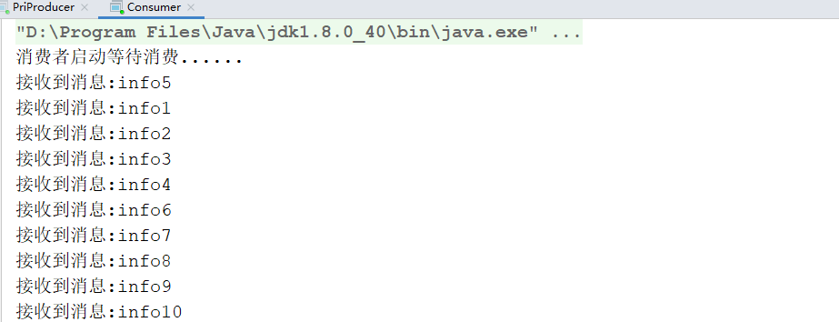

**<font style="color:#DF2A3F;">笔记来源：</font>**[**<font style="color:#DF2A3F;">尚硅谷RabbitMQ教程丨快速掌握MQ消息中间件</font>**](https://www.bilibili.com/video/BV1cb4y1o7zz/?spm_id_from=333.337.search-card.all.click&vd_source=e8046ccbdc793e09a75eb61fe8e84a30)


## 1 幂等性
### 1.1 概念
用户对于同一操作发起的一次请求或者多次请求的结果是一致的，不会因为多次点击而产生了副作用。举个最简单的例子，那就是支付，用户购买商品后支付，支付扣款成功，但是返回结果的时候网络异常，此时钱已经扣了，用户再次点击按钮，此时会进行第二次扣款，返回结果成功，用户查询余额发现多扣钱了，流水记录也变成了两条。在以前的单应用系统中，我们只需要把数据操作放入事务中即可，发生错误立即回滚，但是再响应客户端的时候也有可能出现网络中断或者异常等等

### 1.2 消息重复消费
消费者在消费 MQ 中的消息时，MQ 已把消息发送给消费者，消费者在给 MQ 返回 ack 时网络中断，故 MQ 未收到确认信息，该条消息会重新发给其他的消费者，或者在网络重连后再次发送给该消费者，但实际上该消费者已成功消费了该条消息，造成消费者消费了重复的消息。

### 1.3 解决思路
MQ 消费者的幂等性的解决一般使用全局 ID 或者写个唯一标识比如时间戳 或者 UUID 或者订单消费者消费 MQ 中的消息也可利用 MQ 的该 id 来判断，或者可按自己的规则生成一个全局唯一 id，每次消费消息时用该 id 先判断该消息是否已消费过。

### 1.4 消费端的幂等性保障
在海量订单生成的业务高峰期，生产端有可能就会重复发生了消息，这时候消费端就要实现幂等性，这就意味着我们的消息永远不会被消费多次，即使我们收到了一样的消息。业界主流的幂等性有两种操作:a.唯一 ID+指纹码机制,利用数据库主键去重, b.利用 redis 的原子性去实现

+ 唯一ID+指纹码机制
    - 指纹码:我们的一些规则或者时间戳加别的服务给到的唯一信息码,它并不一定是我们系统生成的，基本都是由我们的业务规则拼接而来，但是一定要保证唯一性，然后就利用查询语句进行判断这个 id 是否存在数据库中,优势就是实现简单就一个拼接，然后查询判断是否重复；劣势就是在高并发时，如果是单个数据库就会有写入性能瓶颈当然也可以采用分库分表提升性能，但也不是我们最推荐的方式。
+ Redis原子性
    - 利用 redis 执行 setnx 命令，天然具有幂等性。从而实现不重复消费


## 2 优先级队列
### 2.1 使用场景
在我们系统中有一个订单催付的场景，我们的客户在天猫下的订单,淘宝会及时将订单推送给我们，如果在用户设定的时间内未付款那么就会给用户推送一条短信提醒，很简单的一个功能对吧，但是，tmall商家对我们来说，肯定是要分大客户和小客户的对吧，比如像苹果，小米这样大商家一年起码能给我们创造很大的利润，所以理应当然，他们的订单必须得到优先处理，而曾经我们的后端系统是使用 redis 来存放的定时轮询，大家都知道 redis 只能用 List 做一个简简单单的消息队列，并不能实现一个优先级的场景，所以订单量大了后采用 RabbitMQ 进行改造和优化,如果发现是大客户的订单给一个相对比较高的优先级，否则就是默认优先级。

### 2.2 如何添加
a. 控制台页面添加  


b. 队列中代码添加优先级

```java
Map<String, Object> params = new HashMap();
params.put("x-max-priority", 10);
channel.queueDeclare("hello", true, false, false, params);
```


c. 消息中代码添加优先级

```java
AMQP.BasicProperties properties = new 
AMQP.BasicProperties().builder().priority(5).build();
```

> 注意事项：要让队列实现优先级需要做的事情有如下事情:队列需要设置为优先级队列，消息需要设置消息的优先级，消费者需要等待消息已经发送到队列中才去消费因为，这样才有机会对消息进行排序
>

### 2.3 实战
a. 消息生产者

```java
package com.ali.rabbitmq.pri;

import com.ali.rabbitmq.work.RabbitMqUtils;
import com.rabbitmq.client.AMQP;
import com.rabbitmq.client.Channel;

public class PriProducer {
    private static final String QUEUE_NAME = "hello";

    public static void main(String[] args) throws Exception {
        try (Channel channel = RabbitMqUtils.getChannel();) {
            //给消息赋予一个 priority 属性
            AMQP.BasicProperties properties = new
                    AMQP.BasicProperties().builder().priority(5).build();
            for (int i = 1; i < 11; i++) {
                String message = "info" + i;
                if (i == 5) {
                    channel.basicPublish("", QUEUE_NAME, properties, message.getBytes());
                } else {
                    channel.basicPublish("", QUEUE_NAME, null, message.getBytes());
                }
                System.out.println("发送消息完成:" + message);
            }
        }
    }
}
```


b. 消息消费者

```java
package com.ali.rabbitmq.pri;

import com.ali.rabbitmq.work.RabbitMqUtils;
import com.rabbitmq.client.Channel;
import com.rabbitmq.client.DeliverCallback;

import java.util.HashMap;
import java.util.Map;

public class Consumer {
    private static final String QUEUE_NAME="hello";
    public static void main(String[] args) throws Exception {
        Channel channel = RabbitMqUtils.getChannel();
        //设置队列的最大优先级 最大可以设置到 255 官网推荐 1-10 如果设置太高比较吃内存和 CPU
        Map<String, Object> params = new HashMap();
        params.put("x-max-priority", 10);
        channel.queueDeclare(QUEUE_NAME, true, false, false, params);
        System.out.println("消费者启动等待消费......");
        DeliverCallback deliverCallback=(consumerTag, delivery)->{
            String receivedMessage = new String(delivery.getBody());
            System.out.println("接收到消息:"+receivedMessage);
        };
        channel.basicConsume(QUEUE_NAME,true,deliverCallback,(consumerTag)->{
            System.out.println("消费者无法消费消息时调用，如队列被删除");
        });
    } }
```




## 3 惰性队列
### 3.1 使用场景
RabbitMQ 从 3.6.0 版本开始引入了惰性队列的概念。惰性队列会尽可能的将消息存入磁盘中，而在消费者消费到相应的消息时才会被加载到内存中，它的一个重要的设计目标是能够支持更长的队列，即支持更多的消息存储。当消费者由于各种各样的原因(比如消费者下线、宕机亦或者是由于维护而关闭等)而致使长时间内不能消费消息造成堆积时，惰性队列就很有必要了。

默认情况下，当生产者将消息发送到 RabbitMQ 的时候，队列中的消息会尽可能的存储在内存之中，这样可以更加快速的将消息发送给消费者。即使是持久化的消息，在被写入磁盘的同时也会在内存中驻留一份备份。当 RabbitMQ 需要释放内存的时候，会将内存中的消息换页至磁盘中，这个操作会耗费较长的时间，也会阻塞队列的操作，进而无法接收新的消息。虽然 RabbitMQ 的开发者们一直在升级相关的算法，但是效果始终不太理想，尤其是在消息量特别大的时候。


### 3.2 两种模式
队列具备两种模式：default 和 lazy。默认的为 default 模式，在 3.6.0 之前的版本无需做任何变更。lazy模式即为惰性队列的模式，可以通过调用 channel.queueDeclare 方法的时候在参数中设置，也可以通过Policy 的方式设置，如果一个队列同时使用这两种方式设置的话，那么 Policy 的方式具备更高的优先级。如果要通过声明的方式改变已有队列的模式的话，那么只能先删除队列，然后再重新声明一个新的。

在队列声明的时候可以通过`x-queue-mode`参数来设置队列的模式，取值为`default`和`lazy`。下面示例中演示了一个惰性队列的声明细节：

```java
Map<String, Object> args = new HashMap<String, Object>();
args.put("x-queue-mode", "lazy");
channel.queueDeclare("myqueue", false, false, false, args);
```


### 3.3 内存开销对比
在发送 1 百万条消息，每条消息大概占 1KB 的情况下，普通队列占用内存是 1.2GB，而惰性队列仅仅占用 1.5MB  


