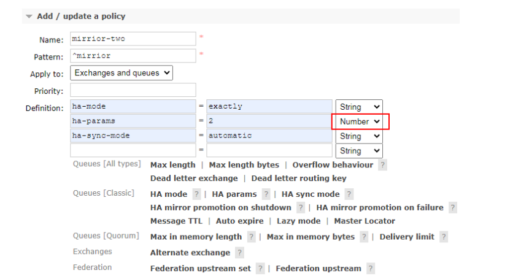
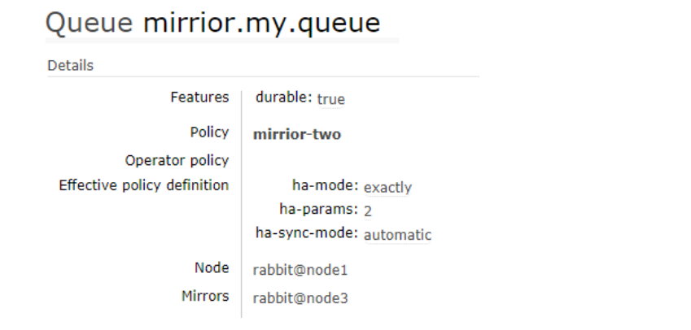
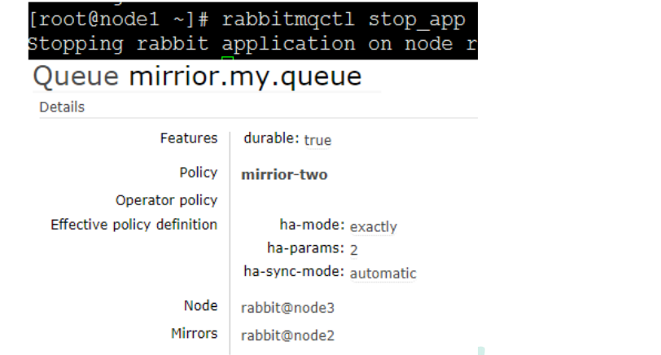
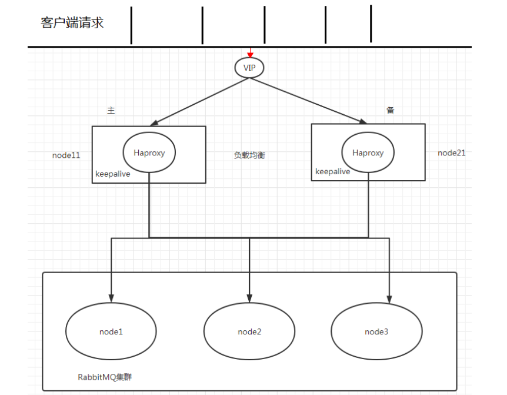

**<font style="color:#DF2A3F;">笔记来源：</font>**[**<font style="color:#DF2A3F;">尚硅谷RabbitMQ教程丨快速掌握MQ消息中间件</font>**](https://www.bilibili.com/video/BV1cb4y1o7zz/?spm_id_from=333.337.search-card.all.click&vd_source=e8046ccbdc793e09a75eb61fe8e84a30)

# 1 clustering
使用集群的原因

最开始我们介绍了如何安装及运行 RabbitMQ 服务，不过这些是单机版的，无法满足目前真实应用的要求。如果 RabbitMQ 服务器遇到内存崩溃、机器掉电或者主板故障等情况，该怎么办？单台 RabbitMQ服务器可以满足每秒 1000 条消息的吞吐量，那么如果应用需要 RabbitMQ 服务满足每秒 10 万条消息的吞吐量呢？购买昂贵的服务器来增强单机 RabbitMQ 务的性能显得捉襟见肘，搭建一个 RabbitMQ 集群才是解决实际问题的关键.

## 1.1 搭建步骤
1. 修改 3 台机器的主机名称

```bash
vim /etc/hostname
```

2. 配置各个节点的 hosts 文件，让各个节点都能互相识别对方

```bash
vim /etc/hosts
10.211.55.74 node1
10.211.55.75 node2
10.211.55.76 node3
```

3. 以确保各个节点的 cookie 文件使用的是同一个值  
在 node1 上执行远程操作命令

```bash
scp /var/lib/rabbitmq/.erlang.cookie root@node2:/var/lib/rabbitmq/.erlang.cookie
scp /var/lib/rabbitmq/.erlang.cookie root@node3:/var/lib/rabbitmq/.erlang.cookie
```

4. 启动 RabbitMQ 服务,顺带启动 Erlang 虚拟机和 RbbitMQ 应用服务(在三台节点上分别执行以下命令)

```bash
rabbitmq-server -detached
```

5. 在节点 2 执行

```bash
rabbitmqctl stop_app
rabbitmqctl stop  #会将 Erlang 虚拟机关闭，rabbitmqctl stop_app 只关闭 RabbitMQ 服务
rabbitmqctl reset
rabbitmqctl join_cluster rabbit@node1
rabbitmqctl start_app  #只启动应用服务
```

6. 在节点 3 执行

```bash
rabbitmqctl stop_app
rabbitmqctl reset
rabbitmqctl join_cluster rabbit@node2
rabbitmqctl start_app
```

7. 集群状态

```bash
rabbitmqctl cluster_status
```

8. 需要重新设置用户

```bash
#创建账号
rabbitmqctl add_user admin 123
#设置用户角色
rabbitmqctl set_user_tags admin administrator
#设置用户权限
rabbitmqctl set_permissions -p "/" admin ".*" ".*" ".*"
```

9. 解除集群节点(node2 和 node3 机器分别执行)

```bash
rabbitmqctl stop_app
rabbitmqctl reset
rabbitmqctl start_app
rabbitmqctl cluster_status
rabbitmqctl forget_cluster_node rabbit@node2     #node1 机器上执行
```


# 2 镜像队列
## 2.1 使用镜像的原因
如果 RabbitMQ 集群中只有一个 Broker 节点，那么该节点的失效将导致整体服务的临时性不可用，并且也可能会导致消息的丢失。可以将所有消息都设置为持久化，并且对应队列的durable属性也设置为true，但是这样仍然无法避免由于缓存导致的问题：因为消息在发送之后和被写入磁盘井执行刷盘动作之间存在一个短暂却会产生问题的时间窗。通过 publisherconfirm 机制能够确保客户端知道哪些消息己经存入磁盘，尽管如此，一般不希望遇到因单点故障导致的服务不可用。

引入镜像队列(Mirror Queue)的机制，可以将队列镜像到集群中的其他 Broker 节点之上，如果集群中的一个节点失效了，队列能自动地切换到镜像中的另一个节点上以保证服务的可用性。


## 2.2 搭建步骤
1. 启动三台集群节点
2. 随便找一个节点添加 policy  
  
3. 在 node1 上创建一个队列发送一条消息，队列存在镜像队列  

4. 停掉 node1 之后发现 node2 成为镜像队列  

5. 就算整个集群只剩下一台机器了，依然能消费队列里面的消息，说明队列里面的消息被镜像队列传递到相应机器里面了


# 3 Haproxy+Keepalive实现高可用负载均衡
整体架构图



Haproxy 实现负载均衡

HAProxy 提供高可用性、负载均衡及基于 TCPHTTP 应用的代理，支持虚拟主机，它是免费、快速并且可靠的一种解决方案，包括 Twitter,Reddit,StackOverflow,GitHub 在内的多家知名互联网公司在使用。HAProxy 实现了一种事件驱动、单一进程模型，此模型支持非常大的井发连接数。

扩展 nginx,lvs,haproxy 之间的区别: [http://www.ha97.com/5646.html](http://www.ha97.com/5646.html)

