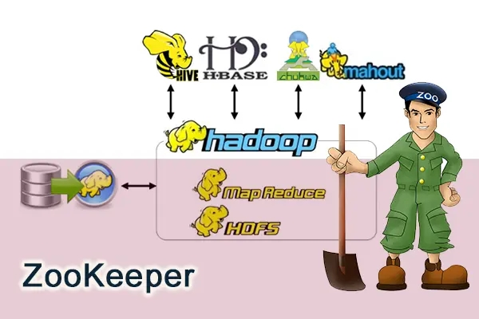
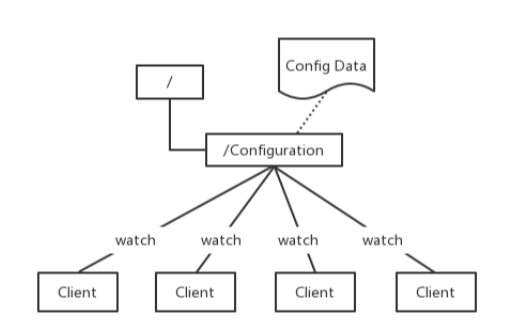
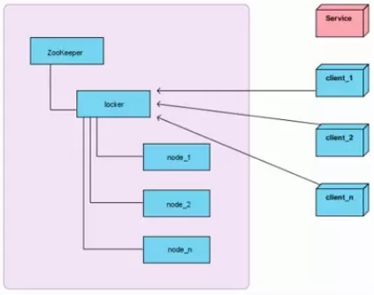

# 1 简介
## 1.1 什么是zookeeper
zookeeper官网：[https://zookeeper.apache.org/](https://zookeeper.apache.org/)  
zooKeeper由雅虎研究院开发，是Google Chubby的开源实现，后来托管到Apache，于2010年11月正式成为Apache的顶级项目。  
大数据生态系统里的很多组件的命名都是某种动物或者昆虫，比如hadoop就是🐘，hive就是🐝。zookeeper即动物园管理者，顾名思义就是管理大数据生态系统各组件的管理员。如下图：  



## 1.2 zookeeper应用场景
zooKeeper是一个经典的分布式数据一致性解决方案，致力于为分布式应用提供一个高性能、高可用，且具有严格顺序访问控制能力的分布式协调存储服务。

+ 维护配置信息
+ 分布式锁服务
+ 集群管理
+ 生成分布式唯一ID

**<font style="color:#E8323C;"></font>**

**<font style="color:#E8323C;">维护配置信息</font>**  
java编程经常会遇到配置项，比如数据库的url、schema、user和password等。通常这些配置项我们会放置在配置文件中，再将配置文件放置在服务器上当需要更改配置项时，需要去服务器上修改对应的配置文件。但是随着分布式系统的兴起，由于许多服务都需要使用到该配置文件，因此有必须保证该配置服务的高可用性（highavailability）和各台服务器上配置数据的一致性。通常会将配置文件部署在一个集群上，然而一个集群动辄上千台服务器，此时如果再一台台服务器逐个修改配置文件那将是非常繁琐且危险的的操作，因此就需要一种服务，能够高效快速且可靠地完成配置项的更改等操作，并能够保证各配置项在每台服务器上的数据一致性。

zookeeper就可以提供这样一种服务，其使用Zab这种一致性协议来保证一致性。现在有很多开源项目使用zookeeper来维护配置，比如在hbase中，客户端就是连接一个zookeeper，获得必要的hbase集群的配置信息，然后才可以进一步操作。还有在开源的消息队列kafka中，也使用zookeeper来维护broker的信息。在alibaba开源的soa框架dubbo中也广泛的使用zookeeper管理一些配置来实现服务治理。




**<font style="color:#E8323C;">分布式锁服务</font>**  
一个集群是一个分布式系统，由多台服务器组成。为了提高并发度和可靠性，多台服务器上运行着同一种服务。当多个服务在运行时就需要协调各服务的进度，有时候需要保证当某个服务在进行某个操作时，其他的服务都不能进行该操作，即对该操作进行加锁，如果当前机器挂掉后，释放锁并fail over 到其他的机器继续执行该服务。





**<font style="color:#E8323C;">集群管理</font>**  
一个集群有时会因为各种软硬件故障或者网络故障，出现某些服务器挂掉而被移除集群，而某些服务器加入到集群中的情况，zookeeper会将这些服务器加入/移出的情况通知给集群中的其他正常工作的服务器，以及时调整存储和计算等任务的分配和执行等。此外zookeeper还会对故障的服务器做出诊断并尝试修复。


**<font style="color:#E8323C;">生成分布式唯一ID</font>**  
在过去的单库单表型系统中，通常可以使用数据库字段自带的auto_increment属性来自动为每条记录生成一个唯一的ID。但是分库分表后，就无法在依靠数据库的auto_increment属性来唯一标识一条记录了。此时我们就可以用zookeeper在分布式环境下生成全局唯一ID。做法如下：每次要生成一个新Id时，创建一个持久顺序节点，创建操作返回的节点序号，即为新Id，然后把比自己节点小的删除即可。


## 1.3 zookeeper的设计目标
zooKeeper致力于为分布式应用提供一个高性能、高可用，且具有严格顺序访问控制能力的分布式协调服务

+ 高性能：zooKeeper将全量数据存储在内存中，并直接服务于客户端的所有非事务请求，尤其适用于以读为主的应用场景
+ 高可用：zooKeeper一般以集群的方式对外提供服务，一般3 ~ 5台机器就可以组成一个可用的Zookeeper集群了，每台机器都会在内存中维护当前的服务器状态，并且每台机器之间都相互保持着通信。只要集群中超过一半的机器都能够正常工作，那么整个集群就能够正常对外服务
+ 严格顺序访问：对于来自客户端的每个更新请求，ZooKeeper都会分配一个全局唯一的递增编号，这个编号反映了所有事务操作的先后顺序

# 2 zookeeper的数据模型
zookeeper的数据节点可以视为树状结构（或者目录），树中的各节点被称为znode（即zookeeper node），一个znode可以有多个子节点。zookeeper节点在结构上表现为树状；使用路径path来定位某个znode，比如`<font style="color:#E8323C;">/ns1/itcast/mysql/schema1/table1</font>`，此处ns1、itcast、mysql、schema1、table1分别是根节点、2级节点、3级节点以及4级节点；其中ns1是itcast的父节点，itcast是ns1的子节点，itcast是mysql的父节点，mysql是itcast的子节点，以此类推。

znode，兼具文件和目录两种特点。既像文件一样维护着数据、元信息、ACL、时间戳等数据结构，又像目录一样可以作为路径标识的一部分。


那么如何描述一个znode呢？一个znode大体上分为3各部分：

+ 节点的数据：即znode data(节点path, 节点data)的关系就像是java map中(key,value)的关系
+ 节点的子节点children
+ 节点的状态stat：用来描述当前节点的创建、修改记录，包括cZxid、ctime等节点状态stat的属性


## 2.1 节点状态stat的属性
在zookeeper shell中使用get命令查看指定路径节点的data、stat信息：

```bash
[zk: localhost:2181(CONNECTED) 7] get /ns-1/tenant
cZxid = 0x6a0000000a
ctime = Wed Mar 27 09:56:44 CST 2019
mZxid = 0x6a0000000a
mtime = Wed Mar 27 09:56:44 CST 2019
pZxid = 0x6a0000000e
cversion = 2
dataVersion = 0
aclVersion = 0
ephemeralOwner = 0x0
dataLength = 0
numChildren = 2
```

**属性说明**：

+ **cZxid**：数据节点创建时的事务 ID
+ **ctime**：数据节点创建时的时间
+ **mZxid**：数据节点最后一次更新时的事务 ID
+ **mtime**：数据节点最后一次更新时的时间
+ **pZxid**：数据节点的子节点最后一次被修改时的事务 ID
+ **cversion**：子节点的更改次数
+ **dataVersion**：节点数据的更改次数
+ **aclVersion**：节点的 ACL 的更改次数
+ **ephemeralOwner**：如果节点是临时节点，则表示创建该节点的会话的
+ **SessionID**；如果节点是持久节点，则该属性值为 0
+ **dataLength**：数据内容的长度
+ **numChildren**：数据节点当前的子节点个数

## 2.2 节点类型
zookeeper中的节点有两种，分别为临时节点和永久节点。节点的类型在创建时即被确定，并且不能改变。

+ 临时节点：该节点的生命周期依赖于创建它们的会话。一旦会话(Session)结束，临时节点将被自动删除，当然可以也可以手动删除。虽然每个临时的Znode都会绑定到一个客户端会话，但他们对所有的客户端还是可见的。另外，ZooKeeper的临时节点不允许拥有子节点。
+ 持久化节点：该节点的生命周期不依赖于会话，并且只有在客户端显示执行删除操作的时候，他们才能被删除

