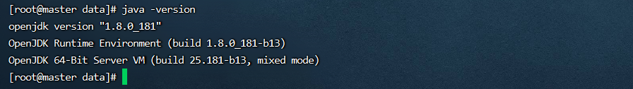
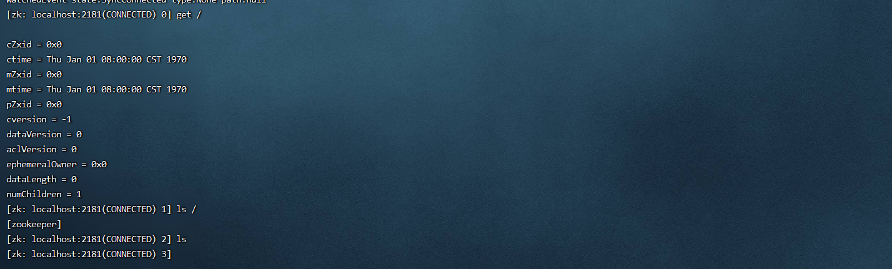
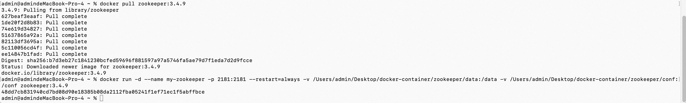
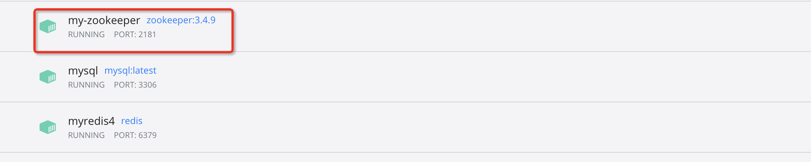

# 1 zookeeper单机安装
当前测试系统环境centos7  
JDK下载地址

[Java Archive Downloads - Java SE 8u211 and later](https://www.oracle.com/java/technologies/javase/javase8u211-later-archive-downloads.html)

  
Zookeeper下载地址

[Index of /dist/zookeeper/zookeeper-3.4.10](http://archive.apache.org/dist/zookeeper/zookeeper-3.4.10/)


**安装步骤：**

1. 在centos中使用root用户创建zookeeper用户，用户名：zookeeper 密码:zookeeper

```plain
useradd zookeeper
passwd zookeeper
```


2. zookeeper底层依赖于jdk，zookeeper用户登录后，根目录下先进行jdk的安装，jdk使用jdk-8u131-linux-x64.tar.gz版本，上传并解压jdk

```bash
# 18. 解压jdk
tar -xzvf jdk-8u131-linux-x64.tar.gz
```


3. 配置jdk环境变量

```bash
# 19. vim打开 .bash_profile文件
vi .bash_profile

# 20. 文件中加入如下内容
JAVA_HOME=/home/zookeeper/jdk1.8.0_131
export JAVA_HOME
PATH=

$$

$$

JAVA_HOME/bin:
$$

$$

PATH
export PATH

#使环境变量生效
. .bash_profile
```


4. 检测jdk安装

```bash
# 21. 敲如下命令,系统如图反馈说明安装成功
java -version
```




5. zookeeper使用zookeeper-3.4.10.tar.gz，上传并解压

```bash
# 22. 解压zookeeper
tar -xzvf zookeeper-3.4.10.tar.gz
```


6. 为zookeeper准备配置文件

```bash
# 23. 进入conf目录
cd /home/zookeeper/zookeeper-3.4.10/conf

# 24. 复制配置文件
cp zoo_sample.cfg zoo.cfg

# 25. zookeeper根目录下新建data目录
mkdir data

# 26. vi 修改配置文件中的dataDir
# 27. 此路径用于存储zookeeper中数据的内存快照、及事物日志文件
dataDir=/home/zookeeper/zookeeper-3.4.10/data
```


7. 启动zookeeper

```bash
# 28. 进入zookeeper的bin目录
cd /home/zookeeper/zookeeper-3.4.10/bin

# 29. 启动zookeeper
./zkServer.sh start
#启动：zkServer.sh start
#停止：zkServer.sh stop
#查看状态：zkServer.sh status
```


8. 连接zookeeper客户端

```plain
./zkCli.sh
```



# 2 Docker安装zookeeper
操作步骤

1. 下载镜像

```json
docker pull zookeeper:3.4.9
```

2. 启动镜像

```json
docker run -d --name my-zookeeper -p 2181:2181 --restart=always -v /Users/admin/Desktop/docker-container/zookeeper/data:/data -v /Users/admin/Desktop/docker-container/zookeeper/conf:/conf zookeeper:3.4.9
```

3. 查看结果





# 3 zookeeper集群
参考：

[08 Zookeeper集群](https://www.yuque.com/u21918439/vg7knb/ub56po)

