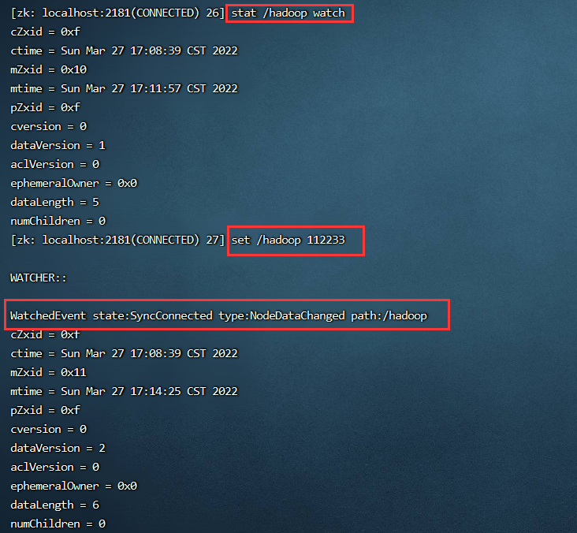

## 1 **新增节点**
```java
create [-s] [-e] path data  
//-s 为有序节点，
//-e 临时节点
```

创建持久化节点并写入数据：  


创建持久化有序节点，此时创建的节点名为指定节点名 + 自增序号:  


创建临时节点，临时节点会在会话过期后被删除：  


创建临时有序节点，临时节点会在会话过期后被删除：  


## 2 更新节点
更新节点的命令是 set ，可以直接进行修改，如下：  
  
也可以基于版本号进行更改，此时类似于乐观锁机制，当你传入的数据版本号(dataVersion) 和当前节点的数据版本号不符合时，zookeeper 会拒绝本次修改：  


## **3 删除节点**
删除节点的语法如下：

```plain
delete path [version]
rmr path
```

和更新节点数据一样，也可以传入版本号，当你传入的数据版本号 (dataVersion)和当前节点的数据版本号不符合时，zookeeper 不会执行删除操作。  
  
要想删除某个节点及其所有后代节点，可以使用递归删除，命令为 rmr path


## **4 查看节点**
```plain
get path
```


节点各个属性如下。其中一个重要的概念是 Zxid(ZooKeeper TransactionId)，ZooKeeper 节点的每一次更改都具有唯一的 Zxid，如果 Zxid1 小于 Zxid2，则Zxid1 的更改发生在 Zxid2 更改之前。

+ cZxid：数据节点创建时的事务 ID
+ ctime：数据节点创建时的时间
+ mZxid：数据节点最后一次更新时的事务 ID
+ mtime：数据节点最后一次更新时的时间
+ pZxid：数据节点的子节点最后一次被修改时的事务 ID
+ cversion：子节点的更改次数
+ dataVersion：节点数据的更改次数
+ aclVersion：节点的 ACL 的更改次数
+ ephemeralOwner：如果节点是临时节点，则表示创建该节点的会话的
+ SessionID：如果节点是持久节点，则该属性值为 0
+ dataLength：数据内容的长度
+ numChildren：数据节点当前的子节点个数

## 5 查看节点状态
可以使用 stat 命令查看节点状态，它的返回值和 get 命令类似，但不会返回节点数据  


## **6 查看节点列表**
查看节点列表有 ls path 和 ls2 path 两个命令，后者是前者的增强，不仅可以查看指定路径下的所有节点，还可以查看当前节点的信息  


## **7 监听器**
```plain
get path [watch]
```

使用 get path [watch] 注册的监听器能够在节点内容发生改变的时候，向客户端发出通知。需要注意的是 zookeeper 的触发器是一次性的 (One-time trigger)，即触发一次后就会立即失效。  


```plain
stat path [watch]
```

使用 stat path [watch] 注册的监听器能够在节点状态发生改变的时候，向客户端发出通知  



```plain
ls\ls2 path [watch]
```

使用 ls path [watch] 或 ls2 path [watch] 注册的监听器能够监听该节点下所有子节点的增加和删除操作。  


