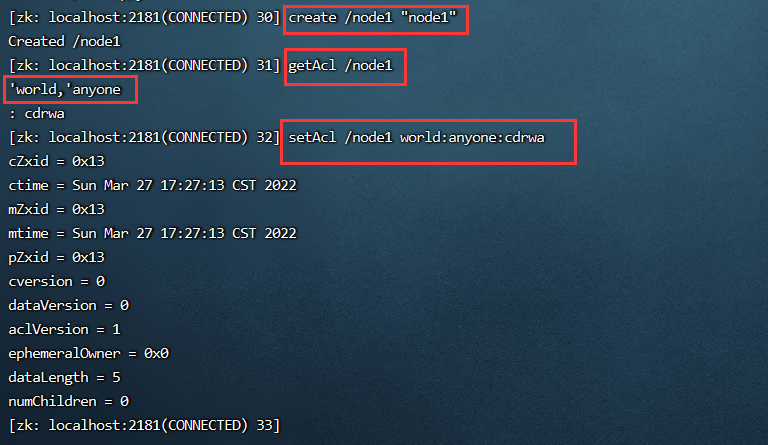
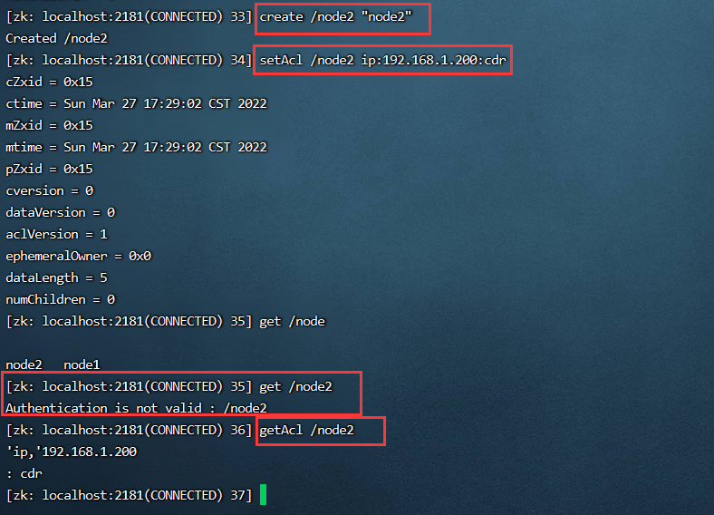
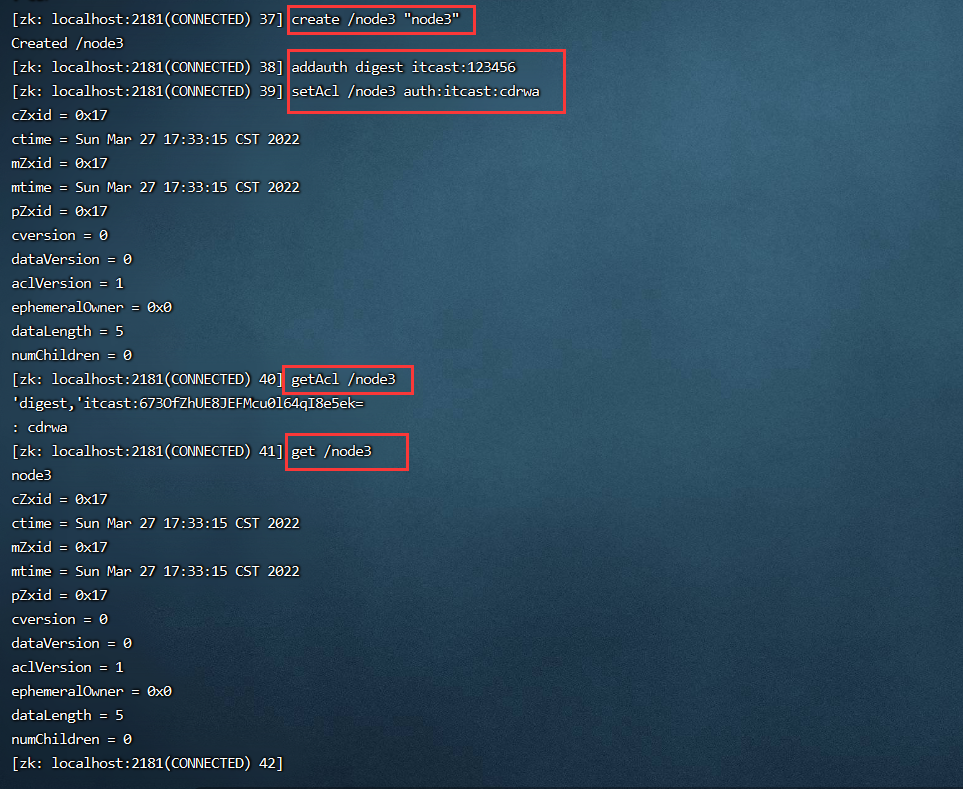
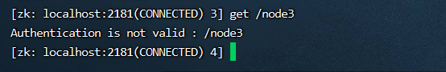
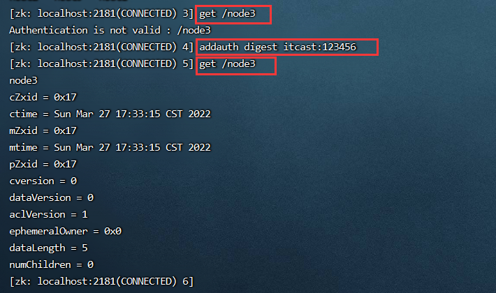
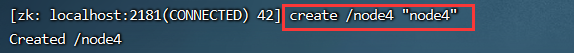
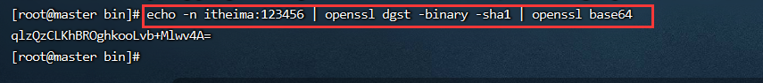
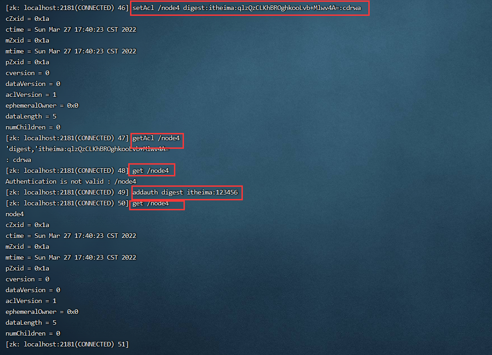

## 1 概述
zookeeper 类似文件系统，client 可以创建节点、更新节点、删除节点，那么如何做到节点的权限的控制呢？zookeeper的access control list 访问控制列表可以做到这一点。

acl 权限控制，使用scheme：id：permission 来标识，主要涵盖 3 个方面：

+ 权限模式（scheme）：授权的策略
+ 授权对象（id）：授权的对象
+ 权限（permission）：授予的权限


其特性如下：

+ zooKeeper的权限控制是基于每个znode节点的，需要对每个节点设置权限
+ 每个znode支持设置多种权限控制方案和多个权限
+ 子节点不会继承父节点的权限，客户端无权访问某节点，但可能可以访问它的子节点

```bash
setAcl /test2 ip:192.168.60.130:crwda  #将节点权限设置为Ip:192.168.60.130的客户端可以对节点进行增、删、改、查、管理权限
```


## 2 权限模式
采用何种方式授权

+ world：只有一个用户：anyone，代表登录zokeeper所有人（默认）
+ ip：对客户端使用IP地址认证
+ auth：使用已添加认证的用户认证
+ digest：使用“用户名:密码”方式认证


## 3 授权的对象
给谁授予权限  
授权对象ID是指，权限赋予的实体，例如：IP 地址或用户。


## 4 授予的权限
授予什么权限  
create、delete、read、writer、admin也就是 增、删、改、查、管理权限，这5种权限简写为cdrwa，注意:这5种权限中，delete是指对子节点的删除权限，其它4种权限指对自身节点的操作权限

+ create：c 可以创建子节点
+ delete：d 可以删除子节点（仅下一级节点）
+ read：r 可以读取节点数据及显示子节点列表
+ write：w 可以设置节点数据
+ admin：a 可以设置节点访问控制列表权限


## 5 授权的相关命令
+ getAcl：读取ACL权限
+ setAcl：设置ACL权限
+ addauth：添加认证用户


## 6 实践
**<font style="color:#E8323C;">world授权模式</font>**

```plain
setAcl <path> world:anyone:
```




**<font style="color:#E8323C;">IP授权模式</font>**

```plain
setAcl <path> ip:<ip>:
```




**<font style="color:#E8323C;">Auth授权模式</font>**

```plain
addauth digest <user>:<password> #添加认证用户
setAcl <path> auth:<user>:
```

  
另起一个终端访问，就是没有全限的，如下：  
  
然后执行addauth digest itcast:123456就可以正常访问了  



**<font style="color:#E8323C;">Digest授权模式</font>**

```plain
setAcl <path> digest:<user>:<password>:
```


这里的密码是经过SHA1及BASE64处理的密文，在SHELL中可以通过以下命令计算：

```plain
echo -n <user>:<password> | openssl dgst -binary -sha1 | openssl base64
```


先来计算一个密文

```plain
echo -n itheima:123456 | openssl dgst -binary -sha1 | openssl base64
```








**<font style="color:#E8323C;">acl 超级管理员</font>**  
zookeeper的权限管理模式有一种叫做super，该模式提供一个超管可以方便的访问任何权限的节点

