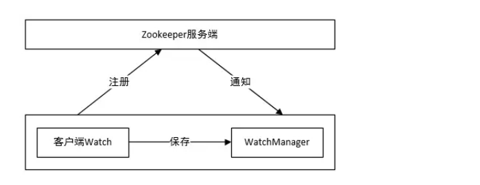
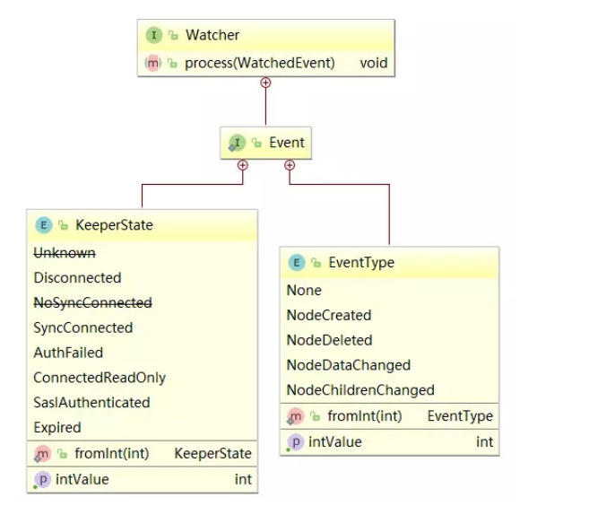

# 1 watcher
## 1 watcher概念
zookeeper提供了数据的发布/订阅功能，多个订阅者可同时监听某一特定主题对象，当该主题对象的自身状态发生变化时(例如节点内容改变、节点下的子节点列表改变等)，会实时、主动通知所有订阅者。

zookeeper采用了Watcher机制实现数据的发布/订阅功能。该机制在被订阅对象发生变化时会异步通知客户端，因此客户端不必在Watcher注册后轮询阻塞，从而减轻了客户端压力。

watcher机制实际上与观察者模式类似，也可看作是一种观察者模式在分布式场景下的实现方式。


## 2 watcher架构
Watcher实现由三个部分组成：

+ Zookeeper服务端
+ Zookeeper客户端
+ 客户端的ZKWatchManager对象

客户端首先将Watcher注册到服务端，同时将Watcher对象保存到客户端的Watch管理器中。当ZooKeeper服务端监听的数据状态发生变化时，服务端会主动通知客户端，接着客户端的Watch管理器会触发相关Watcher来回调相应处理逻辑，从而完成整体的数据发布/订阅流程。  


## 1.3 watcher特性
+ 一次性：watcher是一次性的，一旦被触发就会移除，再次使用时需要重新注册
+ 客户端顺序回调：watcher回调是顺序串行化执行的，只有回调后客户端才能看到最新的数据状态。一个watcher回调逻辑不应该太多，以免影响别的watcher执行
+ 轻量级：WatchEvent是最小的通信单元，结构上只包含通知状态、事件类型和节点路径，并不会告诉数据节点变化前后的具体内容；
+ 时效性：watcher只有在当前session彻底失效时才会无效，若在session有效期内快速重连成功，则watcher依然存在，仍可接收到通知；


## 1.4 watcher接口设计
Watcher是一个接口，任何实现了Watcher接口的类就是一个新的Watcher。

Watcher内部包含了两个枚举类：KeeperState、EventType  



## 1.5 Watcher通知状态
KeeperState是客户端与服务端连接状态发生变化时对应的通知类型。路径为org.apache.zookeeper.Watcher.Event.KeeperState，是一个枚举类，其枚举属性

+ SyncConnected：客户端与服务器正常连接时
+ Disconnected：客户端与服务器断开连接时
+ Expired：会话session失效时
+ AuthFailed：身份认证失败时


## 1.6 Watcher事件类型
EventType是数据节点(znode)发生变化时对应的通知类型。EventType变化时KeeperState永远处于SyncConnected通知状态下；当KeeperState发生变化时，EventType永远为None。

其路径为`org.apache.zookeeper.Watcher.Event.EventType`，是一个枚举类，枚举属性如下：

+ None：无
+ NodeCreated：Watcher监听的数据节点被创建时
+ NodeDeleted：Watcher监听的数据节点被删除时
+ NodeDataChanged：Watcher监听的数据节点内容发生变更时(无论内容数据是否变化)
+ NodeChildrenChanged：Watcher监听的数据节点的子节点列表发生变更时

注：客户端接收到的相关事件通知中只包含状态及类型等信息，不包括节点变化前后的具体内容，变化前的数据需业务自身存储，变化后的数据需调用get等方法重新获取；


# 2 代码操作
上面讲到zookeeper客户端连接的状态和zookeeper对znode节点监听的事件类型，下面我们来讲解如何建立zookeeper的watcher监听。在zookeeper中采用zk.getChildren(path, watch)、zk.exists(path, watch)、zk.getData(path, watcher, stat)这样的方式为某个znode注册监听。


下表以node-x节点为例，说明调用的注册方法和可监听事件间的关系：

| 注册方式 | Created | ChildrenChanged | Changed | Deleted |
| --- | --- | --- | --- | --- |
| `zk.exists("/nodex",watcher)` | 可监控 | | 可监控 | 可监控 |
| `zk.getData("/nodex",watcher)` | | | 可监控 | 可监控 |
| `zk.getChildren("/nodex",watcher)` | | 可监控 | | 可监控 |


实例1 如下：

```java
package com.ali.zk;

import org.apache.zookeeper.WatchedEvent;
import org.apache.zookeeper.Watcher;
import org.apache.zookeeper.ZooKeeper;
import java.util.concurrent.CountDownLatch;
public class ZKConnectionWatcher implements Watcher {
    // 计数器对象
    static CountDownLatch countDownLatch = new CountDownLatch(1);
    // 连接对象
    static ZooKeeper zooKeeper;
    @Override
    public void process(WatchedEvent event) {
        try {
            // 事件类型
            if (event.getType() == Event.EventType.None) {
                if (event.getState() == Event.KeeperState.SyncConnected)
                {
                    System.out.println("连接创建成功!");
                    countDownLatch.countDown();
                } else if (event.getState() ==
                        Event.KeeperState.Disconnected) {
                    System.out.println("断开连接！");
                } else if (event.getState() == Event.KeeperState.Expired)
                {
                    System.out.println("会话超时!");
                    zooKeeper = new ZooKeeper("192.168.60.130:2181",
                            5000, new ZKConnectionWatcher());
                } else if (event.getState() ==
                        Event.KeeperState.AuthFailed) {
                    System.out.println("认证失败！");
                }
            }
        } catch (Exception ex) {
            ex.printStackTrace();
        }
    }
    public static void main(String[] args) {
        try {
            zooKeeper = new ZooKeeper("192.168.60.130:2181", 5000, new
                    ZKConnectionWatcher());
            // 阻塞线程等待连接的创建
            countDownLatch.await();
            // 会话id
            System.out.println(zooKeeper.getSessionId());
            // 添加授权用户
            zooKeeper.addAuthInfo("digest1","itcast1:1234561".getBytes());
            byte [] bs=zooKeeper.getData("/node1",false,null);
            System.out.println(new String(bs));
            Thread.sleep(50000);
            zooKeeper.close();
            System.out.println("结束");
        } catch (Exception ex) {
            ex.printStackTrace();
        }
    }
}
```


## 2.1 检查节点是否存在


```java
// 使用连接对象的监视器
exists(String path, boolean b)
    
// 自定义监视器
exists(String path, Watcher w)
// NodeCreated:节点创建
// NodeDeleted:节点删除
// NodeDataChanged:节点内容发生变化

//path- znode路径。
//b- 是否使用连接对象中注册的监视器。
//w-监视器对象。
```


```java
package com.ali.zk;

import org.apache.zookeeper.KeeperException;
import org.apache.zookeeper.WatchedEvent;
import org.apache.zookeeper.Watcher;
import org.apache.zookeeper.ZooKeeper;
import org.junit.After;
import org.junit.Before;
import org.junit.Test;
import java.io.IOException;
import java.util.concurrent.CountDownLatch;
public class ZKWatcherExists {
    String IP = "192.168.60.130:2181";
    ZooKeeper zooKeeper = null;
    @Before
    public void before() throws IOException, InterruptedException {
        CountDownLatch countDownLatch = new CountDownLatch(1);
        // 连接zookeeper客户端
        zooKeeper = new ZooKeeper(IP, 6000, new Watcher() {
            @Override
            public void process(WatchedEvent event) {
                System.out.println("连接对象的参数!");
                // 连接成功
                if (event.getState() == Event.KeeperState.SyncConnected)
                {
                    countDownLatch.countDown();
                }
                System.out.println("path=" + event.getPath());
                System.out.println("eventType=" + event.getType());
            }
        });
        countDownLatch.await();
    }
    @After
    public void after() throws InterruptedException {
        zooKeeper.close();
    }
    @Test
    public void watcherExists1() throws KeeperException,
            InterruptedException {
        // arg1:节点的路径
        // arg2:使用连接对象中的watcher
        zooKeeper.exists("/watcher1", true);
        Thread.sleep(50000);
        System.out.println("结束");
    }
    @Test
    public void watcherExists2() throws KeeperException,
            InterruptedException {
        // arg1:节点的路径
        // arg2:自定义watcher对象
        zooKeeper.exists("/watcher1", new Watcher() {
            @Override
            public void process(WatchedEvent event) {
                System.out.println("自定义watcher");
                System.out.println("path=" + event.getPath());
                System.out.println("eventType=" + event.getType());
            }
        });
        Thread.sleep(50000);
        System.out.println("结束");
    }
    @Test
    public void watcherExists3() throws KeeperException,
            InterruptedException {
        // watcher一次性
        Watcher watcher = new Watcher() {
            @Override
            public void process(WatchedEvent event) {
                try {
                    System.out.println("自定义watcher");
                    System.out.println("path=" + event.getPath());
                    System.out.println("eventType=" + event.getType());
                    zooKeeper.exists("/watcher1", this);
                } catch (Exception ex) {
                    ex.printStackTrace();
                }
            }
        };
        zooKeeper.exists("/watcher1", watcher);
        Thread.sleep(80000);
        System.out.println("结束");
    }
    @Test
    public void watcherExists4() throws KeeperException,
            InterruptedException {
        // 注册多个监听器对象
        zooKeeper.exists("/watcher1", new Watcher() {
            @Override
            public void process(WatchedEvent event) {
                System.out.println("1");
                System.out.println("path=" + event.getPath());
                System.out.println("eventType=" + event.getType());
            }
        });
        zooKeeper.exists("/watcher1", new Watcher() {
            @Override
            public void process(WatchedEvent event) {
                System.out.println("2");
                System.out.println("path=" + event.getPath());
                System.out.println("eventType=" + event.getType());
            }
        });
        Thread.sleep(80000);
        System.out.println("结束");
    }
}
```


## 2.2 查看节点
```java
// 使用连接对象的监视器
getData(String path, boolean b, Stat stat)
    
// 自定义监视器
getData(String path, Watcher w, Stat stat)
// NodeDeleted:节点删除
// NodeDataChanged:节点内容发生变化

// path- znode路径。
// b- 是否使用连接对象中注册的监视器。
// w-监视器对象。
// stat- 返回znode的元数据
```


```java
package com.ali.zk;

import org.apache.zookeeper.KeeperException;
import org.apache.zookeeper.WatchedEvent;
import org.apache.zookeeper.Watcher;
import org.apache.zookeeper.ZooKeeper;
import org.apache.zookeeper.data.Stat;
import org.junit.After;
import org.junit.Before;
import org.junit.Test;
import java.io.IOException;
import java.util.concurrent.CountDownLatch;
public class ZKWatcherGetData {
    String IP = "192.168.60.130:2181";
    ZooKeeper zooKeeper = null;
    @Before
    public void before() throws IOException, InterruptedException {
        CountDownLatch countDownLatch = new CountDownLatch(1);
        // 连接zookeeper客户端
        zooKeeper = new ZooKeeper(IP, 6000, new Watcher() {
            @Override
            public void process(WatchedEvent event) {
                System.out.println("连接对象的参数!");
                // 连接成功
                if (event.getState() == Event.KeeperState.SyncConnected)
                {
                    countDownLatch.countDown();
                }
                System.out.println("path=" + event.getPath());
                System.out.println("eventType=" + event.getType());
            }
        });
        countDownLatch.await();
    }
    @After
    public void after() throws InterruptedException {
        zooKeeper.close();
    }
    @Test
    public void watcherGetData1() throws KeeperException,
            InterruptedException {
        // arg1:节点的路径
        // arg2:使用连接对象中的watcher
        zooKeeper.getData("/watcher2", true, null);
        Thread.sleep(50000);
        System.out.println("结束");
    }
    @Test
    public void watcherGetData2() throws KeeperException,
            InterruptedException {
        // arg1:节点的路径
        // arg2:自定义watcher对象
        zooKeeper.getData("/watcher2", new Watcher() {
            @Override
            public void process(WatchedEvent event) {
                System.out.println("自定义watcher");
                System.out.println("path=" + event.getPath());
                System.out.println("eventType=" + event.getType());
            }
        }, null);
        Thread.sleep(50000);
        System.out.println("结束");
    }
    @Test
    public void watcherGetData3() throws KeeperException,
            InterruptedException {
        // 一次性
        Watcher watcher = new Watcher() {
            @Override
            public void process(WatchedEvent event) {
                try {
                    System.out.println("自定义watcher");
                    System.out.println("path=" + event.getPath());
                    System.out.println("eventType=" + event.getType());
                    if(event.getType()==Event.EventType.NodeDataChanged)
                    {
                        zooKeeper.getData("/watcher2", this, null);
                    }
                } catch (Exception ex) {
                    ex.printStackTrace();
                }
            }
        };
        zooKeeper.getData("/watcher2", watcher, null);
        Thread.sleep(50000);
        System.out.println("结束");
    }
    @Test
    public void watcherGetData4() throws KeeperException,
            InterruptedException {
        // 注册多个监听器对象
        zooKeeper.getData("/watcher2", new Watcher() {
            @Override
            public void process(WatchedEvent event) {
                try {
                    System.out.println("1");
                    System.out.println("path=" + event.getPath());
                    System.out.println("eventType=" + event.getType());
                    if(event.getType()==Event.EventType.NodeDataChanged)
                    {
                        zooKeeper.getData("/watcher2", this, null);
                    }
                } catch (Exception ex) {
                    ex.printStackTrace();
                }
            }
        },null);
        zooKeeper.getData("/watcher2", new Watcher() {
            @Override
            public void process(WatchedEvent event) {
                try {
                    System.out.println("2");
                    System.out.println("path=" + event.getPath());
                    System.out.println("eventType=" + event.getType());
                    if(event.getType()==Event.EventType.NodeDataChanged)
                    {
                        zooKeeper.getData("/watcher2", this, null);
                    }
                } catch (Exception ex) {
                    ex.printStackTrace();
                }
            }
        },null);
        Thread.sleep(50000);
        System.out.println("结束");
    }
}
```


## 2.3 查看子节点


```java
// 使用连接对象的监视器
getChildren(String path, boolean b)
    
// 自定义监视器
getChildren(String path, Watcher w)
// NodeChildrenChanged:子节点发生变化
// NodeDeleted:节点删除

// path- znode路径。
// b- 是否使用连接对象中注册的监视器。
// w-监视器对象。  
```


```java
package com.ali.zk;

import org.apache.zookeeper.KeeperException;
import org.apache.zookeeper.WatchedEvent;
import org.apache.zookeeper.Watcher;
import org.apache.zookeeper.ZooKeeper;
import org.junit.After;
import org.junit.Before;
import org.junit.Test;
import java.io.IOException;
import java.util.List;
import java.util.concurrent.CountDownLatch;
public class ZKWatcherGetChild {
    String IP = "192.168.60.130:2181";
    ZooKeeper zooKeeper = null;
    @Before
    public void before() throws IOException, InterruptedException {
        CountDownLatch connectedSemaphore = new CountDownLatch(1);
        // 连接zookeeper客户端
        zooKeeper = new ZooKeeper(IP, 6000, new Watcher() {
            @Override
            public void process(WatchedEvent event) {
                System.out.println("连接对象的参数!");
                // 连接成功
                if (event.getState() == Event.KeeperState.SyncConnected)
                {
                    connectedSemaphore.countDown();
                }
                System.out.println("path=" + event.getPath());
                System.out.println("eventType=" + event.getType());
            }
        });
        connectedSemaphore.await();
    }
    @After
    public void after() throws InterruptedException {
        zooKeeper.close();
    }
    @Test
    public void watcherGetChild1() throws KeeperException,
            InterruptedException {
        // arg1:节点的路径
        // arg2:使用连接对象中的watcher
        zooKeeper.getChildren("/watcher3", true);
        Thread.sleep(50000);
        System.out.println("结束");
    }
    @Test
    public void watcherGetChild2() throws KeeperException,
            InterruptedException {
        // arg1:节点的路径
        // arg2:自定义watcher
        zooKeeper.getChildren("/watcher3", new Watcher() {
            @Override
            public void process(WatchedEvent event) {
                System.out.println("自定义watcher");
                System.out.println("path=" + event.getPath());
                System.out.println("eventType=" + event.getType());
            }
        });
        Thread.sleep(50000);
        System.out.println("结束");
    }
    @Test
    public void watcherGetChild3() throws KeeperException,
            InterruptedException {
        // 一次性
        Watcher watcher = new Watcher() {
            @Override
            public void process(WatchedEvent event) {
                try {
                    System.out.println("自定义watcher");
                    System.out.println("path=" + event.getPath());
                    System.out.println("eventType=" + event.getType());
                    if (event.getType() ==
                            Event.EventType.NodeChildrenChanged) {
                        zooKeeper.getChildren("/watcher3", this);
                    }
                } catch (Exception ex) {
                    ex.printStackTrace();
                }
            }
        };
        zooKeeper.getChildren("/watcher3", watcher);
        Thread.sleep(50000);
        System.out.println("结束");
    }
    @Test
    public void watcherGetChild4() throws KeeperException,
            InterruptedException {
        // 多个监视器对象
        zooKeeper.getChildren("/watcher3", new Watcher() {
            @Override
            public void process(WatchedEvent event) {
                try {
                    System.out.println("1");
                    System.out.println("path=" + event.getPath());
                    System.out.println("eventType=" + event.getType());
                    if (event.getType() ==
                            Event.EventType.NodeChildrenChanged) {
                        zooKeeper.getChildren("/watcher3", this);
                    }
                } catch (Exception ex) {
                    ex.printStackTrace();
                }
            }
        });
        zooKeeper.getChildren("/watcher3", new Watcher() {
            @Override
            public void process(WatchedEvent event) {
                try {
                    System.out.println("2");
                    System.out.println("path=" + event.getPath());
                    System.out.println("eventType=" + event.getType());
                    if (event.getType() ==
                    Event.EventType.NodeChildrenChanged) {
                        zooKeeper.getChildren("/watcher3", this);
                    }
                } catch (Exception ex) {
                    ex.printStackTrace();
                }
            }
        });
        Thread.sleep(50000);
        System.out.println("结束");
    }
}
```

