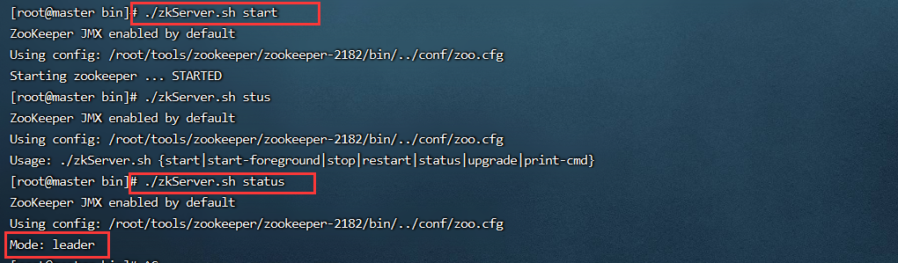

# 1 zookeeper 集群搭建
单机环境下，jdk、zookeeper 安装完毕，基于一台虚拟机，进行zookeeper伪集群搭建，zookeeper集群中包含3个节点，节点对外提供服务端口号分别为2181、2182、2183

1. 基于zookeeper-3.4.10复制三份zookeeper安装好的服务器文件，目录名称分别为zookeeper2181、zookeeper2182、zookeeper2183

```bash
cp ‐r zookeeper‐3.4.10/ zookeeper-2181
cp ‐r zookeeper‐3.4.10/ zookeeper-2182
cp ‐r zookeeper‐3.4.10/ zookeeper-2183
```

  2. 修改zookeeper-2181服务器对应配置文件。

```bash
#服务器对应端口，三个端口号分别对应2181，2182，2183
clientPort=2181
#数据快照文件所在路径
dataDir=/root/tools/zookeeper/zookeeper-2181/data

#在zookeeper-2182的conf里面配置
#dataDir=/root/tools/zookeeper/zookeeper-2182/data

#在zookeeper-2183的conf里面配置
#dataDir=/root/tools/zookeeper/zookeeper-2183/data
#集群配置信息
#server.A=B:C:D
#A：是一个数字，表示这个是服务器的编号
#B：是这个服务器的ip地址
#C：Zookeeper服务器之间的通信端口
#D：Leader选举的端口
server.1=192.168.1.200:2287:3387
server.2=192.168.1.200:2288:3388
server.3=192.168.1.200:2289:3389
```

3. 在 上一步 dataDir 指定的目录下，创建 myid 文件，然后在该文件添加上一步server 配置的对应 A 数字。

```bash
#zookeeper2181对应的数字为1
#/root/tools/zookeeper/zookeeper-2181/data目录下执行命令
echo "1" > myid

#/root/tools/zookeeper/zookeeper-2182/data目录下执行命令
echo "2" > myid

#/root/tools/zookeeper/zookeeper-2183/data目录下执行命令
echo "3" > myid
```


4. zookeeper-2182、zookeeper-2183参照步骤2/3进行相应配置
5. 启动zookeeper-2181、zookeeper-2182、zookeeper-2183

```bash
#在各自的bin目录下执行
./zkServer.sh start 
./zkServer.sh status
```

如下图：  



# 2 一致性协议：zab协议
zab协议 的全称是 Zookeeper Atomic Broadcast （zookeeper原子广播）。zookeeper 是通过 zab协议来保证分布式事务的最终一致性

基于zab协议，zookeeper集群中的角色主要有以下三类，如下所示：

+ 领导者（Leader）：领导者负责进行投票的发起和决议，更新系统状态
+ 学习者（Learner）： 
    - 跟随者：Follower用于接受客户请求并向客户端返回结果，再选举过程中参与投票
    - 观察者：Observer可以接受客户端的连接，将写请求转发给leader节点，但observer不参加投票，只同步leader的状态，observer的目的是为了扩展系统，提高读取速度。
+ 客户端（Client）：请求发起方


zab广播模式工作原理，通过类似两阶段提交协议的方式解决数据一致性：  


1. leader从客户端收到一个写请求
2. leader生成一个新的事务并为这个事务生成一个唯一的ZXID
3. leader将这个事务提议(propose)发送给所有的follows节点
4. follower节点将收到的事务请求加入到历史队列(history queue)中,并发送ack给leader
5. 当leader收到大多数follower（半数以上节点）的ack消息，leader会发送commit请求
6. 当follower收到commit请求时，从历史队列中将事务请求commit


**服务器状态**  
looking：寻找leader状态。当服务器处于该状态时，它会认为当前集群中没有leader，因此需要进入leader选举状态。  
leading： 领导者状态。表明当前服务器角色是leader。  
following： 跟随者状态。表明当前服务器角色是follower。  
observing：观察者状态。表明当前服务器角色是observer。


# 3 服务器启动时期的leader选举
在集群初始化阶段，当有一台服务器server1启动时，其单独无法进行和完成leader选举，当第二台服务器server2启动时，此时两台机器可以相互通信，每台机器都试图找到leader，于是进入leader选举过程。选举过程如下:

1.  每个server发出一个投票。由于是初始情况，server1和server2都会将自己作为leader服务器来进行投票，每次投票会包含所推举的服务器的myid和zxid，使用(myid, zxid)来表示，此时server1的投票为(1, 0)，server2的投票为(2, 0)，然后各自将这个投票发给集群中其他机器。 
2.  集群中的每台服务器接收来自集群中各个服务器的投票。 
3.  处理投票。针对每一个投票，服务器都需要将别人的投票和自己的投票进行pk，pk规则如下： 
    - 优先检查zxid。zxid比较大的服务器优先作为leader。
    - 如果zxid相同，那么就比较myid。myid较大的服务器作为leader服务器。  
对于Server1而言，它的投票是(1, 0)，接收Server2的投票为(2, 0)，首先会比较两者的zxid，均为0，再比较myid，此时server2的myid最大，于是更新自己的投票为(2, 0)，然后重新投票，对于server2而言，其无须更新自己的投票，只是再次向集群中所有机器发出上一次投票信息即可。
4. 统计投票。每次投票后，服务器都会统计投票信息，判断是否已经有过半机器接受到相同的投票信息，对于server1、server2而言，都统计出集群中已经有两台机器接受了(2, 0)的投票信息，此时便认为已经选出了leader
5. 改变服务器状态。一旦确定了leader，每个服务器就会更新自己的状态，如果是follower，那么就变更为following，如果是leader，就变更为leading。


**服务器运行时期的Leader选举**  
在zookeeper运行期间，leader与非leader服务器各司其职，即便当有非leader服务器宕机或新加入，此时也不会影响leader，但是一旦leader服务器挂了，那么整个集群将暂停对外服务，进入新一轮leader选举，其过程和启动时期的Leader选举过程基本一致。


假设正在运行的有server1、server2、server3三台服务器，当前leader是server2，若某一时刻leader挂了，此时便开始Leader选举。选举过程如下:

1. 变更状态。leader挂后，余下的服务器都会将自己的服务器状态变更为looking，然后开始进入leader选举过程。
2. 每个server会发出一个投票。在运行期间，每个服务器上的zxid可能不同，此时假定server1的zxid为122，server3的zxid为122，在第一轮投票中，server1和server3都会投自己，产生投票(1, 122)，(3, 122)，然后各自将投票发送给集群中所有机器。
3. 接收来自各个服务器的投票。与启动时过程相同。
4. 处理投票。与启动时过程相同，此时，server3将会成为leader。
5. 统计投票。与启动时过程相同。
6. 改变服务器的状态。与启动时过程相同。


# 4 observer角色及其配置
observer角色特点：不参与集群的leader选举，不参与集群中写数据时的ack反馈  
为了使用observer角色，在任何想变成observer角色的配置文件中加入如下配置：

```plain
peerType=observer
```


并在所有server的配置文件中，配置成observer模式的server的那行配置追加:observer，例如：

```plain
server.3=192.168.60.130:2289:3389:observer
```


# 5 zookeeperAPI连接集群
```java
ZooKeeper(String connectionString, int sessionTimeout, Watcher watcher)

//connectionString - zooKeeper集合主机。
//sessionTimeout - 会话超时（以毫秒为单位）。
//watcher - 实现“监视器”界面的对象。ZooKeeper集合通过监视器对象返回连接状态。
```


```java
package com.ali.zk;

import org.apache.zookeeper.WatchedEvent;
import org.apache.zookeeper.Watcher;
import org.apache.zookeeper.ZooKeeper;
import java.util.concurrent.CountDownLatch;
public class ZookeeperConnectionluster {
    public static void main(String[] args) {
        try {
            // 计数器对象
            CountDownLatch countDownLatch=new CountDownLatch(1);
            // arg1:服务器的ip和端口
            // arg2:客户端与服务器之间的会话超时时间 以毫秒为单位的
            // arg3:监视器对象
            ZooKeeper zooKeeper=new
                    ZooKeeper("192.168.60.130:2181,192.168.60.130:2182,192.168.60.130:2183",
                    5000, new Watcher() {
                @Override
                public void process(WatchedEvent event) {
                    if(event.getState()==Event.KeeperState.SyncConnected)
                    {
                        System.out.println("连接创建成功!");
                        countDownLatch.countDown();
                    }
                }
            });
            // 主线程阻塞等待连接对象的创建成功
            countDownLatch.await();
            // 会话编号
            System.out.println(zooKeeper.getSessionId());
            zooKeeper.close();
        } catch (Exception ex) {
            ex.printStackTrace();
        }
    }
}
```

