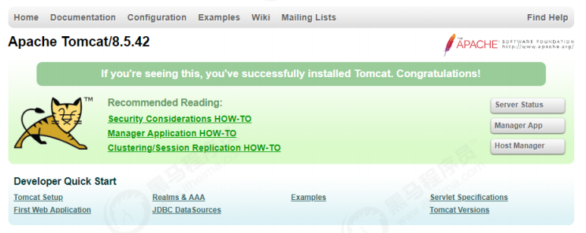

**<font style="color:#DF2A3F;">笔记来源：</font>**[**<font style="color:#DF2A3F;">黑马程序员Java进阶教程Tomcat核心原理解析</font>**](https://www.bilibili.com/video/BV1dJ411N7Um/?spm_id_from=333.337.search-card.all.click&vd_source=e8046ccbdc793e09a75eb61fe8e84a30)

## <font style="color:rgb(51,51,51);">1 web 概念 </font>
**<font style="color:rgb(51,51,51);">软件架构</font>**<font style="color:rgb(51,51,51);"> ：</font>

+ <font style="color:rgb(51,51,51);">C/S： 客户端/服务器端 ---> QQ , 360 </font>
+ <font style="color:rgb(51,51,51);">B/S： 浏览器/服务器端 ---> 京东、网易 、淘宝 、传智播客官网</font>

<font style="color:rgb(51,51,51);"></font>

**<font style="color:rgb(51,51,51);">资源分类</font>**<font style="color:rgb(51,51,51);"> </font>

+ <font style="color:rgb(51,51,51);">静态资源： 所有用户访问后，得到的结果都是一样的，称为静态资源。静态资源可以直接被浏览器解析。 如：</font>`<font style="color:rgb(51,51,51);">html</font>``<font style="color:rgb(51,51,51);">css</font>``<font style="color:rgb(51,51,51);">JavaScript</font>``<font style="color:rgb(51,51,51);">jpg</font>`<font style="color:rgb(51,51,51);"> 等</font>
+ <font style="color:rgb(51,51,51);">动态资源: 每个用户访问相同资源后，得到的结果可能不一样 , 称为动态资源。动态资源被访问后，需要先转换为静态资源，再返回给浏览器，通过浏览器进行解析。 如：</font>`<font style="color:rgb(51,51,51);">servlet/jsp</font>``<font style="color:rgb(51,51,51);">php</font>``<font style="color:rgb(51,51,51);">asp</font>`<font style="color:rgb(51,51,51);">等</font>

<font style="color:rgb(51,51,51);"></font>

**<font style="color:rgb(51,51,51);">网络通信三要素 </font>**

+ <font style="color:rgb(51,51,51);">IP：电子设备(计算机)在网络中的唯一标识。 </font>
+ <font style="color:rgb(51,51,51);">端口：应用程序在计算机中的唯一标识。 0~65536 </font>
+ <font style="color:rgb(51,51,51);">传输协议：规定了数据传输的规则 </font>
    - <font style="color:rgb(51,51,51);">基础协议： </font>
        * <font style="color:rgb(51,51,51);">tcp : 安全协议，三次握手。 速度稍慢 </font>
        * <font style="color:rgb(51,51,51);">udp：不安全协议。 速度快 </font>

## <font style="color:rgb(51,51,51);">2 常见的web服务器 </font>
### <font style="color:rgb(51,51,51);">2.1 概念 </font>
+ <font style="color:rgb(51,51,51);">服务器：安装了服务器软件的计算机 </font>
+ <font style="color:rgb(51,51,51);">服务器软件：接收用户的请求，处理请求，做出响应 </font>
+ <font style="color:rgb(51,51,51);">web服务器软件：接收用户的请求，处理请求，做出响应。 </font>

<font style="color:rgb(51,51,51);">在</font><font style="color:rgb(51,51,51);">web</font><font style="color:rgb(51,51,51);">服务器软件中，可以部署</font><font style="color:rgb(51,51,51);">web</font><font style="color:rgb(51,51,51);">项目，让用户通过浏览器来访问这些项目 </font>

### <font style="color:rgb(51,51,51);">2.2 常见web服务器软件 </font>
+ <font style="color:rgb(51,51,51);">webLogic：oracle公司，大型的JavaEE服务器，支持所有的JavaEE规范，收费的。 </font>
+ <font style="color:rgb(51,51,51);">webSphere：IBM公司，大型的JavaEE服务器，支持所有的JavaEE规范，收费的。 </font>
+ <font style="color:rgb(51,51,51);">JBOSS：JBOSS公司的，大型的JavaEE服务器，支持所有的JavaEE规范，收费的。 </font>
+ <font style="color:rgb(51,51,51);">Tomcat：Apache基金组织，中小型的JavaEE服务器，仅仅支持少量的JavaEE规范servlet/jsp。开源的，免费的。 </font>

## <font style="color:rgb(51,51,51);">3 Tomcat 历史 </font>
<font style="color:rgb(51,51,51);">1） Tomcat 最初由Sun公司的软件架构师 James Duncan Davidson 开发，名称为 </font>`<font style="color:rgb(51,51,51);">JavaWebServer</font>`<font style="color:rgb(51,51,51);">。 </font>

<font style="color:rgb(51,51,51);">2） 1999年 ，在 Davidson 的帮助下，该项目于1999年于apache 软件基金会旗下的JServ 项目合并，并发布第一个版本（3.x）, 即是现在的Tomcat，该版本实现了 Servlet2.2 和 JSP 1.1 规范 。 </font>

<font style="color:rgb(51,51,51);">3） 2001年，Tomcat 发布了4.0版本， 作为里程碑式的版本，Tomcat 完全重新设计了 其架构，并实现了 Servlet 2.3 和 JSP1.2规范。 </font>

<font style="color:rgb(51,51,51);">目前 Tomcat 已经更新到 9.0.x版本 ， 但是目前企业中的Tomcat服务器， 主流版本还是 7.x 和 8.x ， 所以本课程是基于 8.5 版本进行讲解。 </font>

## <font style="color:rgb(51,51,51);">4 Tomcat 安装 </font>
<font style="color:rgb(65,131,196);">地址：</font>[https://tomcat.apache.org/download-80.cgi](https://tomcat.apache.org/download-80.cgi)

<font style="color:rgb(51,51,51);">将下载的 </font><font style="color:rgb(51,51,51);">.zip </font><font style="color:rgb(51,51,51);">压缩包 ， 解压到系统的目录（建议是没有中文不带空格的目录）下即可。 </font>

## <font style="color:rgb(51,51,51);">5 Tomcat 目录结构 </font>
<font style="color:rgb(51,51,51);">Tomcat </font><font style="color:rgb(51,51,51);">的主要目录文件如下 ： </font>

| <font style="color:rgb(51,51,51);">目录 </font> | <font style="color:rgb(51,51,51);">目录下文件</font> | <font style="color:rgb(51,51,51);">说明</font> |
| --- | --- | --- |
| **<font style="color:rgb(51,51,51);">bin </font>** | <font style="color:rgb(51,51,51);">/ </font> | <font style="color:rgb(51,51,51);">存放Tomcat的启动、停止等批处理脚本文件 </font> |
| | `<font style="color:rgb(51,51,51);">startup.bat</font>`<font style="color:rgb(51,51,51);"> </font>`<font style="color:rgb(51,51,51);"> startup.sh</font>` | <font style="color:rgb(51,51,51);">用于在windows和linux下的启动脚本 </font> |
| | `<font style="color:rgb(51,51,51);">shutdown.bat</font>``<font style="color:rgb(51,51,51);">shutdown.sh</font>` | <font style="color:rgb(51,51,51);">用于在windows和linux下的停止脚本 </font> |
| **<font style="color:rgb(51,51,51);">conf </font>** | <font style="color:rgb(51,51,51);">/ </font> | <font style="color:rgb(51,51,51);">用于存放Tomcat的相关配置文件 </font> |
| | <font style="color:rgb(51,51,51);">Catalina </font> | <font style="color:rgb(51,51,51);">用于存储针对每个虚拟机的Context配置 </font> |
| | `<font style="color:rgb(51,51,51);">context.xml</font>` | <font style="color:rgb(51,51,51);">用于定义所有web应用均需加载的Context配 置，如果web应用指定了自己的context.xml ，该文件将被覆盖 </font> |
| | `<font style="color:rgb(51,51,51);">catalina.properties</font>`<font style="color:rgb(51,51,51);"> </font> | <font style="color:rgb(51,51,51);">Tomcat 的环境变量配置 </font> |
| | `<font style="color:rgb(51,51,51);">catalina.policy</font>` | <font style="color:rgb(51,51,51);">Tomcat 运行的安全策略配置 </font> |
| | `<font style="color:rgb(51,51,51);">logging.properties</font>` | <font style="color:rgb(51,51,51);">Tomcat 的日志配置文件， 可以通过该文件修改Tomcat 的日志级别及日志路径等 </font> |
| | `<font style="color:rgb(51,51,51);">server.xml</font>` | <font style="color:rgb(51,51,51);">Tomcat 服务器的核心配置文件 </font> |
| | `<font style="color:rgb(51,51,51);">tomcat-users.xml</font>` | <font style="color:rgb(51,51,51);">定义Tomcat默认的用户及角色映射信息配置</font> |
| | `<font style="color:rgb(51,51,51);">web.xml</font>` | <font style="color:rgb(51,51,51);">Tomcat 中所有应用默认的部署描述文件， 主 要定义了基础Servlet和MIME映射。 </font> |
| **<font style="color:rgb(51,51,51);">lib </font>** | <font style="color:rgb(51,51,51);">/ </font> | <font style="color:rgb(51,51,51);">Tomcat 服务器的依赖包 </font> |
| **<font style="color:rgb(51,51,51);">logs </font>** | <font style="color:rgb(51,51,51);">/ </font> | <font style="color:rgb(51,51,51);">Tomcat 默认的日志存放目录 </font> |
| **<font style="color:rgb(51,51,51);">webapps </font>** | <font style="color:rgb(51,51,51);">/ </font> | <font style="color:rgb(51,51,51);">Tomcat 默认的Web应用部署目录 </font> |
| **<font style="color:rgb(51,51,51);">work </font>** | <font style="color:rgb(51,51,51);">/ </font> | <font style="color:rgb(51,51,51);">Web 应用JSP代码生成和编译的临时目录 </font> |


## <font style="color:rgb(51,51,51);">6 Tomcat 启动停止 </font>
<font style="color:rgb(51,51,51);">启动 and 停止：双击 </font>`<font style="color:rgb(51,51,51);">bin/shutdown.bat</font>`<font style="color:rgb(51,51,51);"> 文件 ； </font>

<font style="color:rgb(51,51,51);">访问：</font>`<font style="color:rgb(51,51,51);">http://localhost:8080</font>`



## <font style="color:rgb(51,51,51);">7 Tomcat源码 </font>
### <font style="color:rgb(51,51,51);">7.1 下载 </font>
<font style="color:rgb(51,51,51);">地址： </font><font style="color:rgb(65,131,196);"> </font>[https://tomcat.apache.org/download-80.cgi](https://tomcat.apache.org/download-80.cgi)

### <font style="color:rgb(51,51,51);">7.2 运行 </font>
1. <font style="color:rgb(51,51,51);">解压zip压缩包 </font>
2. <font style="color:rgb(51,51,51);">进入解压目录，并创建一个目录，命名为home ， 并将conf、webapps目录移入 home 目录中 </font>
3. <font style="color:rgb(51,51,51);">在当前目录下创建一个 pom.xml 文件，引入tomcat的依赖包 </font>

```xml
<?xml version="1.0" encoding="UTF-8"?>
<project xmlns="http://maven.apache.org/POM/4.0.0"
         xmlns:xsi="http://www.w3.org/2001/XMLSchema-instance"
         xsi:schemaLocation="http://maven.apache.org/POM/4.0.0
    http://maven.apache.org/xsd/maven‐4.0.0.xsd">
    <modelVersion>4.0.0</modelVersion>
    <groupId>org.apache.tomcat</groupId>
    apache-tomcat8.5.42-src</artifactId>
    <name>Tomcat8.5</name>
    <version>8.5</version>
    <build>
        <finalName>Tomcat8.5</finalName>
        <sourceDirectory>java</sourceDirectory>
        <!-- <testSourceDirectory>test</testSourceDirectory>-->
        <resources>
            <resource>
                <directory>java</directory>
            </resource>
        </resources>
        <!--<testResources>
        <testResource>
            <directory>test</directory>
        </testResource>
    </testResources>-->
        <plugins>
            <plugin>
                <groupId>org.apache.maven.plugins</groupId>
                maven-compiler-plugin</artifactId>
                <version>2.3</version>
                <configuration>
                    <encoding>UTF‐8</encoding>
                    <source>1.8</source>
                    <target>1.8</target>
                </configuration>
            </plugin>
        </plugins>
    </build>
    <dependencies>
        <dependency>
            <groupId>junit</groupId>
            junit</artifactId>
            <version>4.12</version>
            <scope>test</scope>
        </dependency>
        <dependency>
            <groupId>org.easymock</groupId>
            easymock</artifactId>
            <version>3.4</version>
        </dependency>
        <dependency>
            <groupId>ant</groupId>
            ant</artifactId>
            <version>1.7.0</version>
        </dependency>
        <dependency>
            <groupId>wsdl4j</groupId>
            wsdl4j</artifactId>
            <version>1.6.2</version>
        </dependency>
        <dependency>
            <groupId>javax.xml</groupId>
            jaxrpc</artifactId>
            <version>1.1</version>
        </dependency>
        <dependency>
            <groupId>org.eclipse.jdt.core.compiler</groupId>
            ecj</artifactId>
            <version>4.5.1</version>
        </dependency>
    </dependencies>
</project> 
```

4. <font style="color:rgb(51,51,51);">在idea中， 导入该工程。 </font>


5. <font style="color:rgb(51,51,51);">配置idea的启动类， 配置 MainClass ， 并配置 VM 参数。 </font>

```java
-Dcatalina.home=E:\code\yuanmajiedu\tomcat\apache-tomcat-8.5.42-src\home
-Dcatalina.base=E:\code\yuanmajiedu\tomcat\apache-tomcat-8.5.42-src\home
-Djava.util.logging.manager=org.apache.juli.ClassLoaderLogManager
-Djava.util.logging.config.file=E:\code\yuanmajiedu\tomcat\apache-tomcat-8.5.42-src\home\conf\logging.properties
```


6. <font style="color:rgb(51,51,51);">启动主方法， 运行Tomcat ， 访问Tomcat 。 </font>


<font style="color:rgb(51,51,51);">出现上述异常的原因，是我们直接启动</font>`<font style="color:rgb(51,51,51);">org.apache.catalina.startup.Bootstrap</font>`<font style="color:rgb(51,51,51);">的时候没有加载</font>`<font style="color:rgb(51,51,51);">JasperInitializer</font>`<font style="color:rgb(51,51,51);">，从而无法编译JSP。解决办法是在tomcat的源码</font>`<font style="color:rgb(51,51,51);">ContextConfig</font>`<font style="color:rgb(51,51,51);">中的</font>`<font style="color:rgb(51,51,51);">configureStart</font>`<font style="color:rgb(51,51,51);">函数中手动将JSP解析器初始化： </font>

```java
context.addServletContainerInitializer(new JasperInitializer(), null); 
```


7. <font style="color:rgb(51,51,51);">重启tomcat就可以正常访问了。 </font>

