## <font style="color:rgb(51,51,51);">1 Http工作原理 </font>
<font style="color:rgb(51,51,51);">HTTP协议是浏览器与服务器之间的数据传送协议。作为应用层协议，HTTP是基于TCP/IP 协议来传递数据的（HTML文件、图片、查询结果等），HTTP协议不涉及数据包（Packet）传输，主要规定了客户端和服务器之间的通信格式。 </font>

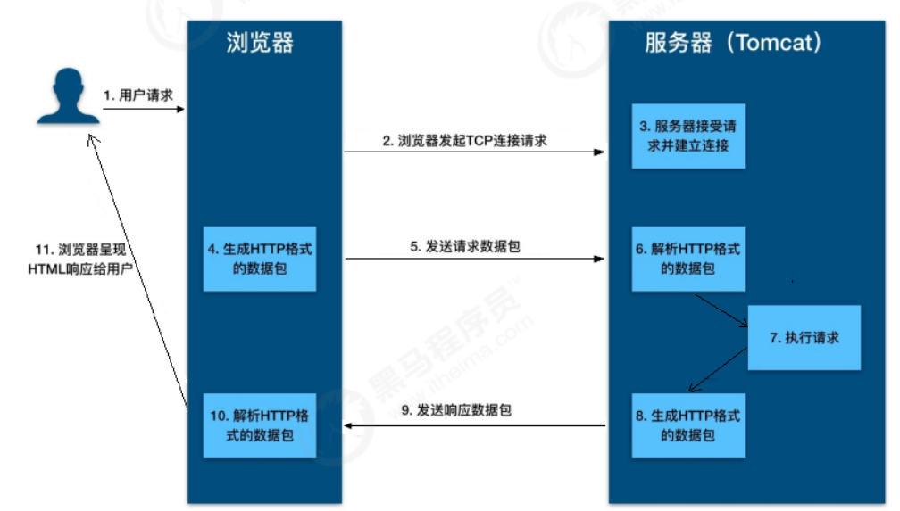

<font style="color:rgb(51,51,51);">从图上你可以看到，这个过程是： </font>

1. <font style="color:rgb(51,51,51);">用户通过浏览器进行了一个操作，比如输入网址并回车，或者是点击链接，接着浏览 器获取了这个事件。 </font>
2. <font style="color:rgb(51,51,51);">浏览器向服务端发出TCP连接请求。 </font>
3. <font style="color:rgb(51,51,51);">服务程序接受浏览器的连接请求，并经过TCP三次握手建立连接。 </font>
4. <font style="color:rgb(51,51,51);">浏览器将请求数据打包成一个HTTP协议格式的数据包。 </font>
5. <font style="color:rgb(51,51,51);">浏览器将该数据包推入网络，数据包经过网络传输，最终达到端服务程序。 </font>
6. <font style="color:rgb(51,51,51);">服务端程序拿到这个数据包后，同样以HTTP协议格式解包，获取到客户端的意图。 </font>
7. <font style="color:rgb(51,51,51);">得知客户端意图后进行处理，比如提供静态文件或者调用服务端程序获得动态结果。 </font>
8. <font style="color:rgb(51,51,51);">服务器将响应结果（可能是HTML或者图片等）按照HTTP协议格式打包。 </font>
9. <font style="color:rgb(51,51,51);">服务器将响应数据包推入网络，数据包经过网络传输最终达到到浏览器。 </font>
10. <font style="color:rgb(51,51,51);">浏览器拿到数据包后，以HTTP协议的格式解包，然后解析数据，假设这里的数据是HTML。 </font>
11. <font style="color:rgb(51,51,51);">浏览器将HTML文件展示在页面上。 </font>


<font style="color:rgb(51,51,51);">那我们想要探究的Tomcat作为一个HTTP服务器，在这个过程中都做了些什么事情呢？主 要是接受连接、解析请求数据、处理请求和发送响应这几个步骤。 </font>

## <font style="color:rgb(51,51,51);">2 Tomcat整体架构 </font>
### <font style="color:rgb(51,51,51);">2.1 Http服务器请求处理 </font>
<font style="color:rgb(51,51,51);">浏览器发给服务端的是一个HTTP格式的请求，HTTP服务器收到这个请求后，需要调用服 务端程序来处理，所谓的服务端程序就是你写的Java类，一般来说不同的请求需要由不同 的Java类来处理。 </font>

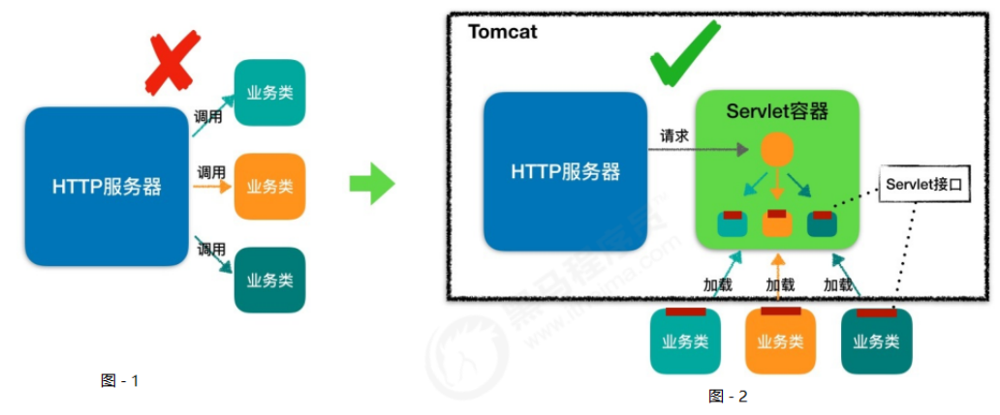

1. <font style="color:rgb(51,51,51);">图1 ， 表示HTTP服务器直接调用具体业务类，它们是紧耦合的。 </font>
2. <font style="color:rgb(51,51,51);">图2，HTTP服务器不直接调用业务类，而是把请求交给容器来处理，容器通过 Servlet接口调用业务类。因此Servlet接口和Servlet容器的出现，达到了HTTP服务器与业务类解耦的目的。而Servlet接口和Servlet容器这一整套规范叫作Servlet规范。 </font>

<font style="color:rgb(51,51,51);">Tomcat按照Servlet规范的要求实现了Servlet容器，同时它们也具有HTTP服务器的功 能。作为Java程序员，如果我们要实现新的业务功能，只需要实现一个Servlet，并把它 注册到Tomcat（Servlet容器）中，剩下的事情就由Tomcat帮我们处理了。 </font>

### <font style="color:rgb(51,51,51);">2.2 Servlet容器工作流程 </font>
<font style="color:rgb(51,51,51);">为了解耦，HTTP服务器不直接调用Servlet，而是把请求交给Servlet容器来处理，那 Servlet容器又是怎么工作的呢？ </font>

<font style="color:rgb(51,51,51);">当客户请求某个资源时，HTTP服务器会用一个ServletRequest对象把客户的请求信息封装起来，然后调用Servlet容器的service方法，Servlet容器拿到请求后，根据请求的URL和Servlet的映射关系，找到相应的Servlet，如果Servlet还没有被加载，就用反射机制创建这个Servlet，并调用Servlet的init方法来完成初始化，接着调用Servlet的service方法来处理请求，把ServletResponse对象返回给HTTP服务器，HTTP服务器会把响应发送给客户端。 </font>

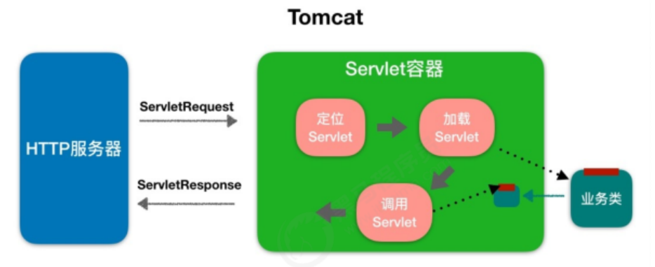

### <font style="color:rgb(51,51,51);">2.3 Tomcat整体架构 </font>
<font style="color:rgb(51,51,51);">我们知道如果要设计一个系统，首先是要了解需求，我们已经了解了Tomcat要实现两个核心功能： </font>

1. <font style="color:rgb(51,51,51);">处理Socket连接，负责网络字节流与Request和Response对象的转化。 </font>
2. <font style="color:rgb(51,51,51);">加载和管理Servlet，以及具体处理Request请求。 </font>

<font style="color:rgb(51,51,51);">因此Tomcat设计了两个核心组件连接器（Connector）和容器（Container）来分别做这两件事情。连接器负责对外交流，容器负责内部处理。 </font>

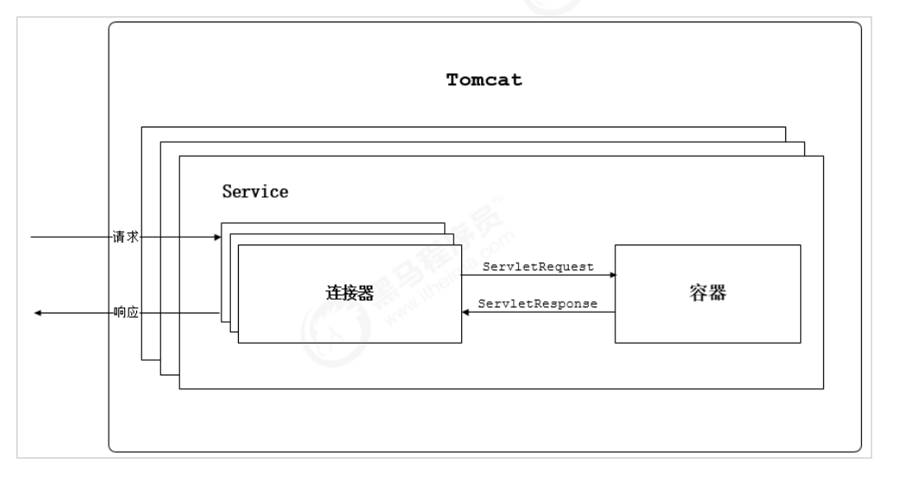

## <font style="color:rgb(51,51,51);">3 连接器-Coyote </font>
### <font style="color:rgb(51,51,51);">3.1 架构介绍 </font>
<font style="color:rgb(51,51,51);">Coyote 是Tomcat的连接器框架的名称 , 是Tomcat服务器提供的供客户端访问的外部接口。客户端通过Coyote与服务器建立连接、发送请求并接受响应 。 </font>

<font style="color:rgb(51,51,51);">Coyote 封装了底层的网络通信（Socket 请求及响应处理），为Catalina 容器提供了统一的接口，使Catalina 容器与具体的请求协议及IO操作方式完全解耦。Coyote 将Socket 输入转换封装为 Request 对象，交由Catalina 容器进行处理，处理请求完成后, Catalina通过Coyote 提供的Response 对象将结果写入输出流 。 </font>

<font style="color:rgb(51,51,51);">Coyote 作为独立的模块，只负责具体协议和IO的相关操作， 与Servlet 规范实现没有直接关系，因此即便是 Request 和 Response 对象也并未实现Servlet规范对应的接口， 而是在Catalina 中将他们进一步封装为ServletRequest 和 ServletResponse 。 </font>

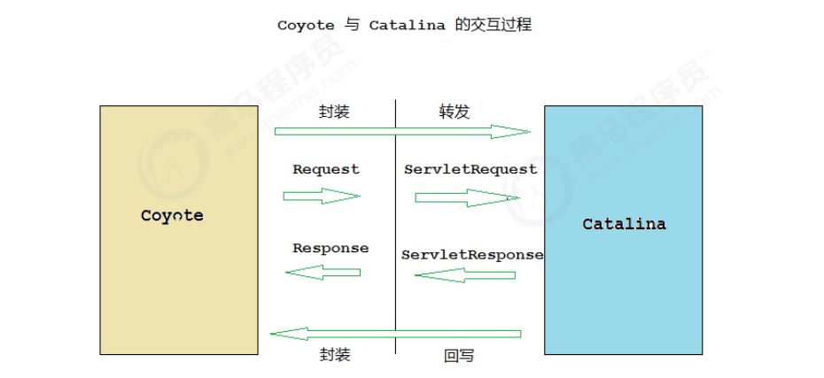

### <font style="color:rgb(51,51,51);">3.2 IO模型与协议 </font>
<font style="color:rgb(51,51,51);">在Coyote中 ， Tomcat支持的多种I/O模型和应用层协议，具体包含哪些IO模型和应用层协议，请看下表： </font>

<font style="color:rgb(51,51,51);">Tomcat </font><font style="color:rgb(51,51,51);">支持的</font><font style="color:rgb(51,51,51);">IO</font><font style="color:rgb(51,51,51);">模型（自</font><font style="color:rgb(51,51,51);">8.5/9.0 </font><font style="color:rgb(51,51,51);">版本起，</font><font style="color:rgb(51,51,51);">Tomcat </font><font style="color:rgb(51,51,51);">移除了 对 </font><font style="color:rgb(51,51,51);">BIO </font><font style="color:rgb(51,51,51);">的支持）： </font>

| **<font style="color:rgb(51,51,51);">IO</font>**<font style="color:rgb(51,51,51);">模型 </font> | <font style="color:rgb(51,51,51);">描述 </font> |
| --- | --- |
| <font style="color:rgb(51,51,51);">NIO </font> | <font style="color:rgb(51,51,51);">非阻塞I/O，采用Java NIO类库实现。 </font> |
| <font style="color:rgb(51,51,51);">NIO2 </font> | <font style="color:rgb(51,51,51);">异步I/O，采用JDK 7最新的NIO2类库实现。 </font> |
| <font style="color:rgb(51,51,51);">APR </font> | <font style="color:rgb(51,51,51);">采用Apache可移植运行库实现，是C/C++编写的本地库。如果选择该方案，需要单独安装APR库。 </font> |


<font style="color:rgb(51,51,51);">Tomcat 支持的应用层协议 ：</font><font style="color:rgb(51,51,51);"> </font>

| <font style="color:#000000;">应用层协议 </font> | <font style="color:#000000;">描述 </font> |
| --- | --- |
| <font style="color:rgb(51,51,51);">HTTP/1.1 </font> | <font style="color:rgb(51,51,51);">这是大部分Web应用采用的访问协议。 </font> |
| <font style="color:rgb(51,51,51);">AJP </font> | <font style="color:rgb(51,51,51);">用于和Web服务器集成（如Apache），以实现对静态资源的优化以及集群部署，当前支持AJP/1.3。 </font> |
| <font style="color:rgb(51,51,51);">HTTP/2 </font> | <font style="color:rgb(51,51,51);">HTTP 2.0大幅度的提升了Web性能。下一代HTTP协议 ， 自8.5以及9.0版本之后支持。 </font> |


<font style="color:rgb(51,51,51);">协议分层 ： </font>

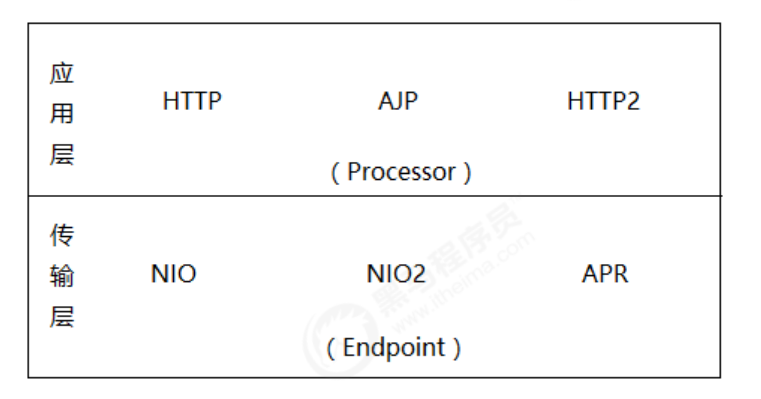

<font style="color:rgb(51,51,51);">在 8.0 之前 ， Tomcat 默认采用的I/O方式为 BIO ， 之后改为 NIO。 无论 NIO、NIO2 还是 APR， 在性能方面均优于以往的BIO。 如果采用APR， 甚至可以达到 Apache HTTP Server 的影响性能。 </font>

<font style="color:rgb(51,51,51);">Tomcat为了实现支持多种I/O模型和应用层协议，一个容器可能对接多个连接器，就好比一个房间有多个门。但是单独的连接器或者容器都不能对外提供服务，需要把它们组装起来才能工作，组装后这个整体叫作Service组件。这里请你注意，Service本身没有做什么重要的事情，只是在连接器和容器外面多包了一层，把它们组装在一起。Tomcat内可能有多个Service，这样的设计也是出于灵活性的考虑。通过在Tomcat中配置多个Service，可以实现通过不同的端口号来访问同一台机器上部署的不同应用。 </font>

### <font style="color:rgb(51,51,51);">3.3 连接器组件 </font>


<font style="color:rgb(51,51,51);">连接器中的各个组件的作用如下： </font>

**<font style="color:#E8323C;">EndPoint </font>**

> <font style="color:rgb(51,51,51);">1） EndPoint ： Coyote 通信端点，即通信监听的接口，是具体Socket接收和发送处理器，是对传输层的抽象，因此EndPoint用来实现TCP/IP协议的。 </font>
>
> <font style="color:rgb(51,51,51);">2） Tomcat 并没有EndPoint 接口，而是提供了一个抽象类AbstractEndpoint ， 里面定义了两个内部类：Acceptor和SocketProcessor。Acceptor用于监听Socket连接请求。SocketProcessor用于处理接收到的Socket请求，它实现Runnable接口，在Run方法里调用协议处理组件Processor进行处理。为了提高处理能力，SocketProcessor被提交到线程池来执行。而这个线程池叫作执行器（Executor)，我在后面的专栏会详细介绍Tomcat如何扩展原生的Java线程池。 </font>
>

<font style="color:rgb(51,51,51);"></font>

**<font style="color:#E8323C;">Processor </font>**

> <font style="color:rgb(51,51,51);">Processor ： Coyote 协议处理接口 ，如果说EndPoint是用来实现TCP/IP协议的，那么Processor用来实现HTTP协议，Processor接收来自EndPoint的Socket，读取字节流解析成Tomcat Request和Response对象，并通过Adapter将其提交到容器处理，Processor是对应用层协议的抽象。 </font>
>


**<font style="color:#E8323C;">ProtocolHandler </font>**

> <font style="color:rgb(51,51,51);">ProtocolHandler： Coyote 协议接口， 通过Endpoint 和 Processor ， 实现针对具体协议的处理能力。Tomcat 按照协议和I/O 提供了6个实现类 ： AjpNioProtocol ，AjpAprProtocol， AjpNio2Protocol ， Http11NioProtocol ，Http11Nio2Protocol ， Http11AprProtocol。我们在配置tomcat/conf/server.xml 时 ， 至少要指定具体的ProtocolHandler , 当然也可以指定协议名称 ， 如 ： HTTP/1.1 ，如果安装了APR，那么将使用Http11AprProtocol ， 否则使用 Http11NioProtocol 。</font>
>

<font style="color:rgb(51,51,51);"> </font>

**<font style="color:#E8323C;">Adapter</font>****<font style="color:rgb(51,51,51);"> </font>**

> <font style="color:rgb(51,51,51);">由于协议不同，客户端发过来的请求信息也不尽相同，Tomcat定义了自己的Request类来“存放”这些请求信息。ProtocolHandler接口负责解析请求并生成Tomcat Request类。但是这个Request对象不是标准的ServletRequest，也就意味着，不能用TomcatRequest作为参数来调用容器。Tomcat设计者的解决方案是引入CoyoteAdapter，这是适配器模式的经典运用，连接器调用CoyoteAdapter的Sevice方法，传入的是TomcatRequest对象，CoyoteAdapter负责将Tomcat Request转成ServletRequest，再调用容器的Service方法。 </font>
>

### <font style="color:rgb(51,51,51);">3.4 源码解析 </font>
<font style="color:rgb(51,51,51);">具体的源码解析，请参考</font><font style="color:rgb(51,51,51);">2.5 </font><font style="color:rgb(51,51,51);">， </font><font style="color:rgb(51,51,51);">2.6 </font><font style="color:rgb(51,51,51);">章节讲解的</font><font style="color:rgb(51,51,51);">Tomcat</font><font style="color:rgb(51,51,51);">启动流程及请求处理流程 </font>

## <font style="color:rgb(51,51,51);">4 容器 - Catalina </font>
<font style="color:rgb(51,51,51);">Tomcat是一个由一系列可配置的组件构成的Web容器，而Catalina是Tomcat的servlet容 器。</font>

<font style="color:rgb(51,51,51);">Catalina 是Servlet 容器实现，包含了之前讲到的所有的容器组件，以及后续章节涉及到 的安全、会话、集群、管理等Servlet 容器架构的各个方面。它通过松耦合的方式集成Coyote，以完成按照请求协议进行数据读写。同时，它还包括我们的启动入口、Shell程 序等。 </font>

### <font style="color:rgb(51,51,51);">4.1 Catalina 地位 </font>
<font style="color:rgb(51,51,51);">Tomcat </font><font style="color:rgb(51,51,51);">的模块分层结构图， 如下： </font>

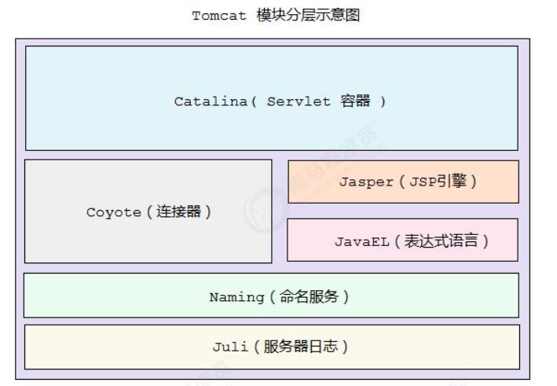

<font style="color:rgb(51,51,51);">Tomcat 本质上就是一款 Servlet 容器， 因此Catalina 才是 Tomcat 的核心 ， 其他模块都是为Catalina 提供支撑的。 比如 ： 通过Coyote 模块提供链接通信，Jasper 模块提供JSP引擎，Naming 提供JNDI 服务，Juli 提供日志服务。 </font>

### <font style="color:rgb(51,51,51);">4.2 Catalina 结构 </font>
<font style="color:rgb(51,51,51);">Catalina </font><font style="color:rgb(51,51,51);">的主要组件结构如下：</font>

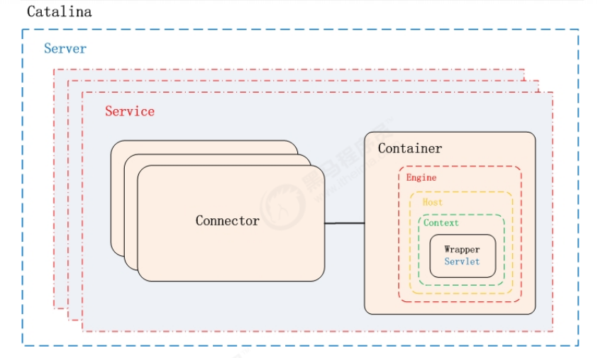<font style="color:rgb(51,51,51);"> </font>

<font style="color:rgb(51,51,51);">如上图所示，Catalina负责管理Server，而Server表示着整个服务器。Server下面有多个服务Service，每个服务都包含着多个连接器组件Connector（Coyote 实现）和一个容器组件Container。在Tomcat 启动的时候， 会初始化一个Catalina的实例。 </font>

<font style="color:rgb(51,51,51);">Catalina 各个组件的职责：</font>

| <font style="color:rgb(51,51,51);">组件</font> | <font style="color:rgb(51,51,51);">职责 </font> |
| --- | --- |
| <font style="color:rgb(51,51,51);">Catalina </font> | <font style="color:rgb(51,51,51);">负责解析Tomcat的配置文件 , 以此来创建服务器Server组件，并根据命令来对其进行管理 </font> |
| <font style="color:rgb(51,51,51);">Server </font> | <font style="color:rgb(51,51,51);">服务器表示整个Catalina Servlet容器以及其它组件，负责组装并启动Servlet引擎,Tomcat连接器。Server通过实Lifecycle接口，提供了一种优雅的启动和关闭整个系统的方式 </font> |
| <font style="color:rgb(51,51,51);">Service</font> | <font style="color:rgb(51,51,51);">服务是Server内部的组件，一个Server包含多个Service。它将若干个Connector组件绑定到一个Container（Engine）上 </font> |
| <font style="color:rgb(51,51,51);">Connector</font> | <font style="color:rgb(51,51,51);"> 连接器，处理与客户端的通信，它负责接收客户请求，然后转给相关的容器处理，最后向客户返回响应结果 </font> |
| <font style="color:rgb(51,51,51);">Container</font> | <font style="color:rgb(51,51,51);">容器，负责处理用户的servlet请求，并返回对象给web用户的模块 </font> |


### <font style="color:rgb(51,51,51);">4.3 Container 结构 </font>
<font style="color:rgb(51,51,51);">Tomcat设计了4种容器，分别是Engine、Host、Context和Wrapper。这4种容器不是平行关系，而是父子关系。Tomcat通过一种分层的架构，使得Servlet容器具有很好的灵活性。 </font>

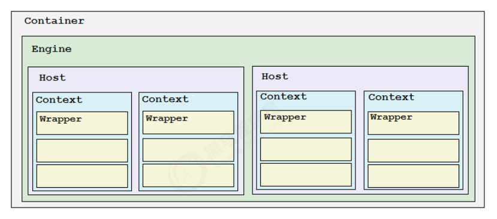

<font style="color:rgb(51,51,51);">各个组件的含义 ： </font>

| <font style="color:rgb(51,51,51);">容器 </font> | <font style="color:rgb(51,51,51);">描述 </font> |
| --- | --- |
| <font style="color:rgb(51,51,51);">Engine </font> | <font style="color:rgb(51,51,51);">表示整个Catalina的Servlet引擎，用来管理多个虚拟站点，一个Service最多只能有一个Engine，但是一个引擎可包含多个Host </font> |
| <font style="color:rgb(51,51,51);">Host </font> | <font style="color:rgb(51,51,51);">代表一个虚拟主机，或者说一个站点，可以给Tomcat配置多个虚拟主机地址，而一个虚拟主机下可包含多个Context </font> |
| <font style="color:rgb(51,51,51);">Context </font> | <font style="color:rgb(51,51,51);">表示一个Web应用程序， 一个Web应用可包含多个Wrapper </font> |
| <font style="color:rgb(51,51,51);">Wrapper </font> | <font style="color:rgb(51,51,51);">表示一个Servlet，Wrapper 作为容器中的最底层，不能包含子容器</font> |


<font style="color:rgb(51,51,51);">我们也可以再通过Tomcat的server.xml配置文件来加深对Tomcat容器的理解。Tomcat采用了组件化的设计，它的构成组件都是可配置的，其中最外层的是Server，其他组件按照一定的格式要求配置在这个顶层容器中。 </font>

```xml
<Server>
    <Service>
        <Connector/>
        <Connector/>
        <Engine>
            <Host>
                <Context></Context>
            </Host>
        </Engine>
    </Service>
</Server>

```

<font style="color:rgb(51,51,51);">那么，Tomcat是怎么管理这些容器的呢？你会发现这些容器具有父子关系，形成一个树形结构，你可能马上就想到了设计模式中的组合模式。没错，Tomcat就是用组合模式来管理这些容器的。具体实现方法是，所有容器组件都实现了Container接口，因此组合模式可以使得用户对单容器对象和组合容器对象的使用具有一致性。这里单容器对象指的是最底层的Wrapper，组合容器对象指的是上面的Context、Host或者Engine。 </font>

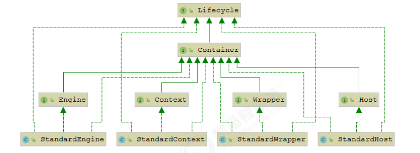

<font style="color:rgb(51,51,51);">Container 接口中提供了以下方法（截图中知识一部分方法） ： </font>

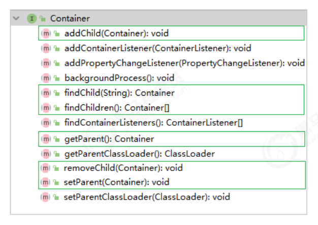

<font style="color:rgb(51,51,51);">在上面的接口看到了</font><font style="color:rgb(51,51,51);">getParent</font><font style="color:rgb(51,51,51);">、</font><font style="color:rgb(51,51,51);">SetParent</font><font style="color:rgb(51,51,51);">、</font><font style="color:rgb(51,51,51);">addChild</font><font style="color:rgb(51,51,51);">和</font><font style="color:rgb(51,51,51);">removeChild</font><font style="color:rgb(51,51,51);">等方法。 </font>

<font style="color:rgb(51,51,51);">Container接口扩展了LifeCycle接口，LifeCycle接口用来统一管理各组件的生命周期，后面我也用专门的篇幅去详细介绍。 </font>

## <font style="color:rgb(51,51,51);">5 Tomcat 启动流程 </font>
### <font style="color:rgb(51,51,51);">5.1 流程 </font>


<font style="color:rgb(0,0,0);"></font><font style="color:rgb(51,51,51);">步骤 : </font>

1. <font style="color:rgb(51,51,51);">启动tomcat ， 需要调用 bin/startup.bat (在linux 目录下 , 需要调用 bin/startup.sh) ，在startup.bat 脚本中, 调用了catalina.bat。 </font>
2. <font style="color:rgb(51,51,51);"> 在catalina.bat 脚本文件中，调用了BootStrap 中的main方法。 </font>
3. <font style="color:rgb(51,51,51);">在BootStrap 的main 方法中调用了 init 方法 ， 来创建Catalina 及 初始化类加载器。 </font>
4. <font style="color:rgb(51,51,51);">在BootStrap 的main 方法中调用了 load 方法 ， 在其中又调用了Catalina的load方法。</font>
5. <font style="color:rgb(51,51,51);">在Catalina 的load 方法中 , 需要进行一些初始化的工作, 并需要构造Digester 对象, 用于解析 XML。 </font>
6. <font style="color:rgb(51,51,51);">然后在调用后续组件的初始化操作 。</font>

<font style="color:rgb(51,51,51);">加载Tomcat的配置文件，初始化容器组件 ，监听对应的端口号， 准备接受客户端请求。</font>

### <font style="color:rgb(51,51,51);">5.2 源码解析 </font>
#### <font style="color:rgb(51,51,51);">5.2.1 Lifecycle </font>
<font style="color:rgb(51,51,51);">由于所有的组件均存在初始化、启动、停止等生命周期方法，拥有生命周期管理的特性， 所以Tomcat在设计的时候， 基于生命周期管理抽象成了一个接口 Lifecycle ，而组件 Server、Service、Container、Executor、Connector 组件 ， 都实现了一个生命周期的接口，从而具有了以下生命周期中的核心方法： </font>

+ <font style="color:rgb(51,51,51);">init（）：初始化组件 </font>
+ <font style="color:rgb(51,51,51);">start（）：启动组件 </font>
+ <font style="color:rgb(51,51,51);">stop（）：停止组件 </font>
+ <font style="color:rgb(51,51,51);">destroy（）：销毁组件 </font>

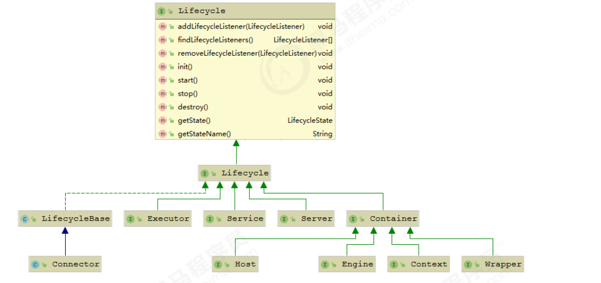

#### <font style="color:rgb(51,51,51);">5.2.2 各组件的默认实现 </font>
<font style="color:rgb(51,51,51);">上面我们提到的Server、Service、Engine、Host、Context都是接口， 下图中罗列了这些接口的默认实现类。当前对于 Endpoint组件来说，在Tomcat中没有对应的Endpoint </font>

<font style="color:rgb(51,51,51);">接口， 但是有一个抽象类 AbstractEndpoint ，其下有三个实现类： NioEndpoint、Nio2Endpoint、AprEndpoint ， 这三个实现类，分别对应于前面讲解链接器 Coyote时， 提到的链接器支持的三种IO模型：NIO，NIO2，APR ， Tomcat8.5版本中，默认采用的是 NioEndpoint。 </font>

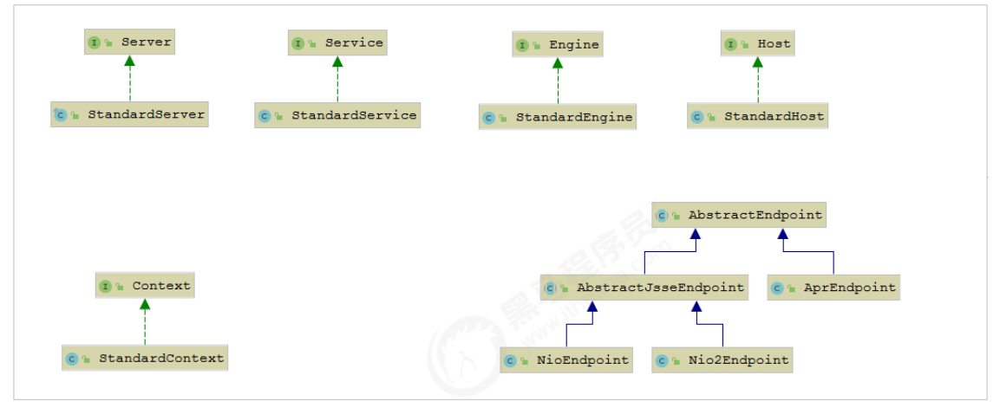

<font style="color:rgb(51,51,51);">ProtocolHandler ： Coyote协议接口，通过封装Endpoint和Processor ， 实现针对具体协议的处理功能。Tomcat按照协议和IO提供了6个实现类。 </font>

<font style="color:rgb(51,51,51);">AJP</font><font style="color:rgb(51,51,51);">协议： </font>

<font style="color:rgb(51,51,51);">1</font><font style="color:rgb(51,51,51);">） </font><font style="color:rgb(51,51,51);">AjpNioProtocol </font><font style="color:rgb(51,51,51);">：采用</font><font style="color:rgb(51,51,51);">NIO</font><font style="color:rgb(51,51,51);">的</font><font style="color:rgb(51,51,51);">IO</font><font style="color:rgb(51,51,51);">模型。 </font>

<font style="color:rgb(51,51,51);">2</font><font style="color:rgb(51,51,51);">） </font><font style="color:rgb(51,51,51);">AjpNio2Protocol</font><font style="color:rgb(51,51,51);">：采用</font><font style="color:rgb(51,51,51);">NIO2</font><font style="color:rgb(51,51,51);">的</font><font style="color:rgb(51,51,51);">IO</font><font style="color:rgb(51,51,51);">模型。 </font>

<font style="color:rgb(51,51,51);">3</font><font style="color:rgb(51,51,51);">） </font><font style="color:rgb(51,51,51);">AjpAprProtocol </font><font style="color:rgb(51,51,51);">：采用</font><font style="color:rgb(51,51,51);">APR</font><font style="color:rgb(51,51,51);">的</font><font style="color:rgb(51,51,51);">IO</font><font style="color:rgb(51,51,51);">模型，需要依赖于</font><font style="color:rgb(51,51,51);">APR</font><font style="color:rgb(51,51,51);">库。 </font>

<font style="color:rgb(51,51,51);"></font>

<font style="color:rgb(51,51,51);">HTTP</font><font style="color:rgb(51,51,51);">协议： </font>

<font style="color:rgb(51,51,51);">1） Http11NioProtocol ：采用NIO的IO模型，默认使用的协议（如果服务器没有安装APR）。 </font>

<font style="color:rgb(51,51,51);">2</font><font style="color:rgb(51,51,51);">） </font><font style="color:rgb(51,51,51);">Http11Nio2Protocol</font><font style="color:rgb(51,51,51);">：采用</font><font style="color:rgb(51,51,51);">NIO2</font><font style="color:rgb(51,51,51);">的</font><font style="color:rgb(51,51,51);">IO</font><font style="color:rgb(51,51,51);">模型。 </font>

<font style="color:rgb(51,51,51);">3</font><font style="color:rgb(51,51,51);">） </font><font style="color:rgb(51,51,51);">Http11AprProtocol </font><font style="color:rgb(51,51,51);">：采用</font><font style="color:rgb(51,51,51);">APR</font><font style="color:rgb(51,51,51);">的</font><font style="color:rgb(51,51,51);">IO</font><font style="color:rgb(51,51,51);">模型，需要依赖于</font><font style="color:rgb(51,51,51);">APR</font><font style="color:rgb(51,51,51);">库。 </font>

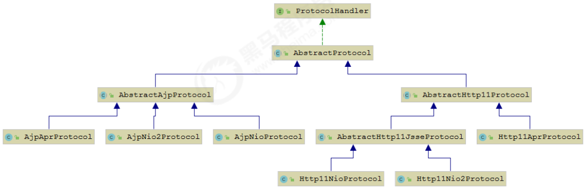

#### <font style="color:rgb(51,51,51);">5.2.3 源码入口 </font>
<font style="color:rgb(51,51,51);">目录： </font>`<font style="color:rgb(51,51,51);">org.apache.catalina.startup</font>`<font style="color:rgb(51,51,51);"> </font>

```xml
MainClass：BootStrap ‐‐‐‐> main(String[] args) 
```

### <font style="color:rgb(51,51,51);">5.3 总结 </font>
<font style="color:rgb(51,51,51);">从启动流程图中以及源码中，我们可以看出Tomcat的启动过程非常标准化， 统一按照生命周期管理接口Lifecycle的定义进行启动。首先调用init() 方法进行组件的逐级初始化操 </font>

<font style="color:rgb(51,51,51);">作，然后再调用start()方法进行启动。 </font>

<font style="color:rgb(51,51,51);">每一级的组件除了完成自身的处理外，还要负责调用子组件响应的生命周期管理方法，组件与组件之间是松耦合的，因为我们可以很容易的通过配置文件进行修改和替换。 </font>

## <font style="color:rgb(51,51,51);">6 Tomcat 请求处理流程 </font>
### <font style="color:rgb(51,51,51);"> 6.1 请求流程 </font>
<font style="color:rgb(51,51,51);">设计了这么多层次的容器，Tomcat是怎么确定每一个请求应该由哪个Wrapper容器里的 Servlet来处理的呢？</font>

<font style="color:rgb(51,51,51);">答案：是Tomcat是用Mapper组件来完成这个任务的。 </font>

<font style="color:rgb(51,51,51);"></font>

<font style="color:rgb(51,51,51);">Mapper组件的功能就是将用户请求的URL定位到一个Servlet，它的工作原理是： Mapper组件里保存了Web应用的配置信息，其实就是容器组件与访问路径的映射关系，比如Host容器里配置的域名、Context容器里的Web应用路径，以及Wrapper容器里Servlet映射的路径，你可以想象这些配置信息就是一个多层次的Map。 </font>

<font style="color:rgb(51,51,51);">当一个请求到来时，Mapper组件通过解析请求URL里的域名和路径，再到自己保存的Map里去查找，就能定位到一个Servlet。请你注意，一个请求URL最后只会定位到一个Wrapper容器，也就是一个Servlet。 </font>

<font style="color:rgb(51,51,51);">下面的示意图中 ， 就描述了 当用户请求链接</font>`<font style="color:rgb(51,51,51);">http://www.itcast.cn/bbs/findAll</font>`<font style="color:rgb(51,51,51);">之后, 是如何找到最终处理业务逻辑的servlet 。 </font>

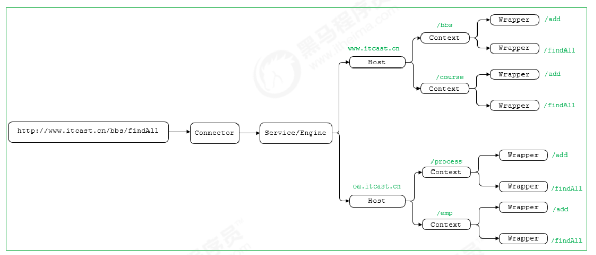

<font style="color:rgb(51,51,51);">那上面这幅图只是描述了根据请求的URL如何查找到需要执行的Servlet ， 那么下面我们再来解析一下 ， 从Tomcat的设计架构层面来分析Tomcat的请求处理。 </font>


<font style="color:rgb(51,51,51);">步骤如下</font><font style="color:rgb(51,51,51);">: </font>

1. <font style="color:rgb(51,51,51);">Connector组件Endpoint中的Acceptor监听客户端套接字连接并接收Socket。 </font>
2. <font style="color:rgb(51,51,51);">将连接交给线程池Executor处理，开始执行请求响应任务。 </font>
3. <font style="color:rgb(51,51,51);">Processor组件读取消息报文，解析请求行、请求体、请求头，封装成Request对象。 </font>
4. <font style="color:rgb(51,51,51);">Mapper组件根据请求行的URL值和请求头的Host值匹配由哪个Host容器、Context容器、Wrapper容器处理请求。 </font>
5. <font style="color:rgb(51,51,51);">CoyoteAdaptor组件负责将Connector组件和Engine容器关联起来，把生成的Request对象和响应对象Response传递到Engine容器中，调用 Pipeline。 </font>
6. <font style="color:rgb(51,51,51);">Engine容器的管道开始处理，管道中包含若干个Valve、每个Valve负责部分处理逻辑。执行完Valve后会执行基础的 Valve--StandardEngineValve，负责调用Host容器的Pipeline。 </font>
7. <font style="color:rgb(51,51,51);">Host容器的管道开始处理，流程类似，最后执行 Context容器的Pipeline。 </font>
8. <font style="color:rgb(51,51,51);">Context容器的管道开始处理，流程类似，最后执行 Wrapper容器的Pipeline。 </font>
9. <font style="color:rgb(51,51,51);">Wrapper容器的管道开始处理，流程类似，最后执行 Wrapper容器对应的Servlet对象的处理方法。 </font>

### <font style="color:rgb(51,51,51);">6.2 请求流程源码解析 </font>
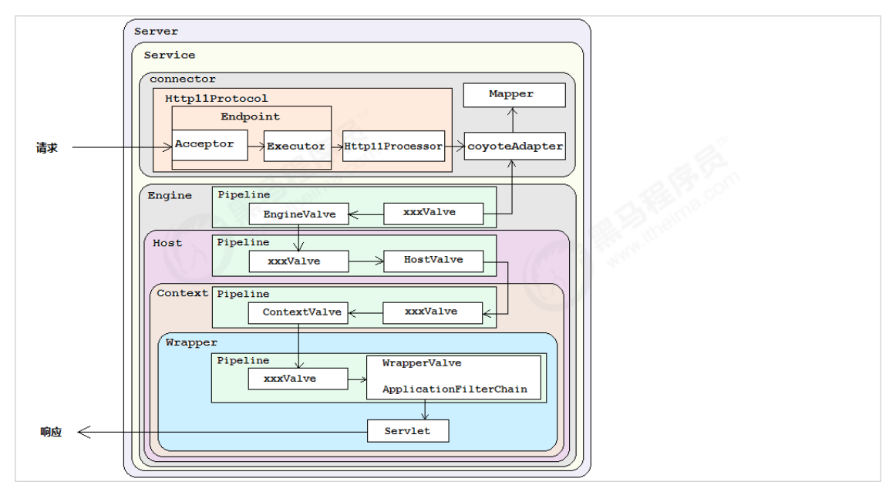

<font style="color:rgb(51,51,51);">在前面所讲解的Tomcat的整体架构中，我们发现Tomcat中的各个组件各司其职，组件之间松耦合，确保了整体架构的可伸缩性和可拓展性，那么在组件内部，如何增强组件的灵活性和拓展性呢？ 在Tomcat中，每个Container组件采用责任链模式来完成具体的 请求处理。 </font>

<font style="color:rgb(51,51,51);">在Tomcat中定义了Pipeline 和 Valve 两个接口，Pipeline 用于构建责任链， 后者代表责任链上的每个处理器。Pipeline 中维护了一个基础的Valve，它始终位于Pipeline的末端（最后执行），封装了具体的请求处理和输出响应的过程。当然，我们也可以调用addValve()方法， 为Pipeline 添加其他的Valve， 后添加的Valve 位于基础的Valve之前，并按照添加顺序执行。Pipiline通过获得首个Valve来启动整合链条的执行 。 </font>

