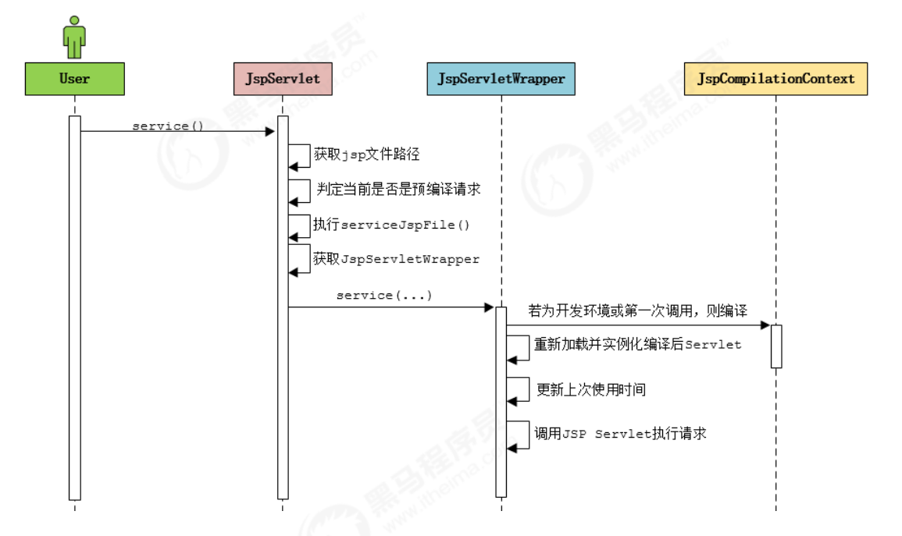
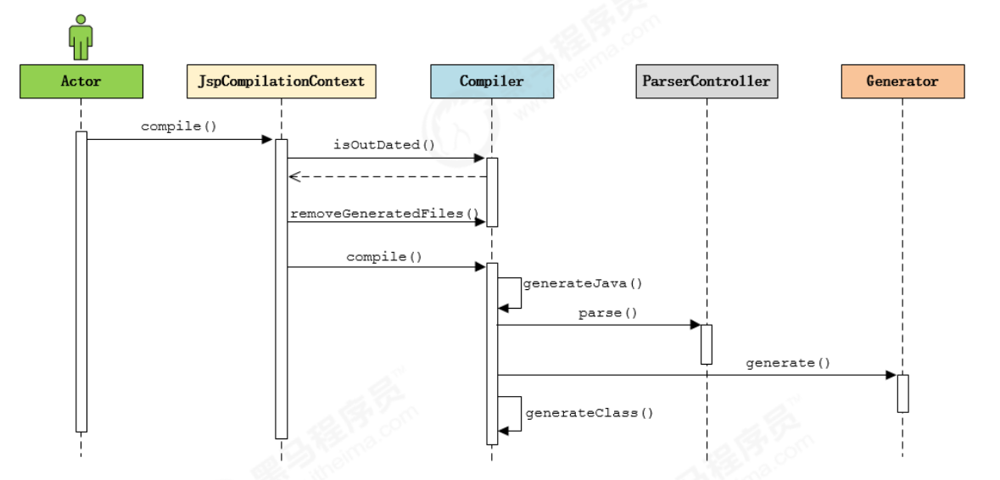

## <font style="color:rgb(51,51,51);">1 Jasper 简介 </font>
<font style="color:rgb(51,51,51);">对于基于JSP 的web应用来说，我们可以直接在JSP页面中编写 Java代码，添加第三方的标签库，以及使用EL表达式。但是无论经过何种形式的处理，最终输出到客户端的都是标准的HTML页面（包含js ，css...），并不包含任何的java相关的语法。 也就是说， 我们可以把jsp看做是一种运行在服务端的脚本。 那么服务器是如何将 JSP页面转换为HTML页面的呢？ </font>

<font style="color:rgb(51,51,51);">Jasper模块是Tomcat的JSP核心引擎，我们知道JSP本质上是一个Servlet。Tomcat使用Jasper对JSP语法进行解析，生成Servlet并生成Class字节码，用户在进行访问jsp时，会访问Servlet，最终将访问的结果直接响应在浏览器端 。另外，在运行的时候，Jasper还会检测JSP文件是否修改，如果修改，则会重新编译JSP文件。 </font>

## <font style="color:rgb(51,51,51);">2 JSP 编译方式 </font>
### <font style="color:rgb(51,51,51);">2.1 运行时编译 </font>
<font style="color:rgb(51,51,51);">Tomcat 并不会在启动Web应用的时候自动编译JSP文件， 而是在客户端第一次请求时，才编译需要访问的JSP文件。 </font>

<font style="color:rgb(51,51,51);">创建一个</font><font style="color:rgb(51,51,51);">web</font><font style="color:rgb(51,51,51);">项目</font><font style="color:rgb(51,51,51);">, </font><font style="color:rgb(51,51,51);">并编写</font><font style="color:rgb(51,51,51);">JSP</font><font style="color:rgb(51,51,51);">代码 </font><font style="color:rgb(51,51,51);">: </font>

```java
<%@ page import="java.text.DateFormat" %> 
<%@ page import="java.text.SimpleDateFormat" %> 
<%@ page import="java.util.Date" %> 
<%@ page contentType="text/html;charset=UTF‐8" language="java" %> 
<%@ taglib prefix="c" uri="http://java.sun.com/jsp/jstl/core" %> 
<html> 
	<head> 
		<title>

$$
Title
$$
</title> 
	</head> 
	<body> 
		<% 	DateFormat dateFormat = new SimpleDateFormat("yyyy‐MM‐dd HH:mm:ss"); 
			String format = dateFormat.format(new Date()); 
		%>
		Hello , Java Server Page
		<br/> 
		<%= format %> 
	</body> 
</html> 
```

#### <font style="color:rgb(51,51,51);">2.1.1 编译过程 </font>
<font style="color:rgb(51,51,51);">Tomcat 在默认的web.xml 中配置了一个org.apache.jasper.servlet.JspServlet，用于处理所有的.jsp 或 .jspx 结尾的请求，该Servlet 实现即是运行时编译的入口。 </font>

```xml
<servlet>
	<servlet-name>jsp</servlet-name>
	<servlet-class>org.apache.jasper.servlet.JspServlet</servlet-class>
	<init-param>
		<param-name>fork</param-name>
		<param-value>false</param-value>
	</init-param>
	<init-param>
		<param-name>xpoweredBy</param-name>
		<param-value>false</param-value>
	</init-param>
	<load-on-startup>3</load-on-startup>
</servlet>

<servlet-mapping>
	<servlet-name>jsp</servlet-name>
	<url-pattern>*.jsp</url-pattern>
	<url-pattern>*.jspx</url-pattern>
</servlet-mapping>
```

<font style="color:rgb(51,51,51);">JspServlet 处理流程图： </font>



**<font style="color:rgb(51,51,51);"></font>**<font style="color:rgb(51,51,51);">编译结果 </font>

1. <font style="color:rgb(51,51,51);"> 如果在 tomcat/conf/web.xml 中配置了参数scratchdir ， 则jsp编译后的结果，就会存储在该目录下 。 </font>

```xml
<init-param>
	<param-name>scratchdir </param-name>
	<param-value>D://tmp/jsp/</param-value>
</init-param>
```

2. <font style="color:rgb(51,51,51);">如果没有配置该选项， 则会将编译后的结果，存储在Tomcat安装目录下的</font>`<font style="color:rgb(51,51,51);">work/Catalina(Engine名称)/localhost(Host名称)/Context</font>`<font style="color:rgb(51,51,51);">名称 。 假设项目名称为 jsp_demo01。 </font>

<font style="color:rgb(51,51,51);">3） 如果使用的是 IDEA 开发工具集成Tomcat 访问web工程中的jsp ，编译后的结果，存放在 </font>`<font style="color:rgb(51,51,51);">C:\Users\Administrator\.IntelliJIdea2019.1\system\tomcat\_project_tomcat\work\Catalina\localhost\jsp_demo_01_war_exploded\org\apache\jsp</font>`<font style="color:rgb(51,51,51);"> </font>

### <font style="color:rgb(51,51,51);">2.2 预编译 </font>
<font style="color:rgb(51,51,51);">除了运行时编译，我们还可以直接在Web应用启动时， 一次性将Web应用中的所有的JSP页面一次性编译完成。在这种情况下，Web应用运行过程中，便可以不必再进行实时编译，而是直接调用JSP页面对应的Servlet 完成请求处理， 从而提升系统性能。 </font>

<font style="color:rgb(51,51,51);">Tomcat 提供了一个Shell程序JspC，用于支持JSP预编译，而且在Tomcat的安装目录下提供了一个 catalina-tasks.xml 文件声明了Tomcat 支持的Ant任务， 因此，我们很容易使用 Ant 来执行JSP 预编译 。（要想使用这种方式，必须得确保在此之前已经下载并安装了Apache Ant）。 </font>

## <font style="color:rgb(51,51,51);">3 JSP编译原理 </font>
**<font style="color:rgb(51,51,51);">3.3.1 </font>**<font style="color:rgb(51,51,51);">代码分析 </font>

<font style="color:rgb(51,51,51);">编译后的</font><font style="color:rgb(51,51,51);">.class </font><font style="color:rgb(51,51,51);">字节码文件及源码 </font><font style="color:rgb(51,51,51);">: </font>

```java
public final class index_jsp extends org.apache.jasper.runtime.HttpJspBase implements org.apache.jasper.runtime.JspSourceDependent,org.apache.jasper.runtime.JspSourceImports {
    private static final javax.servlet.jsp.JspFactory _jspxFactory =
        javax.servlet.jsp.JspFactory.getDefaultFactory();
        
    private static java.util.Map<java.lang.String,java.lang.Long>
        _jspx_dependants;
        
    static {
        _jspx_dependants = new
                java.util.HashMap<java.lang.String,java.lang.Long>(2);
            
        _jspx_dependants.put("jar:file:/D:/DevelopProgramFile/apache‐tomcat‐
                8.5.42‐windows‐x64/apache‐tomcat‐8.5.42/webapps/jsp_demo_01/WEB‐
                INF/lib/standard.jar!/META‐INF/c.tld", Long.valueOf(1098682290000L));
            
        _jspx_dependants.put("/WEB‐INF/lib/standard.jar",
                                 Long.valueOf(1490343635913L));
        
    }
        
    private static final java.util.Set<java.lang.String>
        _jspx_imports_packages;
        
    private static final java.util.Set<java.lang.String>
        _jspx_imports_classes;
        
    static {
        _jspx_imports_packages = new java.util.HashSet<>();
        _jspx_imports_packages.add("javax.servlet");
        _jspx_imports_packages.add("javax.servlet.http");
        _jspx_imports_packages.add("javax.servlet.jsp");
        _jspx_imports_classes = new java.util.HashSet<>();
        _jspx_imports_classes.add("java.util.Date");
        _jspx_imports_classes.add("java.text.SimpleDateFormat");
        _jspx_imports_classes.add("java.text.DateFormat");
    }
        
    private volatile javax.el.ExpressionFactory _el_expressionfactory;
        
    private volatile org.apache.tomcat.InstanceManager
        _jsp_instancemanager;
        
    public java.util.Map<java.lang.String,java.lang.Long> getDependants() {
        return _jspx_dependants;
    }
        
    public java.util.Set<java.lang.String> getPackageImports() {
        return _jspx_imports_packages;
    }
        
    public java.util.Set<java.lang.String> getClassImports() {
        return _jspx_imports_classes;
    }
        
    public javax.el.ExpressionFactory _jsp_getExpressionFactory() {
        if (_el_expressionfactory == null) {
            synchronized (this) {
                if (_el_expressionfactory == null) {
                    _el_expressionfactory =
                         _jspxFactory.getJspApplicationContext(getServletConfig().getServletContext()).getExpressionFactory();
                }
            }
        }
        return _el_expressionfactory;
    }
        
    public org.apache.tomcat.InstanceManager _jsp_getInstanceManager() {
        if (_jsp_instancemanager == null) {
            synchronized (this) {
                if (_jsp_instancemanager == null) {
                    _jsp_instancemanager =
                        org.apache.jasper.runtime.InstanceManagerFactory.getInstanceManager(getServletConfig());
                }
            }
        }
        return _jsp_instancemanager;
    }
        
    public void _jspInit() {
    }
        
    public void _jspDestroy() {
    }
        
    public void _jspService(final javax.servlet.http.HttpServletRequest request, final javax.servlet.http.HttpServletResponse response)
        throws java.io.IOException, javax.servlet.ServletException {
            
        	final java.lang.String _jspx_method = request.getMethod();
            
            if (!"GET".equals(_jspx_method) && !"POST".equals(_jspx_method) &&
                !"HEAD".equals(_jspx_method) &&
                !javax.servlet.DispatcherType.ERROR.equals(request.getDispatcherType()))
            {
                response.sendError(HttpServletResponse.SC_METHOD_NOT_ALLOWED, "JSPsonly permit GET POST or HEAD");
                return;
            }
            
            final javax.servlet.jsp.PageContext pageContext;
            javax.servlet.http.HttpSession session = null;
            final javax.servlet.ServletContext application;
            final javax.servlet.ServletConfig config;
            javax.servlet.jsp.JspWriter out = null;
            final java.lang.Object page = this;
            javax.servlet.jsp.JspWriter _jspx_out = null;
            javax.servlet.jsp.PageContext _jspx_page_context = null;
            
            try {
                response.setContentType("text/html;charset=UTF‐8");
                pageContext = _jspxFactory.getPageContext(this, request, response,null, true, 8192, true);
                
                _jspx_page_context = pageContext;
                application = pageContext.getServletContext();
                config = pageContext.getServletConfig();
                session = pageContext.getSession();
                out = pageContext.getOut();
                _jspx_out = out;
                
                out.write("
");
                out.write("
");
                out.write("
");
                out.write("
");
                out.write("
");
                out.write("<html>
");
                out.write(" <head>
");
                out.write(" <title>

$$
Title
$$
</title>
");
                out.write(" </head>
");
                out.write(" <body>
");
                out.write(" ");
                DateFormat dateFormat = new SimpleDateFormat("yyyy‐MM‐dd HH:mm:ss");
                String format = dateFormat.format(new Date());
                out.write("
");
                out.write(" Hello , Java Server Page 。。。。
");
                out.write("
");
                out.write(" <br/>
");
                out.write("
");
                out.write(" ");
                out.print( format );
                out.write("
");
                out.write("
");
                out.write(" </body>
");
                out.write("</html>
");
            } catch (java.lang.Throwable t) {
                if (!(t instanceof javax.servlet.jsp.SkipPageException)){
                    out = _jspx_out;
                    if (out != null && out.getBufferSize() != 0)
                        try {
                            if (response.isCommitted()) {
                                out.flush();
                            } else {
                                out.clearBuffer();
                            }
                        } catch (java.io.IOException e) {}
                    if (_jspx_page_context != null)
                        _jspx_page_context.handlePageException(t);
                    else throw new ServletException(t);
                }
            } finally {
                _jspxFactory.releasePageContext(_jspx_page_context);
            }
    }
}
```

<font style="color:rgb(51,51,51);">由编译后的源码解读， 可以分析出以下几点 ： </font>

1. <font style="color:rgb(51,51,51);">其类名为 index_jsp ， 继承自</font>`<font style="color:rgb(51,51,51);"> org.apache.jasper.runtime.HttpJspBase</font>`<font style="color:rgb(51,51,51);"> ， 该类是HttpServlet 的子类 ， 所以jsp 本质就是一个Servlet 。 </font>
2. <font style="color:rgb(51,51,51);">通过属性 _jspx_dependants 保存了当前JSP页面依赖的资源， 包含引入的外部的JSP页面、导入的标签、标签所在的jar包等，便于后续处理过程中使用（如重新编译检测，因此它以Map形式保存了每个资源的上次修改时间）。 </font>
3. <font style="color:rgb(51,51,51);">通过属性 _jspx_imports_packages 存放导入的 java 包， 默认导入 javax.servlet，javax.servlet.http, javax.servlet.jsp 。 </font>
4. <font style="color:rgb(51,51,51);">通过属性 _jspx_imports_classes 存放导入的类， 通过import 指令导入的DateFormat 、SimpleDateFormat 、Date 都会包含在该集合中。 _jspx_imports_packages 和 _jspx_imports_classes 属性主要用于配置 EL 引擎上下文。 </font>
5. <font style="color:rgb(51,51,51);">请求处理由方法 _jspService 完成 ， 而在父类 HttpJspBase 中的service 方法通过模板方法模式 ， 调用了子类的 _jspService 方法。 </font>
6. <font style="color:rgb(51,51,51);"> _jspService 方法中定义了几个重要的局部变量 ： pageContext 、Session、application、config、out、page。由于整个页面的输出有 _jspService 方法完成，因此这些变量和参数会对整个JSP页面生效。 这也是我们为什么可以在JSP页面使用这些变量的原因。 </font>
7. <font style="color:rgb(51,51,51);">指定文档类型的指令 （page） 最终转换为 response.setContentType() 方法调用。 </font>
8. <font style="color:rgb(51,51,51);">对于每一行的静态内容（HTML），调用 out.write 输出。 </font>
9. <font style="color:rgb(51,51,51);">对于 <% ... %> 中的java 代码 ， 将直接转换为 Servlet 类中的代码。 如果在Java代码中嵌入了静态文件， 则同样调用 out.write 输出。 </font>

### <font style="color:rgb(51,51,51);">3.2 编译流程 </font>
<font style="color:rgb(51,51,51);">JSP 编译过程如下： </font>



<font style="color:rgb(51,51,51);">Compiler 编译工作主要包含代码生成 和 编译两部分 ： </font>

**<font style="color:rgb(51,51,51);">代码生成 </font>**

1. <font style="color:rgb(51,51,51);"> Compiler 通过一个 PageInfo 对象保存JSP 页面编译过程中的各种配置，这些配置可能来源于 Web 应用初始化参数， 也可能来源于JSP页面的指令配置（如 page ， include）。 </font>
2. <font style="color:rgb(51,51,51);">调用ParserController 解析指令节点， 验证其是否合法，同时将配置信息保存到PageInfo 中， 用于控制代码生成。 </font>
3. <font style="color:rgb(51,51,51);">调用ParserController 解析整个页面， 由于 JSP 是逐行解析， 所以对于每一行会创建一个具体的Node 对象。如 静态文本（TemplateText）、Java代码（Scriptlet）、定 制标签（CustomTag）、Include指令（IncludeDirective）。 </font>
4. <font style="color:rgb(51,51,51);">验证除指令外其他所有节点的合法性， 如 脚本、定制标签、EL表达式等。 </font>
5. <font style="color:rgb(51,51,51);">收集除指令外其他节点的页面配置信息。 </font>
6. <font style="color:rgb(51,51,51);">编译并加载当前 JSP 页面依赖的标签 </font>
7. <font style="color:rgb(51,51,51);">对于JSP页面的EL表达式，生成对应的映射函数。 </font>
8. <font style="color:rgb(51,51,51);">生成JSP页面对应的Servlet 类源代码 </font>


**<font style="color:rgb(51,51,51);">编译 </font>**

<font style="color:rgb(51,51,51);">代码生成完成后， Compiler 还会生成 SMAP 信息。 如果配置生成 SMAP 信息， Compiler则会在编译阶段将SMAP 信息写到class 文件中 。 </font>

<font style="color:rgb(51,51,51);">在编译阶段， Compiler 的两个实现 AntCompiler 和 JDTCompiler 分别调用先关框架的API 进行源代码编译。 </font>

<font style="color:rgb(51,51,51);">对于 </font><font style="color:rgb(51,51,51);">AntCompiler </font><font style="color:rgb(51,51,51);">来说， 构造一个 </font><font style="color:rgb(51,51,51);">Ant </font><font style="color:rgb(51,51,51);">的</font><font style="color:rgb(51,51,51);">javac </font><font style="color:rgb(51,51,51);">的任务完成编译。 </font>

<font style="color:rgb(51,51,51);">对于 JDTCompiler 来说， 调用 </font>`<font style="color:rgb(51,51,51);">org.eclipse.jdt.internal.compiler.Compiler</font>`<font style="color:rgb(51,51,51);"> 完成编译。</font>

