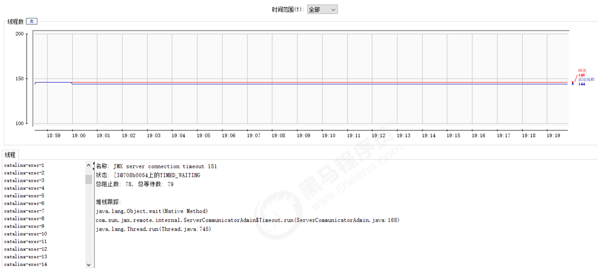

<font style="color:rgb(51,51,51);">Tomcat 服务器的配置主要集中于 tomcat/conf 下的 </font>`<font style="color:rgb(51,51,51);">catalina.policy</font>``<font style="color:rgb(51,51,51);">catalina.properties</font>``<font style="color:rgb(51,51,51);">context.xml</font>``<font style="color:rgb(51,51,51);">server.xml</font>``<font style="color:rgb(51,51,51);">tomcat-users.xml</font>``<font style="color:rgb(51,51,51);">web.xml</font>`<font style="color:rgb(51,51,51);">文件。 </font>

## <font style="color:rgb(51,51,51);">1 server.xml </font>
`<font style="color:rgb(51,51,51);">server.xml</font>`<font style="color:rgb(51,51,51);"> 是tomcat 服务器的核心配置文件，包含了Tomcat的 Servlet 容器（Catalina）的所有配置。由于配置的属性特别多，我们在这里主要讲解其中的一部分重要配置。 </font>

### <font style="color:rgb(51,51,51);">1.1 Server </font>
<font style="color:rgb(51,51,51);">Server是</font>`<font style="color:rgb(51,51,51);">server.xml</font>`<font style="color:rgb(51,51,51);">的根元素，用于创建一个Server实例，默认使用的实现类是</font>`<font style="color:rgb(51,51,51);">org.apache.catalina.core.StandardServer</font>`<font style="color:rgb(51,51,51);">。 </font>

```xml
<Server port="8005" shutdown="SHUTDOWN"> 
... 
</Server> 
```

**<font style="color:rgb(51,51,51);">port</font>**<font style="color:rgb(51,51,51);"> : Tomcat 监听的关闭服务器的端口。 </font>

**<font style="color:rgb(51,51,51);">shutdown</font>**<font style="color:rgb(51,51,51);">： 关闭服务器的指令字符串。 </font>

<font style="color:rgb(51,51,51);">Server内嵌的子元素为</font>`<font style="color:rgb(51,51,51);">Listener</font>``<font style="color:rgb(51,51,51);">GlobalNamingResources</font>``<font style="color:rgb(51,51,51);">Service</font>`<font style="color:rgb(51,51,51);">。 </font>

<font style="color:rgb(51,51,51);">默认配置的5个Listener 的含义： </font>

```xml
<!--用于以日志形式输出服务器 、操作系统、JVM的版本信息--> 
<Listener className="org.apache.catalina.startup.VersionLoggerListener"/> 

<!-- 用于加载（服务器启动） 和 销毁 （服务器停止） APR。 如果找不到APR库， 则会输出日志， 并不影响Tomcat启动 --> 
<Listener className="org.apache.catalina.core.AprLifecycleListener" SSLEngine="on" /> 

<!-- 用于避免JRE内存泄漏问题  -->
<Listener className="org.apache.catalina.core.JreMemoryLeakPreventionListener" /> 

<!-- 用户加载（服务器启动） 和 销毁（服务器停止） 全局命名服务 -->
<Listener className="org.apache.catalina.mbeans.GlobalResourcesLifecycleListener" /> 

<!-- 用于在Context停止时重建Executor 池中的线程， 以避免ThreadLocal 相关的内存泄漏  -->
<Listener className="org.apache.catalina.core.ThreadLocalLeakPreventionListener" /> 
```


<font style="color:rgb(51,51,51);">GlobalNamingResources </font><font style="color:rgb(51,51,51);">中定义了全局命名服务： </font>

```xml
<!‐‐ Global JNDI resources 
	Documentation at /docs/jndi‐resources‐howto.html 
‐‐> 
<GlobalNamingResources> 
    <!‐‐ Editable user database that can also be used by 
    	UserDatabaseRealm to authenticate users 
    ‐‐> 
    <Resource name="UserDatabase" auth="Container" 
        type="org.apache.catalina.UserDatabase" 
        description="User database that can be updated and saved" 
        factory="org.apache.catalina.users.MemoryUserDatabaseFactory" 
        pathname="conf/tomcat‐users.xml" /> 
</GlobalNamingResources> 
```

### <font style="color:rgb(51,51,51);">1.2 Service </font>
<font style="color:rgb(51,51,51);">该元素用于创建 Service 实例，默认使用</font>`<font style="color:rgb(51,51,51);">org.apache.catalina.core.StandardService</font>`<font style="color:rgb(51,51,51);">。 默认情况下，Tomcat 仅指定了Service 的名称， 值为</font>`<font style="color:rgb(51,51,51);">Catalina</font>`<font style="color:rgb(51,51,51);">。Service 可以内嵌的元素为 ： </font>`<font style="color:rgb(51,51,51);">Listener</font>``<font style="color:rgb(51,51,51);">Executor</font>``<font style="color:rgb(51,51,51);">Connector</font>``<font style="color:rgb(51,51,51);">Engine</font>`<font style="color:rgb(51,51,51);">，其中 ： Listener 用于为Service添加生命周期监听器， Executor 用于配置Service 共享线程池，Connector 用于配置Service 包含的链接器， Engine 用于配置Service中链接器对应的Servlet 容器引擎。 </font>

```xml
<Service name="Catalina"> 

</Service> 
```

<font style="color:rgb(51,51,51);">一个</font><font style="color:rgb(51,51,51);">Server</font><font style="color:rgb(51,51,51);">服务器，可以包含多个</font><font style="color:rgb(51,51,51);">Service</font><font style="color:rgb(51,51,51);">服务。 </font>

### <font style="color:rgb(51,51,51);">1.3 Executor </font>
<font style="color:rgb(51,51,51);">默认情况下，Service 并未添加共享线程池配置。 如果我们想添加一个线程池， 可以在下添加如下配置： </font>

```xml
<Executor name="tomcatThreadPool" 
    namePrefix="catalina‐exec‐" 
    maxThreads="200" 
    minSpareThreads="100" 
    maxIdleTime="60000" 
    maxQueueSize="Integer.MAX_VALUE" 
    prestartminSpareThreads="false" 
    threadPriority="5" 
    className="org.apache.catalina.core.StandardThreadExecutor"/> 
```

<font style="color:rgb(51,51,51);">属性说明： </font>

| <font style="color:rgb(51,51,51);">属性 </font> | <font style="color:rgb(51,51,51);">含义 </font> |
| --- | --- |
| <font style="color:rgb(51,51,51);">name</font> | <font style="color:rgb(51,51,51);">线程池名称，用于 Connector中指定。 </font> |
| <font style="color:rgb(51,51,51);">namePrefix </font> | <font style="color:rgb(51,51,51);">所创建的每个线程的名称前缀，一个单独的线程名称为namePrefix+threadNumber。 </font> |
| <font style="color:rgb(51,51,51);">maxThreads </font> | <font style="color:rgb(51,51,51);">池中最大线程数。 </font> |
| <font style="color:rgb(51,51,51);">minSpareThreads </font> | <font style="color:rgb(51,51,51);">活跃线程数，也就是核心池线程数，这些线程不会被销毁，会一直存在。 </font> |
| <font style="color:rgb(51,51,51);">maxIdleTime </font> | <font style="color:rgb(51,51,51);">线程空闲时间，超过该时间后，空闲线程会被销毁，默认值为6000（1分钟），单位毫秒。 </font> |
| <font style="color:rgb(51,51,51);">maxQueueSize </font> | <font style="color:rgb(51,51,51);">在被执行前最大线程排队数目，默认为Int的最大值，也 就是广义的无限。除非特殊情况，这个值不需要更改， 否则会有请求不会被处理的情况发生。 </font> |
| <font style="color:rgb(51,51,51);">prestartminSpareThreads </font> | <font style="color:rgb(51,51,51);">启动线程池时是否启动 minSpareThreads部分线程。 默认值为false，即不启动。 </font> |
| <font style="color:rgb(51,51,51);">threadPriority </font> | <font style="color:rgb(51,51,51);">线程池中线程优先级，默认值为5，值从1到10。 </font> |
| <font style="color:rgb(51,51,51);">className </font> | <font style="color:rgb(51,51,51);">线程池实现类，未指定情况下，默认实现类为</font>`<font style="color:rgb(51,51,51);">org.apache.catalina.core.StandardThreadExecutor</font>`<font style="color:rgb(51,51,51);">。 如果想使用自定义线程池首先需要实现</font>`<font style="color:rgb(51,51,51);">org.apache.catalina.Executor</font>`<font style="color:rgb(51,51,51);">接口。 </font> |




<font style="color:rgb(51,51,51);">如果不配置共享线程池，那么Catalina 各组件在用到线程池时会独立创建。 </font>

### <font style="color:rgb(51,51,51);">1.4 Connector </font>
<font style="color:rgb(51,51,51);">Connector 用于创建链接器实例。默认情况下，</font>`<font style="color:rgb(51,51,51);">server.xml</font>`<font style="color:rgb(51,51,51);"> 配置了两个链接器，一个支持HTTP协议，一个支持AJP协议。因此大多数情况下，我们并不需要新增链接器配置，只是根据需要对已有链接器进行优化。 </font>

```xml
<Connector port="8080" protocol="HTTP/1.1" connectionTimeout="20000" redirectPort="8443" /> 
<Connector port="8009" protocol="AJP/1.3" redirectPort="8443" /> 
```

<font style="color:rgb(51,51,51);">属性说明： </font>

1. <font style="color:rgb(51,51,51);"> port： 端口号，Connector 用于创建服务端Socket 并进行监听， 以等待客户端请求链接。如果该属性设置为0，Tomcat将会随机选择一个可用的端口号给当前Connector使用。 </font>
2. <font style="color:rgb(51,51,51);"> protocol ： 当前Connector 支持的访问协议。 默认为 HTTP/1.1 ， 并采用自动切换机制选择一个基于 JAVA NIO 的链接器或者基于本地APR的链接器（根据本地是否含有Tomcat的本地库判定）。 </font>

<font style="color:rgb(51,51,51);">如果不希望采用上述自动切换的机制， 而是明确指定协议， 可以使用以下值。 </font>

<font style="color:rgb(51,51,51);">Http</font><font style="color:rgb(51,51,51);">协议： </font>

```java
org.apache.coyote.http11.Http11NioProtocol  	 非阻塞式 Java NIO 链接器 
org.apache.coyote.http11.Http11Nio2Protocol      非阻塞式 JAVA NIO2 链接器 
org.apache.coyote.http11.Http11AprProtocol       APR 链接器 
```

<font style="color:rgb(51,51,51);">AJP协议 ： </font>

```java
org.apache.coyote.ajp.AjpNioProtocol 	非阻塞式 Java NIO 链接器 
org.apache.coyote.ajp.AjpNio2Protocol 	非阻塞式 JAVA NIO2 链接器 
org.apache.coyote.ajp.AjpAprProtocol 	APR 链接器 
```

3. <font style="color:rgb(51,51,51);"> connectionTimeOut : Connector 接收链接后的等待超时时间， 单位为 毫秒。 -1 表 示不超时。 </font>
4. <font style="color:rgb(51,51,51);"> redirectPort：当前Connector 不支持SSL请求， 接收到了一个请求， 并且也符合security-constraint 约束， 需要SSL传输，Catalina自动将请求重定向到指定的端口。 </font>
5. <font style="color:rgb(51,51,51);">executor ： 指定共享线程池的名称， 也可以通过maxThreads、minSpareThreads等属性配置内部线程池。 </font>
6. <font style="color:rgb(51,51,51);"> URIEncoding : 用于指定编码URI的字符编码， Tomcat8.x版本默认的编码为 UTF-8 , Tomcat7.x版本默认为ISO-8859-1。 </font>

<font style="color:rgb(51,51,51);">完整的配置如下： </font>

```xml
<Connector port="8080" 
    protocol="HTTP/1.1" 
    executor="tomcatThreadPool" 
    maxThreads="1000" 
    minSpareThreads="100" 
    acceptCount="1000" 
    maxConnections="1000" 
    connectionTimeout="20000" 
    compression="on" 
    compressionMinSize="2048" 
    disableUploadTimeout="true" 
    redirectPort="8443" 
    URIEncoding="UTF‐8" /> 
```

### <font style="color:rgb(51,51,51);">1.5 Engine </font>
<font style="color:rgb(51,51,51);">Engine 作为Servlet 引擎的顶级元素，内部可以嵌入： </font>`<font style="color:rgb(51,51,51);">Cluster</font>``<font style="color:rgb(51,51,51);">Listener</font>``<font style="color:rgb(51,51,51);">Realm</font>``<font style="color:rgb(51,51,51);"> Valve</font>`<font style="color:rgb(51,51,51);">和</font>`<font style="color:rgb(51,51,51);">Host</font>`<font style="color:rgb(51,51,51);">。 </font>

```xml
<Engine name="Catalina" defaultHost="localhost"> 

</Engine> 
```

<font style="color:rgb(51,51,51);">属性说明： </font>

1. <font style="color:rgb(51,51,51);">name： 用于指定Engine 的名称， 默认为Catalina 。该名称会影响一部分Tomcat的存储路径（如临时文件）。 </font>
2. <font style="color:rgb(51,51,51);">defaultHost ： 默认使用的虚拟主机名称， 当客户端请求指向的主机无效时， 将交由默认的虚拟主机处理， 默认为localhost。 </font>

### <font style="color:rgb(51,51,51);">1.6 Host </font>
<font style="color:rgb(51,51,51);">Host 元素用于配置一个虚拟主机， 它支持以下嵌入元素：</font>`<font style="color:rgb(51,51,51);">Alias</font>``<font style="color:rgb(51,51,51);">Cluster</font>``<font style="color:rgb(51,51,51);">Listener</font>``<font style="color:rgb(51,51,51);">Valve</font>``<font style="color:rgb(51,51,51);">Realm</font>``<font style="color:rgb(51,51,51);">Context</font>`<font style="color:rgb(51,51,51);">。如果在Engine下配置Realm， 那么此配置将在当前Engine下的所有Host中共享。 同样，如果在Host中配置Realm ， 则在当前Host下的所有Context 中共享。</font>`<font style="color:rgb(51,51,51);">Context中的Realm优先级</font>`<font style="color:rgb(51,51,51);"> > </font>`<font style="color:rgb(51,51,51);">Host 的Realm优先级</font>`<font style="color:rgb(51,51,51);"> > </font>`<font style="color:rgb(51,51,51);">Engine中的Realm优先 级</font>`<font style="color:rgb(51,51,51);">。 </font>

```xml
<Host name="localhost" appBase="webapps" unpackWARs="true" autoDeploy="true"> 
</Host> 
```

<font style="color:rgb(51,51,51);">属性说明： </font>

1. <font style="color:rgb(51,51,51);">name: 当前Host通用的网络名称， 必须与DNS服务器上的注册信息一致。 Engine中包含的Host必须存在一个名称与Engine的defaultHost设置一致。 </font>
2. <font style="color:rgb(51,51,51);">appBase： 当前Host的应用基础目录， 当前Host上部署的Web应用均在该目录下（可以是绝对目录，相对路径）。默认为webapps。 </font>
3. <font style="color:rgb(51,51,51);"> unpackWARs： 设置为true， Host在启动时会将appBase目录下war包解压为目录。设置为false， Host将直接从war文件启动。 </font>
4. <font style="color:rgb(51,51,51);"> autoDeploy： 控制tomcat是否在运行时定期检测并自动部署新增或变更的web应 用。 </font>


<font style="color:rgb(51,51,51);">通过给Host添加别名，我们可以实现同一个Host拥有多个网络名称，配置如下： </font>

```xml
<Host name="www.web1.com" appBase="webapps" unpackWARs="true" autoDeploy="true"> 
	<Alias>www.web2.com</Alias> 
</Host> 
```

<font style="color:rgb(51,51,51);">这个时候，我们就可以通过两个域名访问当前Host下的应用（需要确保DNS或hosts中添加了域名的映射配置）。 </font>

### <font style="color:rgb(51,51,51);">1.7 Context </font>
<font style="color:rgb(51,51,51);">Context </font><font style="color:rgb(51,51,51);">用于配置一个</font><font style="color:rgb(51,51,51);">Web</font><font style="color:rgb(51,51,51);">应用，默认的配置如下： </font>

```xml
<Context docBase="myApp" path="/myApp"> 
</Context> 
```

<font style="color:rgb(51,51,51);">属性描述： </font>

1. <font style="color:rgb(51,51,51);">docBase：Web应用目录或者War包的部署路径。可以是绝对路径，也可以是相对于Host appBase的相对路径。 </font>
2. <font style="color:rgb(51,51,51);">path：Web应用的Context 路径。如果我们Host名为localhost， 则该web应用访问的根路径为</font>`<font style="color:rgb(51,51,51);"></font><font style="color:rgb(65,131,196);">http://localhost:8080/myApp</font>`<font style="color:rgb(51,51,51);">。 </font>

<font style="color:rgb(51,51,51);">它支持的内嵌元素为</font>`<font style="color:rgb(51,51,51);">CookieProcessor</font>``<font style="color:rgb(51,51,51);">Loader</font>``<font style="color:rgb(51,51,51);">Manager</font>``<font style="color:rgb(51,51,51);">Realm</font>``<font style="color:rgb(51,51,51);">Resources</font>``<font style="color:rgb(51,51,51);">WatchedResource</font>``<font style="color:rgb(51,51,51);">JarScanner</font>`<font style="color:rgb(51,51,51);"></font>`<font style="color:rgb(51,51,51);">Valve</font>`<font style="color:rgb(51,51,51);">。 </font>

```xml
<Host name="www.tomcat.com" appBase="webapps" unpackWARs="true" autoDeploy="true"> 
    <Context docBase="D:\servlet_project03" path="/myApp"></Context> 
    <Valve className="org.apache.catalina.valves.AccessLogValve" 
        directory="logs" 
        prefix="localhost_access_log" suffix=".txt" 
        pattern="%h %l %u %t &quot;%r&quot; %s %b" />
</Host> 
```

## <font style="color:rgb(51,51,51);">2 tomcat-users.xml </font>
<font style="color:rgb(51,51,51);">该配置文件中，主要配置的是Tomcat的用户，角色等信息，用来控制Tomcat中manager， host-manager的访问权限。 </font>

