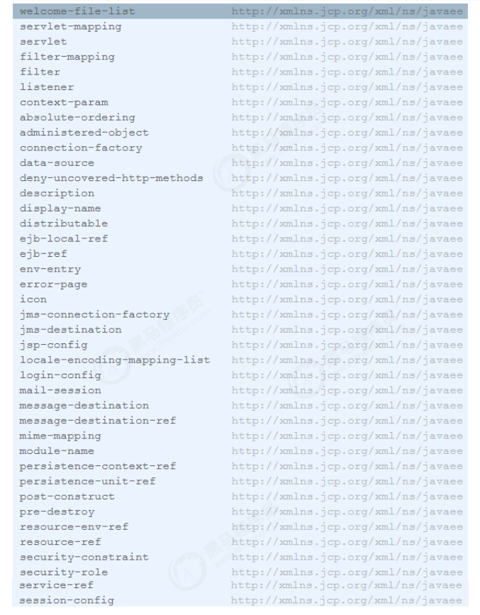

`<font style="color:rgb(51,51,51);">web.xml</font>`<font style="color:rgb(51,51,51);">是web应用的描述文件， 它支持的元素及属性来自于Servlet 规范定义 。 在Tomcat 中， Web 应用的描述信息包括 </font>`<font style="color:rgb(51,51,51);">tomcat/conf/web.xml</font>`<font style="color:rgb(51,51,51);"> 中默认配置 以及 Web应用 </font>`<font style="color:rgb(51,51,51);">WEB-INF/web.xml</font>`<font style="color:rgb(51,51,51);"> 下的定制配置。 </font>



## <font style="color:rgb(51,51,51);">1 ServletContext 初始化参数 </font>
<font style="color:rgb(51,51,51);">我们可以通过 添加ServletContext 初始化参数，它配置了一个键值对，这样我们可以在应用程序中使用 </font>`<font style="color:rgb(51,51,51);">javax.servlet.ServletContext.getInitParameter()</font>`<font style="color:rgb(51,51,51);">方法获取参数。 </font>

```xml
<context‐param> 
    <param‐name>contextConfigLocation</param‐name> 
    <param‐value>classpath:applicationContext‐*.xml</param‐value> 
    <description>Spring Config File Location</description> 
</context‐param> 
```

## <font style="color:rgb(51,51,51);">2 会话配置 </font>
<font style="color:rgb(51,51,51);">用于配置Web应用会话，包括 超时时间、Cookie配置以及会话追踪模式。它将覆盖</font>`<font style="color:rgb(51,51,51);">server.xml</font>`<font style="color:rgb(51,51,51);"> 和</font>`<font style="color:rgb(51,51,51);"> context.xml</font>`<font style="color:rgb(51,51,51);"> 中的配置。 </font>

```xml
<session‐config> 
    <session‐timeout>30</session‐timeout> 
    <cookie‐config> 
        <name>JESSIONID</name> 
        <domain>www.itcast.cn</domain> 
        <path>/</path> 
        <comment>Session Cookie</comment> 
        <http‐only>true</http‐only> 
        <secure>false</secure> 
        <max‐age>3600</max‐age> 
    </cookie‐config> 
    <tracking‐mode>COOKIE</tracking‐mode> 
</session‐config> 
```

<font style="color:rgb(51,51,51);">配置解析：</font>

+ <font style="color:rgb(51,51,51);"> session‐timeout ： 会话超时时间，单位 分钟 </font>
+ <font style="color:rgb(51,51,51);"> cookie‐config： 用于配置会话追踪Cookie </font>
    - <font style="color:rgb(51,51,51);">name：Cookie的名称 </font>
    - <font style="color:rgb(51,51,51);">domain：Cookie的域名 </font>
    - <font style="color:rgb(51,51,51);">path：Cookie的路径 </font>
    - <font style="color:rgb(51,51,51);">comment：注释 </font>
    - <font style="color:rgb(51,51,51);">http‐only：cookie只能通过HTTP方式进行访问，JS无法读取或修改，此项可以增加网站访问的安全性。 </font>
    - <font style="color:rgb(51,51,51);">secure：此cookie只能通过HTTPS连接传递到服务器，而HTTP 连接则不会传递该信息。注意是从浏览器传递到服务器，服务器端的Cookie对象不受此项影响。 </font>
    - <font style="color:rgb(51,51,51);">max‐age：以秒为单位表示cookie的生存期，默认为‐1表示是会话Cookie，浏览器关闭时就会消失。 </font>
+ <font style="color:rgb(51,51,51);">tracking‐mode ：用于配置会话追踪模式，Servlet3.0版本中支持的追踪模式：COOKIE、URL、SSL </font>
    - <font style="color:rgb(51,51,51);">COOKIE : 通过HTTP Cookie 追踪会话是最常用的会话追踪机制， 而且Servlet规范也要求所有的Servlet规范都需要支持Cookie追踪。 </font>
    - <font style="color:rgb(51,51,51);">URL : URL重写是最基本的会话追踪机制。当客户端不支持Cookie时，可以采用URL重写的方式。当采用URL追踪模式时，请求路径需要包含会话标识信息，Servlet容器会根据路径中的会话标识设置请求的会话信息。如： http：//www.myserver.com/user/index.html;jessionid=1234567890。 </font>
    - <font style="color:rgb(51,51,51);">SSL : 对于SSL请求， 通过SSL会话标识确定请求会话标识。 </font>

## <font style="color:rgb(51,51,51);">3 Servlet配置 </font>
<font style="color:rgb(51,51,51);">Servlet </font><font style="color:rgb(51,51,51);">的配置主要是两部分， </font><font style="color:rgb(51,51,51);">servlet </font><font style="color:rgb(51,51,51);">和 </font><font style="color:rgb(51,51,51);">servlet-mapping </font><font style="color:rgb(51,51,51);">： </font>

```xml
<servlet>
    <servlet‐name>myServlet</servlet‐name>
    <servlet‐class>cn.itcast.web.MyServlet</servlet‐class>
    <init‐param>
        <param‐name>fileName</param‐name>
        <param‐value>init.conf</param‐value>
    </init‐param>
    <load‐on‐startup>1</load‐on‐startup>
    <enabled>true</enabled>
</servlet>

<servlet‐mapping>
    <servlet‐name>myServlet</servlet‐name>
    <url‐pattern>*.do</url‐pattern>
    <url‐pattern>/myservet/*</url‐pattern>
</servlet‐mapping>
```

<font style="color:rgb(0,0,0);"></font>

<font style="color:rgb(51,51,51);">配置说明： </font>

1. <font style="color:rgb(51,51,51);">servlet‐name : 指定servlet的名称， 该属性在web.xml中唯一。 </font>
2. <font style="color:rgb(51,51,51);">servlet‐class : 用于指定servlet类名 </font>
3. <font style="color:rgb(51,51,51);">init‐param： 用于指定servlet的初始化参数， 在应用中可以通过HttpServlet.getInitParameter 获取。 </font>
4. <font style="color:rgb(51,51,51);"> load‐on‐startup： 用于控制在Web应用启动时，Servlet的加载顺序。 值小于0，web应用启动时，不加载该servlet, 第一次访问时加载。 </font>
5. <font style="color:rgb(51,51,51);">enabled： true ， false 。 若为false ，表示Servlet不处理任何请求。 </font>
6. <font style="color:rgb(51,51,51);">url‐pattern： 用于指定URL表达式，一个 servlet‐mapping可以同时配置多个 url‐pattern。 </font>


<font style="color:rgb(51,51,51);">Servlet </font><font style="color:rgb(51,51,51);">中文件上传配置： </font>

```xml
<servlet> 
    <servlet‐name>uploadServlet</servlet‐name> 
    <servlet‐class>cn.itcast.web.UploadServlet</servlet‐class> 
    <multipart‐config> 
        <location>C://path</location> 
        <max‐file‐size>10485760</max‐file‐size> 
        <max‐request‐size>10485760</max‐request‐size> 
        <file‐size‐threshold>0</file‐size‐threshold> 
    </multipart‐config> 
</servlet> 
```

<font style="color:rgb(0,0,0);"></font><font style="color:rgb(51,51,51);">配置说明： </font>

1. <font style="color:rgb(51,51,51);"> location：存放生成的文件地址。 </font>
2. <font style="color:rgb(51,51,51);"> max‐file‐size：允许上传的文件最大值。 默认值为‐1， 表示没有限制。 </font>
3. <font style="color:rgb(51,51,51);">max‐request‐size：针对该 multi/form‐data 请求的最大数量，默认值为‐1， 表示无限制。 </font>
4. <font style="color:rgb(51,51,51);"> file‐size‐threshold：当数量量大于该值时， 内容会被写入文件。 </font>

## <font style="color:rgb(51,51,51);">4 Listener配置 </font>
<font style="color:rgb(51,51,51);">Listener用于监听servlet中的事件，例如context、request、session对象的创建、修改、删除，并触发响应事件。Listener是观察者模式的实现，在servlet中主要用于对context、request、session对象的生命周期进行监控。在servlet2.5规范中共定义了8中Listener。在启动时，ServletContextListener 的执行顺序与web.xml 中的配置顺序一致， 停止时执行顺序相反。 </font>

```xml
<listener> 
    <listener‐class>org.springframework.web.context.ContextLoaderListener</listener‐class> 
</listener> 
```

## <font style="color:rgb(51,51,51);">5 Filter配置 </font>
<font style="color:rgb(51,51,51);">filter 用于配置web应用过滤器， 用来过滤资源请求及响应。 经常用于认证、日志、加密、数据转换等操作， 配置如下： </font>

```xml
<filter> 
    <filter‐name>myFilter</filter‐name> 
    <filter‐class>cn.itcast.web.MyFilter</filter‐class> 
    true</async‐supported> 
    <init‐param> 
        <param‐name>language</param‐name> 
        <param‐value>CN</param‐value> 
    </init‐param> 
</filter> 

<filter‐mapping> 
    <filter‐name>myFilter</filter‐name> 
    <url‐pattern>/*</url‐pattern> 
</filter‐mapping> 
```

<font style="color:rgb(51,51,51);">配置说明： </font>

1. <font style="color:rgb(51,51,51);">filter‐name： 用于指定过滤器名称，在web.xml中，过滤器名称必须唯一。 </font>
2. <font style="color:rgb(51,51,51);">filter‐class ： 过滤器的全限定类名， 该类必须实现Filter接口。 </font>
3. <font style="color:rgb(51,51,51);">async‐supported： 该过滤器是否支持异步 </font>
4. <font style="color:rgb(51,51,51);">init‐param ：用于配置Filter的初始化参数， 可以配置多个， 可以通过FilterConfig.getInitParameter获取 </font>
5. <font style="color:rgb(51,51,51);">url‐pattern： 指定该过滤器需要拦截的URL。 </font>

## <font style="color:rgb(51,51,51);">6 欢迎页面配置 </font>
<font style="color:rgb(51,51,51);">welcome-file-list </font><font style="color:rgb(51,51,51);">用于指定</font><font style="color:rgb(51,51,51);">web</font><font style="color:rgb(51,51,51);">应用的欢迎文件列表。 </font>

```xml
<welcome‐file‐list> 
    <welcome‐file>index.html</welcome‐file> 
    <welcome‐file>index.htm</welcome‐file> 
    <welcome‐file>index.jsp</welcome‐file> 
</welcome‐file‐list> 
```

<font style="color:rgb(0,0,0);"></font><font style="color:rgb(51,51,51);">尝试请求的顺序，从上到下。 </font>

## <font style="color:rgb(51,51,51);">7 错误页面配置 </font>
<font style="color:rgb(51,51,51);">error-page 用于配置Web应用访问异常时定向到的页面，支持HTTP响应码和异常类两种形式。 </font>

```xml
<error‐page> 
    <error‐code>404</error‐code> 
    <location>/404.html</location> 
</error‐page> 

<error‐page> 
    <error‐code>500</error‐code> 
    <location>/500.html</location> 
</error‐page> 

<error‐page> 
    <exception‐type>java.lang.Exception</exception‐type> 
    <location>/error.jsp</location> 
</error‐page> 
```

