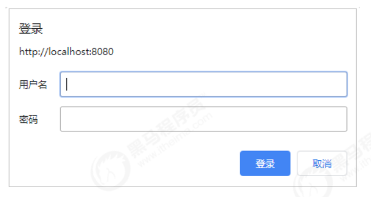
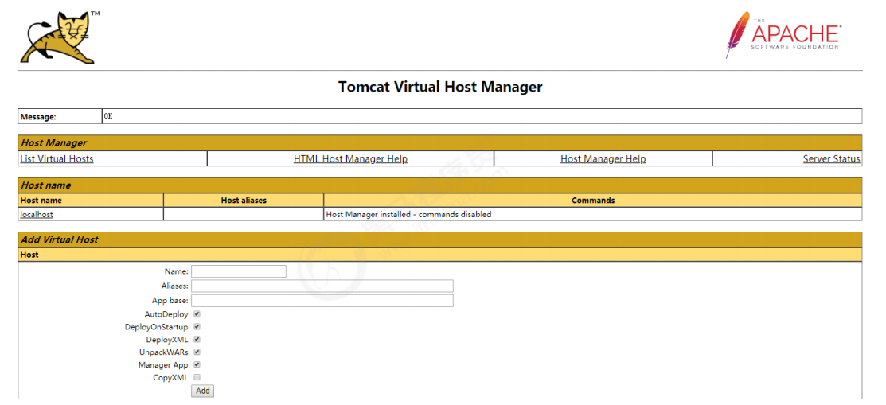
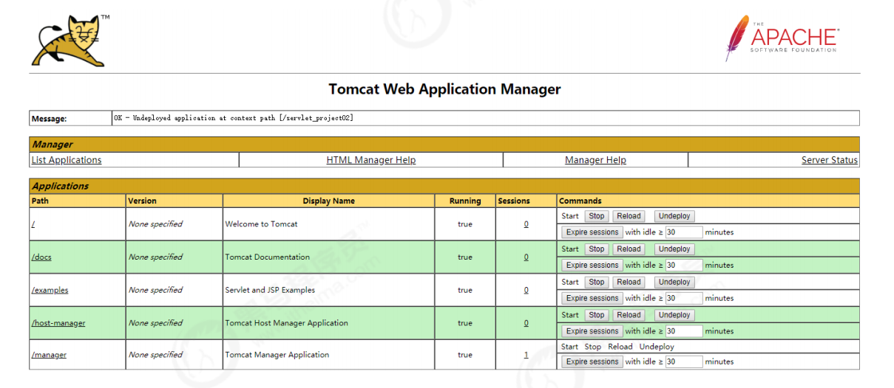
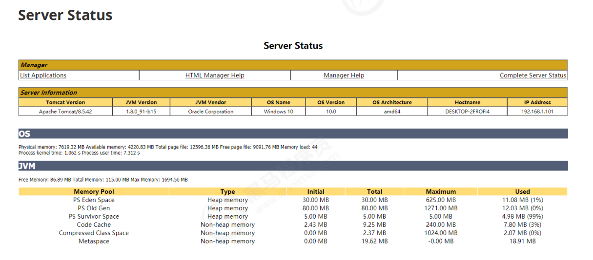
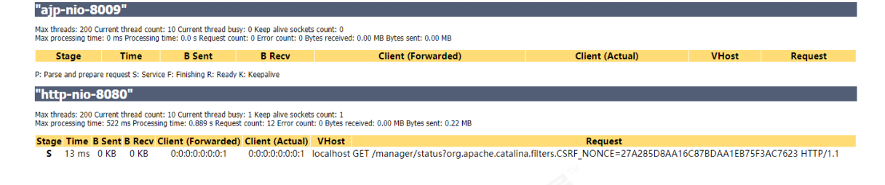
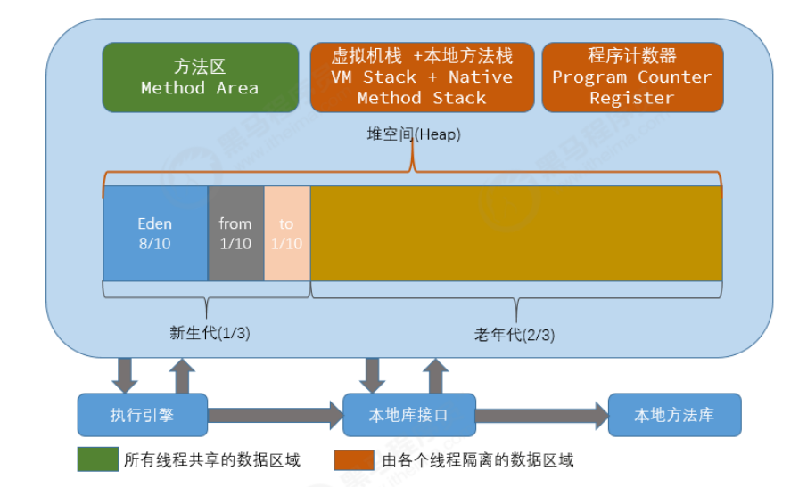
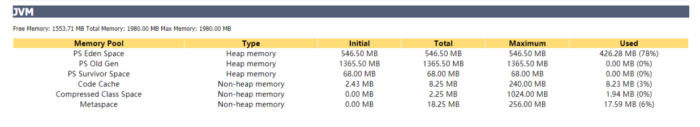

# 12. <font style="color:rgb(51,51,51);">1 Tomcat 管理配置 </font>
<font style="color:rgb(51,51,51);">从早期的Tomcat版本开始，就提供了Web版的管理控制台，他们是两个独立的Web应用，位于webapps目录下。Tomcat 提供的管理应用有用于管理的Host的host-manager和用于管理Web应用的manager。 </font>

## <font style="color:rgb(51,51,51);">1.1 host-manager </font>
<font style="color:rgb(51,51,51);">Tomcat启动之后，可以通过</font>`<font style="color:rgb(65,131,196);">http://localhost:8080/host-manager/html</font>`<font style="color:rgb(65,131,196);"> </font><font style="color:rgb(51,51,51);">访问该Web应用。 host-manager 默认添加了访问权限控制，当打开网址时，需要输入用户名和密码（</font>`<font style="color:rgb(51,51,51);">conf/tomcat-users.xml</font>`<font style="color:rgb(51,51,51);">中配置） 。所以要想访问该页面，需要在</font>`<font style="color:rgb(51,51,51);">conf/tomcat-users.xml</font>`<font style="color:rgb(51,51,51);">中配置，并分配对应的角色： </font>

1. <font style="color:rgb(51,51,51);">admin-gui：用于控制页面访问权限 </font>
2. <font style="color:rgb(51,51,51);">admin-script：用于控制以简单文本的形式进行访问 </font>

<font style="color:rgb(51,51,51);">配置如下： </font>

```xml
<role rolename="admin‐gui"/> 
<role rolename="admin‐script"/> 
<user username="itcast" password="itcast" roles="admin‐script,admin‐gui"/> 
```

<font style="color:rgb(51,51,51);">登录： </font>



<font style="color:rgb(51,51,51);">界面： </font>



## <font style="color:rgb(51,51,51);">1.2 manager </font>
<font style="color:rgb(51,51,51);">manager的访问地址为</font>`<font style="color:rgb(65,131,196);">http://localhost:8080/manager</font>`<font style="color:rgb(51,51,51);">， 同样manager也添加了页面访问控制，因此我们需要为登录用户分配角色为： </font>

```xml
<role rolename="manager‐gui"/> 
<role rolename="manager‐script"/> 
<user username="itcast" password="itcast" roles="admin‐script,admin‐gui,manager‐gui,manager‐script"/> 
```


<font style="color:rgb(51,51,51);">界面： </font>



**<font style="color:rgb(51,51,51);">Server Status </font>**





# 13. <font style="color:rgb(51,51,51);">2 JVM 配置 </font>
<font style="color:rgb(51,51,51);">最常见的JVM配置当属内存分配，因为在绝大多数情况下，JVM默认分配的内存可能不能够满足我们的需求，特别是在生产环境，此时需要手动修改Tomcat启动时的内存参数分配。 </font>

## <font style="color:rgb(51,51,51);">2.1 JVM内存模型图 </font>


**<font style="color:rgb(51,51,51);">7.2 JVM</font>**<font style="color:rgb(51,51,51);">配置选项 </font>

<font style="color:rgb(51,51,51);">windows </font><font style="color:rgb(51,51,51);">平台</font><font style="color:rgb(51,51,51);">(catalina.bat)</font><font style="color:rgb(51,51,51);">： </font>

```xml
set JAVA_OPTS=‐server ‐Xms2048m ‐Xmx2048m ‐XX:MetaspaceSize=256m ‐XX:MaxMetaspaceSize=256m ‐XX:SurvivorRatio=8 
```


<font style="color:rgb(51,51,51);">linux </font><font style="color:rgb(51,51,51);">平台</font><font style="color:rgb(51,51,51);">(catalina.sh)</font><font style="color:rgb(51,51,51);">： </font>

```xml
JAVA_OPTS="‐server ‐Xms1024m ‐Xmx2048m ‐XX:MetaspaceSize=256m ‐XX:MaxMetaspaceSize=512m ‐XX:SurvivorRatio=8" 
```


<font style="color:rgb(51,51,51);">参数说明 </font>

| 参数 |  含义 |
| --- | --- |
| -Xms |  堆内存的初始大小 |
|  -Xmx | 堆内存的最大大小 |
| -Xmn | 新生代的内存大小，官方建议是整个堆得3/8。 |
| -XX:MetaspaceSize | 元空间内存初始大小， 在JDK1.8版本之前配置为 -XX:PermSize（永久代） |
| -XX:MaxMetaspaceSize | 元空间内存最大大小， 在JDK1.8版本之前配置为 -XX:MaxPermSize（永久代） |
| -XX:InitialCodeCacheSize-XX:ReservedCodeCacheSize | 代码缓存区大小 |
|  -XX:NewRatio | 设置新生代和老年代的相对大小比例。这种方式的优点是新生代大小会随着整个堆大小动态扩展。如 -XX:NewRatio=3 指定老年代 / 新生代为 3/1。 老年代占堆大小的 3/4，新生代占 1/4 。 |
| -XX:SurvivorRatio | 指定伊甸园区 (Eden) 与幸存区大小比例。如-XX:SurvivorRatio=10 表示伊甸园区 (Eden)是 幸存区 To 大小的 10 倍 (也是幸存区 From的 10 倍)。 所以， 伊甸园区 (Eden) 占新生代大小的 10/12， 幸存区 From 和幸存区 To 每个占新生代的 1/12 。 注意， 两个幸存区永远是一样大的。 |


配置之后, 重新启动Tomcat ,访问 :



