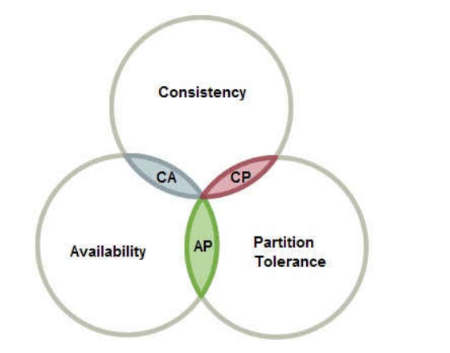
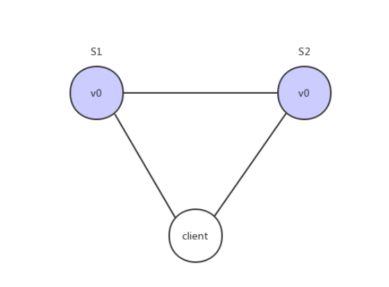
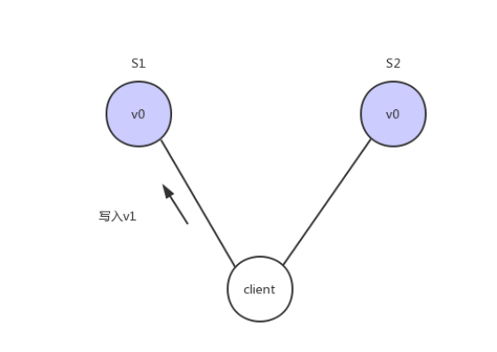
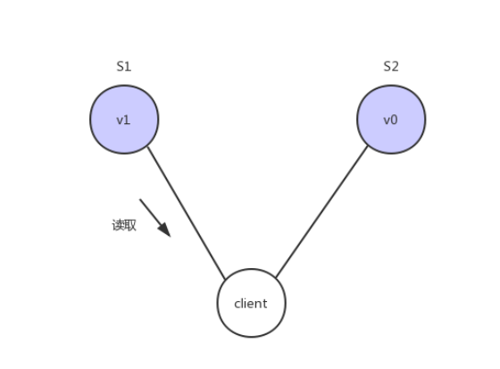
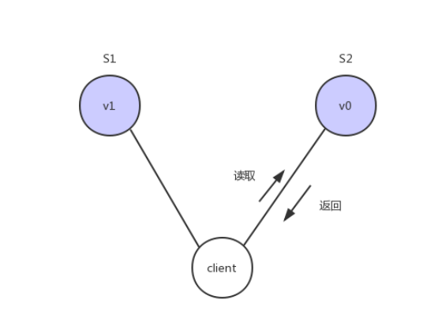
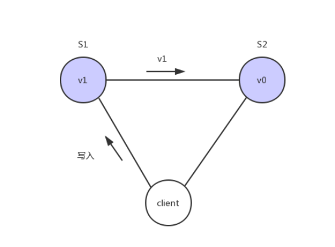
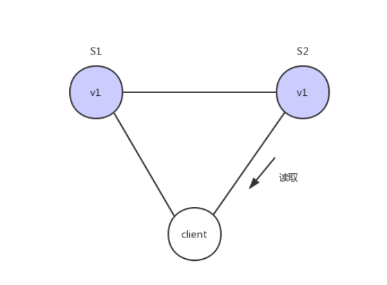

# 1 CAP定理介绍
`**含义**`：1998年，加州大学的计算机科学家 Eric Brewer 提出，分布式系统有三个指标。

+ Consistency：一致性
+ Availability：可用性
+ Partition tolerance：分区容错性

他们第一个字母分别是C A P  
Eric Brewer 说，这三个指标不可能同时做到。这个结论就叫做 CAP 定理，如下图：  

# 2 Partition tolerance
中文叫做"分区容错"。  
大多数分布式系统都分布在多个子网络。每个子网络就叫做一个区（partition）。分区容错的意思是，区间通信可能失败。比如，一台服务器放在本地，另一台服务器放在外地（可能是外省，甚至是外国），这就是两个区，它们之间可能无法通信。  
  
上图中，S1 和 S2 是两台跨区的服务器。S1 向 S2 发送一条消息，S2 可能无法收到。系统设计的时候，必须考虑到这种情况。  
一般来说，分区容错无法避免，因此可以认为 CAP 的 P 总是成立。CAP 定理告诉我们，剩下的 C 和 A 无法同时做到。

# 3 Consistency
Consistency 中文叫做"一致性"。意思是，写操作之后的读操作，必须返回该值。举例来说，某条记录是 v0，用户向 S1 发起一个写操作，将其改为 v1。  
  
接下来用户读操作就会得到v1。这就叫一致性。  
  
问题是，用户有可能会向S2发起读取操作，由于S2的值没有发生变化，因此返回的是v0，所以S1和S2的读操作不一致，这就不满足一致性了  
  
为了让S2的返回值与S1一致，所以我们需要在往S1执行写操作的时候，让S1给S2也发送一条消息，要求S2也变成v1  
  
这样子用户向S2发起读操作，就也能得到v1  

# 4 Availability
Availability 中文叫做"可用性"，意思是只要收到用户的请求，服务器就必须给出回应。  
用户可以选择向 S1 或 S2 发起读操作。不管是哪台服务器，只要收到请求，就必须告诉用户，到底是 v0 还是 v1，否则就不满足可用性。

**Consistency 和 Availability 的矛盾**  
一致性和可用性，为什么不可能同时成立？答案很简单，因为可能通信失败（即出现分区容错）。  
如果保证 S2 的一致性，那么 S1 必须在写操作时，锁定 S2 的读操作和写操作。只有数据同步后，才能重新开放读写。锁定期间，S2 不能读写，没有可用性。  
如果保证 S2 的可用性，那么势必不能锁定 S2，所以一致性不成立。  
综上所述，S2 无法同时做到一致性和可用性。系统设计时只能选择一个目标。如果追求一致性，那么无法保证所有节点的可用性；如果追求所有节点的可用性，那就没法做到一致性。

# 5 eureka对比Zookeeper
Zookeeper在设计的时候遵循的是CP原则，即一致性，Zookeeper会出现这样一种情况，当master节点因为网络故障与其他节点失去联系时剩余节点会重新进行leader选举，问题在于，选举leader的时间太长：30~120s，且选举期间整个Zookeeper集群是不可用的，这就导致在选举期间注册服务处于瘫痪状态，在云部署的环境下，因网络环境使Zookeeper集群失去master节点是较大概率发生的事情，虽然服务能够最终恢复，但是漫长的选举时间导致长期的服务注册不可用是不能容忍的。

Eureka在设计的时候遵循的是AP原则，即可用性。Eureka各个节点（服务)是平等的， 没有主从之分，几个节点down掉不会影响正常工作，剩余的节点（服务） 依然可以提供注册与查询服务，而Eureka的客户端在向某个Eureka注册或发现连接失败，则会自动切换到其他节点，也就是说，只要有一台Eureka还在，就能注册可用（保证可用性）， 只不过查询到的信息不是最新的（不保证强一致），除此之外，Eureka还有自我保护机制，如果在15分钟内超过85%节点都没有正常心跳，那么eureka就认为客户端与注册中心出现了网络故障，此时会出现一下情况:

1. Eureka 不再从注册列表中移除因为长时间没有收到心跳而过期的服务。
2. Eureka 仍然能够接收新服务的注册和查询请求，但是不会被同步到其它节点上（即保证当前节点可用）
3. 当网络稳定后，当前实例新的注册信息会被同步到其它节点中

