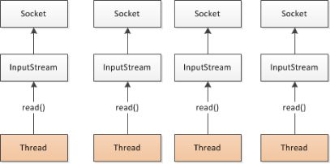

# 1 分布式基础理论
## 1.1 什么是分布式系统？
《分布式系统原理与范型》定义：  
“分布式系统是若干独立计算机的集合，这些计算机对于用户来说就像单个相关系统”  
分布式系统（distributed system）是建立在网络之上的软件系统。


随着互联网的发展，网站应用的规模不断扩大，常规的垂直应用架构已无法应对，分布式服务架构以及流动计算架构势在必行，需要一个治理系统确保架构有条不紊的演进。


## 1.2 发展演变
### 1.2.1 单一应用架构
当网站流量很小时，只需一个应用，将所有功能都部署在一起，以减少部署节点和成本。此时，用于简化增删改查工作量的数据访问框架(ORM)是关键。  


适用于小型网站，小型管理系统，将所有功能都部署到一个功能里，简单易用。  
缺点：


+ 性能扩展比较难
+ 协同开发问题
+ 不利于升级维护

### 1.2.2 垂直应用架构
当访问量逐渐增大，单一应用增加机器带来的加速度越来越小，将应用拆成互不相干的几个应用，以提升效率。此时，用于加速前端页面开发的Web框架(MVC)是关键。  


通过切分业务来实现各个模块独立部署，降低了维护和部署的难度，团队各司其职更易管理，性能扩展也更方便，更有针对性。  
缺点： 公用模块无法重复利用，开发性的浪费

### 1.2.3 分布式服务架构
当垂直应用越来越多，应用之间交互不可避免，将核心业务抽取出来，作为独立的服务，逐渐形成稳定的服务中心，使前端应用能更快速的响应多变的市场需求。此时，用于提高业务复用及整合的分布式服务框架(RPC)是关键。  


### 1.2.4 流动计算架构
当服务越来越多，容量的评估，小服务资源的浪费等问题逐渐显现，此时需增加一个调度中心基于访问压力实时管理集群容量，提高集群利用率。此时，用于提高机器利用率的资源调度和治理中心(SOA)[ Service Oriented Architecture]是关键。  


## 1.3 RPC
### 1.3.1 什么叫RPC
RPC【Remote Procedure Call】是指远程过程调用，是一种进程间通信方式，他是一种技术的思想，而不是规范。它允许程序调用另一个地址空间（通常是共享网络的另一台机器上）的过程或函数，而不用程序员显式编码这个远程调用的细节。即程序员无论是调用本地的还是远程的函数，本质上编写的调用代码基本相同。

### 1.3.2 RPC基本原理
  
  


RPC两个核心模块：通讯，序列化。

# 2 dubbo核心概念
## 2.1 简介
Apache Dubbo (incubating) |ˈdʌbəʊ| 是一款高性能、轻量级的开源Java RPC框架，它提供了三大核心能力：面向接口的远程方法调用，智能容错和负载均衡，以及服务自动注册和发现。  
官网：[http://dubbo.apache.org/](http://dubbo.apache.org/)

## 2.2 基本概念


`**<font style="color:#000000;">服务提供者（Provider）</font>**`<font style="color:#000000;">：暴露服务的服务提供方，服务提供者在启动时，向注册中心注册自己提供的服务。  
</font>`**<font style="color:#000000;">服务消费者（Consumer）</font>**`: 调用远程服务的服务消费方，服务消费者在启动时，向注册中心订阅自己所需的服务，服务消费者，从提供者地址列表中，基于软负载均衡算法，选一台提供者进行调用，如果调用失败，再选另一台调用。  
`**<font style="color:#000000;">注册中心（Registry）</font>**`：注册中心返回服务提供者地址列表给消费者，如果有变更，注册中心将基于长连接推送变更数据给消费者  
`**<font style="color:#000000;">监控中心（Monitor）</font>**`：服务消费者和提供者，在内存中累计调用次数和调用时间，定时每分钟发送一次统计数据到监控中心


**<font style="color:#E8323C;">调用关系说明</font>**

+ 服务容器负责启动，加载，运行服务提供者。
+ 服务提供者在启动时，向注册中心注册自己提供的服务。
+ 服务消费者在启动时，向注册中心订阅自己所需的服务。
+ 注册中心返回服务提供者地址列表给消费者，如果有变更，注册中心将基于长连接推送变更数据给消费者。
+ 服务消费者，从提供者地址列表中，基于软负载均衡算法，选一台提供者进行调用，如果调用失败，再选另一台调用。
+ 服务消费者和提供者，在内存中累计调用次数和调用时间，定时每分钟发送一次统计数据到监控中心。


# 3.dubbo环境搭建
## 3.1 windows版本
### 3.1.1 安装zookeeper


① 下载zookeeper  
网址 [https://archive.apache.org/dist/zookeeper/zookeeper-3.4.13/](https://archive.apache.org/dist/zookeeper/zookeeper-3.4.13/)

② 解压zookeeper  
解压运行zkServer.cmd ，初次运行会报错，没有zoo.cfg配置文件

③ 修改zoo.cfg配置文件  
将conf下的zoo_sample.cfg复制一份改名为zoo.cfg即可，注意几个重要位置：

```java
dataDir=./    		//临时数据存储的目录（可写相对路径）
clientPort=2181     //zookeeper的端口号
```

修改完成后再次启动zookeeper  


④ 使用zkCli.cmd测试

```bash
ls /; 												#列出zookeeper根下保存的所有节点
create –e /atguigu 123; 			# 创建一个atguigu节点，值为123
get /atguigu; 								#获取/atguigu节点的值
```


### 3.1.2 安装管理控制台
其实就是安装 **<font style="color:#F5222D;">dubbo-admin</font>**

dubbo本身并不是一个服务软件。它其实就是一个jar包能够帮你的java程序连接到zookeeper，并利用zookeeper消费、提供服务。所以你不用在Linux上启动什么dubbo服务。  
但是为了让用户更好的管理监控众多的dubbo服务，官方提供了一个可视化的监控程序，不过这个监控即使不装也不影响使用。  
① 下载dubbo-admin  
[https://github.com/apache/incubator-dubbo-ops](https://github.com/apache/incubator-dubbo-ops)


② 进入目录，修改dubbo-admin配置  
修改 src\main\resources\application.properties 指定zookeeper地址


③打包dubbo-admin

```java
mvn clean package -Dmaven.test.skip=true
```

  
④ 运行dubbo-admin

```java
java -jar dubbo-admin-0.0.1-SNAPSHOT.jar
```

  
**注意**：【有可能控制台看着启动了，但是网页打不开，需要在控制台按下ctrl+c即可】  
默认使用`<font style="color:#F5222D;">root/root</font>` 登陆  


## 3.2 linux版本
### 3.2.1 安装zookeeper
参考zookeeper博客园笔记：  
[https://www.cnblogs.com/chen-guang/p/16063044.html](https://www.cnblogs.com/chen-guang/p/16063044.html)

### 3.2.2 安装管理控制台
其实就是安装dubbo-admin，旧版dubbo-admin是war，新版是jar不需要安装Tomcat

#### 3.2.2.1 安装Tomcat8
① 下载Tomcat8并解压  
[https://tomcat.apache.org/download-80.cgi](https://tomcat.apache.org/download-80.cgi)  
wget [http://mirrors.shu.edu.cn/apache/tomcat/tomcat-8/v8.5.32/bin/apache-tomcat-8.5.32.tar.gz](http://mirrors.shu.edu.cn/apache/tomcat/tomcat-8/v8.5.32/bin/apache-tomcat-8.5.32.tar.gz)  


② 解压移动到指定位置


③ 开机启动tomcat8

复制如下脚本

```bash
#!/bin/bash
#chkconfig:2345 21 90
#description:apache-tomcat-8
#processname:apache-tomcat-8
CATALANA_HOME=/opt/apache-tomcat-8.5.32
export JAVA_HOME=/opt/java/jdk1.8.0_171
case $1 in
start)
    echo "Starting Tomcat..."  
    $CATALANA_HOME/bin/startup.sh
    ;;

stop)
    echo "Stopping Tomcat..."  
    $CATALANA_HOME/bin/shutdown.sh
    ;;

restart)
    echo "Stopping Tomcat..."  
    $CATALANA_HOME/bin/shutdown.sh
    sleep 2
    echo  
    echo "Starting Tomcat..."  
    $CATALANA_HOME/bin/startup.sh
    ;;
*)
    echo "Usage: tomcat {start|stop|restart}"  
    ;; esac
```


④ 注册服务&添加权限

⑤ 启动服务&访问tomcat测试


#### 3.2.2.2 安装dubbo-admin
dubbo本身并不是一个服务软件。它其实就是一个jar包能够帮你的java程序连接到zookeeper，并利用zookeeper消费、提供服务。所以你不用在Linux上启动什么dubbo服务。  
但是为了让用户更好的管理监控众多的dubbo服务，官方提供了一个可视化的监控程序，不过这个监控即使不装也不影响使用。  
① 下载dubbo-admin  
[https://github.com/apache/incubator-dubbo-ops](https://github.com/apache/incubator-dubbo-ops)


② 进入目录，修改dubbo-admin配置  
修改 src\main\resources\application.properties 指定zookeeper地址


③ 打包dubbo-admin

```java
mvn clean package -Dmaven.test.skip=true
```

  
④ 运行dubbo-admin

```java
java -jar dubbo-admin-0.0.1-SNAPSHOT.jar
```

  
默认使用`root/root` 登陆


# 4 dubbo-helloworld
## 4.1 提出需求
某个电商系统，订单服务需要调用用户服务获取某个用户的所有地址；  
我们现在需要创建两个服务模块进行测试

| 模块 | 功能 |
| --- | --- |
| 订单服务web模块 | 创建订单等 |
| 用户服务service模块 | 查询用户地址等 |


测试预期结果：订单服务web模块在A服务器，用户服务模块在B服务器，A可以远程调用B的功能。

## 4.2 工程架构
根据 dubbo《服务化最佳实践》

`**<font style="color:#000000;">分包</font>**`  
建议将服务接口，服务模型，服务异常等均放在 API 包中，因为服务模型及异常也是 API 的一部分，同时，这样做也符合分包原则：重用发布等价原则(REP)，共同重用原则(CRP)。  
如果需要，也可以考虑在 API 包中放置一份 spring 的引用配置，这样使用方，只需在 spring 加载过程中引用此配置即可，配置建议放在模块的包目录下，以免冲突，如：com/alibaba/china/xxx/dubbo-reference.xml。


`**<font style="color:#000000;">粒度</font>**`  
服务接口尽可能大粒度，每个服务方法应代表一个功能，而不是某功能的一个步骤，否则将面临分布式事务问题，Dubbo 暂未提供分布式事务支持。  
服务接口建议以业务场景为单位划分，并对相近业务做抽象，防止接口数量爆炸。  
不建议使用过于抽象的通用接口，如：Map query(Map)，这样的接口没有明确语义，会给后期维护带来不便。  


## 4.3 创建模块
### 4.3.1 gmall-interface
公共接口层（model，service，exception…）  
作用：定义公共接口，也可以导入公共依赖


① Bean模型

```java
public class UserAddress implements Serializable{
    private Integer id;
    private String userAddress;
    private String userId;
    private String consignee;
    private String phoneNum;
    private String isDefault;
}
```


②Service接口

UserService

```java
public List<UserAddress> getUserAddressList(String userId)
```


### 4.3.2 gmall-user
用户模块（对用户接口的实现）

① pom.xml

```xml
  <dependencies>
  	<dependency>
  		<groupId>com.atguigu.dubbo</groupId>
  		gmall-interface</artifactId>
  		<version>0.0.1-SNAPSHOT</version>
  	</dependency>
  </dependencies>
```


② Service

```java
public class UserServiceImpl implements UserService {
		
	@Override
	public List<UserAddress> getUserAddressList(String userId) {
		// TODO Auto-generated method stub
		return userAddressDao.getUserAddressById(userId);
	}

}
```


### 4.3.3 gmall-order-web：
订单模块（调用用户模块）

① pom.xml

```xml
<dependencies>
  	<dependency>
  		<groupId>com.atguigu.dubbo</groupId>
  		gmall-interface</artifactId>
  		<version>0.0.1-SNAPSHOT</version>
  	</dependency>
   </dependencies>
```


② 测试

```java
public class OrderService {
	
	UserService userService;
	
	/**
	 * 初始化订单，查询用户的所有地址并返回
	 * @param userId
	 * @return
	 */
	public List<UserAddress> initOrder(String userId){
		return userService.getUserAddressList(userId);
	}

}
```

现在这样是无法进行调用的。我们gmall-order-web引入了gmall-interface，但是interface的实现是gmall-user，我们并没有引入，而且实际他可能还在别的服务器中。


## 4.4 使用dubbo改造
### 4.4.1 gmall-user
① 引入dubbo

```xml
		<!-- 引入dubbo -->
		<dependency>
			<groupId>com.alibaba</groupId>
			dubbo</artifactId>
			<version>2.6.2</version>
		</dependency>

	<!-- 由于我们使用zookeeper作为注册中心，所以需要操作zookeeper
			 dubbo 2.6以前的版本引入zkclient操作zookeeper 
			 dubbo 2.6及以后的版本引入curator操作zookeeper
			下面两个zk客户端根据dubbo版本2选1即可
	-->
		<dependency>
			<groupId>com.101tec</groupId>
			zkclient</artifactId>
			<version>0.10</version>
		</dependency>
		<!-- curator-framework -->
		<dependency>
			<groupId>org.apache.curator</groupId>
			curator-framework</artifactId>
			<version>2.12.0</version>
		</dependency>
```


② 配置提供者

```xml
<!--当前应用的名字  -->
<dubbo:application name="gmall-user"></dubbo:application>
	
<!--指定注册中心的地址  -->
<dubbo:registry address="zookeeper://118.24.44.169:2181" />
    
<!--使用dubbo协议，将服务暴露在20880端口  -->
<dubbo:protocol name="dubbo" port="20880" />
    
<!-- 指定需要暴露的服务 -->
<dubbo:service interface="com.atguigu.gmall.service.UserService" ref="userServiceImpl" />
```


③ 启动服务

```java
	public static void main(String[] args) throws IOException {
		ClassPathXmlApplicationContext context = 
				new ClassPathXmlApplicationContext("classpath:spring-beans.xml");
		
		System.in.read(); 
	}
```


### 4.4.2 gmall-order-web
① 引入dubbo

```xml
		<!-- 引入dubbo -->
		<dependency>
			<groupId>com.alibaba</groupId>
			dubbo</artifactId>
			<version>2.6.2</version>
		</dependency>

	<!-- 由于我们使用zookeeper作为注册中心，所以需要引入zkclient和curator操作zookeeper -->
		<dependency>
			<groupId>com.101tec</groupId>
			zkclient</artifactId>
			<version>0.10</version>
		</dependency>
		<!-- curator-framework -->
		<dependency>
			<groupId>org.apache.curator</groupId>
			curator-framework</artifactId>
			<version>2.12.0</version>
		</dependency>
```


② 配置消费者信息

```xml
<!-- 应用名 -->
<dubbo:application name="gmall-order-web"></dubbo:application>

<!-- 指定注册中心地址 -->
<dubbo:registry address="zookeeper://118.24.44.169:2181" />

<!-- 生成远程服务代理，可以和本地bean一样使用demoService -->
<dubbo:reference id="userService" interface="com.atguigu.gmall.service.UserService"></dubbo:reference>
```


### 4.4.3 测试调用
访问gmall-order-web的initOrder请求，会调用UserService获取用户地址；  
调用成功。说明我们order已经可以调用远程的UserService了；

### 4.4.4 注解版
① 服务提供方

```xml
<dubbo:application name="gmall-user"></dubbo:application>
<dubbo:registry address="zookeeper://118.24.44.169:2181" />
<dubbo:protocol name="dubbo" port="20880" />
<dubbo:annotation package="com.atguigu.gmall.user.impl"/>
```

```java
import com.alibaba.dubbo.config.annotation.Service;
import com.atguigu.gmall.bean.UserAddress;
import com.atguigu.gmall.service.UserService;
import com.atguigu.gmall.user.mapper.UserAddressMapper;

@Service //使用dubbo提供的service注解，注册暴露服务
public class UserServiceImpl implements UserService {

	@Autowired
	UserAddressMapper userAddressMapper;
```


② 服务消费方

```xml
<dubbo:application name="gmall-order-web"></dubbo:application>
<dubbo:registry address="zookeeper://118.24.44.169:2181" />
<dubbo:annotation package="com.atguigu.gmall.order.controller"/>
```

```java
@Controller
public class OrderController {
	
	@Reference  //使用dubbo提供的reference注解引用远程服务
	UserService userService;
```


# 5 监控中心
## 5.1 dubbo-admin
图形化的服务管理页面；安装时需要指定注册中心地址，即可从注册中心中获取到所有的提供者/消费者进行配置管理

## 5.2 dubbo-monitor-simple
简单的监控中心；

### 5.2.1 安装


① 下载 dubbo-ops  
[https://github.com/apache/incubator-dubbo-ops](https://github.com/apache/incubator-dubbo-ops)

  
② 修改配置指定注册中心地址  
进入 dubbo-monitor-simple\src\main\resources\conf  
修改 dubbo.properties文件


③ 打包dubbo-monitor-simple

```java
mvn clean package -Dmaven.test.skip=true
```

  
④ 解压 tar.gz 文件，并运行start.bat

如果缺少servlet-api，自行导入servlet-api再访问监控中心  


⑤ 启动访问8080


### 5.2.2 监控中心配置
所有服务配置连接监控中心，进行监控统计

```xml
<!-- 监控中心协议，如果为protocol="registry"，表示从注册中心发现监控中心地址，否则直连监控中心 -->
<dubbo:monitor protocol="registry"></dubbo:monitor>
```

Simple Monitor 挂掉不会影响到 Consumer 和 Provider 之间的调用，所以用于生产环境不会有风险。  
Simple Monitor 采用磁盘存储统计信息，请注意安装机器的磁盘限制，如果要集群，建议用mount共享磁盘。


# 6 整合SpringBoot
① 引入spring-boot-starter以及dubbo和curator的依赖

```xml
<dependency>
    <groupId>com.alibaba.boot</groupId>
    dubbo-spring-boot-starter</artifactId>
    <version>0.2.0</version>
</dependency>
```

注意starter版本适配


② 配置application.properties

**提供者配置**

```properties
dubbo.application.name=gmall-user
dubbo.registry.protocol=zookeeper
dubbo.registry.address=192.168.67.159:2181
dubbo.scan.base-package=com.atguigu.gmall
dubbo.protocol.name=dubbo
#application.name就是服务名，不能跟别的dubbo提供端重复
#registry.protocol 是指定注册中心协议
#registry.address 是注册中心的地址加端口号
#protocol.name 是分布式固定是dubbo,不要改。
#base-package  注解方式要扫描的包
```


**消费者配置**

```properties
dubbo.application.name=gmall-order-web
dubbo.registry.protocol=zookeeper
dubbo.registry.address=192.168.67.159:2181
dubbo.scan.base-package=com.atguigu.gmall
dubbo.protocol.name=dubbo
```


③ dubbo注解  
`<font style="color:#F5222D;">@Service</font>` `<font style="color:#F5222D;">@Reference</font>`

> 如果没有在配置中写dubbo.scan.base-package,还需要使用`<font style="color:#F5222D;">@EnableDubbo</font>`注解
>


# 7 dubbo配置
## 7.1 配置原则


JVM 启动 -D 参数优先，这样可以使用户在部署和启动时进行参数重写，比如在启动时需改变协议的端口。  
XML 次之，如果在 XML 中有配置，则 dubbo.properties 中的相应配置项无效。  
Properties 最后，相当于缺省值，只有 XML 没有配置时，dubbo.properties 的相应配置项才会生效，通常用于共享公共配置，比如应用名。


## 7.2 重试次数
失败自动切换，当出现失败，重试其它服务器，但重试会带来更长延迟。可通过 retries="2" 来设置重试次数(不含第一次)。  
重试次数配置如下：

```xml
<dubbo:service retries="2" />
```


或

```xml
<dubbo:reference retries="2" />
```


或

```xml
<dubbo:reference>
    <dubbo:method name="findFoo" retries="2" />
</dubbo:reference>
```


## 7.3 超时时间
由于网络或服务端不可靠，会导致调用出现一种不确定的中间状态（超时）。为了避免超时导致客户端资源（线程）挂起耗尽，必须设置超时时间。


### 7.3.1 Dubbo消费端
全局超时配置

```xml
<dubbo:consumer timeout="5000" />
```


指定接口以及特定方法超时配置

```xml
<dubbo:reference interface="com.foo.BarService" timeout="2000">
    <dubbo:method name="sayHello" timeout="3000" />
</dubbo:reference>
```


### 7.3.2、Dubbo服务端
全局超时配置

```xml
<dubbo:provider timeout="5000" />
```


指定接口以及特定方法超时配置

```xml
<dubbo:provider interface="com.foo.BarService" timeout="2000">
    <dubbo:method name="sayHello" timeout="3000" />
</dubbo:provider>
```


### 7.3.3 配置原则
dubbo推荐在Provider上尽量多配置Consumer端属性：

+ 作服务的提供者，比服务使用方更清楚服务性能参数，如调用的超时时间，合理的重试次数，等等
+ 在Provider配置后，Consumer不配置则会使用Provider的配置值，即Provider配置可以作为Consumer的缺省值。否则，Consumer会使用Consumer端的全局设置，这对于Provider不可控的，并且往往是不合理的


配置的覆盖规则：

+ 方法级配置别优于接口级别，即小Scope优先
+ Consumer端配置 优于 Provider配置 优于 全局配置，
+ 最后是Dubbo Hard Code的配置值（见配置文档）  


### 7.3.4 版本号
当一个接口实现，出现不兼容升级时，可以用版本号过渡，版本号不同的服务相互间不引用。可以按照以下的步骤进行版本迁移：

1. 在低压力时间段，先升级一半提供者为新版本
2. 再将所有消费者升级为新版本
3. 然后将剩下的一半提供者升级为新版本
4. 老版本服务提供者配置：


```xml
<dubbo:service interface="com.foo.BarService" version="1.0.0" />
```


新版本服务提供者配置：

```xml
<dubbo:service interface="com.foo.BarService" version="2.0.0" />
```


老版本服务消费者配置：

```xml
<dubbo:reference id="barService" interface="com.foo.BarService" version="1.0.0" />
```


新版本服务消费者配置：

```xml
<dubbo:reference id="barService" interface="com.foo.BarService" version="2.0.0" />
```


如果不需要区分版本，可以按照以下的方式配置：

```xml
<dubbo:reference id="barService" interface="com.foo.BarService" version="*" />
```


# 8 高可用
## 8.1 zookeeper宕机
现象：zookeeper注册中心宕机，还可以消费dubbo暴露的服务。  
原因：

+ 健壮性 
    - 监控中心宕掉不影响使用，只是丢失部分采样数据
    - 数据库宕掉后，注册中心仍能通过缓存提供服务列表查询，但不能注册新服务
    - 注册中心对等集群，任意一台宕掉后，将自动切换到另一台
    - 注册中心全部宕掉后，服务提供者和服务消费者仍能通过本地缓存通讯
    - 服务提供者无状态，任意一台宕掉后，不影响使用
    - 服务提供者全部宕掉后，服务消费者应用将无法使用，并无限次重连等待服务提供者恢复
+ 高可用
    - 通过设计，减少系统不能提供服务的时间；


## 8.2 集群下dubbo负载均衡配置
在集群负载均衡时，Dubbo 提供了多种均衡策略，缺省为 random 随机调用。  
负载均衡策略  
`Random LoadBalance`  
随机，按权重设置随机概率。  
在一个截面上碰撞的概率高，但调用量越大分布越均匀，而且按概率使用权重后也比较均匀，有利于动态调整提供者权重。

  
`RoundRobin LoadBalance`  
轮循，按公约后的权重设置轮循比率。  
存在慢的提供者累积请求的问题，比如：第二台机器很慢，但没挂，当请求调到第二台时就卡在那，久而久之，所有请求都卡在调到第二台上。

  
`LeastActive LoadBalance`  
最少活跃调用数，相同活跃数的随机，活跃数指调用前后计数差。  
使慢的提供者收到更少请求，因为越慢的提供者的调用前后计数差会越大。

  
`ConsistentHash LoadBalance`  
一致性 Hash，相同参数的请求总是发到同一提供者。  
当某一台提供者挂时，原本发往该提供者的请求，基于虚拟节点，平摊到其它提供者，不会引起剧烈变动。算法参见：[http://en.wikipedia.org/wiki/Consistent_hashing](http://en.wikipedia.org/wiki/Consistent_hashing)  
缺省只对第一个参数 Hash，如果要修改，请配置 <dubbo:parameter key="hash.arguments" value="0,1" />  
缺省用 160 份虚拟节点，如果要修改，请配置 <dubbo:parameter key="hash.nodes" value="320" />


## 8.3 整合hystrix
Hystrix 旨在通过控制那些访问远程系统、服务和第三方库的节点，从而对延迟和故障提供更强大的容错能力。Hystrix具备拥有回退机制和断路器功能的线程和信号隔离，请求缓存和请求打包，以及监控和配置等功能  
① 配置spring-cloud-starter-netflix-hystrix  
spring boot官方提供了对hystrix的集成，直接在pom.xml里加入依赖：

```xml
<dependency>
	<groupId>org.springframework.cloud</groupId>
  spring-cloud-starter-netflix-hystrix</artifactId>
  <version>1.4.4.RELEASE</version>
</dependency>
```


然后在Application类上增加@EnableHystrix来启用hystrix starter：

```java
@SpringBootApplication
@EnableHystrix
public class ProviderApplication {
}
```


② 配置Provider端

在Dubbo的Provider上增加@HystrixCommand配置，这样子调用就会经过Hystrix代理。

```java
@Service(version = "1.0.0")
public class HelloServiceImpl implements HelloService {
    @HystrixCommand(commandProperties = {
    @HystrixProperty(name = "circuitBreaker.requestVolumeThreshold", value = "10"),
    @HystrixProperty(name = "execution.isolation.thread.timeoutInMilliseconds", value = "2000") })
    @Override
    public String sayHello(String name) {
        // System.out.println("async provider received: " + name);
        // return "annotation: hello, " + name;
        throw new RuntimeException("Exception to show hystrix enabled.");
    }
}
```


③ 配置Consumer端  
对于Consumer端，则可以增加一层method调用，并在method上配置@HystrixCommand。当调用出错时，会走到`fallbackMethod = "reliable"`的调用里。

```java
    @Reference(version = "1.0.0")
    private HelloService demoService;

    @HystrixCommand(fallbackMethod = "reliable")
    public String doSayHello(String name) {
        return demoService.sayHello(name);
    }
    public String reliable(String name) {
        return "hystrix fallback value";
    }
```


# 9 dubbo原理
## 9.1 RPC原理


一次完整的RPC调用流程（同步调用，异步另说）如下：  
1）服务消费方（client）调用以本地调用方式调用服务；  
2）client stub接收到调用后负责将方法、参数等组装成能够进行网络传输的消息体；  
3）client stub找到服务地址，并将消息发送到服务端；  
4）server stub收到消息后进行解码；  
5）server stub根据解码结果调用本地的服务；  
6）本地服务执行并将结果返回给server stub；  
7）server stub将返回结果打包成消息并发送至消费方；  
8）client stub接收到消息，并进行解码；  
9）服务消费方得到最终结果。  
RPC框架的目标就是要2~8这些步骤都封装起来，这些细节对用户来说是透明的，不可见的。


## 9.2 netty通信原理
Netty是一个异步事件驱动的网络应用程序框架， 用于快速开发可维护的高性能协议服务器和客户端。它极大地简化并简化了TCP和UDP套接字服务器等网络编程。  
BIO：(Blocking IO)  



NIO (Non-Blocking IO)  


Selector 一般称 为选择器 ，也可以翻译为 多路复用器，  
Connect（连接就绪）、Accept（接受就绪）、Read（读就绪）、Write（写就绪）  
Netty基本原理：  


## 9.3 dubbo原理
dubbo原理-框架设计  


+ config 配置层：对外配置接口，以 ServiceConfig, ReferenceConfig 为中心，可以直接初始化配置类，也可以通过 spring 解析配置生成配置类
+ proxy 服务代理层：服务接口透明代理，生成服务的客户端 Stub 和服务器端 Skeleton, 以 ServiceProxy 为中心，扩展接口为 ProxyFactory
+ registry 注册中心层：封装服务地址的注册与发现，以服务 URL 为中心，扩展接口为 RegistryFactory, Registry, RegistryService
+ cluster 路由层：封装多个提供者的路由及负载均衡，并桥接注册中心，以 Invoker 为中心，扩展接口为 Cluster, Directory, Router, LoadBalance
+ monitor 监控层：RPC 调用次数和调用时间监控，以 Statistics 为中心，扩展接口为 MonitorFactory, Monitor, MonitorService
+ protocol 远程调用层：封装 RPC 调用，以 Invocation, Result 为中心，扩展接口为 Protocol, Invoker, Exporter
+ exchange 信息交换层：封装请求响应模式，同步转异步，以 Request, Response 为中心，扩展接口为 Exchanger, ExchangeChannel, ExchangeClient, ExchangeServer
+ transport 网络传输层：抽象 mina 和 netty 为统一接口，以 Message 为中心，扩展接口为 Channel, Transporter, Client, Server, Codec
+ serialize 数据序列化层：可复用的一些工具，扩展接口为 Serialization, ObjectInput, ObjectOutput, ThreadPool

