# 1 基础概念
## 1.1 什么是事务
什么是事务？举个生活中的例子：你去小卖铺买东西，“一手交钱，一手交货”就是一个事务的例子，交钱和交货必须全部成功，事务才算成功，任一个活动失败，事务将撤销所有已成功的活动。  
明白上述例子，再来看事务的定义：事务可以看做是一次大的活动，它由不同的小活动组成，这些活动要么全部成功，要么全部失败。

## 1.2 本地事务
在计算机系统中，更多的是通过关系型数据库来控制事务，这是利用数据库本身的事务特性来实现的，因此叫数据 库事务，由于应用主要靠关系数据库来控制事务，而数据库通常和应用在同一个服务器，所以基于关系型数据库的 事务又被称为本地事务。

回顾一下数据库事务的四大特性 ACID：  
**<font style="color:#000000;">A（Atomic）</font>**：原子性，构成事务的所有操作，要么都执行完成，要么全部不执行，不可能出现部分成功部分失 败的情况。  
**C（Consistency）**：一致性，在事务执行前后，数据库的一致性约束没有被破坏。比如：张三向李四转100元， 转账前和转账后的数据是正确状态这叫一致性，如果出现张三转出100元，李四账户没有增加100元这就出现了数 据错误，就没有达到一致性。  
**I（Isolation）**：隔离性，数据库中的事务一般都是并发的，隔离性是指并发的两个事务的执行互不干扰，一个事 务不能看到其他事务运行过程的中间状态。通过配置事务隔离级别可以避脏读、重复读等问题。  
**D（Durability）**：持久性，事务完成之后，该事务对数据的更改会被持久化到数据库，且不会被回滚。

数据库事务在实现时会将一次事务涉及的所有操作全部纳入到一个不可分割的执行单元，该执行单元中的所有操作 要么都成功，要么都失败，只要其中任一操作执行失败，都将导致整个事务的回滚

## 1.3 分布式事务
随着互联网的快速发展，软件系统由原来的单体应用转变为分布式应用，下图描述了单体应用向微服务的演变：  
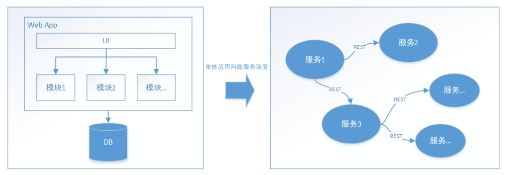

分布式系统会把一个应用系统拆分为可独立部署的多个服务，因此需要服务与服务之间远程协作才能完成事务操作，这种分布式系统环境下由不同的服务之间通过网络远程协作完成事务称之为分布式事务，例如用户注册送积分 事务、创建订单减库存事务，银行转账事务等都是分布式事务。  
我们知道本地事务依赖数据库本身提供的事务特性来实现，因此以下逻辑可以控制本地事务：

```sql
begin transaction； 
    --1.本地数据库操作：张三减少金额 
    --2.本地数据库操作：李四增加金额 
commit transation;
```


但是在分布式环境下，会变成下边这样：

```sql
begin transaction； 
    --1.本地数据库操作：张三减少金额 
    --2.远程调用：让李四增加金额 
commit transation;
```

可以设想，当远程调用让李四增加金额成功了，由于网络问题远程调用并没有返回，此时本地事务提交失败就回滚 了张三减少金额的操作，此时张三和李四的数据就不一致了。

因此在分布式架构的基础上，传统数据库事务就无法使用了，张三和李四的账户不在一个数据库中甚至不在一个应 用系统里，实现转账事务需要通过远程调用，由于网络问题就会导致分布式事务问题。

## 1.4 分布式事务产生的场景
1. 典型的场景就是微服务架构 微服务之间通过远程调用完成事务操作。 比如：订单微服务和库存微服务，下单的 同时订单微服务请求库存微服务减库存。 简言之：跨JVM进程产生分布式事务。  


2. 单体系统访问多个数据库实例 当单体系统需要访问多个数据库（实例）时就会产生分布式事务。 比如：用户信 息和订单信息分别在两个MySQL实例存储，用户管理系统删除用户信息，需要分别删除用户信息及用户的订单信 息，由于数据分布在不同的数据实例，需要通过不同的数据库链接去操作数据，此时产生分布式事务。 简言之：跨数据库实例产生分布式事务。  


3. 多服务访问同一个数据库实例 比如：订单微服务和库存微服务即使访问同一个数据库也会产生分布式事务，原 因就是跨JVM进程，两个微服务持有了不同的数据库链接进行数据库操作，此时产生分布式事务。  


# 2 分布式事务基础理论
通过前面的学习，我们了解到了分布式事务的基础概念。与本地事务不同的是，分布式系统之所以叫分布式，是因 为提供服务的各个节点分布在不同机器上，相互之间通过网络交互。不能因为有一点网络问题就导致整个系统无法 提供服务，网络因素成为了分布式事务的考量标准之一。因此，分布式事务需要更进一步的理论支持，接下来，我 们先来学习一下分布式事务的CAP理论。

在讲解分布式事务控制解决方案之前需要先学习一些基础理论，通过理论知识指导我们确定分布式事务控制的目 标，从而帮助我们理解每个解决方案。

## 2.1 CAP理论
### 2.1.1.理解CAP
CAP是 Consistency、Availability、Partition tolerance三个词语的缩写，分别表示一致性、可用性、分区容忍性。  
下边我们分别来解释：  
为了方便对CAP理论的理解，我们结合电商系统中的一些业务场景来理解CAP。  
如下图，是商品信息管理的执行流程：  


整体执行流程如下：  
1. 商品服务请求主数据库写入商品信息（添加商品、修改商品、删除商品）  
2. 主数据库向商品服务响应写入成功。  
3. 商品服务请求从数据库读取商品信息。


C - Consistency：  
一致性是指写操作后的读操作可以读取到最新的数据状态，当数据分布在多个节点上，从任意结点读取到的数据都 是最新的状态。  
上图中，商品信息的读写要满足一致性就是要实现如下目标：  
1. 商品服务写入主数据库成功，则向从数据库查询新数据也成功。  
2. 商品服务写入主数据库失败，则向从数据库查询新数据也失败。


如何实现一致性？  
1. 写入主数据库后要将数据同步到从数据库。  
2. 写入主数据库后，在向从数据库同步期间要将从数据库锁定，待同步完成后再释放锁，以免在新数据写入成功 后，向从数据库查询到旧的数据。


分布式系统一致性的特点：  
1. 由于存在数据同步的过程，写操作的响应会有一定的延迟。  
2. 为了保证数据一致性会对资源暂时锁定，待数据同步完成释放锁定资源。  
3. 如果请求数据同步失败的结点则会返回错误信息，一定不会返回旧数据。


A - Availability ：  
可用性是指任何事务操作都可以得到响应结果，且不会出现响应超时或响应错误。  
上图中，商品信息读取满足可用性就是要实现如下目标：  
1. 从数据库接收到数据查询的请求则立即能够响应数据查询结果。  
2. 从数据库不允许出现响应超时或响应错误。


如何实现可用性？  
1. 写入主数据库后要将数据同步到从数据库。  
2. 由于要保证从数据库的可用性，不可将从数据库中的资源进行锁定。  
3. 即时数据还没有同步过来，从数据库也要返回要查询的数据，哪怕是旧数据，如果连旧数据也没有则可以按照 约定返回一个默认信息，但不能返回错误或响应超时。


分布式系统可用性的特点：  
1. 所有请求都有响应，且不会出现响应超时或响应错误。


P - Partition tolerance ：  
通常分布式系统的各各结点部署在不同的子网，这就是网络分区，不可避免的会出现由于网络问题而导致结点之间 通信失败，此时仍可对外提供服务，这叫分区容忍性。  
上图中，商品信息读写满足分区容忍性就是要实现如下目标：  
1. 主数据库向从数据库同步数据失败不影响读写操作。  
2. 其一个结点挂掉不影响另一个结点对外提供服务。


如何实现分区容忍性？  
1. 尽量使用异步取代同步操作，例如使用异步方式将数据从主数据库同步到从数据，这样结点之间能有效的实现 松耦合。  
2. 添加从数据库结点，其中一个从结点挂掉其它从结点提供服务。


分布式分区容忍性的特点：  
1. 分区容忍性分是布式系统具备的基本能力。


### 2.1.2 CAP组合方式
1. 上边商品管理的例子是否同时具备 CAP呢？  
在所有分布式事务场景中不会同时具备CAP三个特性，因为在具备了P的前提下C和A是不能共存的。  
比如： 下图满足了P即表示实现分区容忍：  
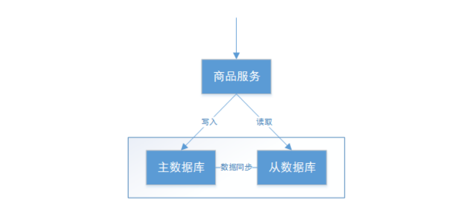


本图分区容忍的含义是：  
1）主数据库通过网络向从数据同步数据，可以认为主从数据库部署在不同的分区，通过网络进行交互。  
2）当主数据库和从数据库之间的网络出现问题不影响主数据库和从数据库对外提供服务。  
3）其一个结点挂掉不影响另一个结点对外提供服务。


如果要实现C则必须保证数据一致性，在数据同步的时候为防止向从数据库查询不一致的数据则需要将从数据库数 据锁定，待同步完成后解锁，如果同步失败从数据库要返回错误信息或超时信息。


如果要实现A则必须保证数据可用性，不管任何时候都可以向从数据查询数据，则不会响应超时或返回错误信息。  
通过分析发现在满足P的前提下C和A存在矛盾性。


2. CAP有哪些组合方式呢？  
所以在生产中对分布式事务处理时要根据需求来确定满足CAP的哪两个方面。  
1）AP： 放弃一致性，追求分区容忍性和可用性。这是很多分布式系统设计时的选择。  
例如： 上边的商品管理，完全可以实现AP，前提是只要用户可以接受所查询的到数据在一定时间内不是最新的即可。 通常实现AP都会保证最终一致性，后面讲的BASE理论就是根据AP来扩展的，一些业务场景 比如：订单退款，今日退款成功，明日账户到账，只要用户可以接受在一定时间内到账即可。

  
	2）CP： 放弃可用性，追求一致性和分区容错性，我们的zookeeper其实就是追求的强一致，又比如跨行转账，一次转账请 求要等待双方银行系统都完成整个事务才算完成。

  
	3）CA： 放弃分区容忍性，即不进行分区，不考虑由于网络不通或结点挂掉的问题，则可以实现一致性和可用性。那么系统 将不是一个标准的分布式系统，我们最常用的关系型数据就满足了CA。  
上边的商品管理，如果要实现CA则架构如下：  


主数据库和从数据库中间不再进行数据同步，数据库可以响应每次的查询请求，通过事务隔离级别实现每个查询请 求都可以返回最新的数据。


### 2.1.3 总结
通过上面我们已经学习了CAP理论的相关知识，CAP是一个已经被证实的理论：一个分布式系统最多只能同时满足 一致性（Consistency）、可用性（Availability）和分区容忍性（Partition tolerance）这三项中的两项。它可以作 为我们进行架构设计、技术选型的考量标准。对于多数大型互联网应用的场景，结点众多、部署分散，而且现在的 集群规模越来越大，所以节点故障、网络故障是常态，而且要保证服务可用性达到N个9（99.99..%），并要达到良 好的响应性能来提高用户体验，因此一般都会做出如下选择：保证P和A，舍弃C强一致，保证最终一致性。

## 2.2 BASE理论
1. 理解强一致性和最终一致性  
CAP理论告诉我们一个分布式系统最多只能同时满足一致性（Consistency）、可用性（Availability）和分区容忍 性（Partition tolerance）这三项中的两项，其中AP在实际应用中较多，AP即舍弃一致性，保证可用性和分区容忍 性，但是在实际生产中很多场景都要实现一致性，比如前边我们举的例子主数据库向从数据库同步数据，即使不要 一致性，但是最终也要将数据同步成功来保证数据一致，这种一致性和CAP中的一致性不同，CAP中的一致性要求 在任何时间查询每个结点数据都必须一致，它强调的是强一致性，但是最终一致性是允许可以在一段时间内每个结 点的数据不一致，但是经过一段时间每个结点的数据必须一致，它强调的是最终数据的一致性。


2. Base理论介绍  
BASE 是 Basically Available(基本可用)、Soft state(软状态)和 Eventually consistent (最终一致性)三个短语的缩 写。BASE理论是对CAP中AP的一个扩展，通过牺牲强一致性来获得可用性，当出现故障允许部分不可用但要保证 核心功能可用，允许数据在一段时间内是不一致的，但最终达到一致状态。满足BASE理论的事务，我们称之为“柔 性事务”。
    - 基本可用:分布式系统在出现故障时，允许损失部分可用功能，保证核心功能可用。如，电商网站交易付款出 现问题了，商品依然可以正常浏览。
    - 软状态:由于不要求强一致性，所以BASE允许系统中存在中间状态（也叫软状态），这个状态不影响系统可用 性，如订单的"支付中"、“数据同步中”等状态，待数据最终一致后状态改为“成功”状态。
    - 最终一致:最终一致是指经过一段时间后，所有节点数据都将会达到一致。如订单的"支付中"状态，最终会变 为“支付成功”或者"支付失败"，使订单状态与实际交易结果达成一致，但需要一定时间的延迟、等待。


# 3 解决方案之2PC(两阶段提交)
前面已经学习了分布式事务的基础理论，以理论为基础，针对不同的分布式场景业界常见的解决方案有2PC、 TCC、可靠消息最终一致性、最大努力通知这几种。

## 3.1 什么是2PC
2PC即两阶段提交协议，是将整个事务流程分为两个阶段，准备阶段（Prepare phase）、提交阶段（commit phase），2是指两个阶段，P是指准备阶段，C是指提交阶段。


举例：

张三和李四好久不见，老友约起聚餐，饭店老板要求先买单，才能出票。这时张三和李四分别抱怨近况不如 意，囊中羞涩，都不愿意请客，这时只能AA。只有张三和李四都付款，老板才能出票安排就餐。但由于张三和李四 都是铁公鸡，形成了尴尬的一幕：  
准备阶段：老板要求张三付款，张三付款。老板要求李四付款，李四付款。  
提交阶段：老板出票，两人拿票纷纷落座就餐。


例子中形成了一个事务，若张三或李四其中一人拒绝付款，或钱不够，店老板都不会给出票，并且会把已收款退 回。


整个事务过程由事务管理器和参与者组成，店老板就是事务管理器，张三、李四就是事务参与者，事务管理器负责 决策整个分布式事务的提交和回滚，事务参与者负责自己本地事务的提交和回滚。


在计算机中部分关系数据库如Oracle、MySQL支持两阶段提交协议，如下图：

1. 准备阶段（Prepare phase）：事务管理器给每个参与者发送Prepare消息，每个数据库参与者在本地执行事 务，并写本地的Undo/Redo日志，此时事务没有提交。 （Undo日志是记录修改前的数据，用于数据库回滚，Redo日志是记录修改后的数据，用于提交事务后写入数 据文件）
2. 提交阶段（commit phase）：如果事务管理器收到了参与者的执行失败或者超时消息时，直接给每个参与者 发送回滚(Rollback)消息；否则，发送提交(Commit)消息；参与者根据事务管理器的指令执行提交或者回滚操 作，并释放事务处理过程中使用的锁资源。注意:必须在最后阶段释放锁资源。 下图展示了2PC的两个阶段，分成功和失败两个情况说明：  
成功情况：  
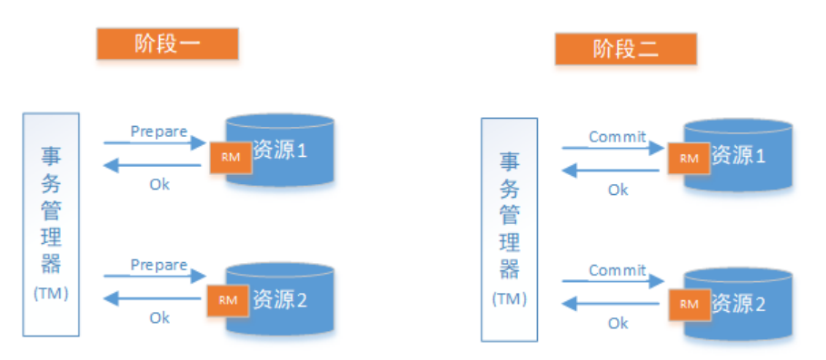


失败情况：  


## 3.2 解决方案
### 3.2.1 XA方案
2PC的传统方案是在数据库层面实现的，如Oracle、MySQL都支持2PC协议，为了统一标准减少行业内不必要的对 接成本，需要制定标准化的处理模型及接口标准，国际开放标准组织Open Group定义了分布式事务处理模型 DTP（Distributed Transaction Processing Reference Model）。  
为了让大家更明确XA方案的内容程，下面新用户注册送积分为例来说明：  
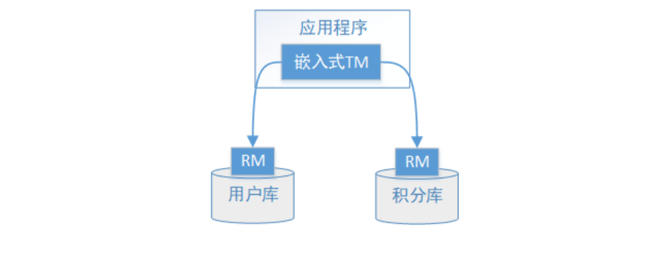


执行流程如下：  
1. 应用程序（AP）持有用户库和积分库两个数据源。  
2. 应用程序（AP）通过TM通知用户库RM新增用户，同时通知积分库RM为该用户新增积分，RM此时并未提交事 务，此时用户和积分资源锁定。  
3. TM收到执行回复，只要有一方失败则分别向其他RM发起回滚事务，回滚完毕，资源锁释放。  
4. TM收到执行回复，全部成功，此时向所有RM发起提交事务，提交完毕，资源锁释放。


DTP模型定义如下角色：

+ AP(Application Program)：即应用程序，可以理解为使用DTP分布式事务的程序。
+ RM(Resource Manager)：即资源管理器，可以理解为事务的参与者，一般情况下是指一个数据库实例，通过 资源管理器对该数据库进行控制，资源管理器控制着分支事务。
+ TM(Transaction Manager)：事务管理器，负责协调和管理事务，事务管理器控制着全局事务，管理事务生命 周期，并协调各个RM。全局事务是指分布式事务处理环境中，需要操作多个数据库共同完成一个工作，这个 工作即是一个全局事务。
+ DTP模型定义TM和RM之间通讯的接口规范叫XA，简单理解为数据库提供的2PC接口协议，基于数据库的XA 协议来实现2PC又称为XA方案。


以上三个角色之间的交互方式如下：  
1）TM向AP提供 应用程序编程接口，AP通过TM提交及回滚事务。  
2）TM交易中间件通过XA接口来通知RM数据库事务的开始、结束以及提交、回滚等。


总结： 整个2PC的事务流程涉及到三个角色AP、RM、TM。AP指的是使用2PC分布式事务的应用程序；RM指的是资 源管理器，它控制着分支事务；TM指的是事务管理器，它控制着整个全局事务。  
1）在准备阶段RM执行实际的业务操作，但不提交事务，资源锁定；  
2）在提交阶段TM会接受RM在准备阶段的执行回复，只要有任一个RM执行失败，TM会通知所有RM执行回滚操 作，否则，TM将会通知所有RM提交该事务。提交阶段结束资源锁释放。


XA方案的问题：  
1、需要本地数据库支持XA协议。  
2、资源锁需要等到两个阶段结束才释放，性能较差。


### 3.2.2 Seata方案
Seata是由阿里中间件团队发起的开源项目 Fescar，后更名为Seata，它是一个是开源的分布式事务框架。  
传统2PC的问题在Seata中得到了解决，它通过对本地关系数据库的分支事务的协调来驱动完成全局事务，是工作 在应用层的中间件。主要优点是性能较好，且不长时间占用连接资源，它以高效并且对业务0侵入的方式解决微服 务场景下面临的分布式事务问题，它目前提供AT模式(即2PC)及TCC模式的分布式事务解决方案。


Seata的设计思想如下：  
Seata的设计目标其一是对业务无侵入，因此从业务无侵入的2PC方案着手，在传统2PC的基础上演进，并解决 2PC方案面临的问题。


Seata把一个分布式事务理解成一个包含了若干分支事务的全局事务。全局事务的职责是协调其下管辖的分支事务 达成一致，要么一起成功提交，要么一起失败回滚。此外，通常分支事务本身就是一个关系数据库的本地事务，下 图是全局事务与分支事务的关系图：  
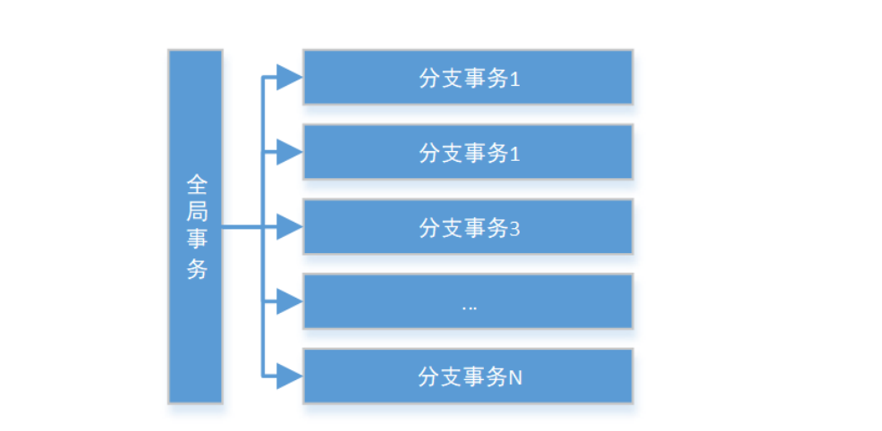


与 传统2PC 的模型类似，Seata定义了3个组件来协议分布式事务的处理过程：  


Transaction Coordinator (TC)： 事务协调器，它是独立的中间件，需要独立部署运行，它维护全局事务的运 行状态，接收TM指令发起全局事务的提交与回滚，负责与RM通信协调各各分支事务的提交或回滚。  
Transaction Manager (TM)： 事务管理器，TM需要嵌入应用程序中工作，它负责开启一个全局事务，并最终 向TC发起全局提交或全局回滚的指令。  
Resource Manager (RM)： 控制分支事务，负责分支注册、状态汇报，并接收事务协调器TC的指令，驱动分 支（本地）事务的提交和回滚。


还拿新用户注册送积分举例Seata的分布式事务过程：  
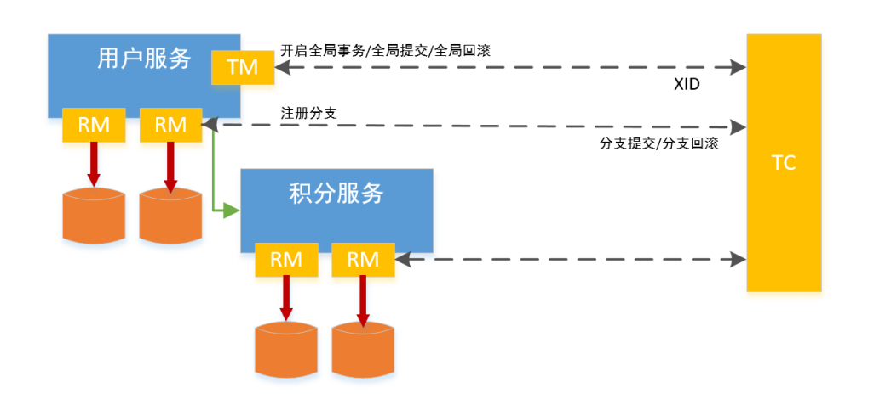


具体的执行流程如下：

1. 用户服务的 TM 向 TC 申请开启一个全局事务，全局事务创建成功并生成一个全局唯一的XID。
2. 用户服务的 RM 向 TC 注册 分支事务，该分支事务在用户服务执行新增用户逻辑，并将其纳入 XID 对应全局 事务的管辖。
3. 用户服务执行分支事务，向用户表插入一条记录。
4. 逻辑执行到远程调用积分服务时(XID 在微服务调用链路的上下文中传播)。积分服务的RM 向 TC 注册分支事 务，该分支事务执行增加积分的逻辑，并将其纳入 XID 对应全局事务的管辖。
5. 积分服务执行分支事务，向积分记录表插入一条记录，执行完毕后，返回用户服务。
6. 用户服务分支事务执行完毕。
7. TM 向 TC 发起针对 XID 的全局提交或回滚决议。
8. TC 调度 XID 下管辖的全部分支事务完成提交或回滚请求。


Seata实现2PC与传统2PC的差别：  
架构层次方面，传统2PC方案的 RM 实际上是在数据库层，RM 本质上就是数据库自身，通过 XA 协议实现，而 Seata的 RM 是以jar包的形式作为中间件层部署在应用程序这一侧的。  
两阶段提交方面，传统2PC无论第二阶段的决议是commit还是rollback，事务性资源的锁都要保持到Phase2完成 才释放。而Seata的做法是在Phase1 就将本地事务提交，这样就可以省去Phase2持锁的时间，整体提高效率。


## 3.3.seata实现2PC事务
### 3.3.1 业务说明
本示例通过Seata中间件实现分布式事务，模拟三个账户的转账交易过程。  
两个账户在三个不同的银行(张三在bank1、李四在bank2)，bank1和bank2是两个个微服务。交易过程是，张三 给李四转账指定金额。  
上述交易步骤，要么一起成功，要么一起失败，必须是一个整体性的事务。  


### 3.3.2.程序组成部分
本示例程序组成部分如下：

数据库：`MySQL-5.7.25`，包括bank1和bank2两个数据库。

JDK：`64位 jdk1.8.0_201`

微服务框架：`spring-boot-2.1.3``spring-cloud-Greenwich.RELEASE`

seata客户端（RM、TM）：`spring-cloud-alibaba-seata-2.1.0.RELEASE`

seata服务端(TC)：`seata-server-0.7.1`

微服务及数据库的关系 ：

`dtx/dtx-seata-demo/seata-demo-bank1` 银行1，操作张三账户， 连接数据库bank1

`dtx/dtx-seata-demo/seata-demo-bank2` 银行2，操作李四账户，连接数据库bank2

服务注册中心：`dtx/discover-server`  
  
本示例程序技术架构如下：  


交互流程如下：  
1. 请求bank1进行转账，传入转账金额。  
2. bank1减少转账金额，调用bank2，传入转账金额。


### 3.3.3 创建数据库
包括如下数据库：  
bank1库，包含张三账户

```sql
CREATE DATABASE `bank1` CHARACTER SET 'utf8' COLLATE 'utf8_general_ci';
```

```sql
DROP TABLE IF EXISTS `account_info`; 

CREATE TABLE `account_info` ( 
    `id` bigint(20) NOT NULL AUTO_INCREMENT, `account_name` varchar(100) CHARACTER SET utf8 COLLATE utf8_bin NULL DEFAULT NULL COMMENT '户 主姓名', 
    `account_no` varchar(100) CHARACTER SET utf8 COLLATE utf8_bin NULL DEFAULT NULL COMMENT '银行 卡号', 
    `account_password` varchar(100) CHARACTER SET utf8 COLLATE utf8_bin NULL DEFAULT NULL COMMENT '帐户密码', 
    `account_balance` double NULL DEFAULT NULL COMMENT '帐户余额', 
    PRIMARY KEY (`id`) USING BTREE 
) ENGINE = InnoDB AUTO_INCREMENT = 5 CHARACTER SET = utf8 COLLATE = utf8_bin ROW_FORMAT = Dynamic; 

INSERT INTO `account_info` VALUES (2, '张三的账户', '1', '', 10000);
```


bank2库，包含李四账户

```sql
CREATE DATABASE `bank2` CHARACTER SET 'utf8' COLLATE 'utf8_general_ci';
```

```sql
CREATE TABLE `account_info` ( 
  `id` bigint(20) NOT NULL AUTO_INCREMENT, 
  `account_name` varchar(100) CHARACTER SET utf8 COLLATE utf8_bin NULL DEFAULT NULL COMMENT '户 主姓名', 
  `account_no` varchar(100) CHARACTER SET utf8 COLLATE utf8_bin NULL DEFAULT NULL COMMENT '银行 卡号', 
  `account_password` varchar(100) CHARACTER SET utf8 COLLATE utf8_bin NULL DEFAULT NULL COMMENT '帐户密码', 
  `account_balance` double NULL DEFAULT NULL COMMENT '帐户余额', 
  PRIMARY KEY (`id`) USING BTREE 
) ENGINE = InnoDB AUTO_INCREMENT = 5 CHARACTER SET = utf8 COLLATE = utf8_bin ROW_FORMAT = Dynamic; 

INSERT INTO `account_info` VALUES (3, '李四的账户', '2', NULL, 0);
```


分别在bank1、bank2库中创建undo_log表，此表为seata框架使用：

```sql
CREATE TABLE `undo_log` ( 
	`id` bigint(20) NOT NULL AUTO_INCREMENT, 
	`branch_id` bigint(20) NOT NULL, 
	`xid` varchar(100) NOT NULL, 
	`context` varchar(128) NOT NULL, 
	`rollback_info` longblob NOT NULL, 
	`log_status` int(11) NOT NULL, 
	`log_created` datetime NOT NULL, 
	`log_modified` datetime NOT NULL, 
	`ext` varchar(100) DEFAULT NULL, 
	PRIMARY KEY (`id`), 
	UNIQUE KEY `ux_undo_log` (`xid`,`branch_id`) 
) ENGINE=InnoDB AUTO_INCREMENT=1 DEFAULT CHARSET=utf8;
```


### 3.3.4.启动TC(事务协调器)
1. 下载seata服务器  
下载地址：[https://github.com/seata/seata/releases/download/v0.7.1/seata-server-0.7.1.zip](https://github.com/seata/seata/releases/download/v0.7.1/seata-server-0.7.1.zip)


2. 解压并启动 [seata服务端解压路径]/bin/seata-server.bat -p 8888 -m file  
注：其中8888为服务端口号；file为启动模式，这里指seata服务将采用文件的方式存储信息。  


如上图出现“Server started...”的字样则表示启动成功。


### 3.3.5 discover-server
discover-server是服务注册中心，测试工程将自己注册至discover-server。  
导入：资料\基础代码\dtx 父工程，此工程自带了discover-server，discover-server基于Eureka实现。


### 3.3.6 导入案例工程dtx-seata-demo
dtx-seata-demo是seata的测试工程，根据业务需求需要创建两个dtx-seata-demo工程。

1. 导入dtx-seata-demo  
导入：资料\基础代码\dtx-seata-demo到父工程dtx下。  
两个测试工程如下：  
dtx/dtx-seata-demo/dtx-seata-demo-bank1 ，操作张三账户，连接数据库bank1  
dtx/dtx-seata-demo/dtx-seata-demo-bank2 ，操作李四账户，连接数据库bank2


2. 父工程maven依赖说明  
在dtx父工程中指定了SpringBoot和SpringCloud版本

```xml
<dependency>
    <groupId>org.springframework.boot</groupId>
    spring-boot-dependencies</artifactId>
    <version>2.1.3.RELEASE</version>
    <type>pom</type>
    <scope>import</scope>
</dependency>

<dependency>
    <groupId>org.springframework.cloud</groupId>
    spring-cloud-dependencies</artifactId>
    <version>Greenwich.RELEASE</version>
    <type>pom</type>
    <scope>import</scope>
</dependency>
```


在dtx-seata-demo父工程中指定了spring-cloud-alibaba-dependencies的版本。

```xml
<dependency>
    <groupId>com.alibaba.cloud</groupId>
    spring-cloud-alibaba-dependencies</artifactId>
    <version>2.1.0.RELEASE</version>
    <type>pom</type>
    <scope>import</scope>
</dependency>
```


3. 配置seata  
在src/main/resource中，新增registry.conf、file.conf文件，内容可拷贝seata-server-0.7.1中的配置文件子。  
在registry.conf中registry.type使用file：  


在file.conf中更改service.vgroup_mapping.[springcloud服务名]-fescar-service-group = "default"，  
并修改 service.default.grouplist =[seata服务端地址]  
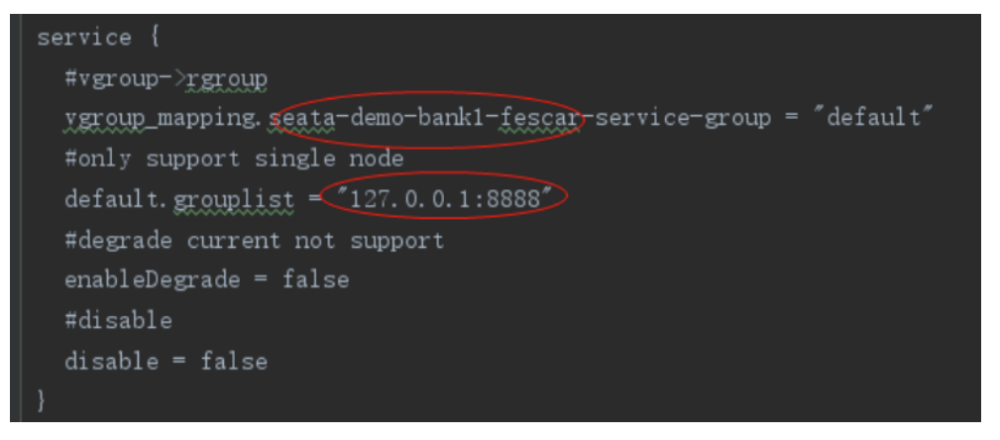


关于vgroup_mapping的配置：  
vgroup_mapping.事务分组服务名=Seata Server集群名称（默认名称为default）  
default.grouplist = Seata Server集群地址


在 `org.springframework.cloud:spring-cloud-starter-alibaba-seata`的  
`org.springframework.cloud.alibaba.seata.GlobalTransactionAutoConfiguration`类中，默认会使用  
`${spring.application.name}-fescar-service-group` 作为事务分组服务名注册到 Seata Server上，如果和 `file.conf` 中的配置不一致，会提示 no available server to connect 错误  
也可以通过配置 `spring.cloud.alibaba.seata.tx-service-group` 修改后缀，但是必须和 `file.conf`中的配置保持 一致。


（4）创建代理数据源  
新增DatabaseConfiguration.java，Seata的RM通过DataSourceProxy才能在业务代码的事务提交时，通过这个切 入点，与TC进行通信交互、记录undo_log等。


```java
@Configuration
public class DatabaseConfiguration {

    @Bean
    @ConfigurationProperties(prefix = "spring.datasource.ds0")
    public DruidDataSource ds0() {
        DruidDataSource druidDataSource = new DruidDataSource();
        return druidDataSource;
    }

    @Primary
    @Bean
    public DataSource dataSource(DruidDataSource ds0)  {
        DataSourceProxy pds0 = new DataSourceProxy(ds0);
        return pds0;
    }
}
```


### 3.3.7 Seata执行流程


1、正常提交流程  
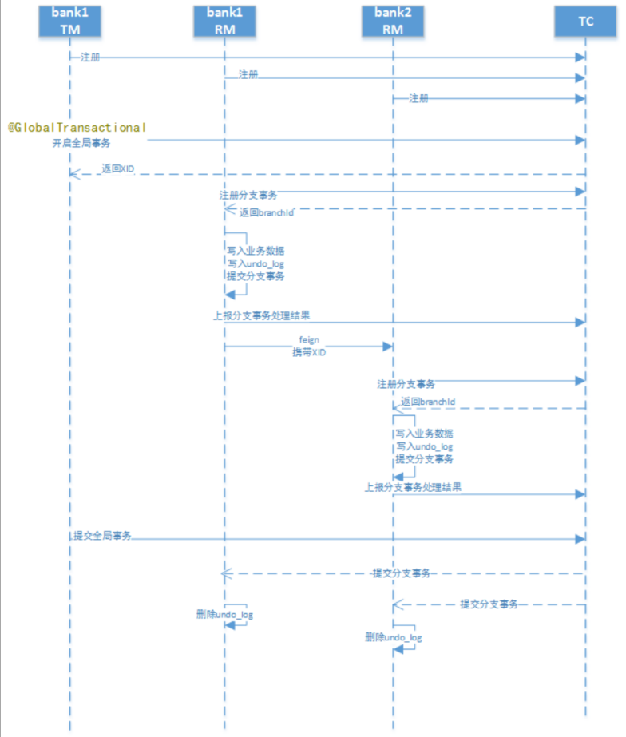


2、回滚流程  
回滚流程省略前的RM注册过程。  
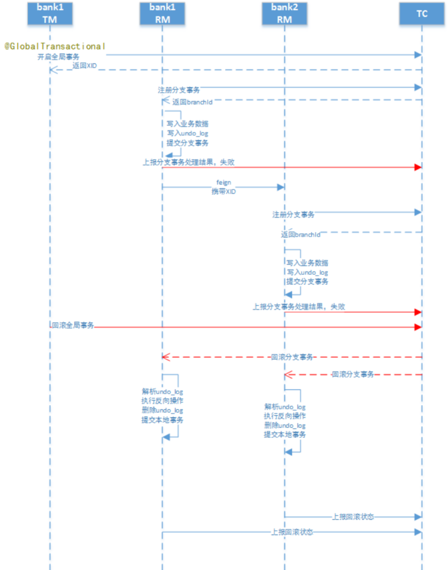


要点说明：  
1、每个RM使用DataSourceProxy连接数据库，其目的是使用ConnectionProxy，使用数据源和数据连接代理的目 的就是在第一阶段将undo_log和业务数据放在一个本地事务提交，这样就保存了只要有业务操作就一定有 undo_log。  
2、在第一阶段undo_log中存放了数据修改前和修改后的值，为事务回滚作好准备，所以第一阶段完成就已经将分 支事务提交，也就释放了锁资源。  
3、TM开启全局事务开始，将XID全局事务id放在事务上下文中，通过feign调用也将XID传入下游分支事务，每个 分支事务将自己的Branch ID分支事务ID与XID关联。  
4、第二阶段全局事务提交，TC会通知各各分支参与者提交分支事务，在第一阶段就已经提交了分支事务，这里各 各参与者只需要删除undo_log即可，并且可以异步执行，第二阶段很快可以完成。  
5、第二阶段全局事务回滚，TC会通知各各分支参与者回滚分支事务，通过 XID 和 Branch ID 找到相应的回滚日 志，通过回滚日志生成反向的 SQL 并执行，以完成分支事务回滚到之前的状态，如果回滚失败则会重试回滚操 作。


### 3.3.8 dtx-seata-demo-bank1


dtx-seata-demo-bank1实现如下功能：  
1、张三账户减少金额，开启全局事务。  
2、远程调用bank2向李四转账。  
（1）DAO


```java
@Mapper
@Component
public interface AccountInfoDao {

    //更新账户金额
    @Update("update account_info set account_balance = account_balance + #{amount} where account_no = #{accountNo}")
    int updateAccountBalance(@Param("accountNo") String accountNo, @Param("amount") Double amount);

}
```


（2）FeignClient 远程调用bank2的客户端


```java
@FeignClient(value="seata-demo-bank2",fallback=Bank2ClientFallback.class)
public interface Bank2Client {
    //远程调用李四的微服务
    @GetMapping("/bank2/transfer")
    public  String transfer(@RequestParam("amount") Double amount);
}
```


```java
@Component
public class Bank2ClientFallback implements Bank2Client {

    @Override
    public String transfer(Double amount) {

        return "fallback";
    }
}
```


（3）Service


```java
@Service
@Slf4j
public class AccountInfoServiceImpl implements AccountInfoService {

    @Autowired
    AccountInfoDao accountInfoDao;

    @Autowired
    Bank2Client bank2Client;

    @Transactional
    @GlobalTransactional//开启全局事务
    @Override
    public void updateAccountBalance(String accountNo, Double amount) {
        log.info("bank1 service begin,XID：{}", RootContext.getXID());
        //扣减张三的金额
        accountInfoDao.updateAccountBalance(accountNo,amount *-1);
        //调用李四微服务，转账
        String transfer = bank2Client.transfer(amount);
        if("fallback".equals(transfer)){
            //调用李四微服务异常
            throw new RuntimeException("调用李四微服务异常");
        }
        if(amount == 2){
            //人为制造异常
            throw new RuntimeException("bank1 make exception..");
        }
    }
}
```


将@GlobalTransactional注解标注在全局事务发起的Service实现方法上，开启全局事务：  
GlobalTransactionalInterceptor会拦截@GlobalTransactional注解的方法，生成全局事务ID(XID)，XID会在整个 分布式事务中传递。  
在远程调用时，spring-cloud-alibaba-seata会拦截Feign调用将XID传递到下游服务。


（6）Controller


```java
@RestController
public class Bank1Controller {

    @Autowired
    AccountInfoService accountInfoService;

    //张三转账
    @GetMapping("/transfer")
    public String transfer(Double amount){
        accountInfoService.updateAccountBalance("1",amount);
        return "bank1"+amount;
    }
}
```


### 3.3.9 dtx-seata-demo-bank2


dtx-seata-demo-bank2实现如下功能：  
1、李四账户增加金额。 dtx-seata-demo-bank2在本账号事务中作为分支事务不使用@GlobalTransactional。  
（1）DAO


```java
@Mapper
@Component
public interface AccountInfoDao {
    //更新账户
    @Update("UPDATE account_info SET account_balance = account_balance + #{amount} WHERE account_no = #{accountNo}")
    int updateAccountBalance(@Param("accountNo") String accountNo, @Param("amount") Double amount);

}
```


（2）Service


```java
@Service
@Slf4j
public class AccountInfoServiceImpl implements AccountInfoService {

    @Autowired
    AccountInfoDao accountInfoDao;

    @Transactional
    @Override
    public void updateAccountBalance(String accountNo, Double amount) {
        log.info("bank2 service begin,XID：{}",RootContext.getXID());
        //李四增加金额
        accountInfoDao.updateAccountBalance(accountNo,amount);
        if(amount==3){
            //人为制造异常
            throw new RuntimeException("bank2 make exception..");
        }
    }
}
```


（3）Controller


```java
@RestController
public class Bank2Controller {

    @Autowired
    AccountInfoService accountInfoService;

    //接收张三的转账
    @GetMapping("/transfer")
    public String transfer(Double amount){
        //李四增加金额
        accountInfoService.updateAccountBalance("2",amount);
        return "bank2"+amount;
    }
}
```


### 3.3.10 测试场景


张三向李四转账成功。  
李四事务失败，张三事务回滚成功。  
张三事务失败，李四事务回滚成功。  
分支事务超时测试。


## 3.4.小结


本节讲解了传统2PC（基于数据库XA协议）和Seata实现2PC的两种2PC方案，由于Seata的0侵入性并且解决了传 统2PC长期锁资源的问题，所以推荐采用Seata实现2PC。  
Seata实现2PC要点：  
1、全局事务开始使用 @GlobalTransactional标识 。  
2、每个本地事务方案仍然使用@Transactional标识。  
3、每个数据都需要创建undo_log表，此表是seata保证本地事务一致性的关键。


# 4.分布式事务解决方案之TCC


## 4.1.什么是TCC事务


TCC是Try、Confirm、Cancel三个词语的缩写，TCC要求每个分支事务实现三个操作：预处理Try、确认 Confirm、撤销Cancel。Try操作做业务检查及资源预留，Confirm做业务确认操作，Cancel实现一个与Try相反的 操作即回滚操作。TM首先发起所有的分支事务的try操作，任何一个分支事务的try操作执行失败，TM将会发起所 有分支事务的Cancel操作，若try操作全部成功，TM将会发起所有分支事务的Confirm操作，其中Confirm/Cancel 操作若执行失败，TM会进行重试。


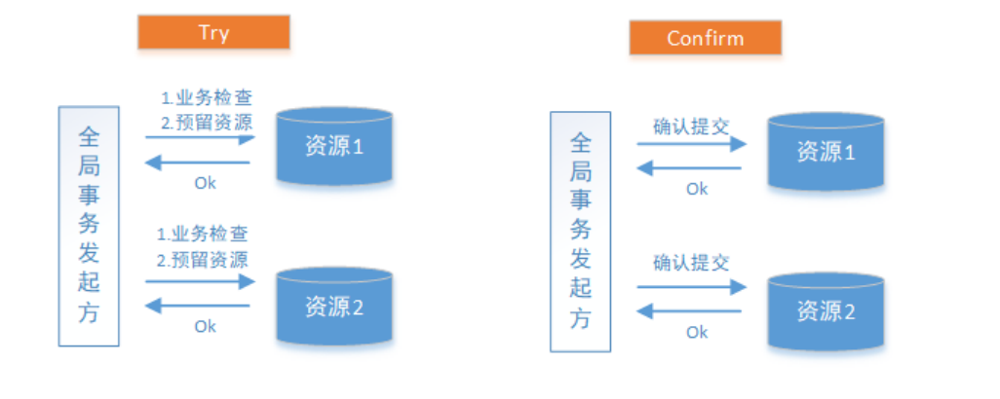


分支事务失败的情况：  
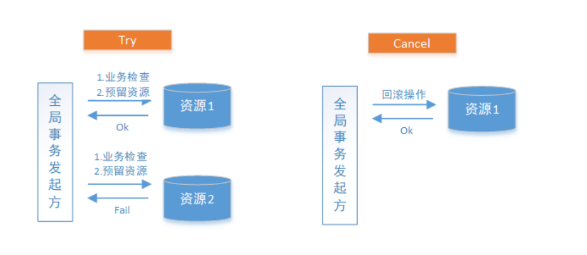


TCC分为三个阶段：


1. Try 阶段是做业务检查(一致性)及资源预留(隔离)，此阶段仅是一个初步操作，它和后续的Confirm 一起才能 真正构成一个完整的业务逻辑。
2. Confirm 阶段是做确认提交，Try阶段所有分支事务执行成功后开始执行 Confirm。通常情况下，采用TCC则 认为 Confirm阶段是不会出错的。即：只要Try成功，Confirm一定成功。若Confirm阶段真的出错了，需引 入重试机制或人工处理。
3. Cancel 阶段是在业务执行错误需要回滚的状态下执行分支事务的业务取消，预留资源释放。通常情况下，采 用TCC则认为Cancel阶段也是一定成功的。若Cancel阶段真的出错了，需引入重试机制或人工处理。
4. TM事务管理器，TM事务管理器可以实现为独立的服务，也可以让全局事务发起方充当TM的角色，TM独立出来是为了成为公 用组件，是为了考虑系统结构和软件复用。


TM在发起全局事务时生成全局事务记录，全局事务ID贯穿整个分布式事务调用链条，用来记录事务上下文， 追踪和记录状态，由于Confirm 和cancel失败需进行重试，因此需要实现为幂等，幂等性是指同一个操作无论请求 多少次，其结果都相同。


## 4.2.TCC解决方案


目前市面上的TCC框架众多比如下面这几种：  
（以下数据采集日为2019年07月11日）

| 框架名称 | Gitbub地址 | star数量 |
| --- | --- | --- |
| tcc-transaction | [https://github.com/changmingxie/tcc-transaction](https://github.com/changmingxie/tcc-transaction) | 3850 |
| Hmily | [https://github.com/yu199195/hmily](https://github.com/yu199195/hmily) | 2407 |
| ByteTCC | [https://github.com/liuyangming/ByteTCC](https://github.com/liuyangming/ByteTCC) | 1947 |
| EasyTransaction | [https://github.com/QNJR-GROUP/EasyTransaction](https://github.com/QNJR-GROUP/EasyTransaction) | 1690 |


上一节所讲的Seata也支持TCC，但Seata的TCC模式对Spring Cloud并没有提供支持。我们的目标是理解TCC的原 理以及事务协调运作的过程，因此更请倾向于轻量级易于理解的框架，因此最终确定了Hmily。


Hmily是一个高性能分布式事务TCC开源框架。基于Java语言来开发（JDK1.8），支持Dubbo，Spring Cloud等 RPC框架进行分布式事务。它目前支持以下特性：  
支持嵌套事务(Nested transaction support).  
采用disruptor框架进行事务日志的异步读写，与RPC框架的性能毫无差别。  
支持SpringBoot-starter 项目启动，使用简单。  
RPC框架支持 : dubbo,motan,springcloud。  
本地事务存储支持 : redis,mongodb,zookeeper,file,mysql。  
事务日志序列化支持 ：java，hessian，kryo，protostuff。  
采用Aspect AOP 切面思想与Spring无缝集成，天然支持集群。  
RPC事务恢复，超时异常恢复等。


Hmily利用AOP对参与分布式事务的本地方法与远程方法进行拦截处理，通过多方拦截，事务参与者能透明的 调用到另一方的Try、Confirm、Cancel方法；传递事务上下文；并记录事务日志，酌情进行补偿，重试等。


Hmily不需要事务协调服务，但需要提供一个数据库(mysql/mongodb/zookeeper/redis/file)来进行日志存 储。


Hmily实现的TCC服务与普通的服务一样，只需要暴露一个接口，也就是它的Try业务。Confirm/Cancel业务 逻辑，只是因为全局事务提交/回滚的需要才提供的，因此Confirm/Cancel业务只需要被Hmily TCC事务框架 发现即可，不需要被调用它的其他业务服务所感知。


官网介绍：[https://dromara.org/website/zh-cn/docs/hmily/index.html](https://dromara.org/website/zh-cn/docs/hmily/index.html)


TCC需要注意三种异常处理分别是空回滚、幂等、悬挂:


空回滚：  
在没有调用 TCC 资源 Try 方法的情况下，调用了二阶段的 Cancel 方法，Cancel 方法需要识别出这是一个空回 滚，然后直接返回成功。  
出现原因是当一个分支事务所在服务宕机或网络异常，分支事务调用记录为失败，这个时候其实是没有执行Try阶 段，当故障恢复后，分布式事务进行回滚则会调用二阶段的Cancel方法，从而形成空回滚。  
解决思路是关键就是要识别出这个空回滚。思路很简单就是需要知道一阶段是否执行，如果执行了，那就是正常回 滚；如果没执行，那就是空回滚。前面已经说过TM在发起全局事务时生成全局事务记录，全局事务ID贯穿整个分 布式事务调用链条。再额外增加一张分支事务记录表，其中有全局事务 ID 和分支事务 ID，第一阶段 Try 方法里会 插入一条记录，表示一阶段执行了。Cancel 接口里读取该记录，如果该记录存在，则正常回滚；如果该记录不存 在，则是空回滚。


幂等：  
通过前面介绍已经了解到，为了保证TCC二阶段提交重试机制不会引发数据不一致，要求 TCC 的二阶段 Try、 Confirm 和 Cancel 接口保证幂等，这样不会重复使用或者释放资源。如果幂等控制没有做好，很有可能导致数据 不一致等严重问题。  
解决思路在上述“分支事务记录”中增加执行状态，每次执行前都查询该状态。


悬挂：  
悬挂就是对于一个分布式事务，其二阶段 Cancel 接口比 Try 接口先执行。  
出现原因是在 RPC 调用分支事务try时，先注册分支事务，再执行RPC调用，如果此时 RPC 调用的网络发生拥堵， 通常 RPC 调用是有超时时间的，RPC 超时以后，TM就会通知RM回滚该分布式事务，可能回滚完成后，RPC 请求 才到达参与者真正执行，而一个 Try 方法预留的业务资源，只有该分布式事务才能使用，该分布式事务第一阶段预 留的业务资源就再也没有人能够处理了，对于这种情况，我们就称为悬挂，即业务资源预留后没法继续处理。


解决思路是如果二阶段执行完成，那一阶段就不能再继续执行。在执行一阶段事务时判断在该全局事务下，“分支 事务记录”表中是否已经有二阶段事务记录，如果有则不执行Try。


举例，场景为 A 转账 30 元给 B，A和B账户在不同的服务。  
方案1： 账户A


```plain
try：
    检查余额是否够30元 
    扣减30元 

confirm： 
    空 

cancel：
    增加30元
```


账户B


```plain
try：
    增加30元 

confirm： 
    空 

cancel：
    减少30元
```


方案1说明：  
1）账户A，这里的余额就是所谓的业务资源，按照前面提到的原则，在第一阶段需要检查并预留业务资源，因此， 我们在扣钱 TCC 资源的 Try 接口里先检查 A 账户余额是否足够，如果足够则扣除 30 元。 Confirm 接口表示正式 提交，由于业务资源已经在 Try 接口里扣除掉了，那么在第二阶段的 Confirm 接口里可以什么都不用做。Cancel 接口的执行表示整个事务回滚，账户A回滚则需要把 Try 接口里扣除掉的 30 元还给账户。  
2）账号B，在第一阶段 Try 接口里实现给账户B加钱，Cancel 接口的执行表示整个事务回滚，账户B回滚则需要把 Try 接口里加的 30 元再减去。


方案1的问题分析：  
1）如果账户A的try没有执行在cancel则就多加了30元。  
2）由于try，cancel、confirm都是由单独的线程去调用，且会出现重复调用，所以都需要实现幂等。  
3）账号B在try中增加30元，当try执行完成后可能会其它线程给消费了。  
4）如果账户B的try没有执行在cancel则就多减了30元。


问题解决：  
1）账户A的cancel方法需要判断try方法是否执行，正常执行try后方可执行cancel。  
2）try，cancel、confirm方法实现幂等。  
3）账号B在try方法中不允许更新账户金额，在confirm中更新账户金额。  
4）账户B的cancel方法需要判断try方法是否执行，正常执行try后方可执行cancel。


优化方案：  
账户A


```plain
try：
    try幂等校验 
    try悬挂处理 
    检查余额是否够30元 
    扣减30元 

confirm： 
    空 

cancel：
    cancel幂等校验 
    cancel空回滚处理 
    增加可用余额30元
```


账户B


```plain
try：
    空 

confirm： 
    confirm幂等校验 
    正式增加30元 

cancel：
    空
```


## 4.3.Hmily实现TCC事务


### 4.3.1.业务说明


本实例通过Hmily实现TCC分布式事务，模拟两个账户的转账交易过程。  
两个账户分别在不同的银行(张三在bank1、李四在bank2)，bank1、bank2是两个微服务。交易过程是，张三给 李四转账指定金额。  
上述交易步骤，要么一起成功，要么一起失败，必须是一个整体性的事务。  


### 4.3.2.程序组成部分


数据库：MySQL-5.7.25  
JDK：64位 jdk1.8.0_201  
微服务：spring-boot-2.1.3、spring-cloud-Greenwich.RELEASE  
Hmily：hmily-springcloud.2.0.4-RELEASE


微服务及数据库的关系 ：  
dtx/dtx-tcc-demo/dtx-tcc-demo-bank1 银行1，操作张三账户， 连接数据库bank1  
dtx/dtx-tcc-demo/dtx-tcc-demo-bank2 银行2，操作李四账户，连接数据库bank2


服务注册中心：dtx/discover-server


### 4.3.3.创建数据库


创建hmily数据库，用于存储hmily框架记录的数据。 创建bank1库，并导入以下表结构和数据(包含张三账户) 创建bank2库，并导入以下表结构和数据(包含李四账户) CREATE DATABASE `hmily` CHARACTER SET 'utf8' COLLATE 'utf8_general_ci'; CREATE DATABASE `bank1` CHARACTER SET 'utf8' COLLATE 'utf8_general_ci'; DROP TABLE IF EXISTS `account_info`; CREATE TABLE `account_info` ( `id` bigint(20) NOT NULL AUTO_INCREMENT, `account_name` varchar(100) CHARACTER SET utf8 COLLATE utf8_bin NULL DEFAULT NULL COMMENT '户 主姓名', `account_no` varchar(100) CHARACTER SET utf8 COLLATE utf8_bin NULL DEFAULT NULL COMMENT '银行 卡号', `account_password` varchar(100) CHARACTER SET utf8 COLLATE utf8_bin NULL DEFAULT NULL COMMENT '帐户密码', `account_balance` double NULL DEFAULT NULL COMMENT '帐户余额', PRIMARY KEY (`id`) USING BTREE ) ENGINE = InnoDB AUTO_INCREMENT = 5 CHARACTER SET = utf8 COLLATE = utf8_bin ROW_FORMAT = Dynamic; INSERT INTO `account_info` VALUES (2, '张三的账户', '1', '', 10000); CREATE DATABASE `bank2` CHARACTER SET 'utf8' COLLATE 'utf8_general_ci';  
每个数据库都创建try、confirm、cancel三张日志表： 4.3.5 discover-server discover-server是服务注册中心，测试工程将自己注册至discover-server。 导入：资料\基础代码\dtx 父工程，此工程自带了discover-server，discover-server基于Eureka实现。 已经导过不用重复导入。 4.3.6 导入案例工程dtx-tcc-demo dtx-tcc-demo是tcc的测试工程，根据业务需求需要创建两个dtx-tcc-demo工程。 （1）导入dtx-tcc-demo 导入：资料\基础代码\dtx-tcc-demo到父工程dtx下。 两个测试工程如下： dtx/dtx-tcc-demo/dtx-tcc-demo-bank1 银行1，操作张三账户，连接数据库bank1 dtx/dtx-tcc-demo/dtx-tcc-demo-bank2 银行2，操作李四账户，连接数据库bank2 CREATE TABLE `account_info` ( `id` bigint(20) NOT NULL AUTO_INCREMENT, `account_name` varchar(100) CHARACTER SET utf8 COLLATE utf8_bin NULL DEFAULT NULL COMMENT '户 主姓名', `account_no` varchar(100) CHARACTER SET utf8 COLLATE utf8_bin NULL DEFAULT NULL COMMENT '银行 卡号', `account_password` varchar(100) CHARACTER SET utf8 COLLATE utf8_bin NULL DEFAULT NULL COMMENT '帐户密码', `account_balance` double NULL DEFAULT NULL COMMENT '帐户余额', PRIMARY KEY (`id`) USING BTREE ) ENGINE = InnoDB AUTO_INCREMENT = 5 CHARACTER SET = utf8 COLLATE = utf8_bin ROW_FORMAT = Dynamic; INSERT INTO `account_info` VALUES (3, '李四的账户', '2', NULL, 0); CREATE TABLE `local_try_log` ( `tx_no` varchar(64) NOT NULL COMMENT '事务id', `create_time` datetime DEFAULT NULL, PRIMARY KEY (`tx_no`) ) ENGINE=InnoDB DEFAULT CHARSET=utf8 CREATE TABLE `local_confirm_log` ( `tx_no` varchar(64) NOT NULL COMMENT '事务id', `create_time` datetime DEFAULT NULL ) ENGINE=InnoDB DEFAULT CHARSET=utf8 CREATE TABLE `local_cancel_log` ( `tx_no` varchar(64) NOT NULL COMMENT '事务id', `create_time` datetime DEFAULT NULL, PRIMARY KEY (`tx_no`) ) ENGINE=InnoDB DEFAULT CHARSET=utf8  
（2）引入maven依赖 （3）配置hmily application.yml： 新增配置类接收application.yml中的Hmily配置信息，并创建HmilyTransactionBootstrap Bean：  org.dromara hmily‐springcloud 2.0.4‐RELEASE  org:dromara: hmily : serializer : kryo recoverDelayTime : 128 retryMax : 30 scheduledDelay : 128 scheduledThreadMax : 10 repositorySupport : db started: true hmilyDbConfig : driverClassName : com.mysql.jdbc.Driver url : jdbc:mysql://localhost:3306/bank?useUnicode=true username : root password : root [@Bean ](/Bean ) public HmilyTransactionBootstrap hmilyTransactionBootstrap(HmilyInitService hmilyInitService){ HmilyTransactionBootstrap hmilyTransactionBootstrap = new HmilyTransactionBootstrap(hmilyInitService); hmilyTransactionBootstrap.setSerializer(env.getProperty("org.dromara.hmily.serializer")); hmilyTransactionBootstrap.setRecoverDelayTime(Integer.parseInt(env.getProperty("org.dromara.hmi ly.recoverDelayTime"))); hmilyTransactionBootstrap.setRetryMax(Integer.parseInt(env.getProperty("org.dromara.hmily.retry Max"))); hmilyTransactionBootstrap.setScheduledDelay(Integer.parseInt(env.getProperty("org.dromara.hmily .scheduledDelay"))); hmilyTransactionBootstrap.setScheduledThreadMax(Integer.parseInt(env.getProperty("org.dromara.h mily.scheduledThreadMax"))); hmilyTransactionBootstrap.setRepositorySupport(env.getProperty("org.dromara.hmily.repositorySup port"));   
启动类增加@EnableAspectJAutoProxy并增加org.dromara.hmily的扫描项： 4.3.7 dtx-tcc-demo-bank1 dtx-tcc-demo-bank1实现try和cancel方法，如下： try： try幂等校验 try悬挂处理 检查余额是够扣减金额 扣减金额 confirm：空 cancel：cancel幂等校验 cancel空回滚处理 增加可用余额 1）Dao hmilyTransactionBootstrap.setStarted(Boolean.parseBoolean(env.getProperty("org.dromara.hmily.st arted"))); HmilyDbConfig hmilyDbConfig = new HmilyDbConfig(); hmilyDbConfig.setDriverClassName(env.getProperty("org.dromara.hmily.hmilyDbConfig.driverClassNa me"));hmilyDbConfig.setUrl(env.getProperty("org.dromara.hmily.hmilyDbConfig.url")); hmilyDbConfig.setUsername(env.getProperty("org.dromara.hmily.hmilyDbConfig.username")); hmilyDbConfig.setPassword(env.getProperty("org.dromara.hmily.hmilyDbConfig.password")); hmilyTransactionBootstrap.setHmilyDbConfig(hmilyDbConfig); return hmilyTransactionBootstrap; }@SpringBootApplication @EnableDiscoveryClient [@EnableHystrix ](/EnableHystrix ) [@EnableFeignClients(basePackages ](/EnableFeignClients(basePackages ) = {"cn.itcast.dtx.tccdemo.bank1.spring"}) @ComponentScan({"cn.itcast.dtx.tccdemo.bank1","org.dromara.hmily"}) public class Bank1HmilyServer { public static void main(String[] args) { SpringApplication.run(Bank1HmilyServer.class, args); } }   
[@Mapper ](/Mapper ) [@Component ](/Component ) public interface AccountInfoDao { @Update("update account_info set account_balance=account_balance ‐ #{amount} where account_balance>#{amount} and account_no=#{accountNo} ") int subtractAccountBalance(@Param("accountNo") String accountNo, @Param("amount") Double amount); @Update("update account_info set account_balance=account_balance + #{amount} where account_no=#{accountNo} ") int addAccountBalance(@Param("accountNo") String accountNo, @Param("amount") Double amount); / _** 增加某分支事务try执行记录 **_** **[**@param **](/param )** localTradeNo 本地事务编号 **_** **_[_**@return **_](/return )_** **_**/ @Insert("insert into local_try_log values(#{txNo},now());") int addTry(String localTradeNo); @Insert("insert into local_confirm_log values(#{txNo},now());") int addConfirm(String localTradeNo); @Insert("insert into local_cancel_log values(#{txNo},now());") int addCancel(String localTradeNo); /**_ 查询分支事务try是否已执行 _ [@param ](/param ) localTradeNo 本地事务编号 _ _[_@return _](/return )_ _/ @Select("select count(1) from local_try_log where tx_no = #{txNo} ") int isExistTry(String localTradeNo); /_** 查询分支事务confirm是否已执行 **_** **[**@param **](/param )** localTradeNo 本地事务编号 **_** **_[_**@return **_](/return )_** **_**/ @Select("select count(1) from local_confirm_log where tx_no = #{txNo} ") int isExistConfirm(String localTradeNo); /**_ 查询分支事务cancel是否已执行 _ [@param ](/param ) localTradeNo 本地事务编号 _ _[_@return _](/return )_ _/ @Select("select count(1) from local_cancel_log where tx_no = #{txNo} ") int isExistCancel(String localTradeNo); } 2）try和cancel方法  
[@Service ](/Service ) [@Slf4j ](/Slf4j ) public class AccountInfoServiceImpl implements AccountInfoService { private Logger logger = LoggerFactory.getLogger(AccountInfoServiceImpl.class); [@Autowired ](/Autowired ) private AccountInfoDao accountInfoDao; [@Autowired ](/Autowired ) private Bank2Client bank2Client; [@Override ](/Override ) [@Transactional ](/Transactional ) [@Hmily(confirmMethod ](/Hmily(confirmMethod ) = "commit", cancelMethod = "rollback") public void updateAccountBalance(String accountNo, Double amount) { //事务id String transId = HmilyTransactionContextLocal.getInstance().get().getTransId(); log.info("  Bank1 Service begin try... "+transId ); int existTry = accountInfoDao.isExistTry(transId); //try幂等校验 if(existTry>0){ log.info(" Bank1 Service 已经执行try，无需重复执行，事务id:{} "+transId ); return ; }//try悬挂处理 if(accountInfoDao.isExistCancel(transId)>0 || accountInfoDao.isExistConfirm(transId)>0){ log.info(" Bank1 Service 已经执行confirm或cancel，悬挂处理，事务id:{} "+transId ); return ; }//从账户扣减 if(accountInfoDao.subtractAccountBalance(accountNo ,amount )<=0){ //扣减失败 throw new HmilyRuntimeException("bank1 exception，扣减失败，事务id:{}"+transId); }//增加本地事务try成功记录，用于幂等性控制标识 accountInfoDao.addTry(transId); //远程调用bank2 if(!bank2Client.test2(amount,transId)){ throw new HmilyRuntimeException("bank2Client exception，事务id:{}"+transId); }if(amount==10){//异常一定要抛在Hmily里面 throw new RuntimeException("bank1 make exception 10"); }log.info(" Bank1 Service end try... "+transId ); }[@Transactional ](/Transactional ) public void commit( String accountNo, double amount) { String localTradeNo = HmilyTransactionContextLocal.getInstance().get().getTransId();   
logger.info(" Bank1 Service begin commit..."+localTradeNo ); }[@Transactional ](/Transactional ) public void rollback( String accountNo, double amount) { String localTradeNo = HmilyTransactionContextLocal.getInstance().get().getTransId(); log.info("  Bank1 Service begin rollback... " +localTradeNo); if(accountInfoDao.isExistTry(localTradeNo) == 0){ //空回滚处理，try阶段没有执行什么也不用做 log.info(" Bank1 try阶段失败... 无需rollback "+localTradeNo ); return; }if(accountInfoDao.isExistCancel(localTradeNo) > 0){ //幂等性校验，已经执行过了，什么也不用做 log.info(" Bank1 已经执行过rollback... 无需再次rollback " +localTradeNo); return; }//再将金额加回账户 accountInfoDao.addAccountBalance(accountNo,amount); //添加cancel日志，用于幂等性控制标识 accountInfoDao.addCancel(localTradeNo); log.info(" Bank1 Service end rollback... " +localTradeNo); } } 3）feignClient [@FeignClient(value ](/FeignClient(value ) = "seata‐demo‐bank2", fallback = Bank2Fallback.class) public interface Bank2Client { @GetMapping("/bank2/transfer") [@Hmily ](/Hmily ) Boolean transfer(@RequestParam("amount") Double amount); } 4) Controller [@RestController ](/RestController ) public class Bank1Controller { [@Autowired ](/Autowired ) AccountInfoService accountInfoService; @RequestMapping("/transfer") public String test(@RequestParam("amount") Double amount) { this.accountInfoService.updateAccountBalance("1", amount); return "cn/itcast/dtx/tccdemo/bank1" + amount; } }   
4.3.8 dtx-tcc-demo-bank2 dtx-tcc-demo-bank2实现如下功能： try： 空 confirm：confirm幂等校验 正式增加金额 cancel：空 1）Dao [@Component ](/Component ) [@Mapper ](/Mapper ) public interface AccountInfoDao { @Update("update account_info set account_balance=account_balance + #{amount} where account_no=#{accountNo} ") int addAccountBalance(@Param("accountNo") String accountNo, @Param("amount") Double amount); / _** 增加某分支事务try执行记录 **_** **[**@param **](/param )** localTradeNo 本地事务编号 **_** **_[_**@return **_](/return )_** **_**/ @Insert("insert into local_try_log values(#{txNo},now());") int addTry(String localTradeNo); @Insert("insert into local_confirm_log values(#{txNo},now());") int addConfirm(String localTradeNo); @Insert("insert into local_cancel_log values(#{txNo},now());") int addCancel(String localTradeNo); /**_ 查询分支事务try是否已执行 _ [@param ](/param ) localTradeNo 本地事务编号 _ _[_@return _](/return )_ _/ @Select("select count(1) from local_try_log where tx_no = #{txNo} ") int isExistTry(String localTradeNo); /**_ 查询分支事务confirm是否已执行 _ [@param ](/param ) localTradeNo 本地事务编号 _ _[_@return _](/return )_ _/ @Select("select count(1) from local_confirm_log where tx_no = #{txNo} ") int isExistConfirm(String localTradeNo);  
/_** 查询分支事务cancel是否已执行 **_** **[**@param **](/param )** localTradeNo 本地事务编号 **_** **_[_**@return **_](/return )_** **_**/ @Select("select count(1) from local_cancel_log where tx_no = #{txNo} ") int isExistCancel(String localTradeNo); } 2）实现confirm方法 **[**@Service **](/Service )** **[**@Slf4j **](/Slf4j )** public class AccountInfoServiceImpl implements AccountInfoService { **[**@Autowired **](/Autowired )** private AccountInfoDao accountInfoDao; **[**@Override **](/Override )** **[**@Transactional **](/Transactional )** **[**@Hmily(confirmMethod **](/Hmily(confirmMethod )** = "confirmMethod", cancelMethod = "cancelMethod") public void updateAccountBalance(String accountNo, Double amount) { String localTradeNo = HmilyTransactionContextLocal.getInstance().get().getTransId(); log.info("  Bank2 Service Begin try ..."+localTradeNo); }**[**@Transactional **](/Transactional )** public void confirmMethod(String accountNo, Double amount) { String localTradeNo = HmilyTransactionContextLocal.getInstance().get().getTransId(); log.info("  Bank2 Service commit... " +localTradeNo); if(accountInfoDao.isExistConfirm(localTradeNo) > 0){ //幂等性校验，已经执行过了，什么也不用做 log.info(" Bank2 已经执行过confirm... 无需再次confirm "+localTradeNo ); return ; }//正式增加金额 accountInfoDao.addAccountBalance(accountNo,amount); //添加confirm日志 accountInfoDao.addConfirm(localTradeNo); }**[**@Transactional **](/Transactional )** public void cancelMethod(String accountNo, Double amount) { String localTradeNo = HmilyTransactionContextLocal.getInstance().get().getTransId(); log.info(" **** Bank2 Service begin cancel... "+localTradeNo ); } }  
3）Controller [@RestController ](/RestController ) public class Bank2Controller { [@Autowired ](/Autowired ) AccountInfoService accountInfoService; @RequestMapping("/transfer") public Boolean test2(@RequestParam("amount") Double amount) { this.accountInfoService.updateAccountBalance("2", amount); return true; } } 3.3.9 测试场景 张三向李四转账成功。 李四事务失败，张三事务回滚成功。 张三事务失败，李四分支事务回滚成功。 分支事务超时测试。 4.4.小结 如果拿TCC事务的处理流程与2PC两阶段提交做比较，2PC通常都是在跨库的DB层面，而TCC则在应用层面的处 理，需要通过业务逻辑来实现。这种分布式事务的实现方式的优势在于，可以让应用自己定义数据操作的粒度，使 得降低锁冲突、提高吞吐量成为可能。 而不足之处则在于对应用的侵入性非常强，业务逻辑的每个分支都需要实现try、confirm、cancel三个操作。此 外，其实现难度也比较大，需要按照网络状态、系统故障等不同的失败原因实现不同的回滚策略。 5.分布式事务解决方案之可靠消息最终一致性 5.1.什么是可靠消息最终一致性事务 可靠消息最终一致性方案是指当事务发起方执行完成本地事务后并发出一条消息，事务参与方(消息消费者)一定能 够接收消息并处理事务成功，此方案强调的是只要消息发给事务参与方最终事务要达到一致。 此方案是利用消息中间件完成，如下图： 事务发起方（消息生产方）将消息发给消息中间件，事务参与方从消息中间件接收消息，事务发起方和消息中间件 之间，事务参与方（消息消费方）和消息中间件之间都是通过网络通信，由于网络通信的不确定性会导致分布式事 务问题。   
因此可靠消息最终一致性方案要解决以下几个问题： 1.本地事务与消息发送的原子性问题 本地事务与消息发送的原子性问题即：事务发起方在本地事务执行成功后消息必须发出去，否则就丢弃消息。即实 现本地事务和消息发送的原子性，要么都成功，要么都失败。本地事务与消息发送的原子性问题是实现可靠消息最 终一致性方案的关键问题。 先来尝试下这种操作，先发送消息，再操作数据库： begin transaction； [//1.发送MQ](//1.xn--MQ-hi6cs69t) [//2.数据库操作](//2.xn--2qqt48astdfrbhxa) commit transation; 这种情况下无法保证数据库操作与发送消息的一致性，因为可能发送消息成功，数据库操作失败。 你立马想到第二种方案，先进行数据库操作，再发送消息： begin transaction； [//1.数据库操作](//1.xn--2qqt48astdfrbhxa) [//2.发送MQ](//2.xn--MQ-hi6cs69t) commit transation; 这种情况下貌似没有问题，如果发送MQ消息失败，就会抛出异常，导致数据库事务回滚。但如果是超时异常，数 据库回滚，但MQ其实已经正常发送了，同样会导致不一致。 2、事务参与方接收消息的可靠性 事务参与方必须能够从消息队列接收到消息，如果接收消息失败可以重复接收消息。 3、消息重复消费的问题 由于网络2的存在，若某一个消费节点超时但是消费成功，此时消息中间件会重复投递此消息，就导致了消息的重 复消费。 要解决消息重复消费的问题就要实现事务参与方的方法幂等性。 5.2.解决方案 上节讨论了可靠消息最终一致性事务方案需要解决的问题，本节讨论具体的解决方案。 5.2.1.本地消息表方案 本地消息表这个方案最初是eBay提出的，此方案的核心是通过本地事务保证数据业务操作和消息的一致性，然后 通过定时任务将消息发送至消息中间件，待确认消息发送给消费方成功再将消息删除。 下面以注册送积分为例来说明：  
下例共有两个微服务交互，用户服务和积分服务，用户服务负责添加用户，积分服务负责增加积分。 交互流程如下： 1、用户注册 用户服务在本地事务新增用户和增加 ”积分消息日志“。（用户表和消息表通过本地事务保证一致） 下边是伪代码 begin transaction； [//1.新增用户](//1.xn--sos46tfycv6v) [//2.存储积分消息日志](//2.xn--k0q26aq8rvteyvag8w70nx9x) commit transation; 这种情况下，本地数据库操作与存储积分消息日志处于同一个事务中，本地数据库操作与记录消息日志操作具备原 子性。 2、定时任务扫描日志 如何保证将消息发送给消息队列呢？ 经过第一步消息已经写到消息日志表中，可以启动独立的线程，定时对消息日志表中的消息进行扫描并发送至消息 中间件，在消息中间件反馈发送成功后删除该消息日志，否则等待定时任务下一周期重试。 3、消费消息 如何保证消费者一定能消费到消息呢？ 这里可以使用MQ的ack（即消息确认）机制，消费者监听MQ，如果消费者接收到消息并且业务处理完成后向MQ 发送ack（即消息确认），此时说明消费者正常消费消息完成，MQ将不再向消费者推送消息，否则消费者会不断重 试向消费者来发送消息。 积分服务接收到”增加积分“消息，开始增加积分，积分增加成功后向消息中间件回应ack，否则消息中间件将重复 投递此消息。 由于消息会重复投递，积分服务的”增加积分“功能需要实现幂等性。  
5.2.2.RocketMQ事务消息方案 RocketMQ 是一个来自阿里巴巴的分布式消息中间件，于 2012 年开源，并在 2017 年正式成为 Apache 顶级项 目。据了解，包括阿里云上的消息产品以及收购的子公司在内，阿里集团的消息产品全线都运行在 RocketMQ 之 上，并且最近几年的双十一大促中，RocketMQ 都有抢眼表现。Apache RocketMQ 4.3之后的版本正式支持事务消 息，为分布式事务实现提供了便利性支持。 RocketMQ 事务消息设计则主要是为了解决 Producer 端的消息发送与本地事务执行的原子性问题，RocketMQ 的 设计中 broker 与 producer 端的双向通信能力，使得 broker 天生可以作为一个事务协调者存在；而 RocketMQ 本身提供的存储机制为事务消息提供了持久化能力；RocketMQ 的高可用机制以及可靠消息设计则为事务消息在系 统发生异常时依然能够保证达成事务的最终一致性。 在RocketMQ 4.3后实现了完整的事务消息，实际上其实是对本地消息表的一个封装，将本地消息表移动到了MQ 内部，解决 Producer 端的消息发送与本地事务执行的原子性问题。 执行流程如下： 为方便理解我们还以注册送积分的例子来描述 整个流程。 Producer 即MQ发送方，本例中是用户服务，负责新增用户。MQ订阅方即消息消费方，本例中是积分服务，负责 新增积分。 1、Producer 发送事务消息 Producer （MQ发送方）发送事务消息至MQ Server，MQ Server将消息状态标记为Prepared（预备状态），注 意此时这条消息消费者（MQ订阅方）是无法消费到的。 本例中，Producer 发送 ”增加积分消息“ 到MQ Server。 2、MQ Server回应消息发送成功 MQ Server接收到Producer 发送给的消息则回应发送成功表示MQ已接收到消息。 3、Producer 执行本地事务 Producer 端执行业务代码逻辑，通过本地数据库事务控制。 本例中，Producer 执行添加用户操作。 4、消息投递 若Producer 本地事务执行成功则自动向MQServer发送commit消息，MQ Server接收到commit消息后将”增加积 分消息“ 状态标记为可消费，此时MQ订阅方（积分服务）即正常消费消息；  
若Producer 本地事务执行失败则自动向MQServer发送rollback消息，MQ Server接收到rollback消息后 将删 除”增加积分消息“ 。 MQ订阅方（积分服务）消费消息，消费成功则向MQ回应ack，否则将重复接收消息。这里ack默认自动回应，即 程序执行正常则自动回应ack。 5、事务回查 如果执行Producer端本地事务过程中，执行端挂掉，或者超时，MQ Server将会不停的询问同组的其他 Producer 来获取事务执行状态，这个过程叫事务回查。MQ Server会根据事务回查结果来决定是否投递消息。 以上主干流程已由RocketMQ实现，对用户侧来说，用户需要分别实现本地事务执行以及本地事务回查方法，因此 只需关注本地事务的执行状态即可。 RoacketMQ提供RocketMQLocalTransactionListener接口： 发送事务消息： 以下是RocketMQ提供用于发送事务消息的API： 5.3.RocketMQ实现可靠消息最终一致性事务 5.3.1.业务说明 本实例通过RocketMQ中间件实现可靠消息最终一致性分布式事务，模拟两个账户的转账交易过程。 两个账户在分别在不同的银行(张三在bank1、李四在bank2)，bank1、bank2是两个微服务。交易过程是，张三 给李四转账指定金额。 public interface RocketMQLocalTransactionListener { /** ‐ 发送prepare消息成功此方法被回调，该方法用于执行本地事务 ‐ **[**@param **](/param )** msg 回传的消息，利用transactionId即可获取到该消息的唯一Id ‐ **[**@param **](/param )** arg 调用send方法时传递的参数，当send时候若有额外的参数可以传递到send方法中，这里能获取到 ‐ **[**@return **](/return )** 返回事务状态，COMMIT：提交 ROLLBACK：回滚 UNKNOW：回调 **_**/RocketMQLocalTransactionState executeLocalTransaction(Message msg, Object arg); /**_** ‐ **[**@param **](/param )** msg 通过获取transactionId来判断这条消息的本地事务执行状态 ‐ **[**@return **](/return )** 返回事务状态，COMMIT：提交 ROLLBACK：回滚 UNKNOW：回调 **/RocketMQLocalTransactionState checkLocalTransaction(Message msg); } TransactionMQProducer producer = new TransactionMQProducer("ProducerGroup"); producer.setNamesrvAddr("127.0.0.1:9876"); producer.start(); //设置TransactionListener实现 producer.setTransactionListener(transactionListener）； //发送事务消息 SendResult sendResult = producer.sendMessageInTransaction(msg, null);  
上述交易步骤，张三扣减金额与给bank2发转账消息，两个操作必须是一个整体性的事务。 5.3.2.程序组成部分 本示例程序组成部分如下： 数据库：MySQL-5.7.25 包括bank1和bank2两个数据库。 JDK：64位 jdk1.8.0_201 rocketmq 服务端：RocketMQ-4.5.0 rocketmq 客户端：RocketMQ-Spring-Boot-starter.2.0.2-RELEASE 微服务框架：spring-boot-2.1.3、spring-cloud-Greenwich.RELEASE 微服务及数据库的关系 ： dtx/dtx-txmsg-demo/dtx-txmsg-demo-bank1 银行1，操作张三账户， 连接数据库bank1 dtx/dtx-txmsg-demo/dtx-txmsg-demo-bank2 银行2，操作李四账户，连接数据库bank2 本示例程序技术架构如下： 交互流程如下： 1、Bank1向MQ Server发送转账消息 2、Bank1执行本地事务，扣减金额 3、Bank2接收消息，执行本地事务，添加金额 5.3.3.创建数据库  
导入数据库脚本：资料\sql\bank1.sql、资料\sql\bank2.sql，已经导过不用重复导入。 创建bank1库，并导入以下表结构和数据(包含张三账户) CREATE DATABASE `bank1` CHARACTER SET 'utf8' COLLATE 'utf8_general_ci'; DROP TABLE IF EXISTS `account_info`; CREATE TABLE `account_info` ( `id` bigint(20) NOT NULL AUTO_INCREMENT, `account_name` varchar(100) CHARACTER SET utf8 COLLATE utf8_bin NULL DEFAULT NULL COMMENT '户 主姓名', `account_no` varchar(100) CHARACTER SET utf8 COLLATE utf8_bin NULL DEFAULT NULL COMMENT '银行 卡号', `account_password` varchar(100) CHARACTER SET utf8 COLLATE utf8_bin NULL DEFAULT NULL COMMENT '帐户密码', `account_balance` double NULL DEFAULT NULL COMMENT '帐户余额', PRIMARY KEY (`id`) USING BTREE ) ENGINE = InnoDB AUTO_INCREMENT = 5 CHARACTER SET = utf8 COLLATE = utf8_bin ROW_FORMAT = Dynamic; INSERT INTO `account_info` VALUES (2, '张三的账户', '1', '', 10000); 创建bank2库，并导入以下表结构和数据(包含李四账户) CREATE DATABASE `bank2` CHARACTER SET 'utf8' COLLATE 'utf8_general_ci'; CREATE TABLE `account_info` ( `id` bigint(20) NOT NULL AUTO_INCREMENT, `account_name` varchar(100) CHARACTER SET utf8 COLLATE utf8_bin NULL DEFAULT NULL COMMENT '户 主姓名', `account_no` varchar(100) CHARACTER SET utf8 COLLATE utf8_bin NULL DEFAULT NULL COMMENT '银行 卡号', `account_password` varchar(100) CHARACTER SET utf8 COLLATE utf8_bin NULL DEFAULT NULL COMMENT '帐户密码', `account_balance` double NULL DEFAULT NULL COMMENT '帐户余额', PRIMARY KEY (`id`) USING BTREE ) ENGINE = InnoDB AUTO_INCREMENT = 5 CHARACTER SET = utf8 COLLATE = utf8_bin ROW_FORMAT = Dynamic; INSERT INTO `account_info` VALUES (3, '李四的账户', '2', NULL, 0); 在bank1、bank2数据库中新增de_duplication，交易记录表(去重表)，用于交易幂等控制。 DROP TABLE IF EXISTS `de_duplication`; CREATE TABLE `de_duplication` ( `tx_no` varchar(64) COLLATE utf8_bin NOT NULL, `create_time` datetime(0) NULL DEFAULT NULL, PRIMARY KEY (`tx_no`) USING BTREE ) ENGINE = InnoDB CHARACTER SET = utf8 COLLATE = utf8_bin ROW_FORMAT = Dynamic;  
5.3.4.启动RocketMQ （1）下载RocketMQ服务器 下载地址：[http://mirrors.tuna.tsinghua.edu.cn/apache/rocketmq/4.5.0/rocketmq-all-4.5.0-bin-](http://mirrors.tuna.tsinghua.edu.cn/apache/rocketmq/4.5.0/rocketmq-all-4.5.0-bin-) release.zip （2）解压并启动 启动nameserver: 启动broker: 3.3.5 导入dtx-txmsg-demo dtx-txmsg-demo是本方案的测试工程，根据业务需求需要创建两个dtx-txmsg-demo工程。 （1）导入dtx-txmsg-demo 导入：资料\基础代码\dtx-txmsg-demo到父工程dtx下。 两个测试工程如下： dtx/dtx-txmsg-demo/dtx-txmsg-demo-bank1 ，操作张三账户，连接数据库bank1 dtx/dtx-txmsg-demo/dtx-txmsg-demo-bank2 ，操作李四账户，连接数据库bank2 （2）父工程maven依赖说明 在dtx父工程中指定了SpringBoot和SpringCloud版本  org.springframework.boot spring‐boot‐dependencies 2.1.3.RELEASE pom import   org.springframework.cloud spring‐cloud‐dependencies set ROCKETMQ_HOME=[rocketmq服务端解压路径] start [rocketmq服务端解压路径]/bin/mqnamesrv.cmd set ROCKETMQ_HOME=[rocketmq服务端解压路径] start [rocketmq服务端解压路径]/bin/mqbroker.cmd ‐n 127.0.0.1:9876 autoCreateTopicEnable=true  
Greenwich.RELEASE pom import  在dtx-txmsg-demo父工程中指定了rocketmq-spring-boot-starter的版本。  org.apache.rocketmq rocketmq‐spring‐boot‐starter 2.0.2  （3）配置rocketMQ 在application-local.propertis中配置rocketMQ nameServer地址及生产组： rocketmq.producer.group = producer_bank2 rocketmq.name‐server = 127.0.0.1:9876 其它详细配置见导入的基础工程。 3.3.6 dtx-txmsg-demo-bank1 dtx-txmsg-demo-bank1实现如下功能： 1、张三扣减金额，提交本地事务。 2、向MQ发送转账消息。 2）Dao [@Mapper ](/Mapper ) [@Component ](/Component ) public interface AccountInfoDao { @Update("update account_info set account_balance=account_balance+#{amount} where account_no=# {accountNo}") int updateAccountBalance(@Param("accountNo") String accountNo, @Param("amount") Double amount); @Select("select count(1) from de_duplication where tx_no = #{txNo}") int isExistTx(String txNo); @Insert("insert into de_duplication values(#{txNo},now());") int addTx(String txNo); } 3）AccountInfoService   
[@Service ](/Service ) [@Slf4j ](/Slf4j ) public class AccountInfoServiceImpl implements AccountInfoService { [@Resource ](/Resource ) private RocketMQTemplate rocketMQTemplate; [@Autowired ](/Autowired ) private AccountInfoDao accountInfoDao; / _** 更新帐号余额‐发送消息 **_** producer向MQ Server发送消息 ** [@param ](/param ) accountChangeEvent _/ _[_@Override _](/Override )_ public void sendUpdateAccountBalance(AccountChangeEvent accountChangeEvent) { //构建消息体 JSONObject jsonObject = new JSONObject(); jsonObject.put("accountChange",accountChangeEvent); Message  message = MessageBuilder.withPayload(jsonObject.toJSONString()).build(); TransactionSendResult sendResult = rocketMQTemplate.sendMessageInTransaction("producer_group_txmsg_bank1", "topic_txmsg", message, null); log.info("send transcation message body={},result= {}",message.getPayload(),sendResult.getSendStatus()); }/ 更新帐号余额‐本地事务  producer发送消息完成后接收到MQ Server的回应即开始执行本地事务  _[_@param _](/param )_ accountChangeEvent _/ [@Transactional ](/Transactional ) [@Override ](/Override ) public void doUpdateAccountBalance(AccountChangeEvent accountChangeEvent) { log.info("开始更新本地事务，事务号：{}",accountChangeEvent.getTxNo()); accountInfoDao.updateAccountBalance(accountChangeEvent.getAccountNo(),accountChangeEvent.getAmoun t() * ‐1); //为幂等作准备 accountInfoDao.addTx(accountChangeEvent.getTxNo()); if(accountChangeEvent.getAmount() == 2){ throw new RuntimeException("bank1更新本地事务时抛出异常"); }log.info("结束更新本地事务，事务号：{}",accountChangeEvent.getTxNo()); } }   
4）RocketMQLocalTransactionListener 编写RocketMQLocalTransactionListener接口实现类，实现执行本地事务和事务回查两个方法。 [@Component ](/Component ) [@Slf4j ](/Slf4j ) [@RocketMQTransactionListener(txProducerGroup ](/RocketMQTransactionListener(txProducerGroup ) = "producer_group_txmsg_bank1") public class ProducerTxmsgListener implements RocketMQLocalTransactionListener { [@Autowired ](/Autowired ) AccountInfoService accountInfoService; [@Autowired ](/Autowired ) AccountInfoDao accountInfoDao; //消息发送成功回调此方法，此方法执行本地事务 [@Override ](/Override ) [@Transactional ](/Transactional ) public RocketMQLocalTransactionState executeLocalTransaction(Message message, Object arg) { //解析消息内容 try {String jsonString = new String((byte[]) message.getPayload()); JSONObject jsonObject = JSONObject.parseObject(jsonString); AccountChangeEvent accountChangeEvent = JSONObject.parseObject(jsonObject.getString("accountChange"), AccountChangeEvent.class); //扣除金额 accountInfoService.doUpdateAccountBalance(accountChangeEvent); return RocketMQLocalTransactionState.COMMIT; } catch (Exception e) { log.error("executeLocalTransaction 事务执行失败",e); e.printStackTrace(); return RocketMQLocalTransactionState.ROLLBACK; } }//此方法检查事务执行状态 [@Override ](/Override ) public RocketMQLocalTransactionState checkLocalTransaction(Message message) { RocketMQLocalTransactionState state; final JSONObject jsonObject = JSON.parseObject(new String((byte[]) message.getPayload())); AccountChangeEvent accountChangeEvent = JSONObject.parseObject(jsonObject.getString("accountChange"),AccountChangeEvent.class); //事务id String txNo = accountChangeEvent.getTxNo(); int isexistTx = accountInfoDao.isExistTx(txNo); log.info("回查事务，事务号: {} 结果: {}", accountChangeEvent.getTxNo(),isexistTx); if(isexistTx>0){ state= RocketMQLocalTransactionState.COMMIT; }else{state= RocketMQLocalTransactionState.UNKNOWN; }   
return state; } } 5）Controller [@RestController ](/RestController ) [@Slf4j ](/Slf4j ) public class AccountInfoController { [@Autowired ](/Autowired ) private AccountInfoService accountInfoService; [@GetMapping(value ](/GetMapping(value ) = "/transfer") public String transfer(@RequestParam("accountNo")String accountNo,@RequestParam("amount") Double amount){ String tx_no = UUID.randomUUID().toString(); AccountChangeEvent accountChangeEvent = new AccountChangeEvent(accountNo,amount,tx_no); accountInfoService.sendUpdateAccountBalance(accountChangeEvent); return "转账成功"; } } 3.3.7 dtx-txmsg-demo-bank2 dtx-txmsg-demo-bank2需要实现如下功能： 1、监听MQ，接收消息。 2、接收到消息增加账户金额。 1） Service 注意为避免消息重复发送，这里需要实现幂等。 [@Service ](/Service ) [@Slf4j ](/Slf4j ) public class AccountInfoServiceImpl implements AccountInfoService { [@Autowired ](/Autowired ) AccountInfoDao accountInfoDao; /** _ 消费消息，更新本地事务，添加金额 _ [@param ](/param ) accountChangeEvent   
*/ [@Override ](/Override ) [@Transactional ](/Transactional ) public void addAccountInfoBalance(AccountChangeEvent accountChangeEvent) { log.info("bank2更新本地账号，账号：{},金额： {}",accountChangeEvent.getAccountNo(),accountChangeEvent.getAmount()); //幂等校验 int existTx = accountInfoDao.isExistTx(accountChangeEvent.getTxNo()); if(existTx<=0){ //执行更新 accountInfoDao.updateAccountBalance(accountChangeEvent.getAccountNo(),accountChangeEvent.getAmoun t()); //添加事务记录 accountInfoDao.addTx(accountChangeEvent.getTxNo()); log.info("更新本地事务执行成功，本次事务号: {}", accountChangeEvent.getTxNo()); }else{log.info("更新本地事务执行失败，本次事务号: {}", accountChangeEvent.getTxNo()); } } } 2）MQ监听类 [@Component ](/Component ) [@RocketMQMessageListener(topic ](/RocketMQMessageListener(topic ) = "topic_txmsg",consumerGroup = "consumer_txmsg_group_bank2") [@Slf4j ](/Slf4j ) public class TxmsgConsumer implements RocketMQListener  { [@Autowired ](/Autowired ) AccountInfoService accountInfoService; [@Override ](/Override ) public void onMessage(String s) { log.info("开始消费消息:{}",s); //解析消息为对象 final JSONObject jsonObject = JSON.parseObject(s); AccountChangeEvent accountChangeEvent = JSONObject.parseObject(jsonObject.getString("accountChange"),AccountChangeEvent.class); //调用service增加账号金额 accountChangeEvent.setAccountNo("2"); accountInfoService.addAccountInfoBalance(accountChangeEvent); } } 5.3.8 测试场景   
bank1本地事务失败，则bank1不发送转账消息。 bank2接收转账消息失败，会进行重试发送消息。 bank2多次消费同一个消息，实现幂等。 5.4.小结 可靠消息最终一致性就是保证消息从生产方经过消息中间件传递到消费方的一致性，本案例使用了RocketMQ作为 消息中间件，RocketMQ主要解决了两个功能： 1、本地事务与消息发送的原子性问题。 2、事务参与方接收消息的可靠性。 可靠消息最终一致性事务适合执行周期长且实时性要求不高的场景。引入消息机制后，同步的事务操作变为基于消 息执行的异步操作, 避免了分布式事务中的同步阻塞操作的影响，并实现了两个服务的解耦。 6.分布式事务解决方案之最大努力通知 6.1.什么是最大努力通知 最大努力通知也是一种解决分布式事务的方案，下边是一个是充值的例子： 交互流程: 1、账户系统调用充值系统接口 2、充值系统完成支付处理向账户系统发起充值结果通知  
若通知失败，则充值系统按策略进行重复通知 3、账户系统接收到充值结果通知修改充值状态。 4、账户系统未接收到通知会主动调用充值系统的接口查询充值结果。 通过上边的例子我们总结最大努力通知方案的目标： 目标：发起通知方通过一定的机制最大努力将业务处理结果通知到接收方。 具体包括： 1、有一定的消息重复通知机制。 因为接收通知方可能没有接收到通知，此时要有一定的机制对消息重复通知。 2、消息校对机制。 如果尽最大努力也没有通知到接收方，或者接收方消费消息后要再次消费，此时可由接收方主动向通知方查询消息 信息来满足需求。 最大努力通知与可靠消息一致性有什么不同？ 1、解决方案思想不同 可靠消息一致性，发起通知方需要保证将消息发出去，并且将消息发到接收通知方，消息的可靠性关键由发起通知 方来保证。 最大努力通知，发起通知方尽最大的努力将业务处理结果通知为接收通知方，但是可能消息接收不到，此时需要接 收通知方主动调用发起通知方的接口查询业务处理结果，通知的可靠性关键在接收通知方。 2、两者的业务应用场景不同 可靠消息一致性关注的是交易过程的事务一致，以异步的方式完成交易。 最大努力通知关注的是交易后的通知事务，即将交易结果可靠的通知出去。 3、技术解决方向不同 可靠消息一致性要解决消息从发出到接收的一致性，即消息发出并且被接收到。 最大努力通知无法保证消息从发出到接收的一致性，只提供消息接收的可靠性机制。可靠机制是，最大努力的将消 息通知给接收方，当消息无法被接收方接收时，由接收方主动查询消息（业务处理结果）。 6.2.解决方案 通过对最大努力通知的理解，采用MQ的ack机制就可以实现最大努力通知。 方案1：  
本方案是利用MQ的ack机制由MQ向接收通知方发送通知，流程如下： 1、发起通知方将通知发给MQ。 使用普通消息机制将通知发给MQ。 注意：如果消息没有发出去可由接收通知方主动请求发起通知方查询业务执行结果。（后边会讲） 2、接收通知方监听 MQ。 3、接收通知方接收消息，业务处理完成回应ack。 4、接收通知方若没有回应ack则MQ会重复通知。 MQ会按照间隔1min、5min、10min、30min、1h、2h、5h、10h的方式，逐步拉大通知间隔 （如果MQ采用 rocketMq，在broker中可进行配置），直到达到通知要求的时间窗口上限。 5、接收通知方可通过消息校对接口来校对消息的一致性。 方案2： 本方案也是利用MQ的ack机制，与方案1不同的是应用程序向接收通知方发送通知，如下图： 交互流程如下： 1、发起通知方将通知发给MQ。 使用可靠消息一致方案中的事务消息保证本地事务与消息的原子性，最终将通知先发给MQ。 2、通知程序监听 MQ，接收MQ的消息。 方案1中接收通知方直接监听MQ，方案2中由通知程序监听MQ。  
通知程序若没有回应ack则MQ会重复通知。 3、通知程序通过互联网接口协议（如http、webservice）调用接收通知方案接口，完成通知。 通知程序调用接收通知方案接口成功就表示通知成功，即消费MQ消息成功，MQ将不再向通知程序投递通知消 息。4、接收通知方可通过消息校对接口来校对消息的一致性。 方案1和方案2的不同点： 1、方案1中接收通知方与MQ接口，即接收通知方案监听 MQ，此方案主要应用与内部应用之间的通知。 2、方案2中由通知程序与MQ接口，通知程序监听MQ，收到MQ的消息后由通知程序通过互联网接口协议调用接收 通知方。此方案主要应用于外部应用之间的通知，例如支付宝、微信的支付结果通知。 6.3.RocketMQ实现最大努力通知型事务 6.3.1.业务说明 本实例通过RocketMq中间件实现最大努力通知型分布式事务，模拟充值过程。 本案例有账户系统和充值系统两个微服务，其中账户系统的数据库是bank1数据库，其中有张三账户。充值系统的 数据库使用bank1_pay数据库，记录了账户的充值记录。 业务流程如下图： 交互流程如下： 1、用户请求充值系统进行充值。 2、充值系统完成充值将充值结果发给MQ。 3、账户系统监听MQ，接收充值结果通知，如果接收不到消息，MQ会重复发送通知。接收到充值结果通知账户系 统增加充值金额。 4、账户系统也可以主动查询充值系统的充值结果查询接口，增加金额。 6.3.2.程序组成部分 本示例程序组成部分如下：  
数据库：MySQL-5.7.25 包括bank1和bank1_pay两个数据库。 JDK：64位 jdk1.8.0_201 rocketmq 服务端：RocketMQ-4.5.0 rocketmq 客户端：RocketMQ-Spring-Boot-starter.2.0.2-RELEASE 微服务框架：spring-boot-2.1.3、spring-cloud-Greenwich.RELEASE 微服务及数据库的关系 ： dtx/dtx-notifymsg-demo/dtx-notifymsg-demo-bank1 银行1，操作张三账户， 连接数据库bank1 dtx/dtx-notifymsg-demo/dtx-notifymsg-demo-pay 银行2，操作充值记录，连接数据库bank1_pay 交互流程如下： 1、用户请求充值系统进行充值。 2、充值系统完成充值将充值结果发给MQ。 3、账户系统监听MQ，接收充值结果通知，如果接收不到消息，MQ会重复发送通知。接收到充值结果通知账户系 统增加充值金额。 4、账户系统也可以主动查询充值系统的充值结果查询接口，增加金额。 6.3.3.创建数据库 导入数据库脚本：资料\sql\bank1.sql、资料\sql\bank1_pay.sql，已经导过不用重复导入。 创建bank1库，并导入以下表结构和数据(包含张三账户) CREATE DATABASE `bank1` CHARACTER SET 'utf8' COLLATE 'utf8_general_ci'; DROP TABLE IF EXISTS `account_info`; CREATE TABLE `account_info` ( `id` bigint(20) NOT NULL AUTO_INCREMENT, `account_name` varchar(100) CHARACTER SET utf8 COLLATE utf8_bin NULL DEFAULT NULL COMMENT '户 主姓名', `account_no` varchar(100) CHARACTER SET utf8 COLLATE utf8_bin NULL DEFAULT NULL COMMENT '银行  
创建bank1_pay库，并导入以下表结构： CREATE DATABASE `bank1_pay` CHARACTER SET 'utf8' COLLATE 'utf8_general_ci'; CREATE TABLE `account_pay` ( `id` varchar(64) COLLATE utf8_bin NOT NULL, `account_no` varchar(100) CHARACTER SET utf8 COLLATE utf8_bin NULL DEFAULT NULL COMMENT '账号', `pay_amount` double NULL DEFAULT NULL COMMENT '充值余额', `result` varchar(20) COLLATE utf8_bin DEFAULT NULL COMMENT '充值结果:success，fail', PRIMARY KEY (`id`) USING BTREE ) ENGINE = InnoDB AUTO_INCREMENT = 5 CHARACTER SET = utf8 COLLATE = utf8_bin ROW_FORMAT = Dynamic; 6.3.4.启动RocketMQ rocketmq启动方式与RocketMQ实现可靠消息最终一致性事务中完全一致 6.3.5 discover-server discover-server是服务注册中心，测试工程将自己注册至discover-server。 导入：资料\基础代码\dtx 父工程，此工程自带了discover-server，discover-server基于Eureka实现。 已经导过不用重复导入。 6.3.6 导入dtx-notifymsg-demo dtx-notifymsg-demo是本方案的测试工程，根据业务需求需要创建两个dtx-notifymsg-demo工程。 （1）导入dtx-notifymsg-demo 卡号', `account_password` varchar(100) CHARACTER SET utf8 COLLATE utf8_bin NULL DEFAULT NULL COMMENT '帐户密码', `account_balance` double NULL DEFAULT NULL COMMENT '帐户余额', PRIMARY KEY (`id`) USING BTREE ) ENGINE = InnoDB AUTO_INCREMENT = 5 CHARACTER SET = utf8 COLLATE = utf8_bin ROW_FORMAT = Dynamic; INSERT INTO `account_info` VALUES (2, '张三的账户', '1', '', 10000); DROP TABLE IF EXISTS `de_duplication`; CREATE TABLE `de_duplication` ( `tx_no` varchar(64) COLLATE utf8_bin NOT NULL, `create_time` datetime(0) NULL DEFAULT NULL, PRIMARY KEY (`tx_no`) USING BTREE ) ENGINE = InnoDB CHARACTER SET = utf8 COLLATE = utf8_bin ROW_FORMAT = Dynamic;  
导入：资料\基础代码\dtx-notifymsg-demo到父工程dtx下。 两个测试工程如下： dtx/dtx-notifymsg-demo/dtx-notifymsg-demo-bank1 ，操作张三账户，连接数据库bank1 dtx/dtx-notifymsg-demo/dtx-notifymsg-demo-pay，操作李四账户，连接数据库bank1_pay （2）父工程maven依赖说明 在dtx父工程中指定了SpringBoot和SpringCloud版本  org.springframework.boot spring‐boot‐dependencies 2.1.3.RELEASE pom import   org.springframework.cloud spring‐cloud‐dependencies Greenwich.RELEASE pom import  在dtx-notifymsg-demo父工程中指定了rocketmq-spring-boot-starter的版本。 ( 3 ) 配置rocketMQ 在application-local.propertis中配置rocketMQ nameServer地址及生产组： rocketmq.producer.group = producer_bank2 rocketmq.name‐server = 127.0.0.1:9876 其它详细配置见导入的基础工程。 6.3.7 dtx-notifydemo-pay  org.apache.rocketmq rocketmq‐spring‐boot‐starter 2.0.2   
dtx-notifydemo-pay实现如下功能： 1、充值接口 2、充值完成要通知 3、充值结果查询接口 2）Dao [@Mapper ](/Mapper ) [@Component ](/Component ) public interface AccountPayDao { @Insert("insert into account_pay(id,account_no,pay_amount,result) values(#{id},# {accountNo},#{payAmount},#{result})") int insertAccountPay(@Param("id") String id,@Param("accountNo") String accountNo, @Param("payAmount") Double pay_amount,@Param("result") String result); @Select("select id,account_no accountNo,pay_amount payAmount,result from account_pay where id=#{txNo}") AccountPay findByIdTxNo(@Param("txNo") String txNo); } 3）Service [@Service ](/Service ) [@Slf4j ](/Slf4j ) public class AccountPayServiceImpl implements AccountPayService{ [@Autowired ](/Autowired ) RocketMQTemplate rocketMQTemplate; [@Autowired ](/Autowired ) AccountPayDao accountPayDao; [@Transactional ](/Transactional ) [@Override ](/Override ) public AccountPay insertAccountPay(AccountPay accountPay) { int result = accountPayDao.insertAccountPay(accountPay.getId(), accountPay.getAccountNo(), accountPay.getPayAmount(), "success"); if(result>0){ //发送通知 rocketMQTemplate.convertAndSend("topic_notifymsg",accountPay); return accountPay; }return null; }[@Override ](/Override ) public AccountPay getAccountPay(String txNo) { AccountPay accountPay = accountPayDao.findByIdTxNo(txNo);   
4）Controller 6.3.8 dtx-notifydemo-bank1 dtx-notifydemo-bank1实现如下功能： 1、监听MQ，接收充值结果，根据充值结果完成账户金额修改。 2、主动查询充值系统，根据充值结果完成账户金额修改。 1）Dao return accountPay; } }[@RestController ](/RestController ) public class AccountPayController { [@Autowired ](/Autowired ) AccountPayService accountPayService; //充值 [@GetMapping(value ](/GetMapping(value ) = "/paydo") public AccountPay pay(AccountPay accountPay){ //事务号 String txNo = UUID.randomUUID().toString(); accountPay.setId(txNo); return accountPayService.insertAccountPay(accountPay); }//查询充值结果 [@GetMapping(value ](/GetMapping(value ) = "/payresult/{txNo}") public AccountPay payresult(@PathVariable("txNo") String txNo){ return accountPayService.getAccountPay(txNo); } }[@Mapper ](/Mapper ) [@Component ](/Component ) public interface AccountInfoDao { //修改账户金额 @Update("update account_info set account_balance=account_balance+#{amount} where account_no=#{accountNo}") int updateAccountBalance(@Param("accountNo") String accountNo, @Param("amount") Double amount); //查询幂等记录，用于幂等控制 @Select("select count(1) from de_duplication where tx_no = #{txNo}") int isExistTx(String txNo);   
//添加事务记录，用于幂等控制 @Insert("insert into de_duplication values(#{txNo},now());") int addTx(String txNo); } 2）AccountInfoService [@Service ](/Service ) [@Slf4j ](/Slf4j ) public class AccountInfoServiceImpl implements AccountInfoService { [@Autowired ](/Autowired ) AccountInfoDao accountInfoDao; [@Autowired ](/Autowired ) PayClient payClient; / _** 更新帐号余额,并发送消息 **_** **[**@param **](/param )** accountChange **/ [@Transactional ](/Transactional ) [@Override ](/Override ) public void updateAccountBalance(AccountChangeEvent accountChange) { //幂等校验 int existTx = accountInfoDao.isExistTx(accountChange.getTxNo()); if(existTx >0){ log.info("已处理消息：{}", JSONObject.toJSONString(accountChange)); return ; }//添加事务记录 accountInfoDao.addTx(accountChange.getTxNo()); //更新账户金额 accountInfoDao.updateAccountBalance(accountChange.getAccountNo(),accountChange.getAmount()); }/ _** 主动查询充值结果 **_** **[**@param **](/param )** tx_no **/ [@Override ](/Override ) public AccountPay queryPayResult(String tx_no) { //主动请求充值系统查询充值结果 AccountPay accountPay = payClient.queryPayResult(tx_no); //充值结果 String result = accountPay.getResult(); log.info("主动查询充值结果：{}", JSON.toJSONString(accountPay)); if("success".equals(result)){ AccountChangeEvent accountChangeEvent = new AccountChangeEvent();   
accountChangeEvent.setAccountNo(accountPay.getAccountNo()); accountChangeEvent.setAmount(accountPay.getPayAmount()); accountChangeEvent.setTxNo(accountPay.getId()); updateAccountBalance(accountChangeEvent); }return accountPay; } }[@FeignClient(value ](/FeignClient(value ) = "dtx‐notifymsg‐demo‐pay", fallback = PayFallback.class) public interface PayClient { @GetMapping("/pay/payresult/{txNo}") AccountPay queryPayResult(@PathVariable("txNo") String txNo); }[@Component ](/Component ) public class PayFallback implements PayClient { [@Override ](/Override ) public AccountPay queryPayResult(String txNo) { AccountPay accountPay = new AccountPay(); accountPay.setResult("fail"); return accountPay; } } 3）监听MQ [@Component ](/Component ) [@Slf4j ](/Slf4j ) @RocketMQMessageListener(topic="topic_notifymsg",consumerGroup="consumer_group_notifymsg_bank1") public class NotifyMsgListener implements RocketMQListener  { [@Autowired ](/Autowired ) AccountInfoService accountInfoService; [@Override ](/Override ) public void onMessage(AccountPay accountPay) { log.info("接收到消息：{}", JSON.toJSONString(accountPay)); AccountChangeEvent accountChangeEvent = new AccountChangeEvent(); accountChangeEvent.setAmount(accountPay.getPayAmount()); accountChangeEvent.setAccountNo(accountPay.getAccountNo()); accountChangeEvent.setTxNo(accountPay.getId()); accountInfoService.updateAccountBalance(accountChangeEvent); log.info("处理消息完成：{}", JSON.toJSONString(accountChangeEvent)); } }   
4）Controller 6.3.9 测试场景 充值系统充值成功，账户系统主动查询充值结果，修改账户金额。 充值系统充值成功，发送消息，账户系统接收消息，修改账户金额。 账户系统修改账户金额幂等测试。 6.4.小结 最大努力通知方案是分布式事务中对一致性要求最低的一种,适用于一些最终一致性时间敏感度低的业务； 最大努力通知方案需要实现如下功能： 1、消息重复通知机制。 2、消息校对机制。 7.分布式事务综合案例分析 前边我们已经学习了四种分布式事务解决方案，2PC、TCC、可靠消息最终一致性、最大努力通知，每种解决方案 我们通过案例开发进行学习，本章节我们结合互联网金融项目中的业务场景，来进行分布式事务解决方案可行性分 析。7.1.系统介绍 7.1.1.P2P介绍 [@RestController ](/RestController ) [@Slf4j ](/Slf4j ) public class AccountInfoController { [@Autowired ](/Autowired ) private AccountInfoService accountInfoService; //主动查询充值结果 [@GetMapping(value ](/GetMapping(value ) = "/payresult/{txNo}") public AccountPay result(@PathVariable("txNo") String txNo){ AccountPay accountPay = accountInfoService.queryPayResult(txNo); return accountPay; } }   
P2P金融又叫P2P信贷。其中P2P是 peer-to-peer 或 person-to-person 的简写，意思是：个人对个人。P2P金融指 个人与个人间的小额借贷交易，一般需要借助电子商务专业网络平台帮助借贷双方确立借贷关系并完成相关交易手 续。借款者可自行发布借款信息，包括金额、利息、还款方式和时间，实现自助式借款;投资者根据借款人发布的信 息，自行决定出借金额，实现自助式借贷。 目前，国家对P2P行业的监控与规范性控制越来越严格，出台了很多政策来对其专项整治。并主张采用“银行存管模 式”来规避P2P平台挪用借投人资金的风险，通过银行开发的“银行存管系统”管理投资者的资金，每位P2P平台用户 在银行的存管系统内都会有一个独立账号，平台来管理交易，做到资金和交易分开，让P2P平台不能接触到资金， 就可以一定程度避免资金被挪用的风险。 什么是银行存管模式？ 银行存管模式涉及到2套账户体系，P2P平台和银行各一套账户体系。投资人在P2P平台注册后，会同时跳转到银行 再开一个电子账户，2个账户间有一一对应的关系。当投资人投资时，资金进入的是平台在银行为投资人开设的二 级账户中，每一笔交易，是由银行在投资人与借款人间的交易划转，P2P平台仅能看到信息的流动。 7.1.2.总体业务流程  
7.1.2.业务术语  
术语 描述 银行存管模式 此种模式下，涉及到2套账户体系，P2P平台和银行各一套账户体系。投资人在P2P平台注册后，会同 时跳转到银行再开一个电子账户，2个账户间有一一对应的关系。当投资人投资时，资金进入的是平 台在银行为投资人开设的二级账户中，每一笔交易，是由银行在投资人与借款人间的交易划转，P2P 平台仅能看到信息的流动。 标的 P2P业内，习惯把借款人发布的投资项目称为“标的”。 发标 借款人在P2P平台中创建并发布“标的”过程。 投标 投资人在认可相关借款人之后进行的一种借贷行为，对自己中意的借款标的进行投资操作，一个借款 标可由单个投资人或多个投资人承接。 满标 单笔借款标筹集齐所有借款资金即为满标，计息时间是以标满当日开始计息，投资人较多的平台多数 会当天满标。 7.1.2.模块说明 统一账号服务 用户的登录账号、密码、角色、权限、资源等系统级信息的管理，不包含用户业务信息。 用户中心 提供用户业务信息的管理，如会员信息、实名认证信息、绑定银行卡信息等，“用户中心”的每个用户与“统一账号服 务”中的账号关联。 交易中心 提供发标、投标等业务。 还款服务 提供还款计划的生成、执行、记录与归档。 银行存管系统(模拟) 模拟银行存管系统，进行资金的存管，划转。 7.2.注册账号案例分析 7.2.1.业务流程 采用用户、账号分离设计(这样设计的好处是，当用户的业务信息发生变化时，不会影响的认证、授权等系统机 制)，因此需要保证用户信息与账号信息的一致性。  
用户向用户中心发起注册请求，用户中心保存用户业务信息，然后通知统一账号服务新建该用户所对应登录账号。 7.2.2.解决方案分析 针对注册业务，如果用户与账号信息不一致，则会导致严重问题，因此该业务对一致性要求较为严格，即当用户服 务和账号服务任意一方出现问题都需要回滚事务。 根据上述需求进行解决方案分析： 1、采用可靠消息一致性方案 可靠消息一致性要求只要消息发出，事务参与者接到消息就要将事务执行成功，不存在回滚的要求，所以不适用。 2、采用最大努力通知方案 最大努力通知表示发起通知方执行完本地事务后将结果通知给事务参与者，即使事务参与者执行业务处理失败发起 通知方也不会回滚事务，所以不适用。 3、采用Seata实现2PC 在用户中心发起全局事务，统一账户服务为事务参与者，用户中心和统一账户服务只要有一方出现问题则全局事务 回滚，符合要求。 实现方法如下： 1、用户中心添加用户信息，开启全局事务 2、统一账号服务添加账号信息，作为事务参与者 3、其中一方执行失败Seata对SQL进行逆操作删除用户信息和账号信息，实现回滚。 4、采用Hmily实现TCC TCC也可以实现用户中心和统一账户服务只要有一方出现问题则全局事务回滚，符合要求。 实现方法如下： 1、用户中心 try：添加用户，状态为不可用 confirm：更新用户状态为可用  
cancel：删除用户 2、统一账号服务 try：添加账号，状态为不可用 confirm：更新账号状态为可用 cancel：删除账号 7.3.存管开户 7.3.1.业务流程 根据政策要求，P2P业务必须让银行存管资金，用户的资金在银行存管系统的账户中，而不在P2P平台中，因此用 户要在银行存管系统开户。 用户向用户中心提交开户资料，用户中心生成开户请求号并重定向至银行存管系统开户页面。用户设置存管密码并 确认开户后，银行存管立即返回“请求已受理”。在某一时刻，银行存管系统处理完该开户请求后，将调用回调地址 通知处理结果，若通知失败，则按一定策略重试通知。同时，银行存管系统应提供开户结果查询的接口，供用户中 心校对结果。 7.3.2.解决方案分析 P2P平台的用户中心与银行存管系统之间属于跨系统交互，银行存管系统属于外部系统，用户中心无法干预银行存 管系统，所以用户中心只能在收到银行存管系统的业务处理结果通知后积极处理，开户后的使用情况完全由用户中 心来控制。 根据上述需求进行解决方案分析：  
1、采用Seata实现2PC 需要侵入银行存管系统的数据库，由于它的外部系统，所以不适用。 2、采用Hmily实现TCC TCC侵入性更强，所以不适用。 3、基于MQ的可靠消息一致性 如果让银行存管系统监听 MQ则不合适 ，因为它的外部系统。 如果银行存管系统将消息发给MQ用户中心监听MQ是可以的，但是由于相对银行存管系统来说用户中心属于外部 系统，银行存管系统是不会让外部系统直接监听自己的MQ的，基于MQ的通信协议也不方便外部系统间的交互， 所以本方案不合适。 4、最大努力通知方案 银行存管系统内部使用MQ，银行存管系统处理完业务后将处理结果发给MQ，由银行存管的通知程序专门发送通 知，并且采用互联网协议通知给第三方系统（用户中心）。 下图中发起通知即银行存管系统： 7.4.满标审核 7.4.1.业务流程 在借款人标的募集够所有的资金后，P2P运营管理员审批该标的，触发放款，并开启还款流程。  
管理员对某标的满标审批通过，交易中心修改标的状态为“还款中”，同时要通知还款服务生成还款计划。 7.4.2.解决方案分析 生成还款计划是一个执行时长较长的业务，不建议阻塞主业务流程，此业务对一致性要求较低。 根据上述需求进行解决方案分析： 1、采用Seata实现2PC Seata在事务执行过程会进行数据库资源锁定，由于事务执行时长较长会将资源锁定较长时间，所以不适用。 2、采用Hmily实现TCC 本需求对业务一致性要求较低，因为生成还款计划的时长较长，所以不要求交易中心修改标的状态为“还款中”就立 即生成还款计划 ，所以本方案不适用。 3、基于MQ的可靠消息一致性 满标审批通过后由交易中心修改标的状态为“还款中”并且向还款服务发送消息，还款服务接收到消息开始生成还款 计划，基本于MQ的可靠消息一致性方案适用此场景 。 4、最大努力通知方案 满标审批通过后由交易中心向还款服务发送通知要求生成还款计划，还款服务并且对外提供还款计划生成结果校对 接口供其它服务查询，最大努力 通知方案也适用本场景 。 8.课程总结 重点知识回顾: 事务的基本概念以及本地事务特性。 CAP、BASE理论的概念。 2PC、TCC、可靠消息最终一致性、最大努力通知各类型原理及特性。 不同分布式事务类型的应用场景讨论。  
2PC TCC 可靠消息 最大努力通知 一致性 强一致性 最终一致 最终一致 最终一致 吞吐量 低 中 高 高 实现复杂度 易 难 中 易 RocketMQ事务消息机制。 Seata与传统XA原理上的差异。 分布式事务对比分析: 在学习各种分布式事务的解决方案后，我们了解到各种方案的优缺点： 2PC 最大的诟病是一个阻塞协议。RM在执行分支事务后需要等待TM的决定，此时服务会阻塞并锁定资源。由于其 阻塞机制和最差时间复杂度高， 因此，这种设计不能适应随着事务涉及的服务数量增加而扩展的需要，很难用于并 发较高以及子事务生命周期较长 (long-running transactions) 的分布式服务中。 如果拿TCC事务的处理流程与2PC两阶段提交做比较，2PC通常都是在跨库的DB层面，而TCC则在应用层面的处 理，需要通过业务逻辑来实现。这种分布式事务的实现方式的优势在于，可以让应用自己定义数据操作的粒度，使 得降低锁冲突、提高吞吐量成为可能。而不足之处则在于对应用的侵入性非常强，业务逻辑的每个分支都需要实现 try、confirm、cancel三个操作。此外，其实现难度也比较大，需要按照网络状态、系统故障等不同的失败原因实 现不同的回滚策略。典型的使用场景：满，登录送优惠券等。 可靠消息最终一致性事务适合执行周期长且实时性要求不高的场景。引入消息机制后，同步的事务操作变为基于消 息执行的异步操作, 避免了分布式事务中的同步阻塞操作的影响，并实现了两个服务的解耦。典型的使用场景：注 册送积分，登录送优惠券等。 最大努力通知是分布式事务中要求最低的一种,适用于一些最终一致性时间敏感度低的业务；允许发起通知方处理业 务失败，在接收通知方收到通知后积极进行失败处理，无论发起通知方如何处理结果都会不影响到接收通知方的后 续处理；发起通知方需提供查询执行情况接口，用于接收通知方校对结果。典型的使用场景：银行通知、支付结果 通知等。 总结： 在条件允许的情况下，我们尽可能选择本地事务单数据源，因为它减少了网络交互带来的性能损耗，且避免了数据 弱一致性带来的种种问题。若某系统频繁且不合理的使用分布式事务，应首先从整体设计角度观察服务的拆分是否 合理，是否高内聚低耦合？是否粒度太小？分布式事务一直是业界难题，因为网络的不确定性，而且我们习惯于拿 分布式事务与单机事务ACID做对比。 无论是数据库层的XA、还是应用层TCC、可靠消息、最大努力通知等方案，都没有完美解决分布式事务问题，它们 不过是各自在性能、一致性、可用性等方面做取舍，寻求某些场景偏好下的权衡。

