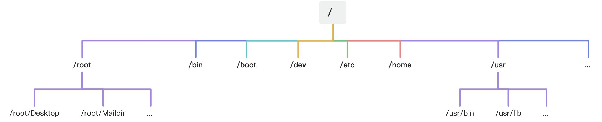

**笔记来源：**[**3天搞定Linux，1天搞定Shell，清华学神带你通关**](https://www.bilibili.com/video/BV1WY4y1H7d3?p=9&vd_source=e8046ccbdc793e09a75eb61fe8e84a30)

****

Linux 系统中一切皆文件 

# 535. Linux目录结构

+ /bin：是Binary的缩写，这个目录存放着最经常使用的命令
+ /sbin：s就是super user的意思，这里存放的是系统管理员使用的系统管理程序
+ /home：存放普通用户的主目录，在Linux中每一个用户都有一个自己的目录，一般改目录名是以用户的账号命名的
+ /root：该目录为系统管理员，也称作为超级权限者的用户主目录
+ /lib：系统开机所需要最基本的动态连接共享库，其作用类似于Windows里的DDL文件，几乎所有的应用程序都需要用到这些共享库。
+ /lost+found：这个目录一般情况下是空的，当系统非法关机后，这里就存放了一些文件
+ /etc：所有的系统管理所有的配置文件和子目录
+ /usr：这是一个非常重要的目录，用户的很多应用程序和文件都放在这个目录下，类似于windows下的program files目录
+ /boot：这里存放的是启动Linux时使用的一些核心文件，包括一些连接文件以及镜像文件，自己的安装别放这里。
+ /proc：这个目录是一个虚拟的目录，它是系统内存的映射，我们可以通过直接访问这个目录来获取系统信息。
+ /srv：service缩写，该目录存放一些服务启动之后需要提取的数据。
+ /sys：这是linux2.6内核的一个很大的变化。该目录下安装了2.6内核中新出现的一个文件系统sysfs。
+ /tmp：这个目录是用来存放一些临时文件的。
+ /dev：类似于windows的设备管理器，把所有的硬件用文件的形式存储。
+ /media(CentOS6)：linux系统会自动识别一些设备，例如U盘、光驱等等，当识别后，linux会把识别的设备挂载到这个目录下。CentOS7迁移到/run/media
+ /mnt：系统提供该目录是为了让用户临时挂载别的文件系统的，我们可以将外部的存储挂载在/mnt/上，然后进入该目录就可以查看里的内容了。
+ /opt：这是给主机额外安装软件所摆放的目录。比如你安装一个mysql数据库则就可以放到这个目录下。默认是空的。
+ /var：这个目录中存放着在不断扩充着的东西，我们习惯将那些经常被修改的目录放在这个目录下。包括各种日志文件。

 		

注意事项：

+ /bin：我们发现，这个根目录下的bin文件夹带一个旋转的箭头，其实这块类似于windows里的快捷方式一样，像一个超链接一样，指向的是usr/bin目录下

 	 

类似于的还有sbin、lib、lib64这三个目录也是一样的

[此处为语雀卡片，点击链接查看](https://www.yuque.com/chenguang201/ubmq0x/nruex8zg7nc5cc04#yDTHH)

