**笔记来源：**[**3天搞定Linux，1天搞定Shell，清华学神带你通关**](https://www.bilibili.com/video/BV1WY4y1H7d3?p=9&vd_source=e8046ccbdc793e09a75eb61fe8e84a30)

# 1 VMware3种网络工作模式
网络配置：VMware安装完成后会在宿主机上生成两块虚拟网卡，这两块网卡与虚拟机管理的两个虚拟交换机相连。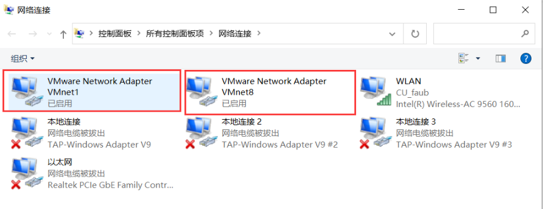

VMware管理了3个特殊的虚拟交换机：VMnet0（用于桥接模式），VMnet8（用于NAT模式），VMnet1（用于仅主机模式）。

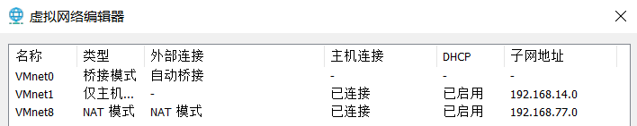

VMware提供了3种网络工作模式：

+ Bridged（桥接模式）
+ NAT（网络地址转换模式）
+ Host-Only（仅主机模式）

## 1.1 桥接模式：
虚拟机直接连接外部物理网络的模式，主机起到了网桥的作用。这种模式下，虚拟机可以直接访问外部网络，并且对外部网络是可见的。

将宿主机的网卡通过虚拟网桥与VMware管理的虚拟交换机VMnet0相连，所有网络连接设置为桥接模式的虚拟机都会连接到虚拟交换机VMnet0上。

这样所有的虚拟机与宿主机以及与宿主机在同一个局域网下的主机之间都是可以相互访问的。

在桥接模式下，虚拟机IP地址需要与宿主机在同一个网段，如果需要联网，则虚拟机的网关和DNS也需要与宿主机被桥接的网卡一致。

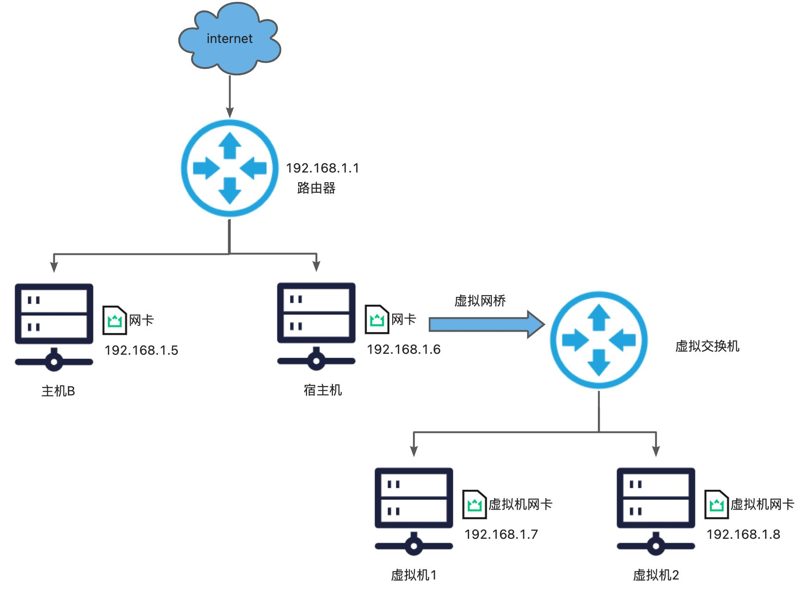

虚拟网桥会转发宿主机网卡接收到的广播和组播信息，以及目标为虚拟交换机网段的单播。所以，与虚拟交换机连接的虚拟网卡，如: eth0、ens33等能接收到路由器发出的DHCP信息及路由更新。

桥接模式是通过虚拟网桥将主机上的网卡与虚拟交换机VMnet0连接在一起，虚拟机上的虚拟网卡都连接在虚拟交换机VMnet0上，**在桥接模式下，虚拟机IP必须与宿主机的IP在同一网段且子网掩码、网关与DNS也要与宿主机网卡的一致。** 

桥接模式的虚拟机会占用宿主机所在局域网内的IP地址资源。如果宿主机所在局域网中做了IP地址管理，比如IP地址需要公司网络部门审批通过后才能使用，那么虚拟机的IP地址也会受此管理规则的约束。

补充知识点：

同一个交换机下连接的机器都是在同一个局域网内，IP地址都是在同一个网断内，所以可以相互通信。

比如我们通常见到的`192.168.x.x`，这些都是局域网的IP地址，是绑定在某一个路由器下面的。

比如：家里面的路由器，下面是电脑的ip地址和手机的ip地址。

电脑IP地址：

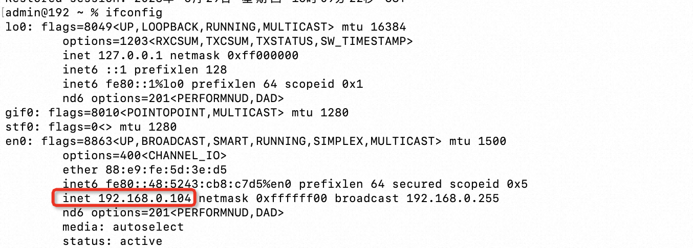

手机IP地址

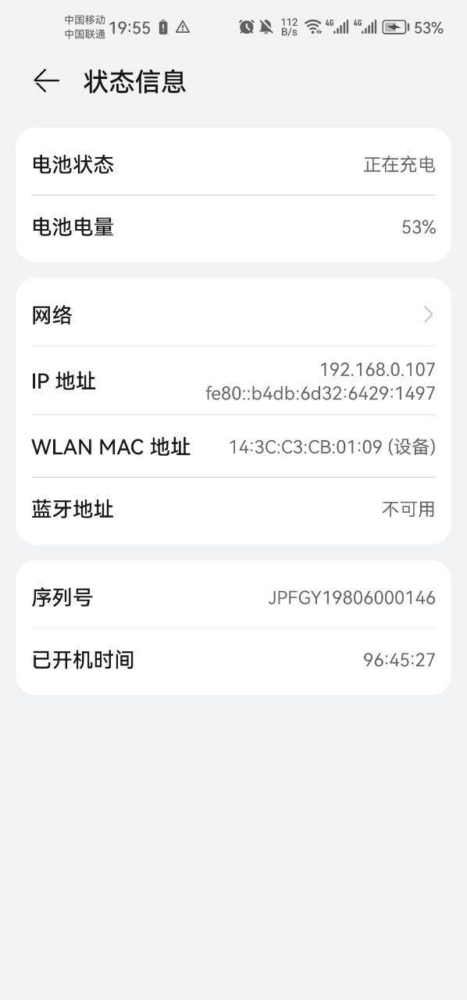

他们是在一个网段内的，所以他们之间的网络是通的。

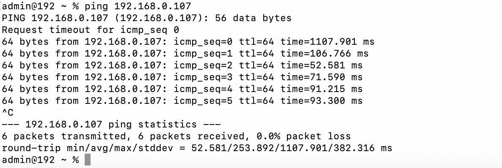

如果说要查看对外的IP地址，则是这样：

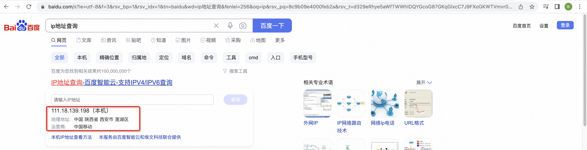

这个地址其实是路由器上面的地址。

## 1.2 NAT模式
虚拟机和主机构建一个专用网络，并通过虚拟网络地址转换（NAT）设备对IP进行转换。虚拟机通过共享主机IP可以访问外部网络，但外部网络无法访问虚拟机。

如果你的网络ip资源紧缺，但又希望虚拟机能够联网，NAT模式是最好的选择。

NAT模式借助虚拟NAT设备和虚拟DHCP服务器，使得虚拟机可以联网

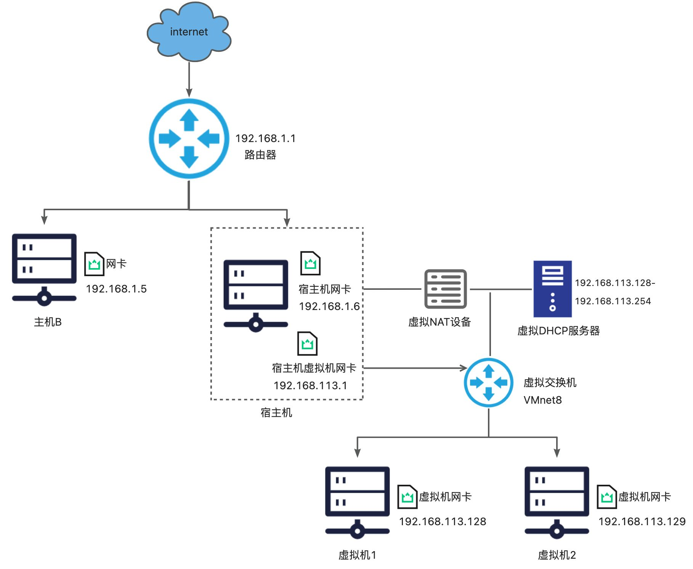

使用NAT 模式，就是让虚拟机借助 NAT（网络地址转换功能），通过宿主机所在的网络来访问互联网。

在虚拟机连接 Vmnet8 虚拟交换机时，虚拟机会将虚拟 NAT 设备及虚拟 DHCP 服务器连接到 Vmnet8 虚拟交换机上。依靠虚拟的 NAT 设备及虚拟的 DHCP 设备，如果你的宿主机已经联网了，那么你的虚拟机也就可以联网。

同时宿主机上的虚拟网卡`VMwareNetwork Adapter VMnet8` 也会连接到 Vmnet8 虚拟交换机上，用于宿主机和虚拟机的通信。如果禁用掉宿主机上的虚拟网卡`VMwareNetwork Adapter VMnet8`  ，虚拟机仍然是可以上网的，**只是宿主无法再访问 VMnet8 网段下的虚拟机了，但是虚拟机仍然可以访问宿主机。** 

虚拟网卡`VMwareNetwork Adapter VMnet8`   只是作为主机与虚拟机通信的接口，虚拟机并不是依靠虚拟网卡`VMware Network Adapter VMnet8` 来联网的。

由于NAT服务协议对外部网络隐蔽内部网络，因此虚拟机可以通过NAT服务器访问宿主机所在局域网内的其他真实主机，但这些真实主机且不能反过来访问虚拟机。因为虚拟机所在的网段是一个独立的局域网。

## 1.3 仅主机模式
虚拟机只与主机共享一个专用网络，与外部网络无法通信。

仅主机模式就是 NAT 模式去掉了虚拟 NAT 设备，使虚拟机无法与公网进行通信，而宿主机使用虚拟网卡`VMware Network Adapter VMnet1` 连接 VMnet1 虚拟交换机来与虚拟机进行通信。

仅主机模式将虚拟机与公网隔开，使虚拟机成为一个独立的系统，只能与宿主机相互通讯。

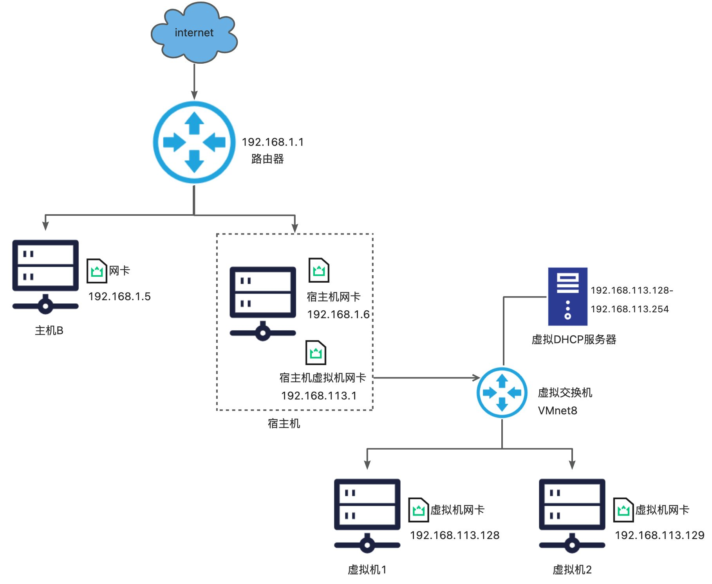

仅主机模式通过宿主机的虚拟网卡`VMwareNetwork Adapter VMnet1` 来连接虚拟交换机 VMnet1，来达到宿主机与虚拟机通信的目的，但是虚拟机不能主动与宿主机通信，是单向连通的。

如果想要在仅主机模式下联网，可以将能联网的主机网卡共享给`VMware Network Adapter VMnet1` ，这样就可以实现虚拟机联网。

## 1.4 三者区别
它们主要的区别在于网络接入方式和网络拓扑结构。

+ 桥接模式（Bridge Mode）：桥接模式是指虚拟机与物理网络之间采用直接相连的方式，虚拟机可以直接获得物理网络中的IP地址。在桥接模式下，虚拟机可以被看作是网络中的一个独立主机，可以直接访问网络中的其他主机，也可以被其他主机访问。桥接模式适用于需要在虚拟机中搭建Web服务器或其他需要对外进行访问的服务的场景。
+ NAT模式（Network Address Translation Mode）：NAT模式是指虚拟机与物理网络之间采用一种类似于路由器的方式**进行连接，虚拟机获得的是虚拟网络中的IP地址，** 虚拟机无法直接被物理网络中的其他主机访问，但可以通过端口转发的方式让外部主机访问虚拟机中的服务。NAT模式适用于需要在虚拟机中运行一些内部服务或进行一些测试工作的场景。
+ 仅主机模式（Host Only Mode）：仅主机模式是指虚拟机与物理网络之间不进行连接，虚拟机只能通过主机上另一个虚拟网卡进行通信，虚拟机获得的是虚拟网络中的IP地址。在仅主机模式下，虚拟机只能与主机进行通信，无法与物理网络中的其他主机进行通信。仅主机模式适用于需要在虚拟机中运行一些与外部网络完全隔离的服务或进行一些内部测试的场景。

总的来说，这三种网络模式主要区别在于虚拟机与物理网络的连接方式和网络拓扑结构。需要根据实际业务需求来选择合适的网络模式。

# 2 查看网络IP和网关
1.  查看虚拟网络编辑器
2.  修改虚拟网卡 **Ip**
3.  查看网关
4.  查看 **windows **环境的中 **VMnet8 ** 网络配置

# 3 配置静态网络 ip 地址
## 3.1 查看IP地址
```shell
ifconfig  # (功能描述:显示所有网络接口的配置信息)
```

案例实操：查看当前网络 ip 

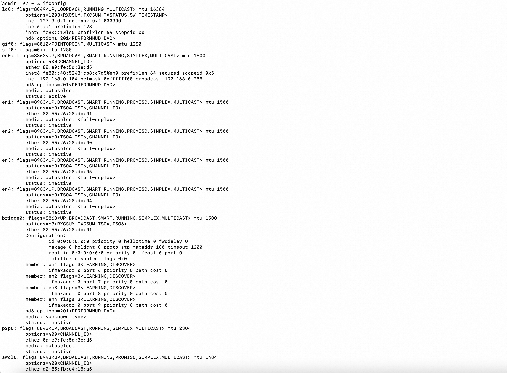

## 3.2 测试主机之间网络连通性 
基本语法 

```shell
ping 目的主机  #(功能描述:测试当前服务器是否可以连接目的主机)
```

 案例实操：测试当前服务器是否可以连接百度

```powershell
ping www.baidu.com
```

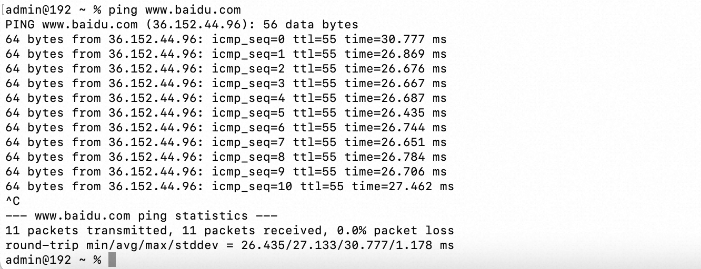

## 3.3 修改 IP 地址
1. 查看 IP 配置文件

   ```shell
   vim /etc/sysconfig/network-scripts/ifcfg-ens33 
   ```

   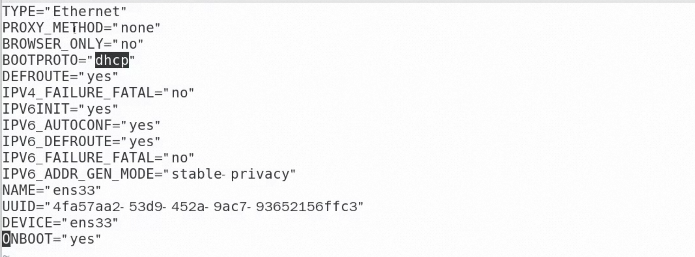可见，是有dhcp动态分配的，这样的情况会导致每次重启服务器后，可能分配的IP地址都会变化，导致我们在其他地方连接的时候，不能以一个固定的IP地址去连接。	


2. 以下标红的项必须修改，有值的按照下面的值修改，没有该项的要增加。 

   ```shell
   TYPE="Ethernet" #网络类型(通常是 Ethemet) PROXY_METHOD="none"
   BROWSER_ONLY="no"

   # 这行需要修改
   BOOTPROTO="static" #IP的配置方法[none|static|bootp|dhcp](引导时不使用协议|静态分配IP|BOOTP协议|DHCP协议) DEFROUTE="yes"

   IPV4_FAILURE_FATAL="no"
   IPV6INIT="yes"
   IPV6_AUTOCONF="yes"
   IPV6_DEFROUTE="yes"
   IPV6_FAILURE_FATAL="no"
   IPV6_ADDR_GEN_MODE="stable-privacy"
   NAME="ens33"
   UUID="e83804c1-3257-4584-81bb-660665ac22f6" #随机 id DEVICE="ens33" #接口名(设备,网卡)
   ONBOOT="yes" #系统启动的时候网络接口是否有效(yes/no)

   # 下面的三行需要新加
   #IP 地址 
   IPADDR=192.168.1.100
   #网关
   GATEWAY=192.168.1.2
   #域名解析器
   DNS1=192.168.1.2
   ```

   修改后如下图：

   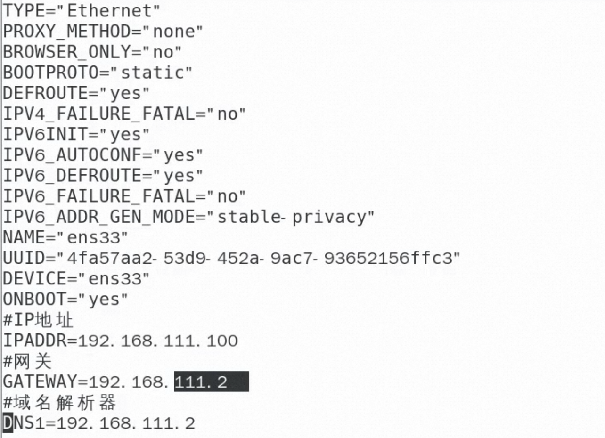

    IP修改后 编辑完后，按键盘 `esc` ，然后输入 `:wq`回车即可。 

 3. 执行命令重启网络

    ```shell
    service network restart
    ```

4. 修改 **IP ** 地址后可能会遇到的问题 
    - 物理机能 ping 通虚拟机，但是虚拟机 ping 不通物理机,一般都是因为物理机的 防火墙问题,把防火墙关闭就行 

    - 虚拟机能 Ping 通物理机,但是虚拟机 Ping 不通外网,一般都是因为 DNS 的设置有 问题 

    - 虚拟机`ping  www.baidu.com` 显示域名未知等信息,一般查看 GATEWAY 和 DNS 设 置是否正确 

    - 如果以上全部设置完还是不行，需要关闭 NetworkManager 服务

      ```shell
      systemctl stop NetworkManager #关闭
      systemctl disable NetworkManager #禁用
      ```

      如果检查发现 `systemctl status network` 有问题 需要检查 ifcfg-ens33 文件


# 4 配置主机名 
## 4.1 修改主机名称 
查看主机名称

```powershell
hostname  # (功能描述:查看当前服务器的主机名称) 
```

案例实操：查看当前服务器主机名称 

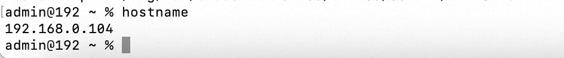 					

如果感觉此主机名不合适，我们可以进行修改。通过编辑`/etc/hostname`文件 

```powershell
vi /etc/hostname
```

修改完成后重启生效。 

## 4.2 修改 hosts 映射文件 
**修改 linux 的主机映射文件（hosts 文件）：** 后续虚拟机比较多，配置时通常会采用主机名的方式配置，比较简单方便。不用刻意记 ip 地址。 

1. 打开 /etc/hosts

   ```shell
   vim /etc/hosts 
   ```


2. 添加如下内容 

   ```shell
   192.168.2.100 hadoop100
   192.168.2.101 hadoop101
   192.168.2.102 hadoop102
   192.168.2.103 hadoop103
   192.168.2.104 hadoop104
   192.168.2.105 hadoop105
   ```


3. 重启设备，重启后，查看主机名，已经修改成功


**修改 windows 的主机映射文件（hosts 文件）** 

1. 进入 `C:\Windows\System32\drivers\etc` 路径

2. 打开 hosts 文件并添加如下内容

   ```shell
   192.168.2.100 hadoop100
   192.168.2.101 hadoop101
   192.168.2.102 hadoop102
   192.168.2.103 hadoop103
   192.168.2.104 hadoop104
   192.168.2.105 hadoop105
   ```


3. 修改 window10 的主机映射文件(hosts 文件) 
    1. 进入 `C:\Windows\System32\drivers\etc` 路径 
    2. 拷贝 hosts 文件到桌面
    3. 打开桌面 hosts 文件并添加如下内容 
    4. 将桌面 hosts 文件覆盖 `C:\Windows\System32\drivers\etc` 路径 hosts 文件 
    5. 因为可能没有权限直接修改，所以需要以上操作

# 5 远程登录 
通常在工作过程中，公司中使用的真实服务器或者是云服务器，都不允许除运维人员 之外的员工直接接触，因此就需要通过远程登录的方式来操作。所以，远程登录工具就是必不可缺的，目前比较主流的有 Xshell，SSH Secure Shell，SecureCRT，FinalShell 等，可以根据自己的习惯自行选择。

 				

 			

 		

 	 

 				

 			

 		

 	 

