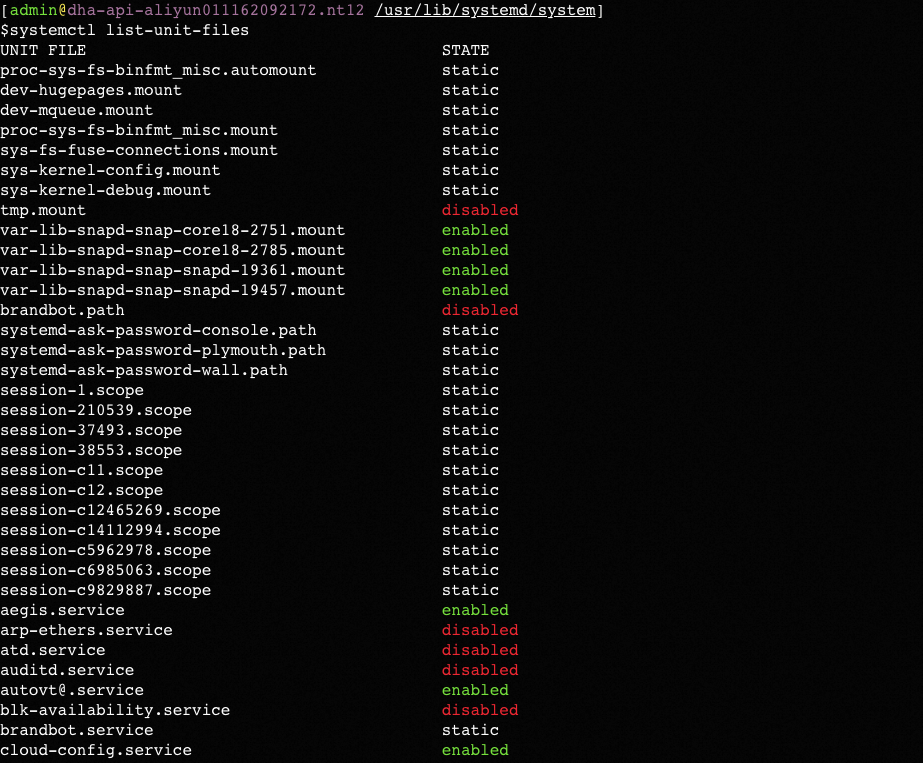

**笔记来源：**[**3天搞定Linux，1天搞定Shell，清华学神带你通关**](https://www.bilibili.com/video/BV1WY4y1H7d3?p=9&vd_source=e8046ccbdc793e09a75eb61fe8e84a30)

# 1 Linux 中的进程和服务 
计算机中，一个正在执行的程序或命令，被叫做进程（process）。 

启动之后一只存在、常驻内存的进程，一般被称作服务（service）。 

# 2 service 服务管理【CentOS 6 版本】
基本语法

```powershell
service 服务名 start | stop | restart | status 
```

经验技巧：查看服务的方法：`/etc/init.d/服务名`，其中d是Daemon的意思，意为守护线程的意思，发现只有两个服务保留在 service。


案例实操 

>查看网络服务的状态
>
>```shell
>service network status
>```
>停止网络服务
>
>```shell
>service network stop
>```
>启动网络服务
>
>```shell
>service network start 
>```
>重启网络服务
>
>```shell
>service network restart 
>```

# 3 chkconfig 设置后台服务的自启配置【CentOS 6 版本】
基本语法 

```powershell
chkconfig  			 	# (功能描述:查看所有服务器自启配置) 
chkconfig 服务名 off 	  #(功能描述:关掉指定服务的自动启动) 
chkconfig 服务名 on  	  #(功能描述:开启指定服务的自动启动) 				
chkconfig 服务名  --list #(功能描述:查看服务开机启动状态) 
```


**其中的`1 2 3 4 5 6`为系统运行级**


案例实操

>开启/关闭 network(网络)服务的自动启动
>
>```shell
>chkconfig network on 
>chkconfig network off
>```
>
>开启/关闭 network 服务指定级别的自动启动 
>
>```shell
>chkconfig --level 指定级别 network on
>chkconfig --level 指定级别 network off 
>```

# 4 systemctl 【CentOS 7 版本】
语法

```powershell
systemctl start | stop | restart | status 服务名 
```

经验技巧：查看服务的方法 `/usr/lib/systemd/system`


案例实操 

>查看防火墙服务的状态
>
>```shell
>systemctl status firewalld
>```
>
>停止防火墙服务
>
>```shell
>systemctl stop firewalld 
>```
>
>启动防火墙服务
>
>```shell
>systemctl start firewalld 
>```
>
>重启防火墙服务
>
>```shell
>systemctl restart firewalld 
>```

# 5 systemctl 设置后台服务的自启配置 
基本语法 

```powershell
systemctl list-unit-files  #(功能描述:查看服务开机启动状态) 
systemctl disable service_name #(功能描述:关掉指定服务的自动启动) 			
systemctl enable service_name #(功能描述:开启指定服务的自动启动) 
```



案例实操：开启/关闭 iptables（防火墙）服务的自动启动 

```powershell
systemctl enable firewalld.service
systemctl disable firewalld.service 
```

其中`d` 是Daemon的意思，意为守护线程的意思

# 6 系统运行级别
Linux 运行级别【CentOS 6】如图 ：


**CentOS7 **的运行级别简化为**：**

+ `multi-user.target ` 等价于原运行级别3（多用户有网，无图形界面）
+ `graphical.target` 等价于原运行级别 5（多用户有网，有图形界面）


查看当前运行级别

```powershell
systemctl get-default 
```


修改当前运行级别

```powershell
systemctl set-default TARGET.target #(这里 TARGET 取 multi-user 或者 graphical) 
```

# 7 关闭防火墙 
临时关闭防火墙 

```powershell
# 查看防火墙状态
systemctl status firewalld 
 					
# 临时关闭防火墙
systemctl stop firewalld 
```

开机启动时关闭防火墙 

```powershell
# 查看防火墙开机启动状态
systemctl enable firewalld.service 
 					
# 设置开机时关闭防火墙
systemctl disable firewalld.service 
```

# 8 关机重启命令
在 linux 领域内大多用在服务器上，很少遇到关机的操作。毕竟服务器上跑一个服务是**永无止境的，除非特殊情况下，不得已才会关机。** 

基本语法

```powershell
sync  #(功能描述:将数据由内存同步到硬盘中)
halt  #(功能描述:停机，关闭系统，但不断电) 
poweroff  #(功能描述:关机，断电)
reboot   # (功能描述:就是重启，等同于 shutdown -r now) 

shutdown [选项] 时间 
  	# 其中选项和时间可为：
	# -H 相当于--halt，停机 
    # -r -r=reboot 重启 
    # now 立刻关机
    # 时间 等待多久后关机(时间单位是分钟)。 
```

经验技巧：Linux 系统中为了提高磁盘的读写效率，对磁盘采取了【预读迟写】操作方式。当用户保存文件时，Linux 核心并不一定立即将保存数据写入物理磁盘中，而是将数据保存在缓 冲区中，等缓冲区满时再写入磁盘，这种方式可以极大的提高磁盘写入数据的效率。但是也带来了安全隐患，如果数据还未写入磁盘时，系统掉电或者其他严重问题出现，则将导致数据丢失。使用 sync 指令可以立即将缓冲区的数据写入磁盘。 

案例实操 

```powershell
# 将数据由内存同步到硬盘中
sync 

# 重启
reboot 

# 停机(不断电)
halt 

# 计算机将在 1 分钟后关机，并且会显示在登录用户的当前屏幕
shutdown -h 1 

# 立马关机(等同于 poweroff) 
shutdown -h now 

# 系统立马重启(等同于 reboot)
shutdown -r now 
```

