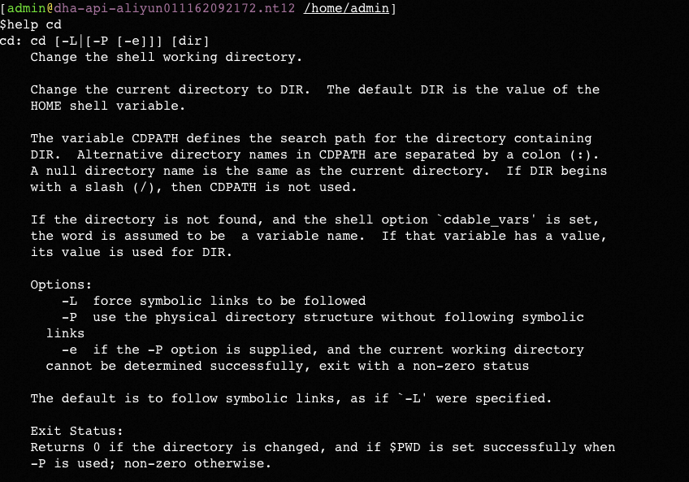
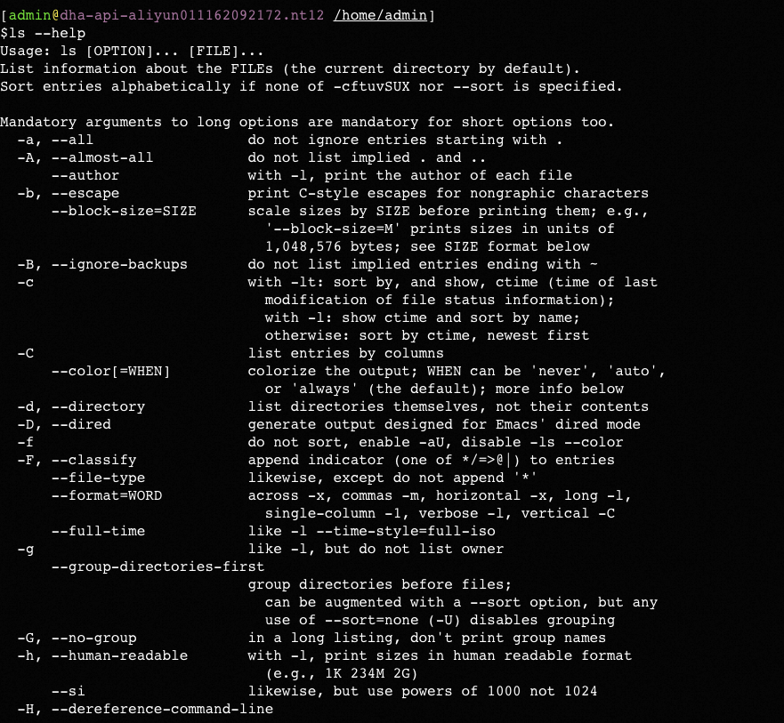

**笔记来源：**[**3天搞定Linux，1天搞定Shell，清华学神带你通关**](https://www.bilibili.com/video/BV1WY4y1H7d3?p=9&vd_source=e8046ccbdc793e09a75eb61fe8e84a30)


# 1 帮助命令
## 1.1 man命令获取帮助信息
基本语法

```powershell
man [命令或配置文件] # (功能描述:获得帮助信息)  		
```

显示说明 

| 信息            | 功能           |
| ------------- | ------------ |
| `NAME`        | 命令的名称和单行描述   |
| `SYNOPSIS`    | 怎样使用命令       |
| `DESCRIPTION` | 命令功能的深入讨论    |
| `EXAMPLES`    | 怎样使用命令的例子    |
| `SEE ALSO`    | 相关主题(通常是手册页) |


案例实操：查看 ls 命令的帮助信息

```powershell
man ls  
```

```powershell
LS(1)                                                                                    User Commands                                                                                   LS(1)

NAME
       ls - list directory contents

SYNOPSIS
       ls [OPTION]... [FILE]...

DESCRIPTION
       List information about the FILEs (the current directory by default).  Sort entries alphabetically if none of -cftuvSUX nor --sort is specified.

       Mandatory arguments to long options are mandatory for short options too.

       -a, --all
              do not ignore entries starting with .

       -A, --almost-all
              do not list implied . and ..

       --author
              with -l, print the author of each file

       -b, --escape
              print C-style escapes for nongraphic characters

       --block-size=SIZE
              scale sizes by SIZE before printing them; e.g., '--block-size=M' prints sizes in units of 1,048,576 bytes; see SIZE format below

       -B, --ignore-backups
              do not list implied entries ending with ~

       -c     with -lt: sort by, and show, ctime (time of last modification of file status information); with -l: show ctime and sort by name; otherwise: sort by ctime, newest first

       -C     list entries by columns

       --color[=WHEN]
              colorize the output; WHEN can be 'never', 'auto', or 'always' (the default); more info below

       -d, --directory
              list directories themselves, not their contents

       -D, --dired
              generate output designed for Emacs' dired mode

       -f     do not sort, enable -aU, disable -ls --color

       -F, --classify
              append indicator (one of */=>@|) to entries

       --file-type
              likewise, except do not append '*'

       --format=WORD
              across -x, commas -m, horizontal -x, long -l, single-column -1, verbose -l, vertical -C

       --full-time
              like -l --time-style=full-iso

       -g     like -l, but do not list owner

       --group-directories-first
              group directories before files;

              can be augmented with a --sort option, but any use of --sort=none (-U) disables grouping

       -G, --no-group
              in a long listing, don't print group names

       -h, --human-readable
              with -l, print sizes in human readable format (e.g., 1K 234M 2G)

       --si   likewise, but use powers of 1000 not 1024

       -H, --dereference-command-line
              follow symbolic links listed on the command line

       --dereference-command-line-symlink-to-dir
              follow each command line symbolic link

              that points to a directory

       --hide=PATTERN
              do not list implied entries matching shell PATTERN (overridden by -a or -A)

       --indicator-style=WORD
              append indicator with style WORD to entry names: none (default), slash (-p), file-type (--file-type), classify (-F)

       -i, --inode
              print the index number of each file

       -I, --ignore=PATTERN
              do not list implied entries matching shell PATTERN

       -k, --kibibytes
              default to 1024-byte blocks for disk usage

       -l     use a long listing format

       -L, --dereference
              when showing file information for a symbolic link, show information for the file the link references rather than for the link itself

       -m     fill width with a comma separated list of entries

       -n, --numeric-uid-gid
              like -l, but list numeric user and group IDs

       -N, --literal
              print raw entry names (don't treat e.g. control characters specially)

       -o     like -l, but do not list group information

       -p, --indicator-style=slash
              append / indicator to directories

       -q, --hide-control-chars
              print ? instead of nongraphic characters

       --show-control-chars
              show nongraphic characters as-is (the default, unless program is 'ls' and output is a terminal)

       -Q, --quote-name
              enclose entry names in double quotes

       --quoting-style=WORD
              use quoting style WORD for entry names: literal, locale, shell, shell-always, c, escape

       -r, --reverse
              reverse order while sorting

       -R, --recursive
              list subdirectories recursively

       -s, --size
              print the allocated size of each file, in blocks

       -S     sort by file size

       --sort=WORD
              sort by WORD instead of name: none (-U), size (-S), time (-t), version (-v), extension (-X)

       --time=WORD
              with -l, show time as WORD instead of default modification time: atime or access or use (-u) ctime or status (-c); also use specified time as sort key if --sort=time

       --time-style=STYLE
              with  -l,  show  times  using style STYLE: full-iso, long-iso, iso, locale, or +FORMAT; FORMAT is interpreted like in 'date'; if FORMAT is FORMAT1<newline>FORMAT2, then FORMAT1
              applies to non-recent files and FORMAT2 to recent files; if STYLE is prefixed with 'posix-', STYLE takes effect only outside the POSIX locale

       -t     sort by modification time, newest first

       -T, --tabsize=COLS
              assume tab stops at each COLS instead of 8

       -u     with -lt: sort by, and show, access time; with -l: show access time and sort by name; otherwise: sort by access time

       -U     do not sort; list entries in directory order

       -v     natural sort of (version) numbers within text

       -w, --width=COLS
              assume screen width instead of current value

       -x     list entries by lines instead of by columns

       -X     sort alphabetically by entry extension

       -1     list one file per line

       SELinux options:

       --lcontext
              Display security context.   Enable -l. Lines will probably be too wide for most displays.

       -Z, --context
              Display security context so it fits on most displays.  Displays only mode, user, group, security context and file name.

       --scontext
              Display only security context and file name.

       --help display this help and exit

       --version
              output version information and exit

       SIZE is an integer and optional unit (example: 10M is 10*1024*1024).  Units are K, M, G, T, P, E, Z, Y (powers of 1024) or KB, MB, ... (powers of 1000).

       Using color to distinguish file types is disabled both by default and with --color=never.  With --color=auto, ls emits color codes only when standard output is connected to  a  termi‐
       nal.  The LS_COLORS environment variable can change the settings.  Use the dircolors command to set it.

   Exit status:
       0      if OK,

       1      if minor problems (e.g., cannot access subdirectory),

       2      if serious trouble (e.g., cannot access command-line argument).

       GNU coreutils online help: <http://www.gnu.org/software/coreutils/> Report ls translation bugs to <http://translationproject.org/team/>

AUTHOR
       Written by Richard M. Stallman and David MacKenzie.

COPYRIGHT
       Copyright © 2013 Free Software Foundation, Inc.  License GPLv3+: GNU GPL version 3 or later <http://gnu.org/licenses/gpl.html>.
       This is free software: you are free to change and redistribute it.  There is NO WARRANTY, to the extent permitted by law.

SEE ALSO
       The full documentation for ls is maintained as a Texinfo manual.  If the info and ls programs are properly installed at your site, the command

              info coreutils 'ls invocation'

       should give you access to the complete manual.

GNU coreutils 8.22                                                                       December 2015                                                                                   LS(1)
```

**man命令只能用于外部命令** 

## 1.2 help 获得 shell 内置命令的帮助信息 
 一部分基础功能的系统命令是直接内嵌在 shell 中的，系统加载启动之后会随着 shell 一起加载，常驻系统内存中。这部分命令被称为**内置(built-in)命令，** 相应的其它命令被称为**外部命令。**  

基本语法

```powershell
help 命令  #(功能描述:获得 shell 内置命令的帮助信息) 
```

案例实操：查看 cd 命令的帮助信息 

```powershell
help cd 
```

 

以上是help用与内置shell命令的用法。

除此之外，外部命令也可以用于help命令，不过是这样用

```powershell
命令 --help
```

案例操作

```powershell
ls --help
```

 

那么，如果判断一个命令是外部命令还是内部命令呢？

语法：

```powershell
type 命令
```

 案例操作

```powershell
type ls  # 查看ls命令类型
type cd  # 查看cd命令类型
type type  # 查看type命令类型
```


可见，cd 和 type 命令都是shell内置命令

## 1.3 常用快捷键
| 常用快捷键     | 功能                       |
| --------- | ------------------------ |
| ctrl + c  | 停止进程                     |
| ctrl+l    | 清屏，等同于 clear；彻底清屏是：reset |
| 善于用 tab 键 | 提示（更重要的是可以防止敲错）          |
| 上下键       | 查找执行过的命令                 |


 				

 			

 		

 	 

