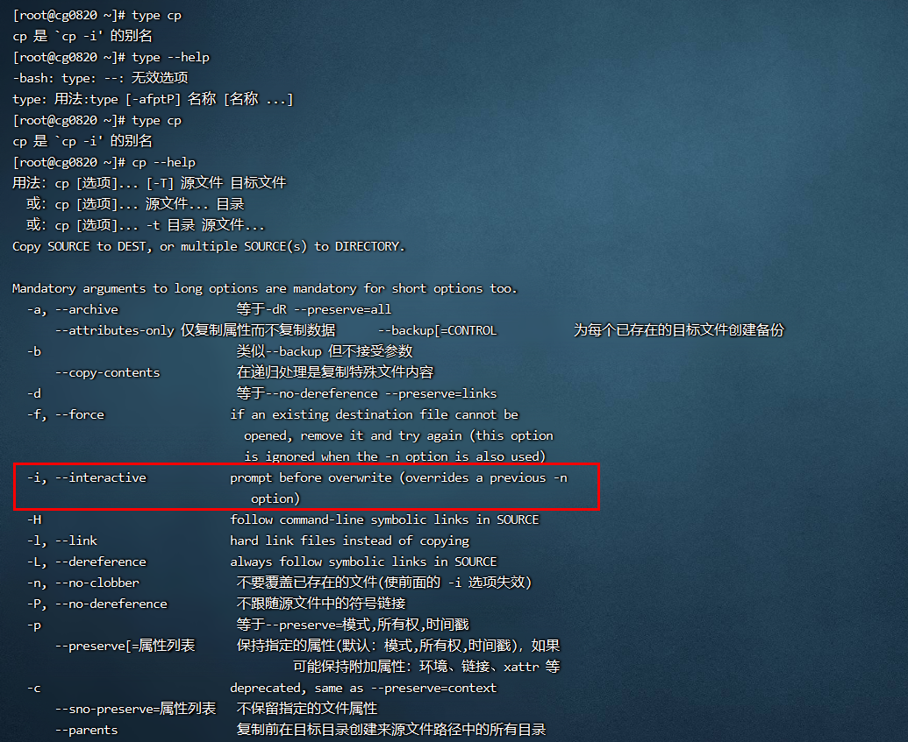

**<font style="color:#DF2A3F;">笔记来源：</font>**[**<font style="color:#DF2A3F;">3天搞定Linux，1天搞定Shell，清华学神带你通关</font>**](https://www.bilibili.com/video/BV1WY4y1H7d3?p=9&vd_source=e8046ccbdc793e09a75eb61fe8e84a30)

# 1 目录操作
## 1.1 pwd 
显示当前工作目录的绝对路径 

pwd：print working directory 打印工作目录 

基本语法

```powershell
pwd  #(功能描述:显示当前工作目录的绝对路径)
```

案例实操：显示当前工作目录的绝对路径 

```powershell
pwd
```


## 1.2 ls 					
ls：list 列出目录内容 

****基本语法 

```powershell
ls [选项] [目录或是文件]
```

选项说明

+ `-a`：全部的文件，连同隐藏档（开头为`.`的文件）一起列出来（常用）
+ `-l`：长数据串列出，包含文件的属性与权限等等数据;(常用)等价于`ll`
    - 显示说明：每行列出的信息依次是：【<font style="color:#000000;">文件类型与权限】【链接数】【文件属主】【文件属组】【文件大小用byte来表示】【建立或最近修改的时间】【名字】</font>

案例实操：查看当前目录的所有内容信息 

```powershell
ls -al
```

 

## 1.3 cd 
切换目录 

cd：change directory 切换路径 

基本语法

```powershell
cd [参数] 
```

参数说明

| 参数 | 功能  |
| --- | --- |
| cd 绝对路径 | 切换路径 |
| cd 相对路径 | 切换路径 |
| `cd ~`或者 `cd` | 回到自己的家目录 |
| `cd -` | 回到上一次所在目录 |
| `cd ..` | 回到当前目录的上一级目录 |
| `cd -P` | 跳转到实际物理路径，而非快捷方式路径  |


案例实操 

```powershell
# 551. 使用绝对路径切换到 root 目录 
cd /root/ 
 					
# 552. 使用相对路径切换到“公共的”目录 
cd 公共的/ 
 					
# 553. 表示回到自己的家目录，亦即是 /root 这个目录 
cd ~ 
 					
# 554. cd- 回到上一次所在目录 
cd - 
 					
# 555. 表示回到当前目录的上一级目录，亦即是 “/root/公共的”的上一级目录的意思; 
cd .. 
```

## 1.4 mkdir 
创建一个新的目录 

<font style="color:rgb(20.000000%, 20.000000%, 20.000000%);">mkdir：make directory 建立目录 </font>

****基本语法 

```powershell
mkdir [选项] 要创建的目录
```

选项说明 

+ `-p` 创建多层目录 

案例实操 

+ 创建一个目录

```powershell
[root@hadoop101 ~]# mkdir xiyou
[root@hadoop101 ~]# mkdir xiyou/mingjie
# 556. 这样操作必须先创建xiyou目录，才能在xiyou目录下面创建mingjie目录
```


+ 创建一个多级目录

```powershell
mkdir -p xiyou/dssz/meihouwang
# 557. 加上-p 参数，就算父目录不存在，也是可以创建的
# 558. 也可以下面这样操作,先创建a，在a下面创建b，在b下面创建c
mkdir a a/b a/b/c
```


## 1.5 rmdir 
删除一个空的目录 

rmdir<font style="color:rgb(20.000000%, 20.000000%, 20.000000%);">：remove directory 移除目录 </font>

基本语法

```powershell
rmdir 要删除的空目录
```

 案例实操

```powershell
# 559. 删除一个空的文件夹
rmdir xiyou/mingjie

# 560. 删除子文件夹以及父文件夹，
# 561. 注意加上-p这个参数，删除最底层的meihouwang目录，删完之后如果dssz目录为空，则删除dssz目录，删除完dssz，如果xiyou目录为空，则删除xiyou目录
rmdir -p xiyou/dssz/meihouwang/
# 562. 也可以这样操作
rmdir a/b/c/ a/b/ a
# 563. 先删除a下面的b的下面的c，再删除a下面的b，最后删除a
```

 


# 2 文件操作			
## 2.1 touch 
创建空文件 

基本语法

```powershell
touch 文件名称 
```

案例实操

```powershell
touch xiyou/dssz/sunwukong.txt 
```

## 2.2 cp 
复制文件或目录 

基本语法

```powershell
cp [选项] source dest  #(功能描述:复制source文件到dest) 
```

选项说明 

+ `-r` 递归复制整个文件夹 

****参数说明 

+ source：源文件 
+ dest：目标文件 

经验技巧：强制覆盖不提示的方法：`\cp`因为这样执行的是原生命令

 		

案例实操

```yaml
# 564. 复制文件
 cp xiyou/dssz/suwukong.txt xiyou/mingjie/
 
#递归复制整个文件夹
cp -r xiyou/dssz/ ./ 
```

## 2.3 rm 
删除文件或目录 

基本语法

```yaml
rm [选项] deleteFile  # (功能描述:递归删除目录中所有内容)  
```

选项说明

+ `-r` 递归删除目录中所有内容
+ `-f` 强制执行删除操作，而不提示用于进行确认。 
+ `-v` 显示指令的详细执行过程 

案例实操 

```powershell
# 565. 删除目录中的内容
rm xiyou/mingjie/sunwukong.txt

# 566. 递归删除目录中所有内容
rm -rf dssz/ 
```

## 2.4 mv
移动文件与目录或重命名 

基本语法

```powershell
mv oldNameFile newNameFile 				# (功能描述:重命名) 
mv /temp/movefile /targetFolder 	#(功能描述:移动文件) 
```

案例实操

```powershell
# 567. (1)重命名
mv xiyou/dssz/suwukong.txt xiyou/dssz/houge.txt 
 					
# 568. (2)移动文件
mv xiyou/dssz/houge.txt ./ 
```

## 2.5 cat 
查看文件内容，从第一行开始显示。  					

基本语法

```powershell
cat [选项] 要查看的文件 
```

选项说明 

+ `-n` 显示所有行的行号，包括空行。 

经验技巧：一般查看比较小的文件，一屏幕能显示全的。 

案例实操

```powershell
# 569. 查看文件内容并显示行号 
cat -n houge.txt  		
```

## 2.6 more 
文件内容分屏查看器

more 指令是一个基于 VI 编辑器的文本过滤器，它以全屏幕的方式按页显示文本文件的内容。more 指令中内置了若干快捷键，详见操作说明。

基本语法

```powershell
more 要查看的文件
```

 操作说明

| 操作 | 功能描述  |
| --- | --- |
| 空白键 (space) | 代表向下翻一页 |
| Enter | 代表向下翻『一行』 |
| q | 代表立刻离开 more ，不再显示该文件内容。 |
| Ctrl+F  | 向下滚动一屏  |
| Ctrl+B | 返回上一屏 |
| =  | 输出当前行的行号 |
| :f | 输出文件名和当前行的行号  |


案例实操

```powershell
# 570. 采用more查看文件 
more smartd.conf  	
```

## 2.7 less 
分屏显示文件内容 

less 指令用来分屏查看文件内容，它的功能与 more 指令类似，但是比 more 指令更加 强大，支持各种显示终端。less 指令在显示文件内容时，并不是一次将整个文件加载之后才显示，而是根据显示需要加载内容，对于显示大型文件具有较高的效率。 

基本语法

```powershell
less 要查看的文件 
```

操作说明

| 操作 | 功能说明 |
| --- | --- |
| 空白键 | 向下翻动一页; |
| [pagedown] | 向下翻动一页 |
| [pageup]  | 向上翻动一页; |
| /字串 | 向下搜寻『字串』的功能：n：向下查找；N：向上查找； |
| ?字串 | 向上搜寻『字串』的功能：n：向上查找；N:向下查找； |
| q | 离开 less 这个程序;  |


经验技巧：用SecureCRT时`[pagedown]`和`[pageup]`可能会出现无法识别的问题。 

案例实操

```powershell
# 571. (1)采用less查看文件 
less smartd.conf  
```

## 2.8 echo 				
echo 输出内容到控制台 

基本语法

```powershell
echo [选项] [输出内容]
```

选项：

+ `-e`：支持反斜线控制的字符转换 

| 控制字符 | 作用 |
| --- | --- |
| `\\` | 输出\本身 |
| `
` | 换行符  |
| `\t` | 制表符，也就是 Tab 键 |


案例实操

```powershell
echo "hello\tworld"
echo -e "hello\tworld"
```


## 2.9 head 
显示文件头部内容 

head 用于显示文件的开头部分内容，默认情况下 head 指令显示文件的前 10 行内容。

基本语法

```powershell
head 文件   # (功能描述:查看文件头10行内容)
head -n 5 文件 #  (功能描述:查看文件头5行内容，5可以是任意行数) 
```

选项说明 

+  `-n <行数>`：<font style="color:rgb(0,0,0);">指定显示头部内容的行数</font>

案例实操

```powershell
# 572. 查看文件的头2行
head -n 2 smartd.conf 
```

## 2.10 tail 
输出文件尾部内容 

tail 用于输出文件中尾部的内容，默认情况下 tail 指令显示文件的后 10 行内容。 

****基本语法 

```powershell
tail 文件  # (功能描述:查看文件尾部10行内容) 
tail -n 5 文件 # (功能描述:查看文件尾部5行内容，5可以是任意行数) 
tail -f 文件  # (功能描述:实时追踪该文档的所有更新) 
```

选项说明 

+ `-n <行数>`：  输出文件尾部 n 行内容 
+ `-f`： 显示文件最新追加的内容，监视文件变化

案例实操 

```powershell
# 573. (1)查看文件尾 1 行内容
tail -n 1 smartd.conf 
 					
# 574. (2)实时追踪该档的所有更新
tail -f houge.txt 
```

## 2.11  > 和 >> 
`>`：**<font style="color:rgb(0,0,0);">输出重定向</font>**

`**<font style="color:rgb(0,0,0);">>></font>**`**<font style="color:rgb(0,0,0);">：</font>**追加 

基本语法

```powershell
ls -l > 文件 # (功能描述:列表的内容写入文件a.txt中(覆盖写)) 
ls-al >> 文件 # (功能描述:列表的内容追加到文件aa.txt的末尾) 
cat 文件1 > 文件2  # (功能描述:将文件1的内容覆盖到文件2) 
echo "内容" >> 文件 
```

案例实操 

```powershell
# 575. (1)将 ls 查看信息写入到文件中 
ls -l>houge.txt 
 					
# 576. 将 ls 查看信息追加到文件中 
ls -l>>houge.txt 
 					
# 577. 采用 echo 将 hello 单词追加到文件中 
echo hello>>houge.txt 
```

## 2.12 ln 
软链接：软链接也称为符号链接，类似于 windows 里的快捷方式，有自己的数据块，主要存放了链接其他文件的路径。 

基本语法

```powershell
ln -s [原文件或目录] [软链接名] #(功能描述:给原文件创建一个软链接) 
```

经验技巧

+ 删除软链接：`rm -rf 软链接名`而不是`rm -rf 软链接名/`<font style="color:rgb(100.000000%, 0.000000%, 0.000000%);">如果使用</font>`<font style="color:rgb(100.000000%, 0.000000%, 0.000000%);">rm -rf 软链接名/</font>`<font style="color:rgb(100.000000%, 0.000000%, 0.000000%);"> 删除，会把软链接对应的真实目录下内容删掉 </font>
+ 查询：通过`ll`就可以查看，列表属性第 1 位是 l，尾部会有位置指向。

案例实操 

```powershell
# 578. (1)创建软连接 
mv houge.txt xiyou/dssz/ 
ln -s xiyou/dssz/houge.txt ./houzi 
ll

# 579. (2)删除软连接(注意不要写最后的/) 
rm -rf houzi 
 					
# 580. 进入软连接实际物理路径
ln -s xiyou/dssz/ ./dssz 
cd -P dssz/ 
```

## 2.13 history 
查看已经执行过历史命令 

基本语法

```powershell
history  # (功能描述:查看已经执行过历史命令) 
```

案例实操

```powershell
# 581. (1)查看已经执行过的历史命令 
history  
```

