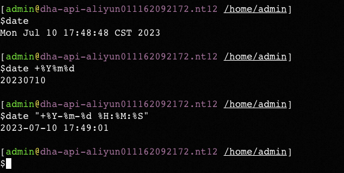
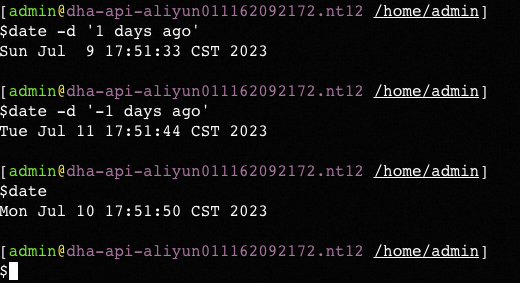
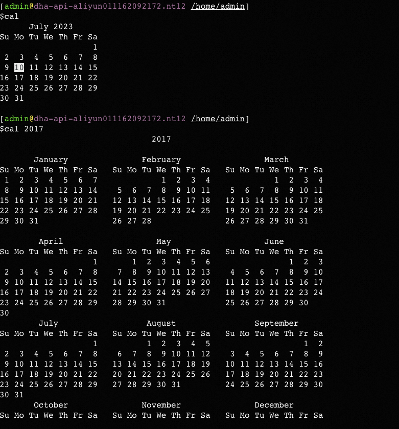

**<font style="color:#DF2A3F;">笔记来源：</font>**[**<font style="color:#DF2A3F;">3天搞定Linux，1天搞定Shell，清华学神带你通关</font>**](https://www.bilibili.com/video/BV1WY4y1H7d3?p=9&vd_source=e8046ccbdc793e09a75eb61fe8e84a30)


基本语法

```powershell
date [OPTION] [+FORMAT] 
```

选项说明 

+ `-d<时间字符串>`：显示指定的“时间字符串”表示的时间，而非当前时间 
+ `-s<日期时间> `：设置系统日期时间 

参数说明

+ `<+日期时间格式>`：指定显示时使用的日期时间格式 

 					

# 1 date 显示当前时间 
 基本语法	

```powershell
date        # (功能描述:显示当前时间)
date +%Y  	# (功能描述:显示当前年份) 
date +%m		# (功能描述:显示当前月份)
date +%d		# (功能描述:显示当前是哪一天) 
date "+%Y-%m-%d %H:%M:%S"  # (功能描述:显示年月日时分秒)
```

案例实操 

```powershell
# 582. (1)显示当前时间信息 
date 

# 583. (2)显示当前时间年月日 
date +%Y%m%d 

# 584. (3)显示当前时间年月日时分秒 
date "+%Y-%m-%d %H:%M:%S"
```

 				

# 2 date 显示非当前时间 
基本语法

```powershell
date -d '1 days ago'    # (功能描述:显示前一天时间)
date -d '-1 days ago' 	# (功能描述:显示明天时间) 
```

案例实操 

```powershell
# 585. (1)显示前一天
date -d '1 days ago'

# 586. (2)显示明天时间
date -d '-1 days ago'
```

	

# 3 date 设置系统时间 
基本语法

```powershell
date -s 字符串时间 
```

案例实操

```powershell
# 587. (1)设置系统当前时间 
date -s "2017-06-19 20:52:18" 
```

# 4 cal 查看日历 
基本语法

```powershell
cal [选项]  # (功能描述:不加选项，显示本月日历) 
```

选项说明 

+ 具体某一年：显示这一年的日历 

案例实操 

```powershell
# 588. (1)查看当前月的日历 
cal 

# 589. (2)查看 2017 年的日历
cal 2017 
```

				


